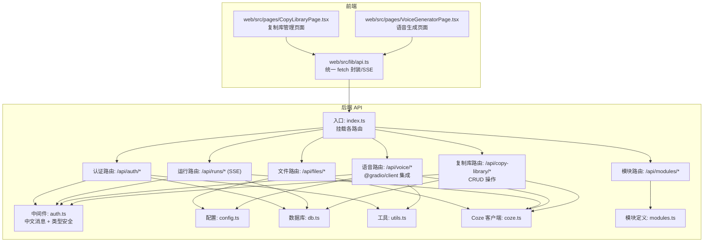
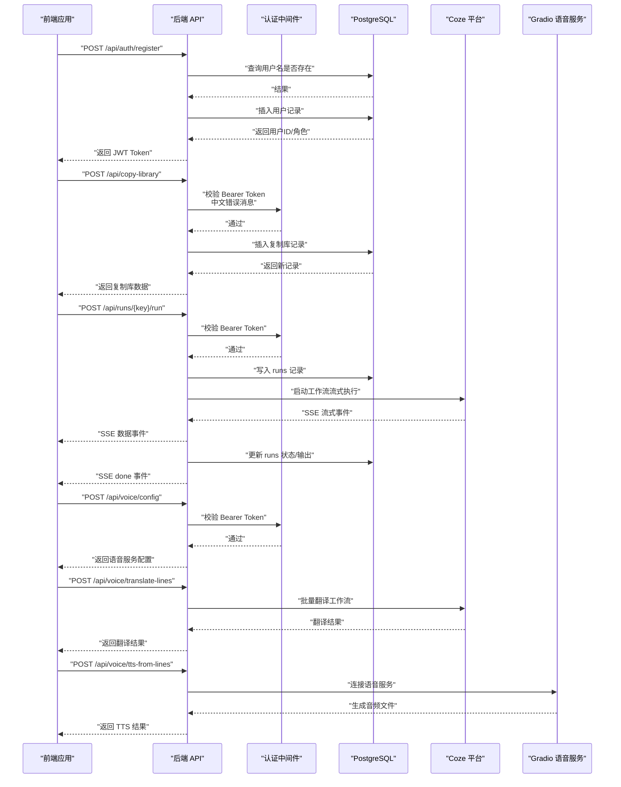
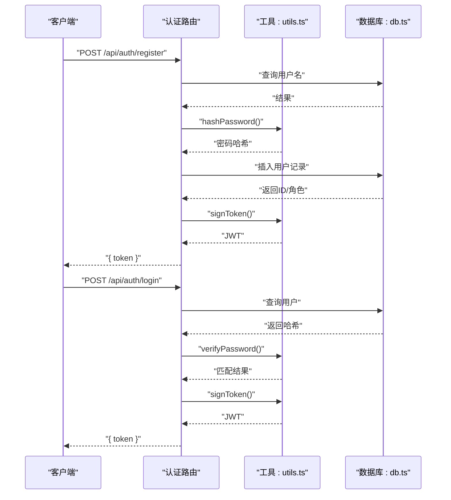
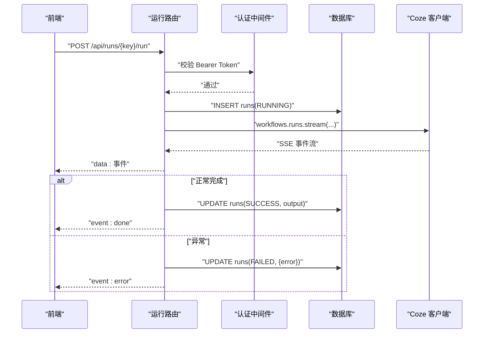
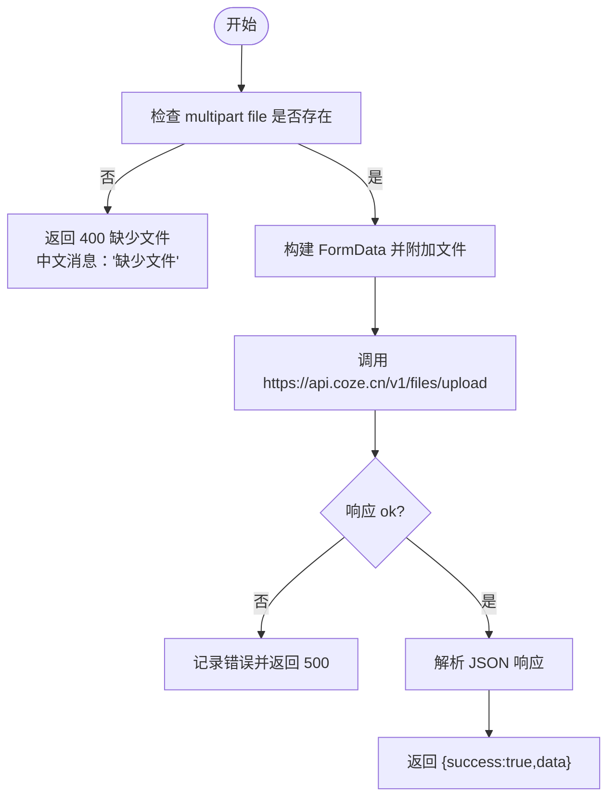
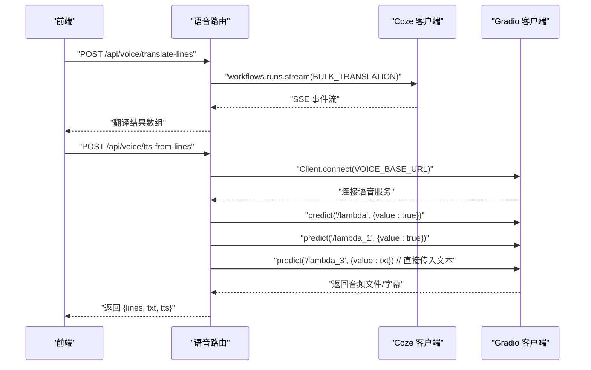
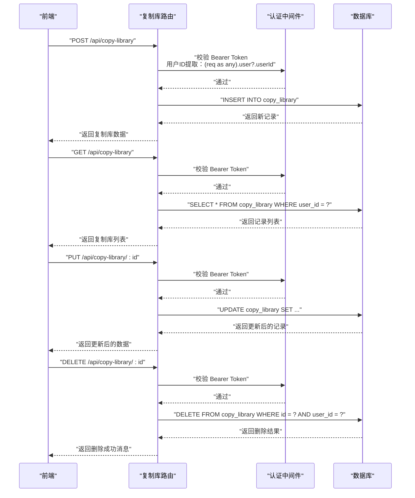
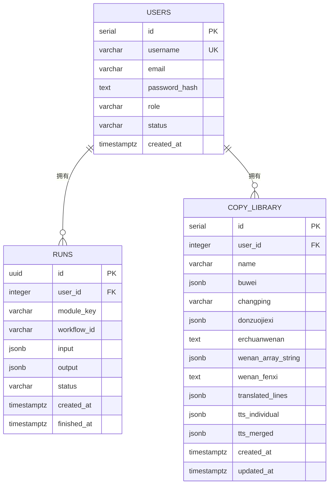
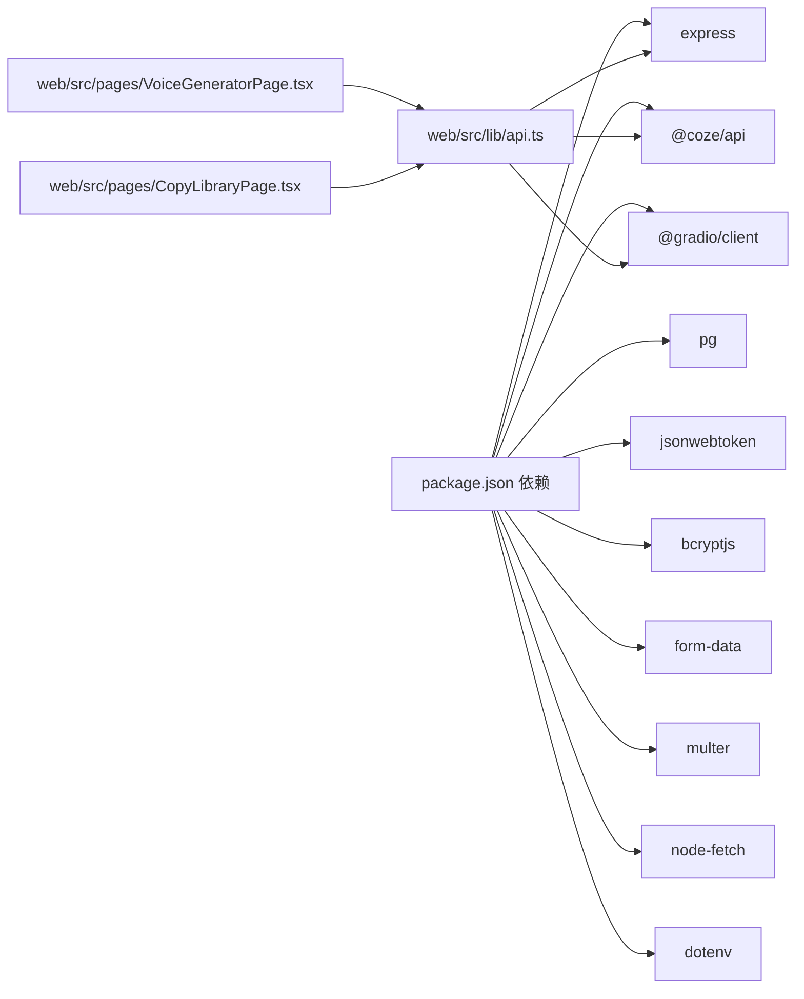

# API 接口文档

<cite>
**本文引用的文件**
- [api/src/index.ts](file://api/src/index.ts)
- [api/src/config.ts](file://api/src/config.ts)
- [api/src/db.ts](file://api/src/db.ts)
- [api/src/utils.ts](file://api/src/utils.ts)
- [api/src/middleware/auth.ts](file://api/src/middleware/auth.ts)
- [api/src/coze.ts](file://api/src/coze.ts)
- [api/src/modules.ts](file://api/src/modules.ts)
- [api/src/routes/auth.ts](file://api/src/routes/auth.ts)
- [api/src/routes/files.ts](file://api/src/routes/files.ts)
- [api/src/routes/modules.ts](file://api/src/routes/modules.ts)
- [api/src/routes/runs.ts](file://api/src/routes/runs.ts)
- [api/src/routes/voice.ts](file://api/src/routes/voice.ts)
- [api/src/routes/copyLibrary.ts](file://api/src/routes/copyLibrary.ts)
- [api/package.json](file://api/package.json)
- [web/src/lib/api.ts](file://web/src/lib/api.ts)
- [web/src/pages/VoiceGeneratorPage.tsx](file://web/src/pages/VoiceGeneratorPage.tsx)
- [web/src/pages/CopyLibraryPage.tsx](file://web/src/pages/CopyLibraryPage.tsx)
</cite>

## 更新摘要
**变更内容**
- 认证中间件更新：用户ID提取方式从 `req.user.userId` 改为 `(req as any).user?.userId`
- 国际化响应消息：所有错误消息已更新为中文，提升用户体验
- 复制库API接口增强：完善认证中间件、用户ID提取方式和错误处理
- 增强前端复制库页面，支持文案库的创建、编辑、删除和混剪使用

## 目录
1. [简介](#简介)
2. [项目结构](#项目结构)
3. [核心组件](#核心组件)
4. [架构总览](#架构总览)
5. [详细组件分析](#详细组件分析)
6. [依赖关系分析](#依赖关系分析)
7. [性能与并发特性](#性能与并发特性)
8. [故障排查指南](#故障排查指南)
9. [结论](#结论)
10. [附录](#附录)

## 简介
本文件为 Coze Workflow 的后端 API 接口文档，覆盖认证、工作流、文件上传、运行（SSE 流）、语音（翻译与 TTS）以及**新增的复制库管理**等模块的完整规范。文档提供：
- RESTful 接口定义（HTTP 方法、URL 模式、请求/响应结构）
- 认证方式与鉴权流程
- 错误处理策略与状态码语义
- 安全与速率限制建议
- 常见用例与客户端实现要点
- 调试工具与监控建议
- 版本信息与兼容性说明

## 项目结构
后端基于 Express 提供 REST API，路由按功能分层挂载在 /api/* 下；前端通过 web/src/lib/api.ts 统一发起请求并处理 SSE。**新增**复制库模块提供完整的文案库管理功能。

**图表来源**
- [api/src/index.ts:1-31](file://api/src/index.ts#L1-L31)
- [api/src/routes/auth.ts:1-115](file://api/src/routes/auth.ts#L1-L115)
- [api/src/routes/modules.ts:1-20](file://api/src/routes/modules.ts#L1-L20)
- [api/src/routes/files.ts:1-43](file://api/src/routes/files.ts#L1-L43)
- [api/src/routes/runs.ts:1-159](file://api/src/routes/runs.ts#L1-L159)
- [api/src/routes/voice.ts:1-421](file://api/src/routes/voice.ts#L1-L421)
- [api/src/routes/copyLibrary.ts:1-170](file://api/src/routes/copyLibrary.ts#L1-L170)
- [api/src/middleware/auth.ts:1-23](file://api/src/middleware/auth.ts#L1-L23)
- [api/src/config.ts:1-19](file://api/src/config.ts#L1-L19)
- [api/src/db.ts:1-52](file://api/src/db.ts#L1-L52)
- [api/src/utils.ts:1-21](file://api/src/utils.ts#L1-L21)
- [api/src/coze.ts:1-8](file://api/src/coze.ts#L1-L8)
- [api/src/modules.ts:1-29](file://api/src/modules.ts#L1-L29)
- [web/src/lib/api.ts:1-208](file://web/src/lib/api.ts#L1-L208)
- [web/src/pages/VoiceGeneratorPage.tsx:1-95](file://web/src/pages/VoiceGeneratorPage.tsx#L1-L95)
- [web/src/pages/CopyLibraryPage.tsx:1-181](file://web/src/pages/CopyLibraryPage.tsx#L1-L181)

**章节来源**
- [api/src/index.ts:1-31](file://api/src/index.ts#L1-L31)

## 核心组件
- 应用入口与路由挂载：在入口文件中启用 CORS、JSON 解析、健康检查，并将各子路由挂载至 /api/*。
- 配置系统：读取环境变量并校验必需项（COZE_API_TOKEN、DATABASE_URL、JWT_SECRET、VOICE_BASE_URL），同时暴露端口与服务地址。
- 数据库：使用 PostgreSQL 连接池，初始化 users、runs 和 **新增的 copy_library** 表。
- 认证中间件：基于 JWT 的 Bearer Token 鉴权，支持用户信息注入到请求上下文，**更新**为中文错误消息。
- 工具函数：密码哈希/校验、JWT 签发/校验。
- Coze 客户端：封装 @coze/api，统一访问 Coze 平台能力。
- 模块定义：集中管理可用工作流模块及其 workflow_id。
- **新增** Gradio 客户端：封装 @gradio/client，用于语音生成服务集成。
- **新增** 复制库模块：提供完整的文案库 CRUD 操作，支持多维度文案管理。

**章节来源**
- [api/src/index.ts:1-31](file://api/src/index.ts#L1-L31)
- [api/src/config.ts:1-19](file://api/src/config.ts#L1-L19)
- [api/src/db.ts:1-52](file://api/src/db.ts#L1-L52)
- [api/src/middleware/auth.ts:1-23](file://api/src/middleware/auth.ts#L1-L23)
- [api/src/utils.ts:1-21](file://api/src/utils.ts#L1-L21)
- [api/src/coze.ts:1-8](file://api/src/coze.ts#L1-L8)
- [api/src/modules.ts:1-29](file://api/src/modules.ts#L1-L29)

## 架构总览
后端采用"路由层-业务层-数据层-外部服务"的分层设计。前端通过统一的 fetch 封装调用后端 API，其中运行接口采用 Server-Sent Events（SSE）推送增量结果。语音接口现集成了 Gradio 客户端，提供更强大的语音生成能力。**新增**复制库模块提供完整的文案库管理功能，支持多维度文案的创建、编辑、删除和查询。

**图表来源**
- [api/src/routes/auth.ts:1-115](file://api/src/routes/auth.ts#L1-L115)
- [api/src/routes/copyLibrary.ts:1-170](file://api/src/routes/copyLibrary.ts#L1-L170)
- [api/src/routes/runs.ts:1-159](file://api/src/routes/runs.ts#L1-L159)
- [api/src/routes/voice.ts:1-421](file://api/src/routes/voice.ts#L1-L421)
- [api/src/middleware/auth.ts:1-23](file://api/src/middleware/auth.ts#L1-L23)
- [api/src/db.ts:1-52](file://api/src/db.ts#L1-L52)
- [api/src/coze.ts:1-8](file://api/src/coze.ts#L1-L8)

## 详细组件分析

### 认证接口
- 健康检查
  - 方法与路径：GET /health
  - 成功响应：返回 { success: true }
- 注册
  - 方法与路径：POST /api/auth/register
  - 请求体：{ username, email?, password }
  - 成功响应：{ success: true, data: { token } }
  - 失败场景：缺少字段（400，中文消息："缺少必填字段"）、用户名已存在（409，中文消息："账号已存在"）
- 登录
  - 方法与路径：POST /api/auth/login
  - 请求体：{ username, password }
  - 成功响应：{ success: true, data: { token } }
  - 失败场景：账号或密码错误（401，中文消息："账号或密码错误"）
- 重置密码
  - 方法与路径：POST /api/auth/reset-password
  - 请求头：Authorization: Bearer {token}
  - 请求体：{ username?, newPassword }
  - 成功响应：{ success: true, message: "密码重置成功" }
  - 失败场景：缺少新密码（400，中文消息："缺少新密码"）、无权限（403）、用户不存在（404，中文消息："用户不存在"）、登录失效（401，中文消息："登录失效"）
- 当前用户
  - 方法与路径：GET /api/auth/me
  - 请求头：Authorization: Bearer {token}
  - 成功响应：{ success: true, data: { id, username, email, role } }
  - 失败场景：登录失效（401，中文消息："登录失效"）

认证流程（登录/注册）时序

**图表来源**
- [api/src/routes/auth.ts:1-115](file://api/src/routes/auth.ts#L1-L115)
- [api/src/utils.ts:1-21](file://api/src/utils.ts#L1-L21)
- [api/src/db.ts:1-52](file://api/src/db.ts#L1-L52)

**章节来源**
- [api/src/routes/auth.ts:1-115](file://api/src/routes/auth.ts#L1-L115)
- [api/src/middleware/auth.ts:1-23](file://api/src/middleware/auth.ts#L1-L23)
- [api/src/utils.ts:1-21](file://api/src/utils.ts#L1-L21)
- [api/src/db.ts:1-52](file://api/src/db.ts#L1-L52)

### 工作流接口
- 获取模块列表
  - 方法与路径：GET /api/modules/
  - 成功响应：{ success: true, data: ModuleInfo[] }
- 获取指定模块
  - 方法与路径：GET /api/modules/:key
  - 成功响应：{ success: true, data: ModuleInfo }
- 运行工作流（SSE）
  - 方法与路径：POST /api/runs/:key/run
  - 请求头：Authorization: Bearer {token}, Content-Type: application/json
  - 请求体：{ parameters: Record<string, unknown> }
  - 成功响应：HTTP 200，SSE 流
    - 事件类型：data（携带增量事件）、done（结束）、error（异常）
  - 失败场景：模块不存在（404，中文消息："模块不存在"）、缺少参数（400，中文消息："缺少参数"）、登录失效（401，中文消息："登录失效"）
  - 数据持久化：首次写入 runs 记录，流结束后更新状态与输出

运行接口（SSE）时序

**图表来源**
- [api/src/routes/runs.ts:1-159](file://api/src/routes/runs.ts#L1-L159)
- [api/src/middleware/auth.ts:1-23](file://api/src/middleware/auth.ts#L1-L23)
- [api/src/db.ts:1-52](file://api/src/db.ts#L1-L52)
- [api/src/coze.ts:1-8](file://api/src/coze.ts#L1-L8)

**章节来源**
- [api/src/routes/modules.ts:1-20](file://api/src/routes/modules.ts#L1-L20)
- [api/src/routes/runs.ts:1-159](file://api/src/routes/runs.ts#L1-L159)
- [api/src/modules.ts:1-29](file://api/src/modules.ts#L1-L29)

### 文件接口
- 上传文件
  - 方法与路径：POST /api/files/upload
  - 请求头：Authorization: Bearer {token}, Content-Type: multipart/form-data
  - 表单字段：file（二进制文件）
  - 成功响应：{ success: true, data: Coze 文件对象 }
  - 失败场景：缺少文件（400，中文消息："缺少文件"）、Coze 上传失败（500）

文件上传流程

**图表来源**
- [api/src/routes/files.ts:1-43](file://api/src/routes/files.ts#L1-L43)
- [api/src/config.ts:1-19](file://api/src/config.ts#L1-L19)

**章节来源**
- [api/src/routes/files.ts:1-43](file://api/src/routes/files.ts#L1-L43)
- [api/src/config.ts:1-19](file://api/src/config.ts#L1-L19)

### 语音接口
**更新** 语音接口现已集成 @gradio/client，提供更强大的语音生成能力。TTS 生成接口现在使用直接文本输入而非文件上传，提高了可靠性。

- 获取语音服务配置
  - 方法与路径：GET /api/voice/config
  - 请求头：Authorization: Bearer {token}
  - 成功响应：{ success: true, data: { studioUrl, apiUrl, baseUrl } }
  - 失败场景：未配置 VOICE_BASE_URL（500，中文消息："VOICE_BASE_URL 未配置，请检查 api/.env 或 config.ts"）
- 英文行翻译（批量）
  - 方法与路径：POST /api/voice/translate-lines
  - 请求头：Authorization: Bearer {token}
  - 请求体：{ lines?: string[]; text?: string }
  - 成功响应：{ success: true, data: { sourceLines, translatedLines, txt }, debugId?, debugUrl? }
  - 失败场景：未提取到英文数组（400，中文消息："未从文案结果中提取到 wenan_Array_string"）、内部错误（500）
- 直接基于英文行生成语音（MP3+SRT）
  - 方法与路径：POST /api/voice/tts-from-lines
  - 请求头：Authorization: Bearer {token}
  - 请求体：{ lines: string[] }
  - 成功响应：{ success: true, data: { lines, txt, tts }, debugId?, debugUrl? }
  - 失败场景：缺少 lines（400，中文消息："缺少 lines 参数（英文数组）"）、内部错误（500）
- 调试记录
  - 方法与路径：GET /api/voice/debug 与 GET /api/voice/debug/:id
  - 请求头：Authorization: Bearer {token}
  - 成功响应：列出调试记录或单条记录

语音工作流（翻译+TTS）时序

**图表来源**
- [api/src/routes/voice.ts:1-421](file://api/src/routes/voice.ts#L1-L421)
- [api/src/coze.ts:1-8](file://api/src/coze.ts#L1-L8)

**章节来源**
- [api/src/routes/voice.ts:1-421](file://api/src/routes/voice.ts#L1-L421)

### 复制库接口
**新增** 复制库模块提供完整的文案库管理功能，支持多维度文案的创建、编辑、删除和查询。该模块基于 JWT 认证，所有操作都需要有效的用户会话。

- 获取复制库列表
  - 方法与路径：GET /api/copy-library
  - 请求头：Authorization: Bearer {token}
  - 成功响应：{ success: true, data: CopyLibraryItem[] }
  - 失败场景：登录失效（401，中文消息："登录失效"）、数据库查询错误（500，中文消息："Failed to get copy library"）
- 获取单个复制库详情
  - 方法与路径：GET /api/copy-library/:id
  - 请求头：Authorization: Bearer {token}
  - 成功响应：{ success: true, data: CopyLibraryItem }
  - 失败场景：复制库不存在（404，中文消息："Copy not found"）、登录失效（401，中文消息："登录失效"）、数据库查询错误（500，中文消息："Failed to get copy detail"）
- 创建复制库
  - 方法与路径：POST /api/copy-library
  - 请求头：Authorization: Bearer {token}, Content-Type: application/json
  - 请求体：CopyLibraryItem（包含所有字段）
  - 成功响应：{ success: true, data: CopyLibraryItem }
  - 失败场景：缺少必要字段（400，中文消息："缺少必填字段"）、登录失效（401，中文消息："登录失效"）、数据库插入错误（500，中文消息："Failed to create copy"）
- 更新复制库
  - 方法与路径：PUT /api/copy-library/:id
  - 请求头：Authorization: Bearer {token}, Content-Type: application/json
  - 请求体：CopyLibraryItem（部分字段可选）
  - 成功响应：{ success: true, data: CopyLibraryItem }
  - 失败场景：复制库不存在（404，中文消息："Copy not found"）、登录失效（401，中文消息："登录失效"）、数据库更新错误（500，中文消息："Failed to update copy"）
- 删除复制库
  - 方法与路径：DELETE /api/copy-library/:id
  - 请求头：Authorization: Bearer {token}
  - 成功响应：{ success: true, message: "Deleted successfully" }
  - 失败场景：复制库不存在（404，中文消息："Copy not found"）、登录失效（401，中文消息："登录失效"）、数据库删除错误（500，中文消息："Failed to delete copy"）

**更新** 复制库API接口的认证中间件和用户ID提取方式

复制库数据模型
- 复制库表 copy_library
  - 字段：id（主键）、user_id（外键）、name（名称）、buwei（部位，JSONB）、changping（产品，字符串）、donzuojiexi（动作解析，JSONB）、erchuanwenan（二次文案，文本）、wenan_array_string（文案数组字符串，JSONB）、wenan_fenxi（文案分析，文本）、translated_lines（翻译行，JSONB）、tts_individual（独立语音，JSONB）、tts_merged（合并语音，JSONB）、created_at（创建时间）、updated_at（更新时间）

复制库CRUD操作时序

**图表来源**
- [api/src/routes/copyLibrary.ts:1-170](file://api/src/routes/copyLibrary.ts#L1-L170)
- [api/src/middleware/auth.ts:1-23](file://api/src/middleware/auth.ts#L1-L23)
- [api/src/db.ts:34-52](file://api/src/db.ts#L34-L52)

**章节来源**
- [api/src/routes/copyLibrary.ts:1-170](file://api/src/routes/copyLibrary.ts#L1-L170)
- [api/src/db.ts:34-52](file://api/src/db.ts#L34-L52)

### 数据模型
- 用户表 users
  - 字段：id（主键）、username（唯一）、email、password_hash、role、status、created_at
- 运行记录 runs
  - 字段：id（UUID 主键）、user_id（外键）、module_key、workflow_id、input（JSONB）、output（JSONB）、status、created_at、finished_at
- **新增** 复制库表 copy_library
  - 字段：id（主键）、user_id（外键）、name（名称）、buwei（部位，JSONB）、changping（产品，字符串）、donzuojiexi（动作解析，JSONB）、erchuanwenan（二次文案，文本）、wenan_array_string（文案数组字符串，JSONB）、wenan_fenxi（文案分析，文本）、translated_lines（翻译行，JSONB）、tts_individual（独立语音，JSONB）、tts_merged（合并语音，JSONB）、created_at（创建时间）、updated_at（更新时间）

**图表来源**
- [api/src/db.ts:12-52](file://api/src/db.ts#L12-L52)

**章节来源**
- [api/src/db.ts:12-52](file://api/src/db.ts#L12-L52)

## 依赖关系分析
**更新** 新增 @gradio/client 依赖，用于语音生成服务集成。**新增**复制库模块依赖数据库连接池进行数据持久化。

- 后端依赖
  - @coze/api：调用 Coze 工作流与文件能力
  - **@gradio/client：** 调用 Gradio 语音服务，支持语音合成与音频处理
  - express：Web 服务器与路由
  - pg：PostgreSQL 连接池
  - bcryptjs/jsonwebtoken：密码与 JWT
  - multer/form-data/node-fetch：文件上传
  - dotenv：环境变量加载
- 前端依赖
  - web/src/lib/api.ts：统一 fetch 封装、SSE 读取、本地存储 token、**复制库 API 函数**
  - web/src/pages/VoiceGeneratorPage.tsx：语音生成页面，展示语音服务配置
  - **web/src/pages/CopyLibraryPage.tsx：** 复制库管理页面，展示和操作复制库数据

**图表来源**
- [api/package.json:11-34](file://api/package.json#L11-L34)
- [web/src/lib/api.ts:1-208](file://web/src/lib/api.ts#L1-L208)
- [web/src/pages/VoiceGeneratorPage.tsx:1-95](file://web/src/pages/VoiceGeneratorPage.tsx#L1-L95)
- [web/src/pages/CopyLibraryPage.tsx:1-181](file://web/src/pages/CopyLibraryPage.tsx#L1-L181)

**章节来源**
- [api/package.json:11-34](file://api/package.json#L11-L34)
- [web/src/lib/api.ts:1-208](file://web/src/lib/api.ts#L1-L208)
- [web/src/pages/VoiceGeneratorPage.tsx:1-95](file://web/src/pages/VoiceGeneratorPage.tsx#L1-L95)
- [web/src/pages/CopyLibraryPage.tsx:1-181](file://web/src/pages/CopyLibraryPage.tsx#L1-L181)

## 性能与并发特性
**更新** 语音接口现集成了 Gradio 客户端，需要考虑语音服务的并发处理能力。**新增**复制库模块涉及数据库的频繁读写操作，需要注意性能优化。

- 并发与流式处理
  - 运行接口采用 SSE，边运行边推送事件，适合长耗时任务的实时反馈。
  - 建议前端以流式读取方式消费事件，避免阻塞。
- 数据库
  - 使用连接池，注意高并发下连接数与查询复杂度控制。
  - runs 查询默认限制数量，避免一次性返回过多数据。
  - **复制库模块**：所有操作都基于用户 ID 进行过滤，确保数据隔离；查询按更新时间倒序排列，提高用户体验。
- 文件上传
  - 服务端对 JSON 体大小限制，上传文件通过 multipart 传输，注意带宽与磁盘 IO。
- 外部服务
  - 对 Coze 与 Gradio 的调用可能成为瓶颈，建议增加超时与重试策略（当前实现未内置重试）。
  - Gradio 语音服务的并发连接数有限，需要合理控制请求频率。
- **复制库模块性能优化建议**
  - 复制库列表查询使用 LIMIT 和 OFFSET 进行分页
  - 复制库详情查询使用索引优化
  - JSONB 字段查询使用适当的索引策略

## 故障排查指南
**更新** 新增 Gradio 语音服务相关的故障排查指导。**新增**复制库模块相关的故障排查指导。

- 常见错误与定位
  - 401 未授权：检查 Authorization 头是否正确携带 Bearer Token；确认 token 未过期。
  - 400 缺少参数：检查请求体字段是否完整（如注册缺少用户名/密码、运行缺少 parameters、翻译缺少 lines/text、复制库缺少必要字段）。
  - 404 复制库不存在：确认复制库 ID 是否正确，检查用户权限。
  - 404 模块不存在：确认模块 key 是否正确。
  - 500 文件上传失败：查看后端日志中 Coze 返回的错误文本，确认 COZE_API_TOKEN 与网络连通性。
  - 500 语音服务未配置：检查 VOICE_BASE_URL 是否设置。
  - **500 Gradio 连接失败：** 检查语音服务地址可达性，确认 Gradio 服务正常运行。
  - **500 TTS 生成失败：** 查看调试记录中的详细步骤，确认语音服务参数配置正确。
  - **500 复制库操作失败：** 检查数据库连接状态，确认 JSONB 字段格式正确，查看具体错误日志。
- 调试工具与监控
  - 前端可使用浏览器开发者工具 Network 面板观察 SSE 事件与响应。
  - 后端可在 /api/voice/debug 与 /api/voice/debug/:id 查看调试记录，包含每一步的 payload 与时间戳。
  - **后端可在 /api/copy-library 路由中查看复制库操作日志。**
  - 建议在生产环境接入日志聚合与指标监控（如请求耗时、错误率、SSE 连接数、Gradio 服务状态、复制库操作统计）。

**章节来源**
- [api/src/routes/auth.ts:1-115](file://api/src/routes/auth.ts#L1-L115)
- [api/src/routes/runs.ts:1-159](file://api/src/routes/runs.ts#L1-L159)
- [api/src/routes/files.ts:1-43](file://api/src/routes/files.ts#L1-L43)
- [api/src/routes/voice.ts:1-421](file://api/src/routes/voice.ts#L1-L421)
- [api/src/routes/copyLibrary.ts:1-170](file://api/src/routes/copyLibrary.ts#L1-L170)

## 结论
本 API 文档覆盖了认证、工作流、文件、运行（SSE）、语音（翻译/TTS）以及**新增的复制库管理**的完整接口规范。通过明确的请求/响应结构、认证方式与错误处理策略，结合调试与监控建议，可帮助开发者快速集成与稳定运行。**最新更新**集成了 @gradio/client，提供了更强大的语音生成能力，TTS 生成接口现在使用直接文本输入而非文件上传，显著提高了可靠性。**新增**复制库模块提供了完整的文案库管理功能，支持多维度文案的创建、编辑、删除和查询，为后续的混剪等功能奠定了基础。**更新**认证中间件采用中文错误消息，提升了用户体验。建议在现有分层架构上新增路由与中间件，保持一致的错误与响应格式。

## 附录

### 认证与安全
- 认证方式：JWT Bearer Token
- 令牌有效期：7 天
- 建议：HTTPS、最小权限原则、定期轮换密钥、审计日志
- **复制库安全**：所有操作都基于用户 ID 进行过滤，确保数据隔离
- **更新** 认证中间件：用户ID提取方式从 `req.user.userId` 改为 `(req as any).user?.userId`

**章节来源**
- [api/src/utils.ts:14-20](file://api/src/utils.ts#L14-L20)
- [api/src/middleware/auth.ts:8-22](file://api/src/middleware/auth.ts#L8-L22)

### 错误处理策略
- 统一响应结构：{ success: boolean, message?, data?, debugId?, debugUrl? }
- 状态码语义：400/401/403/404/409/500
- SSE 异常：通过 event: error 推送错误消息；若已有有效输出则标记为 SUCCESS 并附加 warning
- **语音接口异常：** 支持详细的调试记录，包含每个步骤的输入输出与时间戳
- **复制库接口异常：** 统一的错误处理机制，包含中文错误消息（经过编码转换）
- **更新** 所有错误消息已更新为中文，提升用户体验

**章节来源**
- [api/src/routes/runs.ts:124-156](file://api/src/routes/runs.ts#L124-L156)
- [api/src/routes/auth.ts:15-24](file://api/src/routes/auth.ts#L15-L24)
- [api/src/routes/copyLibrary.ts:19-21](file://api/src/routes/copyLibrary.ts#L19-L21)

### 速率限制与配额
- 当前实现未内置速率限制
- 建议：在网关或反向代理层添加限流策略；针对 Coze 与 Gradio 的调用增加超时与退避重试
- **Gradio 语音服务：** 需要特别注意并发连接数限制，建议实现队列机制
- **复制库模块：** 建议实现基本的速率限制，防止恶意刷取

### 版本信息
- 后端版本：0.1.0（package.json 中声明）
- 外部依赖：@coze/api 1.3.1、**@gradio/client 1.12.0**、express 4.x、pg 8.x 等

**章节来源**
- [api/package.json:2-4](file://api/package.json#L2-L4)

### 客户端实现要点
- 统一 fetch 封装：自动注入 Content-Type 与 Authorization 头
- SSE 处理：逐条解析 data 与 event 行，分别触发消息回调与完成/错误回调
- 本地存储：使用 localStorage 存储 token，401 时清理并触发登出回调
- **语音服务集成：** 前端页面可直接访问语音服务的 Studio 和 API 页面
- **复制库集成：** 前端页面可直接调用复制库 API，支持文案库的创建、编辑、删除和查询

**章节来源**
- [web/src/lib/api.ts:13-36](file://web/src/lib/api.ts#L13-L36)
- [web/src/lib/api.ts:58-115](file://web/src/lib/api.ts#L58-L115)
- [web/src/lib/api.ts:182-208](file://web/src/lib/api.ts#L182-L208)
- [web/src/pages/VoiceGeneratorPage.tsx:1-95](file://web/src/pages/VoiceGeneratorPage.tsx#L1-L95)
- [web/src/pages/CopyLibraryPage.tsx:1-181](file://web/src/pages/CopyLibraryPage.tsx#L1-L181)

### 运行接口（SSE）事件流
- 数据事件：data: {...}
- 结束事件：event: done，data: { runId }
- 错误事件：event: error，data: { message }

**章节来源**
- [api/src/routes/runs.ts:111-123](file://api/src/routes/runs.ts#L111-L123)
- [api/src/routes/runs.ts:141-155](file://api/src/routes/runs.ts#L141-L155)
- [web/src/lib/api.ts:94-113](file://web/src/lib/api.ts#L94-L113)

### 语音调试记录
- 支持查看调试列表与单条记录，便于定位翻译与 TTS 步骤问题
- **调试记录包含：** 输入参数、中间步骤、输出结果、错误信息与时间戳

**章节来源**
- [api/src/routes/voice.ts:283-356](file://api/src/routes/voice.ts#L283-L356)
- [api/src/routes/voice.ts:262-328](file://api/src/routes/voice.ts#L262-L328)
- [api/src/routes/voice.ts:330-421](file://api/src/routes/voice.ts#L330-L421)

### Gradio 语音服务集成
**新增** 语音接口现集成了 @gradio/client，提供以下功能：
- 语音服务配置获取
- 批量英文行翻译
- 直接语音生成（MP3+SRT）
- 详细的调试记录与步骤追踪
- 支持多种语音参数配置

**章节来源**
- [api/src/routes/voice.ts:1-421](file://api/src/routes/voice.ts#L1-L421)
- [api/src/config.ts:1-19](file://api/src/config.ts#L1-L19)

### 复制库前端页面
**新增** 复制库页面提供完整的文案库管理界面，支持：
- 复制库列表展示，显示产品、部位、动作解析、翻译、语音等信息
- 新建复制库功能，支持基本的文案库创建
- 删除复制库功能，支持安全删除
- 用于混剪功能，支持将复制库数据传递给混剪模块

**章节来源**
- [web/src/pages/CopyLibraryPage.tsx:1-181](file://web/src/pages/CopyLibraryPage.tsx#L1-L181)
- [web/src/lib/api.ts:182-208](file://web/src/lib/api.ts#L182-L208)

### 复制库数据模型详解
**新增** 复制库表结构支持多维度文案管理：
- 基础信息：name（名称）、user_id（用户关联）
- 产品信息：changping（产品名称）
- 动作解析：buwei（部位数组）、donzuojiexi（动作解析数组）
- 文案内容：erchuanwenan（二次文案）、wenan_array_string（文案数组）、wenan_fenxi（文案分析）
- 翻译内容：translated_lines（翻译行数组）
- 语音内容：tts_individual（独立语音数组）、tts_merged（合并语音对象）
- 时间戳：created_at、updated_at

**章节来源**
- [api/src/db.ts:34-52](file://api/src/db.ts#L34-L52)

### 认证中间件更新详情
**更新** 认证中间件的关键变更：
- 用户ID提取方式：从 `req.user.userId` 改为 `(req as any).user?.userId`
- 错误消息：全部更新为中文，提升用户体验
- 类型安全性：保持原有的 AuthRequest 接口定义

**章节来源**
- [api/src/middleware/auth.ts:1-23](file://api/src/middleware/auth.ts#L1-L23)

### 复制库API接口增强
**更新** 复制库API接口的增强：
- 认证中间件：使用相同的中文错误消息策略
- 用户ID提取：采用类型断言方式 `(req as any).user?.userId`
- 错误处理：统一的中文错误消息格式
- 数据库操作：完整的CRUD操作，支持多维度文案管理

**章节来源**
- [api/src/routes/copyLibrary.ts:1-170](file://api/src/routes/copyLibrary.ts#L1-L170)