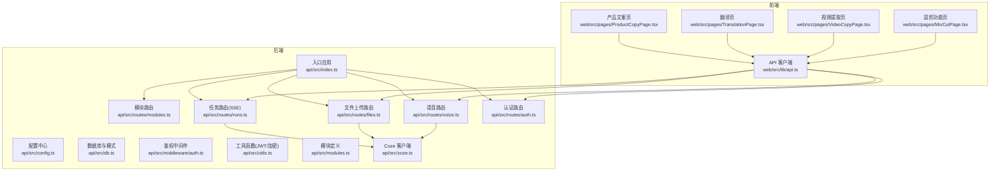
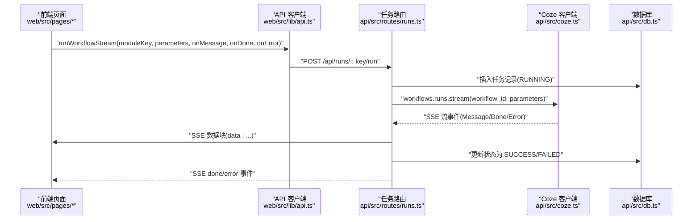
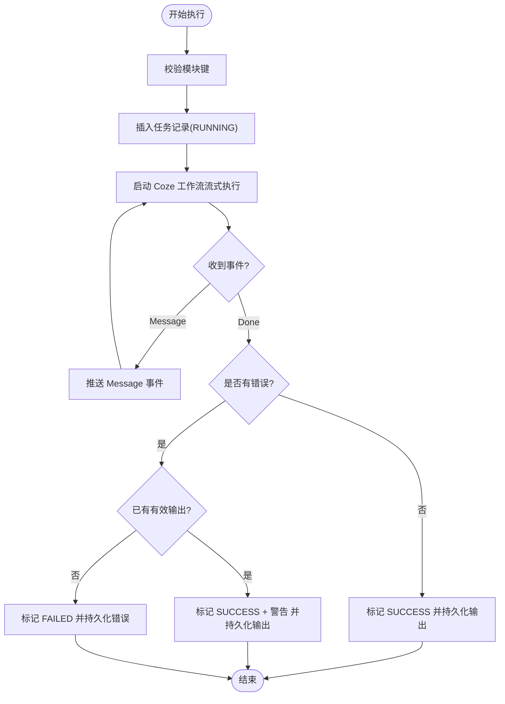
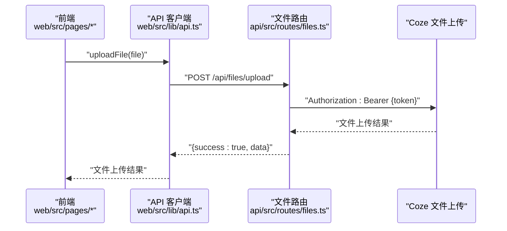
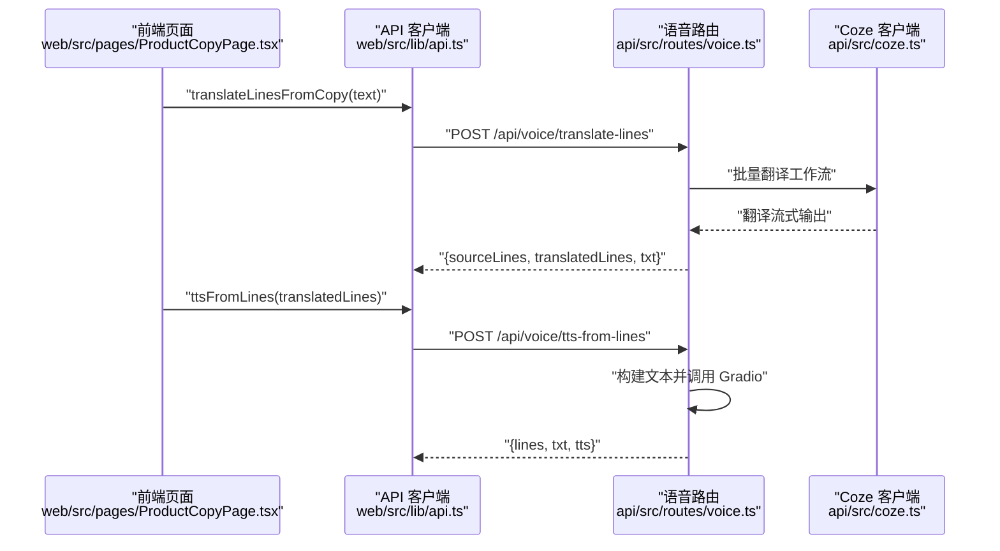
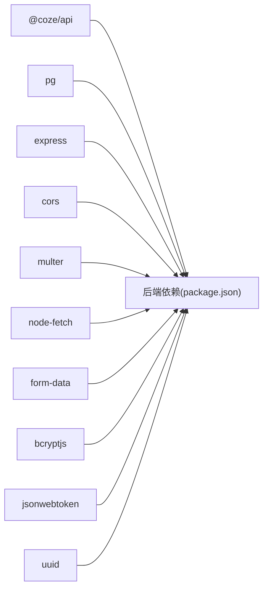

# 工作流模块接口

<cite>
**本文引用的文件**
- [api/src/index.ts](file://api/src/index.ts)
- [api/src/config.ts](file://api/src/config.ts)
- [api/src/db.ts](file://api/src/db.ts)
- [api/src/middleware/auth.ts](file://api/src/middleware/auth.ts)
- [api/src/utils.ts](file://api/src/utils.ts)
- [api/src/modules.ts](file://api/src/modules.ts)
- [api/src/coze.ts](file://api/src/coze.ts)
- [api/src/routes/modules.ts](file://api/src/routes/modules.ts)
- [api/src/routes/runs.ts](file://api/src/routes/runs.ts)
- [api/src/routes/files.ts](file://api/src/routes/files.ts)
- [api/src/routes/voice.ts](file://api/src/routes/voice.ts)
- [api/src/routes/auth.ts](file://api/src/routes/auth.ts)
- [web/src/lib/api.ts](file://web/src/lib/api.ts)
- [web/src/pages/ProductCopyPage.tsx](file://web/src/pages/ProductCopyPage.tsx)
- [web/src/pages/TranslationPage.tsx](file://web/src/pages/TranslationPage.tsx)
- [web/src/pages/VideoCopyPage.tsx](file://web/src/pages/VideoCopyPage.tsx)
- [web/src/pages/MixCutPage.tsx](file://web/src/pages/MixCutPage.tsx)
</cite>

## 更新摘要
**所做更改**
- 增强 runWorkflowStream API 函数，支持返回 runId 和 warning 信息
- 更新任务完成回调机制，提供更好的调试能力
- 完善工作流执行状态跟踪，支持警告信息的传递
- 更新混剪功能页面以利用新的调试信息显示能力

## 目录
1. [简介](#简介)
2. [项目结构](#项目结构)
3. [核心组件](#核心组件)
4. [架构总览](#架构总览)
5. [详细组件分析](#详细组件分析)
6. [依赖关系分析](#依赖关系分析)
7. [性能考虑](#性能考虑)
8. [故障排查指南](#故障排查指南)
9. [结论](#结论)
10. [附录](#附录)

## 简介
本文件为工作流模块接口的详细 API 文档，覆盖多模态工作流相关接口，包括图像生成（详情图）、视频处理（视频提取文案）、文案创作（产品文案生成、产品文案生成V2）、翻译服务等模块。文档重点说明：
- 每个工作流模块的请求参数、处理流程、响应格式与状态管理
- 工作流执行的状态跟踪、进度报告、错误处理机制
- 各类工作流场景的完整示例、参数配置选项与性能优化建议
- 工作流与 Coze AI 服务的集成方式与数据流转过程

## 项目结构
后端采用 Express 应用，通过路由模块组织各业务域；前端基于 React + Ant Design，通过统一的 API 客户端封装与后端交互。



**图表来源**
- [api/src/index.ts:1-29](file://api/src/index.ts#L1-L29)
- [api/src/routes/runs.ts:1-159](file://api/src/routes/runs.ts#L1-L159)
- [api/src/routes/files.ts:1-43](file://api/src/routes/files.ts#L1-L43)
- [api/src/routes/voice.ts:1-404](file://api/src/routes/voice.ts#L1-L404)
- [web/src/lib/api.ts:1-163](file://web/src/lib/api.ts#L1-L163)

**章节来源**
- [api/src/index.ts:1-29](file://api/src/index.ts#L1-L29)
- [api/src/config.ts:1-19](file://api/src/config.ts#L1-L19)
- [api/src/db.ts:1-35](file://api/src/db.ts#L1-L35)

## 核心组件
- 模块定义与路由
  - 模块键与工作流 ID 映射：详情图（有/无参考图）、视频提取文案、产品文案生成、产品文案生成V2（混剪功能）、翻译功能
  - 模块查询接口：获取全部模块与指定模块详情
- 任务执行与状态管理
  - 任务列表与详情：按用户维度查询最近任务
  - 任务执行：SSE 流式返回，支持 Done 与 Error 事件，数据库持久化状态与输出
  - **更新** 完成回调增强：支持返回 runId 和 warning 信息，提供更好的调试能力
- 文件上传
  - 前端上传文件经后端转发至 Coze 文件上传接口
- 语音与翻译管线
  - 独立英译：从产品文案结果中提取英文行，调用批量翻译工作流
  - TTS：将英文行转为文本，调用 Gradio 语音服务生成 MP3+SRT
- 鉴权与用户管理
  - JWT 鉴权中间件
  - 用户注册、登录、重置密码、个人信息查询

**章节来源**
- [api/src/modules.ts:1-35](file://api/src/modules.ts#L1-L35)
- [api/src/routes/modules.ts:1-20](file://api/src/routes/modules.ts#L1-L20)
- [api/src/routes/runs.ts:13-159](file://api/src/routes/runs.ts#L13-L159)
- [api/src/routes/files.ts:10-40](file://api/src/routes/files.ts#L10-L40)
- [api/src/routes/voice.ts:69-404](file://api/src/routes/voice.ts#L69-L404)
- [api/src/middleware/auth.ts:8-22](file://api/src/middleware/auth.ts#L8-L22)
- [api/src/routes/auth.ts:8-115](file://api/src/routes/auth.ts#L8-L115)

## 架构总览
后端通过 Express 路由暴露 REST 接口，工作流执行采用 SSE（Server-Sent Events）进行流式数据传输。前端通过统一 API 客户端发起请求，解析事件并更新 UI。



**图表来源**
- [web/src/lib/api.ts:58-115](file://web/src/lib/api.ts#L58-L115)
- [api/src/routes/runs.ts:55-157](file://api/src/routes/runs.ts#L55-L157)
- [api/src/coze.ts:4-7](file://api/src/coze.ts#L4-L7)
- [api/src/db.ts:10-35](file://api/src/db.ts#L10-L35)

## 详细组件分析

### 模块与工作流映射
- 模块键与工作流 ID 的对应关系在模块定义文件中集中维护，便于扩展与统一管理
- 模块查询接口用于前端展示可用模块与名称
- **更新** 产品文案生成V2工作流现已正确显示，解决了字符编码导致的名称乱码问题
- **新增** 混剪功能模块（product-copy-v2）现已加入模块定义，提供完整的混剪工作流支持

**章节来源**
- [api/src/modules.ts:1-35](file://api/src/modules.ts#L1-L35)
- [api/src/routes/modules.ts:6-17](file://api/src/routes/modules.ts#L6-L17)

### 任务执行与状态管理（SSE）
- 请求路径
  - POST /api/runs/:key/run
  - 路径参数 key 对应模块键
  - 请求体需包含 parameters 字段（JSON）
- 处理流程
  - 校验模块是否存在
  - 插入任务记录（RUNNING），包含 module_key、workflow_id、input
  - 通过 Coze SDK 启动工作流流式执行
  - 将流式事件原样回推给客户端（SSE）
  - 任务完成后更新状态为 SUCCESS 或 FAILED，并持久化输出
- 事件类型
  - Message：流式输出片段
  - Done：任务完成，携带 runId（**更新** 现在也携带 warning 信息）
  - Error：任务异常，携带错误消息
- 状态持久化
  - runs 表包含 id、user_id、module_key、workflow_id、input、output、status、created_at、finished_at
- **更新** 完成回调增强
  - onDone 回调现在接收两个参数：runId（任务唯一标识符）和 warning（警告信息）
  - 当工作流执行出现错误但已有有效输出或 Done 事件时，错误会被包装为警告返回
  - runId 用于调试和追踪工作流执行历史



**图表来源**
- [api/src/routes/runs.ts:55-157](file://api/src/routes/runs.ts#L55-L157)

**章节来源**
- [api/src/routes/runs.ts:13-159](file://api/src/routes/runs.ts#L13-L159)
- [api/src/db.ts:22-32](file://api/src/db.ts#L22-L32)

### 文件上传与 Coze 集成
- 前端上传文件
  - 前端调用 uploadFile，向 /api/files/upload 发起 multipart/form-data 请求
- 后端转发至 Coze
  - 后端将文件以表单形式转发到 https://api.coze.cn/v1/files/upload
  - 使用配置中的 Coze API Token 进行鉴权
- 返回
  - 成功返回 Coze 文件上传结果
  - 失败返回错误详情（包含状态码与响应体）



**图表来源**
- [web/src/lib/api.ts:39-56](file://web/src/lib/api.ts#L39-L56)
- [api/src/routes/files.ts:10-40](file://api/src/routes/files.ts#L10-L40)

**章节来源**
- [api/src/routes/files.ts:10-40](file://api/src/routes/files.ts#L10-L40)

### 语音与翻译管线
- 独立英译（translate-lines）
  - 输入：产品文案生成结果（包含特定字段）或直接传入英文行数组
  - 处理：从结果中提取英文行，调用批量翻译工作流，解析输出数组
  - 输出：sourceLines、translatedLines、txt
- TTS（tts-from-lines）
  - 输入：英文行数组
  - 处理：将英文行拼接为文本，调用 Gradio 语音服务生成音频（批量 + 导出 SRT）
  - 输出：lines、txt、tts 结果



**图表来源**
- [web/src/pages/ProductCopyPage.tsx:31-149](file://web/src/pages/ProductCopyPage.tsx#L31-L149)
- [web/src/lib/api.ts:128-163](file://web/src/lib/api.ts#L128-L163)
- [api/src/routes/voice.ts:276-404](file://api/src/routes/voice.ts#L276-L404)

**章节来源**
- [api/src/routes/voice.ts:69-404](file://api/src/routes/voice.ts#L69-L404)

### 认证与用户管理
- 登录/注册
  - 注册：用户名、邮箱、密码
  - 登录：用户名、密码
  - 成功返回 JWT Token
- 重置密码
  - 支持管理员重置他人密码
- 获取当前用户信息
  - 需要 Bearer Token

**章节来源**
- [api/src/routes/auth.ts:8-115](file://api/src/routes/auth.ts#L8-L115)
- [api/src/middleware/auth.ts:8-22](file://api/src/middleware/auth.ts#L8-L22)
- [api/src/utils.ts:5-20](file://api/src/utils.ts#L5-L20)

## 依赖关系分析
- 后端依赖
  - @coze/api：调用 Coze 工作流与文件上传
  - pg：PostgreSQL 连接池
  - express、cors、multer、node-fetch、form-data：HTTP 服务、CORS、文件上传、HTTP 转发
  - bcryptjs、jsonwebtoken：密码加密与 JWT
  - uuid：任务 ID 生成
- 前端依赖
  - Ant Design：UI 组件
  - Gradio Client：调用本地语音服务（TTS）



**图表来源**
- [api/src/index.ts:1-29](file://api/src/index.ts#L1-L29)
- [api/src/config.ts:11-22](file://api/src/config.ts#L11-L22)
- [api/package.json:11-34](file://api/package.json#L11-L34)

**章节来源**
- [api/src/index.ts:1-29](file://api/src/index.ts#L1-L29)
- [api/package.json:11-34](file://api/package.json#L11-L34)

## 性能考虑
- SSE 流式传输
  - 使用流式读取与缓冲区分片，避免一次性加载大 JSON
  - 建议前端按事件增量渲染，减少 DOM 抖动
- 数据库写入
  - 仅在 Done 或 Error 时更新状态与输出，避免频繁写入
  - 对 runs 表使用索引（如 user_id、created_at）提升查询性能
- 文件上传
  - 后端转发至 Coze，注意网络抖动与超时处理
  - 建议对文件大小与类型做前端校验
- 语音服务
  - TTS 生成可能耗时较长，建议在前端显示进度与提示
  - 批量处理与导出 SRT 可能占用资源，建议限制并发
- **更新** 完成回调优化
  - runId 和 warning 信息的传递不会影响流式传输性能
  - 前端可以利用 runId 进行调试和错误追踪

## 故障排查指南
- 401 未登录/登录失效
  - 检查请求头 Authorization 是否正确携带 Bearer Token
  - 检查 JWT Secret 配置与 Token 有效期
- 模块不存在
  - 确认模块键是否在模块定义中存在
  - **更新** 如遇产品文案生成V2名称乱码，请确认使用正确的模块键 'product-copy-v2'
- 缺少参数
  - 确认 POST /api/runs/:key/run 的请求体包含 parameters 字段
- 上传失败
  - 检查 Coze API Token 配置
  - 查看后端错误日志与响应体
- 语音翻译/生成失败
  - 检查输入文案是否包含英文行数组
  - 使用 /api/voice/debug 接口查看调试记录与错误栈
- **更新** 工作流执行异常
  - 检查完成回调中的 warning 信息，即使任务标记为 SUCCESS 也可能包含警告
  - 使用 runId 在数据库中查询具体的工作流执行详情
  - 查看 runs 表中的 output 字段，其中可能包含 warning 信息

**章节来源**
- [api/src/middleware/auth.ts:8-22](file://api/src/middleware/auth.ts#L8-L22)
- [api/src/routes/modules.ts:13-16](file://api/src/routes/modules.ts#L13-L16)
- [api/src/routes/runs.ts:62-65](file://api/src/routes/runs.ts#L62-L65)
- [api/src/routes/files.ts:28-36](file://api/src/routes/files.ts#L28-L36)
- [api/src/routes/voice.ts:256-273](file://api/src/routes/voice.ts#L256-L273)

## 结论
该工作流模块接口围绕多模态能力（图像、视频、文案、翻译、语音）构建，通过统一的模块键与工作流 ID 映射、SSE 流式执行与数据库持久化，实现了从请求到结果的全链路可观测性。前端通过标准化 API 客户端与页面组件，提供了良好的用户体验。**更新** 最新修复解决了产品文案生成V2工作流的字符编码问题，确保了工作流名称的正确显示和路由识别。**新增** 混剪功能模块为用户提供了更丰富的视频内容创作能力。**最新增强** runWorkflowStream API 函数现在支持返回 runId 和 warning 信息，显著提升了调试能力和错误处理的灵活性。建议后续在监控埋点、限流降级与缓存策略方面进一步完善。

## 附录

### API 规范总览
- 基础路径
  - 后端：/api/*
  - 前端：VITE_API_BASE 环境变量控制，默认 http://localhost:3000
- 认证
  - 所有受保护接口需携带 Authorization: Bearer <token>
- 响应通用结构
  - { success: boolean, data?: any, message?: string }

**章节来源**
- [web/src/lib/api.ts:13-36](file://web/src/lib/api.ts#L13-L36)
- [api/src/middleware/auth.ts:8-22](file://api/src/middleware/auth.ts#L8-L22)

### 模块与参数示例

- 详情图生成（有参考图）
  - 模块键：detail-image-with-ref
  - 工作流 ID：见模块定义
  - 参数：由具体工作流定义决定（通常包含图片与描述）
  - 场景：前端上传参考图后触发

- 详情图生成（无参考图）
  - 模块键：detail-image-no-ref
  - 工作流 ID：见模块定义
  - 参数：由具体工作流定义决定（通常包含产品描述）

- 视频提取文案
  - 模块键：video-copy
  - 工作流 ID：见模块定义
  - 参数：
    - Language：识别语言（如 16k_zh-PY 等）
    - input：URL 或文件 ID（本地上传时传 file_id 包装）
  - 场景：支持 URL 与本地上传两种输入

- 产品文案生成
  - 模块键：product-copy
  - 工作流 ID：见模块定义
  - 参数：
    - Product_Name：产品名称
    - maidian：产品卖点
    - muban：模板（知识科普/种草推荐/直播带货/强对比）
  - 场景：前端表单收集参数后发起流式执行

- **更新** 产品文案生成V2（混剪功能）
  - 模块键：product-copy-v2
  - 工作流 ID：见模块定义
  - 参数：
    - buwei：部位数组（如 ['脸','产品','脸','产品']）
    - changping：产品名称
    - donzuojiexi：动作解析数组（如 ['使用前+使用后效果','介绍产品','使用中效果','引导购买效果']）
    - koubo_mp3_Array：口播音频数组（可选）
    - koubo_mp3_hebin：合并音频（可选）
  - 场景：输入混剪所需的所有参数，生成混剪所需的 JSON 链接
  - **更新** 该模块现已正确显示工作流名称，解决了字符编码导致的名称乱码问题
  - **更新** 完成回调现在支持返回 runId 和 warning 信息，用于调试和错误追踪

- 翻译功能
  - 模块键：translation
  - 工作流 ID：见模块定义
  - 参数：
    - erchuan_wenan：待翻译中文文案
    - language：目标语言（如 english、thai 等）
  - 场景：前端表单收集参数后发起流式执行

- 语音与翻译管线
  - 独立英译：/api/voice/translate-lines
    - 输入：text 或 lines
    - 输出：sourceLines、translatedLines、txt
  - TTS：/api/voice/tts-from-lines
    - 输入：lines（英文数组）
    - 输出：lines、txt、tts

**章节来源**
- [api/src/modules.ts:1-35](file://api/src/modules.ts#L1-L35)
- [web/src/pages/VideoCopyPage.tsx:52-125](file://web/src/pages/VideoCopyPage.tsx#L52-L125)
- [web/src/pages/ProductCopyPage.tsx:31-89](file://web/src/pages/ProductCopyPage.tsx#L31-L89)
- [web/src/pages/TranslationPage.tsx:26-85](file://web/src/pages/TranslationPage.tsx#L26-L85)
- [web/src/pages/MixCutPage.tsx:15-58](file://web/src/pages/MixCutPage.tsx#L15-L58)
- [api/src/routes/voice.ts:276-404](file://api/src/routes/voice.ts#L276-L404)

### 端到端工作流示例

- 产品文案 → 英文翻译 → 语音生成（MP3+SRT）
  - 步骤：
    1) 产品文案生成：POST /api/runs/product-copy/run
    2) 独立英译：POST /api/voice/translate-lines
    3) 生成语音：POST /api/voice/tts-from-lines
  - 前端实现参考：ProductCopyPage

- **更新** 产品文案生成V2（混剪功能）
  - 步骤：
    1) 产品文案生成：POST /api/runs/product-copy/run
    2) 导入数据：从上一步结果中提取 buwei、changping、donzuojiexi
    3) 生成V2：POST /api/runs/product-copy-v2/run
  - 前端实现参考：MixCutPage
  - **更新** 该流程现已正确识别和路由到产品文案生成V2工作流
  - **更新** 完成回调现在可以获取 runId 和 warning 信息，用于调试和错误追踪

- 视频提取文案
  - 步骤：
    1) 本地上传：POST /api/files/upload（前端调用 uploadFile）
    2) 视频提取：POST /api/runs/video-copy/run（input 为 file_id 包装）
  - 前端实现参考：VideoCopyPage

- 翻译服务
  - 步骤：
    1) 翻译：POST /api/runs/translation/run
  - 前端实现参考：TranslationPage

**章节来源**
- [web/src/pages/ProductCopyPage.tsx:31-149](file://web/src/pages/ProductCopyPage.tsx#L31-L149)
- [web/src/pages/MixCutPage.tsx:15-58](file://web/src/pages/MixCutPage.tsx#L15-L58)
- [web/src/pages/VideoCopyPage.tsx:52-125](file://web/src/pages/VideoCopyPage.tsx#L52-L125)
- [web/src/pages/TranslationPage.tsx:26-85](file://web/src/pages/TranslationPage.tsx#L26-L85)
- [web/src/lib/api.ts:39-56](file://web/src/lib/api.ts#L39-L56)

### 完成回调机制详解

**更新** runWorkflowStream API 函数现在提供增强的完成回调机制：

#### 函数签名
```typescript
export const runWorkflowStream = async (
  moduleKey: string,
  parameters: Record<string, unknown>,
  onMessage: (data: unknown) => void,
  onDone: (runId?: string, warning?: string) => void,  // 增强的完成回调
  onError: (message: string) => void
) => {
  // 实现...
}
```

#### 完成回调参数说明
- **runId**：工作流执行的唯一标识符，可用于调试和追踪
- **warning**：工作流执行过程中的警告信息（当存在错误但仍有有效输出时）

#### 后端实现逻辑
- 当工作流正常完成时：`onDone(runId)` 被调用
- 当工作流出现错误但已有有效输出时：`onDone(runId, warning)` 被调用
- 当工作流完全失败时：`onError(message)` 被调用

#### 前端使用示例
```typescript
await runWorkflowStream(
  'product-copy-v2',
  parameters,
  onMessage,
  (runId, warning) => {
    // 处理完成回调
    console.log('Run ID:', runId);
    if (warning) {
      console.warn('Warning:', warning);
    }
    // 显示调试信息
    setDebugInfo({ runId, warning });
  },
  onError
);
```

**章节来源**
- [web/src/lib/api.ts:58-128](file://web/src/lib/api.ts#L58-L128)
- [api/src/routes/runs.ts:120-156](file://api/src/routes/runs.ts#L120-L156)
- [web/src/pages/MixCutPage.tsx:164-169](file://web/src/pages/MixCutPage.tsx#L164-L169)