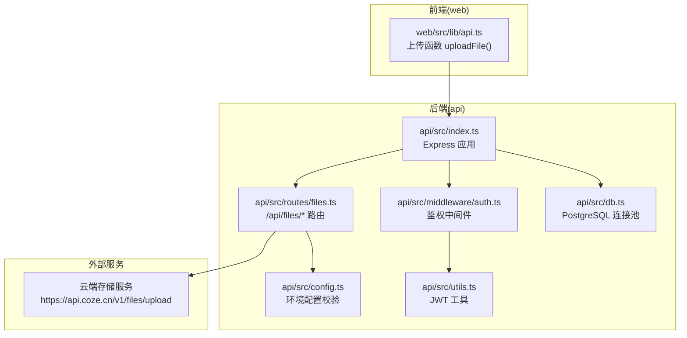
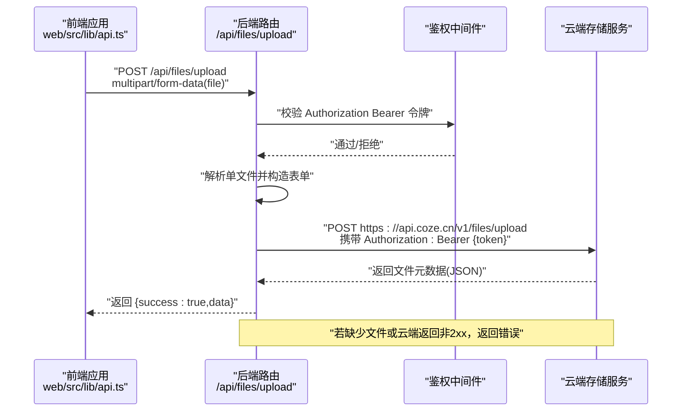
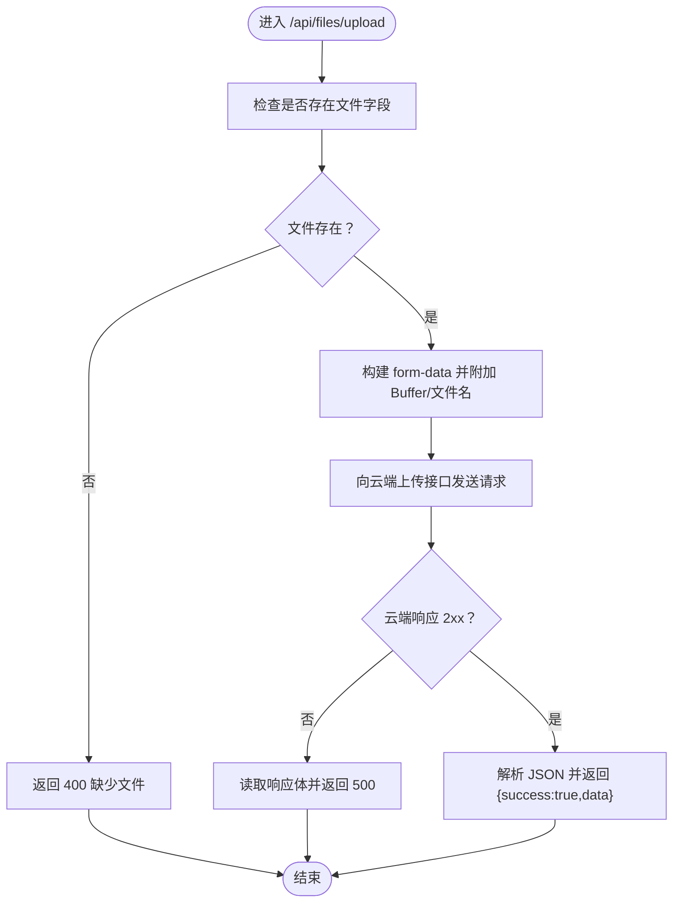
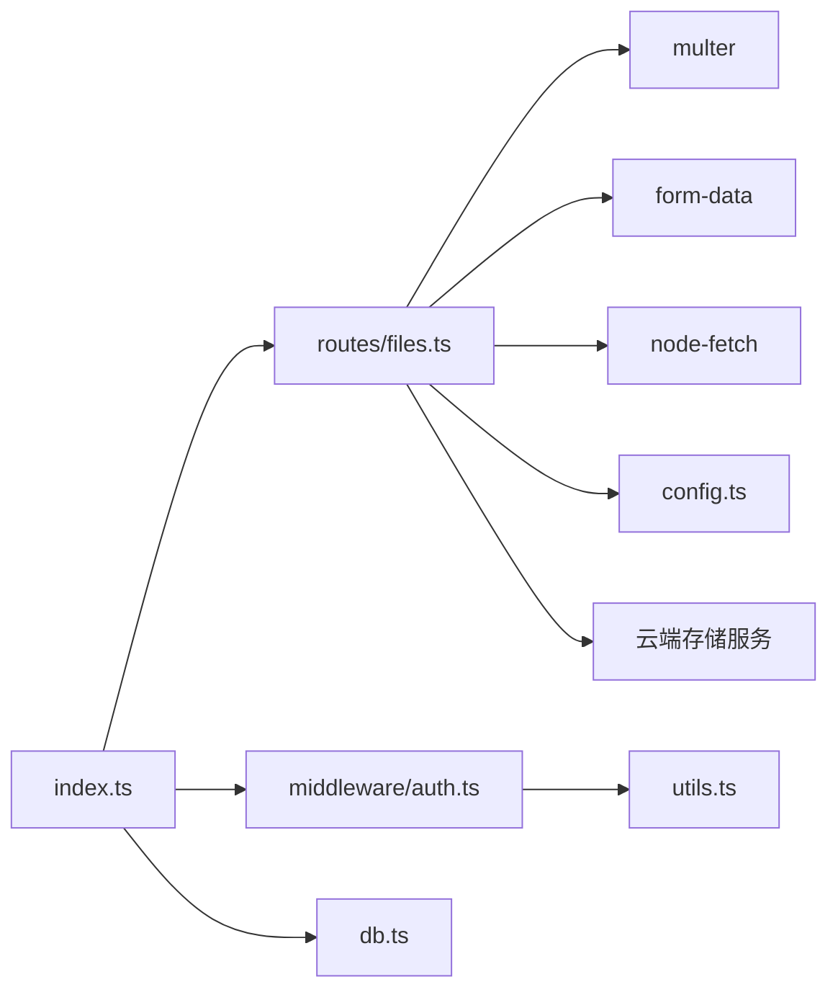

# 文件管理接口

<cite>
**本文引用的文件**
- [api/src/routes/files.ts](file://api/src/routes/files.ts)
- [api/src/middleware/auth.ts](file://api/src/middleware/auth.ts)
- [api/src/utils.ts](file://api/src/utils.ts)
- [api/src/config.ts](file://api/src/config.ts)
- [api/src/db.ts](file://api/src/db.ts)
- [api/src/index.ts](file://api/src/index.ts)
- [api/package.json](file://api/package.json)
- [docker-compose.yml](file://docker-compose.yml)
- [web/src/lib/api.ts](file://web/src/lib/api.ts)
</cite>

## 目录
1. [简介](#简介)
2. [项目结构](#项目结构)
3. [核心组件](#核心组件)
4. [架构总览](#架构总览)
5. [详细组件分析](#详细组件分析)
6. [依赖关系分析](#依赖关系分析)
7. [性能考量](#性能考量)
8. [故障排除指南](#故障排除指南)
9. [结论](#结论)
10. [附录](#附录)

## 简介
本文件面向“文件上传”接口（/api/files/upload），提供从接口规范、数据流、安全与权限控制、错误处理、到部署与运维的完整说明。该接口通过后端代理转发至第三方云端存储服务，并在请求链路中集成鉴权中间件与环境配置校验，确保上传流程的安全与可追溯。

## 项目结构
后端采用 Express 应用，统一挂载多条业务路由；文件上传路由位于 /api/files，使用 multer 处理单文件表单上传，并将文件缓冲区转发给云端服务。前端通过 web 包装的 fetch 封装发起上传请求，自动携带本地存储的令牌。

图表来源
- [api/src/index.ts:1-29](file://api/src/index.ts#L1-L29)
- [api/src/routes/files.ts:1-43](file://api/src/routes/files.ts#L1-L43)
- [api/src/middleware/auth.ts:1-23](file://api/src/middleware/auth.ts#L1-L23)
- [api/src/config.ts:1-19](file://api/src/config.ts#L1-L19)
- [api/src/utils.ts:1-21](file://api/src/utils.ts#L1-L21)
- [api/src/db.ts:1-35](file://api/src/db.ts#L1-L35)
- [web/src/lib/api.ts:38-56](file://web/src/lib/api.ts#L38-L56)

章节来源
- [api/src/index.ts:1-29](file://api/src/index.ts#L1-L29)
- [api/src/routes/files.ts:1-43](file://api/src/routes/files.ts#L1-L43)
- [web/src/lib/api.ts:38-56](file://web/src/lib/api.ts#L38-L56)

## 核心组件
- 文件上传路由：接收 multipart/form-data，解析单文件，构造表单并转发至云端存储。
- 鉴权中间件：校验 Authorization Bearer 令牌，注入用户信息到请求上下文。
- 环境配置：启动时校验关键环境变量，确保令牌、数据库连接、密钥等可用。
- 前端上传封装：自动拼接表单、携带令牌，统一错误处理与响应解析。

章节来源
- [api/src/routes/files.ts:10-40](file://api/src/routes/files.ts#L10-L40)
- [api/src/middleware/auth.ts:8-22](file://api/src/middleware/auth.ts#L8-L22)
- [api/src/config.ts:5-11](file://api/src/config.ts#L5-L11)
- [web/src/lib/api.ts:38-56](file://web/src/lib/api.ts#L38-L56)

## 架构总览
下图展示一次典型文件上传的端到端流程：前端构造表单并携带令牌，后端路由解析文件并进行鉴权，随后将文件缓冲区转发至云端存储，最终返回云端返回的数据。

图表来源
- [api/src/routes/files.ts:10-40](file://api/src/routes/files.ts#L10-L40)
- [api/src/middleware/auth.ts:8-22](file://api/src/middleware/auth.ts#L8-L22)
- [web/src/lib/api.ts:38-56](file://web/src/lib/api.ts#L38-L56)

## 详细组件分析

### 接口规范：/api/files/upload
- 方法与路径
  - POST /api/files/upload
- 请求头
  - Content-Type: multipart/form-data
  - Authorization: Bearer {token}（可选，取决于上游调用方是否需要鉴权）
- 表单字段
  - file: 单文件二进制（Buffer）
- 成功响应
  - 结构：{ success: true, data: object }
  - data 字段为云端返回的文件元数据对象
- 错误响应
  - 缺少文件：400，{ success: false, message: '缺少文件' }
  - 云端上传失败：500，{ success: false, message: ..., detail: string }
- 说明
  - 后端会将收到的 Buffer 作为表单的一部分再次提交到云端存储服务，不落地本地磁盘。
  - 若需要鉴权，需在 Authorization 头中提供 Bearer 令牌，由鉴权中间件校验。

章节来源
- [api/src/routes/files.ts:10-40](file://api/src/routes/files.ts#L10-L40)
- [web/src/lib/api.ts:38-56](file://web/src/lib/api.ts#L38-L56)

### 数据流与处理逻辑
- 输入验证
  - 检查是否存在文件字段；若缺失，立即返回 400。
- 表单构建
  - 使用 form-data 将 Buffer 与原始文件名重新组装为表单。
- 转发上传
  - 通过 node-fetch 发送 POST 到云端上传地址，携带 Authorization 头（来自配置）。
- 响应处理
  - 若云端返回非 2xx，读取响应体文本并返回 500；否则解析 JSON 并返回。
- 返回格式
  - { success: true, data }，其中 data 为云端返回的文件元数据。

图表来源
- [api/src/routes/files.ts:10-40](file://api/src/routes/files.ts#L10-L40)

章节来源
- [api/src/routes/files.ts:10-40](file://api/src/routes/files.ts#L10-L40)

### 安全与权限控制
- 鉴权中间件
  - 从 Authorization 头提取 Bearer 令牌，调用工具函数验证 JWT，成功则将用户信息注入请求上下文，继续后续处理；失败返回 401。
- 令牌来源与签名
  - 令牌签发与校验依赖 JWT 秘钥（来自环境配置），用于保护上传接口。
- 建议
  - 在需要鉴权的场景，前端应在上传请求中携带 Authorization 头；若不需要鉴权，可移除该头。

章节来源
- [api/src/middleware/auth.ts:8-22](file://api/src/middleware/auth.ts#L8-L22)
- [api/src/utils.ts:14-20](file://api/src/utils.ts#L14-L20)

### 云端存储集成
- 目标服务
  - https://api.coze.cn/v1/files/upload
- 认证方式
  - Authorization: Bearer {cozeToken}（来自环境变量）
- 传输内容
  - 二进制文件 Buffer + 原始文件名
- 响应
  - 返回云端侧的文件元数据对象

章节来源
- [api/src/routes/files.ts:16-39](file://api/src/routes/files.ts#L16-L39)
- [api/src/config.ts:13-14](file://api/src/config.ts#L13-L14)

### 前端上传实现
- 调用入口
  - uploadFile(file: File) -> Promise<JSON>
- 行为
  - 自动构造 FormData，追加 file 字段
  - 可选携带 Authorization: Bearer {token}（若本地存在）
  - 对非 2xx 响应抛出异常，便于上层捕获
- 适用场景
  - 与后端 /api/files/upload 配合使用，完成前端到云端的文件上传

章节来源
- [web/src/lib/api.ts:38-56](file://web/src/lib/api.ts#L38-L56)

### 错误处理机制
- 后端
  - 缺少文件字段：400
  - 云端非 2xx：读取响应体文本并返回 500，包含状态码与详情
- 前端
  - 非 2xx：读取响应体文本并抛出异常
  - 401：清理本地令牌并触发未授权回调

章节来源
- [api/src/routes/files.ts:12-36](file://api/src/routes/files.ts#L12-L36)
- [web/src/lib/api.ts:25-35](file://web/src/lib/api.ts#L25-L35)

### 批量操作与进度监控
- 批量操作
  - 当前路由仅支持单文件上传；如需批量，请在客户端循环调用或扩展后端路由以支持多文件字段。
- 进度监控
  - 当前实现未内置进度上报；可在前端使用 XMLHttpRequest 的 progress 事件或 fetch 的 ReadableStream（视浏览器支持）实现上传进度显示。

章节来源
- [api/src/routes/files.ts:8](file://api/src/routes/files.ts#L8)
- [web/src/lib/api.ts:38-56](file://web/src/lib/api.ts#L38-L56)

### 文件元数据管理
- 元数据来源
  - 由云端服务返回，后端直接透传。
- 存储建议
  - 如需持久化元数据，可在数据库中新增文件元数据表，记录云端文件 ID、原始名称、上传时间、归属用户等字段。

章节来源
- [api/src/routes/files.ts:38](file://api/src/routes/files.ts#L38)

### 文件类型与大小限制
- 类型
  - 由云端服务决定；后端不做类型白名单校验。
- 大小
  - 服务端 JSON 解析限制为 10MB（全局中间件），但上传路由使用 multer 接收 Buffer，未显式设置大小上限；建议在生产环境为 multer 配置合理的文件大小限制，避免内存压力。

章节来源
- [api/src/index.ts:13](file://api/src/index.ts#L13)
- [api/src/routes/files.ts:8](file://api/src/routes/files.ts#L8)

### 存储策略
- 本地存储
  - 不落盘，直接将 Buffer 转发至云端。
- 云端存储
  - 由云端服务负责对象存储与访问控制。
- 建议
  - 如需本地缓存或二次处理，可在后端增加临时目录与清理策略，并在数据库中记录文件元数据。

章节来源
- [api/src/routes/files.ts:16-39](file://api/src/routes/files.ts#L16-L39)

## 依赖关系分析
- 组件耦合
  - /api/files/upload 依赖：multer（解析）、form-data（构造）、node-fetch（转发）、config（令牌）、云端服务。
  - 鉴权中间件依赖：utils 中的 JWT 工具。
- 外部依赖
  - @coze/api、bcryptjs、cors、dotenv、express、form-data、jsonwebtoken、multer、node-fetch、pg、uuid
- 环境变量
  - COZE_API_TOKEN、DATABASE_URL、JWT_SECRET、VOICE_BASE_URL（上传接口无需 VOICE_BASE_URL）

图表来源
- [api/src/routes/files.ts:1-8](file://api/src/routes/files.ts#L1-L8)
- [api/src/middleware/auth.ts:1-6](file://api/src/middleware/auth.ts#L1-L6)
- [api/src/utils.ts:1-4](file://api/src/utils.ts#L1-L4)
- [api/src/index.ts:1-9](file://api/src/index.ts#L1-L9)
- [api/src/db.ts:1-8](file://api/src/db.ts#L1-L8)
- [api/package.json:11-22](file://api/package.json#L11-L22)

章节来源
- [api/src/routes/files.ts:1-8](file://api/src/routes/files.ts#L1-L8)
- [api/src/middleware/auth.ts:1-6](file://api/src/middleware/auth.ts#L1-L6)
- [api/src/utils.ts:1-4](file://api/src/utils.ts#L1-L4)
- [api/src/index.ts:1-9](file://api/src/index.ts#L1-L9)
- [api/src/db.ts:1-8](file://api/src/db.ts#L1-L8)
- [api/package.json:11-22](file://api/package.json#L11-L22)

## 性能考量
- 内存占用
  - multer 默认将文件读入内存（Buffer），大文件可能导致内存压力；建议在生产环境限制文件大小并启用流式处理。
- 并发与超时
  - 为 node-fetch 设置合理超时，避免长时间阻塞连接。
- 传输效率
  - 若文件较大，可考虑分片上传或断点续传（需云端支持）。
- 缓存与压缩
  - 云端通常具备缓存与压缩能力；后端无需重复处理。

## 故障排除指南
- 400 缺少文件
  - 检查前端是否正确构造 multipart/form-data，并包含 file 字段。
- 401 未登录/登录失效
  - 检查 Authorization 头是否正确传递；确认本地令牌有效且未过期。
- 500 云端上传失败
  - 查看后端日志中的详细响应体；确认云端服务可达、令牌有效、文件大小与类型符合要求。
- CORS 或跨域问题
  - 确认后端已启用 CORS，前端域名与端口与后端一致。
- 环境变量缺失
  - 启动时报错提示缺少环境变量时，补充 COZE_API_TOKEN、DATABASE_URL、JWT_SECRET 等。

章节来源
- [api/src/routes/files.ts:12-36](file://api/src/routes/files.ts#L12-L36)
- [api/src/middleware/auth.ts:9-21](file://api/src/middleware/auth.ts#L9-L21)
- [api/src/config.ts:7-11](file://api/src/config.ts#L7-L11)
- [api/src/index.ts:12](file://api/src/index.ts#L12)

## 结论
/ api/files/upload 提供了简洁高效的文件上传通道：前端构造表单并携带令牌，后端解析文件并通过云端服务完成存储，最终将云端元数据回传。当前实现未包含类型校验、大小限制与鉴权强制性，建议结合业务需求在生产环境中增强这些能力，并配合数据库记录文件元数据以便后续管理与审计。

## 附录

### 环境变量与部署
- 必需环境变量
  - COZE_API_TOKEN：云端存储服务令牌
  - DATABASE_URL：PostgreSQL 连接串
  - JWT_SECRET：JWT 签名密钥
  - VOICE_BASE_URL：语音相关服务基础地址（与文件上传无关）
- Docker Compose
  - 提供数据库与 API 服务编排，端口映射与环境变量注入示例

章节来源
- [api/src/config.ts:5-11](file://api/src/config.ts#L5-L11)
- [docker-compose.yml:16-20](file://docker-compose.yml#L16-L20)