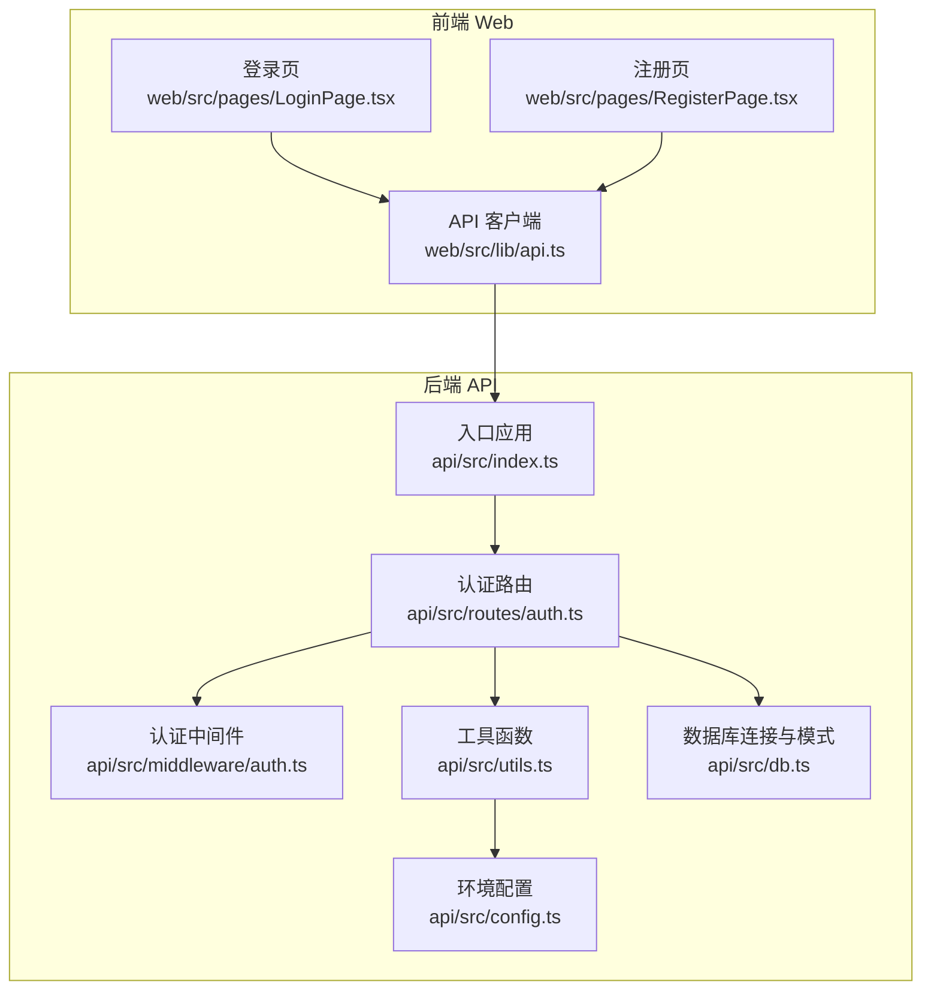
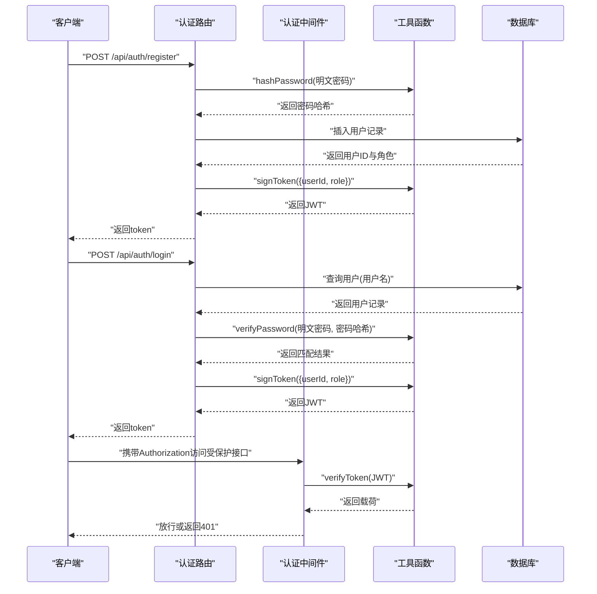
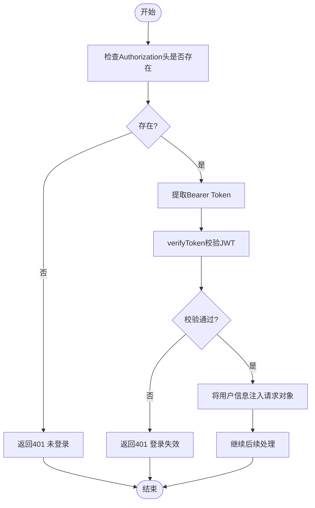
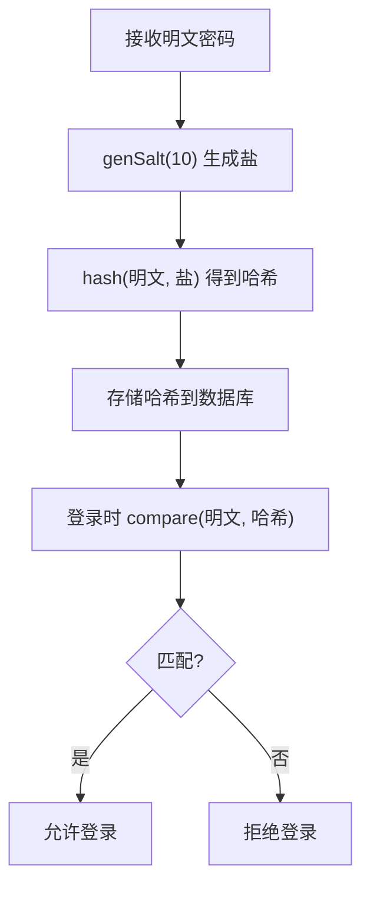
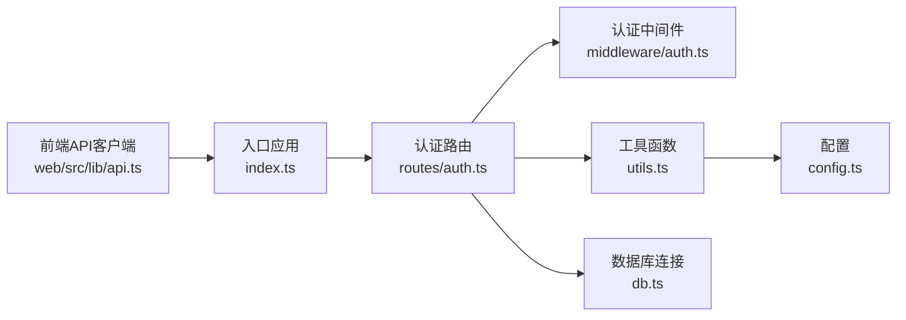

# 认证接口

<cite>
**本文引用的文件**
- [api/src/routes/auth.ts](file://api/src/routes/auth.ts)
- [api/src/middleware/auth.ts](file://api/src/middleware/auth.ts)
- [api/src/utils.ts](file://api/src/utils.ts)
- [api/src/db.ts](file://api/src/db.ts)
- [api/src/config.ts](file://api/src/config.ts)
- [api/src/index.ts](file://api/src/index.ts)
- [web/src/lib/api.ts](file://web/src/lib/api.ts)
- [web/src/pages/LoginPage.tsx](file://web/src/pages/LoginPage.tsx)
- [web/src/pages/RegisterPage.tsx](file://web/src/pages/RegisterPage.tsx)
</cite>

## 目录
1. [简介](#简介)
2. [项目结构](#项目结构)
3. [核心组件](#核心组件)
4. [架构总览](#架构总览)
5. [详细组件分析](#详细组件分析)
6. [依赖关系分析](#依赖关系分析)
7. [性能考虑](#性能考虑)
8. [故障排查指南](#故障排查指南)
9. [结论](#结论)

## 简介
本文件为认证接口的完整 API 文档，覆盖以下四个核心接口：
- 用户注册：POST /api/auth/register
- 用户登录：POST /api/auth/login
- 密码重置：POST /api/auth/reset-password
- 获取当前用户信息：GET /api/auth/me

文档内容包括：
- 接口定义（HTTP 方法、URL 模式）
- 请求参数与响应格式
- 错误码与错误处理
- JWT 令牌生成与验证机制
- 密码加密流程
- 权限控制逻辑（含管理员权限）
- 前后端交互示例与安全最佳实践

## 项目结构
认证相关代码主要位于后端 API 服务中，前端通过统一的 API 客户端进行调用。

图表来源
- [api/src/index.ts:1-29](file://api/src/index.ts#L1-L29)
- [api/src/routes/auth.ts:1-115](file://api/src/routes/auth.ts#L1-L115)
- [api/src/middleware/auth.ts:1-23](file://api/src/middleware/auth.ts#L1-L23)
- [api/src/utils.ts:1-21](file://api/src/utils.ts#L1-L21)
- [api/src/db.ts:1-35](file://api/src/db.ts#L1-L35)
- [api/src/config.ts:1-19](file://api/src/config.ts#L1-L19)
- [web/src/lib/api.ts:1-160](file://web/src/lib/api.ts#L1-L160)
- [web/src/pages/LoginPage.tsx:1-45](file://web/src/pages/LoginPage.tsx#L1-L45)
- [web/src/pages/RegisterPage.tsx:1-87](file://web/src/pages/RegisterPage.tsx#L1-L87)

章节来源
- [api/src/index.ts:1-29](file://api/src/index.ts#L1-L29)
- [api/src/routes/auth.ts:1-115](file://api/src/routes/auth.ts#L1-L115)
- [web/src/lib/api.ts:1-160](file://web/src/lib/api.ts#L1-L160)

## 核心组件
- 认证路由模块：提供注册、登录、密码重置、查询当前用户等接口。
- 认证中间件：校验请求头中的 Bearer Token，并将用户信息注入到请求对象。
- 工具函数：负责密码加解密与 JWT 的签发与验证。
- 数据库层：提供 PostgreSQL 连接池与用户表结构。
- 配置模块：读取环境变量并校验必需项。
- 前端 API 客户端：统一封装请求头（自动携带 Authorization），处理 401 未授权状态。

章节来源
- [api/src/routes/auth.ts:1-115](file://api/src/routes/auth.ts#L1-L115)
- [api/src/middleware/auth.ts:1-23](file://api/src/middleware/auth.ts#L1-L23)
- [api/src/utils.ts:1-21](file://api/src/utils.ts#L1-L21)
- [api/src/db.ts:1-35](file://api/src/db.ts#L1-L35)
- [api/src/config.ts:1-19](file://api/src/config.ts#L1-L19)
- [web/src/lib/api.ts:1-160](file://web/src/lib/api.ts#L1-L160)

## 架构总览
认证流程的关键路径如下：

图表来源
- [api/src/routes/auth.ts:8-34](file://api/src/routes/auth.ts#L8-L34)
- [api/src/routes/auth.ts:36-63](file://api/src/routes/auth.ts#L36-L63)
- [api/src/middleware/auth.ts:8-22](file://api/src/middleware/auth.ts#L8-L22)
- [api/src/utils.ts:5-20](file://api/src/utils.ts#L5-L20)
- [api/src/db.ts:10-35](file://api/src/db.ts#L10-L35)

## 详细组件分析

### 用户注册接口
- HTTP 方法：POST
- URL 模式：/api/auth/register
- 功能概述：校验必填字段，检查用户名是否已存在，对密码进行哈希，写入用户表，签发 JWT 并返回给客户端。
- 请求体参数
  - username: string（必填）
  - email: string（可选）
  - password: string（必填）
- 成功响应
  - data.token: string（JWT）
- 失败响应
  - 缺少必填字段：400
  - 账号已存在：409
- 错误码
  - 400：缺少必填字段
  - 409：账号已存在
  - 其他：服务器内部错误（由框架返回）

章节来源
- [api/src/routes/auth.ts:8-34](file://api/src/routes/auth.ts#L8-L34)

### 用户登录接口
- HTTP 方法：POST
- URL 模式：/api/auth/login
- 功能概述：根据用户名查询用户，验证密码，签发 JWT 并返回给客户端。
- 请求体参数
  - username: string（必填）
  - password: string（必填）
- 成功响应
  - data.token: string（JWT）
- 失败响应
  - 缺少必填字段：400
  - 账号或密码错误：401
- 错误码
  - 400：缺少必填字段
  - 401：账号或密码错误
  - 其他：服务器内部错误（由框架返回）

章节来源
- [api/src/routes/auth.ts:36-63](file://api/src/routes/auth.ts#L36-L63)

### 密码重置接口
- HTTP 方法：POST
- URL 模式：/api/auth/reset-password
- 中间件：authRequired（需要登录态）
- 功能概述：支持重置当前用户密码；当请求方为管理员时，可重置指定用户的密码。
- 请求体参数
  - username: string（可选，管理员可指定目标用户）
  - newPassword: string（必填）
- 成功响应
  - message: string（成功提示）
- 失败响应
  - 缺少新密码：400
  - 登录失效：401
  - 用户不存在：404
  - 无权限重置他人密码：403
- 权限规则
  - 若携带 username，则仅管理员可操作
  - 若未携带 username，则仅当前用户可操作
- 错误码
  - 400：缺少新密码
  - 401：登录失效
  - 403：无权限重置他人密码
  - 404：用户不存在
  - 其他：服务器内部错误（由框架返回）

章节来源
- [api/src/routes/auth.ts:65-98](file://api/src/routes/auth.ts#L65-L98)

### 获取当前用户信息接口
- HTTP 方法：GET
- URL 模式：/api/auth/me
- 中间件：authRequired（需要登录态）
- 功能概述：返回当前登录用户的基本信息（id、username、email、role）。
- 成功响应
  - data.id: number
  - data.username: string
  - data.email: string
  - data.role: string
- 失败响应
  - 登录失效：401
- 错误码
  - 401：登录失效
  - 其他：服务器内部错误（由框架返回）

章节来源
- [api/src/routes/auth.ts:100-112](file://api/src/routes/auth.ts#L100-L112)

### JWT 令牌生成与验证机制
- 生成
  - 使用工具函数对载荷（包含 userId、role）进行签名，设置过期时间为 7 天。
- 验证
  - 中间件从 Authorization 请求头提取 Bearer Token，调用验证函数校验有效性。
  - 校验失败或缺失时返回 401。
- 前端集成
  - API 客户端在每次请求时自动添加 Authorization: Bearer <token>。
  - 当收到 401 时，清除本地 token 并触发未授权回调。

图表来源
- [api/src/middleware/auth.ts:8-22](file://api/src/middleware/auth.ts#L8-L22)
- [api/src/utils.ts:14-20](file://api/src/utils.ts#L14-L20)
- [web/src/lib/api.ts:13-36](file://web/src/lib/api.ts#L13-L36)

章节来源
- [api/src/middleware/auth.ts:1-23](file://api/src/middleware/auth.ts#L1-L23)
- [api/src/utils.ts:1-21](file://api/src/utils.ts#L1-L21)
- [web/src/lib/api.ts:1-160](file://web/src/lib/api.ts#L1-L160)

### 密码加密流程
- 注册与重置密码时，使用 bcrypt 对明文密码进行加盐哈希存储。
- 登录时，使用 bcrypt 比较输入密码与数据库中的哈希值。

图表来源
- [api/src/utils.ts:5-12](file://api/src/utils.ts#L5-L12)

章节来源
- [api/src/utils.ts:1-21](file://api/src/utils.ts#L1-L21)

### 权限控制逻辑
- 角色字段 role 存储于用户表，默认为 USER。
- 管理员权限：当请求体携带 username 且目标用户不是当前用户时，仅当当前用户角色为 ADMIN 时才允许重置密码。
- 中间件 authRequired：所有受保护接口均需携带有效 JWT。

章节来源
- [api/src/db.ts:12-20](file://api/src/db.ts#L12-L20)
- [api/src/routes/auth.ts:89-91](file://api/src/routes/auth.ts#L89-L91)

### 前后端交互示例

- 注册
  - 请求
    - 方法：POST
    - URL：/api/auth/register
    - 请求体：{ username, email, password }
  - 成功响应
    - data.token：JWT
  - 前端调用参考
    - 参考路径：[RegisterPage.tsx:26-33](file://web/src/pages/RegisterPage.tsx#L26-L33)

- 登录
  - 请求
    - 方法：POST
    - URL：/api/auth/login
    - 请求体：{ username, password }
  - 成功响应
    - data.token：JWT
  - 前端调用参考
    - 参考路径：[LoginPage.tsx:24-27](file://web/src/pages/LoginPage.tsx#L24-L27)

- 获取当前用户信息
  - 请求
    - 方法：GET
    - URL：/api/auth/me
    - 请求头：Authorization: Bearer <token>
  - 成功响应
    - data：{ id, username, email, role }

- 密码重置
  - 请求
    - 方法：POST
    - URL：/api/auth/reset-password
    - 请求头：Authorization: Bearer <token>
    - 请求体：{ newPassword } 或 { username, newPassword }（管理员）
  - 成功响应
    - message：密码重置成功

章节来源
- [web/src/pages/RegisterPage.tsx:1-87](file://web/src/pages/RegisterPage.tsx#L1-L87)
- [web/src/pages/LoginPage.tsx:1-45](file://web/src/pages/LoginPage.tsx#L1-L45)
- [api/src/routes/auth.ts:65-112](file://api/src/routes/auth.ts#L65-L112)

### 安全最佳实践
- 使用 HTTPS 传输，避免明文泄露。
- 前端将 token 存储在安全的存储介质中（如 localStorage），并避免在日志中打印 token。
- 后端严格校验请求参数，防止 SQL 注入（当前使用参数化查询）。
- JWT 过期时间合理设置（默认 7 天），建议结合刷新令牌策略。
- 管理员权限仅授予可信用户，避免滥用。
- 前端在收到 401 时应清除本地 token 并引导重新登录。

## 依赖关系分析

图表来源
- [api/src/routes/auth.ts:1-115](file://api/src/routes/auth.ts#L1-L115)
- [api/src/middleware/auth.ts:1-23](file://api/src/middleware/auth.ts#L1-L23)
- [api/src/utils.ts:1-21](file://api/src/utils.ts#L1-L21)
- [api/src/db.ts:1-35](file://api/src/db.ts#L1-L35)
- [api/src/config.ts:1-19](file://api/src/config.ts#L1-L19)
- [api/src/index.ts:1-29](file://api/src/index.ts#L1-L29)
- [web/src/lib/api.ts:1-160](file://web/src/lib/api.ts#L1-L160)

章节来源
- [api/src/index.ts:1-29](file://api/src/index.ts#L1-L29)
- [api/src/routes/auth.ts:1-115](file://api/src/routes/auth.ts#L1-L115)

## 性能考虑
- 密码哈希使用 bcrypt，成本因子为 10，平衡安全性与性能。
- JWT 仅包含必要字段（userId、role），体积小，解析开销低。
- 数据库查询使用参数化语句，避免 SQL 注入风险。
- 建议在高并发场景下优化数据库连接池配置与索引设计（如对 username 建索引）。

## 故障排查指南
- 400 缺少必填字段
  - 检查请求体是否包含 username 与 password（注册/登录）或 newPassword（重置密码）。
- 401 未登录/登录失效
  - 确认请求头 Authorization 是否正确携带 Bearer Token。
  - 检查前端是否在收到 401 时清除了本地 token。
- 403 无权限重置他人密码
  - 管理员重置他人密码时，确保当前用户角色为 ADMIN。
- 404 用户不存在
  - 确认目标用户名是否存在。
- 409 账号已存在
  - 注册时用户名重复，请更换用户名。

章节来源
- [api/src/routes/auth.ts:15-24](file://api/src/routes/auth.ts#L15-L24)
- [api/src/routes/auth.ts:42-59](file://api/src/routes/auth.ts#L42-L59)
- [api/src/routes/auth.ts:71-79](file://api/src/routes/auth.ts#L71-L79)
- [api/src/routes/auth.ts:84-91](file://api/src/routes/auth.ts#L84-L91)
- [api/src/routes/auth.ts:85](file://api/src/routes/auth.ts#L85)
- [api/src/routes/auth.ts:23](file://api/src/routes/auth.ts#L23)
- [web/src/lib/api.ts:25-28](file://web/src/lib/api.ts#L25-L28)

## 结论
该认证体系基于 Express + PostgreSQL + JWT + bcrypt，提供了完整的用户注册、登录、密码重置与当前用户信息查询能力。通过中间件统一鉴权、工具函数封装加密与签发、前端统一携带 Authorization 头，整体架构清晰、易于维护与扩展。建议在生产环境中进一步完善管理员权限审计、刷新令牌策略与更严格的输入校验。