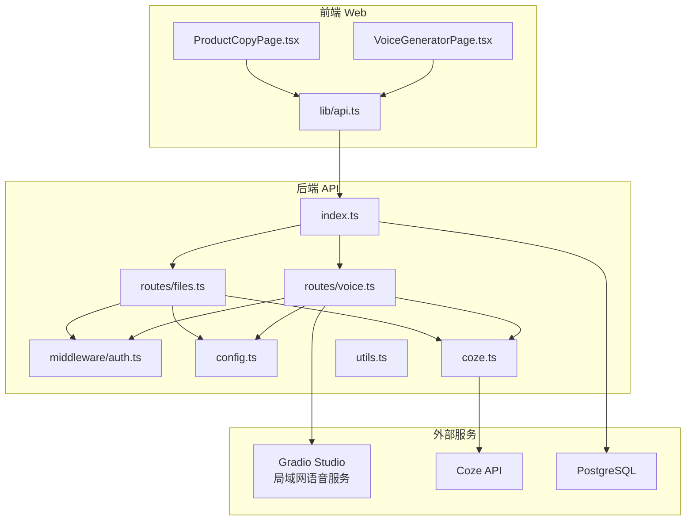

# 语音生成接口

<cite>
**本文引用的文件**
- [api/src/routes/voice.ts](file://api/src/routes/voice.ts)
- [api/src/routes/files.ts](file://api/src/routes/files.ts)
- [api/src/coze.ts](file://api/src/coze.ts)
- [api/src/config.ts](file://api/src/config.ts)
- [api/src/middleware/auth.ts](file://api/src/middleware/auth.ts)
- [api/src/index.ts](file://api/src/index.ts)
- [api/src/utils.ts](file://api/src/utils.ts)
- [api/package.json](file://api/package.json)
- [web/src/lib/api.ts](file://web/src/lib/api.ts)
- [web/src/pages/VoiceGeneratorPage.tsx](file://web/src/pages/VoiceGeneratorPage.tsx)
- [web/src/pages/ProductCopyPage.tsx](file://web/src/pages/ProductCopyPage.tsx)
</cite>

## 更新摘要
**变更内容**
- 新增文件上传路由：添加 /api/files/upload 接口，支持文件上传到 Coze API
- 更新临时文件处理机制：在 TTS 流程中创建临时 txt 文件，通过文件上传方式传递文本内容
- 增强批处理参数配置：在 Gradio Studio 中启用批量处理和 SRT 导出功能
- 完善调试记录系统：增强调试信息记录，包括临时文件创建和文件上传过程

## 目录
1. [简介](#简介)
2. [项目结构](#项目结构)
3. [核心组件](#核心组件)
4. [架构总览](#架构总览)
5. [详细组件分析](#详细组件分析)
6. [依赖关系分析](#依赖关系分析)
7. [性能考虑](#性能考虑)
8. [故障排除指南](#故障排除指南)
9. [结论](#结论)
10. [附录](#附录)

## 简介
本文件为语音生成接口的详细 API 文档，聚焦于文本转语音（TTS）相关接口的完整规范，涵盖以下方面：
- 文本转语音流程与参数配置
- 语音质量控制与增强选项
- 音频格式与 SRT 字幕导出能力
- 局域网服务集成与前端嵌入
- 实时处理、流式输出、错误恢复与性能优化
- 调试工具、质量评估与故障排除
- 与 Coze AI 语音服务的集成方式、网络配置与本地化部署

## 项目结构
后端采用 Express 框架，路由集中在 api/src/routes/voice.ts 和 api/src/routes/files.ts；前端通过 web/src/lib/api.ts 调用后端接口；语音服务通过 Gradio 客户端连接到局域网语音 Studio；Coze API 用于工作流调用和文件上传。



**章节来源**
- [api/src/index.ts:1-29](file://api/src/index.ts#L1-L29)
- [api/src/routes/voice.ts:1-401](file://api/src/routes/voice.ts#L1-L401)
- [api/src/routes/files.ts:1-42](file://api/src/routes/files.ts#L1-L42)
- [api/src/middleware/auth.ts:1-23](file://api/src/middleware/auth.ts#L1-L23)
- [api/src/config.ts:1-19](file://api/src/config.ts#L1-L19)
- [api/src/coze.ts:1-8](file://api/src/coze.ts#L1-L8)
- [web/src/lib/api.ts:1-160](file://web/src/lib/api.ts#L1-L160)
- [web/src/pages/VoiceGeneratorPage.tsx:1-95](file://web/src/pages/VoiceGeneratorPage.tsx#L1-L95)
- [web/src/pages/ProductCopyPage.tsx:1-249](file://web/src/pages/ProductCopyPage.tsx#L1-L249)

## 核心组件
- 语音路由模块：提供 /api/voice 下的配置查询、批量翻译、基于行数组的 TTS 生成等接口。
- 文件上传路由模块：提供 /api/files/upload 接口，支持文件上传到 Coze API。
- 认证中间件：保护路由，校验 JWT。
- 配置模块：加载环境变量，校验必要项。
- Coze 客户端：封装 Coze API，用于工作流调用和文件上传。
- 前端页面与 API 封装：负责展示语音服务地址、发起请求与流式处理。

**章节来源**
- [api/src/routes/voice.ts:66-83](file://api/src/routes/voice.ts#L66-L83)
- [api/src/routes/files.ts:10-40](file://api/src/routes/files.ts#L10-L40)
- [api/src/middleware/auth.ts:8-22](file://api/src/middleware/auth.ts#L8-L22)
- [api/src/config.ts:5-11](file://api/src/config.ts#L5-L11)
- [api/src/coze.ts:4-7](file://api/src/coze.ts#L4-L7)
- [web/src/lib/api.ts:117-160](file://web/src/lib/api.ts#L117-L160)

## 架构总览
语音生成的整体流程如下：
- 前端调用 /api/voice/config 获取语音服务地址
- 可选：调用 /api/voice/translate-lines 对文案进行批量翻译，得到英文行数组
- 调用 /api/voice/tts-from-lines 传入英文行数组，触发 TTS 流程
- 后端通过 Gradio 客户端连接局域网语音 Studio，执行生成任务
- **更新**：在 TTS 流程中创建临时 txt 文件并通过文件上传方式传递文本内容
- **更新**：启用批量处理和 SRT 导出功能
- 后端记录调试信息，支持查询单条与列表调试记录

```mermaid
sequenceDiagram
participant FE as "前端"
participant API as "后端 /api/voice"
participant FILES as "文件上传 /api/files"
participant GR as "Gradio Studio"
participant CW as "Coze 工作流"
FE->>API : GET /api/voice/config
API-->>FE : 返回 studioUrl / apiUrl / baseUrl
FE->>API : POST /api/voice/translate-lines {text}
API->>CW : workflows.runs.stream(...) 执行批量翻译
CW-->>API : 流式返回翻译结果
API-->>FE : 返回 sourceLines / translatedLines / txt
FE->>API : POST /api/voice/tts-from-lines {lines}
API->>GR : connect(base) 并逐个 predict(...)
**更新**：创建临时txt文件并通过文件上传传递
GR-->>API : 返回音频与字幕等结果
API-->>FE : 返回最终 TTS 结果含调试 ID
```

**图表来源**
- [api/src/routes/voice.ts:66-83](file://api/src/routes/voice.ts#L66-L83)
- [api/src/routes/voice.ts:263-328](file://api/src/routes/voice.ts#L263-L328)
- [api/src/routes/voice.ts:331-389](file://api/src/routes/voice.ts#L331-L389)
- [api/src/routes/files.ts:10-40](file://api/src/routes/files.ts#L10-L40)
- [api/src/coze.ts:4-7](file://api/src/coze.ts#L4-L7)

## 详细组件分析

### 1) 配置查询接口
- 路径：GET /api/voice/config
- 权限：需要认证
- 功能：返回语音服务的基础地址、Studio 地址与 API 文档地址
- 异常：当未配置语音服务基础地址时返回 500

**章节来源**
- [api/src/routes/voice.ts:66-83](file://api/src/routes/voice.ts#L66-L83)

### 2) 文件上传接口（新增）
- 路径：POST /api/files/upload
- 权限：需要认证
- 请求体：multipart/form-data，包含 file 字段
- 处理逻辑：
  - 使用 multer 处理文件上传
  - 将文件内容通过 FormData 格式发送到 Coze API
  - 传递 Authorization 头包含 Coze API Token
  - 返回上传结果或错误信息
- 返回：success、data（包含文件ID等信息）
- 错误：400（缺少文件）、500（上传失败）

**更新** 新增文件上传功能，支持将本地文件上传到 Coze API

**章节来源**
- [api/src/routes/files.ts:10-40](file://api/src/routes/files.ts#L10-L40)

### 3) 批量翻译接口（可选）
- 路径：POST /api/voice/translate-lines
- 权限：需要认证
- 请求体：支持 lines（字符串数组）或 text（包含特定字段的文本）
- 处理逻辑：
  - 提取英文行数组（优先 lines，其次从 text 中解析）
  - 使用 Coze 工作流执行批量翻译，流式读取结果
  - 将翻译结果拼接为纯文本
- 返回：sourceLines、translatedLines、txt
- 调试：记录输入、原始分片、最终输出与错误

**章节来源**
- [api/src/routes/voice.ts:263-328](file://api/src/routes/voice.ts#L263-L328)
- [api/src/coze.ts:4-7](file://api/src/coze.ts#L4-L7)

### 4) 文本转语音接口（核心）
- 路径：POST /api/voice/tts-from-lines
- 权限：需要认证
- 请求体：lines（英文字符串数组）
- 处理逻辑：
  - 连接 Gradio Studio（通过配置的语音服务地址）
  - **更新**：创建临时 txt 文件并写入文本内容
  - **更新**：通过文件上传方式将文本文件传递给语音服务
  - **更新**：启用批量处理模式和 SRT 字幕导出
  - 配置多种语音参数（音色、语速、情感表达等）
  - 触发生成音频，返回结果
- 返回：lines、txt、tts（包含音频与字幕等）
- 调试：记录每个步骤的输入与输出，包括临时文件创建和上传过程

**更新** 采用临时文件创建和文件上传机制，增强了批处理和参数配置功能

**章节来源**
- [api/src/routes/voice.ts:331-389](file://api/src/routes/voice.ts#L331-L389)
- [api/src/routes/voice.ts:210-251](file://api/src/routes/voice.ts#L210-L251)

### 5) 调试与查询接口
- 查询单条调试记录：GET /api/voice/debug/:id
- 查询调试列表：GET /api/voice/debug
- 存储：内存 Map，最大容量限制
- 作用：定位翻译与 TTS 流程中的异常与中间状态
- **更新**：增强调试信息，包括临时文件创建、文件上传和参数配置过程

**章节来源**
- [api/src/routes/voice.ts:244-261](file://api/src/routes/voice.ts#L244-L261)
- [api/src/routes/voice.ts:31-50](file://api/src/routes/voice.ts#L31-L50)

### 6) 认证与权限
- 中间件：authRequired 校验 Authorization 头中的 Bearer Token
- 401 未登录与 401 登录失效场景分别返回对应错误

**章节来源**
- [api/src/middleware/auth.ts:8-22](file://api/src/middleware/auth.ts#L8-L22)
- [api/src/utils.ts:14-20](file://api/src/utils.ts#L14-L20)

### 7) 配置与环境变量
- 必需环境变量：COZE_API_TOKEN、DATABASE_URL、JWT_SECRET、VOICE_BASE_URL
- 加载顺序：dotenv.config() 后读取并校验

**章节来源**
- [api/src/config.ts:5-11](file://api/src/config.ts#L5-L11)
- [api/src/config.ts:13-19](file://api/src/config.ts#L13-L19)

### 8) 前端对接
- 读取语音服务配置：getVoiceConfig
- 发起翻译与 TTS：translateLinesFromCopy、ttsFromLines
- **更新**：文件上传：uploadFile（用于上传媒体文件到 Coze API）
- 语音页面：VoiceGeneratorPage.tsx 展示 studioUrl 与 apiUrl，并在受限制情况下提示使用新标签页打开
- 产品文案页面：ProductCopyPage.tsx 实现完整的三步工作流（生成文案 → 独立英译 → 生成语音）

**章节来源**
- [web/src/lib/api.ts:117-160](file://web/src/lib/api.ts#L117-L160)
- [web/src/lib/api.ts:39-56](file://web/src/lib/api.ts#L39-L56)
- [web/src/pages/VoiceGeneratorPage.tsx:10-25](file://web/src/pages/VoiceGeneratorPage.tsx#L10-L25)
- [web/src/pages/ProductCopyPage.tsx:91-202](file://web/src/pages/ProductCopyPage.tsx#L91-L202)

## 依赖关系分析

```mermaid
graph LR
subgraph "后端"
R["routes/voice.ts"]
F["routes/files.ts"]
C["coze.ts"]
CFG["config.ts"]
M["middleware/auth.ts"]
U["utils.ts"]
end
subgraph "外部"
G["@gradio/client"]
CA["@coze/api"]
P["PostgreSQL"]
END
R --> M
R --> CFG
R --> C
F --> M
F --> CFG
F --> C
C --> CA
R --> G
IDX["index.ts"] --> R
IDX --> F
IDX --> P
U --> IDX
```

**图表来源**
- [api/src/routes/voice.ts:1-10](file://api/src/routes/voice.ts#L1-L10)
- [api/src/routes/files.ts:1-8](file://api/src/routes/files.ts#L1-L8)
- [api/src/coze.ts:1-7](file://api/src/coze.ts#L1-L7)
- [api/src/config.ts:1-19](file://api/src/config.ts#L1-L19)
- [api/src/middleware/auth.ts:1-23](file://api/src/middleware/auth.ts#L1-L23)
- [api/src/utils.ts:1-21](file://api/src/utils.ts#L1-L21)
- [api/src/index.ts:1-29](file://api/src/index.ts#L1-L29)

**章节来源**
- [api/src/index.ts:19-23](file://api/src/index.ts#L19-L23)
- [api/package.json:11-23](file://api/package.json#L11-L23)

## 性能考虑
- 流式处理：批量翻译使用流式读取，避免一次性占用内存
- **更新**：TTS 处理流程包含临时文件创建和文件上传，增加了 I/O 操作但提供了更稳定的批处理能力
- 缓存与调试：调试记录内存存储，建议在生产环境替换为持久化存储以提升可观测性
- 资源隔离：前端通过 iframe 嵌入语音服务，避免阻塞主应用渲染
- 网络带宽：Gradio Studio 与 Coze API 的网络延迟是关键瓶颈，建议局域网部署以降低延迟
- **更新**：文件上传使用 FormData 格式，支持大文件传输但需要注意网络带宽限制

## 故障排除指南
- 未配置语音服务地址
  - 现象：/api/voice/config 返回 500
  - 排查：确认 VOICE_BASE_URL 环境变量已正确设置
  - 参考：[api/src/routes/voice.ts:66-83](file://api/src/routes/voice.ts#L66-L83)，[api/src/config.ts:5-11](file://api/src/config.ts#L5-L11)
- 未登录或 Token 失效
  - 现象：401 未登录或 401 登录失效
  - 排查：检查 Authorization 头与 JWT Secret 配置
  - 参考：[api/src/middleware/auth.ts:8-22](file://api/src/middleware/auth.ts#L8-L22)，[api/src/utils.ts:14-20](file://api/src/utils.ts#L14-L20)
- 翻译结果为空
  - 现象：translate-lines 返回错误，提示未提取到目标字段
  - 排查：确认输入文本包含预期字段或提供 lines 数组
  - 参考：[api/src/routes/voice.ts:284-297](file://api/src/routes/voice.ts#L284-L297)
- **更新**：TTS 生成失败
  - 现象：tts-from-lines 返回 500
  - 排查：查看调试记录 /api/voice/debug/:id，确认 Gradio Studio 是否可达
  - **更新**：检查临时文件创建和文件上传过程，确认临时目录权限
  - **更新**：验证批处理参数配置是否正确
  - 参考：[api/src/routes/voice.ts:374-388](file://api/src/routes/voice.ts#L374-L388)
- **更新**：文件上传失败
  - 现象：/api/files/upload 返回 500
  - 排查：检查 COZE_API_TOKEN 配置，确认网络连接正常
  - 参考：[api/src/routes/files.ts:28-36](file://api/src/routes/files.ts#L28-L36)
- 前端 iframe 嵌入受限
  - 现象：页面内预览不可用，提示使用新标签打开
  - 排查：语音服务可能禁用了 iframe 嵌入
  - 参考：[web/src/pages/VoiceGeneratorPage.tsx:85-92](file://web/src/pages/VoiceGeneratorPage.tsx#L85-L92)

## 结论
本语音生成接口通过后端路由聚合翻译与 TTS 能力，借助 Coze 工作流与 Gradio Studio 实现高质量语音合成与字幕导出。**更新**后的 TTS 处理管道引入了临时文件创建和文件上传机制，增强了批处理能力和参数配置灵活性。前端通过简单 API 封装即可完成配置读取、文件上传与流式调用。建议在生产环境中完善调试持久化、错误监控与网络优化，确保稳定与低延迟的服务体验。

## 附录

### A. 端到端调用流程（时序图）

```mermaid
sequenceDiagram
participant Client as "客户端"
participant Web as "前端页面"
participant VoiceAPI as "后端 /api/voice"
participant FilesAPI as "后端 /api/files"
participant Coze as "Coze 工作流"
participant Studio as "Gradio Studio"
Client->>Web : 打开语音生成页面
Web->>VoiceAPI : GET /api/voice/config
VoiceAPI-->>Web : 返回 studioUrl / apiUrl
Client->>VoiceAPI : POST /api/voice/translate-lines {text}
VoiceAPI->>Coze : workflows.runs.stream(...)
Coze-->>VoiceAPI : 流式返回翻译结果
VoiceAPI-->>Client : 返回 sourceLines / translatedLines / txt
Client->>VoiceAPI : POST /api/voice/tts-from-lines {lines}
VoiceAPI->>Studio : connect(base) 并逐个 predict(...)
**更新**：创建临时txt文件并通过文件上传传递
Studio-->>VoiceAPI : 返回音频与字幕
VoiceAPI-->>Client : 返回最终结果含调试 ID
```

**图表来源**
- [api/src/routes/voice.ts:66-83](file://api/src/routes/voice.ts#L66-L83)
- [api/src/routes/voice.ts:263-328](file://api/src/routes/voice.ts#L263-L328)
- [api/src/routes/voice.ts:331-389](file://api/src/routes/voice.ts#L331-L389)
- [api/src/routes/files.ts:10-40](file://api/src/routes/files.ts#L10-L40)
- [api/src/coze.ts:4-7](file://api/src/coze.ts#L4-L7)

### B. 本地化部署与网络配置
- 使用 docker-compose 同时启动数据库、后端 API 与前端 Web
- 环境变量：
  - COZE_API_TOKEN：Coze API 访问令牌
  - JWT_SECRET：JWT 签名密钥
  - DATABASE_URL：PostgreSQL 连接串
  - VOICE_BASE_URL：局域网语音 Studio 基础地址
- 前端开发服务器默认端口 5173，后端默认端口 3000

**章节来源**
- [api/src/config.ts:13-19](file://api/src/config.ts#L13-L19)
- [web/vite.config.ts:6-8](file://web/vite.config.ts#L6-L8)

### C. 常见问题与最佳实践
- 语音参数配置
  - 通过 Gradio Studio 的组件参数进行音色、语速、情感等控制（由后端逐个 predict 设置）
  - 建议在 Studio 中预先验证参数组合后再固化到后端调用序列
- 音频格式与字幕
  - 后端返回的 tts 结果包含音频与 SRT 字幕，前端可据此播放与同步显示
- 实时处理与流式输出
  - 翻译阶段使用流式读取，前端可按事件更新进度
- **更新**：错误恢复
  - 使用调试接口快速定位问题；TTS 阶段检查临时文件创建、文件上传和参数配置
  - 文件上传阶段检查 Coze API Token 和网络连接
- 性能优化
  - 局域网部署语音服务；合理设置请求体大小与超时时间；缓存常用配置
  - **更新**：优化临时文件存储位置和清理策略

### D. API 端点详细规范

#### 配置查询接口
- **路径**：GET /api/voice/config
- **权限**：需要认证
- **响应**：
  ```json
  {
    "success": true,
    "data": {
      "studioUrl": "string",
      "apiUrl": "string", 
      "baseUrl": "string"
    }
  }
  ```

#### 文件上传接口（新增）
- **路径**：POST /api/files/upload
- **权限**：需要认证
- **请求体**：multipart/form-data，包含 file 字段
- **响应**：
  ```json
  {
    "success": true,
    "data": {
      "id": "string",
      "name": "string",
      "size": "number",
      "created_at": "string"
    }
  }
  ```

#### 独立翻译接口
- **路径**：POST /api/voice/translate-lines
- **权限**：需要认证
- **请求体**：
  ```json
  {
    "lines": string[],
    "text": string
  }
  ```
- **响应**：
  ```json
  {
    "success": true,
    "data": {
      "sourceLines": string[],
      "translatedLines": string[],
      "txt": string
    },
    "debugId": "string",
    "debugUrl": "string",
    "debugListUrl": "string"
  }
  ```

#### TTS 生成接口
- **路径**：POST /api/voice/tts-from-lines
- **权限**：需要认证
- **请求体**：
  ```json
  {
    "lines": string[]
  }
  ```
- **响应**：
  ```json
  {
    "success": true,
    "data": {
      "lines": string[],
      "txt": string,
      "tts": {}
    },
    "debugId": "string",
    "debugUrl": "string",
    "debugListUrl": "string"
  }
  ```

#### 调试接口
- **路径**：GET /api/voice/debug/:id
- **路径**：GET /api/voice/debug
- **权限**：需要认证
- **响应**：
  ```json
  {
    "success": true,
    "data": {
      "id": "string",
      "createdAt": "string",
      "input": {},
      "steps": [],
      "result": {},
      "error": {}
    }
  }
  ```

**章节来源**
- [api/src/routes/voice.ts:66-83](file://api/src/routes/voice.ts#L66-L83)
- [api/src/routes/files.ts:10-40](file://api/src/routes/files.ts#L10-L40)
- [api/src/routes/voice.ts:263-328](file://api/src/routes/voice.ts#L263-L328)
- [api/src/routes/voice.ts:331-389](file://api/src/routes/voice.ts#L331-L389)
- [api/src/routes/voice.ts:244-261](file://api/src/routes/voice.ts#L244-L261)

### E. 新增功能详解

#### 文件上传功能
- **功能**：支持将本地文件上传到 Coze API
- **实现**：使用 multer 处理文件上传，FormData 格式传输
- **用途**：为后续工作流和语音处理提供文件基础
- **安全**：需要认证中间件保护，防止未授权访问

#### 增强的临时文件处理机制
- **功能**：在 TTS 流程中创建临时 txt 文件，通过文件上传方式传递文本内容
- **实现**：使用 fs 模块创建临时目录和文件，确保文件名以 .txt 结尾
- **优势**：提供了更稳定的批处理能力，支持复杂的文本处理流程

#### 批处理参数配置增强
- **功能**：启用批量处理模式和 SRT 字幕导出
- **参数**：lambda、lambda_1、lambda_2、lambda_4 等多个参数控制
- **效果**：支持批量语音生成和自动字幕导出，提升用户体验

#### 改进的调试基础设施
- **功能**：增强调试信息记录，包括临时文件创建、文件上传和参数配置过程
- **实现**：在每个关键步骤添加调试记录，包括输入输出和时间戳
- **价值**：便于问题排查和性能优化，提供完整的执行轨迹

**章节来源**
- [api/src/routes/files.ts:10-40](file://api/src/routes/files.ts#L10-L40)
- [api/src/routes/voice.ts:210-251](file://api/src/routes/voice.ts#L210-L251)
- [api/src/routes/voice.ts:9-50](file://api/src/routes/voice.ts#L9-L50)
- [api/src/routes/voice.ts:331-389](file://api/src/routes/voice.ts#L331-L389)