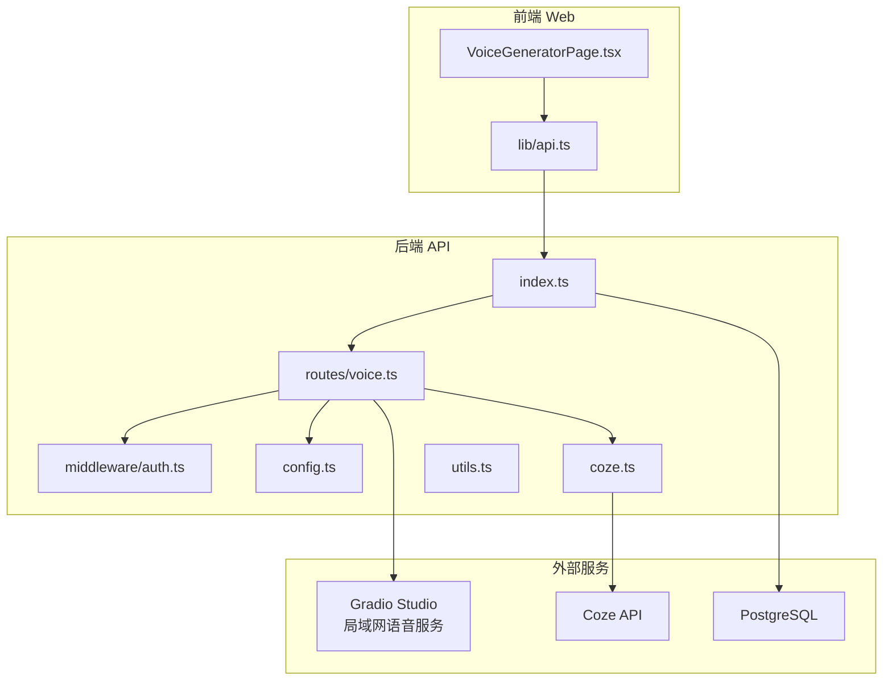
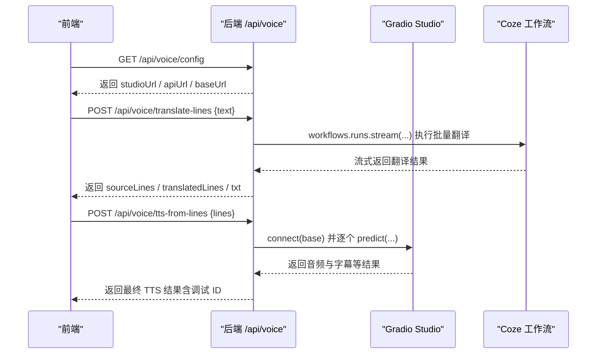
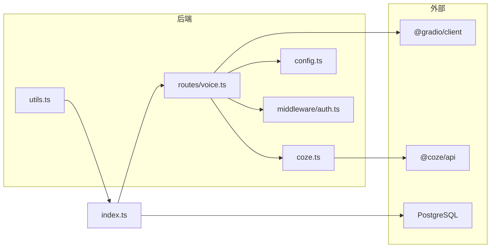
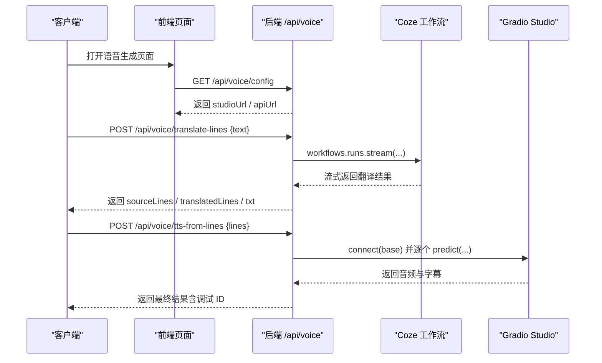

# 语音生成接口

<cite>
**本文引用的文件**
- [api/src/routes/voice.ts](file://api/src/routes/voice.ts)
- [api/src/coze.ts](file://api/src/coze.ts)
- [api/src/config.ts](file://api/src/config.ts)
- [api/src/middleware/auth.ts](file://api/src/middleware/auth.ts)
- [api/src/index.ts](file://api/src/index.ts)
- [api/src/utils.ts](file://api/src/utils.ts)
- [api/package.json](file://api/package.json)
- [docker-compose.yml](file://docker-compose.yml)
- [quick-start.bat](file://quick-start.bat)
- [web/src/pages/VoiceGeneratorPage.tsx](file://web/src/pages/VoiceGeneratorPage.tsx)
- [web/src/lib/api.ts](file://web/src/lib/api.ts)
- [web/vite.config.ts](file://web/vite.config.ts)
</cite>

## 目录
1. [简介](#简介)
2. [项目结构](#项目结构)
3. [核心组件](#核心组件)
4. [架构总览](#架构总览)
5. [详细组件分析](#详细组件分析)
6. [依赖关系分析](#依赖关系分析)
7. [性能考虑](#性能考虑)
8. [故障排除指南](#故障排除指南)
9. [结论](#结论)
10. [附录](#附录)

## 简介
本文件为语音生成接口的详细 API 文档，聚焦于文本转语音（TTS）相关接口的完整规范，涵盖以下方面：
- 文本转语音流程与参数配置
- 语音质量控制与增强选项
- 音频格式与 SRT 字幕导出能力
- 局域网服务集成与前端嵌入
- 实时处理、流式输出、错误恢复与性能优化
- 调试工具、质量评估与故障排除
- 与 Coze AI 语音服务的集成方式、网络配置与本地化部署

## 项目结构
后端采用 Express 框架，路由集中在 api/src/routes/voice.ts；前端通过 web/src/lib/api.ts 调用后端接口；语音服务通过 Gradio 客户端连接到局域网语音 Studio；Coze API 用于工作流调用。

图表来源
- [api/src/index.ts:1-29](file://api/src/index.ts#L1-L29)
- [api/src/routes/voice.ts:1-404](file://api/src/routes/voice.ts#L1-L404)
- [api/src/middleware/auth.ts:1-23](file://api/src/middleware/auth.ts#L1-L23)
- [api/src/config.ts:1-19](file://api/src/config.ts#L1-L19)
- [api/src/coze.ts:1-8](file://api/src/coze.ts#L1-L8)
- [web/src/lib/api.ts:1-160](file://web/src/lib/api.ts#L1-L160)
- [web/src/pages/VoiceGeneratorPage.tsx:1-95](file://web/src/pages/VoiceGeneratorPage.tsx#L1-L95)

章节来源
- [api/src/index.ts:1-29](file://api/src/index.ts#L1-L29)
- [docker-compose.yml:1-35](file://docker-compose.yml#L1-L35)

## 核心组件
- 语音路由模块：提供 /api/voice 下的配置查询、批量翻译、基于行数组的 TTS 生成等接口。
- 认证中间件：保护路由，校验 JWT。
- 配置模块：加载环境变量，校验必要项。
- Coze 客户端：封装 Coze API，用于工作流调用。
- 前端页面与 API 封装：负责展示语音服务地址、发起请求与流式处理。

章节来源
- [api/src/routes/voice.ts:69-86](file://api/src/routes/voice.ts#L69-L86)
- [api/src/middleware/auth.ts:8-22](file://api/src/middleware/auth.ts#L8-L22)
- [api/src/config.ts:5-11](file://api/src/config.ts#L5-L11)
- [api/src/coze.ts:4-7](file://api/src/coze.ts#L4-L7)
- [web/src/lib/api.ts:117-160](file://web/src/lib/api.ts#L117-L160)

## 架构总览
语音生成的整体流程如下：
- 前端调用 /api/voice/config 获取语音服务地址
- 可选：调用 /api/voice/translate-lines 对文案进行批量翻译，得到英文行数组
- 调用 /api/voice/tts-from-lines 传入英文行数组，触发 TTS 流程
- 后端通过 Gradio 客户端连接局域网语音 Studio，执行生成任务
- 后端记录调试信息，支持查询单条与列表调试记录

图表来源
- [api/src/routes/voice.ts:69-86](file://api/src/routes/voice.ts#L69-L86)
- [api/src/routes/voice.ts:276-341](file://api/src/routes/voice.ts#L276-L341)
- [api/src/routes/voice.ts:344-402](file://api/src/routes/voice.ts#L344-L402)
- [api/src/coze.ts:4-7](file://api/src/coze.ts#L4-L7)

## 详细组件分析

### 1) 配置查询接口
- 路径：GET /api/voice/config
- 权限：需要认证
- 功能：返回语音服务的基础地址、Studio 地址与 API 文档地址
- 异常：当未配置语音服务基础地址时返回 500

章节来源
- [api/src/routes/voice.ts:69-86](file://api/src/routes/voice.ts#L69-L86)

### 2) 批量翻译接口（可选）
- 路径：POST /api/voice/translate-lines
- 请求体：支持 lines（字符串数组）或 text（包含特定字段的文本）
- 处理逻辑：
  - 提取英文行数组（优先 lines，其次从 text 中解析）
  - 使用 Coze 工作流执行批量翻译，流式读取结果
  - 将翻译结果拼接为纯文本
- 返回：sourceLines、translatedLines、txt
- 调试：记录输入、原始分片、最终输出与错误

章节来源
- [api/src/routes/voice.ts:276-341](file://api/src/routes/voice.ts#L276-L341)
- [api/src/coze.ts:4-7](file://api/src/coze.ts#L4-L7)

### 3) 文本转语音接口（核心）
- 路径：POST /api/voice/tts-from-lines
- 请求体：lines（英文字符串数组）
- 处理逻辑：
  - 连接 Gradio Studio（通过配置的语音服务地址）
  - 依次调用多个组件参数设置与生成步骤
  - 写入临时文本文件，上传至文件组件兜底
  - 触发生成音频，返回结果
- 返回：lines、txt、tts（包含音频与字幕等）
- 调试：记录每个步骤的输入与输出

章节来源
- [api/src/routes/voice.ts:344-402](file://api/src/routes/voice.ts#L344-L402)

### 4) 调试与查询接口
- 查询单条调试记录：GET /api/voice/debug/:id
- 查询调试列表：GET /api/voice/debug
- 存储：内存 Map，最大容量限制
- 作用：定位翻译与 TTS 流程中的异常与中间状态

章节来源
- [api/src/routes/voice.ts:256-273](file://api/src/routes/voice.ts#L256-L273)
- [api/src/routes/voice.ts:35-61](file://api/src/routes/voice.ts#L35-L61)

### 5) 认证与权限
- 中间件：authRequired 校验 Authorization 头中的 Bearer Token
- 401 未登录与 401 登录失效场景分别返回对应错误

章节来源
- [api/src/middleware/auth.ts:8-22](file://api/src/middleware/auth.ts#L8-L22)
- [api/src/utils.ts:14-20](file://api/src/utils.ts#L14-L20)

### 6) 配置与环境变量
- 必需环境变量：COZE_API_TOKEN、DATABASE_URL、JWT_SECRET、VOICE_BASE_URL
- 加载顺序：dotenv.config() 后读取并校验

章节来源
- [api/src/config.ts:5-11](file://api/src/config.ts#L5-L11)
- [api/src/config.ts:13-19](file://api/src/config.ts#L13-L19)

### 7) 前端对接
- 读取语音服务配置：getVoiceConfig
- 发起翻译与 TTS：translateLinesFromCopy、ttsFromLines
- 语音页面：VoiceGeneratorPage.tsx 展示 studioUrl 与 apiUrl，并在受限制情况下提示使用新标签页打开

章节来源
- [web/src/lib/api.ts:117-160](file://web/src/lib/api.ts#L117-L160)
- [web/src/pages/VoiceGeneratorPage.tsx:10-25](file://web/src/pages/VoiceGeneratorPage.tsx#L10-L25)

## 依赖关系分析

图表来源
- [api/src/routes/voice.ts:1-10](file://api/src/routes/voice.ts#L1-L10)
- [api/src/coze.ts:1-7](file://api/src/coze.ts#L1-L7)
- [api/src/config.ts:1-19](file://api/src/config.ts#L1-L19)
- [api/src/middleware/auth.ts:1-23](file://api/src/middleware/auth.ts#L1-L23)
- [api/src/utils.ts:1-21](file://api/src/utils.ts#L1-L21)
- [api/src/index.ts:1-29](file://api/src/index.ts#L1-L29)

章节来源
- [api/src/index.ts:19-23](file://api/src/index.ts#L19-L23)
- [api/package.json:11-23](file://api/package.json#L11-L23)

## 性能考虑
- 流式处理：批量翻译使用流式读取，避免一次性占用内存
- 临时文件：TTS 步骤中写入临时文本文件，降低类型不匹配风险
- 缓存与调试：调试记录内存存储，建议在生产环境替换为持久化存储以提升可观测性
- 资源隔离：前端通过 iframe 嵌入语音服务，避免阻塞主应用渲染
- 网络带宽：Gradio Studio 与 Coze API 的网络延迟是关键瓶颈，建议局域网部署以降低延迟

[本节为通用性能建议，无需特定文件引用]

## 故障排除指南
- 未配置语音服务地址
  - 现象：/api/voice/config 返回 500
  - 排查：确认 VOICE_BASE_URL 环境变量已正确设置
  - 参考：[api/src/routes/voice.ts:69-86](file://api/src/routes/voice.ts#L69-L86)，[api/src/config.ts:5-11](file://api/src/config.ts#L5-L11)
- 未登录或 Token 失效
  - 现象：401 未登录或 401 登录失效
  - 排查：检查 Authorization 头与 JWT Secret 配置
  - 参考：[api/src/middleware/auth.ts:8-22](file://api/src/middleware/auth.ts#L8-L22)，[api/src/utils.ts:14-20](file://api/src/utils.ts#L14-L20)
- 翻译结果为空
  - 现象：translate-lines 返回错误，提示未提取到目标字段
  - 排查：确认输入文本包含预期字段或提供 lines 数组
  - 参考：[api/src/routes/voice.ts:297-310](file://api/src/routes/voice.ts#L297-L310)
- TTS 生成失败
  - 现象：tts-from-lines 返回 500
  - 排查：查看调试记录 /api/voice/debug/:id，确认 Gradio Studio 是否可达
  - 参考：[api/src/routes/voice.ts:387-401](file://api/src/routes/voice.ts#L387-L401)
- 前端 iframe 嵌入受限
  - 现象：页面内预览不可用，提示使用新标签打开
  - 排查：语音服务可能禁用了 iframe 嵌入
  - 参考：[web/src/pages/VoiceGeneratorPage.tsx:85-92](file://web/src/pages/VoiceGeneratorPage.tsx#L85-L92)

## 结论
本语音生成接口通过后端路由聚合翻译与 TTS 能力，借助 Coze 工作流与 Gradio Studio 实现高质量语音合成与字幕导出。前端通过简单 API 封装即可完成配置读取与流式调用。建议在生产环境中完善调试持久化、错误监控与网络优化，确保稳定与低延迟的服务体验。

[本节为总结性内容，无需特定文件引用]

## 附录

### A. 端到端调用流程（时序图）

图表来源
- [api/src/routes/voice.ts:69-86](file://api/src/routes/voice.ts#L69-L86)
- [api/src/routes/voice.ts:276-341](file://api/src/routes/voice.ts#L276-L341)
- [api/src/routes/voice.ts:344-402](file://api/src/routes/voice.ts#L344-L402)
- [api/src/coze.ts:4-7](file://api/src/coze.ts#L4-L7)

### B. 本地化部署与网络配置
- 使用 docker-compose 同时启动数据库、后端 API 与前端 Web
- 环境变量：
  - COZE_API_TOKEN：Coze API 访问令牌
  - JWT_SECRET：JWT 签名密钥
  - DATABASE_URL：PostgreSQL 连接串
  - VOICE_BASE_URL：局域网语音 Studio 基础地址
- 前端开发服务器默认端口 5173，后端默认端口 3000

章节来源
- [docker-compose.yml:13-32](file://docker-compose.yml#L13-L32)
- [api/src/config.ts:13-19](file://api/src/config.ts#L13-L19)
- [web/vite.config.ts:6-8](file://web/vite.config.ts#L6-L8)

### C. 常见问题与最佳实践
- 语音参数配置
  - 通过 Gradio Studio 的组件参数进行音色、语速、情感等控制（由后端逐个 predict 设置）
  - 建议在 Studio 中预先验证参数组合后再固化到后端调用序列
- 音频格式与字幕
  - 后端返回的 tts 结果包含音频与 SRT 字幕，前端可据此播放与同步显示
- 实时处理与流式输出
  - 翻译阶段使用流式读取，前端可按事件更新进度
- 错误恢复
  - 使用调试接口快速定位问题；必要时回退到直接文本输入组件
- 性能优化
  - 局域网部署语音服务；合理设置请求体大小与超时时间；缓存常用配置

[本节为通用指导，无需特定文件引用]