# 运行记录接口

<cite>
**本文档引用的文件**
- [runs.ts](file://api/src/routes/runs.ts)
- [db.ts](file://api/src/db.ts)
- [modules.ts](file://api/src/modules.ts)
- [auth.ts](file://api/src/middleware/auth.ts)
- [coze.ts](file://api/src/coze.ts)
- [config.ts](file://api/src/config.ts)
- [index.ts](file://api/src/index.ts)
- [api.ts](file://web/src/lib/api.ts)
- [RunsPage.tsx](file://web/src/pages/RunsPage.tsx)
</cite>

## 目录
1. [简介](#简介)
2. [项目结构](#项目结构)
3. [核心组件](#核心组件)
4. [架构概览](#架构概览)
5. [详细组件分析](#详细组件分析)
6. [依赖关系分析](#依赖关系分析)
7. [性能考虑](#性能考虑)
8. [故障排除指南](#故障排除指南)
9. [结论](#结论)

## 简介

运行记录接口是整个系统中用于管理AI工作流执行记录的核心组件。该接口提供了完整的运行状态查询、管理和跟踪功能，支持实时流式传输、状态管理和历史记录查询。系统通过PostgreSQL数据库存储运行记录，使用JWT进行身份验证，并通过Coze API集成实现工作流执行。

## 项目结构

运行记录接口位于API服务的路由层，采用模块化设计，与其他业务模块保持松耦合关系。

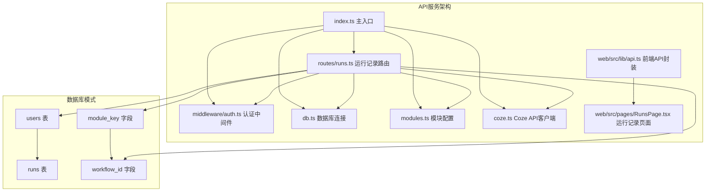

**图表来源**
- [index.ts:1-29](file://api/src/index.ts#L1-L29)
- [runs.ts:1-159](file://api/src/routes/runs.ts#L1-L159)
- [db.ts:10-34](file://api/src/db.ts#L10-L34)

**章节来源**
- [index.ts:1-29](file://api/src/index.ts#L1-L29)
- [runs.ts:1-159](file://api/src/routes/runs.ts#L1-L159)

## 核心组件

### 数据模型定义

运行记录接口基于以下核心数据结构：

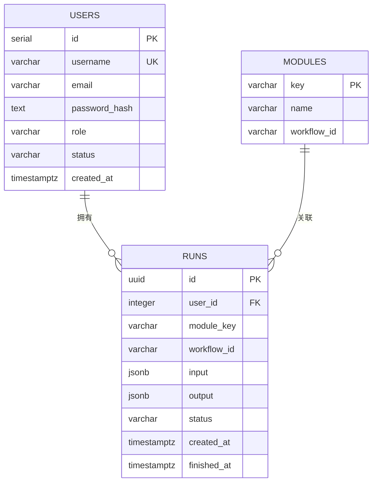

**图表来源**
- [db.ts:22-32](file://api/src/db.ts#L22-L32)
- [modules.ts:1-29](file://api/src/modules.ts#L1-L29)

### 状态枚举值

运行记录支持以下状态枚举：
- **RUNNING**: 正在执行中
- **SUCCESS**: 执行成功
- **FAILED**: 执行失败

### 时间戳管理

系统使用PostgreSQL的`timestamptz`类型确保时区一致性：
- `created_at`: 记录创建时间，默认为当前时间
- `finished_at`: 记录完成时间，执行完成后更新

**章节来源**
- [db.ts:22-32](file://api/src/db.ts#L22-L32)
- [runs.ts:114-156](file://api/src/routes/runs.ts#L114-L156)

## 架构概览

运行记录接口采用分层架构设计，实现了清晰的关注点分离：

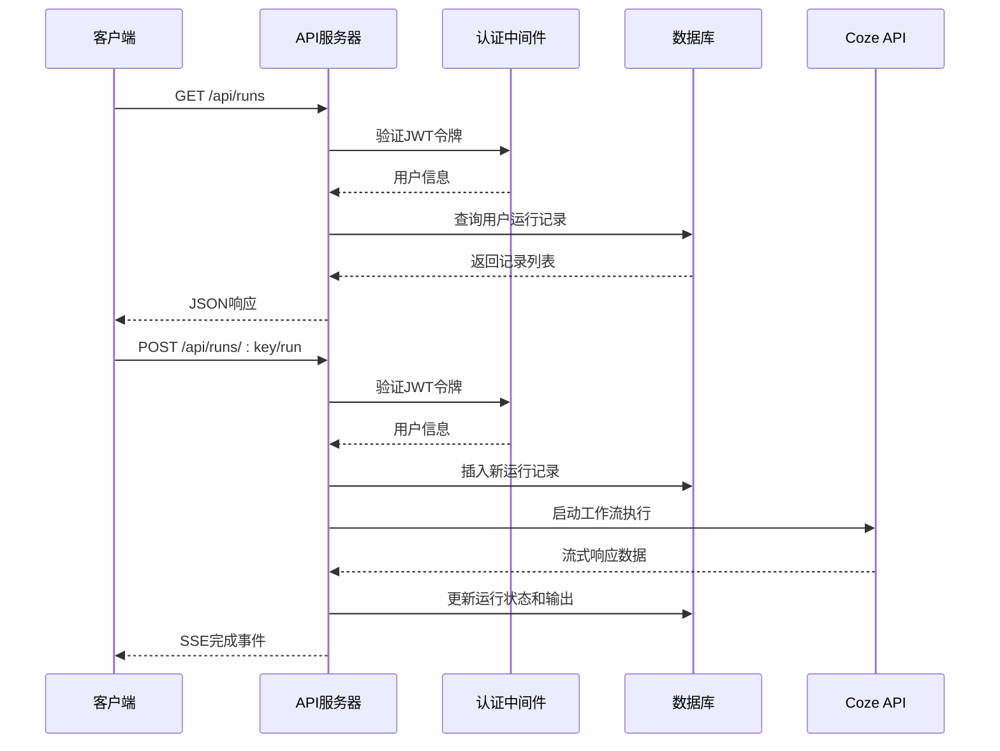

**图表来源**
- [runs.ts:13-29](file://api/src/routes/runs.ts#L13-L29)
- [runs.ts:55-157](file://api/src/routes/runs.ts#L55-L157)
- [auth.ts:8-22](file://api/src/middleware/auth.ts#L8-L22)

## 详细组件分析

### 运行记录路由处理

#### 获取用户运行记录列表

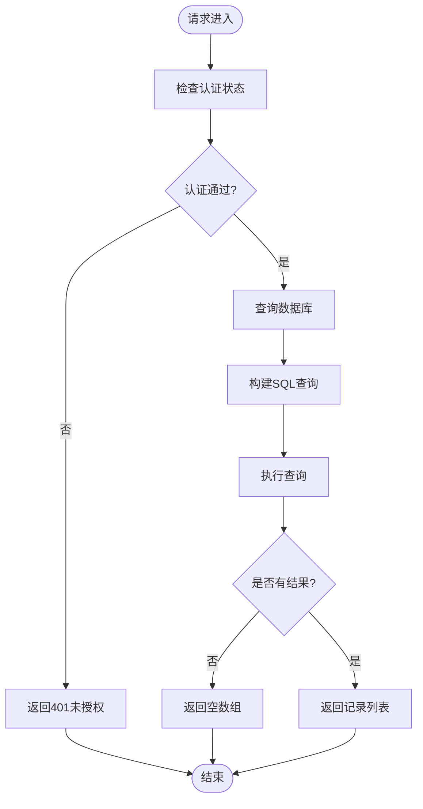

**图表来源**
- [runs.ts:13-29](file://api/src/routes/runs.ts#L13-L29)

#### 获取单个运行记录详情

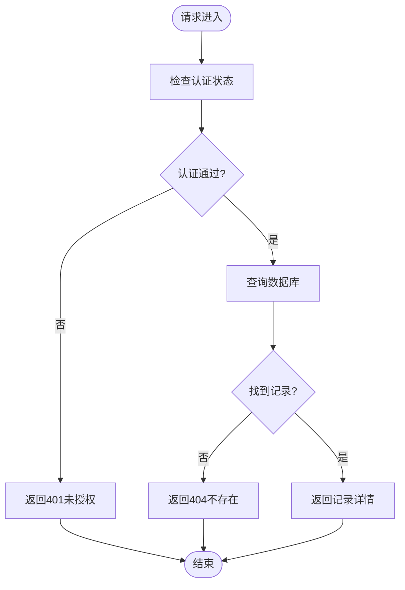

**图表来源**
- [runs.ts:34-53](file://api/src/routes/runs.ts#L34-L53)

#### 启动工作流执行

这是最复杂的流程，涉及实时流式传输：

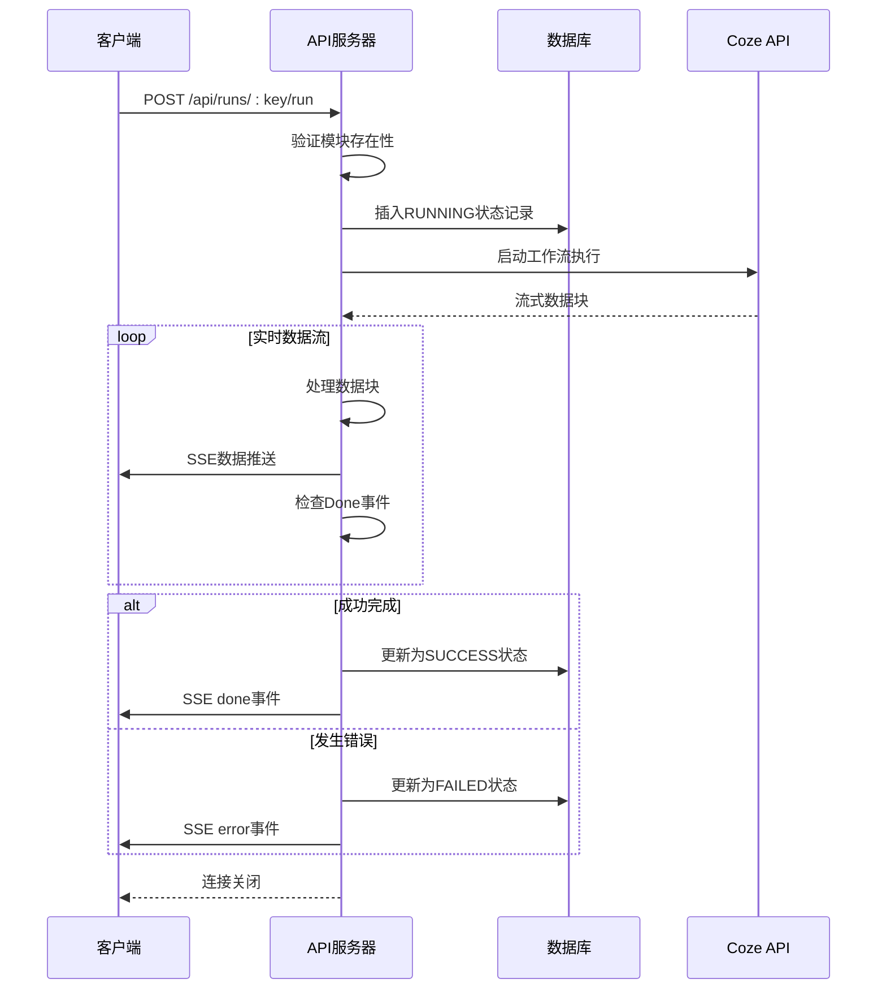

**图表来源**
- [runs.ts:55-157](file://api/src/routes/runs.ts#L55-L157)

**章节来源**
- [runs.ts:13-53](file://api/src/routes/runs.ts#L13-L53)
- [runs.ts:55-157](file://api/src/routes/runs.ts#L55-L157)

### 认证中间件

运行记录接口要求所有操作都必须经过认证：

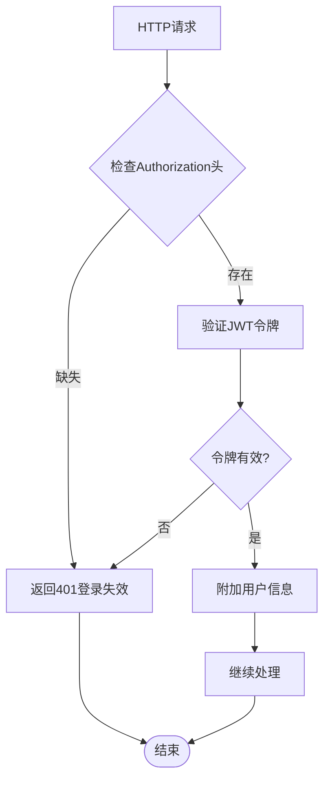

**图表来源**
- [auth.ts:8-22](file://api/src/middleware/auth.ts#L8-L22)

**章节来源**
- [auth.ts:8-22](file://api/src/middleware/auth.ts#L8-L22)

### 数据库连接和模式

系统使用PostgreSQL作为数据存储，采用连接池管理：

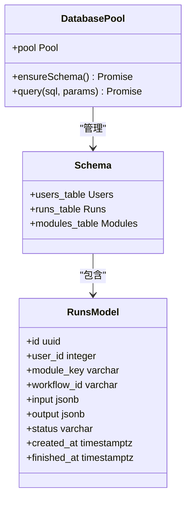

**图表来源**
- [db.ts:6-8](file://api/src/db.ts#L6-L8)
- [db.ts:10-34](file://api/src/db.ts#L10-L34)

**章节来源**
- [db.ts:6-8](file://api/src/db.ts#L6-L8)
- [db.ts:10-34](file://api/src/db.ts#L10-L34)

## 依赖关系分析

### 外部依赖

运行记录接口依赖以下外部服务：

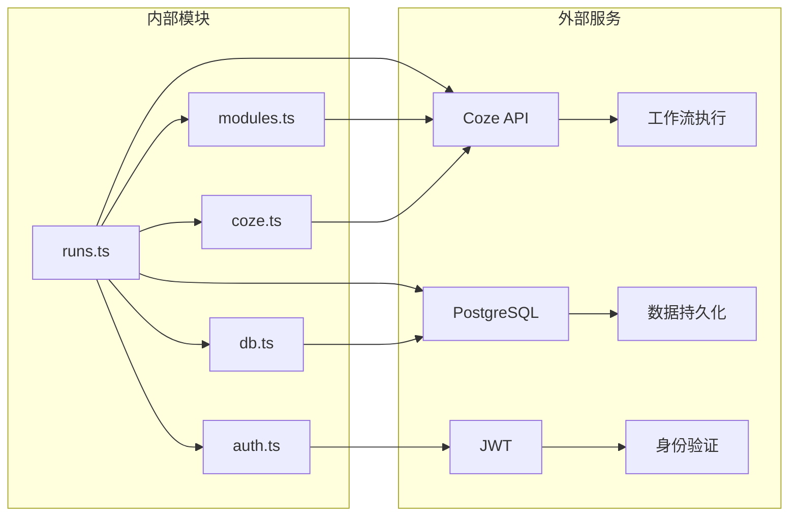

**图表来源**
- [runs.ts:1-8](file://api/src/routes/runs.ts#L1-L8)
- [coze.ts:4-7](file://api/src/coze.ts#L4-L7)

### 内部依赖关系

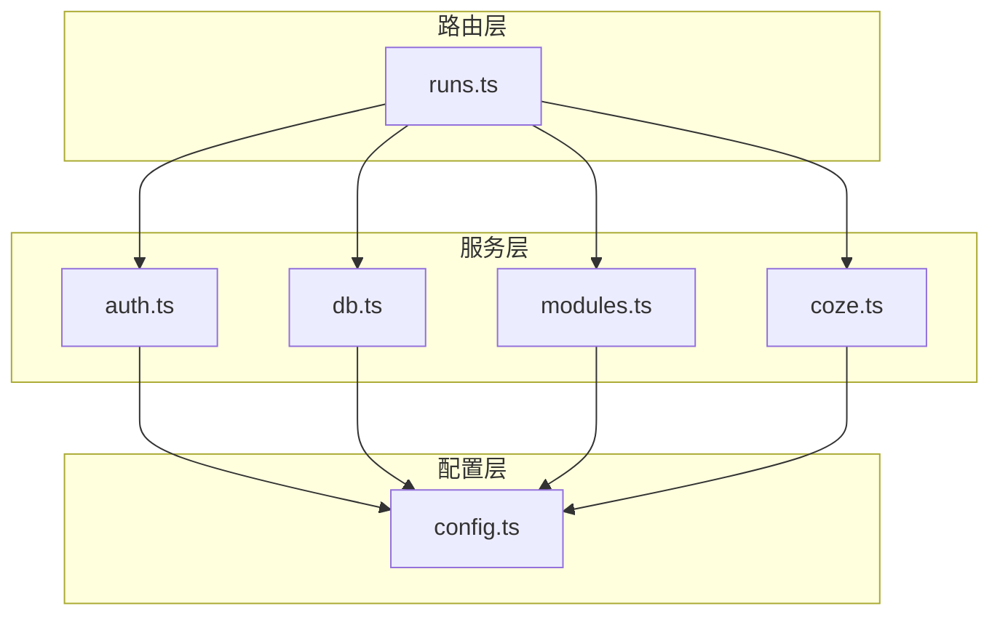

**图表来源**
- [index.ts:19-23](file://api/src/index.ts#L19-L23)
- [runs.ts:1-8](file://api/src/routes/runs.ts#L1-L8)

**章节来源**
- [index.ts:19-23](file://api/src/index.ts#L19-L23)
- [runs.ts:1-8](file://api/src/routes/runs.ts#L1-L8)

## 性能考虑

### 数据库优化

1. **查询优化**: 默认限制返回100条记录，避免大量数据传输
2. **索引建议**: 建议在以下字段建立索引
   - `user_id` (用户维度查询)
   - `created_at` (时间排序)
   - `status` (状态过滤)
   - `module_key` (模块过滤)

### 流式传输优化

1. **SSE连接**: 使用Server-Sent Events实现实时数据传输
2. **缓冲管理**: 动态缓冲区管理，避免内存泄漏
3. **错误恢复**: 支持部分成功场景的优雅降级

### 前端性能

1. **轮询间隔**: 5秒自动刷新，平衡实时性和性能
2. **分页显示**: Ant Design表格默认每页10条记录
3. **URL提取**: 自动提取调试链接，提升用户体验

## 故障排除指南

### 常见错误及解决方案

| 错误类型 | 症状 | 可能原因 | 解决方案 |
|---------|------|----------|----------|
| 401 未授权 | 访问被拒绝 | JWT令牌无效或过期 | 重新登录获取新令牌 |
| 404 模块不存在 | 工作流启动失败 | 模块键错误 | 检查模块配置 |
| 404 任务不存在 | 查看详情失败 | 运行记录ID错误 | 确认任务ID正确性 |
| 数据库连接失败 | 所有操作超时 | PostgreSQL服务异常 | 检查数据库连接字符串 |

### 调试工具

前端提供了完善的调试功能：

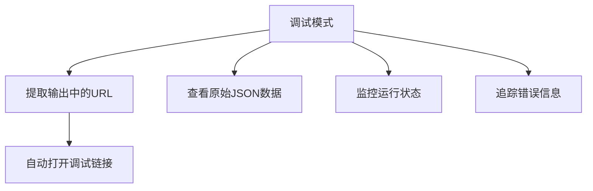

**图表来源**
- [RunsPage.tsx:35-55](file://web/src/pages/RunsPage.tsx#L35-L55)

**章节来源**
- [RunsPage.tsx:35-55](file://web/src/pages/RunsPage.tsx#L35-L55)

## 结论

运行记录接口提供了完整的工作流执行管理解决方案，具有以下特点：

1. **完整的生命周期管理**: 从创建到完成的全链路跟踪
2. **实时状态更新**: 通过SSE实现实时数据流传输
3. **强类型安全**: TypeScript确保类型安全
4. **可扩展架构**: 模块化设计便于功能扩展
5. **用户友好界面**: 提供直观的运行记录管理界面

该接口为AI工作流系统的稳定运行提供了坚实基础，支持大规模并发访问和复杂的工作流执行场景。