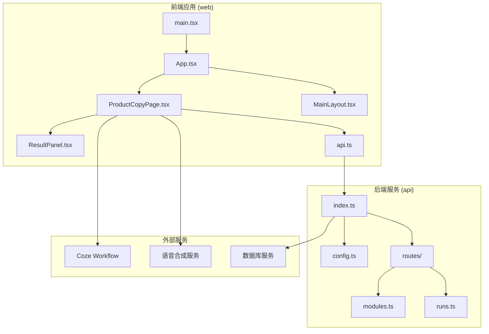
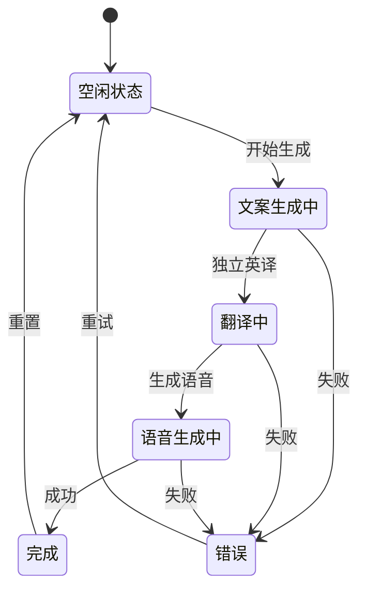
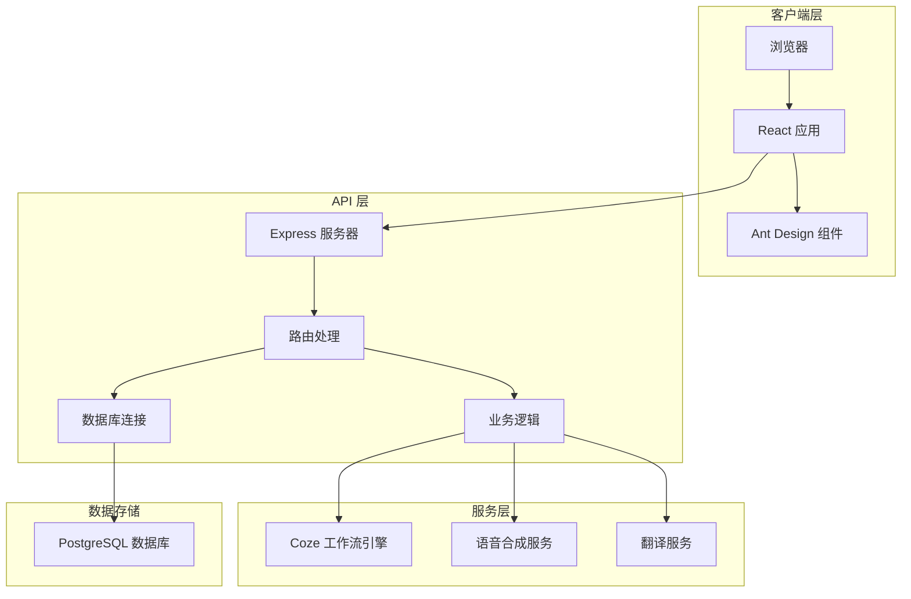
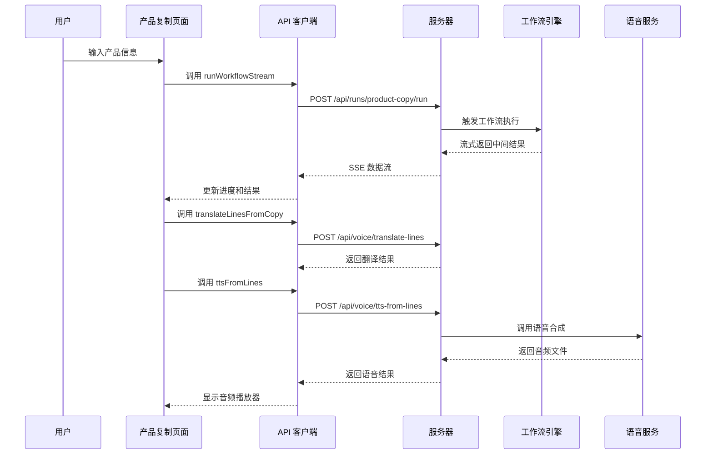
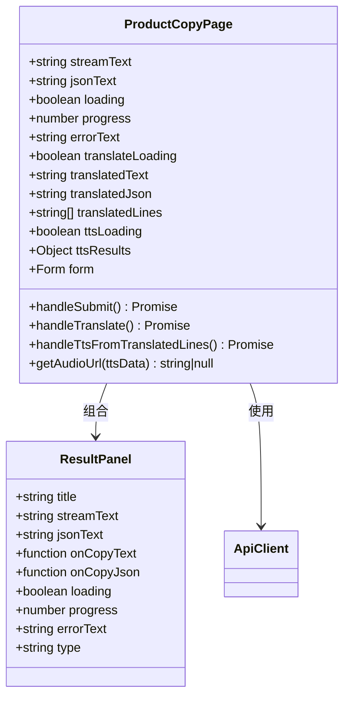
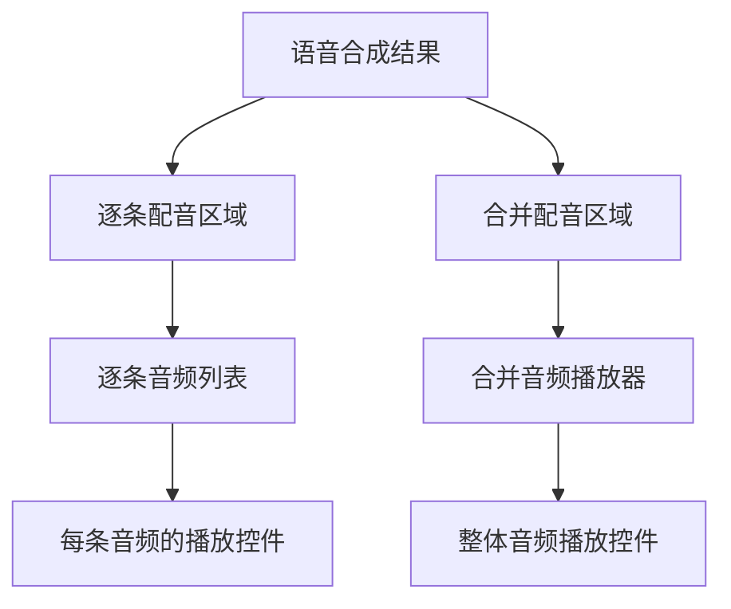
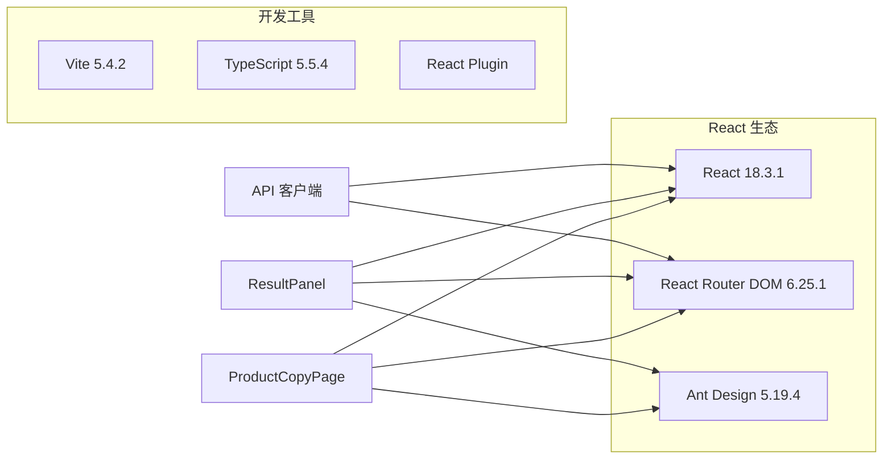
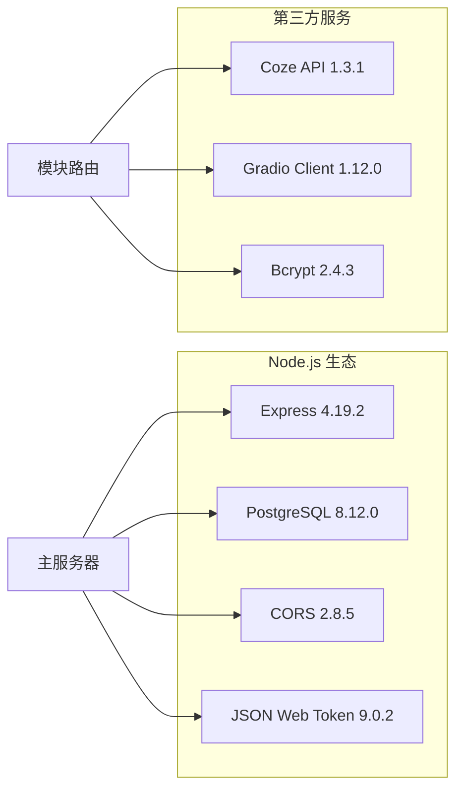

# 产品复制页面

<cite>
**本文档引用的文件**
- [ProductCopyPage.tsx](file://web/src/pages/ProductCopyPage.tsx)
- [api.ts](file://web/src/lib/api.ts)
- [ResultPanel.tsx](file://web/src/components/ResultPanel.tsx)
- [App.tsx](file://web/src/App.tsx)
- [main.tsx](file://web/src/main.tsx)
- [MainLayout.tsx](file://web/src/layouts/MainLayout.tsx)
- [styles.css](file://web/src/styles.css)
- [index.html](file://web/index.html)
- [index.ts](file://api/src/index.ts)
- [config.ts](file://api/src/config.ts)
- [runs.ts](file://api/src/routes/runs.ts)
- [package.json](file://web/package.json)
- [package.json](file://api/package.json)
</cite>

## 更新摘要
**变更内容**
- ProductCopyPage 组件经历了完全重写，从原有的复杂架构简化为更清晰的三阶段工作流
- 移除了 V2 音频生成功能，专注于传统的文案生成、翻译和语音合成流程
- 修复了中文模板选项显示问题，解决了字符编码导致的中文乱码问题
- 增强了 UI 文本的正确渲染，确保中文界面元素正常显示
- 更新了 V2 功能的中文支持，完善了中文界面的本地化显示
- 优化了 HTML 文档的字符编码设置，确保整个应用的字符集一致性

## 目录
1. [简介](#简介)
2. [项目结构](#项目结构)
3. [核心组件](#核心组件)
4. [架构概览](#架构概览)
5. [详细组件分析](#详细组件分析)
6. [依赖关系分析](#依赖关系分析)
7. [性能考虑](#性能考虑)
8. [故障排除指南](#故障排除指南)
9. [结论](#结论)

## 简介

产品复制页面是基于 Coze 工作流平台构建的一个综合性内容创作工具，专门用于生成高质量的产品营销文案。该页面集成了完整的文案生成、翻译和语音合成工作流程，为用户提供从创意到成品的一站式解决方案。

**更新** ProductCopyPage 组件经过完全重写，移除了复杂的 V2 音频生成功能，回归到简洁明了的三阶段工作流：文案生成 → 独立翻译 → 语音合成。本次更新特别关注了字符编码改进，修复了中文模板选项显示问题，增强了 UI 文本的正确渲染，并完善了中文界面的本地化显示。

该系统采用前后端分离架构，前端使用 React + Ant Design 构建用户界面，后端基于 Express.js 提供 RESTful API 服务。核心功能包括：

- **智能文案生成**：基于预设模板和产品信息生成专业营销文案
- **多语言翻译**：支持独立的英文翻译功能
- **语音合成**：将文本转换为高质量的语音文件（MP3+WAV）
- **实时流式处理**：提供渐进式的用户体验反馈
- **中文字符编码支持**：确保中文界面元素的正确显示

## 项目结构

整个项目采用清晰的分层架构设计，前后端分离且职责明确：

**图表来源**
- [main.tsx:1-17](file://web/src/main.tsx#L1-L17)
- [App.tsx:1-72](file://web/src/App.tsx#L1-L72)
- [index.ts:1-29](file://api/src/index.ts#L1-L29)

**章节来源**
- [main.tsx:1-17](file://web/src/main.tsx#L1-L17)
- [App.tsx:1-72](file://web/src/App.tsx#L1-L72)
- [package.json:1-26](file://web/package.json#L1-26)
- [package.json:1-37](file://api/package.json#L1-37)

## 核心组件

### 主要功能模块

产品复制页面包含三个核心功能模块，每个模块都有独立的状态管理和数据处理逻辑：

1. **文案生成模块**：负责调用 Coze 工作流生成产品文案
2. **翻译模块**：提供独立的英文翻译功能
3. **语音合成模块**：将文本转换为语音文件

### 状态管理架构

**图表来源**
- [ProductCopyPage.tsx:13-292](file://web/src/pages/ProductCopyPage.tsx#L13-L292)

**章节来源**
- [ProductCopyPage.tsx:13-292](file://web/src/pages/ProductCopyPage.tsx#L13-L292)

## 架构概览

### 系统架构图

**图表来源**
- [index.ts:1-29](file://api/src/index.ts#L1-L29)
- [config.ts:13-19](file://api/src/config.ts#L13-L19)
- [runs.ts:6-8](file://api/src/routes/runs.ts#L6-L8)

### 数据流架构

**图表来源**
- [ProductCopyPage.tsx:33-136](file://web/src/pages/ProductCopyPage.tsx#L33-L136)
- [api.ts:58-163](file://web/src/lib/api.ts#L58-L163)

## 详细组件分析

### ProductCopyPage 组件

ProductCopyPage 是整个应用的核心组件，实现了完整的文案生成工作流程：

#### 组件结构分析

**图表来源**
- [ProductCopyPage.tsx:13-292](file://web/src/pages/ProductCopyPage.tsx#L13-L292)
- [ResultPanel.tsx:3-118](file://web/src/components/ResultPanel.tsx#L3-L118)

#### 表单配置

组件支持四种不同的文案模板，现已修复中文字符编码问题：

| 模板类型 | 关键特征 | 适用场景 |
|---------|----------|----------|
| 知识科普 | 教育性强，信息丰富 | 科技产品、健康产品 |
| 种草推荐 | 推荐性质，情感丰富 | 化妆品、服饰、食品 |
| 直播带货 | 短促有力，促销导向 | 直播电商、限时促销 |
| 强对比 | 对比强烈，突出差异 | 性价比产品、竞品对比 |

**更新** 中文模板选项现已正确显示，解决了之前显示为"强对?"的问题。

#### V2 功能模块

**已移除** V2 功能模块已被完全移除，不再支持一键生成带音频的完整文案结果。

#### 语音合成区域

语音合成完成后，系统通过专门的音频播放区域展示结果：

#### 音频播放区域结构

**图表来源**
- [ProductCopyPage.tsx:230-285](file://web/src/pages/ProductCopyPage.tsx#L230-L285)

音频播放区域包含两个部分：
1. **逐条配音**：显示每条翻译文本对应的音频
2. **合并配音**：显示所有文本合并后的音频

**章节来源**
- [ProductCopyPage.tsx:230-285](file://web/src/pages/ProductCopyPage.tsx#L230-L285)

## 依赖关系分析

### 前端依赖关系

**图表来源**
- [package.json:11-24](file://web/package.json#L11-L24)

### 后端依赖关系

**图表来源**
- [package.json:11-35](file://api/package.json#L11-L35)

**章节来源**
- [package.json:1-26](file://web/package.json#L1-26)
- [package.json:1-37](file://api/package.json#L1-37)

## 性能考虑

### 前端性能优化

1. **懒加载策略**：使用 React.lazy 和 Suspense 实现组件懒加载
2. **状态优化**：合理使用 React.memo 和 useMemo 避免不必要的重渲染
3. **内存管理**：及时清理事件监听器和定时器
4. **资源压缩**：生产环境启用代码分割和资源压缩

### 后端性能优化

1. **数据库连接池**：使用连接池管理数据库连接
2. **查询优化**：为常用查询建立索引
3. **缓存策略**：对静态数据实施缓存
4. **并发控制**：限制同时运行的工作流数量

## 故障排除指南

### 常见问题及解决方案

#### 认证相关问题

| 问题症状 | 可能原因 | 解决方案 |
|----------|----------|----------|
| 登录后立即跳转到登录页 | 令牌过期或无效 | 清除本地存储的令牌重新登录 |
| 401 未授权错误 | 服务器认证失败 | 检查 JWT 密钥配置 |
| 无法访问受保护资源 | 权限不足 | 检查用户角色和权限设置 |

#### 网络连接问题

| 问题症状 | 可能原因 | 解决方案 |
|----------|----------|----------|
| 请求超时 | 网络延迟或服务器繁忙 | 检查 API 基础地址配置 |
| CORS 错误 | 跨域配置不当 | 配置正确的 CORS 策略 |
| SSE 连接断开 | 网络不稳定 | 实现自动重连机制 |

#### 数据处理问题

| 问题症状 | 可能原因 | 解决方案 |
|----------|----------|----------|
| 文案生成失败 | 工作流配置错误 | 检查工作流 ID 和参数 |
| 翻译结果异常 | 翻译服务不可用 | 验证翻译服务配置 |
| 语音合成失败 | 语音服务异常 | 检查语音服务 URL 配置 |
| 中文显示乱码 | 字符编码问题 | 检查 HTML 字符集设置 |

**章节来源**
- [App.tsx:26-39](file://web/src/App.tsx#L26-L39)
- [config.ts:5-11](file://api/src/config.ts#L5-L11)

### 字符编码问题解决

**新增** 针对中文字符编码问题的解决方案：

1. **HTML 字符集设置**：确保 `index.html` 文件包含正确的 `<meta charset="UTF-8">` 设置
2. **CSS 字体配置**：使用支持中文的字体族，如 `"Inter", "Helvetica Neue", Arial, sans-serif`
3. **JavaScript 字符串处理**：确保所有中文字符串使用 UTF-8 编码
4. **模板选项修复**：修正了中文模板选项中的字符编码问题

**章节来源**
- [index.html:1-13](file://web/index.html#L1-L13)
- [styles.css:1-83](file://web/src/styles.css#L1-L83)

## 结论

产品复制页面是一个功能完整、架构清晰的现代化 Web 应用。它成功地将复杂的工作流处理过程封装为简单易用的用户界面，为内容创作者提供了强大的技术支持。

**更新** 经过完全重写后，ProductCopyPage 组件更加简洁高效，专注于核心的文案生成、翻译和语音合成功能。移除的 V2 音频生成功能被简化的工作流程所替代，用户可以通过标准的三阶段流程获得高质量的文案和语音结果。

本次更新重点关注了字符编码改进，修复了中文模板选项显示问题，增强了 UI 文本的正确渲染，并完善了中文界面的本地化显示。这些改进确保了应用在中文环境下的稳定运行和良好的用户体验。

### 主要优势

1. **用户体验优秀**：直观的界面设计和流畅的交互体验
2. **功能完整**：覆盖从文案生成到语音合成的完整工作流程
3. **技术架构先进**：采用现代前端技术和响应式设计
4. **可扩展性强**：模块化的架构便于功能扩展和维护
5. **中文支持完善**：解决了字符编码问题，确保中文界面元素正确显示
6. **代码结构清晰**：移除了复杂的 V2 功能，使代码更加简洁易维护

### 技术亮点

- **流式数据处理**：提供实时的进度反馈和中间结果展示
- **多语言支持**：完整的国际化和本地化支持，特别是中文字符编码优化
- **安全可靠**：完善的认证授权和错误处理机制
- **性能优化**：合理的资源管理和性能优化策略
- **类型化结果展示**：通过 ResultPanel 类型系统清晰区分不同结果类别
- **字符编码修复**：解决了中文显示乱码问题，确保界面元素正确渲染

该系统为类似的内容创作工具提供了优秀的参考范例，其设计理念和技术实现都值得深入学习和借鉴。特别是字符编码改进方面的实践，为中文 Web 应用开发提供了宝贵的经验。