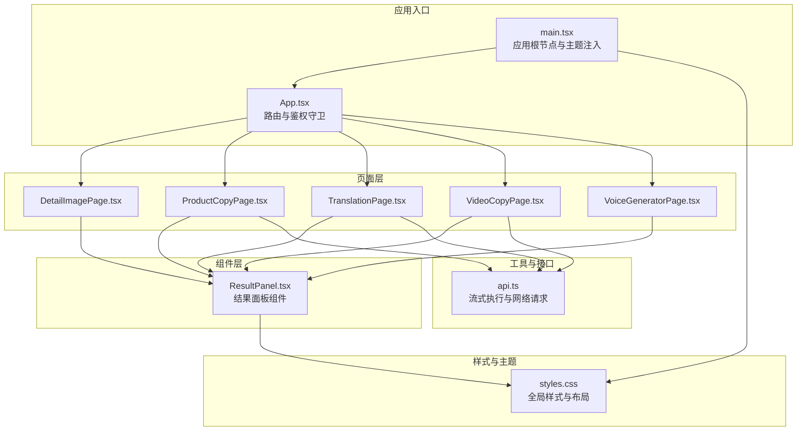
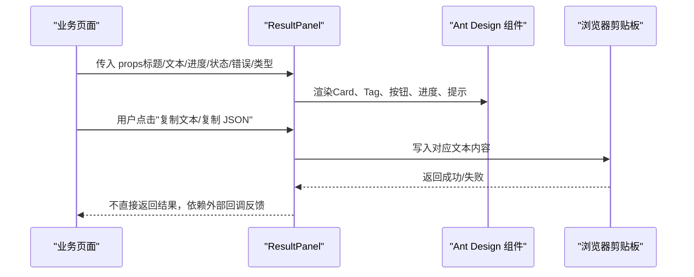
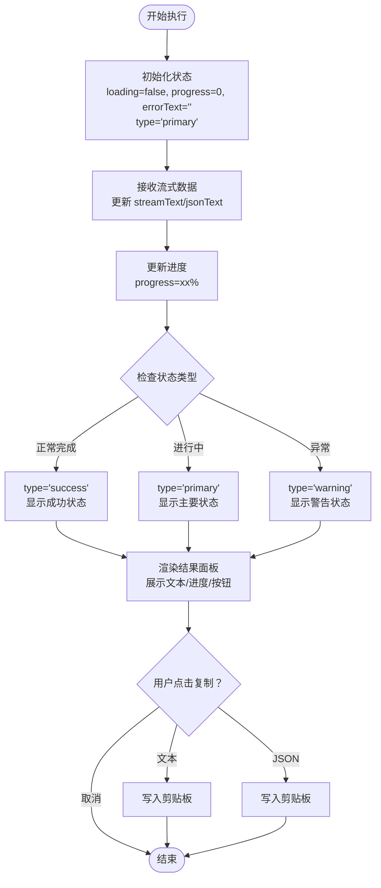
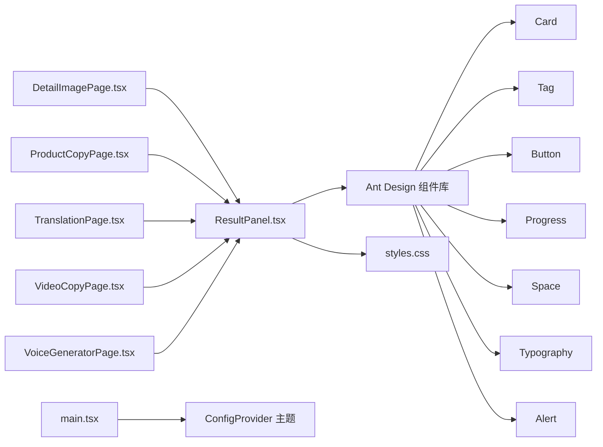

# UI 组件

<cite>
**本文引用的文件**
- [ResultPanel.tsx](file://web/src/components/ResultPanel.tsx)
- [styles.css](file://web/src/styles.css)
- [main.tsx](file://web/src/main.tsx)
- [App.tsx](file://web/src/App.tsx)
- [DetailImagePage.tsx](file://web/src/pages/DetailImagePage.tsx)
- [ProductCopyPage.tsx](file://web/src/pages/ProductCopyPage.tsx)
- [TranslationPage.tsx](file://web/src/pages/TranslationPage.tsx)
- [VideoCopyPage.tsx](file://web/src/pages/VideoCopyPage.tsx)
- [VoiceGeneratorPage.tsx](file://web/src/pages/VoiceGeneratorPage.tsx)
- [api.ts](file://web/src/lib/api.ts)
- [package.json](file://web/package.json)
- [tsconfig.json](file://web/tsconfig.json)
</cite>

## 更新摘要
**变更内容**
- ResultPanel 组件从简单 div 布局升级为 Ant Design Card 结构
- 新增类型系统（primary/success/warning），通过 Tag 组件实现颜色标识
- 改进复制功能，使用 Ant Design 图标和增强的按钮样式
- 增强视觉层次和用户体验，提供更丰富的状态表达
- 优化样式组织，通过 CSS 类名实现更好的主题定制

## 目录
1. [简介](#简介)
2. [项目结构](#项目结构)
3. [核心组件](#核心组件)
4. [架构总览](#架构总览)
5. [组件详解](#组件详解)
6. [依赖关系分析](#依赖关系分析)
7. [性能与体验](#性能与体验)
8. [故障排查指南](#故障排查指南)
9. [结论](#结论)
10. [附录](#附录)

## 简介
本文件聚焦于通用 UI 组件"结果面板（ResultPanel）"的设计、实现与使用方式，覆盖其视觉外观、行为特征、交互模式、属性配置、事件处理、状态管理、样式定制、主题支持、响应式设计、无障碍与跨浏览器兼容性以及性能优化建议。ResultPanel 已从简单的 div 布局升级为基于 Ant Design Card 的现代化组件，新增类型系统和增强的视觉层次，显著提升了用户体验和可维护性。

## 项目结构
前端采用 React + Vite + Ant Design 构建，主题通过 ConfigProvider 注入；全局样式集中于 styles.css；ResultPanel 作为可复用组件在多个业务页面中被调用，用于展示流式输出、进度、错误信息及提供一键复制能力。

**图表来源**
- [main.tsx:1-17](file://web/src/main.tsx#L1-L17)
- [App.tsx:1-70](file://web/src/App.tsx#L1-L70)
- [ResultPanel.tsx:1-77](file://web/src/components/ResultPanel.tsx#L1-L77)
- [styles.css:1-82](file://web/src/styles.css#L1-L82)
- [DetailImagePage.tsx:330-346](file://web/src/pages/DetailImagePage.tsx#L330-L346)
- [ProductCopyPage.tsx:240-262](file://web/src/pages/ProductCopyPage.tsx#L240-L262)
- [TranslationPage.tsx:125-134](file://web/src/pages/TranslationPage.tsx#L125-L134)
- [VideoCopyPage.tsx:187-196](file://web/src/pages/VideoCopyPage.tsx#L187-L196)
- [VoiceGeneratorPage.tsx:60-95](file://web/src/pages/VoiceGeneratorPage.tsx#L60-L95)
- [api.ts:58-115](file://web/src/lib/api.ts#L58-L115)

**章节来源**
- [main.tsx:1-17](file://web/src/main.tsx#L1-L17)
- [App.tsx:1-70](file://web/src/App.tsx#L1-L70)
- [styles.css:1-82](file://web/src/styles.css#L1-L82)

## 核心组件
- 组件名称：结果面板（ResultPanel）
- 组件定位：通用结果展示容器，支持标题、操作按钮、进度条、加载提示、错误提示与文本区域展示，并提供一键复制能力。
- 设计原则：简洁、一致、可复用；与 Ant Design 原子组件协作，保持风格统一。
- **更新**：现基于 Ant Design Card 组件构建，支持类型系统和增强的视觉层次。

**章节来源**
- [ResultPanel.tsx:1-77](file://web/src/components/ResultPanel.tsx#L1-L77)

## 架构总览
ResultPanel 在多个页面中以相同形态出现，但数据来源与状态由各页面管理。页面通过 props 将流式文本、JSON 文本、进度、加载状态、错误信息传递给 ResultPanel；同时提供复制回调函数，实现剪贴板写入。新增的类型系统使组件能够更好地表达不同状态和重要性级别。

**图表来源**
- [ResultPanel.tsx:1-77](file://web/src/components/ResultPanel.tsx#L1-L77)
- [DetailImagePage.tsx:330-340](file://web/src/pages/DetailImagePage.tsx#L330-L340)
- [ProductCopyPage.tsx:240-262](file://web/src/pages/ProductCopyPage.tsx#L240-L262)
- [TranslationPage.tsx:125-134](file://web/src/pages/TranslationPage.tsx#L125-L134)
- [VideoCopyPage.tsx:187-196](file://web/src/pages/VideoCopyPage.tsx#L187-L196)

## 组件详解

### 视觉外观与布局
- **容器结构**：基于 Ant Design Card 组件，提供标准的卡片布局和阴影效果。
- **标题系统**：使用 Tag 组件显示标题，支持三种类型颜色（蓝色-主要、绿色-成功、橙色-警告）。
- **操作区域**：Card 的 extra 区域包含复制按钮，使用 Ant Design 图标。
- **进度条**：小尺寸进度条，仅在存在数值时显示。
- **加载态**：二级文字提示"任务运行中..."，柔和颜色传达非阻塞状态。
- **错误态**：错误提示框，带图标，明确错误信息。
- **文本展示区**：深色背景、等宽字体、固定高度、自动滚动，适合日志/流式输出阅读。

**更新**：从简单 div 布局升级为 Card 结构，提供更好的视觉层次和一致性。

**章节来源**
- [ResultPanel.tsx:33-72](file://web/src/components/ResultPanel.tsx#L33-L72)
- [styles.css:52-57](file://web/src/styles.css#L52-L57)

### 行为特征与交互模式
- **类型系统**：支持 primary、success、warning 三种类型，通过 Tag 颜色直观表达状态重要性。
- **操作按钮**：复制文本、复制 JSON；当无 JSON 文本时复制 JSON 按钮禁用。
- **状态切换**：根据 loading 与 progress 动态渲染不同 UI 片段。
- **错误展示**：errorText 存在时显示错误提示框。
- **文本展示**：streamText 为空时显示占位提示，避免空白区域。

**更新**：新增类型系统，提供更丰富的状态表达和视觉反馈。

**章节来源**
- [ResultPanel.tsx:16-74](file://web/src/components/ResultPanel.tsx#L16-L74)

### 属性配置（Props）
- title: 面板标题字符串
- streamText: 流式文本内容
- jsonText: JSON 文本内容（可选）
- onCopyText(): 复制文本回调
- onCopyJson(): 复制 JSON 回调（可选）
- loading: 是否处于加载状态
- progress: 数值型进度（0-100），用于显示进度条
- errorText: 错误信息字符串（可选）
- type: 类型字符串，支持 'primary' | 'success' | 'warning'（默认：'primary'）

**更新**：新增 type 属性，支持三种类型系统。

**章节来源**
- [ResultPanel.tsx:4-14](file://web/src/components/ResultPanel.tsx#L4-L14)

### 事件处理与插槽使用
- **事件**：两个按钮的点击事件绑定到传入的回调函数。
- **插槽**：当前实现未使用 React 插槽（slots），而是通过 props 传入内容与回调，保持与 Ant Design 组件风格一致。
- **图标系统**：使用 Ant Design 的 CopyOutlined 图标，提供更好的视觉一致性。

**更新**：改进图标系统，使用 Ant Design 图标组件。

**章节来源**
- [ResultPanel.tsx:41-51](file://web/src/components/ResultPanel.tsx#L41-L51)

### 状态管理
- ResultPanel 内部不维护状态，完全受控于父组件。
- 父组件负责：
  - 管理流式文本与 JSON 文本的累积
  - 控制 loading 与 progress
  - 处理错误信息
  - 提供复制回调（通常基于浏览器剪贴板 API）
  - **新增**：根据业务场景选择合适的类型（primary/success/warning）

**更新**：父组件现在需要根据业务状态选择合适的类型。

**章节来源**
- [ResultPanel.tsx:16-74](file://web/src/components/ResultPanel.tsx#L16-L74)
- [ProductCopyPage.tsx:240-262](file://web/src/pages/ProductCopyPage.tsx#L240-L262)
- [TranslationPage.tsx:125-134](file://web/src/pages/TranslationPage.tsx#L125-L134)
- [VideoCopyPage.tsx:187-196](file://web/src/pages/VideoCopyPage.tsx#L187-L196)

### 动画效果与过渡处理
- 当前未引入额外动画或过渡效果；主要通过 Ant Design 组件自带的过渡与交互反馈（如按钮 hover、卡片阴影）体现动态感。
- **更新**：Card 组件提供内置的悬停效果和阴影变化，增强视觉反馈。
- 若需增强，可在容器上添加 CSS 过渡或使用第三方动画库，但需注意性能与可访问性。

**章节来源**
- [styles.css:42-50](file://web/src/styles.css#L42-L50)
- [ResultPanel.tsx:33-72](file://web/src/components/ResultPanel.tsx#L33-L72)

### 样式定制与主题支持
- **主题**：通过 ConfigProvider 注入主题令牌，统一主色调。
- **组件样式**：ResultPanel 使用类名与全局样式配合，便于覆盖与扩展。
- **类型样式**：通过 Tag 组件的颜色映射实现类型化样式（primary: blue, success: green, warning: orange）。
- **建议**：为 ResultPanel 定义独立的 CSS 类或 CSS 变量，以便在多主题场景下快速切换。

**更新**：新增类型系统支持，通过 Tag 颜色实现状态可视化。

**章节来源**
- [main.tsx:10-10](file://web/src/main.tsx#L10-L10)
- [styles.css:52-57](file://web/src/styles.css#L52-L57)
- [ResultPanel.tsx:27-31](file://web/src/components/ResultPanel.tsx#L27-L31)

### 响应式设计
- 全局布局采用弹性与网格，ResultPanel 所在容器具备自适应宽度与垂直间距。
- 文本展示区设置固定高度与滚动，确保在窄屏设备上仍可完整阅读。
- **更新**：Card 组件提供内置的响应式行为，自动适配不同屏幕尺寸。

**章节来源**
- [styles.css:36-40](file://web/src/styles.css#L36-L40)
- [styles.css:64-74](file://web/src/styles.css#L64-L74)

### 无障碍访问（a11y）与跨浏览器兼容性
- **无障碍**：标题语义化、按钮具备可访问名称；建议为复制按钮提供 aria-label 或提示文案。
- **跨浏览器**：依赖浏览器剪贴板 API，需在 HTTPS 环境下使用；对不支持的环境提供降级提示。
- **可访问性增强建议**：为按钮添加键盘可达性、焦点可见性；为错误提示提供可读的语义标签。
- **更新**：Card 和 Tag 组件提供内置的无障碍支持，包括适当的语义标记和键盘导航。

**章节来源**
- [ResultPanel.tsx:41-51](file://web/src/components/ResultPanel.tsx#L41-L51)
- [DetailImagePage.tsx:338-339](file://web/src/pages/DetailImagePage.tsx#L338-L339)
- [ProductCopyPage.tsx:250-251](file://web/src/pages/ProductCopyPage.tsx#L250-L251)
- [TranslationPage.tsx:132-133](file://web/src/pages/TranslationPage.tsx#L132-L133)
- [VideoCopyPage.tsx:194-195](file://web/src/pages/VideoCopyPage.tsx#L194-L195)

### 性能优化
- **渲染优化**：ResultPanel 为纯展示组件，props 受控，避免内部状态导致的重渲染。
- **数据更新**：建议父组件对频繁更新的文本进行节流/防抖处理，减少不必要的重渲染。
- **资源占用**：文本展示区固定高度与滚动，避免长文本导致的布局抖动。
- **更新**：Card 组件优化了渲染性能，适合在多个页面中重复使用。

**章节来源**
- [ResultPanel.tsx:16-74](file://web/src/components/ResultPanel.tsx#L16-L74)

### 组合模式与集成方式
- **单面板**：在单一流程中仅展示一次结果面板。
- **多面板**：在同一页面中并列展示多个结果面板，分别呈现不同阶段的结果（如翻译、TTS 等），使用不同类型区分状态。
- **与表单/卡片**：ResultPanel 通常置于表单与卡片之后，形成"输入 → 执行 → 结果"的清晰流程。
- **与流式接口**：ResultPanel 与流式执行接口配合，逐步接收数据并更新 UI。
- **类型化展示**：根据业务状态选择合适的类型（primary-主要流程、success-成功完成、warning-警告状态）。

**更新**：新增类型化展示模式，通过不同颜色表达状态重要性。

**图表来源**
- [api.ts:58-115](file://web/src/lib/api.ts#L58-L115)
- [ProductCopyPage.tsx:240-262](file://web/src/pages/ProductCopyPage.tsx#L240-L262)
- [TranslationPage.tsx:125-134](file://web/src/pages/TranslationPage.tsx#L125-L134)
- [VideoCopyPage.tsx:187-196](file://web/src/pages/VideoCopyPage.tsx#L187-L196)

**章节来源**
- [ProductCopyPage.tsx:240-262](file://web/src/pages/ProductCopyPage.tsx#L240-L262)
- [TranslationPage.tsx:125-134](file://web/src/pages/TranslationPage.tsx#L125-L134)
- [VideoCopyPage.tsx:187-196](file://web/src/pages/VideoCopyPage.tsx#L187-L196)
- [api.ts:58-115](file://web/src/lib/api.ts#L58-L115)

## 依赖关系分析
- **组件依赖**：ResultPanel 依赖 Ant Design 的 Card、Tag、Button、Progress、Space、Typography、Alert 等组件。
- **主题依赖**：通过 ConfigProvider 注入主题令牌，影响按钮、进度条等组件的视觉表现。
- **页面依赖**：多个页面导入 ResultPanel 并传入不同的 props，形成统一的展示规范。
- **样式依赖**：ResultPanel 的外观由全局样式控制，便于集中维护与升级。
- **图标依赖**：使用 Ant Design 的 CopyOutlined 图标，提供更好的视觉一致性。

**更新**：新增 Tag 组件依赖，支持类型化标题显示。

**图表来源**
- [ResultPanel.tsx:1-2](file://web/src/components/ResultPanel.tsx#L1-L2)
- [main.tsx:10-10](file://web/src/main.tsx#L10-L10)
- [DetailImagePage.tsx:330-340](file://web/src/pages/DetailImagePage.tsx#L330-L340)
- [ProductCopyPage.tsx:240-262](file://web/src/pages/ProductCopyPage.tsx#L240-L262)
- [TranslationPage.tsx:125-134](file://web/src/pages/TranslationPage.tsx#L125-L134)
- [VideoCopyPage.tsx:187-196](file://web/src/pages/VideoCopyPage.tsx#L187-L196)
- [VoiceGeneratorPage.tsx:60-95](file://web/src/pages/VoiceGeneratorPage.tsx#L60-L95)
- [styles.css:52-57](file://web/src/styles.css#L52-L57)

**章节来源**
- [package.json:11-24](file://web/package.json#L11-L24)
- [main.tsx:1-17](file://web/src/main.tsx#L1-L17)
- [ResultPanel.tsx:1-77](file://web/src/components/ResultPanel.tsx#L1-L77)

## 性能与体验
- **渲染性能**：ResultPanel 为轻量展示组件，建议在父组件层面做数据更新节流，避免高频重渲染。
- **交互体验**：按钮禁用态与加载态提示明确，提升用户预期；错误提示及时反馈。
- **可访问性**：建议补充键盘导航与屏幕阅读器友好的提示文案。
- **视觉体验**：新增类型系统提供更好的状态表达，Card 结构增强视觉层次。
- **更新**：Card 组件提供内置的性能优化和响应式行为。

## 故障排查指南
- **复制功能无效**
  - 确认运行环境为 HTTPS，且浏览器允许剪贴板 API。
  - 检查 onCopyText/onCopyJson 回调是否正确传入。
- **进度条不显示**
  - 确认 progress 为数值类型且在合理范围。
- **错误信息不出现**
  - 确认 errorText 字符串非空。
- **文本展示空白**
  - 确认 streamText 非空；若为空，组件会显示占位提示。
- **类型显示异常**
  - 确认 type 属性值为 'primary' | 'success' | 'warning' 之一。
- **Card 样式问题**
  - 检查 CSS 类名 'result-panel' 是否正确应用。
  - 确认 Ant Design 样式已正确加载。

**更新**：新增类型系统和 Card 样式的故障排查项。

**章节来源**
- [ResultPanel.tsx:27-31](file://web/src/components/ResultPanel.tsx#L27-L31)
- [ResultPanel.tsx:52-57](file://web/src/components/ResultPanel.tsx#L52-L57)
- [DetailImagePage.tsx:338-339](file://web/src/pages/DetailImagePage.tsx#L338-L339)
- [ProductCopyPage.tsx:250-251](file://web/src/pages/ProductCopyPage.tsx#L250-L251)
- [TranslationPage.tsx:132-133](file://web/src/pages/TranslationPage.tsx#L132-L133)
- [VideoCopyPage.tsx:194-195](file://web/src/pages/VideoCopyPage.tsx#L194-L195)

## 结论
ResultPanel 已成功从简单 div 布局升级为基于 Ant Design Card 的现代化组件，新增类型系统和增强的视觉层次显著提升了用户体验。通过简洁、受控的方式实现了统一的结果展示，与 Ant Design 生态无缝衔接，适配多页面、多流程的复杂场景。新的类型系统（primary/success/warning）提供了更好的状态表达，Card 结构增强了视觉层次，改进的图标系统提升了视觉一致性。

建议在后续迭代中完善可访问性、主题化与动画体验，并在父组件层面加强数据更新策略以提升整体性能。同时，充分利用新增的类型系统来改善用户体验和界面一致性。

## 附录
- **技术栈与版本**
  - React 18.3.1、Ant Design 5.19.4、Vite 5.4.2、TypeScript 5.5.4
- **TypeScript 编译配置要点**
  - 启用严格模式与 JSX 支持，模块解析采用 Bundler，确保与 Vite 协同
- **新增特性**
  - 类型系统：支持 primary、success、warning 三种类型
  - Card 结构：提供更好的视觉层次和一致性
  - Tag 集成：通过颜色直观表达状态重要性
  - 图标优化：使用 Ant Design CopyOutlined 图标

**章节来源**
- [package.json:1-26](file://web/package.json#L1-L26)
- [tsconfig.json:1-21](file://web/tsconfig.json#L1-L21)
- [ResultPanel.tsx:27-31](file://web/src/components/ResultPanel.tsx#L27-L31)
- [ResultPanel.tsx:34-40](file://web/src/components/ResultPanel.tsx#L34-L40)