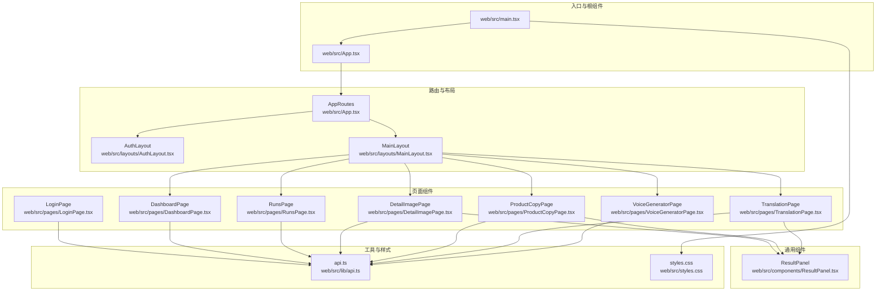
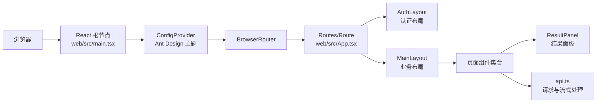
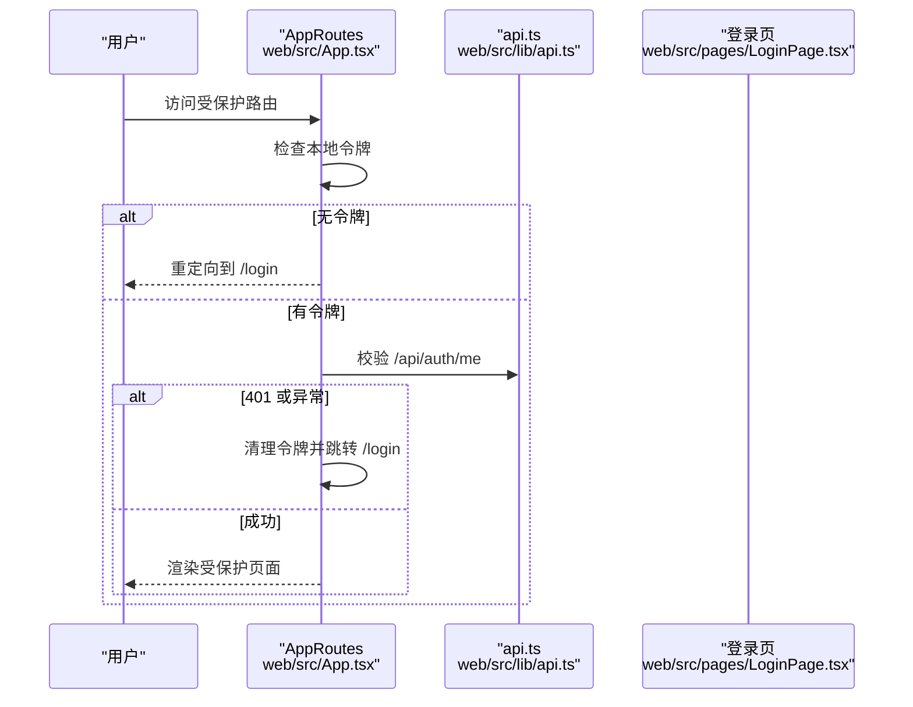
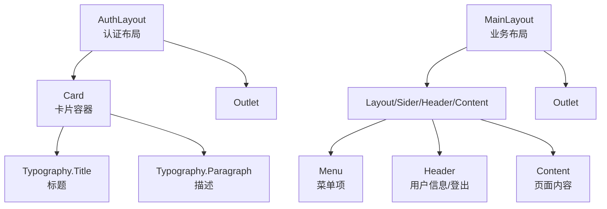
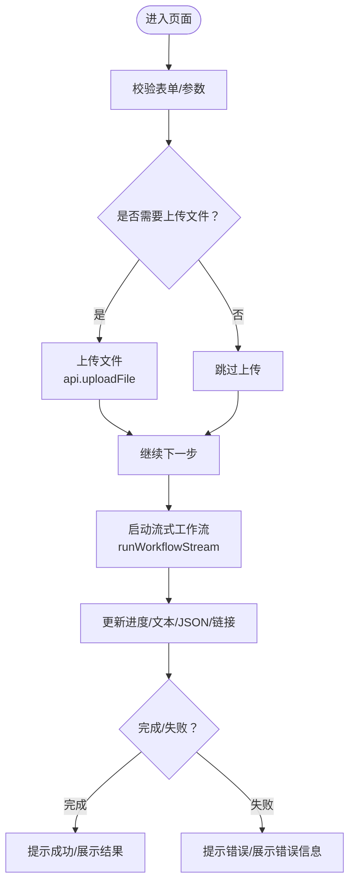
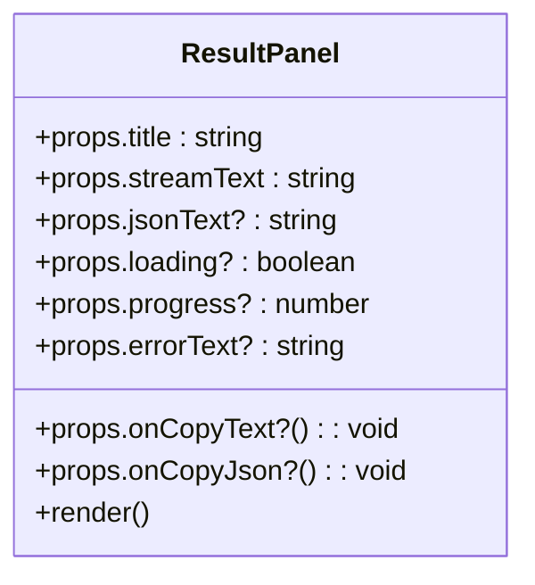
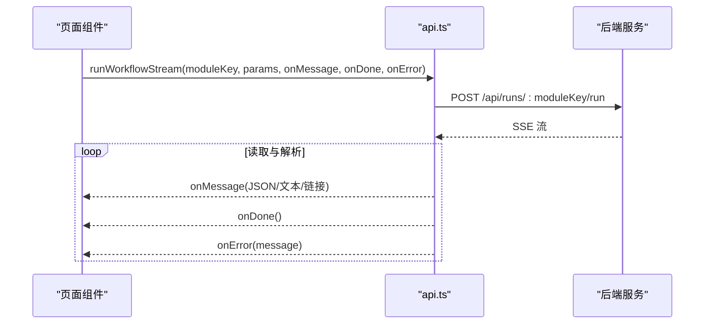
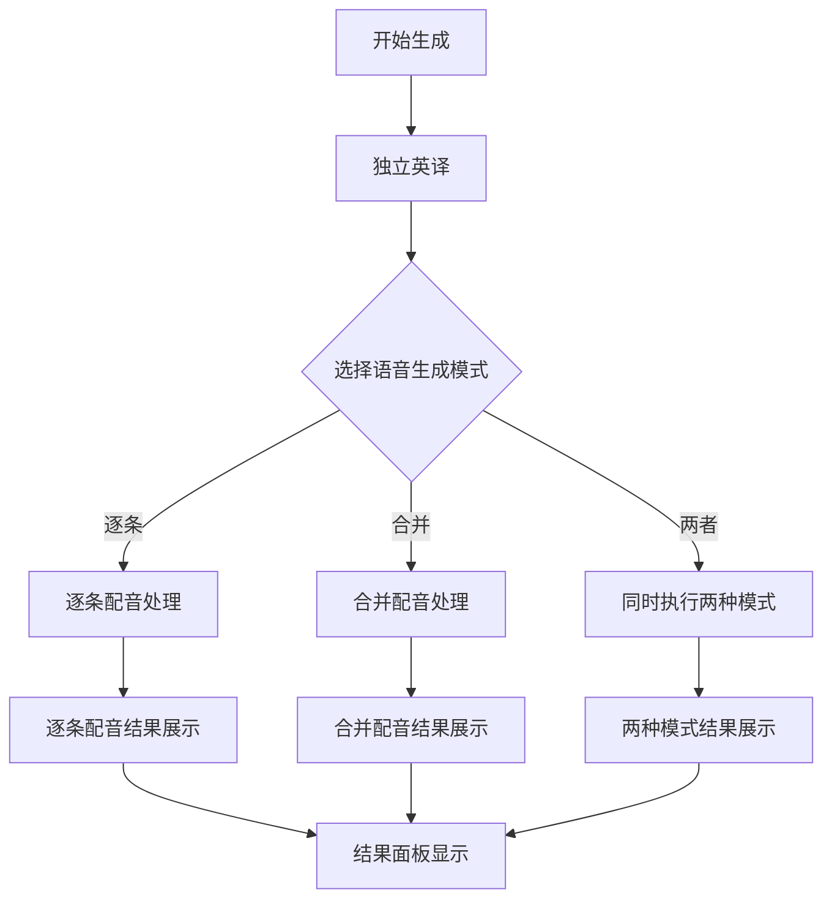
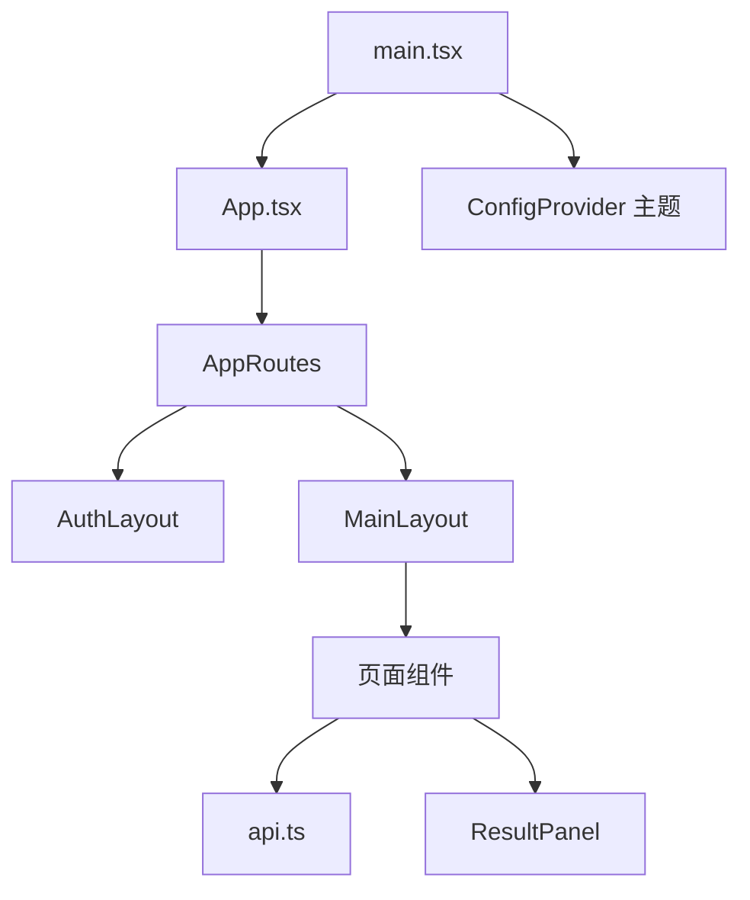

# 前端组件架构

<cite>
**本文引用的文件**
- [web/src/App.tsx](file://web/src/App.tsx)
- [web/src/main.tsx](file://web/src/main.tsx)
- [web/src/layouts/AuthLayout.tsx](file://web/src/layouts/AuthLayout.tsx)
- [web/src/layouts/MainLayout.tsx](file://web/src/layouts/MainLayout.tsx)
- [web/src/pages/DashboardPage.tsx](file://web/src/pages/DashboardPage.tsx)
- [web/src/pages/VoiceGeneratorPage.tsx](file://web/src/pages/VoiceGeneratorPage.tsx)
- [web/src/pages/LoginPage.tsx](file://web/src/pages/LoginPage.tsx)
- [web/src/pages/RunsPage.tsx](file://web/src/pages/RunsPage.tsx)
- [web/src/pages/DetailImagePage.tsx](file://web/src/pages/DetailImagePage.tsx)
- [web/src/pages/ProductCopyPage.tsx](file://web/src/pages/ProductCopyPage.tsx)
- [web/src/pages/TranslationPage.tsx](file://web/src/pages/TranslationPage.tsx)
- [web/src/components/ResultPanel.tsx](file://web/src/components/ResultPanel.tsx)
- [web/src/lib/api.ts](file://web/src/lib/api.ts)
- [web/src/styles.css](file://web/src/styles.css)
- [api/src/routes/voice.ts](file://api/src/routes/voice.ts)
</cite>

## 目录
1. [简介](#简介)
2. [项目结构](#项目结构)
3. [核心组件](#核心组件)
4. [架构总览](#架构总览)
5. [组件详解](#组件详解)
6. [依赖关系分析](#依赖关系分析)
7. [性能与可访问性](#性能与可访问性)
8. [故障排查指南](#故障排查指南)
9. [结论](#结论)
10. [附录](#附录)

## 简介
本文件系统化梳理前端组件架构，覆盖组件树结构、状态管理、路由设计、UI 组件库使用、页面组件实现、布局组件设计理念与复用策略、组件属性/事件/插槽/自定义选项、响应式与无障碍建议、动画与过渡、样式与主题、跨浏览器兼容与性能优化、组件组合模式与集成方式等内容。文档以实际源码为依据，配合可视化图表帮助读者快速理解与落地。

## 项目结构
项目采用基于页面的组织方式，结合 Ant Design 作为 UI 组件库，通过 React Router 实现路由与权限控制，全局样式集中管理，API 层封装统一的请求与流式处理逻辑。

**图表来源**
- [web/src/main.tsx:1-17](file://web/src/main.tsx#L1-L17)
- [web/src/App.tsx:1-70](file://web/src/App.tsx#L1-L70)
- [web/src/layouts/AuthLayout.tsx:1-21](file://web/src/layouts/AuthLayout.tsx#L1-L21)
- [web/src/layouts/MainLayout.tsx:1-65](file://web/src/layouts/MainLayout.tsx#L1-L65)
- [web/src/pages/DashboardPage.tsx:1-108](file://web/src/pages/DashboardPage.tsx#L1-L108)
- [web/src/pages/LoginPage.tsx:1-136](file://web/src/pages/LoginPage.tsx#L1-L136)
- [web/src/pages/RunsPage.tsx:1-179](file://web/src/pages/RunsPage.tsx#L1-L179)
- [web/src/pages/DetailImagePage.tsx:1-346](file://web/src/pages/DetailImagePage.tsx#L1-L346)
- [web/src/pages/ProductCopyPage.tsx:1-260](file://web/src/pages/ProductCopyPage.tsx#L1-L260)
- [web/src/pages/TranslationPage.tsx:1-140](file://web/src/pages/TranslationPage.tsx#L1-L140)
- [web/src/pages/VoiceGeneratorPage.tsx:1-95](file://web/src/pages/VoiceGeneratorPage.tsx#L1-L95)
- [web/src/components/ResultPanel.tsx:1-46](file://web/src/components/ResultPanel.tsx#L1-L46)
- [web/src/lib/api.ts:1-163](file://web/src/lib/api.ts#L1-L163)
- [web/src/styles.css:1-83](file://web/src/styles.css#L1-L83)

**章节来源**
- [web/src/main.tsx:1-17](file://web/src/main.tsx#L1-L17)
- [web/src/App.tsx:1-70](file://web/src/App.tsx#L1-L70)

## 核心组件
- 应用入口与主题配置：在应用根部注入 Ant Design 主题与路由容器，确保全局样式与主题生效。
- 路由与守卫：基于 React Router 的路由表与 RequireAuth 守卫，结合本地存储令牌进行登录态校验。
- 布局组件：AuthLayout 与 MainLayout 提供认证页与业务页的统一骨架，支持侧边菜单、头部用户信息与内容区域 Outlet。
- 页面组件：围绕具体业务场景构建，如仪表盘、登录、任务列表、详情图生成、产品文案生成、翻译、语音生成等。
- 通用组件：ResultPanel 封装结果面板的标题、复制、进度、加载、错误提示与流式输出展示。
- API 层：统一封装基础请求、鉴权回调、文件上传、SSE 流式处理与模块化接口。

**章节来源**
- [web/src/main.tsx:1-17](file://web/src/main.tsx#L1-L17)
- [web/src/App.tsx:17-66](file://web/src/App.tsx#L17-L66)
- [web/src/layouts/AuthLayout.tsx:1-21](file://web/src/layouts/AuthLayout.tsx#L1-L21)
- [web/src/layouts/MainLayout.tsx:1-65](file://web/src/layouts/MainLayout.tsx#L1-L65)
- [web/src/components/ResultPanel.tsx:1-46](file://web/src/components/ResultPanel.tsx#L1-L46)
- [web/src/lib/api.ts:13-163](file://web/src/lib/api.ts#L13-L163)

## 架构总览
应用采用"入口配置 → 路由与布局 → 页面组件 → 通用组件/工具"的分层架构。Ant Design 提供 UI 基础能力，React Router 负责导航与权限，API 层负责数据与流式交互。

**图表来源**
- [web/src/main.tsx:8-16](file://web/src/main.tsx#L8-L16)
- [web/src/App.tsx:23-66](file://web/src/App.tsx#L23-L66)
- [web/src/layouts/MainLayout.tsx:36-62](file://web/src/layouts/MainLayout.tsx#L36-L62)
- [web/src/components/ResultPanel.tsx:14-43](file://web/src/components/ResultPanel.tsx#L14-L43)
- [web/src/lib/api.ts:13-36](file://web/src/lib/api.ts#L13-L36)

## 组件详解

### 路由与权限控制
- 路由表：定义认证页与受保护页，受保护页通过 RequireAuth 守卫检查令牌。
- 未授权处理：当后端返回 401 或初始化校验失败时，清理令牌并跳转登录页。
- 首次挂载：初始化未授权处理器与令牌校验，保证会话一致性。

**图表来源**
- [web/src/App.tsx:17-39](file://web/src/App.tsx#L17-L39)
- [web/src/lib/api.ts:5-36](file://web/src/lib/api.ts#L5-L36)

**章节来源**
- [web/src/App.tsx:17-39](file://web/src/App.tsx#L17-L39)
- [web/src/lib/api.ts:5-36](file://web/src/lib/api.ts#L5-L36)

### 布局组件设计与复用
- AuthLayout：认证页容器，提供卡片、标题与副标题，内部通过 Outlet 嵌入认证表单。
- MainLayout：业务页容器，左侧 Sider 菜单（图标+文案），右侧 Header 用户信息与登出按钮，Content 区域渲染页面内容。
- 复用策略：通过 Outlet 与路由路径映射，避免重复布局代码；菜单项与路径保持一致，便于维护。

**图表来源**
- [web/src/layouts/AuthLayout.tsx:4-18](file://web/src/layouts/AuthLayout.tsx#L4-L18)
- [web/src/layouts/MainLayout.tsx:17-62](file://web/src/layouts/MainLayout.tsx#L17-L62)

**章节来源**
- [web/src/layouts/AuthLayout.tsx:1-21](file://web/src/layouts/AuthLayout.tsx#L1-L21)
- [web/src/layouts/MainLayout.tsx:1-65](file://web/src/layouts/MainLayout.tsx#L1-L65)

### 页面组件实现概览
- DashboardPage：功能总览网格，点击卡片跳转至对应模块页。
- LoginPage：表单登录与重置密码弹窗，成功后写入令牌并跳转仪表盘。
- RunsPage：任务列表表格，定时轮询刷新，支持查看详情弹窗与链接提取。
- DetailImagePage：详情图生成，支持"有参考图/无参考图"两种分支，文件上传与 URL 双输入，流式输出与链接收集。
- ProductCopyPage：产品文案生成，支持独立英译与 TTS（MP3+SRT），**新增多模式语音生成**，可同时显示逐条和合并两种配音结果。
- TranslationPage：翻译功能，多语言下拉选择，流式输出。
- VoiceGeneratorPage：语音生成，读取语音服务配置并在 iframe 中嵌入。

**图表来源**
- [web/src/pages/DetailImagePage.tsx:105-251](file://web/src/pages/DetailImagePage.tsx#L105-L251)
- [web/src/lib/api.ts:58-115](file://web/src/lib/api.ts#L58-L115)

**章节来源**
- [web/src/pages/DashboardPage.tsx:1-108](file://web/src/pages/DashboardPage.tsx#L1-L108)
- [web/src/pages/LoginPage.tsx:17-66](file://web/src/pages/LoginPage.tsx#L17-L66)
- [web/src/pages/RunsPage.tsx:57-83](file://web/src/pages/RunsPage.tsx#L57-L83)
- [web/src/pages/DetailImagePage.tsx:14-251](file://web/src/pages/DetailImagePage.tsx#L14-L251)
- [web/src/pages/ProductCopyPage.tsx:13-260](file://web/src/pages/ProductCopyPage.tsx#L13-L260)
- [web/src/pages/TranslationPage.tsx:18-85](file://web/src/pages/TranslationPage.tsx#L18-L85)
- [web/src/pages/VoiceGeneratorPage.tsx:5-25](file://web/src/pages/VoiceGeneratorPage.tsx#L5-L25)

### 通用组件：ResultPanel
- 能力：标题、复制文本/JSON、进度条、加载态、错误提示、流式输出区域。
- 使用：在各页面中复用，统一结果展示风格与交互。

**图表来源**
- [web/src/components/ResultPanel.tsx:3-43](file://web/src/components/ResultPanel.tsx#L3-L43)

**章节来源**
- [web/src/components/ResultPanel.tsx:1-46](file://web/src/components/ResultPanel.tsx#L1-L46)

### API 层与流式处理
- 统一请求：自动注入 Content-Type 与 Authorization，处理 401 并触发未授权回调。
- 文件上传：FormData 上传，支持令牌。
- 流式工作流：SSE Reader 解析事件流，按行切分，分别处理 done/error/data 事件，聚合 JSON 与文本输出。
- 语音配置与翻译/TTS 接口：提供语音服务地址与相关能力。

**图表来源**
- [web/src/lib/api.ts:58-115](file://web/src/lib/api.ts#L58-L115)

**章节来源**
- [web/src/lib/api.ts:13-163](file://web/src/lib/api.ts#L13-L163)

### 多模式语音生成功能

**更新** 新增对多模式语音生成的支持，ProductCopyPage 现在能够显示逐条和合并两种模式的配音结果

ProductCopyPage 现在支持三种语音生成模式：
- **逐条配音（individual）**：对每个英文句子单独生成语音，适合精确控制和质量保证
- **合并配音（merged）**：将所有句子合并为一段文本后生成单一语音文件
- **两者都生成（both）**：同时执行上述两种模式，提供完整的配音结果对比

**图表来源**
- [web/src/pages/ProductCopyPage.tsx:120-160](file://web/src/pages/ProductCopyPage.tsx#L120-L160)
- [web/src/lib/api.ts:145-163](file://web/src/lib/api.ts#L145-L163)
- [api/src/routes/voice.ts:332-421](file://api/src/routes/voice.ts#L332-L421)

**章节来源**
- [web/src/pages/ProductCopyPage.tsx:120-160](file://web/src/pages/ProductCopyPage.tsx#L120-L160)
- [web/src/lib/api.ts:145-163](file://web/src/lib/api.ts#L145-L163)
- [api/src/routes/voice.ts:332-421](file://api/src/routes/voice.ts#L332-L421)

## 依赖关系分析
- 组件耦合：页面组件依赖 API 层与通用组件；布局组件被路由表复用；入口文件统一注入主题与路由。
- 外部依赖：Ant Design（组件）、Ant Design Icons（图标）、React Router（路由）。
- 数据流：页面组件通过 API 层发起请求，接收流式数据并更新本地状态，驱动 UI 更新。

**图表来源**
- [web/src/main.tsx:8-16](file://web/src/main.tsx#L8-L16)
- [web/src/App.tsx:23-66](file://web/src/App.tsx#L23-L66)
- [web/src/layouts/MainLayout.tsx:36-62](file://web/src/layouts/MainLayout.tsx#L36-L62)
- [web/src/components/ResultPanel.tsx:14-43](file://web/src/components/ResultPanel.tsx#L14-L43)
- [web/src/lib/api.ts:13-36](file://web/src/lib/api.ts#L13-L36)

**章节来源**
- [web/src/main.tsx:1-17](file://web/src/main.tsx#L1-L17)
- [web/src/App.tsx:1-70](file://web/src/App.tsx#L1-L70)

## 性能与可访问性

### 性能考虑
- 请求缓存与幂等：对 GET 类接口可引入缓存策略；POST 类接口避免重复提交。
- 流式渲染：ResultPanel 与页面组件按事件增量更新，减少一次性大计算。
- 图片与 iframe：VoiceGeneratorPage 的 iframe 在无地址时不渲染，避免无效资源加载。
- 上传优化：DetailImagePage 对参考图并发上传，但注意服务端限流与错误聚合提示。
- 定时轮询：RunsPage 5 秒轮询一次，可根据数据变化频率调整。
- **多模式语音生成优化**：当选择"两者都生成"模式时，系统会并行处理两种模式，提高整体生成效率。

### 响应式与无障碍
- 响应式：全局样式使用相对单位与弹性布局，页面网格随视口自适应。
- 无障碍：Ant Design 组件具备基础可访问性；建议为按钮、表单控件添加 aria-label/aria-describedby；为 iframe 添加 title 与安全属性。
- 键盘导航：确保表单控件可 Tab 导航，按钮可 Enter 触发。
- 颜色对比：主题色与背景色满足对比度要求，错误提示使用明确图标与颜色。
- **结果面板无障碍**：ResultPanel 组件提供复制功能，支持键盘快捷键操作。

**章节来源**
- [web/src/styles.css:36-50](file://web/src/styles.css#L36-L50)
- [web/src/pages/VoiceGeneratorPage.tsx:76-88](file://web/src/pages/VoiceGeneratorPage.tsx#L76-L88)
- [web/src/pages/RunsPage.tsx:79-83](file://web/src/pages/RunsPage.tsx#L79-L83)
- [web/src/components/ResultPanel.tsx:24-42](file://web/src/components/ResultPanel.tsx#L24-L42)

## 故障排查指南
- 登录失败：检查令牌写入与后端返回结构；确认表单必填项与网络请求。
- 401 未授权：确认令牌存在与有效期；查看未授权回调是否正确清理令牌并跳转登录。
- 流式处理异常：检查后端事件流格式与分隔符；捕获错误事件并提示用户。
- 上传失败：确认文件大小与类型限制；检查 FormData 与 Authorization 头。
- 任务列表不刷新：确认轮询定时器与状态更新逻辑。
- **语音生成失败**：检查 translatedLines 是否为空；确认 API 返回的 results 结构；验证不同模式下的错误处理。

**章节来源**
- [web/src/pages/LoginPage.tsx:22-38](file://web/src/pages/LoginPage.tsx#L22-L38)
- [web/src/lib/api.ts:25-36](file://web/src/lib/api.ts#L25-L36)
- [web/src/lib/api.ts:94-114](file://web/src/lib/api.ts#L94-L114)
- [web/src/pages/DetailImagePage.tsx:117-121](file://web/src/pages/DetailImagePage.tsx#L117-L121)
- [web/src/pages/RunsPage.tsx:69-83](file://web/src/pages/RunsPage.tsx#L69-L83)
- [web/src/pages/ProductCopyPage.tsx:153-157](file://web/src/pages/ProductCopyPage.tsx#L153-L157)

## 结论
该前端组件架构以 Ant Design 为基础，结合 React Router 与自研 API 层，实现了清晰的路由与权限控制、可复用的布局组件、统一的结果面板与流式处理能力。通过模块化的页面组件与通用组件，提升了开发效率与一致性。**新增的多模式语音生成功能**进一步增强了用户体验，支持逐条和合并两种配音模式的灵活选择与对比展示。后续可在流式渲染优化、可访问性增强与主题扩展方面持续演进。

## 附录

### 组件属性、事件、插槽与自定义选项
- ResultPanel
  - 属性：title、streamText、jsonText、loading、progress、errorText、onCopyText、onCopyJson
  - 插槽：无（通过属性传递内容）
  - 自定义：可通过外部样式类名覆盖默认样式
- LoginPage
  - 表单项：username、password；重置密码表单字段：username、newPassword、confirmPassword
  - 事件：onFinish（登录）、Modal 确认（重置密码）
- RunsPage
  - 表格列：任务ID、模块、状态、创建时间、完成时间、操作（查看）
  - 事件：刷新按钮、Modal 打开/关闭
- DetailImagePage
  - 表单项：aspectRatio、img1、img1Url、img2、img2Urls、maidian、name
  - 事件：开始生成、复制文本/JSON、进度更新
- ProductCopyPage
  - 表单项：Product_Name、maidian、muban
  - 事件：开始生成、独立英译、生成语音（支持三种模式：individual、merged、both）
  - **新增**：多模式语音生成状态管理（ttsLoading、ttsText、ttsJson）
- TranslationPage
  - 表单项：erchuan_wenan、language
  - 事件：开始翻译
- VoiceGeneratorPage
  - 属性：无（通过状态与副作用获取配置）
  - 事件：打开语音生成器、打开 API 页面

**章节来源**
- [web/src/components/ResultPanel.tsx:3-43](file://web/src/components/ResultPanel.tsx#L3-L43)
- [web/src/pages/LoginPage.tsx:68-134](file://web/src/pages/LoginPage.tsx#L68-L134)
- [web/src/pages/RunsPage.tsx:98-135](file://web/src/pages/RunsPage.tsx#L98-L135)
- [web/src/pages/DetailImagePage.tsx:276-343](file://web/src/pages/DetailImagePage.tsx#L276-L343)
- [web/src/pages/ProductCopyPage.tsx:164-260](file://web/src/pages/ProductCopyPage.tsx#L164-L260)
- [web/src/pages/TranslationPage.tsx:100-137](file://web/src/pages/TranslationPage.tsx#L100-L137)
- [web/src/pages/VoiceGeneratorPage.tsx:27-91](file://web/src/pages/VoiceGeneratorPage.tsx#L27-L91)

### 样式自定义与主题支持
- 全局样式：字体、背景、容器高度、网格布局、卡片悬停效果、结果面板配色。
- Ant Design 主题：在入口通过 ConfigProvider 设置主题 token（如主色）。
- 组件样式：通过类名覆盖或 CSS 变量扩展，保持与主题一致。

**章节来源**
- [web/src/styles.css:1-83](file://web/src/styles.css#L1-L83)
- [web/src/main.tsx:10](file://web/src/main.tsx#L10)

### 组件组合模式与集成
- 布局与页面：MainLayout 作为业务页壳，内部通过 Outlet 注入页面；AuthLayout 用于登录/注册等认证页。
- 通用组件复用：ResultPanel 在多个页面中复用，统一结果展示。
- API 集成：页面通过 api.ts 发起请求与流式处理，解耦 UI 与数据层。
- **多模式语音生成集成**：ProductCopyPage 通过 ttsFromLines 函数支持多种生成模式，后端 voice.ts 路由提供完整的模式处理逻辑。

**章节来源**
- [web/src/layouts/MainLayout.tsx:36-62](file://web/src/layouts/MainLayout.tsx#L36-L62)
- [web/src/components/ResultPanel.tsx:14-43](file://web/src/components/ResultPanel.tsx#L14-L43)
- [web/src/lib/api.ts:13-163](file://web/src/lib/api.ts#L13-L163)
- [api/src/routes/voice.ts:332-421](file://api/src/routes/voice.ts#L332-L421)