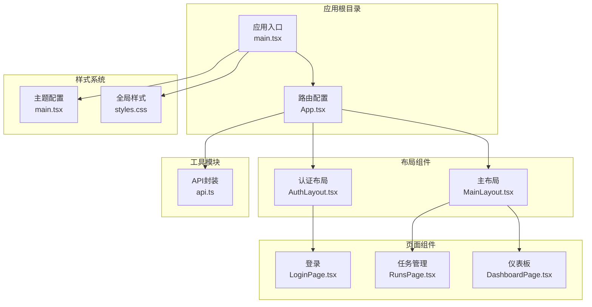
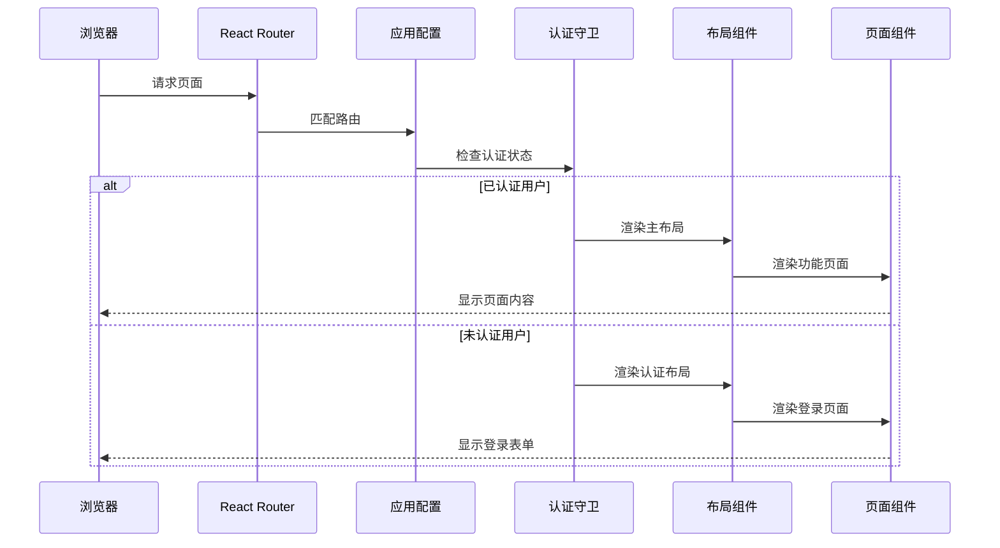
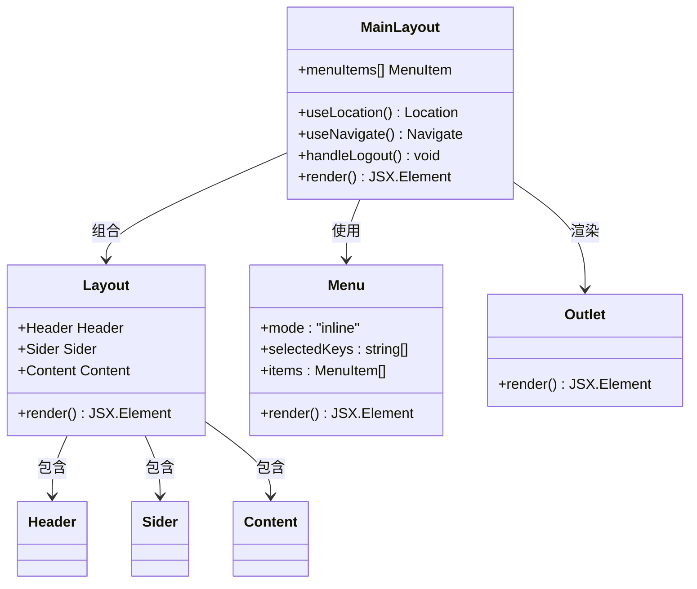
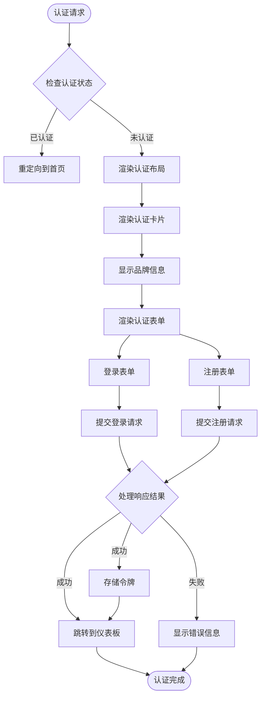
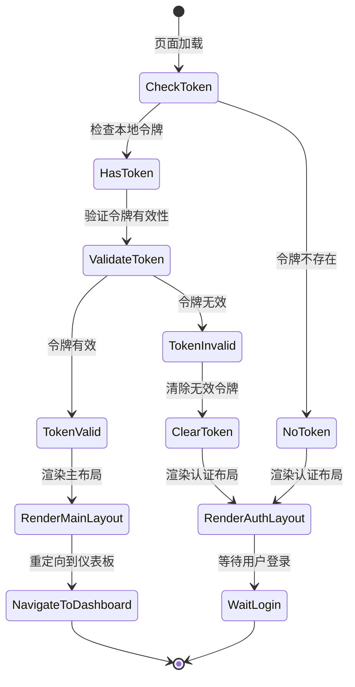
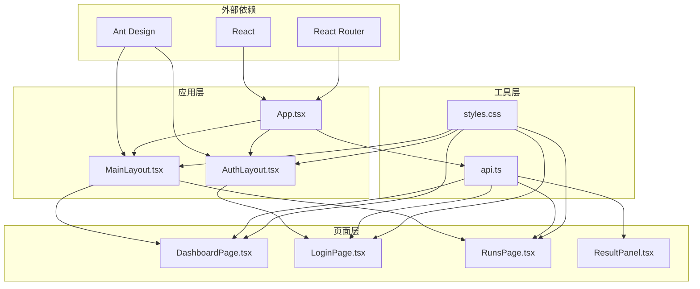
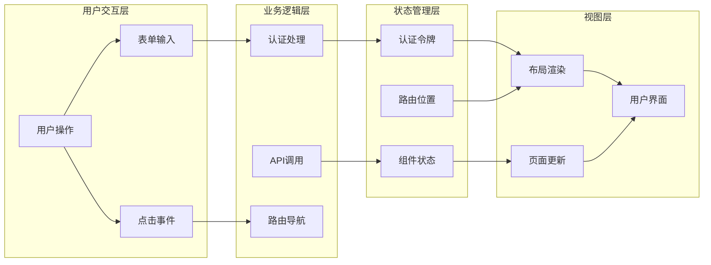

# 布局组件

<cite>
**本文档引用的文件**
- [MainLayout.tsx](file://web/src/layouts/MainLayout.tsx)
- [AuthLayout.tsx](file://web/src/layouts/AuthLayout.tsx)
- [App.tsx](file://web/src/App.tsx)
- [main.tsx](file://web/src/main.tsx)
- [api.ts](file://web/src/lib/api.ts)
- [styles.css](file://web/src/styles.css)
- [DashboardPage.tsx](file://web/src/pages/DashboardPage.tsx)
- [LoginPage.tsx](file://web/src/pages/LoginPage.tsx)
- [RunsPage.tsx](file://web/src/pages/RunsPage.tsx)
- [ResultPanel.tsx](file://web/src/components/ResultPanel.tsx)
</cite>

## 目录
1. [简介](#简介)
2. [项目结构](#项目结构)
3. [核心组件](#核心组件)
4. [架构概览](#架构概览)
5. [详细组件分析](#详细组件分析)
6. [依赖关系分析](#依赖关系分析)
7. [性能考虑](#性能考虑)
8. [故障排除指南](#故障排除指南)
9. [结论](#结论)

## 简介

本项目采用基于 React Router 的单页应用架构，通过精心设计的布局组件为用户提供统一的应用界面体验。布局组件系统包含主布局和认证布局两大核心部分，分别服务于已登录用户的功能页面和未登录用户的认证页面。

主布局组件提供了完整的应用外壳，包括侧边栏导航、顶部工具栏和内容区域，实现了功能模块的统一入口和管理。认证布局组件则专注于登录和注册页面的视觉呈现，确保用户在认证流程中的良好体验。

## 项目结构

项目采用按功能模块组织的目录结构，布局组件位于 `web/src/layouts/` 目录下，与页面组件形成清晰的分层架构：

**图表来源**
- [main.tsx:1-17](file://web/src/main.tsx#L1-L17)
- [App.tsx:1-70](file://web/src/App.tsx#L1-L70)
- [MainLayout.tsx:1-65](file://web/src/layouts/MainLayout.tsx#L1-L65)
- [AuthLayout.tsx:1-21](file://web/src/layouts/AuthLayout.tsx#L1-L21)

**章节来源**
- [main.tsx:1-17](file://web/src/main.tsx#L1-L17)
- [App.tsx:1-70](file://web/src/App.tsx#L1-L70)

## 核心组件

### 主布局组件 (MainLayout)

主布局组件是应用的核心外壳，采用 Ant Design 的 Layout 组件体系构建，实现了经典的三段式布局结构：

- **侧边栏导航 (Sider)**: 固定宽度 240px，包含应用标题和功能菜单
- **顶部头部 (Header)**: 包含用户信息和登出按钮
- **内容区域 (Content)**: 通过 React Router 的 Outlet 渲染子路由组件

组件特性：
- 响应式设计支持，侧边栏在小屏幕设备上可折叠
- 动态菜单高亮，根据当前路径自动选中对应菜单项
- 用户状态管理，提供一键登出功能
- 集成 Ant Design 图标库，提供丰富的视觉元素

**章节来源**
- [MainLayout.tsx:17-65](file://web/src/layouts/MainLayout.tsx#L17-L65)

### 认证布局组件 (AuthLayout)

认证布局组件专为登录和注册页面设计，提供简洁一致的视觉体验：

- **居中卡片容器**: 使用 Ant Design 的 Card 组件创建圆角边框的认证卡片
- **品牌标识**: 显示应用名称和版本信息
- **功能说明**: 提供简短的认证提示文字
- **插槽渲染**: 通过 Outlet 渲染具体的认证表单

组件特性：
- 自适应宽度设计，最大宽度 420px
- 渐变背景色，营造现代化的视觉效果
- 无边框设计，突出内容区域
- 响应式布局，在移动设备上自动调整尺寸

**章节来源**
- [AuthLayout.tsx:4-21](file://web/src/layouts/AuthLayout.tsx#L4-L21)

## 架构概览

应用采用分层架构设计，通过路由守卫实现权限控制，布局组件作为页面的基础容器：

**图表来源**
- [App.tsx:17-21](file://web/src/App.tsx#L17-L21)
- [App.tsx:41-66](file://web/src/App.tsx#L41-L66)

**章节来源**
- [App.tsx:17-66](file://web/src/App.tsx#L17-L66)

## 详细组件分析

### 主布局组件深度解析

主布局组件采用 Ant Design 的 Layout 组件组合，实现了完整的应用外壳结构：

**图表来源**
- [MainLayout.tsx:15-65](file://web/src/layouts/MainLayout.tsx#L15-L65)

#### 侧边栏导航设计

侧边栏导航采用 Ant Design 的 Menu 组件，支持多种图标类型和导航模式：

- **固定宽度**: 240px 宽度确保导航区域的稳定性
- **主题支持**: light 主题提供浅色背景
- **动态选中**: 根据当前路径自动高亮对应菜单项
- **图标集成**: 使用 Ant Design 图标库提供丰富的视觉元素

菜单项配置：
- 功能首页: 应用主入口
- 我的任务: 任务管理功能
- 详情图生成: 图片处理模块
- 视频提取文案: 视频内容分析
- 产品文案生成: 文案创作工具
- 翻译功能: 多语言支持
- 语音生成: 语音合成服务

**章节来源**
- [MainLayout.tsx:26-34](file://web/src/layouts/MainLayout.tsx#L26-L34)

#### 头部区域设计

头部区域集成了用户信息管理和操作控制：

- **用户信息**: 显示用户名和头像
- **操作按钮**: 提供登出功能
- **布局适配**: 右对齐设计适应不同屏幕尺寸

头部设计特点：
- 简洁的白色背景
- 适当的内边距确保内容不拥挤
- 响应式布局支持移动端显示

**章节来源**
- [MainLayout.tsx:48-55](file://web/src/layouts/MainLayout.tsx#L48-L55)

#### 内容区域组织

内容区域通过 React Router 的 Outlet 组件实现动态内容渲染：

- **Outlet 渲染**: 根据路由匹配渲染对应的页面组件
- **统一间距**: 24px 内边距确保内容区域的一致性
- **响应式适配**: 支持不同屏幕尺寸的内容显示

**章节来源**
- [MainLayout.tsx:57-59](file://web/src/layouts/MainLayout.tsx#L57-L59)

### 认证布局组件深度解析

认证布局组件专注于提供统一的认证体验：

**图表来源**
- [AuthLayout.tsx:4-21](file://web/src/layouts/AuthLayout.tsx#L4-L21)
- [LoginPage.tsx:17-38](file://web/src/pages/LoginPage.tsx#L17-L38)

**章节来源**
- [AuthLayout.tsx:4-21](file://web/src/layouts/AuthLayout.tsx#L4-L21)

### 权限控制系统

应用实现了基于路由的权限控制机制：

**图表来源**
- [App.tsx:17-21](file://web/src/App.tsx#L17-L21)
- [App.tsx:26-39](file://web/src/App.tsx#L26-L39)

**章节来源**
- [App.tsx:17-39](file://web/src/App.tsx#L17-L39)

### 主题与样式系统

应用采用 Ant Design 的主题系统和自定义 CSS 样式：

#### Ant Design 主题配置

应用通过 ConfigProvider 组件全局配置主题：

- **主色调**: `#1677ff` 蓝色主题
- **响应式断点**: 支持多种屏幕尺寸
- **组件样式**: 统一的视觉风格

#### 自定义样式设计

全局样式文件提供了完整的样式体系：

- **基础样式**: 重置浏览器默认样式
- **布局样式**: app-shell 和 auth-container 类
- **页面样式**: dashboard-grid 和 page-header 布局
- **交互样式**: hover 效果和过渡动画

**章节来源**
- [main.tsx:10-14](file://web/src/main.tsx#L10-L14)
- [styles.css:12-83](file://web/src/styles.css#L12-L83)

## 依赖关系分析

布局组件之间的依赖关系体现了清晰的分层架构：

**图表来源**
- [App.tsx:1-15](file://web/src/App.tsx#L1-L15)
- [MainLayout.tsx:1-13](file://web/src/layouts/MainLayout.tsx#L1-L13)
- [AuthLayout.tsx:1-2](file://web/src/layouts/AuthLayout.tsx#L1-L2)

**章节来源**
- [App.tsx:1-15](file://web/src/App.tsx#L1-L15)

### 数据流分析

应用的数据流遵循单向数据流原则：

**图表来源**
- [api.ts:9-11](file://web/src/lib/api.ts#L9-L11)
- [api.ts:13-36](file://web/src/lib/api.ts#L13-L36)
- [App.tsx:17-21](file://web/src/App.tsx#L17-L21)

**章节来源**
- [api.ts:9-36](file://web/src/lib/api.ts#L9-L36)

## 性能考虑

### 渲染优化策略

应用采用了多项性能优化措施：

- **懒加载**: 页面组件按需加载，减少初始包大小
- **路由缓存**: 已访问的页面组件保持在内存中
- **状态提升**: 共享状态避免重复计算
- **事件委托**: 减少事件监听器数量

### 内存管理

- **清理定时器**: 页面卸载时自动清理定时器
- **取消请求**: 组件卸载时取消未完成的网络请求
- **解绑事件**: 移除不再使用的事件监听器

### 网络优化

- **请求去重**: 避免重复发送相同的请求
- **错误重试**: 智能的错误处理和重试机制
- **超时控制**: 合理的请求超时设置

## 故障排除指南

### 常见问题诊断

#### 认证相关问题

**问题**: 登录后无法进入功能页面
**解决方案**: 
1. 检查本地存储中的令牌是否正确设置
2. 验证 API 服务器的认证端点
3. 确认路由守卫的逻辑正确执行

#### 布局显示问题

**问题**: 侧边栏或头部显示异常
**解决方案**:
1. 检查 Ant Design 组件的版本兼容性
2. 验证 CSS 样式的正确加载
3. 确认响应式断点的设置

#### 导航问题

**问题**: 菜单点击无响应
**解决方案**:
1. 检查 NavLink 的路径配置
2. 验证路由配置的正确性
3. 确认事件处理器的绑定

**章节来源**
- [api.ts:25-28](file://web/src/lib/api.ts#L25-L28)
- [App.tsx:26-39](file://web/src/App.tsx#L26-L39)

### 调试技巧

- **开发者工具**: 使用浏览器开发者工具监控网络请求
- **日志输出**: 在关键节点添加日志输出
- **状态检查**: 定期检查组件状态和 props
- **性能监控**: 使用性能面板分析渲染性能

## 结论

布局组件系统通过精心设计的架构实现了以下目标：

**设计理念**:
- 统一的视觉风格和交互体验
- 清晰的权限控制和安全机制
- 良好的响应式适配和用户体验
- 模块化的组件设计便于维护

**技术优势**:
- 基于 React Router 的现代路由系统
- Ant Design 组件库提供的丰富 UI 组件
- 类型安全的 TypeScript 实现
- 模块化的项目结构

**扩展性**:
- 易于添加新的功能模块
- 支持主题定制和样式扩展
- 良好的代码组织便于团队协作
- 完善的错误处理和调试机制

该布局组件系统为应用提供了坚实的基础框架，支持未来功能的持续扩展和优化。