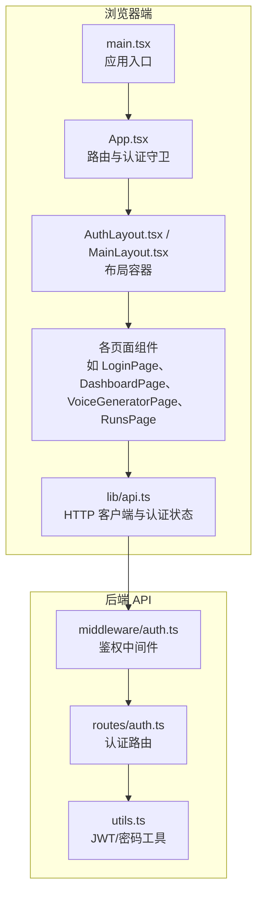
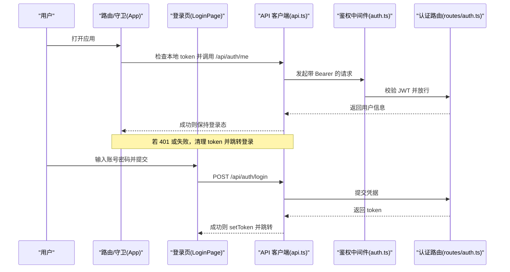
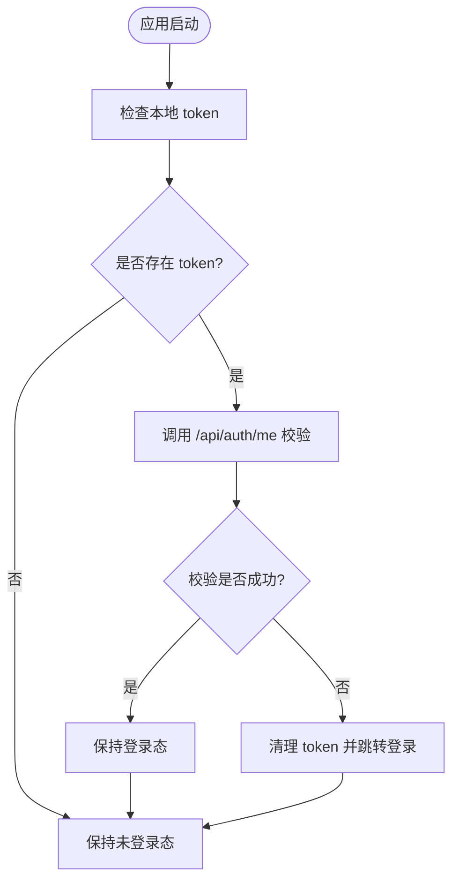
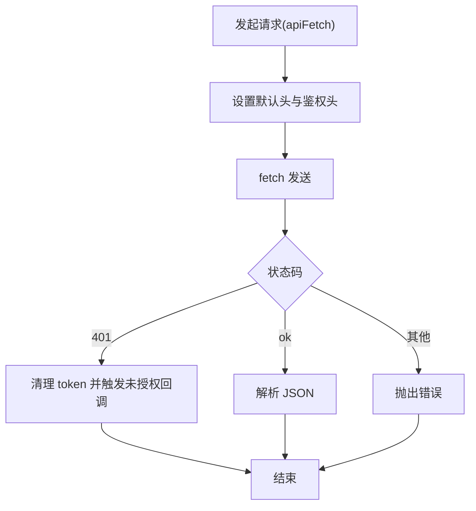
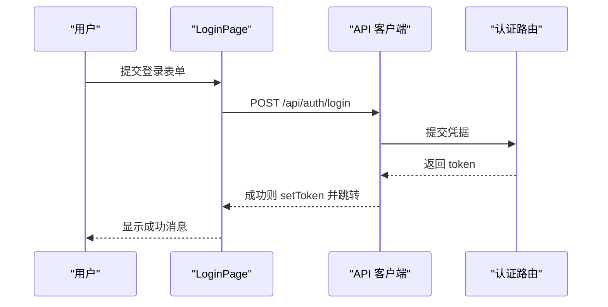
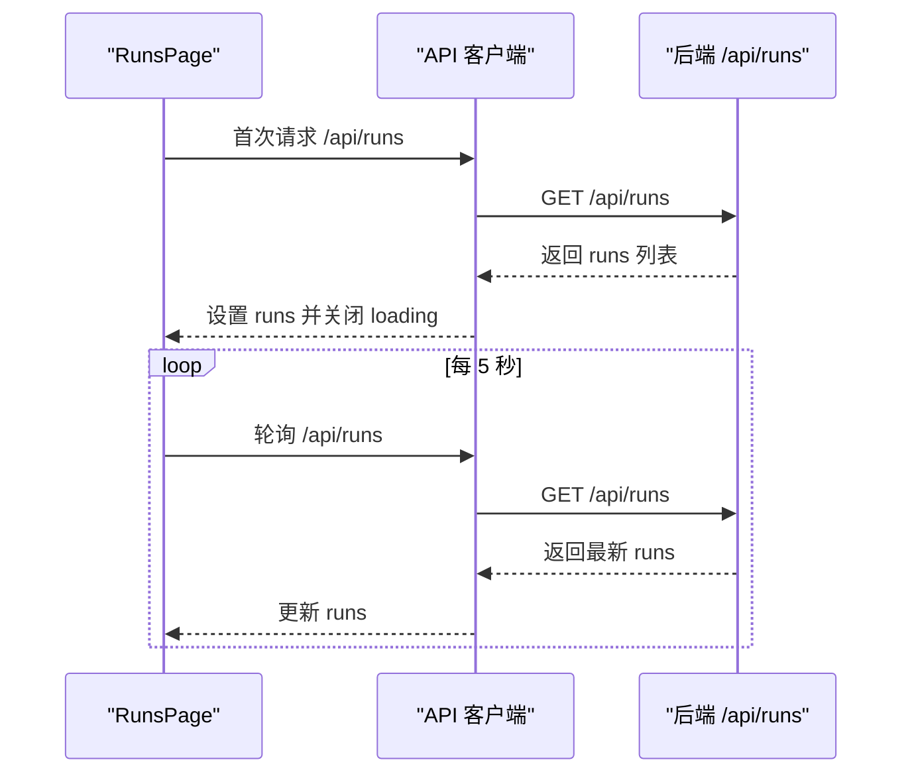
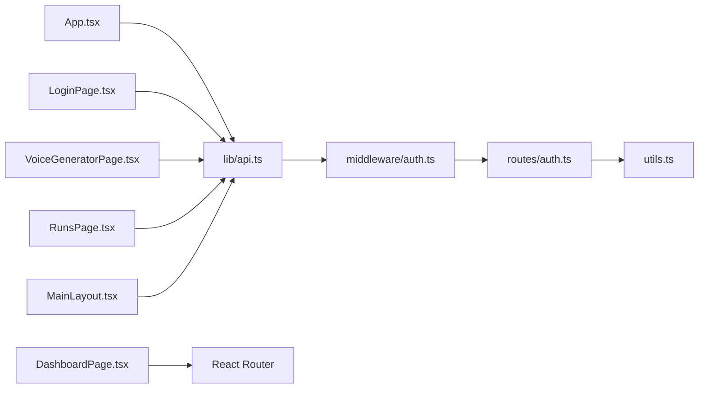

# 状态管理

<cite>
**本文引用的文件**
- [web/src/lib/api.ts](file://web/src/lib/api.ts)
- [web/src/App.tsx](file://web/src/App.tsx)
- [web/src/main.tsx](file://web/src/main.tsx)
- [web/src/pages/LoginPage.tsx](file://web/src/pages/LoginPage.tsx)
- [web/src/pages/DashboardPage.tsx](file://web/src/pages/DashboardPage.tsx)
- [web/src/pages/VoiceGeneratorPage.tsx](file://web/src/pages/VoiceGeneratorPage.tsx)
- [web/src/components/ResultPanel.tsx](file://web/src/components/ResultPanel.tsx)
- [web/src/layouts/AuthLayout.tsx](file://web/src/layouts/AuthLayout.tsx)
- [web/src/layouts/MainLayout.tsx](file://web/src/layouts/MainLayout.tsx)
- [web/src/pages/RunsPage.tsx](file://web/src/pages/RunsPage.tsx)
- [api/src/middleware/auth.ts](file://api/src/middleware/auth.ts)
- [api/src/routes/auth.ts](file://api/src/routes/auth.ts)
- [api/src/utils.ts](file://api/src/utils.ts)
</cite>

## 目录
1. [简介](#简介)
2. [项目结构](#项目结构)
3. [核心组件](#核心组件)
4. [架构总览](#架构总览)
5. [详细组件分析](#详细组件分析)
6. [依赖关系分析](#依赖关系分析)
7. [性能考虑](#性能考虑)
8. [故障排除指南](#故障排除指南)
9. [结论](#结论)
10. [附录](#附录)

## 简介
本文件系统性梳理前端状态管理的实现方式，覆盖全局状态、局部状态与组件间通信；记录 API 封装中的状态管理、错误处理与数据缓存策略；解释认证状态、用户信息与应用配置的状态维护机制；明确状态更新的触发条件、同步策略与性能优化建议；提供状态持久化与本地存储、会话管理的实现方案，并总结最佳实践、调试技巧与故障排除方法。

## 项目结构
前端采用 Vite + React + Ant Design 架构，路由通过 React Router 管理，页面组件按功能模块划分，公共逻辑集中在 lib/api.ts 中进行统一封装。认证流程贯穿应用启动、页面渲染与 API 请求三个阶段。

图表来源
- [web/src/main.tsx:1-17](file://web/src/main.tsx#L1-L17)
- [web/src/App.tsx:1-70](file://web/src/App.tsx#L1-L70)
- [web/src/lib/api.ts:1-160](file://web/src/lib/api.ts#L1-L160)
- [api/src/middleware/auth.ts:1-23](file://api/src/middleware/auth.ts#L1-L23)
- [api/src/routes/auth.ts:1-115](file://api/src/routes/auth.ts#L1-L115)
- [api/src/utils.ts:1-21](file://api/src/utils.ts#L1-L21)

章节来源
- [web/src/main.tsx:1-17](file://web/src/main.tsx#L1-L17)
- [web/src/App.tsx:1-70](file://web/src/App.tsx#L1-L70)

## 核心组件
- 全局状态与会话管理
  - 认证令牌存储于 localStorage，通过 api.ts 的 setToken/getToken/clearToken 统一管理。
  - 应用启动时在 App.tsx 中设置未授权回调与首次“获取当前用户”校验，确保会话有效性。
- 局部状态
  - 各页面组件使用 useState/useEffect 管理自身 UI 状态（如加载、错误、进度、表格数据等）。
- 组件间通信
  - 布局层 MainLayout 提供菜单导航与登出；页面层通过 React Router 导航；部分页面通过 props 传递回调（如 ResultPanel 的复制按钮回调）。

章节来源
- [web/src/lib/api.ts:1-160](file://web/src/lib/api.ts#L1-L160)
- [web/src/App.tsx:17-39](file://web/src/App.tsx#L17-L39)
- [web/src/layouts/MainLayout.tsx:17-65](file://web/src/layouts/MainLayout.tsx#L17-L65)
- [web/src/components/ResultPanel.tsx:14-43](file://web/src/components/ResultPanel.tsx#L14-L43)

## 架构总览
前端状态管理围绕“认证状态 + 页面局部状态 + API 请求状态”展开，认证状态由 localStorage 驱动，页面状态由 React Hooks 驱动，API 请求状态由请求函数返回值与错误抛出驱动。

图表来源
- [web/src/App.tsx:23-39](file://web/src/App.tsx#L23-L39)
- [web/src/pages/LoginPage.tsx:22-38](file://web/src/pages/LoginPage.tsx#L22-L38)
- [web/src/lib/api.ts:13-36](file://web/src/lib/api.ts#L13-L36)
- [api/src/middleware/auth.ts:8-22](file://api/src/middleware/auth.ts#L8-L22)
- [api/src/routes/auth.ts:36-63](file://api/src/routes/auth.ts#L36-L63)

## 详细组件分析

### 认证状态与会话管理
- 令牌持久化
  - 使用 localStorage 存储 token，提供 setToken/getToken/clearToken。
- 未授权处理
  - 在 api.ts 中拦截 401，清理 token 并触发全局未授权回调。
  - 在 App.tsx 中设置未授权回调，跳转至登录页。
- 首次登录态校验
  - 应用启动时调用 /api/auth/me 校验 token，失败则强制登出。
- 登出流程
  - MainLayout 提供登出按钮，清除 token 并跳转登录。

图表来源
- [web/src/App.tsx:23-39](file://web/src/App.tsx#L23-L39)
- [web/src/lib/api.ts:25-28](file://web/src/lib/api.ts#L25-L28)
- [web/src/layouts/MainLayout.tsx:21-24](file://web/src/layouts/MainLayout.tsx#L21-L24)

章节来源
- [web/src/lib/api.ts:9-11](file://web/src/lib/api.ts#L9-L11)
- [web/src/lib/api.ts:25-28](file://web/src/lib/api.ts#L25-L28)
- [web/src/App.tsx:26-39](file://web/src/App.tsx#L26-L39)
- [web/src/layouts/MainLayout.tsx:21-24](file://web/src/layouts/MainLayout.tsx#L21-L24)

### API 封装与状态管理
- 统一请求头与鉴权
  - 自动注入 Content-Type 与 Authorization(Bearer)。
- 错误处理
  - 401 清理 token 并触发未授权回调；其他错误抛出文本错误。
- 数据流
  - 返回 JSON 类型数据；部分接口返回流式事件（SSE）用于实时进度。
- 缓存策略
  - 当前未实现客户端缓存；可基于查询参数与响应体做简单内存缓存以减少重复请求。

图表来源
- [web/src/lib/api.ts:13-36](file://web/src/lib/api.ts#L13-L36)

章节来源
- [web/src/lib/api.ts:13-36](file://web/src/lib/api.ts#L13-L36)

### 登录页与用户交互
- 表单状态
  - 使用 useState 管理重置密码弹窗开关与表单实例。
- 登录流程
  - 提交用户名/密码，成功后 setToken 并跳转首页。
- 错误提示
  - 使用 message 组件反馈错误信息。

图表来源
- [web/src/pages/LoginPage.tsx:22-38](file://web/src/pages/LoginPage.tsx#L22-L38)
- [web/src/lib/api.ts:13-36](file://web/src/lib/api.ts#L13-L36)
- [api/src/routes/auth.ts:36-63](file://api/src/routes/auth.ts#L36-L63)

章节来源
- [web/src/pages/LoginPage.tsx:17-38](file://web/src/pages/LoginPage.tsx#L17-L38)

### 仪表盘与导航
- 功能入口
  - DashboardPage 提供模块卡片导航，点击进入对应页面。
- 布局与菜单
  - MainLayout 提供侧边菜单与顶部用户信息，配合 RequireAuth 实现受保护路由。

章节来源
- [web/src/pages/DashboardPage.tsx:1-108](file://web/src/pages/DashboardPage.tsx#L1-L108)
- [web/src/layouts/MainLayout.tsx:26-34](file://web/src/layouts/MainLayout.tsx#L26-L34)
- [web/src/App.tsx:17-21](file://web/src/App.tsx#L17-L21)

### 语音生成页面
- 配置读取
  - 首次加载调用 getVoiceConfig 获取服务地址，使用 useState 更新 UI。
- 加载与错误
  - 通过 loading 与 message 组件反馈状态与错误。

章节来源
- [web/src/pages/VoiceGeneratorPage.tsx:5-25](file://web/src/pages/VoiceGeneratorPage.tsx#L5-L25)
- [web/src/lib/api.ts:117-126](file://web/src/lib/api.ts#L117-L126)

### 结果面板与流式输出
- 局部状态
  - ResultPanel 接收标题、流式文本、JSON 文本、加载、进度与错误信息，内部渲染进度条、错误提示与输出框。
- 复制能力
  - 提供复制文本与复制 JSON 的按钮回调。

章节来源
- [web/src/components/ResultPanel.tsx:14-43](file://web/src/components/ResultPanel.tsx#L14-L43)

### 任务列表与轮询
- 局部状态
  - RunsPage 使用 useState 管理 runs 列表与选中项，useMemo 提取调试链接集合。
- 轮询策略
  - 首次加载后每 5 秒轮询一次 /api/runs，避免频繁刷新导致的抖动。
- 错误与加载
  - 通过 loading 控制表格加载态，异常时通过 message 或错误提示展示。

图表来源
- [web/src/pages/RunsPage.tsx:69-83](file://web/src/pages/RunsPage.tsx#L69-L83)
- [web/src/lib/api.ts:13-36](file://web/src/lib/api.ts#L13-L36)

章节来源
- [web/src/pages/RunsPage.tsx:57-83](file://web/src/pages/RunsPage.tsx#L57-L83)

## 依赖关系分析
- 组件耦合
  - App.tsx 依赖 api.ts 的 token 管理与未授权回调；各页面组件依赖 api.ts 的具体接口。
- 外部依赖
  - React Router 负责路由与导航；Ant Design 提供 UI 与消息组件；localStorage 作为轻量持久化存储。
- 可能的循环依赖
  - 当前结构清晰，无明显循环依赖风险。

图表来源
- [web/src/App.tsx:15-15](file://web/src/App.tsx#L15-L15)
- [web/src/lib/api.ts:1-160](file://web/src/lib/api.ts#L1-L160)
- [api/src/middleware/auth.ts:1-23](file://api/src/middleware/auth.ts#L1-L23)
- [api/src/routes/auth.ts:1-115](file://api/src/routes/auth.ts#L1-L115)
- [api/src/utils.ts:1-21](file://api/src/utils.ts#L1-L21)

章节来源
- [web/src/App.tsx:15-15](file://web/src/App.tsx#L15-L15)
- [web/src/lib/api.ts:1-160](file://web/src/lib/api.ts#L1-L160)

## 性能考虑
- 减少无效渲染
  - 对复杂计算使用 useMemo/useCallback，例如 RunsPage 中的链接收集。
- 请求节流与轮询
  - 轮询间隔 5 秒较为合理；可在页面不可见时暂停轮询（结合 Page Visibility API）。
- 缓存策略
  - 对只读配置类接口（如语音配置）可加入内存缓存；对高频读取的列表可引入分页与增量更新。
- 本地存储
  - 仅存储必要信息（如 token），避免 localStorage 过大影响首屏性能。
- 错误快速反馈
  - 使用 message 组件即时提示，避免用户长时间等待。

## 故障排除指南
- 登录后立即跳转登录
  - 检查后端 JWT 密钥与签名是否正确；确认 /api/auth/me 返回有效用户信息。
- 401 未授权频繁出现
  - 检查前端是否正确注入 Authorization 头；确认后端中间件验证逻辑。
- 页面空白或路由不生效
  - 检查 RequireAuth 与路由配置；确认 App.tsx 中未授权回调已设置。
- 轮询不更新
  - 检查网络与后端 /api/runs 是否可达；确认 RunsPage 的轮询逻辑未被中断。
- 语音配置为空
  - 检查 getVoiceConfig 的返回结构与网络请求；确认后端 /api/voice/config 正常。

章节来源
- [web/src/App.tsx:26-39](file://web/src/App.tsx#L26-L39)
- [web/src/lib/api.ts:25-28](file://web/src/lib/api.ts#L25-L28)
- [web/src/pages/RunsPage.tsx:79-83](file://web/src/pages/RunsPage.tsx#L79-L83)

## 结论
本项目采用“轻量级前端状态管理 + 后端强约束”的设计：认证状态由 localStorage 与后端 JWT 共同保障；页面状态通过 React Hooks 管理；API 层统一处理鉴权与错误。建议后续引入轻量状态库（如 Zustand）以进一步规范化全局状态，同时完善缓存与离线策略，提升用户体验与性能稳定性。

## 附录
- 最佳实践
  - 将 token 与用户信息抽象为全局状态；对敏感操作增加二次确认。
  - 对长耗时任务使用流式接口与进度条反馈。
  - 对高频读取的数据引入内存缓存与增量更新。
- 调试技巧
  - 使用浏览器 Network 面板观察请求头与响应；在 api.ts 中添加日志辅助定位问题。
  - 对轮询场景使用 DevTools 的 Performance 面板观察帧率变化。
- 状态持久化方案
  - 令牌：localStorage（短期会话）。
  - 用户偏好：localStorage（如主题、语言）。
  - 临时状态：组件内 useState（页面刷新丢失）。
  - 全局状态：可引入轻量状态库（如 Zustand）集中管理。