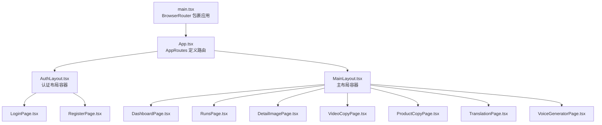
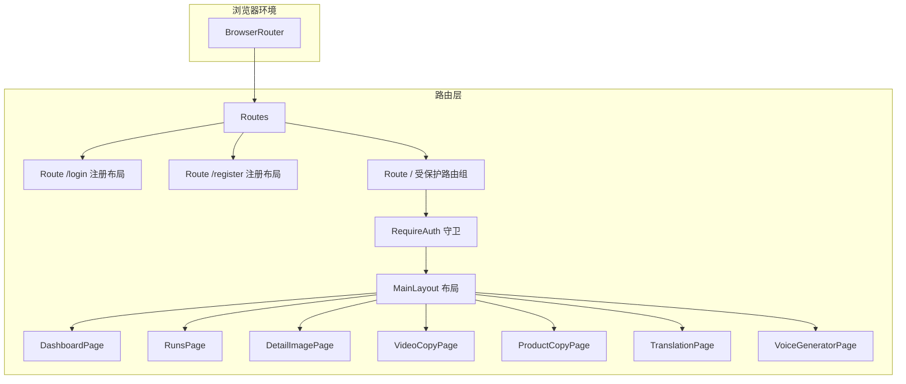
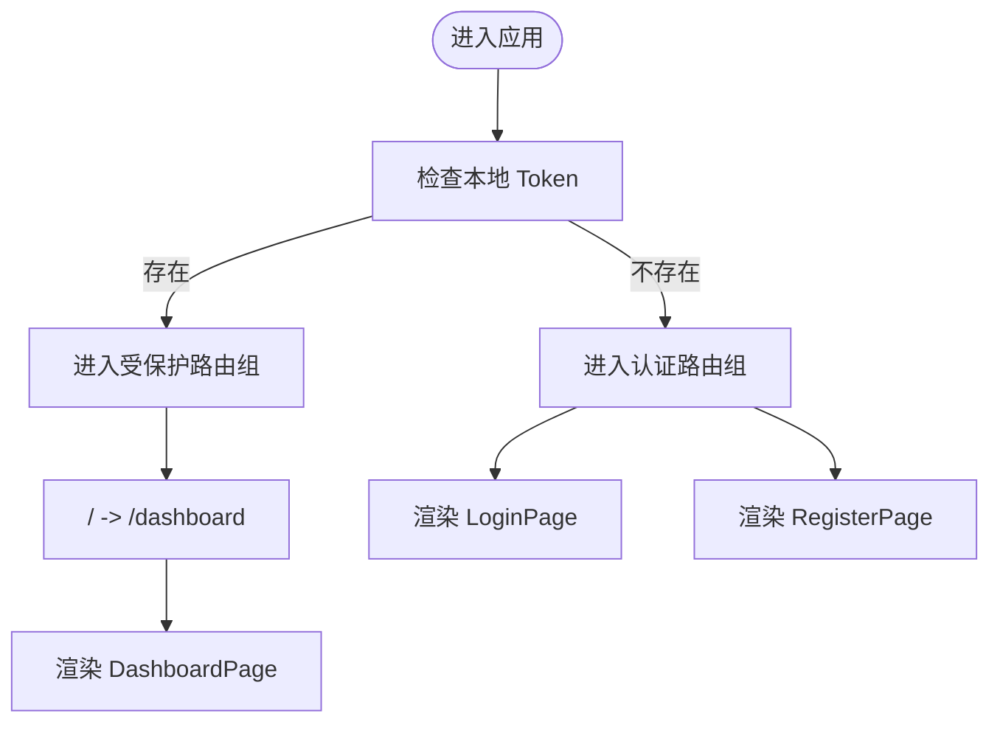
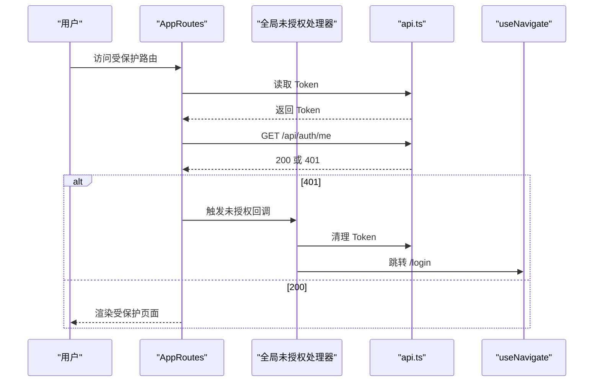
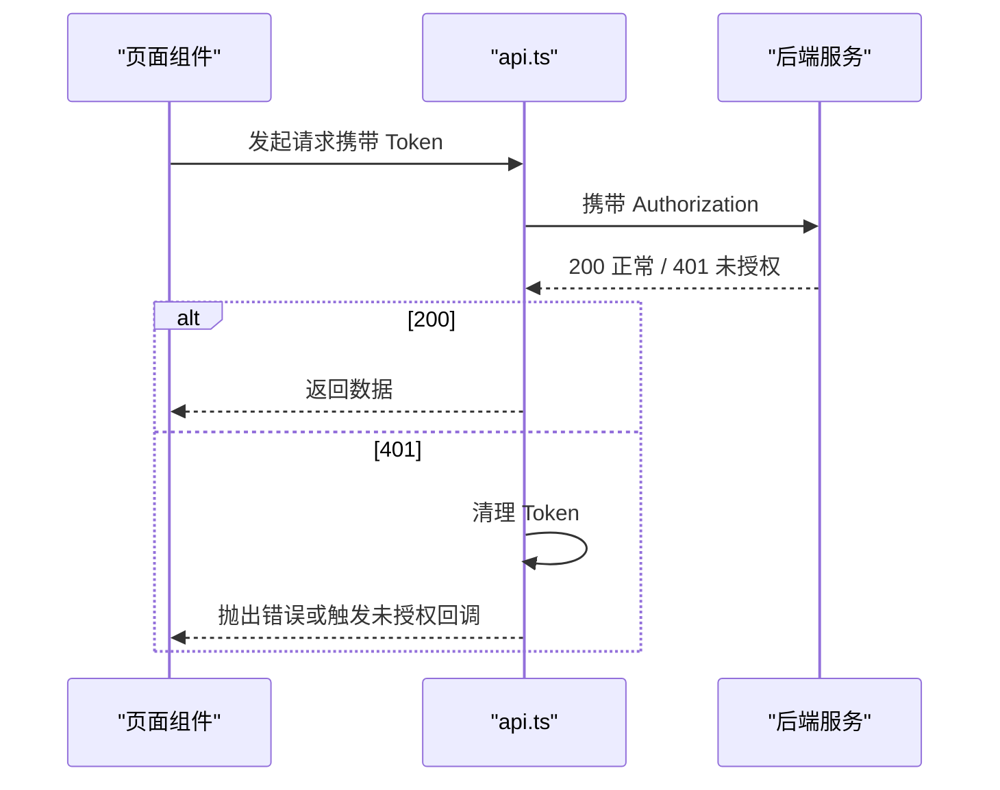
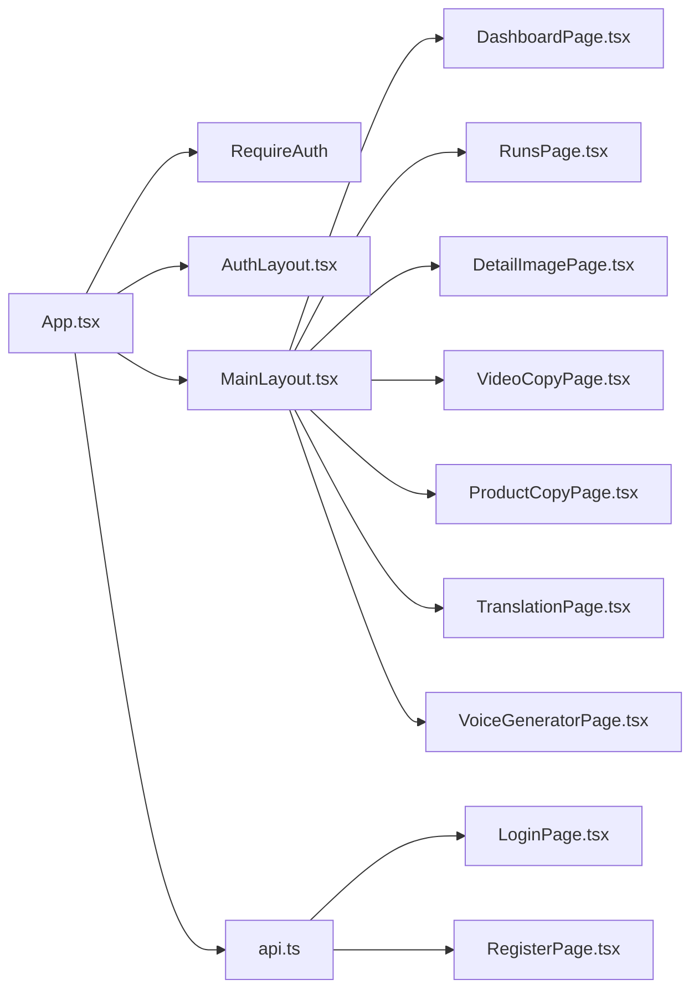

# 路由系统

<cite>
**本文引用的文件**
- [App.tsx](file://web/src/App.tsx)
- [main.tsx](file://web/src/main.tsx)
- [AuthLayout.tsx](file://web/src/layouts/AuthLayout.tsx)
- [MainLayout.tsx](file://web/src/layouts/MainLayout.tsx)
- [api.ts](file://web/src/lib/api.ts)
- [LoginPage.tsx](file://web/src/pages/LoginPage.tsx)
- [RegisterPage.tsx](file://web/src/pages/RegisterPage.tsx)
- [DashboardPage.tsx](file://web/src/pages/DashboardPage.tsx)
- [RunsPage.tsx](file://web/src/pages/RunsPage.tsx)
- [DetailImagePage.tsx](file://web/src/pages/DetailImagePage.tsx)
- [VideoCopyPage.tsx](file://web/src/pages/VideoCopyPage.tsx)
- [ProductCopyPage.tsx](file://web/src/pages/ProductCopyPage.tsx)
- [TranslationPage.tsx](file://web/src/pages/TranslationPage.tsx)
- [VoiceGeneratorPage.tsx](file://web/src/pages/VoiceGeneratorPage.tsx)
</cite>

## 目录
1. [简介](#简介)
2. [项目结构](#项目结构)
3. [核心组件](#核心组件)
4. [架构总览](#架构总览)
5. [详细组件分析](#详细组件分析)
6. [依赖关系分析](#依赖关系分析)
7. [性能考虑](#性能考虑)
8. [故障排查指南](#故障排查指南)
9. [结论](#结论)
10. [附录](#附录)

## 简介
本文件系统性梳理前端路由体系，基于 React Router DOM 实现，覆盖路由层级结构、嵌套路由设计、路由守卫机制、认证保护、路径映射与组件加载策略、导航行为、参数与查询处理、程序化导航、性能优化与最佳实践，以及与状态管理的集成方式。文档以实际源码为依据，配合可视化图表帮助读者快速理解与落地。

## 项目结构
- 应用入口通过 BrowserRouter 包裹，根组件渲染 AppRoutes，后者定义全站路由。
- 布局层采用两套布局：认证布局用于登录/注册页；主布局用于受保护的功能页。
- 页面组件按功能模块划分，分别对应不同路由路径。
- 认证相关逻辑集中在 RequireAuth 守卫与全局未授权处理器中。

**图表来源**
- [main.tsx:1-17](file://web/src/main.tsx#L1-L17)
- [App.tsx:23-66](file://web/src/App.tsx#L23-L66)
- [AuthLayout.tsx:1-21](file://web/src/layouts/AuthLayout.tsx#L1-L21)
- [MainLayout.tsx:1-65](file://web/src/layouts/MainLayout.tsx#L1-L65)

**章节来源**
- [main.tsx:1-17](file://web/src/main.tsx#L1-L17)
- [App.tsx:23-66](file://web/src/App.tsx#L23-L66)

## 核心组件
- 路由根组件 AppRoutes：集中声明所有路由规则，包含认证与受保护路由分组。
- RequireAuth：自定义路由守卫，校验本地 Token，无 Token 则跳转登录页。
- 布局组件：
  - AuthLayout：登录/注册专用布局，提供 Outlet 渲染子路由。
  - MainLayout：功能页布局，包含侧边菜单、顶部用户区与 Outlet。
- API 工具：封装 fetch 请求、Token 管理、未授权回调设置与流式事件处理。

**章节来源**
- [App.tsx:17-21](file://web/src/App.tsx#L17-L21)
- [App.tsx:23-66](file://web/src/App.tsx#L23-L66)
- [AuthLayout.tsx:1-21](file://web/src/layouts/AuthLayout.tsx#L1-L21)
- [MainLayout.tsx:17-62](file://web/src/layouts/MainLayout.tsx#L17-L62)
- [api.ts:1-160](file://web/src/lib/api.ts#L1-L160)

## 架构总览
React Router DOM 在应用入口被 BrowserRouter 包裹，AppRoutes 使用 Routes/Route 组织路由树。认证与受保护路由通过 RequireAuth 嵌套在 MainLayout 外层，形成“认证布局 -> 受保护布局 -> 功能页”的层级结构。全局未授权处理通过 api.ts 中的 setUnauthorizedHandler 与 AppRoutes 的副作用绑定，确保 401 时自动清理 Token 并跳转登录。

**图表来源**
- [main.tsx:8-16](file://web/src/main.tsx#L8-L16)
- [App.tsx:42-66](file://web/src/App.tsx#L42-L66)
- [MainLayout.tsx:36-62](file://web/src/layouts/MainLayout.tsx#L36-L62)

## 详细组件分析

### 路由层级与嵌套路由设计
- 分层结构：
  - 认证层：AuthLayout 包裹 /login 与 /register。
  - 受保护层：RequireAuth 包裹 MainLayout，其下挂载所有功能页。
- 嵌套关系：
  - AuthLayout 与 MainLayout 均通过 Outlet 渲染子路由内容。
  - 顶层 Routes 同时容纳两类路由组，互不干扰。
- 首页重定向：根路径 / 自动跳转至 /dashboard。

**图表来源**
- [App.tsx:23-66](file://web/src/App.tsx#L23-L66)
- [App.tsx:55-56](file://web/src/App.tsx#L55-L56)

**章节来源**
- [App.tsx:42-66](file://web/src/App.tsx#L42-L66)
- [AuthLayout.tsx:14](file://web/src/layouts/AuthLayout.tsx#L14)
- [MainLayout.tsx:58](file://web/src/layouts/MainLayout.tsx#L58)

### 路由守卫机制与认证保护
- RequireAuth 工作机制：
  - 读取本地存储 Token，若不存在则使用 Navigate 跳转 /login。
  - 存在时直接返回子元素（MainLayout），实现“仅允许已认证用户访问”。
- 全局未授权处理：
  - 在 AppRoutes 的副作用中设置未授权回调，收到 401 时清理 Token 并跳转 /login。
  - 初始化时尝试调用 /api/auth/me 校验 Token 有效性，失败同样跳转登录。
- 登录/注册成功后的导航：
  - 登录与注册成功后均通过 useNavigate 跳转 /dashboard。

**图表来源**
- [App.tsx:17-21](file://web/src/App.tsx#L17-L21)
- [App.tsx:26-39](file://web/src/App.tsx#L26-L39)
- [api.ts:5-7](file://web/src/lib/api.ts#L5-L7)
- [api.ts:25-28](file://web/src/lib/api.ts#L25-L28)

**章节来源**
- [App.tsx:17-21](file://web/src/App.tsx#L17-L21)
- [App.tsx:26-39](file://web/src/App.tsx#L26-L39)
- [api.ts:5-7](file://web/src/lib/api.ts#L5-L7)
- [api.ts:25-28](file://web/src/lib/api.ts#L25-L28)
- [LoginPage.tsx:22-38](file://web/src/pages/LoginPage.tsx#L22-L38)
- [RegisterPage.tsx:14-44](file://web/src/pages/RegisterPage.tsx#L14-L44)

### 路径映射与组件加载策略
- 路径映射：
  - 认证：/login、/register。
  - 受保护：/、/dashboard、/runs、/modules/detail-image、/modules/video-copy、/modules/product-copy、/modules/translation、/modules/voice-generator。
- 加载策略：
  - 默认懒加载：页面组件按需引入，减少首屏体积。
  - 布局组件：作为路由容器常驻，避免重复渲染。
- 导航行为：
  - 登录/注册成功后跳转 /dashboard。
  - 主菜单项通过 NavLink 导航，保持选中态与侧边栏联动。

**章节来源**
- [App.tsx:42-66](file://web/src/App.tsx#L42-L66)
- [MainLayout.tsx:26-34](file://web/src/layouts/MainLayout.tsx#L26-L34)

### 导航与交互
- 程序化导航：
  - 登录/注册成功后使用 useNavigate 跳转。
  - 退出登录时清理 Token 并跳转 /login。
  - 功能页卡片点击触发 useNavigate 跳转对应模块页。
- 菜单导航：
  - 使用 NavLink 与 useLocation 同步选中状态，菜单项与路由路径一一对应。

**章节来源**
- [LoginPage.tsx:18](file://web/src/pages/LoginPage.tsx#L18)
- [RegisterPage.tsx:12](file://web/src/pages/RegisterPage.tsx#L12)
- [MainLayout.tsx:21-24](file://web/src/layouts/MainLayout.tsx#L21-L24)
- [DashboardPage.tsx:20-90](file://web/src/pages/DashboardPage.tsx#L20-L90)

### 参数传递、查询字符串与程序化导航
- 路由参数与查询：
  - 当前路由未显式声明动态参数或查询解析逻辑，页面间数据主要通过状态管理或 API 传递。
- 程序化导航：
  - 使用 useNavigate 在登录、注册、登出、模块跳转等场景进行导航。
- 与状态管理的集成：
  - 页面内部通过 useState/useEffect 管理局部状态与轮询。
  - 未发现集中式状态管理库（如 Redux/Zustand）的集成代码，建议后续引入以提升复杂场景下的可维护性。

**章节来源**
- [DashboardPage.tsx:20-90](file://web/src/pages/DashboardPage.tsx#L20-L90)
- [MainLayout.tsx:21-24](file://web/src/layouts/MainLayout.tsx#L21-L24)

### 路由与 API 的协作
- Token 注入：api.ts 在请求头自动携带 Bearer Token。
- 未授权处理：当响应为 401 时清理 Token 并触发全局未授权回调。
- 流式事件：runWorkflowStream 解析服务端事件流，实时更新 UI。

**图表来源**
- [api.ts:13-36](file://web/src/lib/api.ts#L13-L36)
- [api.ts:58-115](file://web/src/lib/api.ts#L58-L115)

**章节来源**
- [api.ts:13-36](file://web/src/lib/api.ts#L13-L36)
- [api.ts:58-115](file://web/src/lib/api.ts#L58-L115)

## 依赖关系分析
- 组件耦合：
  - AppRoutes 依赖 RequireAuth、AuthLayout、MainLayout 与各页面组件。
  - RequireAuth 依赖 Token 读取与导航能力。
  - MainLayout 依赖导航与用户登出逻辑。
- 外部依赖：
  - React Router DOM 提供路由与导航能力。
  - Ant Design 提供 UI 与图标。
- 潜在循环依赖：
  - 当前结构清晰，未见路由组件间的循环导入。

**图表来源**
- [App.tsx:23-66](file://web/src/App.tsx#L23-L66)
- [api.ts:1-160](file://web/src/lib/api.ts#L1-L160)

**章节来源**
- [App.tsx:23-66](file://web/src/App.tsx#L23-L66)
- [api.ts:1-160](file://web/src/lib/api.ts#L1-L160)

## 性能考虑
- 路由层面：
  - 将页面组件按需引入，减少首屏 JS 体积。
  - 使用 Outlet 与布局复用，避免重复渲染。
- 数据加载：
  - 对长列表（如 RunsPage）采用定时轮询，注意节流与取消。
- 状态管理：
  - 建议引入轻量状态库（如 Zustand）集中管理路由状态与全局对话框状态，降低 props drilling。
- 导航优化：
  - 对频繁跳转的页面可考虑预取关键数据，缩短白屏时间。

[本节为通用建议，无需特定文件来源]

## 故障排查指南
- 登录后无法进入功能页：
  - 检查本地是否正确写入 Token。
  - 确认初始化时 /api/auth/me 是否返回 200。
- 401 后未跳转登录：
  - 确认全局未授权回调是否设置且执行。
  - 检查 api.ts 中 401 分支逻辑。
- 登录/注册提交失败：
  - 查看表单校验与错误提示。
  - 关注网络面板与后端返回消息。

**章节来源**
- [App.tsx:26-39](file://web/src/App.tsx#L26-L39)
- [api.ts:25-28](file://web/src/lib/api.ts#L25-L28)
- [LoginPage.tsx:22-38](file://web/src/pages/LoginPage.tsx#L22-L38)
- [RegisterPage.tsx:14-44](file://web/src/pages/RegisterPage.tsx#L14-L44)

## 结论
该路由系统以 React Router DOM 为基础，采用“认证布局 + 受保护布局 + 功能页”的清晰分层，结合 RequireAuth 与全局未授权处理实现可靠的认证保护。通过程序化导航与布局复用，提升了用户体验与开发效率。建议后续引入集中式状态管理以进一步增强复杂场景下的可维护性，并持续优化数据加载与导航性能。

## 附录
- 路由路径清单（对应页面）：
  - /login → LoginPage
  - /register → RegisterPage
  - / → DashboardPage（自动重定向至 /dashboard）
  - /dashboard → DashboardPage
  - /runs → RunsPage
  - /modules/detail-image → DetailImagePage
  - /modules/video-copy → VideoCopyPage
  - /modules/product-copy → ProductCopyPage
  - /modules/translation → TranslationPage
  - /modules/voice-generator → VoiceGeneratorPage

**章节来源**
- [App.tsx:42-66](file://web/src/App.tsx#L42-L66)