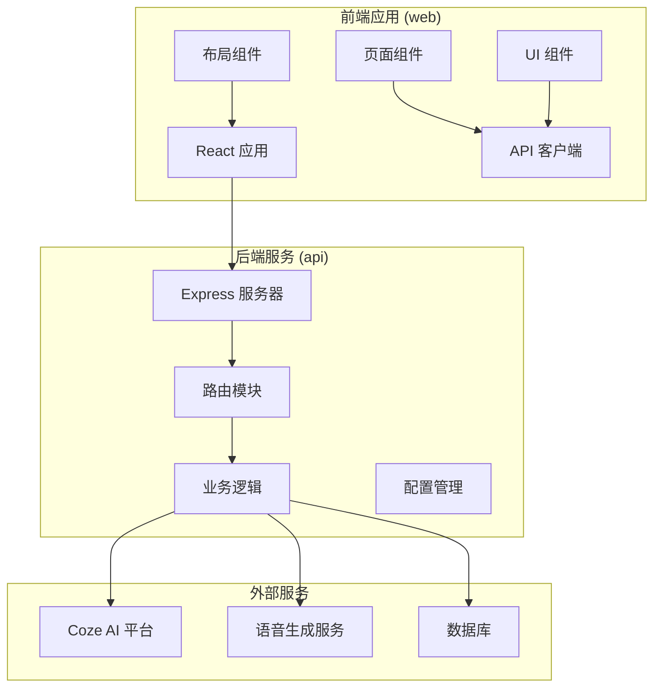
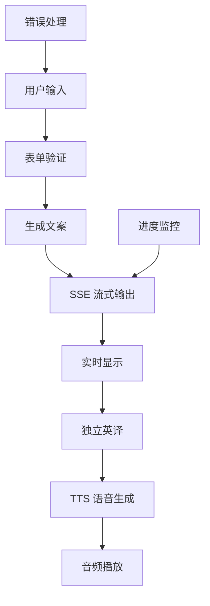
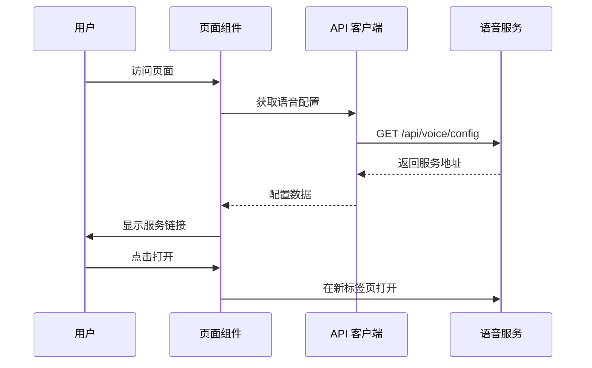
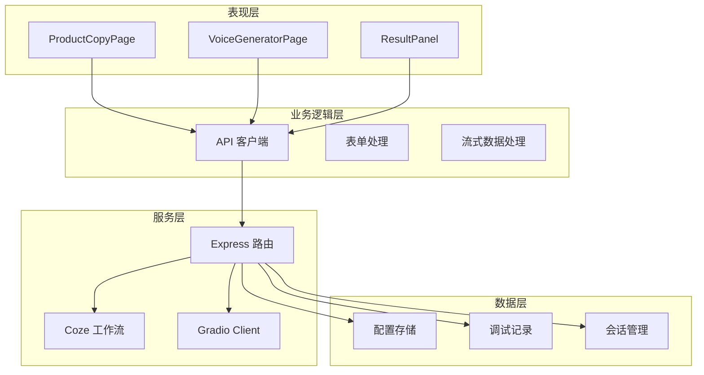
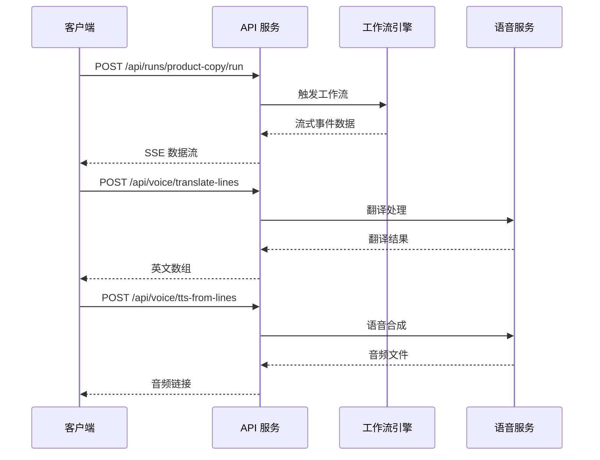
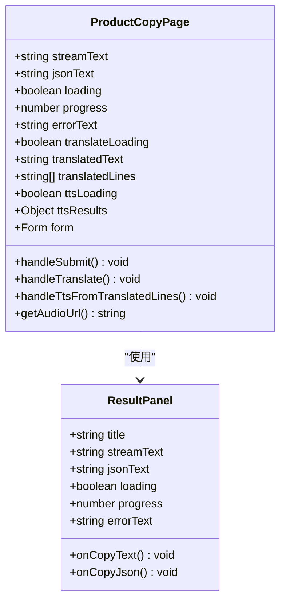
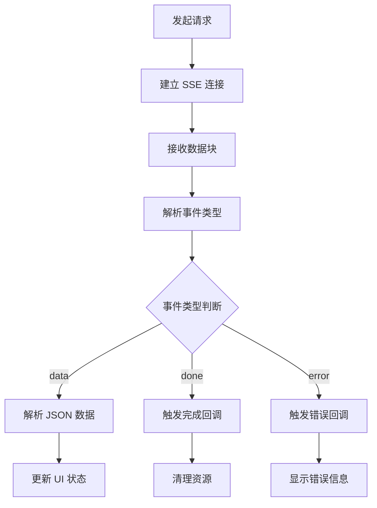
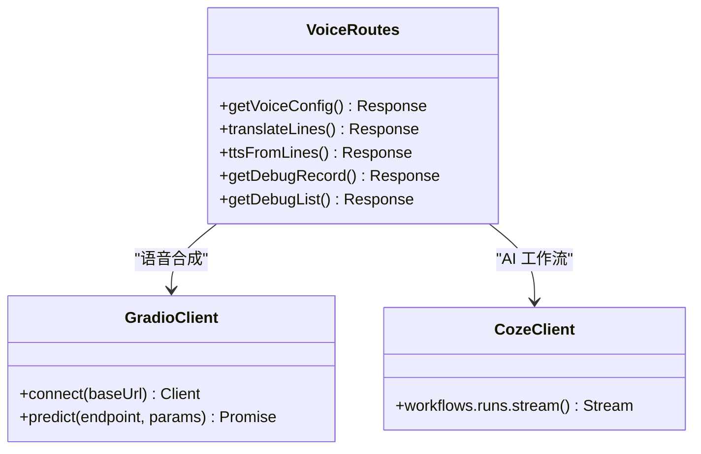
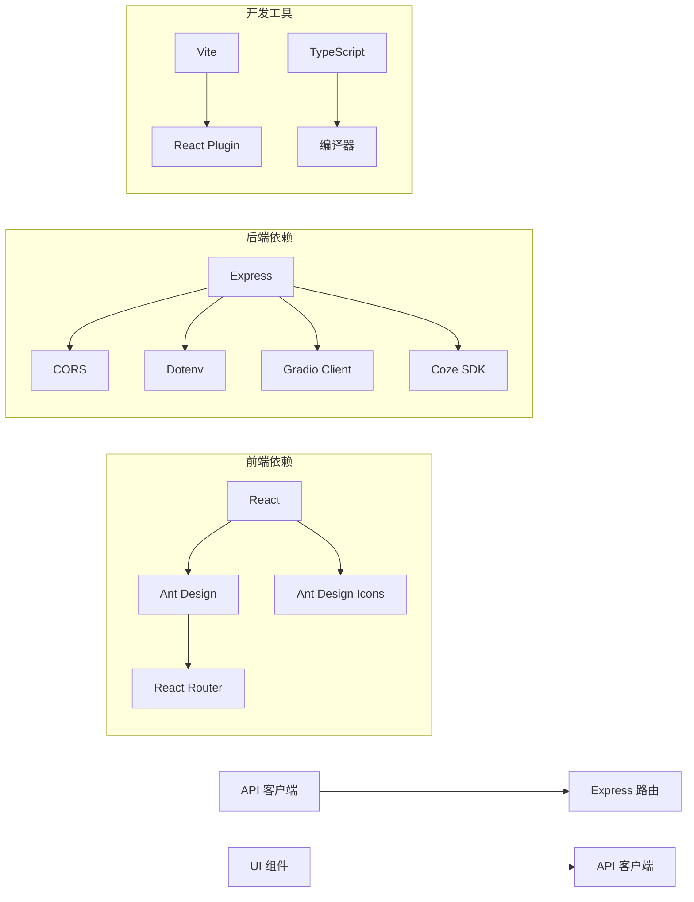
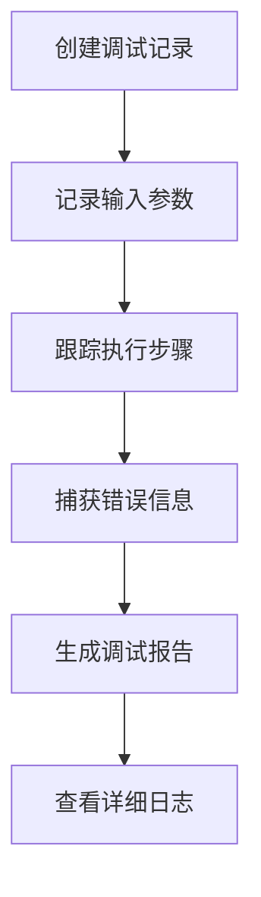

# 产品文案生成页面

<cite>
**本文档引用的文件**
- [ProductCopyPage.tsx](file://web/src/pages/ProductCopyPage.tsx)
- [VoiceGeneratorPage.tsx](file://web/src/pages/VoiceGeneratorPage.tsx)
- [api.ts](file://web/src/lib/api.ts)
- [ResultPanel.tsx](file://web/src/components/ResultPanel.tsx)
- [voice.ts](file://api/src/routes/voice.ts)
- [modules.ts](file://api/src/modules.ts)
- [config.ts](file://api/src/config.ts)
- [App.tsx](file://web/src/App.tsx)
- [MainLayout.tsx](file://web/src/layouts/MainLayout.tsx)
- [styles.css](file://web/src/styles.css)
</cite>

## 目录
1. [简介](#简介)
2. [项目结构](#项目结构)
3. [核心组件](#核心组件)
4. [架构概览](#架构概览)
5. [详细组件分析](#详细组件分析)
6. [依赖关系分析](#依赖关系分析)
7. [性能考虑](#性能考虑)
8. [故障排除指南](#故障排除指南)
9. [结论](#结论)

## 简介

产品文案生成页面是一个集成了AI工作流的综合内容创作平台，主要提供以下核心功能：

- **产品文案智能生成**：基于用户输入的产品信息，自动生成高质量的营销文案
- **多语言翻译服务**：支持将生成的文案进行专业级翻译
- **语音合成生成**：将翻译后的文本转换为自然语音
- **工作流可视化**：提供完整的任务执行流程监控

该系统采用前后端分离架构，前端使用React + Ant Design构建用户界面，后端使用Express.js提供API服务，通过Gradio Client与语音生成服务进行交互。

## 项目结构

项目采用模块化组织方式，主要分为以下几个部分：



**图表来源**
- [App.tsx:1-72](file://web/src/App.tsx#L1-L72)
- [MainLayout.tsx:1-67](file://web/src/layouts/MainLayout.tsx#L1-L67)

**章节来源**
- [App.tsx:1-72](file://web/src/App.tsx#L1-L72)
- [MainLayout.tsx:1-67](file://web/src/layouts/MainLayout.tsx#L1-L67)

## 核心组件

### 产品文案生成页面 (ProductCopyPage)

产品文案生成页面是整个系统的核心功能模块，提供了完整的文案创作工作流：



**图表来源**
- [ProductCopyPage.tsx:33-88](file://web/src/pages/ProductCopyPage.tsx#L33-L88)
- [ProductCopyPage.tsx:90-136](file://web/src/pages/ProductCopyPage.tsx#L90-L136)

### 语音生成页面 (VoiceGeneratorPage)

语音生成页面专注于直接访问语音生成服务：



**图表来源**
- [VoiceGeneratorPage.tsx:10-25](file://web/src/pages/VoiceGeneratorPage.tsx#L10-L25)
- [voice.ts:66-83](file://api/src/routes/voice.ts#L66-L83)

**章节来源**
- [ProductCopyPage.tsx:1-292](file://web/src/pages/ProductCopyPage.tsx#L1-L292)
- [VoiceGeneratorPage.tsx:1-95](file://web/src/pages/VoiceGeneratorPage.tsx#L1-L95)

## 架构概览

系统采用分层架构设计，确保各组件职责清晰、耦合度低：



**图表来源**
- [api.ts:13-36](file://web/src/lib/api.ts#L13-L36)
- [voice.ts:1-421](file://api/src/routes/voice.ts#L1-L421)

### 数据流架构



**图表来源**
- [api.ts:58-115](file://web/src/lib/api.ts#L58-L115)
- [voice.ts:264-329](file://api/src/routes/voice.ts#L264-L329)

**章节来源**
- [api.ts:1-163](file://web/src/lib/api.ts#L1-L163)
- [voice.ts:1-421](file://api/src/routes/voice.ts#L1-L421)

## 详细组件分析

### ProductCopyPage 组件分析

ProductCopyPage 是一个复杂的表单驱动组件，实现了完整的文案生成工作流：

#### 组件状态管理



**图表来源**
- [ProductCopyPage.tsx:13-31](file://web/src/pages/ProductCopyPage.tsx#L13-L31)
- [ResultPanel.tsx:4-14](file://web/src/components/ResultPanel.tsx#L4-L14)

#### 表单处理逻辑

组件支持三种不同的工作流程模式：

1. **标准文案生成流程**：产品名称 → 卖点信息 → 模板选择 → AI生成
2. **翻译增强流程**：先生成文案 → 独立英译 → 生成语音
3. **混合工作流程**：结合多种模板和处理方式

**章节来源**
- [ProductCopyPage.tsx:13-88](file://web/src/pages/ProductCopyPage.tsx#L13-L88)
- [ProductCopyPage.tsx:90-136](file://web/src/pages/ProductCopyPage.tsx#L90-L136)

### API 客户端分析

API 客户端封装了所有后端通信逻辑，提供了统一的接口：

#### 流式数据处理



**图表来源**
- [api.ts:58-115](file://web/src/lib/api.ts#L58-L115)

#### 错误处理机制

API 客户端实现了完善的错误处理策略：

- **认证失败处理**：自动清除令牌并重定向到登录页
- **网络异常处理**：提供详细的错误信息和调试支持
- **业务逻辑错误**：区分不同类型的错误并给出相应提示

**章节来源**
- [api.ts:13-36](file://web/src/lib/api.ts#L13-L36)
- [api.ts:58-115](file://web/src/lib/api.ts#L58-L115)

### 后端服务分析

后端服务基于 Express.js 构建，提供了RESTful API 和流式数据传输能力。

#### 语音服务集成



**图表来源**
- [voice.ts:1-421](file://api/src/routes/voice.ts#L1-L421)

#### 配置管理系统

后端服务通过环境变量管理配置，确保部署灵活性：

- **COZE_API_TOKEN**：AI 工作流服务认证密钥
- **VOICE_BASE_URL**：语音生成服务基础URL
- **DATABASE_URL**：数据库连接字符串
- **JWT_SECRET**：JWT 令牌加密密钥

**章节来源**
- [voice.ts:66-83](file://api/src/routes/voice.ts#L66-L83)
- [config.ts:1-19](file://api/src/config.ts#L1-L19)

## 依赖关系分析

系统各组件之间的依赖关系如下：



**图表来源**
- [package.json:1-200](file://api/package.json#L1-L200)
- [package.json:1-200](file://web/package.json#L1-L200)

### 组件耦合度分析

系统采用了松耦合的设计原则：

- **前端组件**：通过API客户端与后端解耦
- **路由系统**：基于React Router实现页面导航
- **状态管理**：使用React Hooks管理组件状态
- **样式系统**：采用CSS模块化避免样式冲突

**章节来源**
- [App.tsx:18-68](file://web/src/App.tsx#L18-L68)
- [styles.css:1-83](file://web/src/styles.css#L1-L83)

## 性能考虑

### 前端性能优化

1. **懒加载策略**：使用React.lazy实现组件按需加载
2. **状态缓存**：合理使用useMemo和useCallback避免不必要的重渲染
3. **虚拟滚动**：对长列表使用虚拟滚动提升渲染性能
4. **图片优化**：采用响应式图片和适当的压缩策略

### 后端性能优化

1. **连接池管理**：数据库连接池配置优化
2. **缓存策略**：对频繁访问的数据实施缓存
3. **并发控制**：限制同时处理的任务数量
4. **资源清理**：及时释放WebSocket连接和临时文件

### 网络性能优化

1. **SSE 优化**：合理配置事件流的缓冲区大小
2. **CDN 加速**：静态资源使用CDN分发
3. **压缩传输**：启用Gzip压缩减少传输体积
4. **预加载策略**：关键资源预加载提升首屏速度

## 故障排除指南

### 常见问题及解决方案

#### 1. 语音服务配置问题

**症状**：无法获取语音服务地址或页面显示为空白

**诊断步骤**：
1. 检查 `VOICE_BASE_URL` 环境变量是否正确配置
2. 验证语音服务是否正常运行
3. 查看浏览器开发者工具的网络请求

**解决方案**：
```bash
# 设置语音服务基础URL
export VOICE_BASE_URL="https://your-voice-service.com"

# 重启后端服务
npm run start
```

#### 2. AI 工作流执行失败

**症状**：文案生成过程中断或返回错误

**诊断步骤**：
1. 检查 `COZE_API_TOKEN` 是否有效
2. 验证工作流ID是否正确
3. 查看调试记录获取详细错误信息

**解决方案**：
```javascript
// 检查调试记录
fetch('/api/voice/debug')
  .then(response => response.json())
  .then(data => console.log(data));
```

#### 3. 流式数据传输问题

**症状**：页面长时间处于加载状态

**诊断步骤**：
1. 检查网络连接稳定性
2. 验证SSE连接是否正常建立
3. 查看浏览器控制台是否有错误信息

**解决方案**：
```javascript
// 实现重连机制
const reconnect = () => {
  setTimeout(() => {
    // 重新建立SSE连接
  }, 5000);
};
```

### 调试工具使用

#### 调试记录系统

系统内置了完整的调试记录功能：



**图表来源**
- [voice.ts:26-58](file://api/src/routes/voice.ts#L26-L58)

**章节来源**
- [voice.ts:244-261](file://api/src/routes/voice.ts#L244-L261)

## 结论

产品文案生成页面是一个功能完整、架构清晰的内容创作平台。通过合理的组件划分和API设计，实现了从文案生成到语音合成的完整工作流。

### 主要优势

1. **用户体验优秀**：直观的界面设计和流畅的操作体验
2. **功能完整性**：覆盖从创意到发布的全流程需求
3. **技术架构先进**：采用现代Web技术和最佳实践
4. **可扩展性强**：模块化设计便于功能扩展和维护

### 改进建议

1. **性能优化**：进一步优化大文件处理和流式数据传输
2. **错误处理**：增强用户友好的错误提示和恢复机制
3. **安全性**：加强输入验证和权限控制
4. **监控告警**：完善系统监控和异常告警机制

该系统为内容创作者提供了强大的技术支持，能够显著提升工作效率和内容质量。