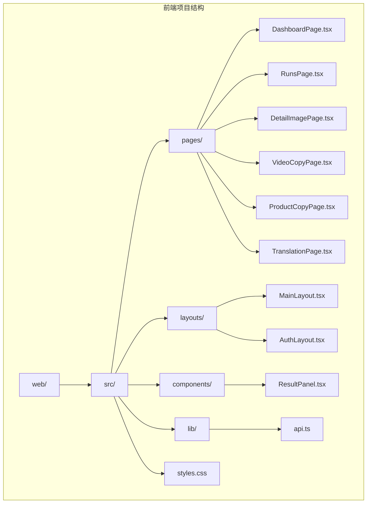
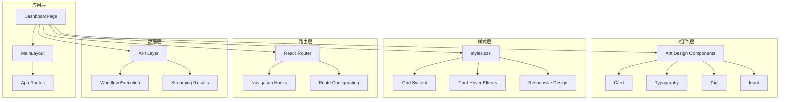
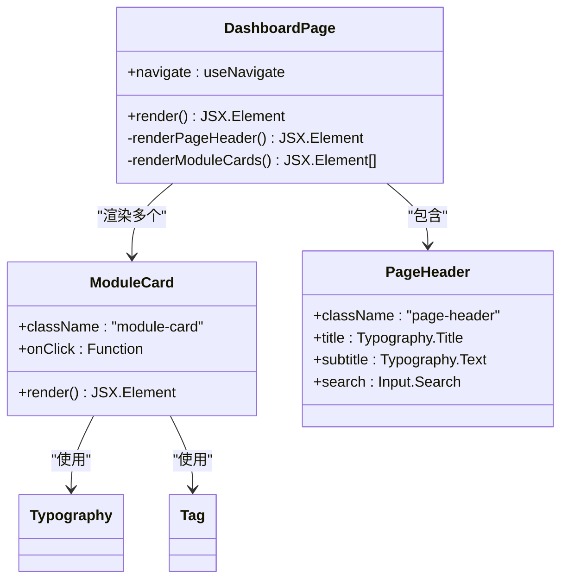
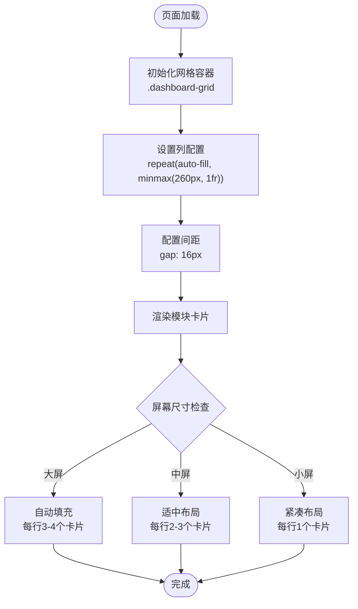
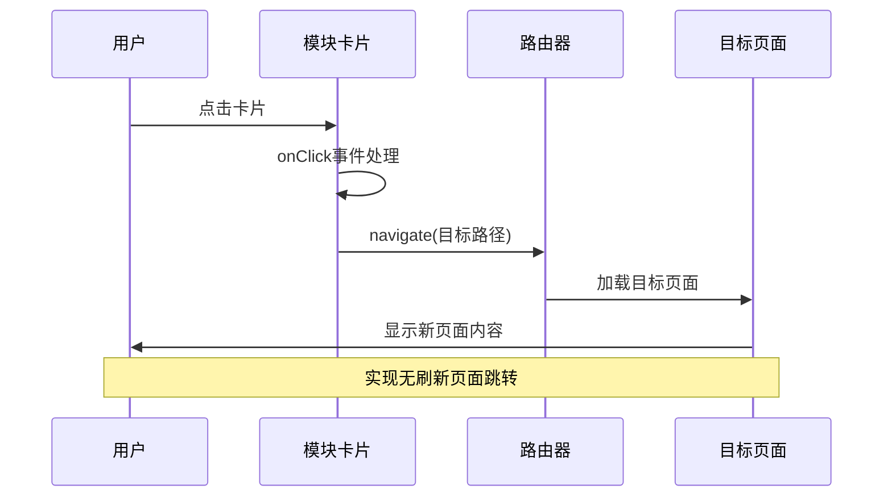
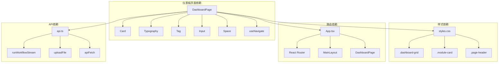

# 仪表板页面

<cite>
**本文引用的文件**
- [DashboardPage.tsx](file://web/src/pages/DashboardPage.tsx)
- [MainLayout.tsx](file://web/src/layouts/MainLayout.tsx)
- [styles.css](file://web/src/styles.css)
- [App.tsx](file://web/src/App.tsx)
- [main.tsx](file://web/src/main.tsx)
- [ResultPanel.tsx](file://web/src/components/ResultPanel.tsx)
- [api.ts](file://web/src/lib/api.ts)
- [RunsPage.tsx](file://web/src/pages/RunsPage.tsx)
- [DetailImagePage.tsx](file://web/src/pages/DetailImagePage.tsx)
- [VideoCopyPage.tsx](file://web/src/pages/VideoCopyPage.tsx)
- [ProductCopyPage.tsx](file://web/src/pages/ProductCopyPage.tsx)
- [TranslationPage.tsx](file://web/src/pages/TranslationPage.tsx)
</cite>

## 目录
1. [简介](#简介)
2. [项目结构](#项目结构)
3. [核心组件](#核心组件)
4. [架构概览](#架构概览)
5. [详细组件分析](#详细组件分析)
6. [依赖关系分析](#依赖关系分析)
7. [性能考虑](#性能考虑)
8. [故障排除指南](#故障排除指南)
9. [结论](#结论)
10. [附录](#附录)

## 简介
仪表板页面是整个应用的功能入口界面，采用卡片式布局展示各个功能模块。该页面实现了响应式网格系统、模块卡片导航机制、标签系统以及搜索功能集成。通过统一的布局框架和样式系统，为用户提供直观的功能导航体验。

## 项目结构
仪表板页面位于前端项目的页面目录中，采用React + Ant Design技术栈构建。整体项目结构清晰，采用按功能模块划分的组织方式。

**图表来源**
- [DashboardPage.tsx:1-108](file://web/src/pages/DashboardPage.tsx#L1-L108)
- [MainLayout.tsx:1-65](file://web/src/layouts/MainLayout.tsx#L1-L65)
- [styles.css:1-83](file://web/src/styles.css#L1-L83)

**章节来源**
- [DashboardPage.tsx:1-108](file://web/src/pages/DashboardPage.tsx#L1-L108)
- [main.tsx:1-17](file://web/src/main.tsx#L1-L17)

## 核心组件
仪表板页面由多个核心组件协同工作，形成完整的功能导航体系：

### 页面布局组件
- **DashboardPage**: 主要的仪表板页面组件，负责渲染功能模块卡片
- **MainLayout**: 应用主布局，提供侧边菜单和头部区域
- **ResultPanel**: 结果面板组件，用于展示流式处理结果

### 样式系统
- **styles.css**: 全局样式定义，包含网格系统、卡片样式和响应式设计
- **Ant Design**: UI组件库，提供卡片、标签、输入框等基础组件

### 导航系统
- **React Router**: 路由管理，实现页面间的导航跳转
- **useNavigate**: React Router提供的导航钩子函数

**章节来源**
- [DashboardPage.tsx:1-108](file://web/src/pages/DashboardPage.tsx#L1-L108)
- [styles.css:29-50](file://web/src/styles.css#L29-L50)

## 架构概览
仪表板页面采用分层架构设计，从底层基础设施到上层业务逻辑层层递进。

**图表来源**
- [App.tsx:41-65](file://web/src/App.tsx#L41-L65)
- [DashboardPage.tsx:1-108](file://web/src/pages/DashboardPage.tsx#L1-L108)
- [MainLayout.tsx:1-65](file://web/src/layouts/MainLayout.tsx#L1-L65)

## 详细组件分析

### 仪表板页面组件分析

#### 布局结构设计
仪表板页面采用两层布局结构：
- **页面头部区域**: 包含主标题、副标题和搜索功能
- **功能网格区域**: 使用CSS Grid实现响应式卡片布局

**图表来源**
- [DashboardPage.tsx:4-108](file://web/src/pages/DashboardPage.tsx#L4-L108)

#### 模块卡片组件设计
每个功能模块都封装为独立的卡片组件，具有以下特征：

| 卡片属性 | 描述 | 示例 |
|---------|------|------|
| **点击导航** | 点击卡片触发路由跳转 | navigate('/modules/detail-image') |
| **标题显示** | 显示功能名称 | "详情图生成" |
| **副标题说明** | 显示功能描述 | "支持参考图/非参考图分支" |
| **标签系统** | 使用语义化标签标识功能特性 | "图片"、"多图"、"文案" |

#### 网格系统实现
仪表板采用CSS Grid实现响应式布局：

**图表来源**
- [styles.css:36-40](file://web/src/styles.css#L36-L40)

**章节来源**
- [DashboardPage.tsx:19-103](file://web/src/pages/DashboardPage.tsx#L19-L103)
- [styles.css:36-50](file://web/src/styles.css#L36-L50)

### 头部区域组件分析

#### 标题显示系统
页面头部采用层次化的标题结构：
- **主标题**: "功能总览" - 使用Typography.Title(level={3})
- **副标题**: "选择功能模块开始工作" - 使用Typography.Text(type="secondary")

#### 搜索功能集成
集成Ant Design的Input.Search组件，提供功能模块搜索能力：
- **占位符**: "搜索功能"
- **宽度**: 260px
- **实时响应**: 支持输入时的即时搜索

**章节来源**
- [DashboardPage.tsx:9-17](file://web/src/pages/DashboardPage.tsx#L9-L17)

### 导航机制与页面跳转

#### 点击导航机制
每个模块卡片都实现了独立的导航逻辑：

**图表来源**
- [DashboardPage.tsx:20-102](file://web/src/pages/DashboardPage.tsx#L20-L102)

#### 路由配置系统
应用采用React Router进行路由管理：
- **根路径**: "/" -> "/dashboard"
- **仪表板**: "/dashboard" -> DashboardPage
- **功能模块**: "/modules/*" -> 各种功能页面
- **任务管理**: "/runs" -> RunsPage

**章节来源**
- [App.tsx:55-62](file://web/src/App.tsx#L55-L62)

### 标签系统与视觉设计

#### 标签系统实现
每个功能模块卡片底部包含语义化标签：
- **功能分类标签**: 如"图片"、"视频"、"产品"、"翻译"
- **状态标签**: 如"任务"、"状态"、"历史"
- **技术标签**: 如"TTS"、"本地服务"、"调试"

#### 视觉设计特征
- **悬停效果**: 卡片悬停时产生轻微上移和阴影效果
- **过渡动画**: 0.2秒的平滑过渡动画
- **颜色方案**: 使用Ant Design的默认主题色
- **间距控制**: 使用Space组件控制垂直和水平间距

**章节来源**
- [DashboardPage.tsx:26-30](file://web/src/pages/DashboardPage.tsx#L26-L30)
- [styles.css:42-50](file://web/src/styles.css#L42-L50)

### 响应式布局适配

#### 移动端适配策略
- **网格列宽**: 最小260px，确保在小屏幕上仍有良好的可读性
- **间距调整**: 16px的网格间距在各种设备上保持一致
- **字体缩放**: 使用相对单位确保文字在不同分辨率下的可读性

#### 断点设计
基于CSS Grid的自动填充特性，页面在不同屏幕尺寸下自动调整：
- **桌面端**: 每行显示3-4个卡片
- **平板端**: 每行显示2-3个卡片  
- **移动端**: 每行显示1个卡片

**章节来源**
- [styles.css:36-40](file://web/src/styles.css#L36-L40)

### 用户交互反馈机制

#### 加载状态反馈
- **按钮加载**: 导航时提供视觉反馈
- **进度指示**: 流式处理过程中的进度条
- **状态提示**: 成功、失败、警告等状态消息

#### 错误处理机制
- **异常捕获**: 统一的错误处理和用户提示
- **重试机制**: 部分功能支持重新尝试
- **错误恢复**: 提供错误恢复和继续使用的选项

**章节来源**
- [ResultPanel.tsx:37-39](file://web/src/components/ResultPanel.tsx#L37-L39)

## 依赖关系分析

### 组件依赖关系图

**图表来源**
- [DashboardPage.tsx:1-108](file://web/src/pages/DashboardPage.tsx#L1-L108)
- [styles.css:1-83](file://web/src/styles.css#L1-L83)
- [App.tsx:1-70](file://web/src/App.tsx#L1-L70)

### 外部依赖分析
- **Ant Design**: 提供UI组件和样式基础
- **React Router**: 实现客户端路由和导航
- **React**: 核心框架，提供组件化开发
- **TypeScript**: 类型安全和更好的开发体验

**章节来源**
- [main.tsx:1-17](file://web/src/main.tsx#L1-L17)
- [App.tsx:1-70](file://web/src/App.tsx#L1-L70)

## 性能考虑

### 渲染性能优化
- **虚拟滚动**: 对于大量数据的场景可考虑使用虚拟滚动
- **懒加载**: 图片和资源的懒加载策略
- **组件拆分**: 将大型组件拆分为更小的可复用组件

### 网络性能优化
- **缓存策略**: API响应的合理缓存
- **并发控制**: 避免过多的并发请求
- **数据压缩**: 传输数据的压缩和优化

### 内存管理
- **事件监听器清理**: 及时清理不再使用的事件监听器
- **定时器管理**: 合理管理定时器和轮询任务
- **资源释放**: 及时释放不再使用的资源

## 故障排除指南

### 常见问题诊断

#### 页面无法正常显示
1. **检查网络连接**: 确认API服务正常运行
2. **验证路由配置**: 检查App.tsx中的路由配置
3. **查看控制台错误**: 检查浏览器开发者工具中的错误信息

#### 卡片点击无响应
1. **确认useNavigate导入**: 确保useNavigate正确导入
2. **检查路由路径**: 验证导航路径是否正确配置
3. **验证权限设置**: 确认用户具有访问相应页面的权限

#### 样式显示异常
1. **检查CSS文件加载**: 确认styles.css正确加载
2. **验证类名匹配**: 确认HTML元素的className与CSS规则匹配
3. **检查浏览器兼容性**: 验证CSS Grid的支持情况

**章节来源**
- [DashboardPage.tsx:1-108](file://web/src/pages/DashboardPage.tsx#L1-L108)
- [styles.css:1-83](file://web/src/styles.css#L1-L83)

## 结论
仪表板页面成功实现了现代化的卡片式功能导航系统。通过合理的组件设计、响应式布局和用户友好的交互体验，为用户提供了直观高效的功能入口。网格系统的灵活配置和标签系统的语义化设计，使得页面既美观又实用。未来可以在性能优化、国际化支持和无障碍访问等方面进一步提升用户体验。

## 附录

### 样式定制指南

#### 卡片布局定制
- **网格列数**: 修改`.dashboard-grid`中的`repeat()`参数
- **卡片间距**: 调整`gap`值控制卡片间距
- **卡片尺寸**: 修改`minmax()`中的最小宽度值

#### 动画效果定制
- **过渡时长**: 修改`transition`属性中的时长
- **悬停效果**: 调整`:hover`状态下的样式
- **阴影效果**: 修改`box-shadow`的参数

#### 响应式断点
- **移动优先**: 使用媒体查询实现不同设备的适配
- **弹性布局**: 利用CSS Grid的自动填充特性
- **字体缩放**: 使用相对单位确保可读性

### 用户体验优化建议
- **加载状态**: 为所有异步操作提供明确的加载状态
- **错误处理**: 统一的错误提示和恢复机制
- **键盘导航**: 支持键盘快捷键和无障碍访问
- **触摸友好**: 优化移动端触摸交互体验