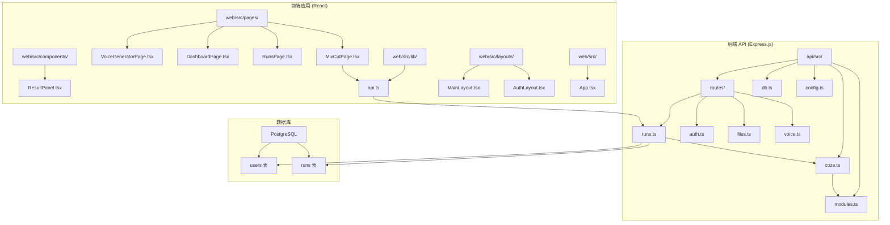
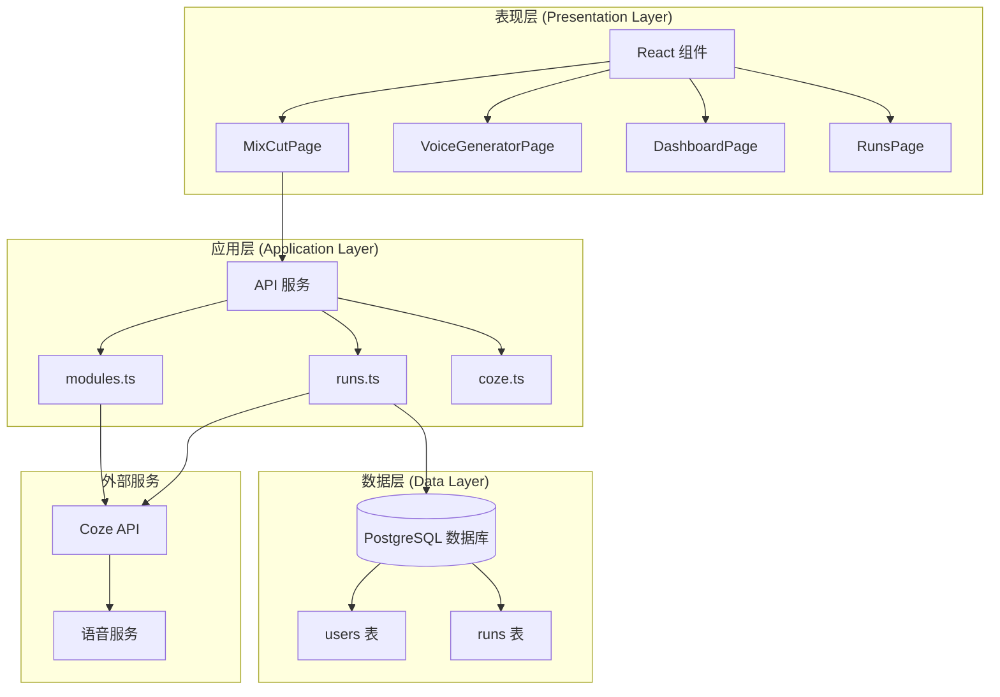
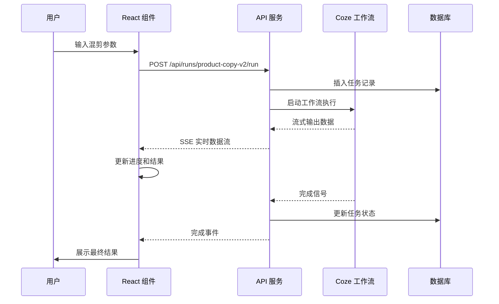
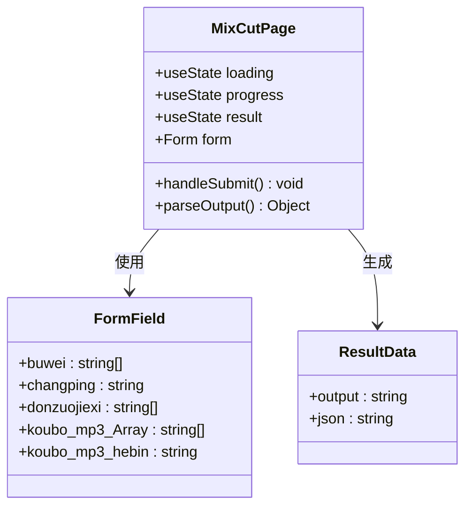
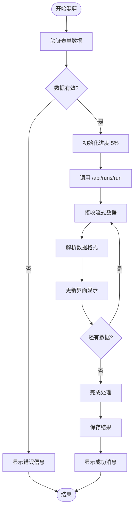
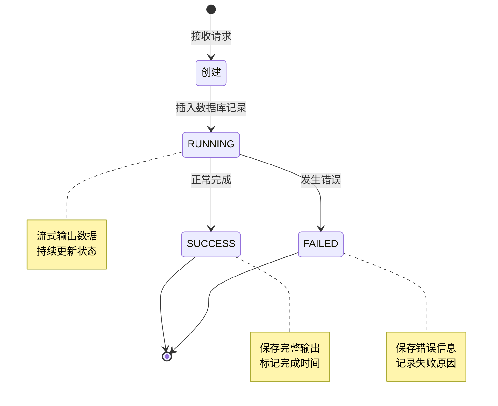
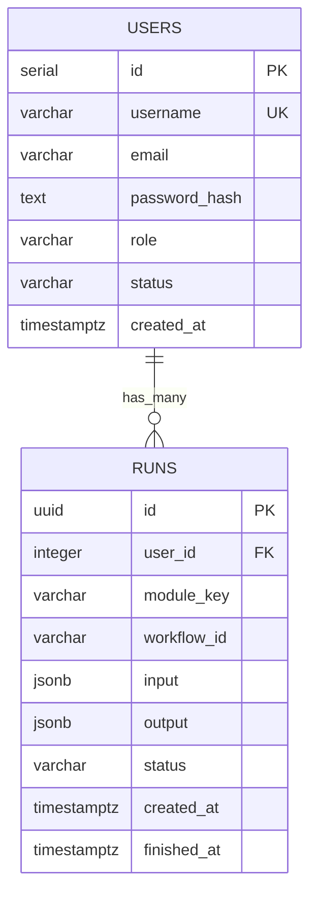
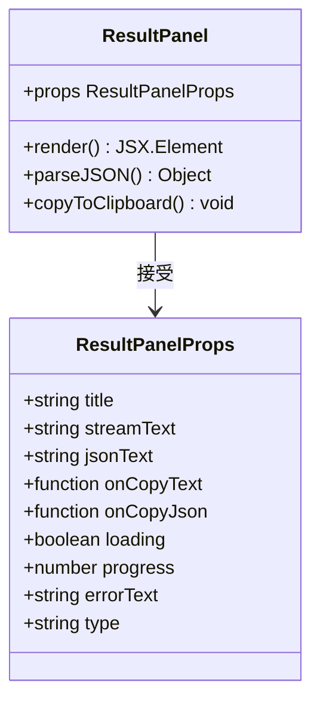
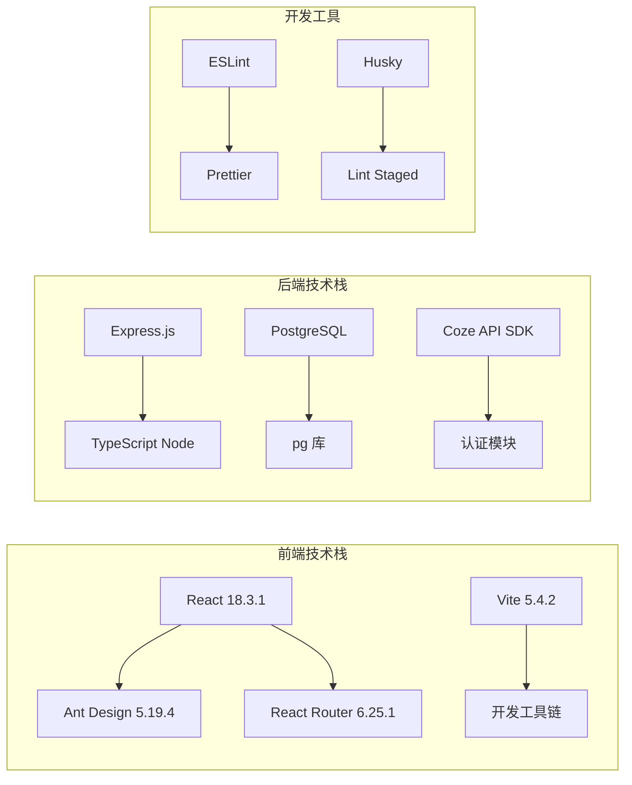
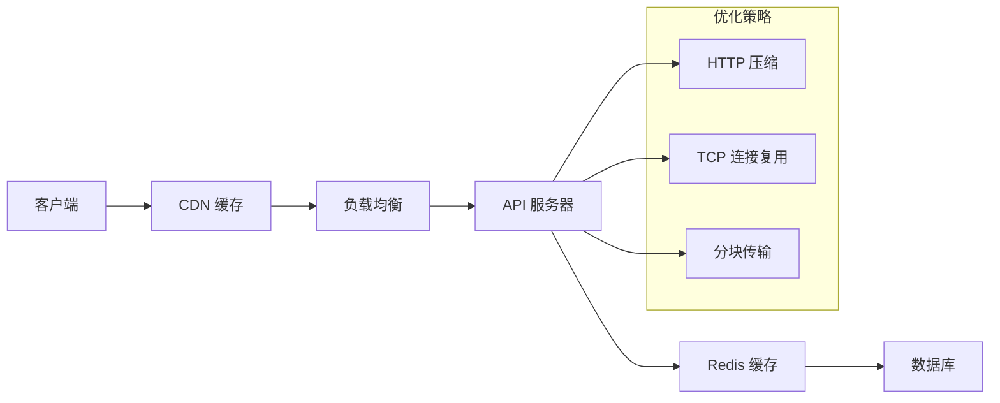

# 混剪功能页面

<cite>
**本文档引用的文件**
- [MixCutPage.tsx](file://web/src/pages/MixCutPage.tsx)
- [api.ts](file://web/src/lib/api.ts)
- [runs.ts](file://api/src/routes/runs.ts)
- [modules.ts](file://api/src/modules.ts)
- [coze.ts](file://api/src/coze.ts)
- [db.ts](file://api/src/db.ts)
- [config.ts](file://api/src/config.ts)
- [App.tsx](file://web/src/App.tsx)
- [MainLayout.tsx](file://web/src/layouts/MainLayout.tsx)
- [ResultPanel.tsx](file://web/src/components/ResultPanel.tsx)
- [DashboardPage.tsx](file://web/src/pages/DashboardPage.tsx)
- [RunsPage.tsx](file://web/src/pages/RunsPage.tsx)
</cite>

## 目录
1. [简介](#简介)
2. [项目结构](#项目结构)
3. [核心组件](#核心组件)
4. [架构概览](#架构概览)
5. [详细组件分析](#详细组件分析)
6. [依赖关系分析](#依赖关系分析)
7. [性能考虑](#性能考虑)
8. [故障排除指南](#故障排除指南)
9. [结论](#结论)

## 简介

混剪功能页面是基于 Coze 工作流平台构建的一个视频内容混剪生成系统。该功能允许用户通过输入多个参数，调用 Coze 工作流来生成包含音频和视频内容的混剪作品。系统采用前后端分离架构，前端使用 React + Ant Design 构建用户界面，后端使用 Express.js 提供 API 服务。

该功能的核心特性包括：
- 支持多种输入参数（部位、产品名称、动作解析、音频链接等）
- 实时流式处理和进度反馈
- 完整的任务执行历史记录
- 错误处理和恢复机制
- 用户友好的可视化界面

## 项目结构

整个项目采用模块化组织方式，主要分为前端应用和后端 API 两大部分：

**图表来源**
- [MixCutPage.tsx:1-204](file://web/src/pages/MixCutPage.tsx#L1-L204)
- [api.ts:1-163](file://web/src/lib/api.ts#L1-L163)
- [runs.ts:1-159](file://api/src/routes/runs.ts#L1-L159)

**章节来源**
- [MixCutPage.tsx:1-204](file://web/src/pages/MixCutPage.tsx#L1-L204)
- [App.tsx:1-72](file://web/src/App.tsx#L1-L72)

## 核心组件

### 混剪页面组件 (MixCutPage)

混剪页面是整个功能的核心组件，负责处理用户输入、调用后端 API、展示处理结果。该组件实现了完整的表单验证、实时数据流处理和结果展示功能。

主要功能特性：
- **表单管理**：使用 Ant Design Form 组件进行数据收集和验证
- **流式处理**：通过 Server-Sent Events 实现实时进度反馈
- **结果展示**：支持 JSON 和文本两种格式的结果展示
- **错误处理**：完善的异常捕获和用户提示机制

### API 通信层 (api.ts)

前端与后端交互的核心模块，提供了统一的 API 访问接口：

- **认证支持**：自动处理 JWT 令牌的添加和过期处理
- **流式数据**：实现 Server-Sent Events 的完整支持
- **错误处理**：标准化的错误响应处理
- **类型安全**：完整的 TypeScript 类型定义

### 后端工作流引擎 (runs.ts)

后端的核心业务逻辑，负责协调 Coze 工作流的执行：

- **任务管理**：完整的任务生命周期管理
- **流式输出**：将工作流的实时输出转换为 SSE 格式
- **状态跟踪**：持久化存储任务执行状态
- **错误恢复**：智能的错误处理和恢复机制

**章节来源**
- [MixCutPage.tsx:1-204](file://web/src/pages/MixCutPage.tsx#L1-L204)
- [api.ts:1-163](file://web/src/lib/api.ts#L1-L163)
- [runs.ts:1-159](file://api/src/routes/runs.ts#L1-L159)

## 架构概览

系统采用分层架构设计，清晰分离了表现层、业务逻辑层和数据访问层：

**图表来源**
- [MixCutPage.tsx:1-204](file://web/src/pages/MixCutPage.tsx#L1-L204)
- [runs.ts:1-159](file://api/src/routes/runs.ts#L1-L159)
- [modules.ts:1-34](file://api/src/modules.ts#L1-L34)

### 数据流架构

**图表来源**
- [api.ts:58-115](file://web/src/lib/api.ts#L58-L115)
- [runs.ts:55-123](file://api/src/routes/runs.ts#L55-L123)

## 详细组件分析

### 混剪页面组件深度分析

#### 表单设计与验证

混剪页面实现了复杂的表单系统，支持多种输入类型：

**图表来源**
- [MixCutPage.tsx:5-13](file://web/src/pages/MixCutPage.tsx#L5-L13)

#### 流式数据处理机制

系统采用 Server-Sent Events 实现实时数据传输：

**图表来源**
- [api.ts:58-115](file://web/src/lib/api.ts#L58-L115)
- [MixCutPage.tsx:15-63](file://web/src/pages/MixCutPage.tsx#L15-L63)

#### 错误处理策略

系统实现了多层次的错误处理机制：

| 错误类型 | 处理方式 | 用户反馈 |
|---------|---------|---------|
| 网络错误 | 自动重试机制 | 网络连接失败提示 |
| 业务错误 | 具体错误描述 | 明确的错误信息 |
| 超时错误 | 取消请求并清理状态 | 超时提示和重试按钮 |
| 服务器错误 | 记录日志并优雅降级 | 服务器忙提示 |

**章节来源**
- [MixCutPage.tsx:1-204](file://web/src/pages/MixCutPage.tsx#L1-L204)
- [api.ts:58-115](file://web/src/lib/api.ts#L58-L115)

### 后端工作流处理分析

#### 任务生命周期管理

**图表来源**
- [runs.ts:67-123](file://api/src/routes/runs.ts#L67-L123)

#### 数据库设计

系统使用 PostgreSQL 存储任务执行历史：

**图表来源**
- [db.ts:11-32](file://api/src/db.ts#L11-L32)

**章节来源**
- [runs.ts:1-159](file://api/src/routes/runs.ts#L1-L159)
- [db.ts:1-35](file://api/src/db.ts#L1-L35)

### 前端组件复用性分析

#### ResultPanel 组件设计

ResultPanel 是一个高度可复用的结果展示组件：

**图表来源**
- [ResultPanel.tsx:4-26](file://web/src/components/ResultPanel.tsx#L4-L26)

**章节来源**
- [ResultPanel.tsx:1-118](file://web/src/components/ResultPanel.tsx#L1-L118)

## 依赖关系分析

### 技术栈依赖

系统采用了现代化的技术栈组合：

**图表来源**
- [web/package.json:11-24](file://web/package.json#L11-L24)
- [api/package.json:1-200](file://api/package.json#L1-L200)

### 外部服务集成

系统集成了多个外部服务：

| 服务名称 | 用途 | 配置项 |
|---------|------|--------|
| Coze API | 工作流执行 | COZE_API_TOKEN |
| PostgreSQL | 数据持久化 | DATABASE_URL |
| 语音服务 | TTS 生成 | VOICE_BASE_URL |
| JWT | 用户认证 | JWT_SECRET |

**章节来源**
- [config.ts:1-19](file://api/src/config.ts#L1-L19)
- [coze.ts:1-8](file://api/src/coze.ts#L1-L8)

## 性能考虑

### 前端性能优化

1. **懒加载策略**：使用 React.lazy 和 Suspense 实现组件懒加载
2. **状态管理**：合理使用 useState 和 useEffect 避免不必要的重渲染
3. **内存管理**：及时清理事件监听器和定时器
4. **网络优化**：实现请求去重和缓存策略

### 后端性能优化

1. **数据库连接池**：使用连接池管理数据库连接
2. **流式处理**：避免一次性加载大量数据到内存
3. **并发控制**：限制同时运行的工作流数量
4. **缓存策略**：对频繁访问的数据进行缓存

### 网络性能

## 故障排除指南

### 常见问题及解决方案

#### 登录认证问题
- **症状**：页面跳转到登录页
- **原因**：JWT 令牌过期或无效
- **解决**：清除本地存储的令牌并重新登录

#### 网络连接问题
- **症状**：请求超时或连接失败
- **原因**：API 服务器不可达
- **解决**：检查网络连接和服务器状态

#### 工作流执行失败
- **症状**：任务状态显示 FAILED
- **原因**：工作流参数错误或外部服务异常
- **解决**：查看任务详情中的错误信息

#### 数据库连接问题
- **症状**：应用启动失败
- **原因**：数据库连接字符串错误
- **解决**：检查 DATABASE_URL 环境变量

### 调试工具

1. **浏览器开发者工具**：监控网络请求和 JavaScript 错误
2. **PostgreSQL 客户端**：直接查询数据库状态
3. **API 测试工具**：使用 curl 或 Postman 测试 API
4. **日志分析**：查看应用和数据库日志

**章节来源**
- [RunsPage.tsx:1-179](file://web/src/pages/RunsPage.tsx#L1-L179)

## 结论

混剪功能页面是一个功能完整、架构清晰的现代化 Web 应用。系统通过合理的分层设计、完善的错误处理机制和良好的用户体验，为用户提供了强大的视频内容混剪能力。

### 主要优势

1. **技术先进**：采用最新的 React 和 Express 技术栈
2. **架构清晰**：分层设计便于维护和扩展
3. **用户体验好**：实时反馈和直观的界面设计
4. **可靠性高**：完善的错误处理和恢复机制
5. **可扩展性强**：模块化设计支持功能扩展

### 改进建议

1. **增加单元测试**：为关键组件和函数添加测试用例
2. **性能监控**：集成性能监控工具跟踪应用性能
3. **文档完善**：补充 API 文档和开发指南
4. **安全加固**：增强输入验证和安全防护措施

该系统为视频内容创作提供了强大的技术支持，通过持续的优化和改进，可以更好地满足用户的需求。