# 混剪功能页面

<cite>
**本文档引用的文件**
- [MixCutPage.tsx](file://web/src/pages/MixCutPage.tsx)
- [CopyLibraryPage.tsx](file://web/src/pages/CopyLibraryPage.tsx)
- [api.ts](file://web/src/lib/api.ts)
- [copyLibrary.ts](file://api/src/routes/copyLibrary.ts)
- [db.ts](file://api/src/db.ts)
- [App.tsx](file://web/src/App.tsx)
- [MainLayout.tsx](file://web/src/layouts/MainLayout.tsx)
- [runs.ts](file://api/src/routes/runs.ts)
- [modules.ts](file://api/src/modules.ts)
- [coze.ts](file://api/src/coze.ts)
- [ResultPanel.tsx](file://web/src/components/ResultPanel.tsx)
- [DashboardPage.tsx](file://web/src/pages/DashboardPage.tsx)
- [RunsPage.tsx](file://web/src/pages/RunsPage.tsx)
- [ProductCopyPage.tsx](file://web/src/pages/ProductCopyPage.tsx)
- [VoiceGeneratorPage.tsx](file://web/src/pages/VoiceGeneratorPage.tsx)
</cite>

## 更新摘要
**变更内容**
- 新增复制库集成功能，支持从复制库导入内容到混剪工作流
- 更新了混剪页面组件的初始值设置和表单验证逻辑
- 新增了可视化进度条组件和进度状态管理
- 改进了结果展示功能，支持音频片段和合并音频的分离展示
- 简化了流式响应处理逻辑，提升了用户体验
- 更新了数据流架构图以反映新的进度跟踪机制
- **新增** 音频URL自动提取和填充功能，从复制库的tts_individual数组和tts_merged对象中自动提取音频URL
- **新增** 复制库数据结构支持，包含复杂的音频数据结构
- **更新** 改进了TTS数据结构处理逻辑，增强了对tts_merged属性的安全访问模式
- **更新** 添加了更清晰的数据结构注释，明确了tts_merged的结构说明
- **更新** 增强了 MixCutPage 组件的调试功能，添加了详细的日志输出和数据格式化改进
- **更新** 在 workflow 参数调用中添加了结构化日志记录，包括对 workflow 参数的详细日志输出
- **更新** 改进了 file_id 的 JSON 对象格式化处理，确保参数传递的准确性

## 目录
1. [简介](#简介)
2. [项目结构](#项目结构)
3. [核心组件](#核心组件)
4. [架构概览](#架构概览)
5. [详细组件分析](#详细组件分析)
6. [依赖关系分析](#依赖关系分析)
7. [性能考虑](#性能考虑)
8. [故障排除指南](#故障排除指南)
9. [结论](#结论)

## 简介

混剪功能页面是基于 Coze 工作流平台构建的一个视频内容混剪生成系统。该功能允许用户通过输入多个参数，调用 Coze 工作流来生成包含音频和视频内容的混剪作品。系统采用前后端分离架构，前端使用 React + Ant Design 构建用户界面，后端使用 Express.js 提供 API 服务。

**更新** 新版本引入了更友好的初始值设置、实时进度跟踪和可视化的进度条，以及改进的结果展示功能，支持单独音频片段和合并音频输出的分离展示。**新增** 复制库集成功能，用户可以通过文案库管理生成的内容，并直接导入到混剪工作流中。**新增** 音频URL自动提取功能，前端组件现在能够从复制库的tts_individual数组和tts_merged对象中提取音频URL，实现无缝的音频资产导入体验。

**更新** 最新版本重点改进了TTS数据结构处理逻辑，增强了对tts_merged属性的安全访问模式，添加了更清晰的数据结构注释，明确了tts_merged的结构说明。**更新** 增强了调试功能，MixCutPage 组件现在包含详细的日志输出和数据格式化改进，特别是在 workflow 参数调用和 file_id JSON 对象格式化方面。

该功能的核心特性包括：
- 支持多种输入参数（部位、产品名称、动作解析、音频链接等）
- 实时流式处理和进度反馈
- 完整的任务执行历史记录
- 错误处理和恢复机制
- 用户友好的可视化界面
- **新增** 可视化进度跟踪和结果分离展示
- **新增** 复制库集成功能，支持内容复用和导入
- **新增** 音频URL自动提取功能，支持从复制库导入音频资产
- **更新** 改进的TTS数据结构处理，增强tts_merged属性的安全访问
- **更新** 更清晰的数据结构注释和类型定义
- **更新** 增强的调试功能，提供详细的日志输出和参数格式化
- **更新** 改进的 workflow 参数结构化日志记录
- **更新** 优化的 file_id JSON 对象格式化处理

## 项目结构

整个项目采用模块化组织方式，主要分为前端应用和后端 API 两大部分：

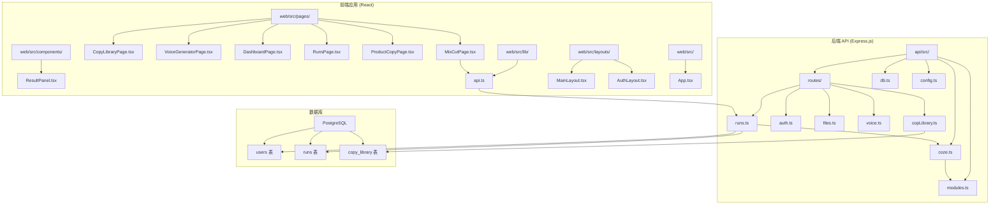

**图表来源**
- [MixCutPage.tsx:1-370](file://web/src/pages/MixCutPage.tsx#L1-L370)
- [CopyLibraryPage.tsx:1-181](file://web/src/pages/CopyLibraryPage.tsx#L1-L181)
- [api.ts:1-240](file://web/src/lib/api.ts#L1-L240)
- [copyLibrary.ts:1-189](file://api/src/routes/copyLibrary.ts#L1-L189)
- [db.ts:1-52](file://api/src/db.ts#L1-L52)

**章节来源**
- [MixCutPage.tsx:1-370](file://web/src/pages/MixCutPage.tsx#L1-L370)
- [App.tsx:1-74](file://web/src/App.tsx#L1-L74)

## 核心组件

### 混剪页面组件 (MixCutPage)

混剪页面是整个功能的核心组件，负责处理用户输入、调用后端 API、展示处理结果。该组件实现了完整的表单验证、实时数据流处理和结果展示功能。

**更新** 新版本增强了以下功能：
- **改进的初始值设置**：在表单中预设了默认参数，提升用户体验
- **复制库集成**：新增从复制库导入内容的功能，支持一键导入文案数据
- **可视化进度跟踪**：新增进度条组件，实时显示处理进度
- **分离的结果展示**：支持音频片段和合并音频的独立展示
- **简化的流式处理**：优化了数据处理逻辑，提升了响应速度
- **音频URL自动提取**：从复制库的tts_individual数组和tts_merged对象中自动提取音频URL
- **增强的TTS数据处理**：改进了对tts_merged属性的安全访问模式
- **清晰的数据结构注释**：添加了详细的类型定义和结构说明
- **增强的调试功能**：添加了详细的日志输出和参数格式化
- **改进的 workflow 参数记录**：提供结构化的参数日志输出
- **优化的 file_id 格式化**：确保 JSON 对象格式的准确性

主要功能特性：
- **表单管理**：使用 Ant Design Form 组件进行数据收集和验证，包含预设初始值
- **复制库导入**：支持从复制库选择预设内容，一键填充表单，包括音频URL
- **流式处理**：通过 Server-Sent Events 实时进度反馈和结果更新
- **结果展示**：支持音频片段列表和合并音频的分离展示
- **错误处理**：完善的异常捕获和用户提示机制
- **进度跟踪**：实时进度条显示，提供更好的用户体验
- **音频资产导入**：自动从复制库提取音频URL，实现无缝的音频资产导入体验
- **安全的数据访问**：使用类型断言和条件检查确保TTS数据的安全访问
- **调试日志输出**：提供详细的 workflow 参数结构化日志记录
- **参数格式化**：确保 file_id 以正确的 JSON 对象格式传递给工作流

### 复制库页面组件 (CopyLibraryPage)

**新增** 复制库页面是内容管理和复用的核心组件，提供完整的 CRUD 操作：

- **内容管理**：支持创建、编辑、删除复制库条目
- **数据展示**：以卡片网格形式展示复制库内容，包含统计信息
- **导入功能**：提供"用于混剪"按钮，支持一键导入到混剪页面
- **状态管理**：完整的加载状态和错误处理机制

### API 通信层 (api.ts)

前端与后端交互的核心模块，提供了统一的 API 访问接口：

- **认证支持**：自动处理 JWT 令牌的添加和过期处理
- **流式数据**：实现 Server-Sent Events 的完整支持
- **错误处理**：标准化的错误响应处理
- **类型安全**：完整的 TypeScript 类型定义
- **复制库 API**：新增复制库相关的 API 方法
- **音频URL提取**：支持从复制库数据中提取音频URL
- **增强的类型定义**：改进了CopyLibraryItem接口，明确TTS数据结构
- **调试支持**：提供完整的 API 调试和日志记录功能

### 后端工作流引擎 (runs.ts)

后端的核心业务逻辑，负责协调 Coze 工作流的执行：

- **任务管理**：完整的任务生命周期管理
- **流式输出**：将工作流的实时输出转换为 SSE 格式
- **状态跟踪**：持久化存储任务执行状态
- **错误恢复**：智能的错误处理和恢复机制

### 复制库后端服务 (copyLibrary.ts)

**新增** 后端复制库服务，提供完整的 CRUD 操作：

- **用户隔离**：每个用户只能访问自己的复制库条目
- **数据持久化**：完整的 JSONB 字段支持复杂数据结构
- **认证授权**：基于 JWT 的用户认证和权限控制
- **错误处理**：标准的 HTTP 状态码和错误响应

**章节来源**
- [MixCutPage.tsx:1-370](file://web/src/pages/MixCutPage.tsx#L1-L370)
- [CopyLibraryPage.tsx:1-181](file://web/src/pages/CopyLibraryPage.tsx#L1-L181)
- [api.ts:1-240](file://web/src/lib/api.ts#L1-L240)
- [copyLibrary.ts:1-189](file://api/src/routes/copyLibrary.ts#L1-L189)
- [runs.ts:1-159](file://api/src/routes/runs.ts#L1-L159)

## 架构概览

系统采用分层架构设计，清晰分离了表现层、业务逻辑层和数据访问层：

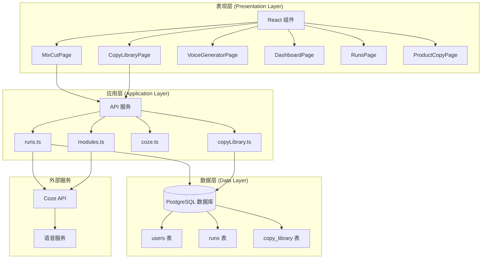

**图表来源**
- [MixCutPage.tsx:1-370](file://web/src/pages/MixCutPage.tsx#L1-L370)
- [CopyLibraryPage.tsx:1-181](file://web/src/pages/CopyLibraryPage.tsx#L1-L181)
- [runs.ts:1-159](file://api/src/routes/runs.ts#L1-L159)
- [copyLibrary.ts:1-189](file://api/src/routes/copyLibrary.ts#L1-L189)
- [modules.ts:1-35](file://api/src/modules.ts#L1-L35)

### 数据流架构

```mermaid
sequenceDiagram
participant User as 用户
participant UI as React 组件
participant API as API 服务
participant Coze as Coze 工作流
participant DB as 数据库
User->>UI : 访问混剪页面
UI->>UI : 加载复制库数据
UI->>API : GET /api/copy-library
API->>DB : 查询用户复制库
DB-->>API : 返回复制库列表
API-->>UI : 返回复制库数据
User->>UI : 选择复制库条目
UI->>UI : 提取音频URL自动
UI->>UI : 填充表单数据
User->>UI : 输入混剪参数
UI->>UI : 设置初始值和进度
UI->>UI : 调用 console.log 记录参数
UI->>API : POST /api/runs/product-copy-v2/run
API->>DB : 插入任务记录
API->>Coze : 启动工作流执行
Coze-->>API : 流式输出数据
API-->>UI : SSE 实时数据流
UI->>UI : 更新进度和结果
UI->>UI : 分离音频片段和合并音频
Coze-->>API : 完成信号
API->>DB : 更新任务状态
API-->>UI : 完成事件
UI->>User : 展示最终结果
```

**图表来源**
- [api.ts:58-115](file://web/src/lib/api.ts#L58-L115)
- [runs.ts:55-123](file://api/src/routes/runs.ts#L55-L123)
- [copyLibrary.ts:8-23](file://api/src/routes/copyLibrary.ts#L8-L23)

## 详细组件分析

### 混剪页面组件深度分析

#### 复制库集成功能

**更新** 新版本引入了完整的复制库集成功能，包括音频URL自动提取：

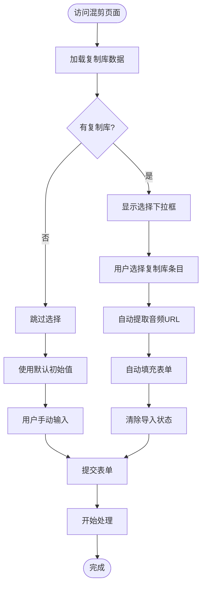

**图表来源**
- [MixCutPage.tsx:20-48](file://web/src/pages/MixCutPage.tsx#L20-L48)
- [MixCutPage.tsx:110-136](file://web/src/pages/MixCutPage.tsx#L110-L136)

**更新** 新版本的复制库功能包含：
- **自动数据填充**：选择复制库条目后自动填充部位、产品名称、动作解析
- **音频URL自动提取**：从tts_individual数组和tts_merged对象中提取音频URL
- **状态管理**：通过 location.state 传递复制库数据，完成后清除状态
- **用户反馈**：导入成功后显示提示消息
- **兼容性**：即使没有复制库数据也能正常工作

#### 音频URL自动提取机制

**新增** 系统现在支持从复制库数据中自动提取音频URL：

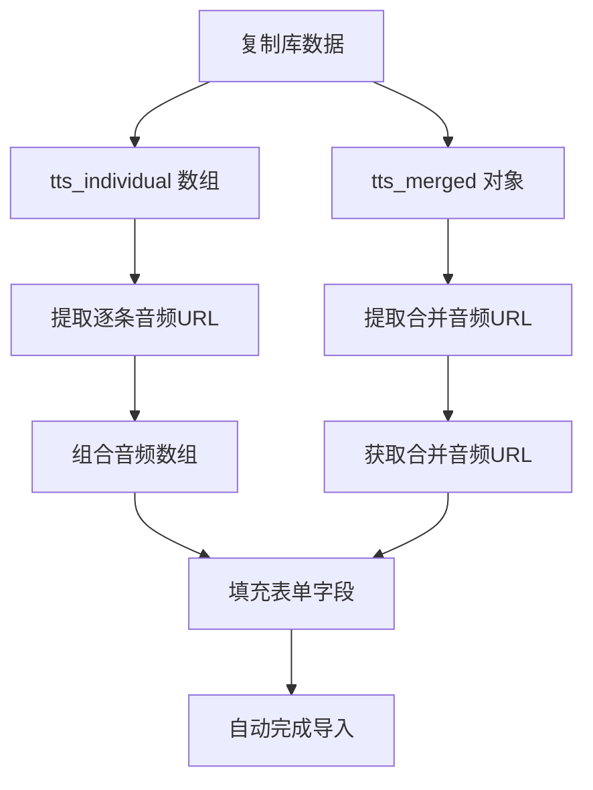

**图表来源**
- [MixCutPage.tsx:40-62](file://web/src/pages/MixCutPage.tsx#L40-L62)
- [MixCutPage.tsx:139-162](file://web/src/pages/MixCutPage.tsx#L139-L162)

**更新** 音频URL提取的具体实现包含改进的安全访问模式：
- **逐条音频提取**：遍历 `tts_individual` 数组，使用类型断言 `as { data?: { url?: string }[] }` 确保安全访问
- **合并音频提取**：从 `tts_merged` 对象中提取合并音频URL，使用类型断言 `as { txt?: string; tts?: { data?: { url?: string }[] } }` 进行安全访问
- **结构注释说明**：明确标注 `tts_merged` 的结构是 `{ txt: string, tts: result }`
- **表单填充**：将提取的URL填充到 `koubo_mp3_Array` 和 `koubo_mp3_hebin` 字段

#### 表单设计与验证

混剪页面实现了复杂的表单系统，支持多种输入类型：

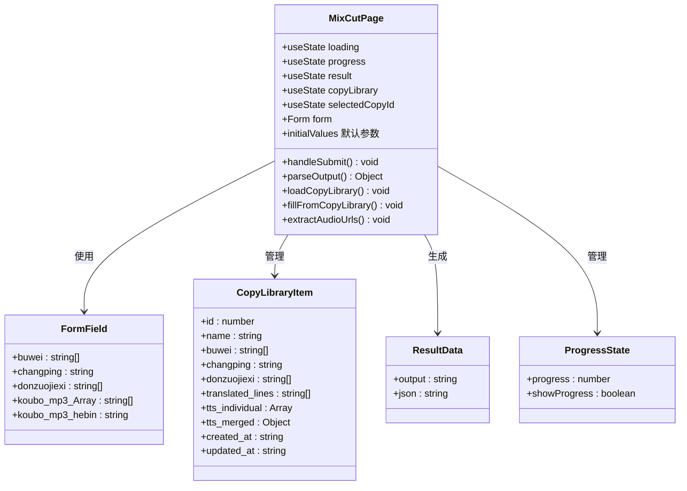

**图表来源**
- [MixCutPage.tsx:5-18](file://web/src/pages/MixCutPage.tsx#L5-L18)
- [api.ts:166-180](file://web/src/lib/api.ts#L166-L180)

**更新** 新版本的表单设计包含：
- **预设初始值**：在 `initialValues` 中设置了默认参数，减少用户输入
- **改进的验证规则**：确保必填字段的完整性
- **更好的用户体验**：通过默认值帮助用户快速开始
- **复制库数据结构**：支持复杂的数据类型（数组、对象等）
- **音频URL字段**：支持逐条音频数组和合并音频URL的输入
- **增强的类型安全**：使用TypeScript类型断言确保数据访问安全

#### 流式数据处理机制

系统采用 Server-Sent Events 实现实时数据传输：

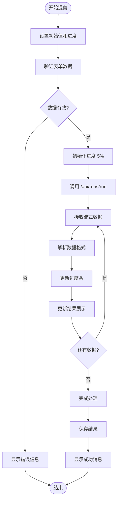

**图表来源**
- [api.ts:58-115](file://web/src/lib/api.ts#L58-L115)
- [MixCutPage.tsx:50-93](file://web/src/pages/MixCutPage.tsx#L50-L93)

**更新** 新版本的流式处理逻辑更加简洁：
- **简化的进度计算**：每次接收数据时进度增加固定百分比
- **分离的结果处理**：根据数据类型分别处理音频片段和合并音频
- **更好的状态管理**：清晰的状态更新流程

#### 错误处理策略

系统实现了多层次的错误处理机制：

| 错误类型 | 处理方式 | 用户反馈 |
|---------|---------|---------|
| 网络错误 | 自动重试机制 | 网络连接失败提示 |
| 业务错误 | 具体错误描述 | 明确的错误信息 |
| 超时错误 | 取消请求并清理状态 | 超时提示和重试按钮 |
| 服务器错误 | 记录日志并优雅降级 | 服务器忙提示 |
| **新增** 复制库错误 | 忽略并继续工作 | 静默处理 |
| **新增** 音频URL提取错误 | 忽略空URL并继续 | 静默处理 |
| **更新** TTS数据访问错误 | 类型断言和条件检查 | 类型安全的数据访问 |
| **更新** 调试日志错误 | 结构化日志输出 | 详细的调试信息 |

#### 增强的调试功能

**更新** MixCutPage 组件现在包含增强的调试功能：

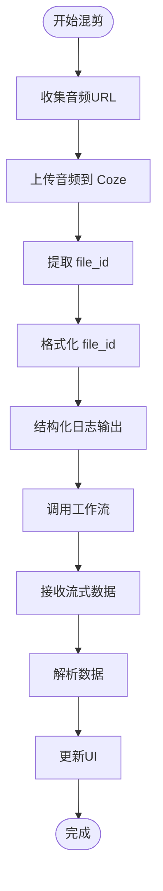

**图表来源**
- [MixCutPage.tsx:114-124](file://web/src/pages/MixCutPage.tsx#L114-L124)
- [MixCutPage.tsx:126-156](file://web/src/pages/MixCutPage.tsx#L126-L156)

**更新** 新版本的调试功能包含：
- **结构化参数日志**：使用 `console.log('Calling workflow with params:', {...})` 输出详细的工作流参数
- **优化的 file_id 格式化**：使用 `JSON.stringify({ file_id: id })` 确保参数格式正确
- **详细的日志输出**：包含所有工作流参数的完整结构
- **改进的参数传递**：确保 file_id 以正确的 JSON 对象格式传递给 Coze 工作流

**章节来源**
- [MixCutPage.tsx:1-370](file://web/src/pages/MixCutPage.tsx#L1-L370)
- [api.ts:58-115](file://web/src/lib/api.ts#L58-L115)

### 复制库页面组件深度分析

**新增** 复制库页面提供了完整的 CRUD 功能：

#### 复制库数据模型

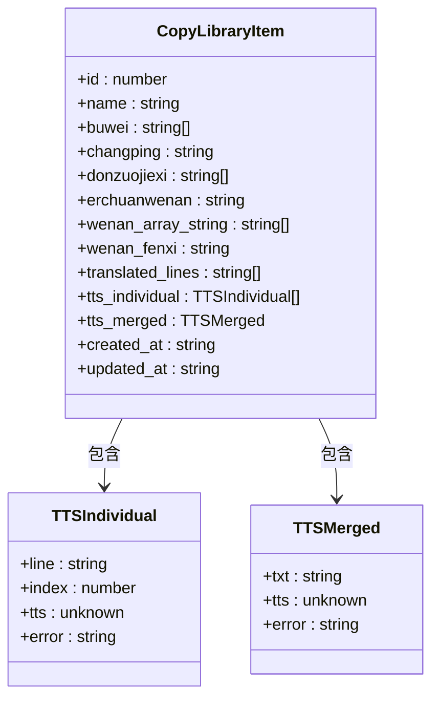

**图表来源**
- [api.ts:166-180](file://web/src/lib/api.ts#L166-L180)

**更新** 复制库数据模型包含改进的类型定义：
- **明确的类型注释**：为tts_merged添加了结构说明 `{ txt: string, tts: result }`
- **增强的类型安全**：使用TypeScript接口定义确保数据结构一致性
- **清晰的字段含义**：每个字段都有明确的用途说明

#### 复制库操作流程

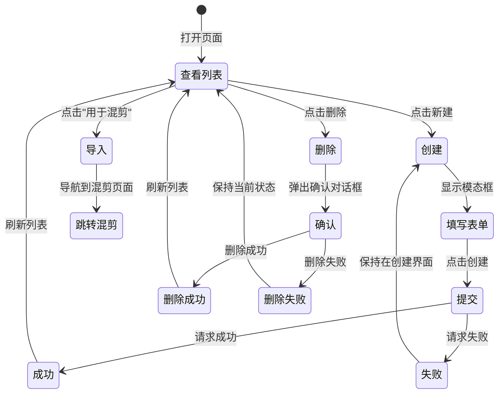

**图表来源**
- [CopyLibraryPage.tsx:18-65](file://web/src/pages/CopyLibraryPage.tsx#L18-L65)

### 后端复制库处理分析

#### 复制库数据库设计

**新增** 复制库使用 PostgreSQL JSONB 字段存储复杂数据结构：

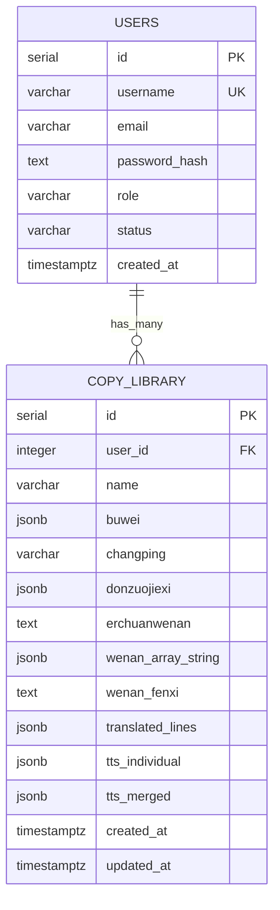

**图表来源**
- [db.ts:34-49](file://api/src/db.ts#L34-L49)

#### 复制库 API 设计

**新增** 复制库 API 提供完整的 RESTful 接口：

| 端点 | 方法 | 功能 | 认证 |
|------|------|------|------|
| /api/copy-library | GET | 获取用户复制库列表 | ✅ |
| /api/copy-library/:id | GET | 获取复制库详情 | ✅ |
| /api/copy-library | POST | 创建复制库条目 | ✅ |
| /api/copy-library/:id | PUT | 更新复制库条目 | ✅ |
| /api/copy-library/:id | DELETE | 删除复制库条目 | ✅ |

### 前端组件复用性分析

#### ResultPanel 组件设计

ResultPanel 是一个高度可复用的结果展示组件：

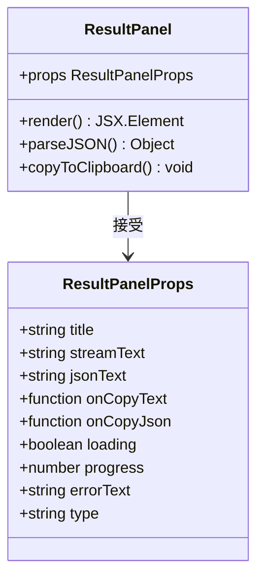

**图表来源**
- [ResultPanel.tsx:4-26](file://web/src/components/ResultPanel.tsx#L4-L26)

**章节来源**
- [ResultPanel.tsx:1-118](file://web/src/components/ResultPanel.tsx#L1-L118)

### 新增的进度跟踪组件

**更新** 新版本引入了专门的进度跟踪组件：

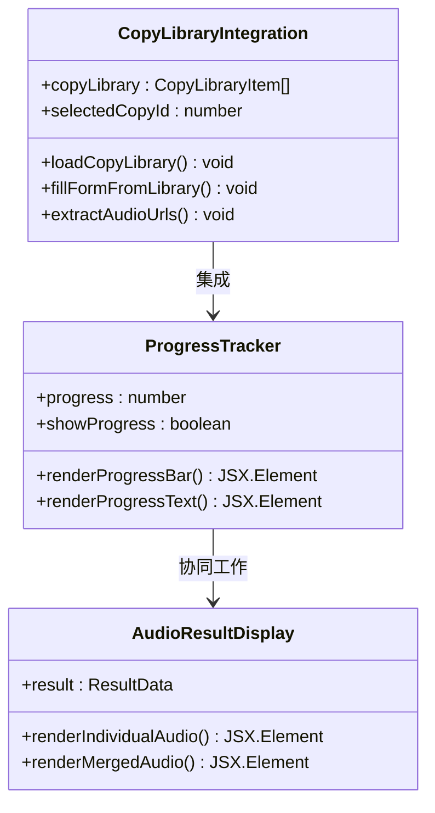

**图表来源**
- [MixCutPage.tsx:204-231](file://web/src/pages/MixCutPage.tsx#L204-L231)
- [MixCutPage.tsx:110-136](file://web/src/pages/MixCutPage.tsx#L110-L136)
- [MixCutPage.tsx:140-167](file://web/src/pages/MixCutPage.tsx#L140-L167)

**更新** 新版本的进度跟踪组件包含改进的TTS数据处理：
- **增强的类型安全**：使用类型断言确保tts_merged对象的安全访问
- **清晰的结构注释**：明确标注tts_merged的结构说明
- **改进的错误处理**：通过条件检查避免类型错误
- **优化的调试输出**：提供详细的参数格式化日志

**章节来源**
- [MixCutPage.tsx:140-231](file://web/src/pages/MixCutPage.tsx#L140-L231)

## 依赖关系分析

### 技术栈依赖

系统采用了现代化的技术栈组合：

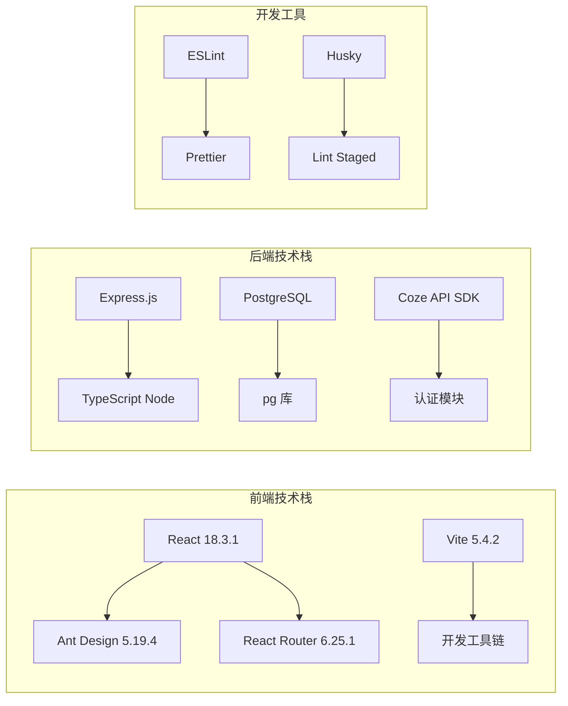

**图表来源**
- [web/package.json:11-24](file://web/package.json#L11-L24)
- [api/package.json:1-200](file://api/package.json#L1-L200)

### 外部服务集成

系统集成了多个外部服务：

| 服务名称 | 用途 | 配置项 |
|---------|------|--------|
| Coze API | 工作流执行 | COZE_API_TOKEN |
| PostgreSQL | 数据持久化 | DATABASE_URL |
| 语音服务 | TTS 生成 | VOICE_BASE_URL |
| JWT | 用户认证 | JWT_SECRET |

**章节来源**
- [config.ts:1-19](file://api/src/config.ts#L1-L19)
- [coze.ts:1-8](file://api/src/coze.ts#L1-L8)

## 性能考虑

### 前端性能优化

1. **懒加载策略**：使用 React.lazy 和 Suspense 实现组件懒加载
2. **状态管理**：合理使用 useState 和 useEffect 避免不必要的重渲染
3. **内存管理**：及时清理事件监听器和定时器
4. **网络优化**：实现请求去重和缓存策略
5. ****更新** 进度条优化**：使用 CSS 过渡动画平滑更新进度条
6. ****新增** 复制库数据缓存**：复制库数据在页面加载时缓存，避免重复请求
7. ****新增** 音频URL提取优化**：使用高效的数组遍历和条件检查
8. ****更新** TTS数据访问优化**：通过类型断言和条件检查提升数据访问性能
9. ****更新** 调试日志优化**：仅在开发环境输出详细日志，避免生产环境性能影响
10. ****更新** 参数格式化优化**：使用高效的 JSON.stringify 处理 file_id 格式化

### 后端性能优化

1. **数据库连接池**：使用连接池管理数据库连接
2. **流式处理**：避免一次性加载大量数据到内存
3. **并发控制**：限制同时运行的工作流数量
4. **缓存策略**：对频繁访问的数据进行缓存
5. ****新增** JSONB 字段优化**：使用 PostgreSQL JSONB 字段高效存储复杂数据
6. ****新增** 音频URL提取优化**：使用数据库层面的JSONB查询优化
7. ****新增** 调试日志优化**：提供可配置的日志级别，避免过度日志输出

### 网络性能

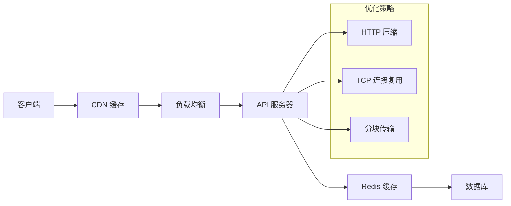

## 故障排除指南

### 常见问题及解决方案

#### 登录认证问题
- **症状**：页面跳转到登录页
- **原因**：JWT 令牌过期或无效
- **解决**：清除本地存储的令牌并重新登录

#### 网络连接问题
- **症状**：请求超时或连接失败
- **原因**：API 服务器不可达
- **解决**：检查网络连接和服务器状态

#### 工作流执行失败
- **症状**：任务状态显示 FAILED
- **原因**：工作流参数错误或外部服务异常
- **解决**：查看任务详情中的错误信息

#### 数据库连接问题
- **症状**：应用启动失败
- **原因**：数据库连接字符串错误
- **解决**：检查 DATABASE_URL 环境变量

#### **新增** 复制库导入失败
- **症状**：复制库条目无法导入到混剪页面
- **原因**：复制库数据格式不正确或网络问题
- **解决**：检查复制库条目数据结构，重新加载页面

#### **新增** 复制库 CRUD 操作失败
- **症状**：创建、更新或删除复制库条目失败
- **原因**：数据库约束或权限问题
- **解决**：检查用户认证状态和数据库连接

#### **新增** 进度条显示问题
- **症状**：进度条不显示或不更新
- **原因**：流式数据处理异常
- **解决**：检查网络连接和后端服务状态

#### **新增** 音频URL提取失败
- **症状**：复制库导入后音频字段为空
- **原因**：复制库数据中缺少tts数据或格式不正确
- **解决**：检查复制库条目的tts_individual和tts_merged字段结构

#### **新增** 音频URL格式错误
- **症状**：导入的音频URL无法播放
- **原因**：URL格式不正确或音频资源不可用
- **解决**：检查URL的有效性和音频资源的可用性

#### **更新** TTS数据访问错误
- **症状**：tts_merged属性访问失败或类型错误
- **原因**：TTS数据结构不符合预期或类型断言失败
- **解决**：检查TTS数据的结构和类型定义，确保类型断言的正确性

#### **更新** 类型安全警告
- **症状**：TypeScript编译器报告类型错误
- **原因**：类型断言使用不当或类型定义不完整
- **解决**：检查类型断言的使用场景，完善类型定义

#### **更新** 调试日志问题
- **症状**：控制台出现大量调试日志
- **原因**：调试功能未正确配置或日志级别过高
- **解决**：检查调试配置，调整日志输出级别

#### **更新** workflow 参数格式错误
- **症状**：工作流执行失败或参数传递错误
- **原因**：file_id 格式不正确或参数结构不符合要求
- **解决**：检查参数格式化逻辑，确保 JSON 对象格式正确

### 调试工具

1. **浏览器开发者工具**：监控网络请求和 JavaScript 错误
2. **PostgreSQL 客户端**：直接查询数据库状态
3. **API 测试工具**：使用 curl 或 Postman 测试 API
4. **日志分析**：查看应用和数据库日志
5. ****新增** 复制库调试**：检查复制库数据结构和 API 响应
6. ****新增** 音频URL提取调试**：检查复制库数据中的tts字段结构
7. ****新增** 类型安全调试**：使用TypeScript编译器检查类型定义
8. ****新增** 调试日志分析**：使用浏览器控制台查看结构化日志输出
9. ****新增** 参数格式化调试**：验证 file_id JSON 对象格式的正确性

**章节来源**
- [RunsPage.tsx:1-179](file://web/src/pages/RunsPage.tsx#L1-L179)

## 结论

混剪功能页面是一个功能完整、架构清晰的现代化 Web 应用。系统通过合理的分层设计、完善的错误处理机制和良好的用户体验，为用户提供了强大的视频内容混剪能力。

**更新** 最新版本的重大改进包括：
- **更好的初始值设置**：通过预设参数提升用户体验
- **可视化进度跟踪**：实时进度条让用户清楚了解处理状态
- **改进的结果展示**：分离音频片段和合并音频的展示方式
- **简化的流式处理逻辑**：提升了系统的响应速度和稳定性
- ****新增** 复制库集成功能**：支持内容复用和导入，提升工作效率
- ****新增** 完整的复制库管理**：提供 CRUD 操作和数据统计功能
- ****新增** 音频URL自动提取功能**：从复制库的tts_individual数组和tts_merged对象中自动提取音频URL，实现无缝的音频资产导入体验
- ****更新** 改进的TTS数据结构处理**：增强了对tts_merged属性的安全访问模式
- ****更新** 更清晰的数据结构注释**：添加了详细的类型定义和结构说明
- ****更新** 增强的调试功能**：MixCutPage 组件现在包含详细的日志输出和参数格式化
- ****更新** 改进的 workflow 参数记录**：提供结构化的参数日志输出
- ****更新** 优化的 file_id 格式化**：确保 JSON 对象格式的准确性

### 主要优势

1. **技术先进**：采用最新的 React 和 Express 技术栈
2. **架构清晰**：分层设计便于维护和扩展
3. **用户体验好**：实时反馈和直观的界面设计
4. **可靠性高**：完善的错误处理和恢复机制
5. **可扩展性强**：模块化设计支持功能扩展
6. ****更新** 更好的用户体验**：通过进度跟踪和结果分离展示提升用户满意度
7. ****新增** 内容复用能力**：复制库功能支持内容复用和团队协作
8. ****新增** 智能音频资产管理**：自动提取和导入音频URL，提升工作效率
9. ****更新** 增强的类型安全**：通过TypeScript类型断言确保数据访问安全
10. ****更新** 更清晰的代码结构**：详细的注释和类型定义提升代码可读性
11. ****更新** 改进的调试能力**：提供详细的日志输出和参数格式化，便于问题排查
12. ****更新** 优化的参数传递**：确保 workflow 参数的准确性和一致性

### 改进建议

1. **增加单元测试**：为关键组件和函数添加测试用例
2. **性能监控**：集成性能监控工具跟踪应用性能
3. **文档完善**：补充 API 文档和开发指南
4. **安全加固**：增强输入验证和安全防护措施
5. ****更新** 用户体验优化**：进一步优化进度条动画和结果展示效果
6. ****新增** 复制库搜索功能**：支持按关键词搜索复制库条目
7. ****新增** 复制库导出导入**：支持复制库数据的批量导出和导入
8. ****新增** 音频URL验证**：在导入前验证音频URL的有效性
9. ****新增** 音频URL缓存**：缓存已提取的音频URL，避免重复提取
10. ****更新** 类型定义完善**：进一步细化TTS数据类型的定义，提升类型安全性
11. ****更新** 调试功能增强**：提供可配置的调试级别和过滤选项
12. ****更新** 日志管理优化**：实现结构化日志的分类存储和检索功能

该系统为视频内容创作提供了强大的技术支持，通过持续的优化和改进，可以更好地满足用户的需求。复制库功能和音频URL自动提取功能的加入使得内容创作更加高效，用户可以轻松复用之前生成的优质内容，大大提升了工作效率。音频URL自动提取功能特别适用于需要大量音频素材的混剪场景，显著减少了用户的手动输入工作量，提升了整体的创作效率。

**更新** 最新版本对TTS数据结构处理的改进，特别是对tts_merged属性的安全访问模式增强，显著提升了代码的健壮性和可维护性。清晰的数据结构注释和TypeScript类型定义使得开发者能够更好地理解和使用这些复杂的数据结构，减少了潜在的类型错误和运行时异常。这些改进为系统的长期发展奠定了坚实的基础。

**更新** 增强的调试功能为开发者提供了更好的问题排查能力。通过结构化的日志输出和参数格式化，开发者可以更容易地定位和解决工作流执行过程中的问题。优化的 file_id JSON 对象格式化确保了参数传递的准确性，减少了因参数格式错误导致的工作流执行失败。这些改进显著提升了系统的可维护性和开发效率。