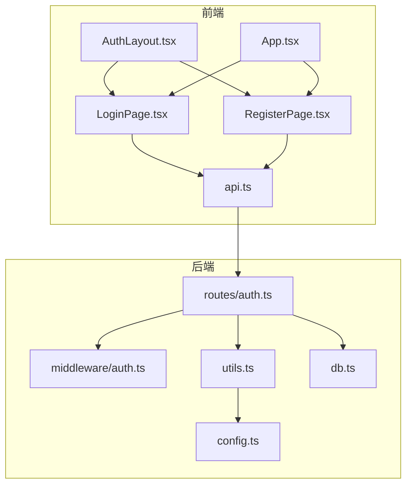
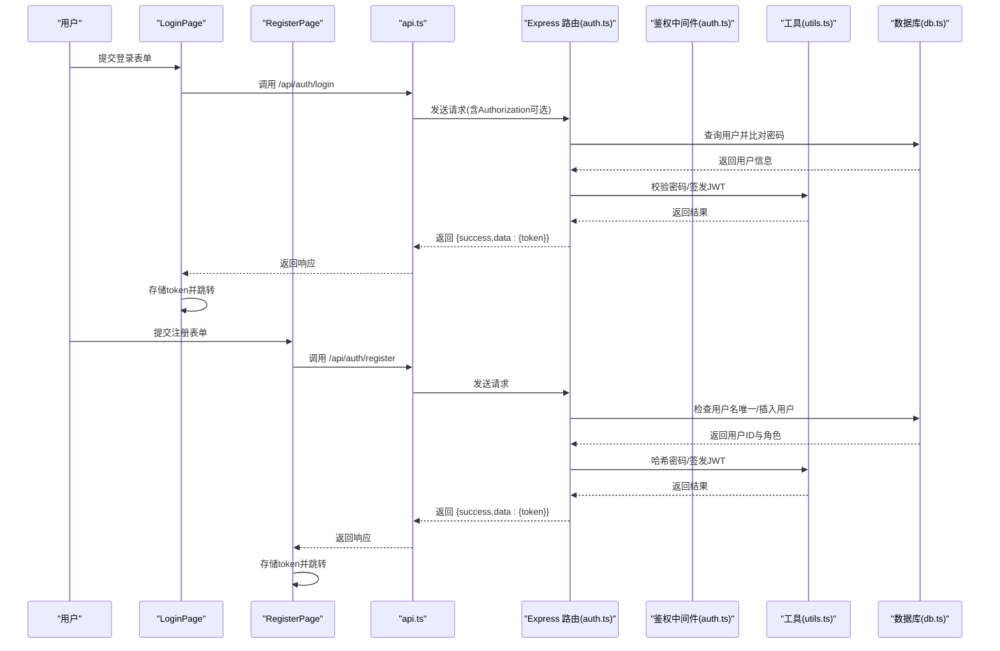
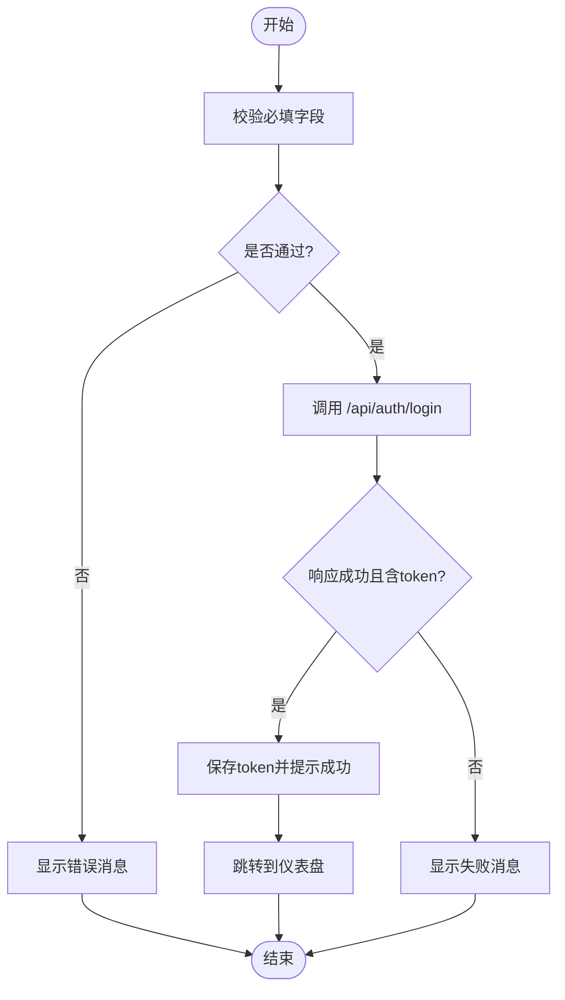
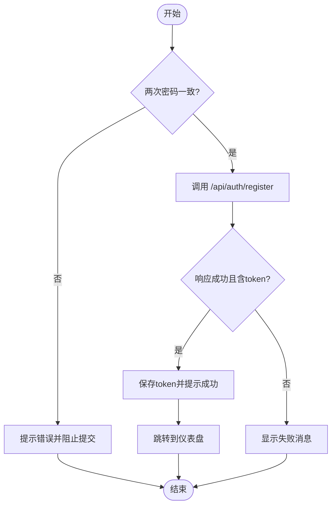
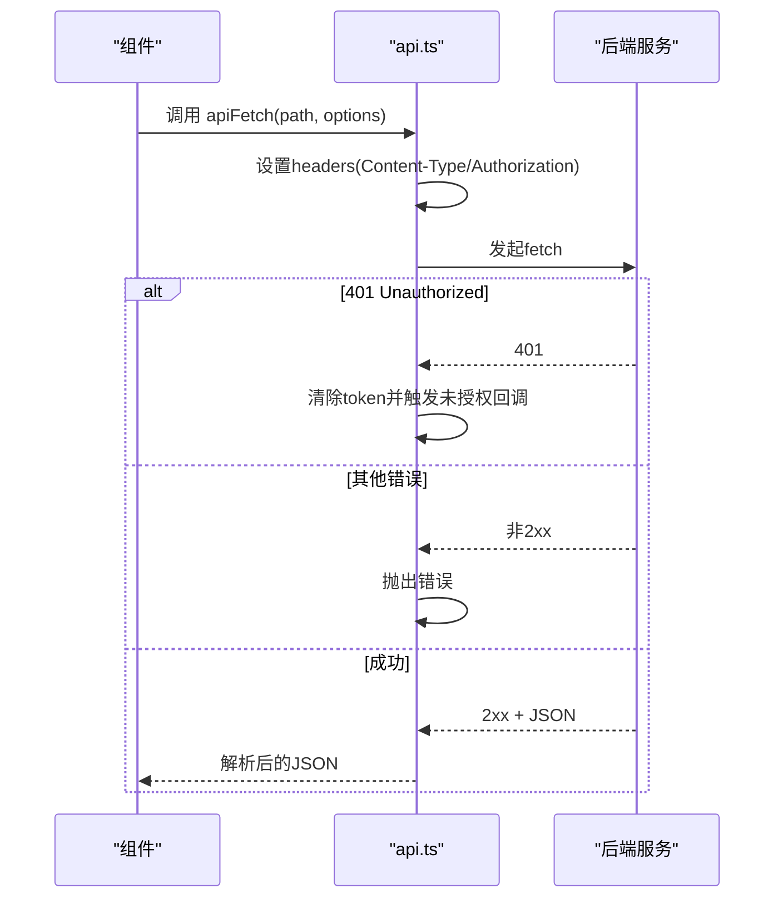
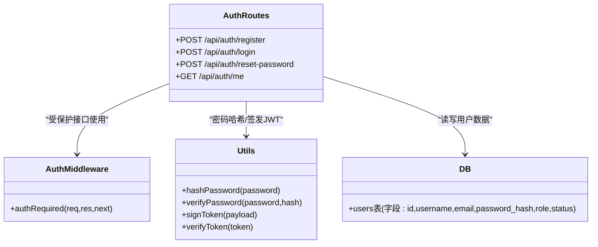
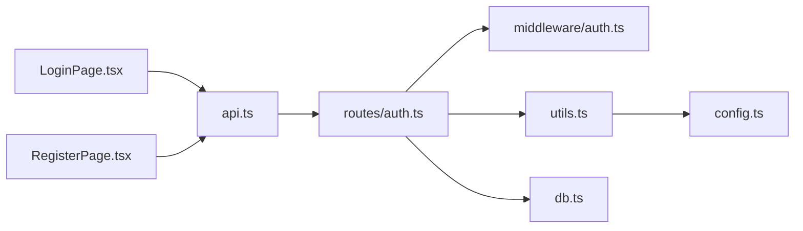

# 认证页面

<cite>
**本文引用的文件**
- [LoginPage.tsx](file://web/src/pages/LoginPage.tsx)
- [RegisterPage.tsx](file://web/src/pages/RegisterPage.tsx)
- [AuthLayout.tsx](file://web/src/layouts/AuthLayout.tsx)
- [api.ts](file://web/src/lib/api.ts)
- [auth.ts](file://api/src/routes/auth.ts)
- [auth.ts](file://api/src/middleware/auth.ts)
- [utils.ts](file://api/src/utils.ts)
- [db.ts](file://api/src/db.ts)
- [config.ts](file://api/src/config.ts)
- [App.tsx](file://web/src/App.tsx)
</cite>

## 目录
1. [简介](#简介)
2. [项目结构](#项目结构)
3. [核心组件](#核心组件)
4. [架构总览](#架构总览)
5. [详细组件分析](#详细组件分析)
6. [依赖关系分析](#依赖关系分析)
7. [性能考虑](#性能考虑)
8. [故障排查指南](#故障排查指南)
9. [结论](#结论)
10. [附录](#附录)

## 简介
本文件面向认证页面组，系统性梳理登录与注册页面的表单设计、字段验证规则、错误处理机制、表单提交流程、API 调用时机与响应处理，并给出用户体验优化建议、加载状态显示方案、成功/失败反馈机制、验证规则定制、国际化支持以及安全最佳实践。认证体系由前端 React 页面与后端 Express 接口共同组成，采用 JWT 令牌进行身份校验与持久化。

## 项目结构
认证相关代码主要分布在以下位置：
- 前端页面：web/src/pages/LoginPage.tsx、web/src/pages/RegisterPage.tsx
- 认证布局：web/src/layouts/AuthLayout.tsx
- API 封装：web/src/lib/api.ts
- 路由与中间件：api/src/routes/auth.ts、api/src/middleware/auth.ts
- 工具函数：api/src/utils.ts
- 数据库与配置：api/src/db.ts、api/src/config.ts
- 应用路由与鉴权守卫：web/src/App.tsx

图表来源
- [LoginPage.tsx:1-136](file://web/src/pages/LoginPage.tsx#L1-L136)
- [RegisterPage.tsx:1-87](file://web/src/pages/RegisterPage.tsx#L1-L87)
- [AuthLayout.tsx:1-21](file://web/src/layouts/AuthLayout.tsx#L1-L21)
- [api.ts:1-160](file://web/src/lib/api.ts#L1-L160)
- [auth.ts:1-115](file://api/src/routes/auth.ts#L1-L115)
- [auth.ts:1-23](file://api/src/middleware/auth.ts#L1-L23)
- [utils.ts:1-21](file://api/src/utils.ts#L1-L21)
- [db.ts:1-35](file://api/src/db.ts#L1-L35)
- [config.ts:1-19](file://api/src/config.ts#L1-L19)
- [App.tsx:1-70](file://web/src/App.tsx#L1-L70)

章节来源
- [LoginPage.tsx:1-136](file://web/src/pages/LoginPage.tsx#L1-L136)
- [RegisterPage.tsx:1-87](file://web/src/pages/RegisterPage.tsx#L1-L87)
- [AuthLayout.tsx:1-21](file://web/src/layouts/AuthLayout.tsx#L1-L21)
- [api.ts:1-160](file://web/src/lib/api.ts#L1-L160)
- [auth.ts:1-115](file://api/src/routes/auth.ts#L1-L115)
- [auth.ts:1-23](file://api/src/middleware/auth.ts#L1-L23)
- [utils.ts:1-21](file://api/src/utils.ts#L1-L21)
- [db.ts:1-35](file://api/src/db.ts#L1-L35)
- [config.ts:1-19](file://api/src/config.ts#L1-L19)
- [App.tsx:1-70](file://web/src/App.tsx#L1-L70)

## 核心组件
- 登录页 LoginPage：负责账号密码登录、忘记密码弹窗重置密码、表单字段必填校验、错误提示与跳转。
- 注册页 RegisterPage：负责账号、邮箱、密码与确认密码收集，前后端一致性校验、错误提示与跳转。
- 认证布局 AuthLayout：统一认证页面样式与文案。
- API 封装 api.ts：统一封装 fetch 请求、自动注入 Authorization 头、401 统一处理、令牌存储与清理。
- 后端路由 auth.ts：提供注册、登录、重置密码、当前用户查询等接口。
- 鉴权中间件 auth.ts：解析 Authorization 头，校验 JWT 并注入用户信息。
- 工具函数 utils.ts：密码哈希、比对与 JWT 签发/校验。
- 数据库与配置 db.ts、config.ts：用户表结构定义与环境变量校验。
- 应用路由 App.tsx：全局鉴权守卫、未授权处理回调、进入应用时的会话校验。

章节来源
- [LoginPage.tsx:17-136](file://web/src/pages/LoginPage.tsx#L17-L136)
- [RegisterPage.tsx:11-87](file://web/src/pages/RegisterPage.tsx#L11-L87)
- [AuthLayout.tsx:4-21](file://web/src/layouts/AuthLayout.tsx#L4-L21)
- [api.ts:9-36](file://web/src/lib/api.ts#L9-L36)
- [auth.ts:8-98](file://api/src/routes/auth.ts#L8-L98)
- [auth.ts:8-22](file://api/src/middleware/auth.ts#L8-L22)
- [utils.ts:5-20](file://api/src/utils.ts#L5-L20)
- [db.ts:10-34](file://api/src/db.ts#L10-L34)
- [config.ts:13-19](file://api/src/config.ts#L13-L19)
- [App.tsx:17-39](file://web/src/App.tsx#L17-L39)

## 架构总览
前端通过 api.ts 发起请求，自动携带 Authorization 头；后端路由根据请求体参数执行业务逻辑，返回统一格式的响应；鉴权中间件确保受保护接口的安全访问；数据库层提供用户数据存储与查询。

图表来源
- [LoginPage.tsx:22-38](file://web/src/pages/LoginPage.tsx#L22-L38)
- [RegisterPage.tsx:19-44](file://web/src/pages/RegisterPage.tsx#L19-L44)
- [api.ts:13-36](file://web/src/lib/api.ts#L13-L36)
- [auth.ts:8-34](file://api/src/routes/auth.ts#L8-L34)
- [auth.ts:8-22](file://api/src/middleware/auth.ts#L8-L22)
- [utils.ts:5-20](file://api/src/utils.ts#L5-L20)
- [db.ts:12-32](file://api/src/db.ts#L12-L32)

## 详细组件分析

### 登录页面 LoginPage
- 表单字段与验证
  - 账号：必填，用于登录凭证识别。
  - 密码：必填，明文传输至后端进行校验。
  - 忘记密码：打开 Modal 弹窗，包含账号、新密码、确认新密码三字段，其中新密码与确认新密码需一致。
- 错误处理
  - 登录失败：显示错误消息，不跳转。
  - 重置密码失败：显示错误消息，保持弹窗。
  - 通用异常：捕获错误并提示。
- 成功反馈与跳转
  - 登录成功：保存 token，提示成功，跳转到仪表盘。
  - 重置密码成功：提示成功，关闭弹窗并清空表单。
- 用户体验
  - 使用 Ant Design 的 Form/Item/Modal/Message 组件，提供即时反馈。
  - 提供“去注册”、“忘记密码？”链接，改善导航体验。

图表来源
- [LoginPage.tsx:22-38](file://web/src/pages/LoginPage.tsx#L22-L38)

章节来源
- [LoginPage.tsx:17-136](file://web/src/pages/LoginPage.tsx#L17-L136)

### 注册页面 RegisterPage
- 表单字段与验证
  - 账号：必填，作为唯一标识。
  - 邮箱：必填，用于联系与后续功能扩展。
  - 密码：必填，前端提示至少 6 位。
  - 确认密码：必填，与密码字段联动校验。
- 错误处理
  - 前端一致性校验：若两次密码不一致，提示错误并阻止提交。
  - 后端错误：账号已存在、缺少必填字段等，返回相应错误消息。
- 成功反馈与跳转
  - 注册成功：保存 token，提示成功，跳转到仪表盘。
- 用户体验
  - 使用 Ant Design 的 Form/Item/Button/Link 组件，提供清晰的标签与占位符。

图表来源
- [RegisterPage.tsx:19-44](file://web/src/pages/RegisterPage.tsx#L19-L44)

章节来源
- [RegisterPage.tsx:11-87](file://web/src/pages/RegisterPage.tsx#L11-L87)

### 认证布局 AuthLayout
- 统一卡片容器与标题文案，承载登录/注册页面内容。
- 提供简短的引导说明，增强首次访问体验。

章节来源
- [AuthLayout.tsx:4-21](file://web/src/layouts/AuthLayout.tsx#L4-L21)

### API 封装 api.ts
- 统一请求入口：自动设置 Content-Type 为 application/json，并在存在 token 时附加 Authorization 头。
- 401 统一处理：当后端返回 401 时，清除本地 token 并触发未授权回调。
- 响应处理：非 2xx 抛出错误；成功时解析 JSON。
- 其他能力：提供文件上传、流式运行等辅助方法（与认证相关但非核心）。

图表来源
- [api.ts:13-36](file://web/src/lib/api.ts#L13-L36)

章节来源
- [api.ts:1-160](file://web/src/lib/api.ts#L1-L160)

### 后端路由与鉴权 auth.ts
- 注册接口
  - 校验必填字段；检查用户名唯一；哈希密码；写入用户表；签发 JWT。
- 登录接口
  - 校验必填字段；按用户名查询用户；比对密码；签发 JWT。
- 重置密码接口
  - 需要登录态；支持管理员重置他人密码；校验权限；更新密码哈希。
- 当前用户接口
  - 校验登录态并返回用户信息。
- 鉴权中间件
  - 从 Authorization 头提取 Bearer Token；校验 JWT；注入用户信息到请求对象。

图表来源
- [auth.ts:8-98](file://api/src/routes/auth.ts#L8-L98)
- [auth.ts:8-22](file://api/src/middleware/auth.ts#L8-L22)
- [utils.ts:5-20](file://api/src/utils.ts#L5-L20)
- [db.ts:12-20](file://api/src/db.ts#L12-L20)

章节来源
- [auth.ts:1-115](file://api/src/routes/auth.ts#L1-L115)
- [auth.ts:1-23](file://api/src/middleware/auth.ts#L1-L23)
- [utils.ts:1-21](file://api/src/utils.ts#L1-L21)
- [db.ts:1-35](file://api/src/db.ts#L1-L35)

### 应用路由与鉴权守卫 App.tsx
- 全局未授权处理：当收到 401 或会话校验失败时，清除 token 并跳转到登录页。
- 进入应用时的会话校验：若存在 token，则主动调用 /api/auth/me 校验有效性。

章节来源
- [App.tsx:17-39](file://web/src/App.tsx#L17-L39)

## 依赖关系分析
- 前端页面依赖 api.ts 进行网络请求与令牌管理。
- api.ts 依赖后端路由 auth.ts 提供的接口。
- 后端路由 auth.ts 依赖鉴权中间件 auth.ts、工具函数 utils.ts 与数据库 db.ts。
- 配置 config.ts 提供 JWT Secret、数据库连接等关键配置。

图表来源
- [LoginPage.tsx:1-10](file://web/src/pages/LoginPage.tsx#L1-L10)
- [RegisterPage.tsx:1-4](file://web/src/pages/RegisterPage.tsx#L1-L4)
- [api.ts:1-160](file://web/src/lib/api.ts#L1-L160)
- [auth.ts:1-115](file://api/src/routes/auth.ts#L1-L115)
- [auth.ts:1-23](file://api/src/middleware/auth.ts#L1-L23)
- [utils.ts:1-21](file://api/src/utils.ts#L1-L21)
- [db.ts:1-35](file://api/src/db.ts#L1-L35)
- [config.ts:1-19](file://api/src/config.ts#L1-L19)

章节来源
- [LoginPage.tsx:1-10](file://web/src/pages/LoginPage.tsx#L1-L10)
- [RegisterPage.tsx:1-4](file://web/src/pages/RegisterPage.tsx#L1-L4)
- [api.ts:1-160](file://web/src/lib/api.ts#L1-L160)
- [auth.ts:1-115](file://api/src/routes/auth.ts#L1-L115)
- [auth.ts:1-23](file://api/src/middleware/auth.ts#L1-L23)
- [utils.ts:1-21](file://api/src/utils.ts#L1-L21)
- [db.ts:1-35](file://api/src/db.ts#L1-L35)
- [config.ts:1-19](file://api/src/config.ts#L1-L19)

## 性能考虑
- 减少不必要的重渲染：登录/注册表单使用受控组件，避免在输入过程中触发额外计算。
- 请求合并与节流：在高频输入场景下，可考虑防抖策略（如输入框变更时的实时校验），但当前实现以必填校验为主，无需复杂节流。
- 缓存与本地存储：token 存储于 localStorage，注意跨站脚本攻击风险，建议结合 HttpOnly Cookie 与 SameSite 属性（见安全最佳实践）。
- 网络层优化：api.ts 已统一设置 Content-Type 与 Authorization，减少重复设置开销。

[本节为通用指导，不直接分析具体文件]

## 故障排查指南
- 登录失败
  - 检查账号/密码是否正确；确认后端接口返回的消息。
  - 查看浏览器 Network 面板，确认请求头 Authorization 是否正确。
- 注册失败
  - 确认用户名唯一性；检查邮箱格式与必填项。
  - 查看后端返回的错误码与消息（如 409 账号已存在）。
- 重置密码失败
  - 确认当前登录用户是否有权限重置他人密码；检查新密码与确认密码是否一致。
- 401 未授权
  - 检查本地 token 是否过期或被篡改；确认鉴权中间件是否正常校验 JWT。
- 会话校验失败
  - 应用启动时会主动调用 /api/auth/me 校验 token；若失败则自动跳转登录页。

章节来源
- [LoginPage.tsx:22-66](file://web/src/pages/LoginPage.tsx#L22-L66)
- [RegisterPage.tsx:19-44](file://web/src/pages/RegisterPage.tsx#L19-L44)
- [api.ts:25-36](file://web/src/lib/api.ts#L25-L36)
- [auth.ts:42-62](file://api/src/routes/auth.ts#L42-L62)
- [auth.ts:81-97](file://api/src/routes/auth.ts#L81-L97)
- [App.tsx:35-38](file://web/src/App.tsx#L35-L38)

## 结论
该认证体系采用前后端分离架构，前端通过 Ant Design 表单与 api.ts 统一封装请求，后端基于 Express 实现 REST 接口与 JWT 鉴权。登录与注册页面具备基础的必填校验与错误反馈，配合全局未授权处理与会话校验，形成完整的认证闭环。后续可在密码强度、国际化、加载状态与安全加固方面进一步优化。

[本节为总结性内容，不直接分析具体文件]

## 附录

### 表单验证规则与定制建议
- 必填字段：账号、密码、邮箱、确认密码均需必填。
- 密码一致性：注册页与重置密码弹窗均需二次确认一致。
- 密码强度：当前前端仅提示至少 6 位，建议增加长度、字符类型（大小写、数字、特殊字符）与历史密码策略（后端实现）。
- 自定义规则：可在 Form.Item 的 rules 中添加自定义 validator，结合后端返回的细粒度错误码进行本地提示。

章节来源
- [LoginPage.tsx:70-131](file://web/src/pages/LoginPage.tsx#L70-L131)
- [RegisterPage.tsx:47-83](file://web/src/pages/RegisterPage.tsx#L47-L83)

### 国际化支持建议
- 文案与错误消息：将所有文案抽取到 i18n 资源文件，使用框架提供的国际化能力切换语言。
- 时间与数字格式：统一日期与数字格式，便于多语言环境展示。
- 右到左语言适配：为 RTL 语言预留布局与文本方向支持。

[本节为通用指导，不直接分析具体文件]

### 安全最佳实践
- 传输安全：强制 HTTPS，避免明文传输敏感信息。
- 令牌存储：localStorage 易受 XSS 攻击，建议迁移到 HttpOnly Cookie 并启用 SameSite=Lax|Strict。
- CSRF 防护：为表单提交增加 CSRF Token，后端校验。
- 输入净化：后端严格校验与清洗输入，防止 SQL 注入与命令注入。
- 最小权限：重置密码接口仅允许本人或管理员操作，并记录审计日志。
- 日志与监控：记录认证事件与异常，设置告警阈值。

[本节为通用指导，不直接分析具体文件]