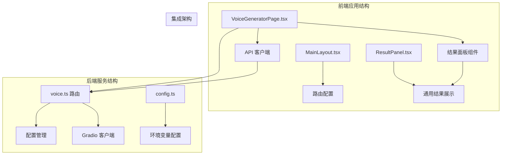
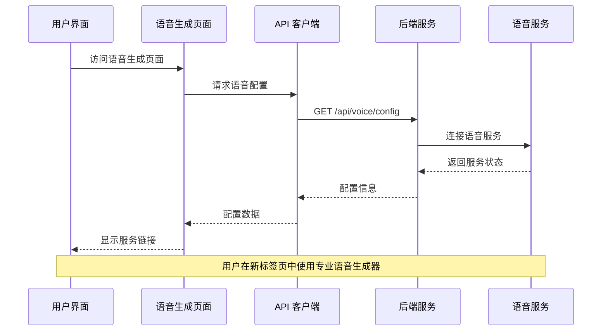
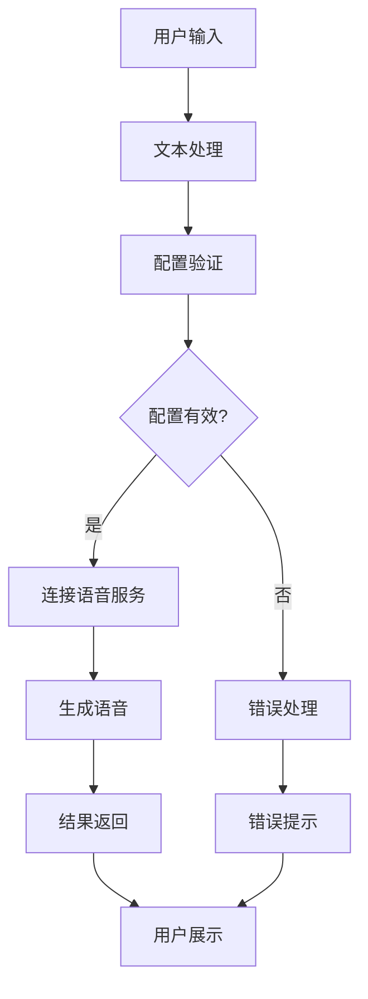
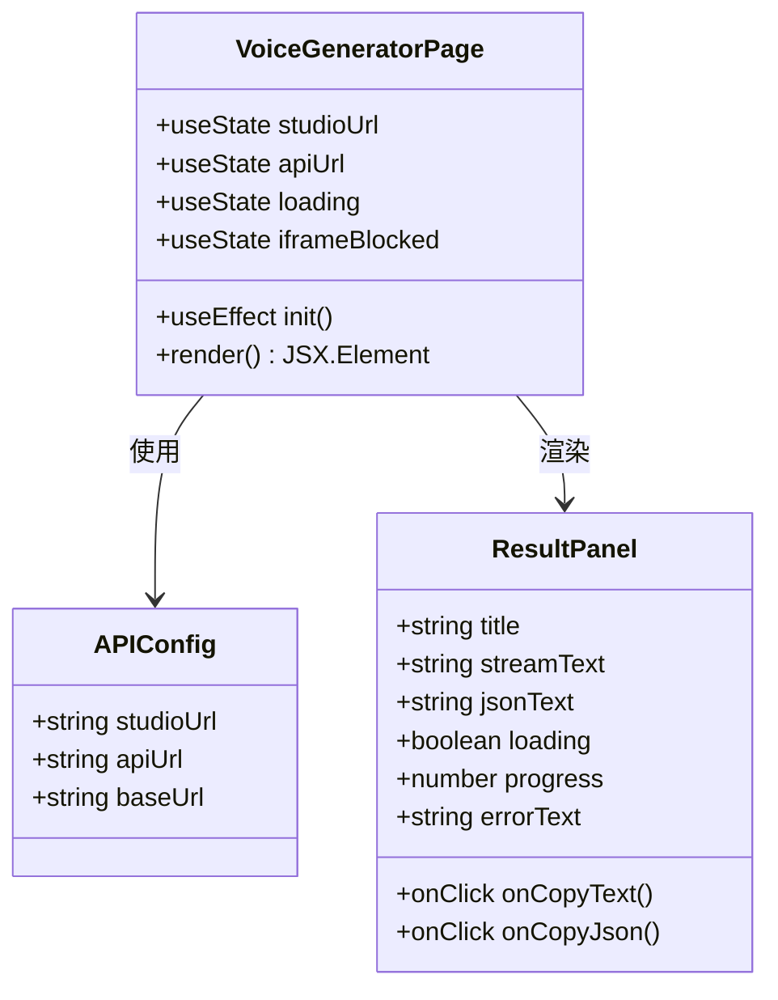
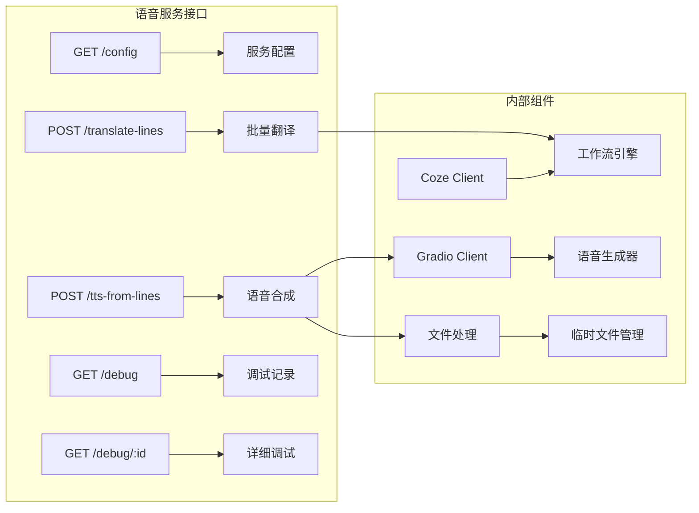
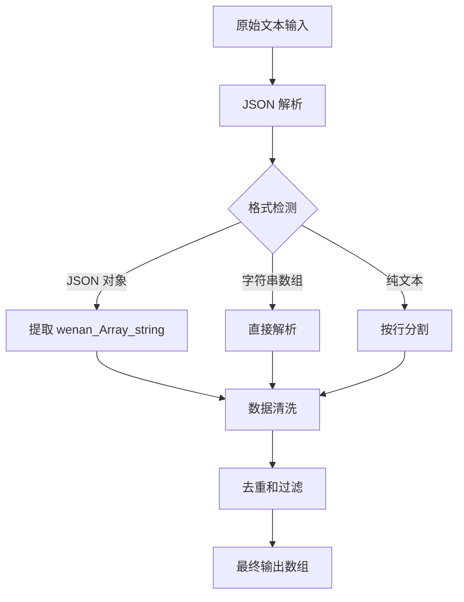
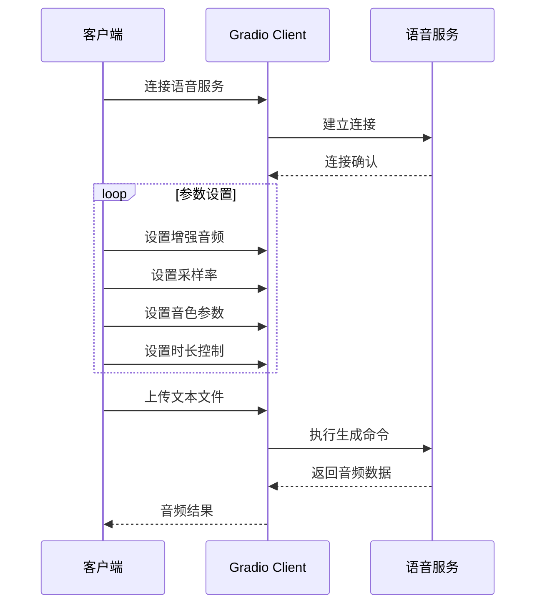
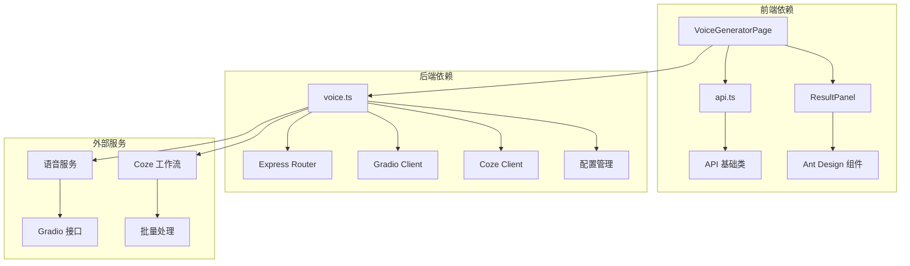

# 语音生成页面

<cite>
**本文档引用的文件**
- [VoiceGeneratorPage.tsx](file://web/src/pages/VoiceGeneratorPage.tsx)
- [voice.ts](file://api/src/routes/voice.ts)
- [api.ts](file://web/src/lib/api.ts)
- [config.ts](file://api/src/config.ts)
- [MainLayout.tsx](file://web/src/layouts/MainLayout.tsx)
- [App.tsx](file://web/src/App.tsx)
- [ResultPanel.tsx](file://web/src/components/ResultPanel.tsx)
- [ProductCopyPage.tsx](file://web/src/pages/ProductCopyPage.tsx)
</cite>

## 目录
1. [简介](#简介)
2. [项目结构](#项目结构)
3. [核心组件](#核心组件)
4. [架构概览](#架构概览)
5. [详细组件分析](#详细组件分析)
6. [依赖关系分析](#依赖关系分析)
7. [性能考虑](#性能考虑)
8. [故障排除指南](#故障排除指南)
9. [结论](#结论)

## 简介

语音生成页面是基于 Gradio 架构的语音合成服务集成界面，通过局域网统一调用语音服务器算力，为用户提供专业的语音生成解决方案。该页面集成了完整的语音生成工作流程，包括文本输入处理、参数配置、实时反馈、进度显示和错误处理等功能。

系统采用前后端分离架构，前端负责用户界面交互和状态管理，后端提供语音服务配置和数据处理能力。通过 iframe 嵌入的方式，用户可以在同一界面中访问专业的语音生成工具。

## 项目结构

语音生成页面位于 Web 前端项目中，采用模块化组织方式：

**图表来源**
- [VoiceGeneratorPage.tsx:1-95](file://web/src/pages/VoiceGeneratorPage.tsx#L1-L95)
- [voice.ts:1-86](file://api/src/routes/voice.ts#L1-L86)
- [MainLayout.tsx:1-65](file://web/src/layouts/MainLayout.tsx#L1-L65)

**章节来源**
- [VoiceGeneratorPage.tsx:1-95](file://web/src/pages/VoiceGeneratorPage.tsx#L1-L95)
- [MainLayout.tsx:26-34](file://web/src/layouts/MainLayout.tsx#L26-L34)

## 核心组件

### 语音生成页面组件

语音生成页面是一个 React 组件，主要负责以下功能：

- **配置加载**：通过 API 获取语音服务配置信息
- **界面展示**：提供服务地址链接和预览区域
- **状态管理**：处理加载状态和错误状态
- **用户体验**：提供新标签页打开和 API 文档访问

### API 集成层

API 客户端提供了与后端服务通信的能力：

- **认证处理**：自动添加 Bearer Token
- **错误处理**：统一的 HTTP 错误处理机制
- **配置获取**：专门的语音配置获取方法
- **流式处理**：支持 SSE 流式数据传输

### 结果面板组件

结果面板提供了标准化的结果展示界面：

- **文本复制**：一键复制生成的文本内容
- **JSON 处理**：支持 JSON 格式结果的展示和复制
- **进度指示**：实时显示处理进度
- **状态反馈**：错误状态的可视化提示

**章节来源**
- [api.ts:13-36](file://web/src/lib/api.ts#L13-L36)
- [ResultPanel.tsx:14-43](file://web/src/components/ResultPanel.tsx#L14-L43)

## 架构概览

系统采用三层架构设计，实现了前后端的清晰分离：

**图表来源**
- [VoiceGeneratorPage.tsx:11-26](file://web/src/pages/VoiceGeneratorPage.tsx#L11-L26)
- [api.ts:117-126](file://web/src/lib/api.ts#L117-L126)
- [voice.ts:69-86](file://api/src/routes/voice.ts#L69-L86)

### 数据流架构

**图表来源**
- [voice.ts:211-254](file://api/src/routes/voice.ts#L211-L254)
- [api.ts:145-160](file://web/src/lib/api.ts#L145-L160)

## 详细组件分析

### 语音生成页面实现

语音生成页面采用了现代化的 React Hooks 模式，实现了完整的生命周期管理和状态同步：

**图表来源**
- [VoiceGeneratorPage.tsx:5-26](file://web/src/pages/VoiceGeneratorPage.tsx#L5-L26)
- [ResultPanel.tsx:3-12](file://web/src/components/ResultPanel.tsx#L3-L12)

#### 状态管理机制

页面使用 React 的 useState 和 useEffect 实现了高效的状态管理：

- **初始化流程**：组件挂载时自动获取语音服务配置
- **加载状态**：提供视觉反馈，改善用户体验
- **错误处理**：统一的错误捕获和用户提示机制
- **iframe 阻断检测**：自动检测并提示 iframe 嵌入限制

### 后端服务架构

后端服务提供了完整的语音生成 API 接口，支持多种工作流程：

**图表来源**
- [voice.ts:69-86](file://api/src/routes/voice.ts#L69-L86)
- [voice.ts:276-341](file://api/src/routes/voice.ts#L276-L341)
- [voice.ts:344-402](file://api/src/routes/voice.ts#L344-L402)

#### 配置管理系统

服务配置通过环境变量和动态检测实现：

- **基础 URL 管理**：统一的语音服务基础地址
- **主题配置**：支持暗色主题的界面配置
- **API 文档链接**：自动生成 API 文档访问地址
- **错误检测**：配置缺失时的及时错误提示

### 文本处理和转换流程

系统实现了完整的文本处理管道，支持多种输入格式：

**图表来源**
- [voice.ts:90-131](file://api/src/routes/voice.ts#L90-L131)
- [voice.ts:133-163](file://api/src/routes/voice.ts#L133-L163)

#### 批量翻译工作流

系统集成了 Coze 工作流引擎，提供强大的批量翻译能力：

- **工作流 ID 管理**：固定的批量翻译工作流标识
- **流式处理**：支持实时的数据流处理
- **错误恢复**：多步骤的容错和恢复机制
- **调试支持**：完整的调试记录和追踪能力

### 语音合成实现

语音合成过程通过 Gradio 客户端实现，支持复杂的参数配置：

**图表来源**
- [voice.ts:211-254](file://api/src/routes/voice.ts#L211-L254)
- [voice.ts:223-248](file://api/src/routes/voice.ts#L223-L248)

#### 参数配置选项

语音合成支持丰富的参数配置：

- **增强音频**：可选的音频增强功能
- **采样率设置**：支持多种采样率配置
- **音色参数**：可调节的音色相关参数
- **时长控制**：精确的音频时长控制
- **算法选择**：不同的音频处理算法

**章节来源**
- [voice.ts:211-254](file://api/src/routes/voice.ts#L211-L254)
- [voice.ts:223-248](file://api/src/routes/voice.ts#L223-L248)

## 依赖关系分析

系统各组件之间的依赖关系清晰明确：

**图表来源**
- [App.tsx:13-62](file://web/src/App.tsx#L13-L62)
- [voice.ts:1-10](file://api/src/routes/voice.ts#L1-L10)

### 环境配置依赖

系统对环境变量有严格的要求：

- **COZE_API_TOKEN**：Coze API 认证令牌
- **DATABASE_URL**：数据库连接字符串
- **JWT_SECRET**：JWT 令牌密钥
- **VOICE_BASE_URL**：语音服务基础地址

**章节来源**
- [config.ts:5-11](file://api/src/config.ts#L5-L11)
- [config.ts:13-19](file://api/src/config.ts#L13-L19)

## 性能考虑

系统在多个层面考虑了性能优化：

### 前端性能优化

- **懒加载机制**：组件按需加载，减少初始渲染时间
- **状态缓存**：配置信息的本地缓存，避免重复请求
- **错误边界**：组件级别的错误处理，防止应用崩溃
- **响应式设计**：适配不同屏幕尺寸的设备

### 后端性能优化

- **连接池管理**：Gradio 客户端连接的复用
- **异步处理**：非阻塞的语音生成处理
- **内存管理**：临时文件的自动清理机制
- **并发控制**：工作流执行的并发限制

### 网络性能优化

- **CDN 加速**：静态资源的 CDN 分发
- **压缩传输**：API 响应的压缩处理
- **缓存策略**：合理的 HTTP 缓存头设置
- **超时控制**：网络请求的超时和重试机制

## 故障排除指南

### 常见问题诊断

#### 配置加载失败

**症状**：页面显示配置加载失败或空白状态

**可能原因**：
- 语音服务地址未正确配置
- 网络连接异常
- 认证令牌失效

**解决步骤**：
1. 检查环境变量配置
2. 验证网络连接状态
3. 刷新页面重新加载配置

#### iframe 嵌入限制

**症状**：预览区域无法正常显示语音生成器

**可能原因**：
- 语音服务禁止 iframe 嵌入
- 浏览器安全策略限制
- CORS 配置问题

**解决步骤**：
1. 使用"新标签打开语音生成器"按钮
2. 检查服务端的 X-Frame-Options 设置
3. 验证跨域资源共享配置

#### 语音生成失败

**症状**：语音生成请求超时或返回错误

**可能原因**：
- 语音服务不可用
- 输入文本格式不正确
- 参数配置错误

**解决步骤**：
1. 检查语音服务状态
2. 验证输入文本格式
3. 查看调试记录获取详细信息

### 调试和监控

系统提供了完善的调试和监控能力：

- **调试记录存储**：最多保存 50 条调试记录
- **步骤追踪**：详细的处理步骤记录
- **错误堆栈**：完整的错误信息追踪
- **实时监控**：处理过程的实时状态显示

**章节来源**
- [voice.ts:256-273](file://api/src/routes/voice.ts#L256-L273)
- [voice.ts:53-61](file://api/src/routes/voice.ts#L53-L61)

## 结论

语音生成页面提供了一个完整、专业的语音合成解决方案。通过精心设计的架构和实现，系统实现了以下关键特性：

### 技术优势

- **模块化设计**：清晰的组件分离和职责划分
- **状态管理**：高效的 React Hooks 状态管理模式
- **错误处理**：完善的异常处理和用户反馈机制
- **扩展性**：灵活的配置管理和插件化架构

### 用户体验

- **直观界面**：简洁明了的操作界面
- **实时反馈**：及时的状态更新和进度显示
- **错误提示**：友好的错误信息和解决建议
- **兼容性**：良好的浏览器兼容性和响应式设计

### 技术创新

- **工作流集成**：深度集成 Coze 工作流引擎
- **流式处理**：支持实时的数据流处理
- **调试能力**：完整的开发和调试支持
- **性能优化**：多层面的性能优化策略

该系统为语音生成需求提供了一个可靠、高效的技术解决方案，适合在企业级环境中部署和使用。通过持续的优化和改进，系统将继续提升用户体验和技术水平。