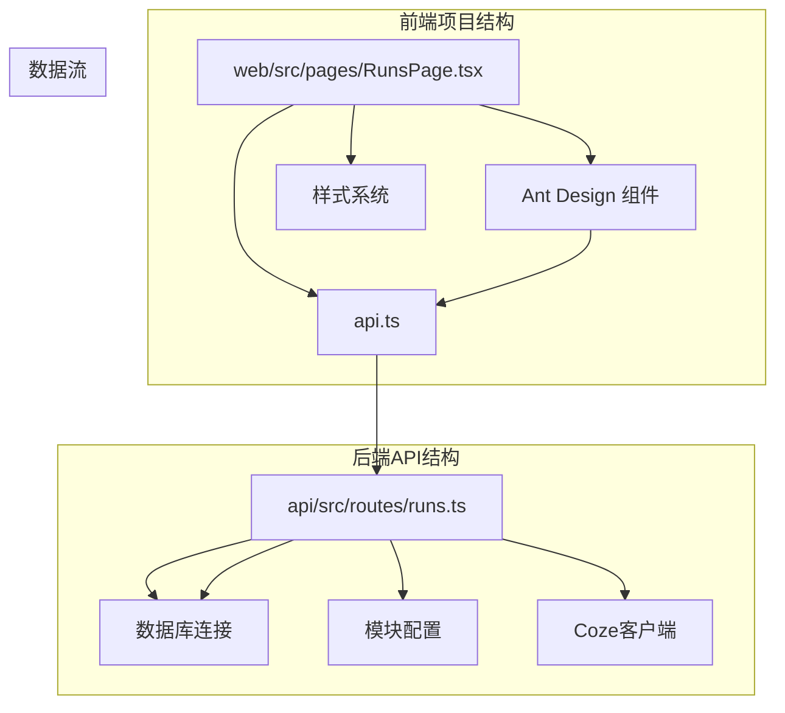
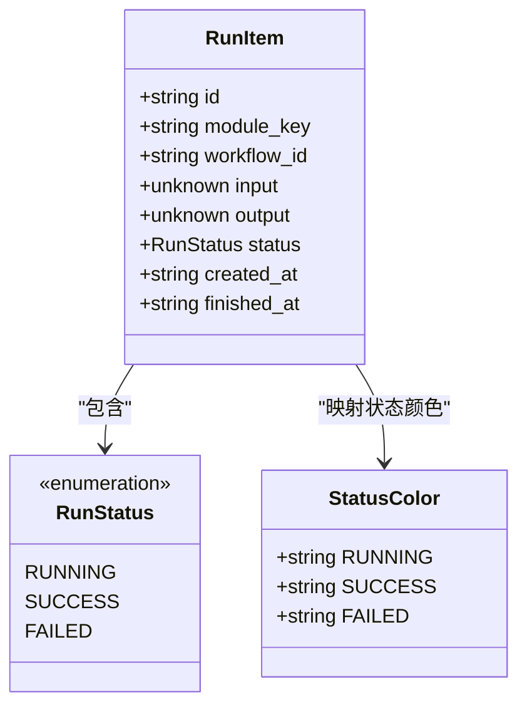
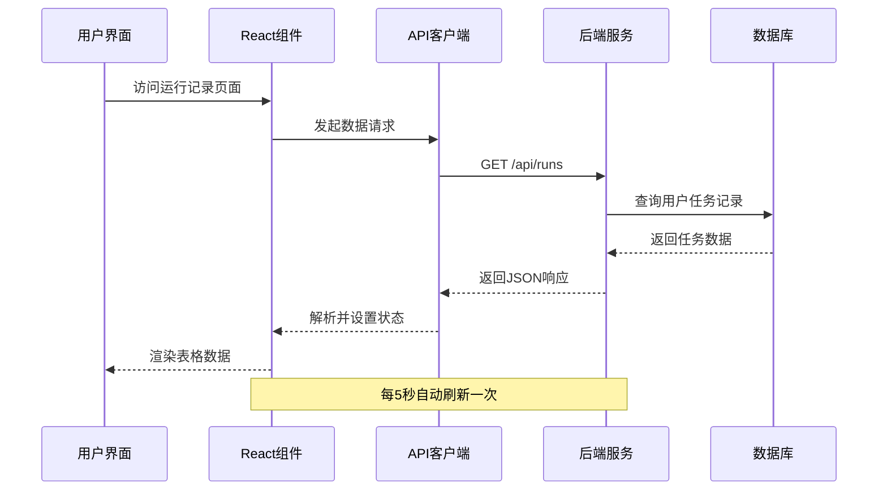
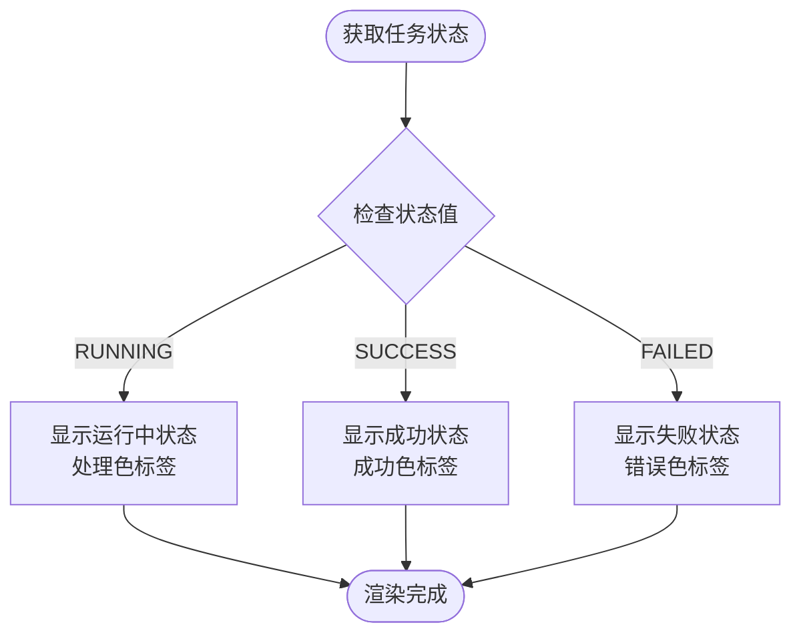
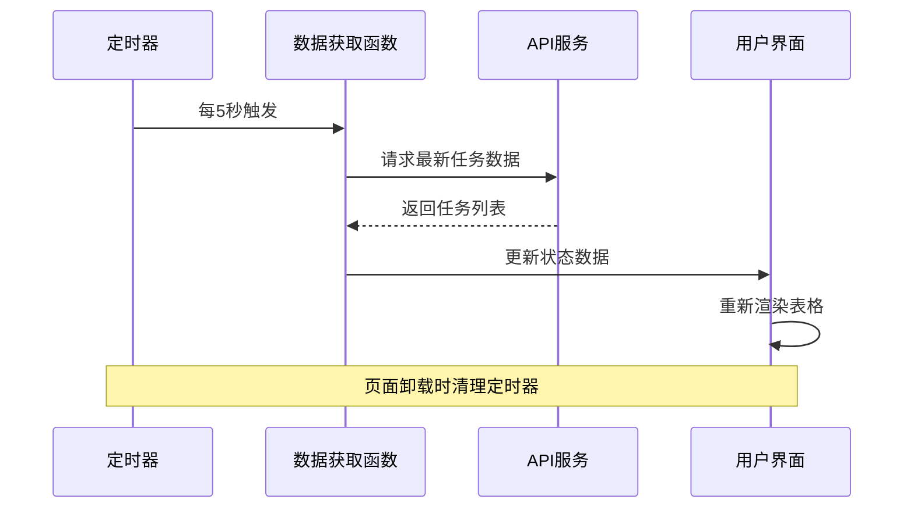
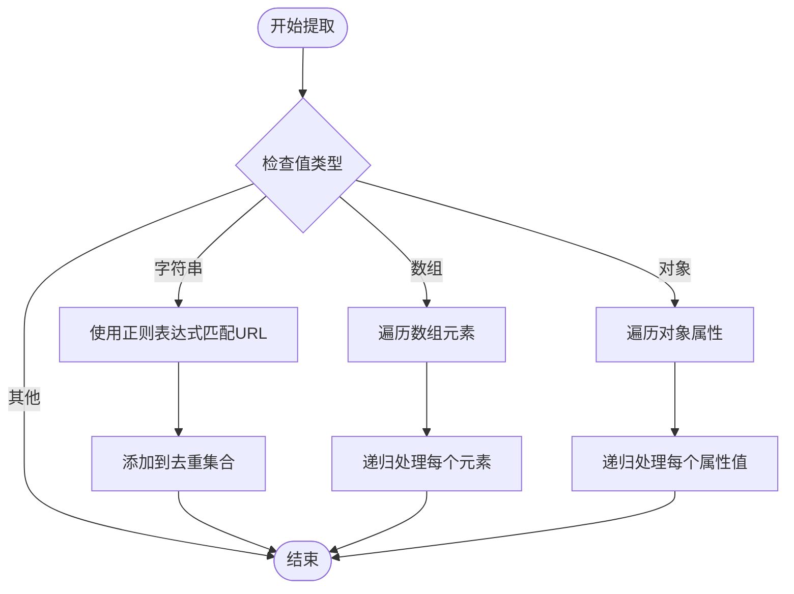
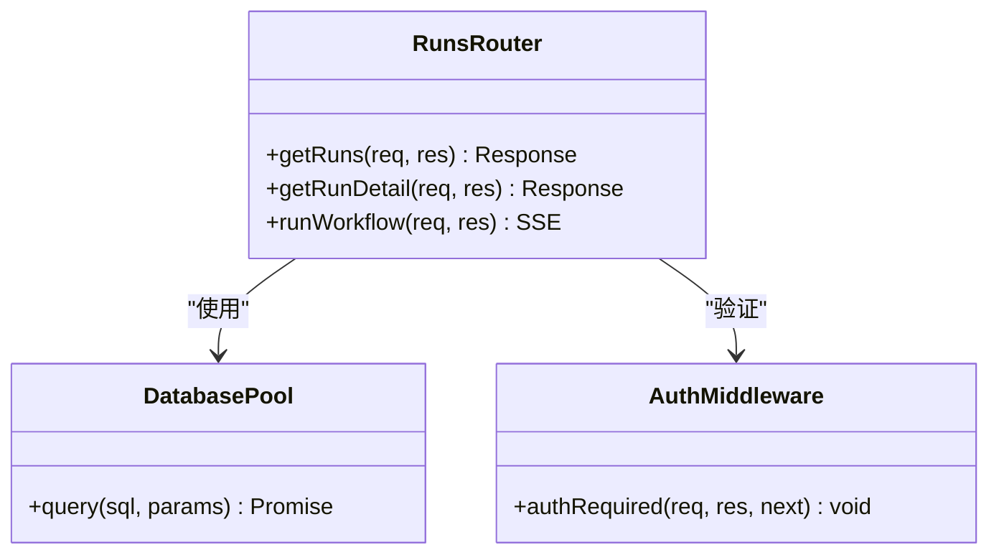
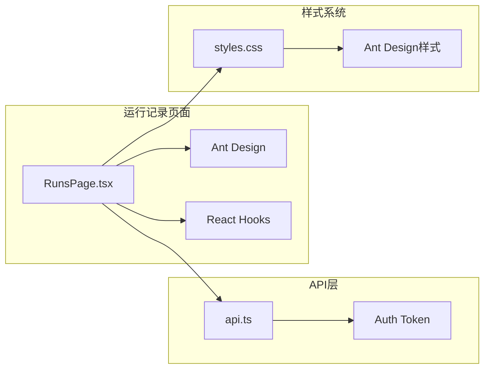
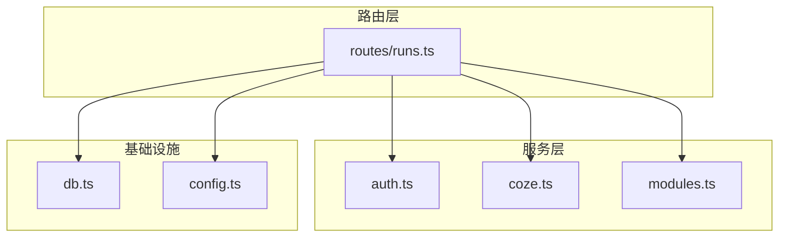

# 运行记录页面

<cite>
**本文档引用的文件**
- [RunsPage.tsx](file://web/src/pages/RunsPage.tsx)
- [runs.ts](file://api/src/routes/runs.ts)
- [api.ts](file://web/src/lib/api.ts)
- [db.ts](file://api/src/db.ts)
- [modules.ts](file://api/src/modules.ts)
- [MainLayout.tsx](file://web/src/layouts/MainLayout.tsx)
- [styles.css](file://web/src/styles.css)
</cite>

## 目录
1. [简介](#简介)
2. [项目结构](#项目结构)
3. [核心组件](#核心组件)
4. [架构概览](#架构概览)
5. [详细组件分析](#详细组件分析)
6. [依赖关系分析](#依赖关系分析)
7. [性能考虑](#性能考虑)
8. [故障排除指南](#故障排除指南)
9. [结论](#结论)

## 简介

运行记录页面是系统中用于展示用户任务执行历史的核心功能模块。该页面提供了完整的任务生命周期管理，包括任务查询、状态监控、详情查看等功能。页面采用现代化的React + Ant Design技术栈构建，实现了实时数据更新和丰富的用户交互体验。

## 项目结构

运行记录页面位于Web前端项目的页面目录中，采用标准的React组件结构：

**图表来源**
- [RunsPage.tsx:1-179](file://web/src/pages/RunsPage.tsx#L1-L179)
- [runs.ts:1-159](file://api/src/routes/runs.ts#L1-L159)

**章节来源**
- [RunsPage.tsx:1-179](file://web/src/pages/RunsPage.tsx#L1-L179)
- [MainLayout.tsx:1-65](file://web/src/layouts/MainLayout.tsx#L1-L65)

## 核心组件

### 数据模型定义

运行记录页面使用统一的数据模型来表示任务执行状态：

**图表来源**
- [RunsPage.tsx:5-20](file://web/src/pages/RunsPage.tsx#L5-L20)

### 状态颜色映射

页面为不同执行状态提供了直观的颜色标识：
- **运行中**: 处理状态色，表示任务正在执行
- **成功**: 成功状态色，表示任务顺利完成
- **失败**: 错误状态色，表示任务执行过程中出现错误

**章节来源**
- [RunsPage.tsx:16-20](file://web/src/pages/RunsPage.tsx#L16-L20)

## 架构概览

运行记录页面采用前后端分离的架构设计，实现了完整的数据流控制：

**图表来源**
- [RunsPage.tsx:69-83](file://web/src/pages/RunsPage.tsx#L69-L83)
- [api.ts:13-36](file://web/src/lib/api.ts#L13-L36)

## 详细组件分析

### 表格组件实现

运行记录页面使用Ant Design的Table组件来展示任务数据，具备以下特性：

#### 表格列定义

| 列名 | 数据字段 | 宽度 | 渲染方式 | 功能 |
|------|----------|------|----------|------|
| 任务ID | id | 280px | 文本显示 | 唯一标识符 |
| 模块 | module_key | 200px | 文本显示 | 执行模块名称 |
| 状态 | status | 120px | 颜色标签 | 实时状态指示 |
| 创建时间 | created_at | 200px | 本地化格式 | 时间戳转换 |
| 完成时间 | finished_at | 200px | 本地化格式 | 可空字段处理 |
| 操作 | - | 120px | 查看按钮 | 详情查看 |

#### 状态标识显示

**图表来源**
- [RunsPage.tsx:106-111](file://web/src/pages/RunsPage.tsx#L106-L111)

**章节来源**
- [RunsPage.tsx:98-134](file://web/src/pages/RunsPage.tsx#L98-L134)

### 数据加载策略

#### 自动刷新机制

页面实现了智能的自动刷新策略，确保用户能够及时看到任务状态变化：

**图表来源**
- [RunsPage.tsx:79-83](file://web/src/pages/RunsPage.tsx#L79-L83)

#### 手动刷新功能

用户可以通过点击刷新按钮手动获取最新数据，适用于需要立即查看更新的场景。

**章节来源**
- [RunsPage.tsx:69-83](file://web/src/pages/RunsPage.tsx#L69-L83)

### 详情查看功能

#### 调试链接提取算法

页面实现了智能的URL提取功能，能够从复杂的输出结构中识别和提取调试链接：

**图表来源**
- [RunsPage.tsx:36-55](file://web/src/pages/RunsPage.tsx#L36-L55)

#### 输出内容展示

详情模态框提供了完整的任务输出展示，包括：
- 输入参数的完整JSON结构
- 提取的调试链接列表
- 输出结果的格式化显示

**章节来源**
- [RunsPage.tsx:137-174](file://web/src/pages/RunsPage.tsx#L137-L174)

### 后端API设计

#### 数据访问层

后端API实现了严格的权限控制和数据隔离：

**图表来源**
- [runs.ts:13-53](file://api/src/routes/runs.ts#L13-L53)

#### 数据库结构

运行记录表采用了优化的数据库设计：

| 字段名 | 类型 | 约束 | 描述 |
|--------|------|------|------|
| id | UUID | 主键 | 任务唯一标识 |
| user_id | INTEGER | 外键(users.id) | 执行用户ID |
| module_key | VARCHAR(64) | 非空 | 模块键名 |
| workflow_id | VARCHAR(64) | 非空 | 工作流ID |
| input | JSONB | | 输入参数存储 |
| output | JSONB | | 输出结果存储 |
| status | VARCHAR(16) | 非空 | 任务状态 |
| created_at | TIMESTAMPTZ | 默认now() | 创建时间 |
| finished_at | TIMESTAMPTZ | | 完成时间 |

**章节来源**
- [db.ts:22-32](file://api/src/db.ts#L22-L32)

## 依赖关系分析

### 前端依赖关系

运行记录页面的依赖关系清晰明确：

**图表来源**
- [RunsPage.tsx:1-3](file://web/src/pages/RunsPage.tsx#L1-L3)
- [api.ts:13-36](file://web/src/lib/api.ts#L13-L36)

### 后端依赖关系

后端服务的模块化设计确保了良好的可维护性：

**图表来源**
- [runs.ts:1-8](file://api/src/routes/runs.ts#L1-L8)

**章节来源**
- [runs.ts:1-159](file://api/src/routes/runs.ts#L1-L159)

## 性能考虑

### 前端性能优化

#### 内存管理

- 使用useMemo优化URL提取结果，避免重复计算
- 使用useState管理组件状态，确保状态更新的高效性
- 定时器在组件卸载时自动清理，防止内存泄漏

#### 渲染优化

- 表格组件使用rowKey提升渲染性能
- 条件渲染减少不必要的DOM节点创建
- 样式内联优化首屏渲染速度

### 后端性能优化

#### 数据库优化

- 使用LIMIT 100限制返回记录数量
- 按创建时间倒序排列确保最新记录优先显示
- UUID主键设计支持高效的索引查找

#### 缓存策略

- 前端使用React状态缓存最近获取的数据
- 后端避免重复查询相同用户的数据
- SSE流式传输减少内存占用

### 用户体验改进

#### 实时反馈

- 5秒自动刷新机制提供近实时的状态更新
- 加载状态指示器改善用户等待体验
- 错误状态的友好提示信息

#### 响应式设计

- 支持不同屏幕尺寸的自适应布局
- 移动端友好的触摸交互设计
- 快速的页面切换动画效果

## 故障排除指南

### 常见问题及解决方案

#### 数据加载失败

**症状**: 表格显示空白或加载状态持续

**可能原因**:
- 网络连接异常
- 用户认证过期
- 服务器内部错误

**解决步骤**:
1. 检查网络连接状态
2. 重新登录系统
3. 查看浏览器开发者工具中的错误信息
4. 联系系统管理员

#### 状态显示异常

**症状**: 任务状态颜色显示不正确

**可能原因**:
- 后端状态值不符合预期
- 前端状态映射配置错误

**解决步骤**:
1. 验证后端返回的状态值
2. 检查前端状态颜色映射表
3. 确认数据库中状态字段的值

#### 详情查看失败

**症状**: 点击查看按钮无响应或显示错误

**可能原因**:
- 任务ID不存在
- 用户权限不足
- 输出数据格式异常

**解决步骤**:
1. 验证任务ID的有效性
2. 检查用户与任务的关联关系
3. 查看输出数据的JSON格式

**章节来源**
- [runs.ts:15-28](file://api/src/routes/runs.ts#L15-L28)
- [api.ts:25-36](file://web/src/lib/api.ts#L25-L36)

## 结论

运行记录页面是一个功能完整、设计合理的任务管理界面。通过前后端的紧密配合，实现了以下核心价值：

### 技术优势

- **实时性**: 5秒自动刷新机制确保用户能够及时了解任务状态变化
- **易用性**: 直观的表格界面和状态标识提升了用户体验
- **可靠性**: 完善的错误处理和状态管理保证了系统的稳定性
- **扩展性**: 模块化的架构设计便于后续功能扩展

### 功能特色

- **完整的任务生命周期管理**: 从创建到完成的全过程跟踪
- **智能状态识别**: 基于颜色的状态可视化设计
- **灵活的数据展示**: 支持复杂JSON结构的详情查看
- **安全的权限控制**: 基于用户身份的数据隔离

### 改进建议

1. **增加筛选功能**: 可考虑添加按状态、时间范围等条件的筛选
2. **实现分页加载**: 对于大量历史数据，可考虑实现分页或虚拟滚动
3. **增强搜索能力**: 添加关键词搜索功能提升数据检索效率
4. **优化移动端体验**: 针对移动设备优化表格显示和交互方式

该页面为整个系统的任务管理提供了坚实的基础，通过持续的优化和改进，将为用户提供更加优质的使用体验。