# 页面组件

<cite>
**本文引用的文件**
- [App.tsx](file://web/src/App.tsx)
- [AuthLayout.tsx](file://web/src/layouts/AuthLayout.tsx)
- [MainLayout.tsx](file://web/src/layouts/MainLayout.tsx)
- [DashboardPage.tsx](file://web/src/pages/DashboardPage.tsx)
- [LoginPage.tsx](file://web/src/pages/LoginPage.tsx)
- [RegisterPage.tsx](file://web/src/pages/RegisterPage.tsx)
- [RunsPage.tsx](file://web/src/pages/RunsPage.tsx)
- [VoiceGeneratorPage.tsx](file://src/pages/VoiceGeneratorPage.tsx)
- [DetailImagePage.tsx](file://web/src/pages/DetailImagePage.tsx)
- [TranslationPage.tsx](file://web/src/pages/TranslationPage.tsx)
- [ProductCopyPage.tsx](file://web/src/pages/ProductCopyPage.tsx)
- [VideoCopyPage.tsx](file://web/src/pages/VideoCopyPage.tsx)
- [ResultPanel.tsx](file://web/src/components/ResultPanel.tsx)
- [api.ts](file://web/src/lib/api.ts)
- [modules.ts](file://api/src/modules.ts)
- [styles.css](file://web/src/styles.css)
</cite>

## 目录
1. [简介](#简介)
2. [项目结构](#项目结构)
3. [核心组件](#核心组件)
4. [架构总览](#架构总览)
5. [详细组件分析](#详细组件分析)
6. [依赖关系分析](#依赖关系分析)
7. [性能考虑](#性能考虑)
8. [故障排查指南](#故障排查指南)
9. [结论](#结论)
10. [附录](#附录)

## 简介
本文件面向页面组件，系统性梳理各页面的功能实现、状态管理与用户交互设计，并重点覆盖以下主题：
- 仪表板页面：数据展示、卡片布局与统计信息呈现
- 登录与注册页面：表单验证、错误处理与用户体验优化
- 语音生成器页面：专业功能实现、实时反馈与结果展示
- 运行记录页面：数据表格、分页与筛选能力
- 详情图生成页面：工作流分支选项、图片预览与多语言支持
- 生命周期管理、性能优化与内存泄漏防护

## 项目结构
前端采用 React + Ant Design 构建，路由通过 React Router 管理，页面按功能模块组织在 pages 目录下，通用布局与工具函数分别位于 layouts 与 lib 目录。

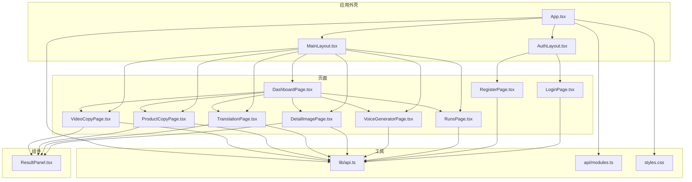

图表来源
- [App.tsx:1-70](file://web/src/App.tsx#L1-L70)
- [AuthLayout.tsx:1-21](file://web/src/layouts/AuthLayout.tsx#L1-L21)
- [MainLayout.tsx:1-65](file://web/src/layouts/MainLayout.tsx#L1-L65)
- [DashboardPage.tsx:1-108](file://web/src/pages/DashboardPage.tsx#L1-L108)
- [LoginPage.tsx:1-136](file://web/src/pages/LoginPage.tsx#L1-L136)
- [RegisterPage.tsx:1-87](file://web/src/pages/RegisterPage.tsx#L1-L87)
- [RunsPage.tsx:1-179](file://web/src/pages/RunsPage.tsx#L1-L179)
- [VoiceGeneratorPage.tsx:1-117](file://src/pages/VoiceGeneratorPage.tsx#L1-L117)
- [DetailImagePage.tsx:1-369](file://web/src/pages/DetailImagePage.tsx#L1-L369)
- [TranslationPage.tsx:1-140](file://web/src/pages/TranslationPage.tsx#L1-L140)
- [ProductCopyPage.tsx:1-249](file://web/src/pages/ProductCopyPage.tsx#L1-L249)
- [VideoCopyPage.tsx:1-202](file://web/src/pages/VideoCopyPage.tsx#L1-L202)
- [ResultPanel.tsx:1-118](file://web/src/components/ResultPanel.tsx#L1-L118)
- [api.ts:1-163](file://web/src/lib/api.ts#L1-L163)
- [modules.ts:1-40](file://api/src/modules.ts#L1-L40)
- [styles.css:1-83](file://web/src/styles.css#L1-L83)

## 核心组件
- 应用外壳与路由守卫：负责认证态校验、未授权跳转与页面渲染
- 布局组件：提供登录页与主页面的统一容器与导航
- 页面组件：围绕具体业务场景构建，统一使用流式接口与结果面板
- 结果面板：统一展示文本流、JSON、进度条与错误提示
- 模块配置：集中管理各工作流的键值、名称与工作流ID

## 架构总览
页面组件通过统一的 API 封装进行数据交互，采用流式事件解析与 SSE 风格的增量更新，保证实时反馈与良好的用户体验。

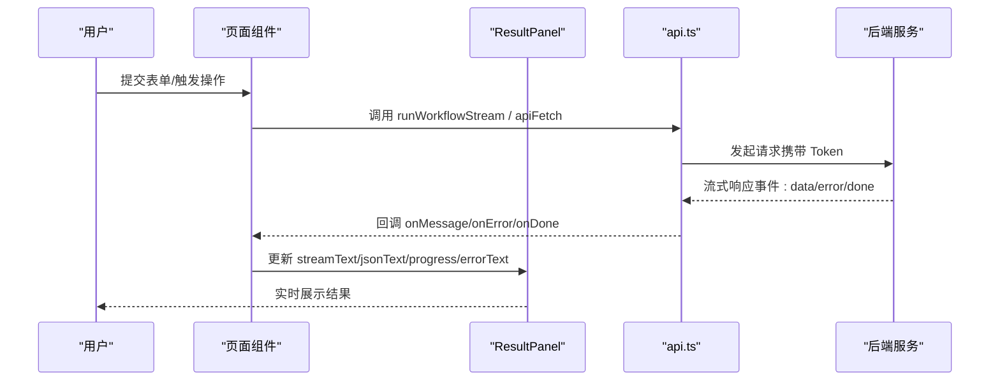

## 详细组件分析

### 仪表板页面（DashboardPage）
- 功能概述：提供功能模块入口卡片，支持搜索与标签化展示，点击进入对应模块页面
- 数据与布局：网格布局自动适配，卡片悬停效果提升交互体验
- 用户交互：点击卡片触发路由跳转，搜索框用于快速定位模块

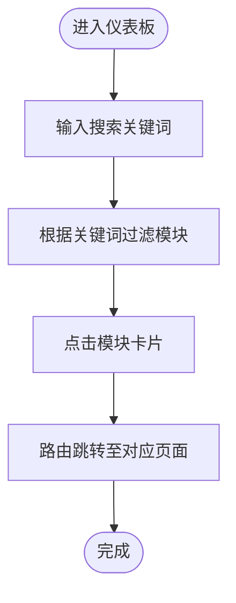

### 登录页面（LoginPage）
- 表单验证：账号/密码必填规则，提交前由表单库校验
- 错误处理：捕获网络异常与业务错误，统一以消息提示反馈
- 用户体验：提供"忘记密码"弹窗与注册跳转，登录成功后自动跳转仪表板

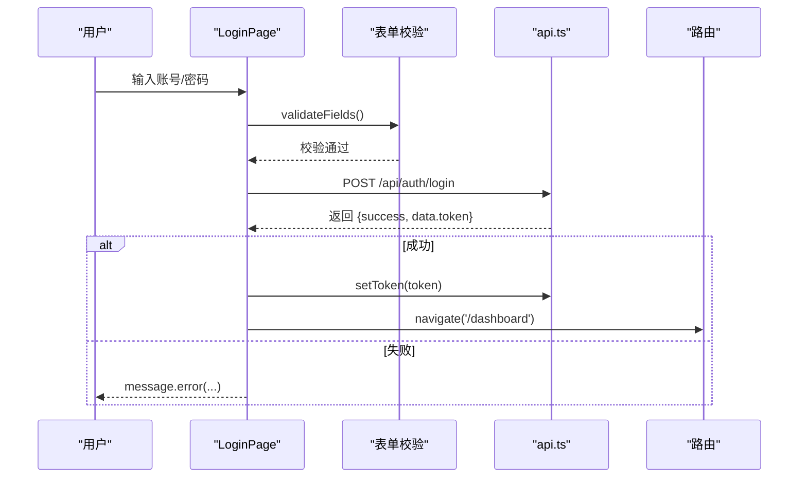

### 注册页面（RegisterPage）
- 表单验证：密码与确认密码一致性校验，邮箱必填
- 错误处理：前后端异常统一提示，注册成功后设置 Token 并跳转
- 用户体验：提供返回登录的快捷链接

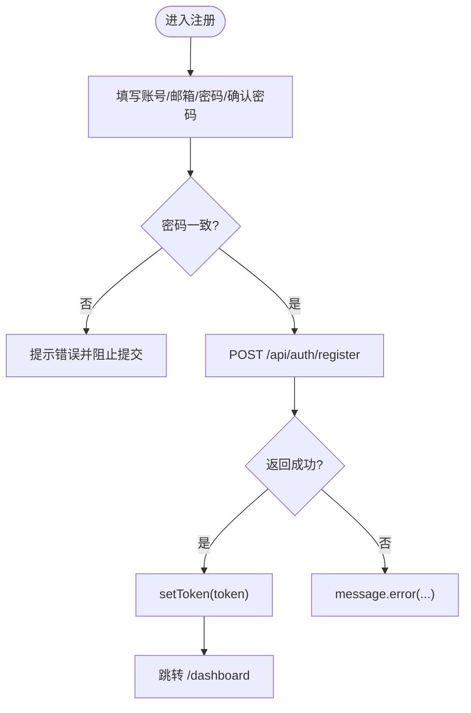

### 运行记录页面（RunsPage）
- 数据表格：展示任务ID、模块键、状态、创建/完成时间与操作列
- 分页与加载：Ant Design Table 内置分页（每页10条），加载状态显式反馈
- 实时刷新：组件挂载后定时轮询刷新，离开页面时清理定时器
- 详情弹窗：点击"查看"弹出模态框，展示输入参数、调试链接与输出结果
- 链接提取：从输出对象中递归提取 URL，支持一键打开调试链接

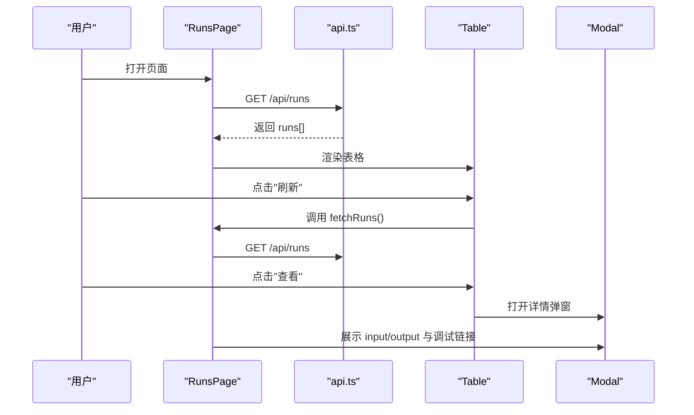

### 语音生成器页面（VoiceGeneratorPage）
- 配置加载：初始化时拉取语音服务配置（studioUrl、apiUrl），错误时提示
- 预览与安全：内嵌 iframe 预览，若被服务端禁止嵌入则提示使用新标签打开
- 用户交互：提供"新标签打开语音生成器（推荐）"与"打开 API 页面"的按钮

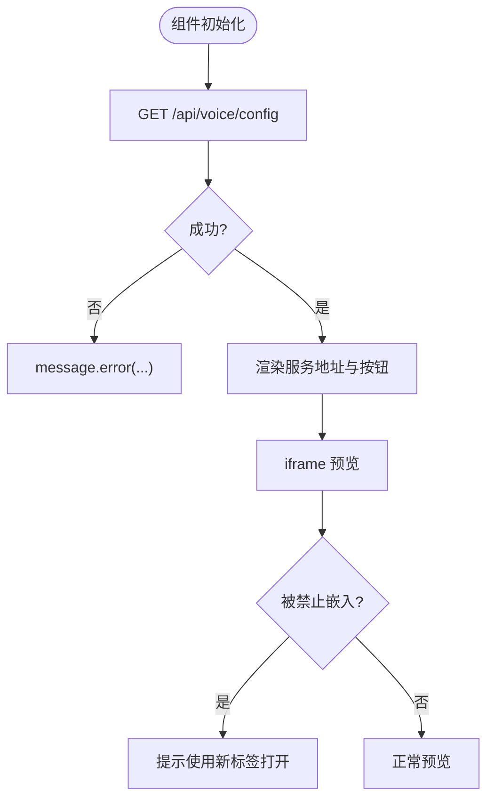

### 详情图生成页面（DetailImagePage）
- 工作流分支：支持"有参考图"、"无参考图"和"无参考图版本（英文版）"三个分支
- 上传与参数：支持 URL 与本地上传，本地文件先上传再转换为 file_id 参数
- 流式处理：统一使用 runWorkflowStream，增量更新文本流、JSON 与进度
- 并发任务：有参考图模式对每张参考图并发执行，汇总结果与错误
- 图片预览：新增生成图片预览功能，自动提取并显示生成的图片链接
- 多语言支持：英文版分支专门处理英文内容生成

**更新** 新增英语版本的无参考图详情图生成功能，支持英文内容的详情图生成

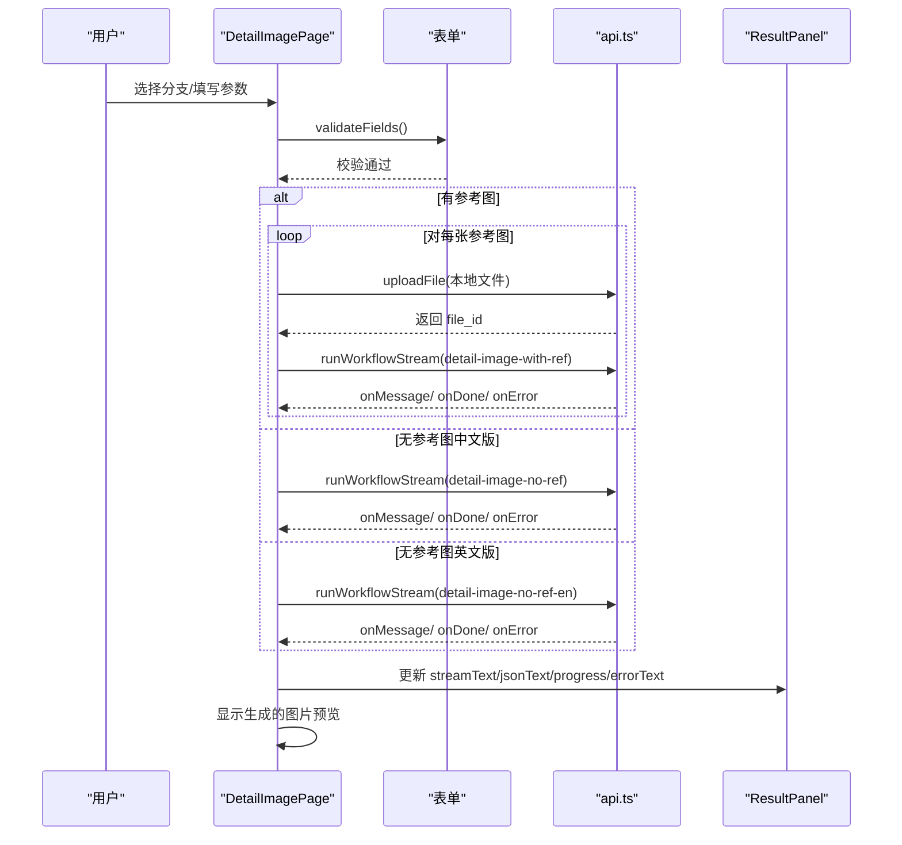

**更新** 增强了图片预览功能，现在可以在结果下方显示生成的图片链接

**更新** 改进了工作流分支选项，增加了英语版本的无参考图分支

### 翻译功能（TranslationPage）
- 表单字段：待翻译文案与目标语言选择
- 流式处理：统一使用 runWorkflowStream，解析 Message 事件中的内容字段
- 结果面板：展示翻译过程与最终结果，支持复制文本/JSON

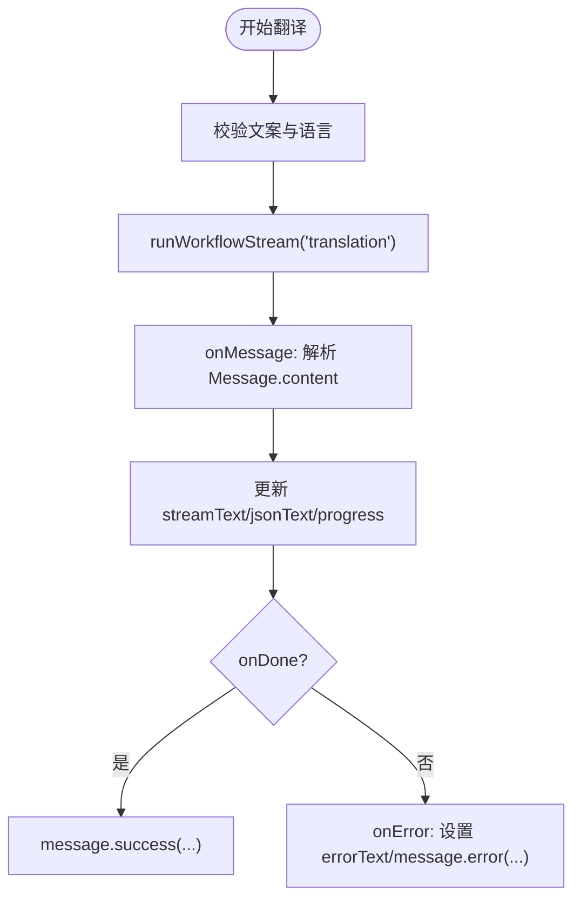

### 产品文案生成（ProductCopyPage）
- 三步流程：先生成文案 -> 独立英译 -> 生成语音（MP3+SRT）
- 状态分离：文案、英译、TTS 各自独立的状态与进度
- 接口链路：文案生成使用 runWorkflowStream；英译使用 translateLinesFromCopy；TTS 使用 ttsFromLines
- 结果面板：三个面板分别展示不同阶段的结果，支持复制文本/JSON

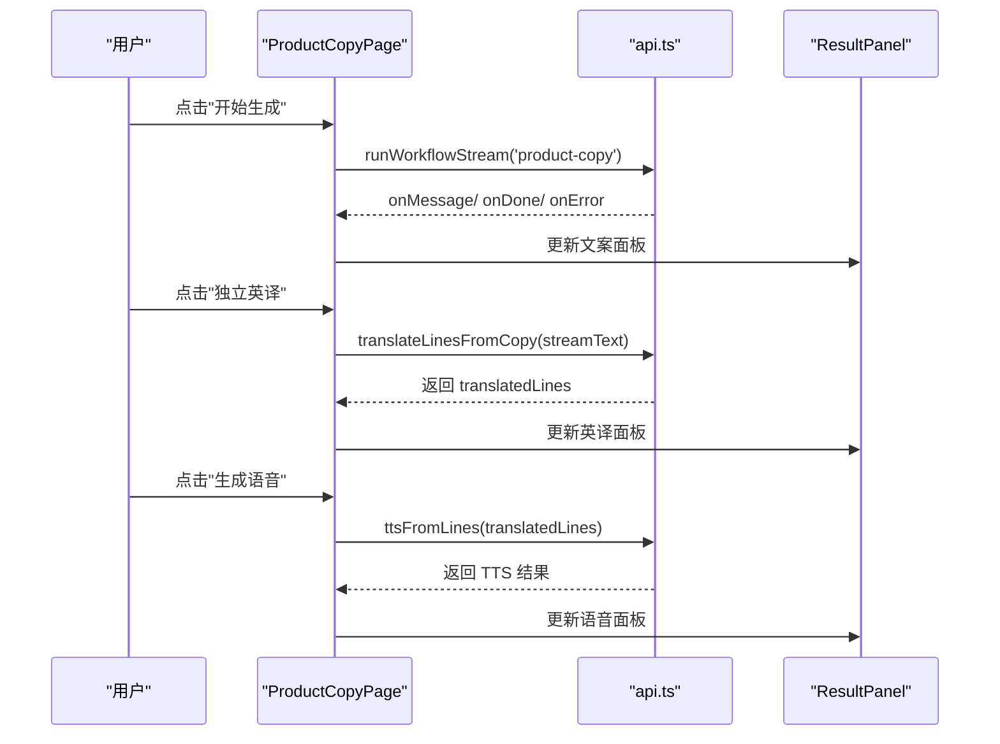

### 视频提取文案（VideoCopyPage）
- 输入模式：支持视频 URL 与本地上传两种方式
- 文件上传：本地上传先走 uploadFile，再将 file_id 作为参数传递
- 流式处理：统一使用 runWorkflowStream，解析 Message 事件中的 output 字段
- 结果面板：展示提取过程与最终结果，支持复制文本/JSON

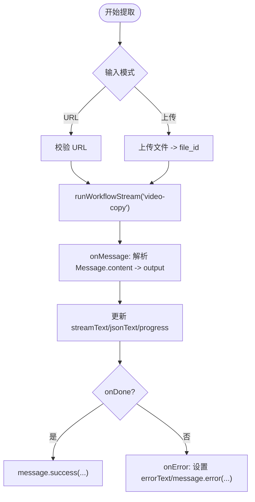

### 结果面板（ResultPanel）
- 统一展示：标题、复制按钮、进度条、加载状态、错误提示与文本区域
- 交互设计：提供复制文本/JSON的能力，便于用户导出与复用
- 自动解析：智能解析 JSON 和纯文本，提供更好的阅读体验

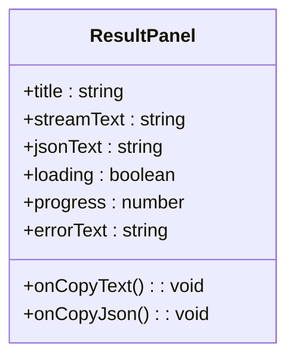

## 依赖关系分析
- 路由与权限：App.tsx 中的 RequireAuth 与 setUnauthorizedHandler 统一处理未授权与登录态校验
- 布局：AuthLayout 与 MainLayout 分别承载登录/注册与主功能页面的统一外观
- 页面间通信：通过路由参数与全局状态（Token）驱动，避免跨组件耦合
- API 抽象：所有页面通过 api.ts 的封装发起请求，集中处理 Token、401 与错误抛出
- 模块配置：modules.ts 集中管理所有工作流的配置信息

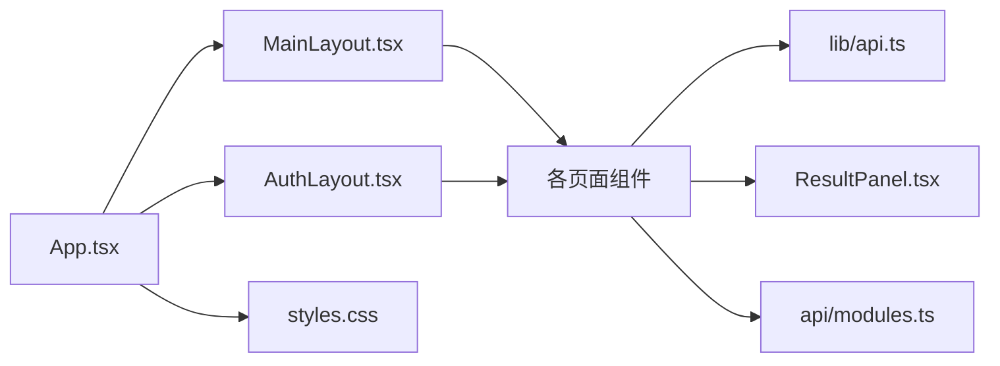

## 性能考虑
- 请求去抖与节流：页面组件在提交后即时更新 UI，避免重复请求；RunsPage 的轮询间隔为固定周期，可根据数据变化动态调整
- 内存管理：页面卸载时清理定时器（RunsPage），避免后台持续请求导致内存泄漏
- 渲染优化：ResultPanel 仅在状态变更时更新，减少不必要的重渲染
- 网络层优化：api.ts 统一设置 Content-Type 与 Authorization，减少重复逻辑
- UI 响应：进度条与加载状态及时反馈，提升感知速度
- 并发控制：详情图页面对参考图采用并发处理，但限制了同时进行的任务数量，避免资源耗尽

## 故障排查指南
- 登录/注册失败
  - 检查表单必填项是否完整
  - 查看消息提示与网络面板，确认后端返回的错误信息
  - 若出现 401，确认 Token 是否正确设置与过期
- 运行记录无法刷新
  - 确认网络连通性与后端 /api/runs 可达
  - 检查浏览器控制台是否有跨域或证书问题
- 语音生成器预览失败
  - 服务端可能禁止 iframe 嵌入，使用"新标签打开语音生成器（推荐）"按钮
  - 检查 studioUrl 与 apiUrl 是否正确返回
- 流式结果不显示
  - 确认后端事件格式符合预期（data/event/done/error）
  - 检查 ResultPanel 的 onCopyText/onCopyJson 是否被正确调用
- 上传文件失败
  - 确认上传接口与文件类型，检查返回的 file_id 是否存在
- 详情图生成分支选择错误
  - 确认选择了正确的分支：有参考图、无参考图中文版或无参考图英文版
  - 检查工作流ID是否正确匹配所选分支
- 图片预览不显示
  - 确认生成过程中是否返回了有效的图片链接
  - 检查网络连接和图片访问权限

## 结论
本文档系统性梳理了页面组件的功能实现、状态管理与用户交互设计，明确了各页面在数据展示、表单验证、实时反馈与结果呈现方面的职责边界。通过统一的 API 抽象与布局组件，实现了高内聚低耦合的前端架构，同时在性能与稳定性方面提供了实践建议与故障排查路径。

**更新** 最新更新反映了新增的英语版本无参考图详情图生成功能、增强的图片预览功能以及改进的工作流分支选项，为用户提供更丰富的多语言支持和更好的视觉体验。

## 附录
- 样式规范：页面头部、卡片、网格布局与结果面板的样式定义集中在 styles.css
- 路由守卫：RequireAuth 与 setUnauthorizedHandler 在 App.tsx 中集中处理认证态与未授权跳转
- 模块配置：modules.ts 中集中管理所有工作流的键值、名称与工作流ID，支持详情图生成的多分支选项

**更新** 新增模块配置文件，支持详情图生成的三种工作流分支

**章节来源**
- [styles.css:29-82](file://web/src/styles.css#L29-L82)
- [App.tsx:17-39](file://web/src/App.tsx#L17-L39)
- [modules.ts:1-40](file://api/src/modules.ts#L1-L40)