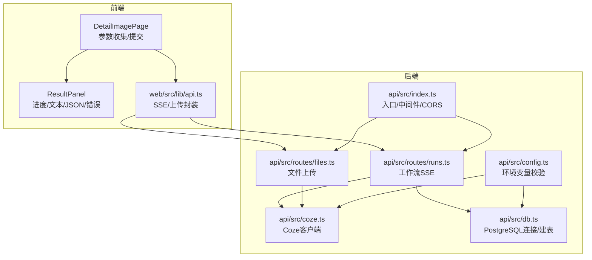
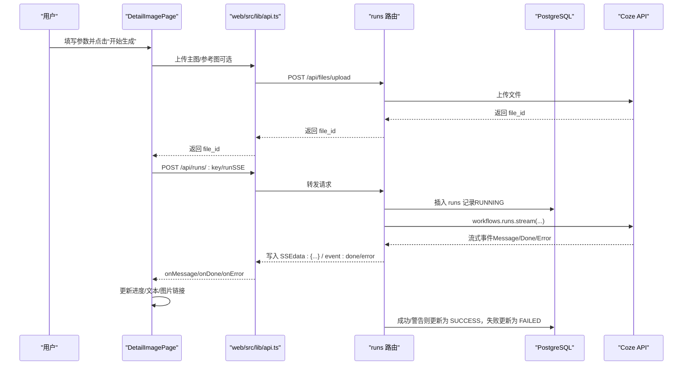
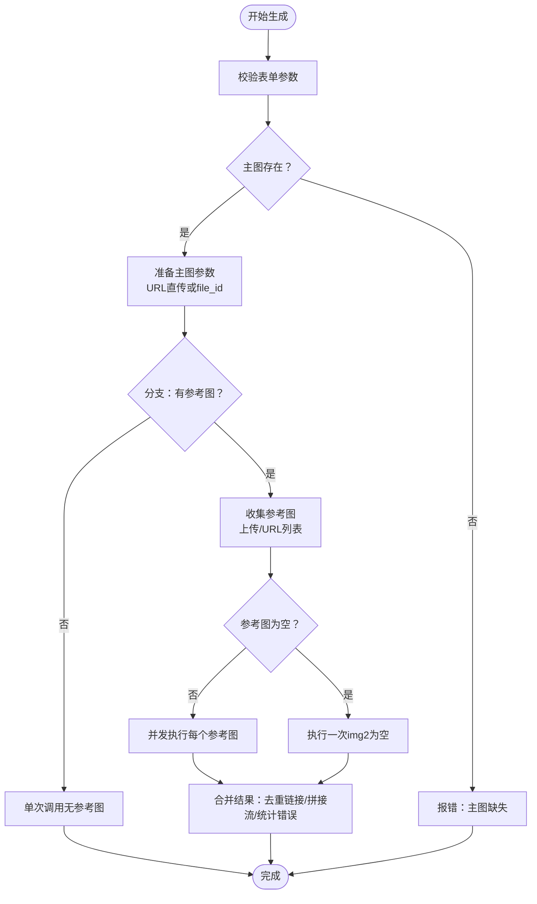
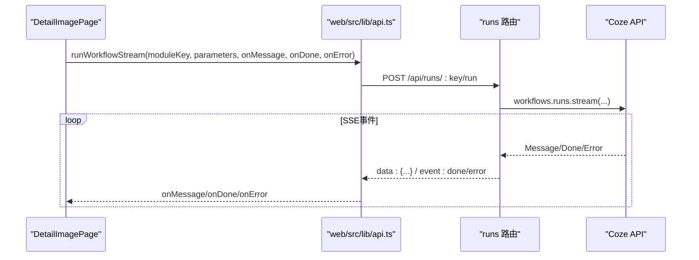
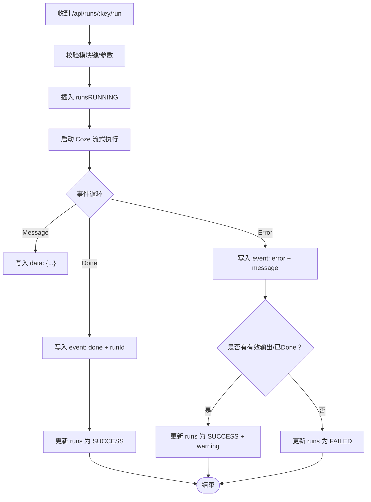
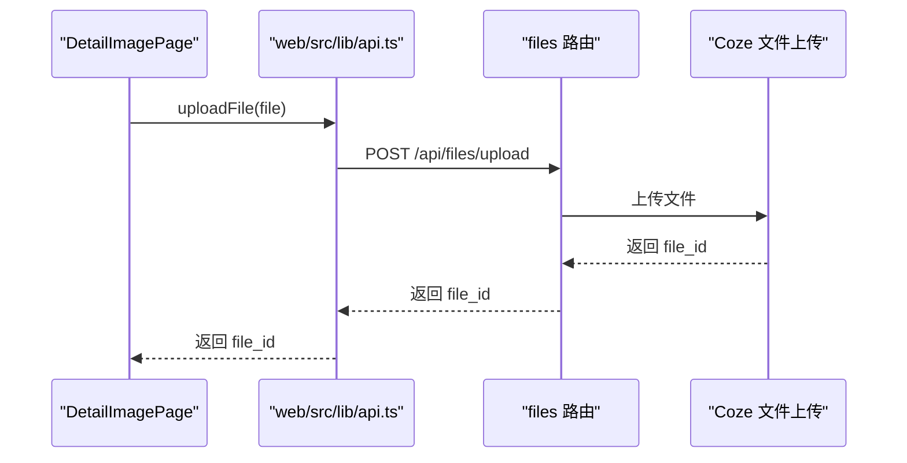
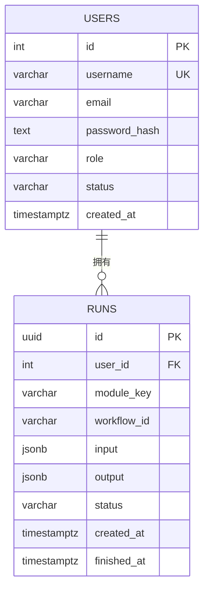
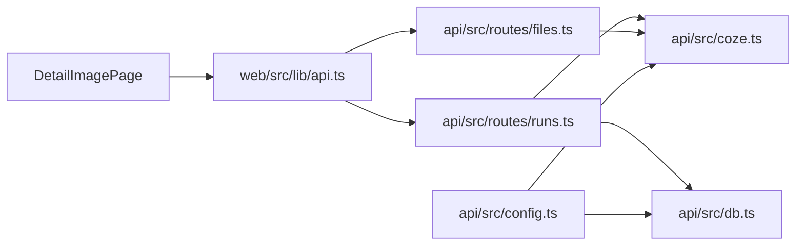

# 图像生成模块

<cite>
**本文引用的文件**
- [api/src/coze.ts](file://api/src/coze.ts)
- [api/src/modules.ts](file://api/src/modules.ts)
- [api/src/route/runs.ts](file://api/src/routes/runs.ts)
- [api/src/route/files.ts](file://api/src/routes/files.ts)
- [api/src/config.ts](file://api/src/config.ts)
- [api/src/db.ts](file://api/src/db.ts)
- [api/src/index.ts](file://api/src/index.ts)
- [web/src/pages/DetailImagePage.tsx](file://web/src/pages/DetailImagePage.tsx)
- [web/src/components/ResultPanel.tsx](file://web/src/components/ResultPanel.tsx)
- [web/src/lib/api.ts](file://web/src/lib/api.ts)
</cite>

## 目录
1. [简介](#简介)
2. [项目结构](#项目结构)
3. [核心组件](#核心组件)
4. [架构总览](#架构总览)
5. [详细组件分析](#详细组件分析)
6. [依赖关系分析](#依赖关系分析)
7. [性能考虑](#性能考虑)
8. [故障排查指南](#故障排查指南)
9. [结论](#结论)
10. [附录](#附录)

## 简介
本模块围绕“详情图生成”能力展开，提供两种工作流模式：
- 有参考图模式：以主图为基准，逐张参考图进行生成，支持并发多任务。
- 无参考图模式：直接基于主图生成。

前端通过表单收集参数（画幅比例、主图、可选参考图、卖点文案、产品名称），经由上传接口将本地文件转存至云端，随后通过服务端发起 Coze 工作流流式输出，前端实时渲染进度、文本流与最终图片链接，并在完成后汇总展示。

## 项目结构
- 前端（React + Ant Design）
  - 页面：详情图生成页面负责参数收集与结果展示
  - 组件：结果面板用于展示进度、文本流、JSON 流与错误提示
  - 工具：统一 API 封装，支持 SSE 流式消费与文件上传
- 后端（Express + PostgreSQL）
  - 路由：runs（工作流执行）、files（文件上传）、voice（语音相关，供对比参考）
  - 数据层：PostgreSQL 存储用户、任务与运行状态
  - 配置：环境变量校验与 Coze 客户端初始化

图表来源
- [api/src/index.ts:1-29](file://api/src/index.ts#L1-L29)
- [api/src/routes/runs.ts:1-159](file://api/src/routes/runs.ts#L1-L159)
- [api/src/routes/files.ts:1-43](file://api/src/routes/files.ts#L1-L43)
- [api/src/coze.ts:1-8](file://api/src/coze.ts#L1-L8)
- [api/src/db.ts:1-35](file://api/src/db.ts#L1-L35)
- [api/src/config.ts:1-19](file://api/src/config.ts#L1-L19)
- [web/src/pages/DetailImagePage.tsx:1-346](file://web/src/pages/DetailImagePage.tsx#L1-L346)
- [web/src/components/ResultPanel.tsx:1-46](file://web/src/components/ResultPanel.tsx#L1-L46)
- [web/src/lib/api.ts:1-160](file://web/src/lib/api.ts#L1-L160)

章节来源
- [api/src/index.ts:1-29](file://api/src/index.ts#L1-L29)
- [api/src/routes/runs.ts:1-159](file://api/src/routes/runs.ts#L1-L159)
- [api/src/routes/files.ts:1-43](file://api/src/routes/files.ts#L1-L43)
- [api/src/coze.ts:1-8](file://api/src/coze.ts#L1-L8)
- [api/src/db.ts:1-35](file://api/src/db.ts#L1-L35)
- [api/src/config.ts:1-19](file://api/src/config.ts#L1-L19)
- [web/src/pages/DetailImagePage.tsx:1-346](file://web/src/pages/DetailImagePage.tsx#L1-L346)
- [web/src/components/ResultPanel.tsx:1-46](file://web/src/components/ResultPanel.tsx#L1-L46)
- [web/src/lib/api.ts:1-160](file://web/src/lib/api.ts#L1-L160)

## 核心组件
- 前端页面 DetailImagePage
  - 表单字段：画幅比例、主图（上传或URL）、参考图（多图上传或URL列表，仅“有参考图”模式）、卖点文案、产品名称
  - 交互逻辑：参数校验、主图处理（上传或URL直传）、参考图聚合（上传文件ID或URL）、并发任务调度、SSE流式消费、结果汇总与错误提示
- 结果面板 ResultPanel
  - 展示：标题、复制文本/JSON按钮、进度条、运行中提示、错误告警、文本输出区域
- API 封装
  - 通用 fetch：自动注入 Bearer Token、401 清理、非 OK 抛错
  - 文件上传：multipart 上传至 Coze 云端，返回 file_id
  - 流式执行：POST /api/runs/:key/run，SSE 消费，解析 event/data/message/done/error
- 后端路由 runs
  - 校验参数与模块键，插入 runs 记录，启动 Coze 工作流流式输出，按事件写回 SSE，异常时区分 SUCCESS/WARNING 与 FAILED
- 文件上传 files
  - 接收 multipart 文件，转发给 Coze 文件上传接口，返回 file_id
- 配置与客户端
  - config 校验必要环境变量，coze.ts 初始化 Coze 客户端
- 数据库
  - users、runs 表，runs 记录输入、输出、状态、时间戳

章节来源
- [web/src/pages/DetailImagePage.tsx:14-346](file://web/src/pages/DetailImagePage.tsx#L14-L346)
- [web/src/components/ResultPanel.tsx:14-46](file://web/src/components/ResultPanel.tsx#L14-L46)
- [web/src/lib/api.ts:13-160](file://web/src/lib/api.ts#L13-L160)
- [api/src/routes/runs.ts:55-159](file://api/src/routes/runs.ts#L55-L159)
- [api/src/routes/files.ts:10-43](file://api/src/routes/files.ts#L10-L43)
- [api/src/config.ts:5-19](file://api/src/config.ts#L5-L19)
- [api/src/coze.ts:4-8](file://api/src/coze.ts#L4-L8)
- [api/src/db.ts:10-35](file://api/src/db.ts#L10-L35)

## 架构总览
下图展示了从前端到后端再到 Coze 的完整调用链路，以及数据库存储与文件上传路径。

图表来源
- [web/src/pages/DetailImagePage.tsx:105-251](file://web/src/pages/DetailImagePage.tsx#L105-L251)
- [web/src/lib/api.ts:58-115](file://web/src/lib/api.ts#L58-L115)
- [api/src/routes/runs.ts:55-159](file://api/src/routes/runs.ts#L55-L159)
- [api/src/routes/files.ts:10-43](file://api/src/routes/files.ts#L10-L43)
- [api/src/db.ts:22-32](file://api/src/db.ts#L22-L32)

## 详细组件分析

### 前端页面：详情图生成（DetailImagePage）
- 参数与校验
  - 画幅比例：下拉选择，支持多种常见比例
  - 主图：支持上传文件或输入 URL；若上传则走文件上传流程
  - 参考图：多图上传或 URL 列表；若为空则仍执行一次（img2 传空字符串）
  - 卖点文案与产品名称：必填项
- 并发与顺序
  - 有参考图：对每张参考图独立构造参数并并发执行，完成后汇总文本流、JSON 流与图片链接
  - 无参考图：单次调用
- 进度与结果
  - 进度：初始阶段固定推进，SSE 中按比例动态增加，最终完成
  - 文本流：原始事件内容拼接
  - JSON 流：每条事件序列化为 JSON 并拼接
  - 图片链接：从 Message.data.content 中解析输出数组，去重后展示
  - 错误：任一子任务失败会汇总错误信息并提示

图表来源
- [web/src/pages/DetailImagePage.tsx:105-251](file://web/src/pages/DetailImagePage.tsx#L105-L251)

章节来源
- [web/src/pages/DetailImagePage.tsx:14-346](file://web/src/pages/DetailImagePage.tsx#L14-L346)

### API 封装：SSE 与文件上传
- 通用 fetch
  - 自动注入 Authorization Bearer Token
  - 401 清理本地 token 并触发登出回调
  - 非 OK 抛出错误
- 流式执行 runWorkflowStream
  - POST /api/runs/:key/run
  - 解析 SSE：event: done/error/data: {...}
  - 对 data: {...} 中的 content 字段尝试 JSON 解析，提取图片链接
- 文件上传 uploadFile
  - multipart/form-data 上传至 /api/files/upload
  - 返回 file_id 供工作流使用

图表来源
- [web/src/lib/api.ts:58-115](file://web/src/lib/api.ts#L58-L115)
- [api/src/routes/runs.ts:84-123](file://api/src/routes/runs.ts#L84-L123)

章节来源
- [web/src/lib/api.ts:13-160](file://web/src/lib/api.ts#L13-L160)

### 后端路由：runs（工作流执行）
- 请求处理
  - 校验模块键是否存在
  - 校验 parameters 是否存在
  - 插入 runs 记录（RUNNING）
  - 以 SSE 形式向客户端返回流式事件
- 流式输出
  - 逐条写入 data: {...}
  - Done 事件：写入标准 done 事件，携带 runId
  - Error 事件：写入 error 事件，携带错误消息
- 状态持久化
  - 成功：更新为 SUCCESS，保存 chunks
  - 失败：更新为 FAILED，保存错误
  - 特殊：若有有效输出或 Done 事件，即使后续异常也标记为 SUCCESS 并附加 warning

图表来源
- [api/src/routes/runs.ts:55-159](file://api/src/routes/runs.ts#L55-L159)

章节来源
- [api/src/routes/runs.ts:55-159](file://api/src/routes/runs.ts#L55-L159)

### 文件上传：files（本地文件转存）
- 接收 multipart 文件
- 使用 form-data 转发到 Coze 文件上传接口
- 返回 file_id 供工作流使用

图表来源
- [web/src/lib/api.ts:39-56](file://web/src/lib/api.ts#L39-L56)
- [api/src/routes/files.ts:10-43](file://api/src/routes/files.ts#L10-L43)

章节来源
- [web/src/lib/api.ts:39-56](file://web/src/lib/api.ts#L39-L56)
- [api/src/routes/files.ts:10-43](file://api/src/routes/files.ts#L10-L43)

### 数据模型与模块配置
- 模块配置
  - detail-image-with-ref：有参考图工作流
  - detail-image-no-ref：无参考图工作流
- 数据库表
  - users：用户信息
  - runs：任务记录（输入、输出、状态、时间）

图表来源
- [api/src/db.ts:22-32](file://api/src/db.ts#L22-L32)
- [api/src/modules.ts:1-29](file://api/src/modules.ts#L1-L29)

章节来源
- [api/src/db.ts:10-35](file://api/src/db.ts#L10-L35)
- [api/src/modules.ts:1-29](file://api/src/modules.ts#L1-L29)

## 依赖关系分析
- 前端依赖
  - DetailImagePage 依赖 ResultPanel、API 封装
  - API 封装依赖浏览器 fetch、SSE Reader、URL 环境变量
- 后端依赖
  - runs 路由依赖 auth 中间件、modules 配置、coze 客户端、数据库连接
  - files 路由依赖 multer、form-data、node-fetch、coze 客户端
  - config 校验环境变量，coze.ts 初始化客户端
- 外部依赖
  - Coze API（工作流与文件上传）
  - PostgreSQL（数据持久化）

图表来源
- [web/src/pages/DetailImagePage.tsx:1-346](file://web/src/pages/DetailImagePage.tsx#L1-L346)
- [web/src/lib/api.ts:1-160](file://web/src/lib/api.ts#L1-L160)
- [api/src/routes/runs.ts:1-159](file://api/src/routes/runs.ts#L1-L159)
- [api/src/routes/files.ts:1-43](file://api/src/routes/files.ts#L1-L43)
- [api/src/coze.ts:1-8](file://api/src/coze.ts#L1-L8)
- [api/src/db.ts:1-35](file://api/src/db.ts#L1-L35)
- [api/src/config.ts:1-19](file://api/src/config.ts#L1-L19)

章节来源
- [web/src/pages/DetailImagePage.tsx:1-346](file://web/src/pages/DetailImagePage.tsx#L1-L346)
- [web/src/lib/api.ts:1-160](file://web/src/lib/api.ts#L1-L160)
- [api/src/routes/runs.ts:1-159](file://api/src/routes/runs.ts#L1-L159)
- [api/src/routes/files.ts:1-43](file://api/src/routes/files.ts#L1-L43)
- [api/src/coze.ts:1-8](file://api/src/coze.ts#L1-L8)
- [api/src/db.ts:1-35](file://api/src/db.ts#L1-L35)
- [api/src/config.ts:1-19](file://api/src/config.ts#L1-L19)

## 性能考虑
- 并发控制
  - 有参考图模式对每张参考图并发执行，建议根据网络与服务端限流合理设置并发数，避免资源争用
- 流式消费
  - SSE 流式事件按事件到达实时更新 UI，减少一次性大块数据传输
- 文件上传
  - 本地文件先上传至云端再参与工作流，避免大文件直接透传导致带宽与内存压力
- 数据库
  - runs 表记录完整事件流，注意定期清理历史任务，避免日志膨胀
- 前端渲染
  - 文本与 JSON 拼接采用增量更新，避免全量重绘；图片链接去重提升展示效率

## 故障排查指南
- 常见错误与定位
  - 缺少参数：后端返回“缺少参数”，检查前端表单字段是否完整
  - 模块不存在：后端返回“模块不存在”，检查模块键是否正确
  - 401 未授权：前端清除本地 token 并触发登出，检查鉴权流程
  - 文件上传失败：后端转发到 Coze 失败时返回详细错误，检查网络与 Coze 凭据
  - 工作流异常：后端区分 SUCCESS/WARNING 与 FAILED；若出现 warning，表示已有有效输出但后续异常
- 建议排查步骤
  - 查看前端 ResultPanel 的错误提示与进度条
  - 在浏览器 Network 面板观察 SSE 连接与事件
  - 在后端日志中确认 runs 表状态变化
  - 检查环境变量 COZE_API_TOKEN、DATABASE_URL、JWT_SECRET 是否正确
- 超时与重试
  - 当前实现未内置自动重试；可在前端对 SSE 断连进行手动重试或刷新页面
  - 建议在网关或代理层配置合理的超时与重试策略

章节来源
- [api/src/routes/runs.ts:124-156](file://api/src/routes/runs.ts#L124-L156)
- [web/src/lib/api.ts:25-36](file://web/src/lib/api.ts#L25-L36)
- [api/src/routes/files.ts:28-36](file://api/src/routes/files.ts#L28-L36)
- [api/src/config.ts:7-11](file://api/src/config.ts#L7-L11)

## 结论
该模块通过清晰的前后端职责划分与流式事件机制，实现了从参数输入到结果展示的完整闭环。前端负责交互与实时渲染，后端负责任务编排与状态持久化，Coze 提供工作流与文件能力。建议在生产环境中完善重试与监控、限制并发与清理历史数据，以获得更稳定的体验。

## 附录

### 请求参数与响应数据结构
- 请求参数（POST /api/runs/:key/run）
  - parameters：对象，包含以下字段（示例）
    - aspectRatio：画幅比例（字符串，如 "16:9"）
    - img1/img2：主图/参考图，支持 URL 或 {"file_id": "..."} 形式
    - maidian：卖点文案（字符串）
    - name：产品名称（字符串）
- 响应（SSE）
  - data: {...}：事件数据，可能包含 Message/Done/Error
  - event: done：表示工作流完成，data 中包含 runId
  - event: error：表示工作流异常，data 中包含错误消息
- 文件上传（POST /api/files/upload）
  - 请求：multipart/form-data，字段 file
  - 响应：包含 file_id 的 JSON

章节来源
- [web/src/pages/DetailImagePage.tsx:160-214](file://web/src/pages/DetailImagePage.tsx#L160-L214)
- [api/src/routes/runs.ts:84-123](file://api/src/routes/runs.ts#L84-L123)
- [web/src/lib/api.ts:39-56](file://web/src/lib/api.ts#L39-L56)

### 配置选项、质量参数与尺寸设置
- 配置项
  - COZE_API_TOKEN：Coze API 访问令牌
  - DATABASE_URL：PostgreSQL 连接字符串
  - JWT_SECRET：JWT 签名密钥
  - PORT：服务监听端口（默认 3000）
- 质量与尺寸
  - 画幅比例：通过参数 aspectRatio 控制（如 1:1、16:9 等）
  - 图片尺寸：由工作流内部参数决定，前端不直接暴露尺寸参数
  - 参考图数量：可多张并发，受网络与服务端限流影响

章节来源
- [api/src/config.ts:5-19](file://api/src/config.ts#L5-L19)
- [web/src/pages/DetailImagePage.tsx:282-290](file://web/src/pages/DetailImagePage.tsx#L282-L290)

### 完整调用示例（路径指引）
- 前端提交参数并触发生成
  - [web/src/pages/DetailImagePage.tsx:105-251](file://web/src/pages/DetailImagePage.tsx#L105-L251)
- 流式执行与事件消费
  - [web/src/lib/api.ts:58-115](file://web/src/lib/api.ts#L58-L115)
  - [api/src/routes/runs.ts:84-123](file://api/src/routes/runs.ts#L84-L123)
- 文件上传与 file_id 获取
  - [web/src/lib/api.ts:39-56](file://web/src/lib/api.ts#L39-L56)
  - [api/src/routes/files.ts:10-43](file://api/src/routes/files.ts#L10-L43)