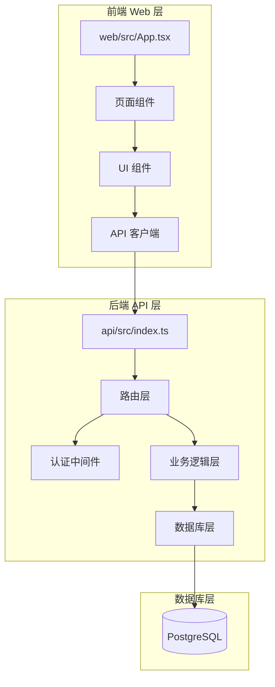
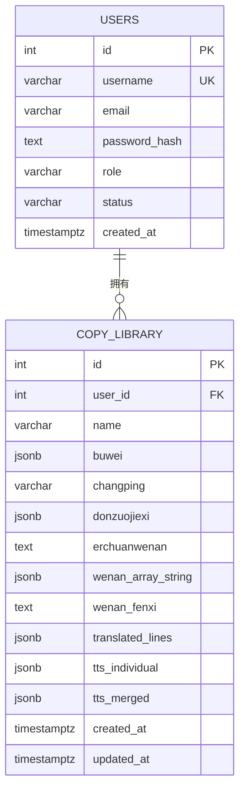
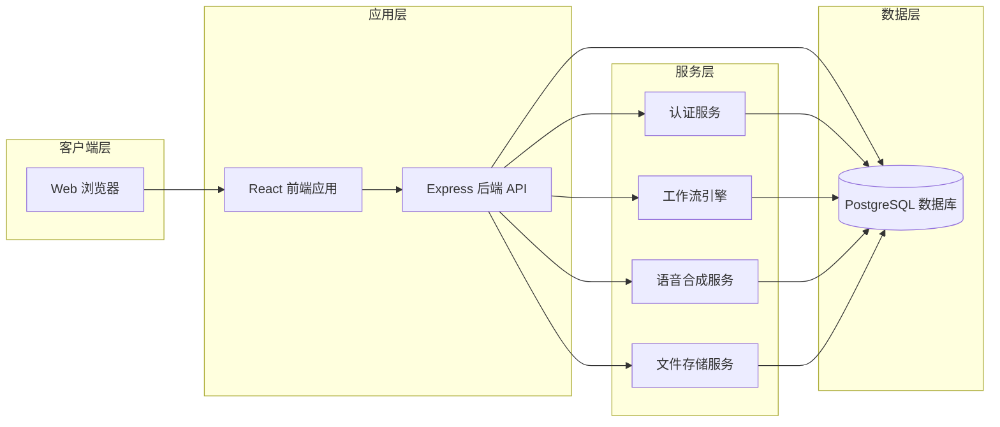
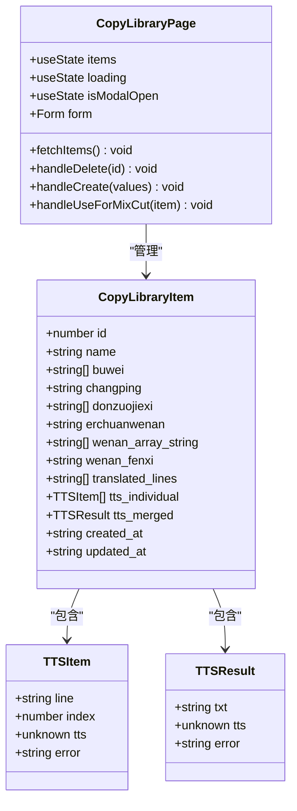
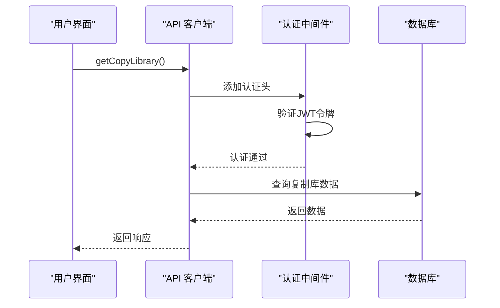
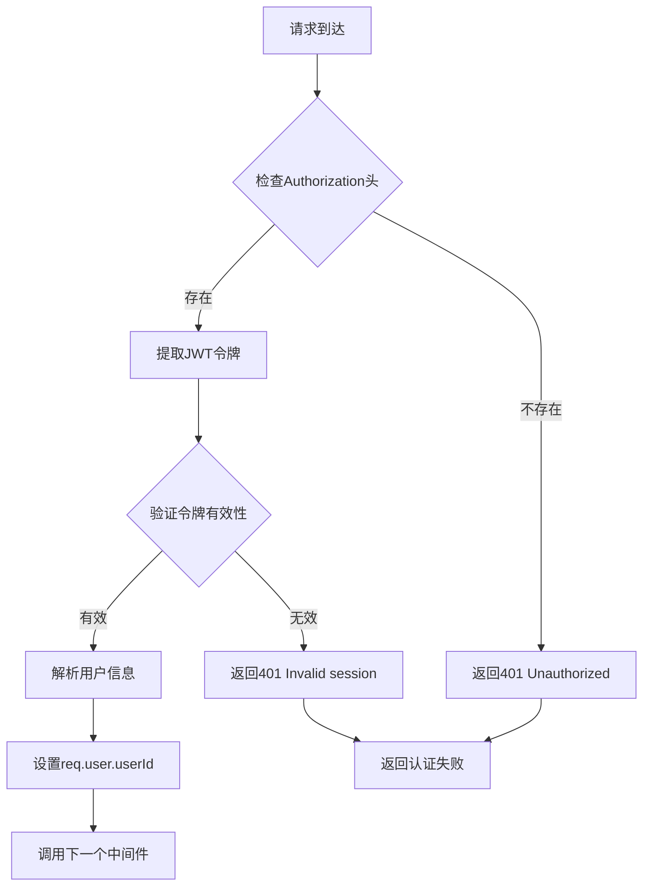
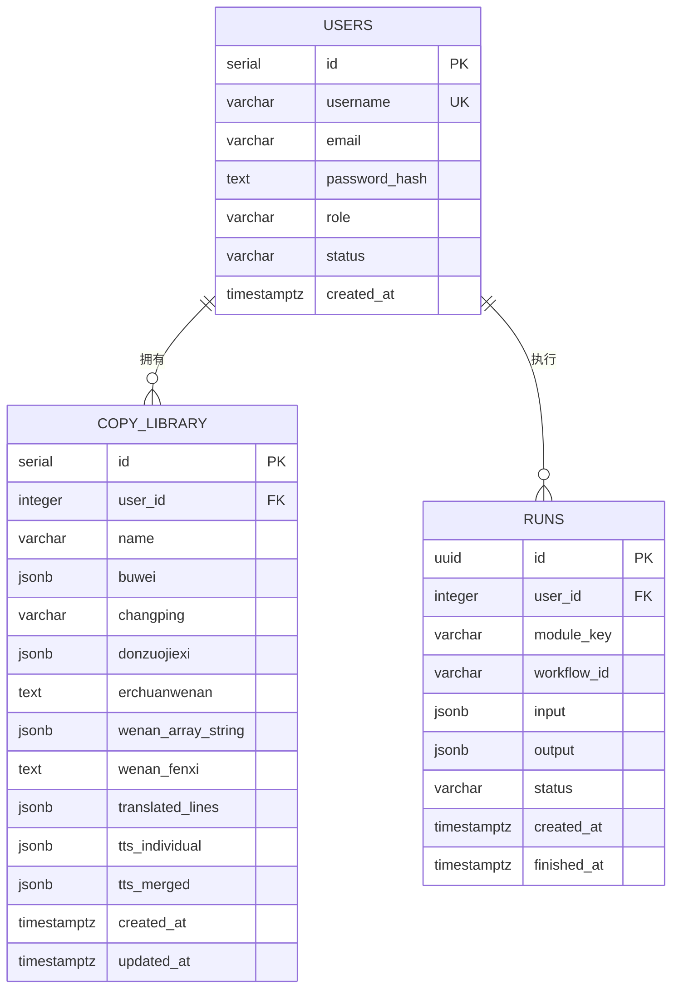
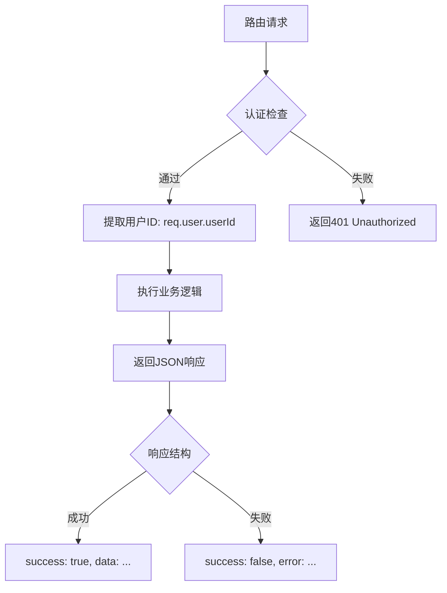
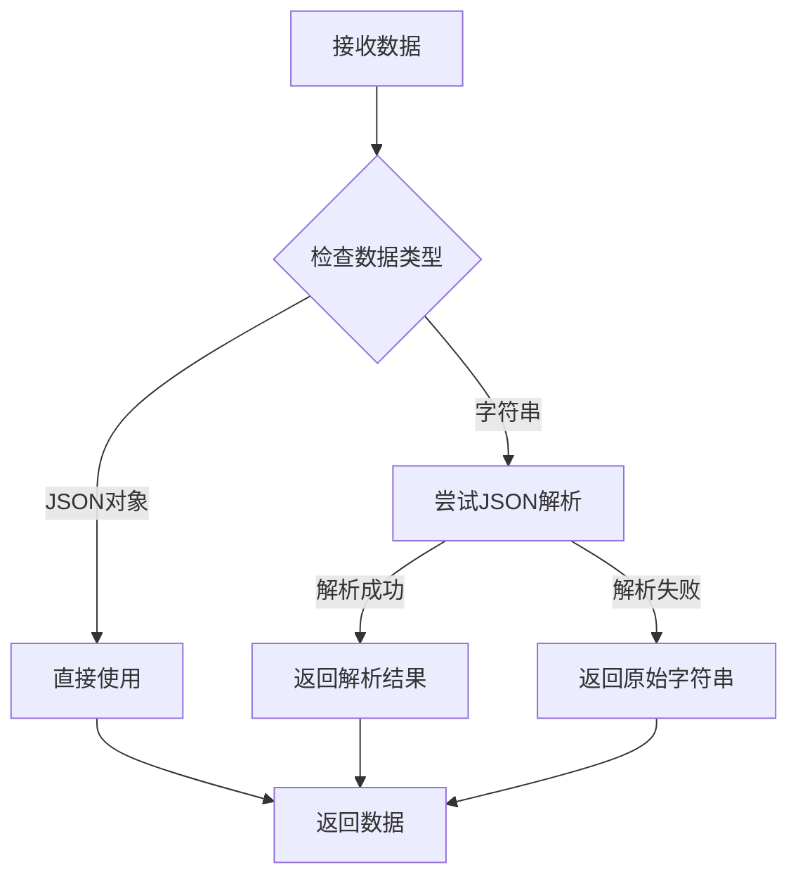
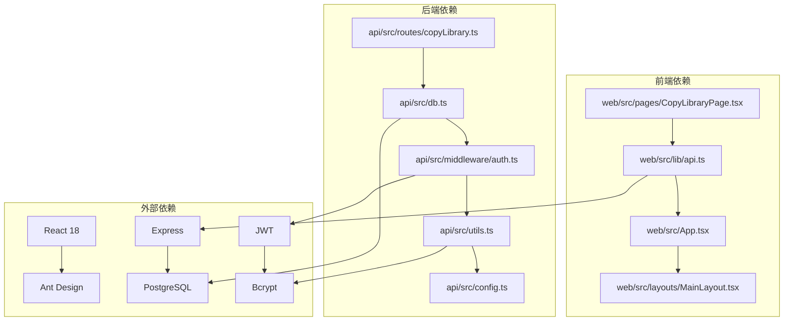

# 复制库系统

<cite>
**本文档引用的文件**
- [api/src/index.ts](file://api/src/index.ts)
- [api/src/routes/copyLibrary.ts](file://api/src/routes/copyLibrary.ts)
- [api/src/db.ts](file://api/src/db.ts)
- [api/src/middleware/auth.ts](file://api/src/middleware/auth.ts)
- [api/src/config.ts](file://api/src/config.ts)
- [api/src/utils.ts](file://api/src/utils.ts)
- [web/src/pages/CopyLibraryPage.tsx](file://web/src/pages/CopyLibraryPage.tsx)
- [web/src/lib/api.ts](file://web/src/lib/api.ts)
- [web/src/App.tsx](file://web/src/App.tsx)
- [web/src/pages/MixCutPage.tsx](file://web/src/pages/MixCutPage.tsx)
- [web/src/pages/ProductCopyPage.tsx](file://web/src/pages/ProductCopyPage.tsx)
- [web/src/layouts/MainLayout.tsx](file://web/src/layouts/MainLayout.tsx)
- [api/package.json](file://api/package.json)
- [web/package.json](file://web/package.json)
</cite>

## 更新摘要
**变更内容**
- 新增四个JSON字段支持：buwei、donzuojiexi、tts_individual、translated_lines
- 实现智能JSON解析逻辑，支持字符串和JSON对象格式
- 改进音频处理功能，支持逐条和合并语音生成
- 认证中间件从 authenticateToken 更新为 authRequired
- 用户ID提取标准化为 userId 字段
- API响应消息国际化为英文
- 路由处理器函数名标准化

## 目录
1. [简介](#简介)
2. [项目结构](#项目结构)
3. [核心组件](#核心组件)
4. [架构概览](#架构概览)
5. [详细组件分析](#详细组件分析)
6. [依赖关系分析](#依赖关系分析)
7. [性能考虑](#性能考虑)
8. [故障排除指南](#故障排除指南)
9. [结论](#结论)

## 简介

复制库系统是一个集成了文案生成、翻译、语音合成和混剪功能的综合内容创作平台。该系统允许用户创建、管理和复用各种类型的文案内容，包括产品文案、视频文案等，并支持将生成的内容直接用于后续的混剪制作。

系统采用前后端分离架构，后端使用Node.js + Express提供RESTful API服务，前端使用React + Ant Design构建用户界面。核心功能围绕"复制库"概念展开，用户可以将生成的文案内容保存到个人库中，便于重复使用和管理。

**更新** 系统现已支持四个新的JSON字段（buwei、donzuojiexi、tts_individual、translated_lines），并实现了智能JSON解析逻辑以支持字符串和JSON对象格式，同时改进了音频处理功能。

## 项目结构

该项目采用清晰的分层架构设计：

**图表来源**
- [api/src/index.ts:1-31](file://api/src/index.ts#L1-L31)
- [web/src/App.tsx:1-74](file://web/src/App.tsx#L1-L74)

系统主要分为三个核心部分：

1. **后端 API 服务**：提供RESTful接口，处理用户认证、数据存储和业务逻辑
2. **前端 Web 应用**：提供用户界面，包含多个功能模块页面
3. **数据库存储**：使用PostgreSQL存储用户数据和文案内容

**章节来源**
- [api/src/index.ts:1-31](file://api/src/index.ts#L1-L31)
- [web/src/App.tsx:1-74](file://web/src/App.tsx#L1-L74)

## 核心组件

### 数据模型

复制库系统的核心数据模型围绕`copy_library`表设计，现已支持五个JSON字段以增强音频和文本处理能力：

**图表来源**
- [api/src/db.ts:34-49](file://api/src/db.ts#L34-L49)

**更新** 新增四个JSON字段支持：
- `buwei`：部位信息数组，支持多部位标注
- `donzuojiexi`：动作解析数组，支持详细的动作描述
- `translated_lines`：翻译行数组，存储翻译后的文本行
- `tts_individual`：逐条语音数组，存储每个文本行的语音数据

### API 接口设计

系统提供完整的CRUD操作接口，支持对复制库内容的增删改查：

| 方法 | 路径 | 功能描述 |
|------|------|----------|
| GET | `/api/copy-library` | 获取用户的所有复制库条目 |
| GET | `/api/copy-library/:id` | 获取指定复制库条目的详情 |
| POST | `/api/copy-library` | 创建新的复制库条目 |
| PUT | `/api/copy-library/:id` | 更新现有的复制库条目 |
| DELETE | `/api/copy-library/:id` | 删除指定的复制库条目 |

**章节来源**
- [api/src/routes/copyLibrary.ts:7-189](file://api/src/routes/copyLibrary.ts#L7-L189)

## 架构概览

系统采用现代化的全栈架构，实现了前后端分离和模块化设计：

**图表来源**
- [api/src/index.ts:12-31](file://api/src/index.ts#L12-L31)
- [web/src/App.tsx:25-70](file://web/src/App.tsx#L25-L70)

### 技术栈

**后端技术栈：**
- Node.js + Express：提供RESTful API服务
- PostgreSQL：关系型数据库存储
- JWT：用户身份认证
- TypeScript：类型安全的开发语言

**前端技术栈：**
- React 18：现代前端框架
- Ant Design：UI组件库
- Vite：构建工具
- TypeScript：类型安全的开发语言

**章节来源**
- [api/package.json:11-35](file://api/package.json#L11-L35)
- [web/package.json:11-25](file://web/package.json#L11-L25)

## 详细组件分析

### 复制库页面组件

复制库页面是系统的核心界面之一，提供了完整的文案管理功能：

**图表来源**
- [web/src/pages/CopyLibraryPage.tsx:11-181](file://web/src/pages/CopyLibraryPage.tsx#L11-L181)
- [web/src/lib/api.ts:166-208](file://web/src/lib/api.ts#L166-L208)

#### 页面功能特性

1. **列表展示**：以卡片网格形式展示所有复制库条目
2. **状态显示**：通过标签显示各类内容的数量统计（部位、动作解析、翻译、语音）
3. **操作功能**：支持创建、删除、使用等功能
4. **导航集成**：可直接跳转到混剪页面使用选中的文案

**更新** 页面现在显示四个新字段的状态：
- 部位（buwei）：显示部位数量
- 动作解析（donzuojiexi）：显示动作解析数量
- 翻译（translated_lines）：显示翻译行数
- 语音（tts_individual）：显示语音条数

**章节来源**
- [web/src/pages/CopyLibraryPage.tsx:18-34](file://web/src/pages/CopyLibraryPage.tsx#L18-L34)
- [web/src/pages/CopyLibraryPage.tsx:63-65](file://web/src/pages/CopyLibraryPage.tsx#L63-L65)

### API 客户端封装

前端通过统一的API客户端封装实现与后端的通信：

**图表来源**
- [web/src/lib/api.ts:13-36](file://web/src/lib/api.ts#L13-L36)
- [api/src/middleware/auth.ts:8-22](file://api/src/middleware/auth.ts#L8-L22)

#### API 客户端特性

1. **统一认证**：自动添加JWT令牌到请求头
2. **错误处理**：统一的HTTP状态码处理
3. **类型安全**：完整的TypeScript类型定义
4. **流式处理**：支持工作流的实时数据传输

**章节来源**
- [web/src/lib/api.ts:9-11](file://web/src/lib/api.ts#L9-L11)
- [web/src/lib/api.ts:13-36](file://web/src/lib/api.ts#L13-L36)

### 认证中间件

系统使用JWT实现用户认证和授权控制：

**图表来源**
- [api/src/middleware/auth.ts:8-22](file://api/src/middleware/auth.ts#L8-L22)

#### 认证流程

1. **令牌提取**：从Authorization头中提取Bearer令牌
2. **令牌验证**：使用JWT密钥验证令牌的有效性
3. **用户信息**：解析令牌中的用户ID和角色信息
4. **权限控制**：将用户信息注入到请求对象中

**更新** 认证中间件已从 `authenticateToken` 更新为 `authRequired`，用户ID提取标准化为 `userId` 字段，API响应消息国际化为英文。

**章节来源**
- [api/src/middleware/auth.ts:8-22](file://api/src/middleware/auth.ts#L8-L22)

### 数据库模式

系统使用PostgreSQL作为数据存储，支持JSONB字段存储复杂的数据结构：

**图表来源**
- [api/src/db.ts:10-51](file://api/src/db.ts#L10-L51)

#### 数据库设计特点

1. **JSONB支持**：使用JSONB字段存储动态数据结构
2. **外键约束**：确保数据完整性和引用一致性
3. **索引优化**：为常用查询字段建立适当的索引
4. **时间戳管理**：自动跟踪记录的创建和更新时间

**更新** 数据库模式现已包含四个新的JSONB字段：
- `buwei`：部位信息数组
- `donzuojiexi`：动作解析数组  
- `translated_lines`：翻译行数组
- `tts_individual`：逐条语音数组

**章节来源**
- [api/src/db.ts:34-49](file://api/src/db.ts#L34-L49)

### 路由处理器函数

复制库路由处理器函数已标准化命名，使用一致的命名模式：

**图表来源**
- [api/src/routes/copyLibrary.ts:8-189](file://api/src/routes/copyLibrary.ts#L8-L189)

#### 路由处理流程

1. **认证检查**：使用 `authRequired` 中间件验证用户身份
2. **用户ID提取**：从 `req.user` 对象中提取标准化的 `userId`
3. **业务逻辑执行**：根据HTTP方法执行相应的数据库操作
4. **响应标准化**：返回统一的成功/失败响应结构

**更新** 路由处理器函数名已标准化，API响应消息已国际化为英文。

**章节来源**
- [api/src/routes/copyLibrary.ts:8-189](file://api/src/routes/copyLibrary.ts#L8-L189)

### 智能JSON解析逻辑

系统实现了智能JSON解析逻辑，支持字符串和JSON对象格式的混合处理：

**图表来源**
- [api/src/routes/copyLibrary.ts:18-36](file://api/src/routes/copyLibrary.ts#L18-L36)

#### 解析逻辑特点

1. **类型检测**：自动检测数据是字符串还是JSON对象
2. **安全解析**：使用try-catch确保解析失败时不会中断
3. **回退机制**：解析失败时返回原始字符串
4. **字段映射**：对特定字段应用解析逻辑

**更新** 新增智能JSON解析逻辑，支持字符串和JSON对象格式的混合处理，确保数据兼容性和可靠性。

**章节来源**
- [api/src/routes/copyLibrary.ts:18-36](file://api/src/routes/copyLibrary.ts#L18-L36)

## 依赖关系分析

系统各组件之间的依赖关系体现了清晰的分层架构：

**图表来源**
- [web/src/pages/CopyLibraryPage.tsx:1-9](file://web/src/pages/CopyLibraryPage.tsx#L1-L9)
- [api/src/routes/copyLibrary.ts:1-5](file://api/src/routes/copyLibrary.ts#L1-L5)

### 关键依赖关系

1. **前端到后端**：页面组件通过API客户端访问后端服务
2. **后端到数据库**：路由层通过数据库连接池访问数据存储
3. **认证到配置**：认证中间件依赖配置文件中的JWT密钥
4. **工具到环境**：工具函数依赖环境变量进行配置

**章节来源**
- [web/src/lib/api.ts:13-36](file://web/src/lib/api.ts#L13-L36)
- [api/src/db.ts:6-8](file://api/src/db.ts#L6-L8)

## 性能考虑

### 数据库优化

1. **索引策略**：为`user_id`和`created_at`字段建立索引以优化查询性能
2. **JSONB查询**：合理使用JSONB字段的查询操作符
3. **连接池管理**：使用连接池减少数据库连接开销

### 前端性能

1. **懒加载**：按需加载大型组件和资源
2. **缓存策略**：合理使用浏览器缓存和内存缓存
3. **虚拟滚动**：对于大量数据的列表使用虚拟滚动技术

### API性能

1. **流式响应**：使用Server-Sent Events处理长时间运行的任务
2. **分页机制**：对于大量数据的查询实现分页
3. **压缩传输**：启用Gzip压缩减少网络传输量

## 故障排除指南

### 常见问题及解决方案

#### 认证相关问题

**问题**：用户登录后仍然提示未认证
**原因**：JWT令牌过期或无效
**解决方案**：
1. 检查JWT密钥配置是否正确
2. 验证令牌格式是否符合Bearer规范
3. 确认令牌未过期

#### 数据库连接问题

**问题**：API请求返回数据库连接错误
**原因**：数据库连接池配置不当或网络问题
**解决方案**：
1. 检查DATABASE_URL配置
2. 验证数据库服务状态
3. 调整连接池大小参数

#### 文件上传问题

**问题**：文件上传失败或超时
**原因**：文件大小限制或网络问题
**解决方案**：
1. 检查文件大小限制配置
2. 验证上传路径权限
3. 确认网络连接稳定性

#### JSON解析问题

**问题**：JSON字段解析失败
**原因**：数据格式不符合预期
**解决方案**：
1. 检查数据格式是否为有效的JSON
2. 验证字段类型是否正确
3. 使用智能解析逻辑进行回退处理

**更新** API响应消息已国际化为英文，错误处理更加标准化。

**章节来源**
- [api/src/middleware/auth.ts:9-21](file://api/src/middleware/auth.ts#L9-L21)
- [api/src/config.ts:5-11](file://api/src/config.ts#L5-L11)

## 结论

复制库系统是一个功能完整、架构清晰的内容创作平台。系统通过模块化的组件设计和清晰的分层架构，实现了从文案生成到内容复用的完整工作流程。

### 主要优势

1. **功能完整性**：涵盖了现代内容创作所需的主要功能
2. **架构清晰**：前后端分离，职责明确
3. **扩展性强**：模块化设计便于功能扩展
4. **用户体验好**：直观的界面设计和流畅的操作体验

### 技术亮点

1. **现代化技术栈**：使用最新的前端和后端技术
2. **类型安全**：完整的TypeScript类型定义
3. **性能优化**：合理的性能考虑和优化策略
4. **安全性**：完善的认证和授权机制
5. **智能数据处理**：支持JSON字段的智能解析和兼容处理

**更新总结** 本次更新反映了系统的最新改进：认证中间件名称标准化、用户ID提取规范化、API响应消息国际化、路由处理器函数名标准化，以及新增的四个JSON字段支持和智能JSON解析逻辑。这些变更显著提升了系统的数据处理能力和用户体验。

该系统为内容创作者提供了一个高效、便捷的工作平台，能够显著提升内容生产的效率和质量。