# 多模态工作流模块

<cite>
**本文引用的文件**
- [api/src/index.ts](file://api/src/index.ts)
- [api/src/config.ts](file://api/src/config.ts)
- [api/src/db.ts](file://api/src/db.ts)
- [api/src/coze.ts](file://api/src/coze.ts)
- [api/src/modules.ts](file://api/src/modules.ts)
- [api/src/middleware/auth.ts](file://api/src/middleware/auth.ts)
- [api/src/routes/auth.ts](file://api/src/routes/auth.ts)
- [api/src/routes/modules.ts](file://api/src/routes/modules.ts)
- [api/src/routes/runs.ts](file://api/src/routes/runs.ts)
- [api/src/routes/files.ts](file://api/src/routes/files.ts)
- [api/src/routes/voice.ts](file://api/src/routes/voice.ts)
- [api/src/routes/audio.ts](file://api/src/routes/audio.ts)
- [api/src/routes/copyLibrary.ts](file://api/src/routes/copyLibrary.ts)
- [web/src/lib/api.ts](file://web/src/lib/api.ts)
- [web/src/components/ResultPanel.tsx](file://web/src/components/ResultPanel.tsx)
- [web/src/pages/DashboardPage.tsx](file://web/src/pages/DashboardPage.tsx)
- [web/src/pages/ProductCopyPage.tsx](file://web/src/pages/ProductCopyPage.tsx)
- [web/src/pages/TranslationPage.tsx](file://web/src/pages/TranslationPage.tsx)
- [web/src/pages/VideoCopyPage.tsx](file://web/src/pages/VideoCopyPage.tsx)
- [web/src/pages/VoiceGeneratorPage.tsx](file://web/src/pages/VoiceGeneratorPage.tsx)
- [web/src/pages/MixCutPage.tsx](file://web/src/pages/MixCutPage.tsx)
</cite>

## 更新摘要
**所做更改**
- 新增音频处理模块章节，包含音频上传、批量上传和混剪功能
- 更新架构总览图，增加音频处理流程
- 新增音频处理接口规范和前端集成示例
- 扩展混剪页面功能说明，展示音频处理在实际场景中的应用
- **新增音频处理调试功能说明，包括详细的日志记录机制和数据格式化改进**

## 目录
1. [简介](#简介)
2. [项目结构](#项目结构)
3. [核心组件](#核心组件)
4. [架构总览](#架构总览)
5. [详细组件分析](#详细组件分析)
6. [依赖分析](#依赖分析)
7. [性能考虑](#性能考虑)
8. [故障排查指南](#故障排查指南)
9. [结论](#结论)
10. [附录](#附录)

## 简介
本项目是一个多模态工作流平台，围绕 Coze AI 工作流引擎构建，提供以下核心能力：
- 图像生成：支持"详情图生成（有/无参考图）"
- 视频处理：从视频中提取文案（支持 URL 与本地上传）
- 文案创作：基于产品信息与模板生成营销文案
- 翻译服务：将中文文案翻译为多语言版本
- 语音合成：对接局域网语音服务，批量生成 MP3 并导出 SRT 字幕
- **音频处理：支持从本地路径读取音频并上传至 Coze，提供批量音频处理能力**
- **混剪功能：整合音频处理与工作流执行，支持口播音频和合并音频的混合剪辑**

系统采用前后端分离架构：前端使用 React + Ant Design，后端使用 Express + PostgreSQL；通过 SSE 流式传输工作流中间结果，实现近实时的用户体验。

## 项目结构
- 后端 API（TypeScript + Express）
  - 路由层：认证、模块查询、任务运行、文件上传、语音服务、音频处理、文案库管理
  - 数据层：PostgreSQL 连接与初始化
  - 配置层：环境变量校验与读取
  - 中间件：鉴权
- 前端 Web（React + Vite）
  - 页面：仪表盘、各功能页、结果面板、混剪页面
  - 工具：统一 API 封装、SSE 读取、文件上传、音频处理

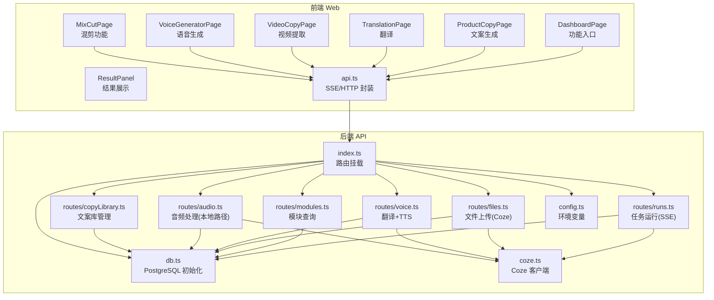

**图表来源**
- [api/src/index.ts:1-33](file://api/src/index.ts#L1-L33)
- [api/src/routes/modules.ts:1-20](file://api/src/routes/modules.ts#L1-L20)
- [api/src/routes/runs.ts:1-159](file://api/src/routes/runs.ts#L1-L159)
- [api/src/routes/files.ts:1-43](file://api/src/routes/files.ts#L1-L43)
- [api/src/routes/voice.ts:1-404](file://api/src/routes/voice.ts#L1-L404)
- [api/src/routes/audio.ts:1-185](file://api/src/routes/audio.ts#L1-L185)
- [api/src/routes/copyLibrary.ts:1-189](file://api/src/routes/copyLibrary.ts#L1-L189)
- [api/src/db.ts:1-35](file://api/src/db.ts#L1-L35)
- [api/src/config.ts:1-19](file://api/src/config.ts#L1-L19)
- [api/src/coze.ts:1-8](file://api/src/coze.ts#L1-L8)
- [web/src/lib/api.ts:1-240](file://web/src/lib/api.ts#L1-L240)
- [web/src/components/ResultPanel.tsx:1-46](file://web/src/components/ResultPanel.tsx#L1-L46)
- [web/src/pages/DashboardPage.tsx:1-108](file://web/src/pages/DashboardPage.tsx#L1-L108)
- [web/src/pages/MixCutPage.tsx:1-370](file://web/src/pages/MixCutPage.tsx#L1-L370)

**章节来源**
- [api/src/index.ts:1-33](file://api/src/index.ts#L1-L33)
- [web/src/lib/api.ts:1-240](file://web/src/lib/api.ts#L1-L240)

## 核心组件
- 模块注册中心：集中管理各工作流模块的元信息（键名、中文名、工作流 ID）
- 任务运行器：接收前端参数，调用 Coze 工作流，以 SSE 流式回传中间结果
- 文件上传代理：将本地文件上传至 Coze 以供工作流使用
- 语音服务：提供独立的翻译与 TTS 能力，支持批量翻译与 MP3+SRT 导出
- **音频处理服务：支持从本地路径读取音频并上传至 Coze，提供批量音频处理能力**
- **混剪功能：整合音频处理与工作流执行，支持口播音频和合并音频的混合剪辑**
- 前端 API 封装：统一封装 SSE 读取、HTTP 请求、鉴权头注入
- 结果面板：通用的结果展示组件，支持复制文本/JSON、进度条、错误提示

**章节来源**
- [api/src/modules.ts:1-29](file://api/src/modules.ts#L1-L29)
- [api/src/routes/runs.ts:55-159](file://api/src/routes/runs.ts#L55-L159)
- [api/src/routes/files.ts:10-40](file://api/src/routes/files.ts#L10-L40)
- [api/src/routes/voice.ts:276-402](file://api/src/routes/voice.ts#L276-L402)
- [api/src/routes/audio.ts:16-185](file://api/src/routes/audio.ts#L16-L185)
- [web/src/lib/api.ts:210-240](file://web/src/lib/api.ts#L210-L240)
- [web/src/components/ResultPanel.tsx:14-43](file://web/src/components/ResultPanel.tsx#L14-L43)

## 架构总览
系统通过"前端页面 → API 层 → Coze 工作流引擎"的链路实现多模态能力。API 层负责：
- 鉴权与会话管理
- 模块元数据查询
- 任务运行（SSE 流）
- 文件上传代理
- 语音翻译与 TTS
- **音频下载与上传代理**
- **混剪工作流执行**

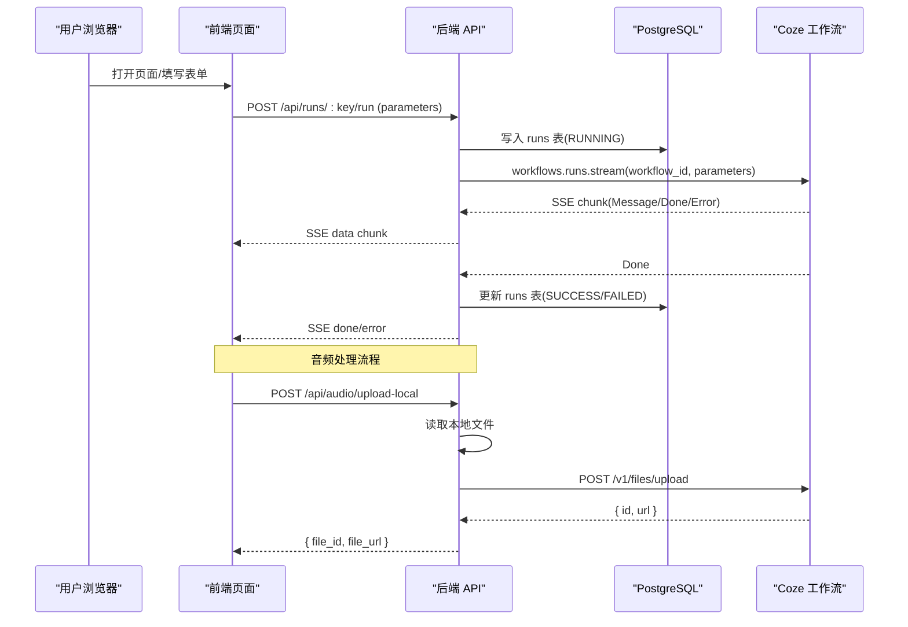

**图表来源**
- [api/src/routes/runs.ts:55-159](file://api/src/routes/runs.ts#L55-L159)
- [api/src/routes/audio.ts:16-97](file://api/src/routes/audio.ts#L16-L97)
- [api/src/coze.ts:4-7](file://api/src/coze.ts#L4-L7)
- [api/src/db.ts:22-32](file://api/src/db.ts#L22-L32)
- [web/src/lib/api.ts:65-115](file://web/src/lib/api.ts#L65-L115)

## 详细组件分析

### 模块与工作流定义
- 模块键名与中文名：用于前端展示与路由匹配
- 工作流 ID：指向 Coze 上的具体工作流实例
- 模块查询接口：返回所有可用模块或指定模块详情

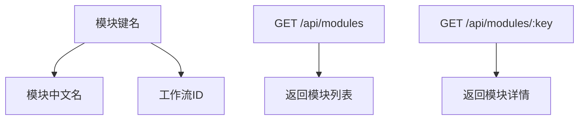

**图表来源**
- [api/src/modules.ts:1-29](file://api/src/modules.ts#L1-L29)
- [api/src/routes/modules.ts:6-17](file://api/src/routes/modules.ts#L6-L17)

**章节来源**
- [api/src/modules.ts:1-29](file://api/src/modules.ts#L1-L29)
- [api/src/routes/modules.ts:1-20](file://api/src/routes/modules.ts#L1-L20)

### 任务运行与 SSE 流
- 接口：POST /api/runs/:key/run
- 参数：parameters（JSON）
- 返回：SSE 流，事件类型包括 data、done、error
- 数据持久化：运行前写入 RUNNING，完成后更新 SUCCESS/FAILED 与 output

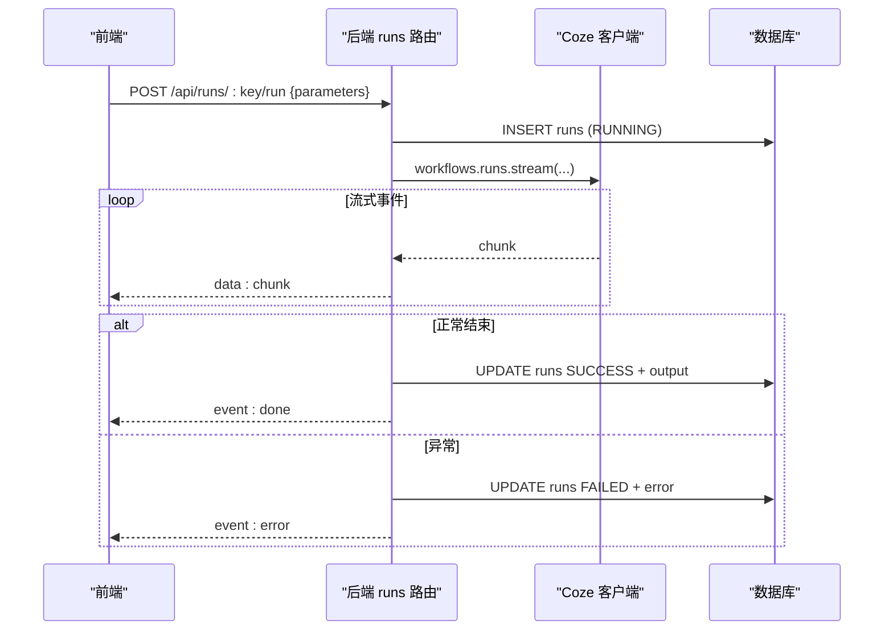

**图表来源**
- [api/src/routes/runs.ts:55-159](file://api/src/routes/runs.ts#L55-L159)
- [web/src/lib/api.ts:65-115](file://web/src/lib/api.ts#L65-L115)

**章节来源**
- [api/src/routes/runs.ts:55-159](file://api/src/routes/runs.ts#L55-L159)
- [web/src/lib/api.ts:58-115](file://web/src/lib/api.ts#L58-L115)

### 文件上传代理（视频/图片等）
- 接口：POST /api/files/upload
- 行为：接收 multipart/form-data，转发至 Coze 文件上传接口
- 用途：将本地文件上传为 Coze 可用的 file_id，供工作流消费

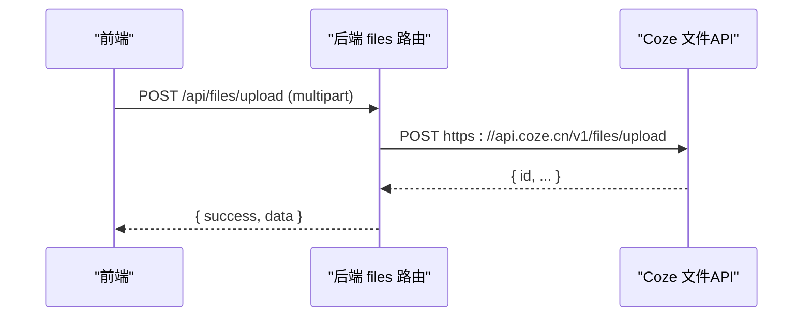

**图表来源**
- [api/src/routes/files.ts:10-40](file://api/src/routes/files.ts#L10-L40)

**章节来源**
- [api/src/routes/files.ts:1-43](file://api/src/routes/files.ts#L1-L43)

### 音频处理服务
**新增** 音频处理模块提供了从本地路径读取音频并上传至 Coze 的完整能力，支持单个和批量音频处理。

#### 单个音频上传
- 接口：POST /api/audio/upload-local
- 参数：{ filePath: string }
- 行为：从 URL 中提取本地路径 → 解码路径 → 读取文件 → 上传至 Coze → 返回 file_id 和 file_url
- 返回：{ success, data: { file_id, file_url, coze_response } }

#### 批量音频上传
- 接口：POST /api/audio/batch-upload-local
- 参数：{ filePaths: string[] }
- 行为：循环处理每个本地路径 → 读取文件 → 上传 → 记录结果和错误
- 返回：{ success, data: { results, errors, total, success_count, error_count } }

**新增** 音频处理模块包含完善的日志记录机制，每个关键步骤都会输出详细的调试信息：

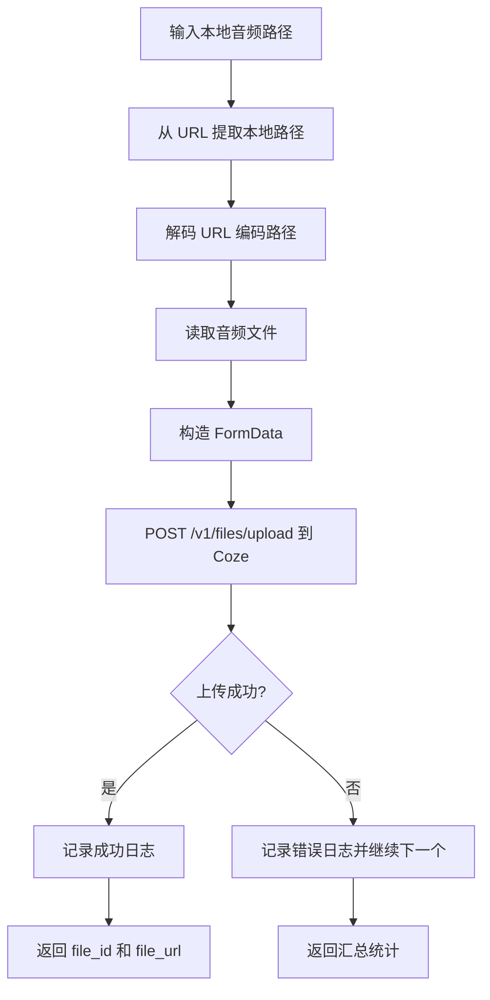

**图表来源**
- [api/src/routes/audio.ts:16-97](file://api/src/routes/audio.ts#L16-L97)
- [api/src/routes/audio.ts:104-185](file://api/src/routes/audio.ts#L104-L185)

**章节来源**
- [api/src/routes/audio.ts:16-185](file://api/src/routes/audio.ts#L16-L185)

### 语音服务（翻译 + TTS）
- 独立翻译：将中文文案按行切分，调用批量翻译工作流，返回英文行数组
- TTS：将英文行数组写入临时文本文件，通过 Gradio Client 调用本地语音服务，批量生成音频并导出 SRT
- **调试：内置调试记录，支持查看中间步骤与错误**

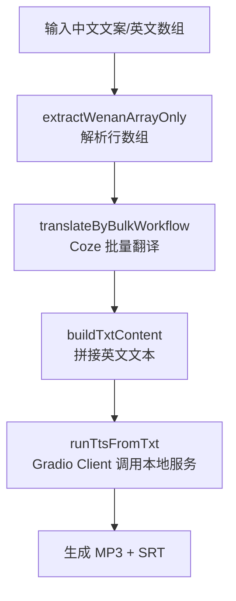

**图表来源**
- [api/src/routes/voice.ts:90-163](file://api/src/routes/voice.ts#L90-L163)
- [api/src/routes/voice.ts:165-207](file://api/src/routes/voice.ts#L165-L207)
- [api/src/routes/voice.ts:211-254](file://api/src/routes/voice.ts#L211-L254)

**章节来源**
- [api/src/routes/voice.ts:276-402](file://api/src/routes/voice.ts#L276-L402)

### 混剪功能（音频处理集成）
**新增** 混剪页面集成了音频处理能力，支持口播音频和合并音频的混合剪辑。

#### 功能特性
- 从文案库导入音频 URL
- **批量上传音频到 Coze 获取 file_id**
- 支口播音频数组和合并音频的混合处理
- 实时进度显示和结果预览

#### 工作流程
1. 用户输入或导入音频 URL
2. **调用批量上传接口获取 file_id**
3. 执行混剪工作流生成最终结果
4. 展示逐条音频和合并音频结果

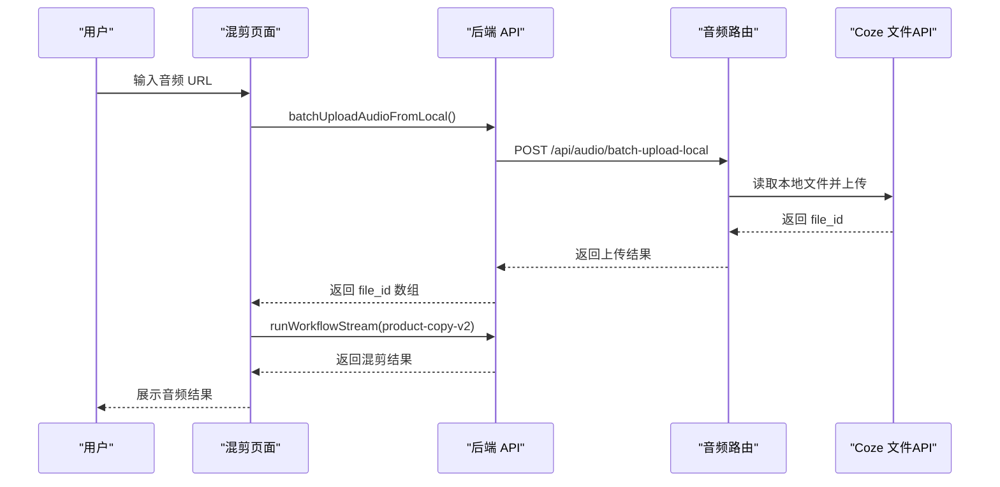

**图表来源**
- [web/src/pages/MixCutPage.tsx:66-161](file://web/src/pages/MixCutPage.tsx#L66-L161)
- [web/src/lib/api.ts:225-240](file://web/src/lib/api.ts#L225-L240)
- [api/src/routes/audio.ts:104-185](file://api/src/routes/audio.ts#L104-L185)

**章节来源**
- [web/src/pages/MixCutPage.tsx:1-370](file://web/src/pages/MixCutPage.tsx#L1-L370)
- [web/src/lib/api.ts:210-240](file://web/src/lib/api.ts#L210-L240)

### 前端页面与交互模式
- 仪表盘：功能入口卡片，跳转到各功能页
- 文案生成页：表单收集产品信息与模板，发起工作流，展示流式结果与 JSON 日志
- 翻译页：表单收集中文文案与目标语言，展示翻译结果
- 视频提取页：支持 URL 与本地上传，自动上传文件并发起工作流
- 语音生成页：展示语音服务配置与调试入口
- **混剪页：支持音频 URL 输入、批量上传、进度显示和结果预览**

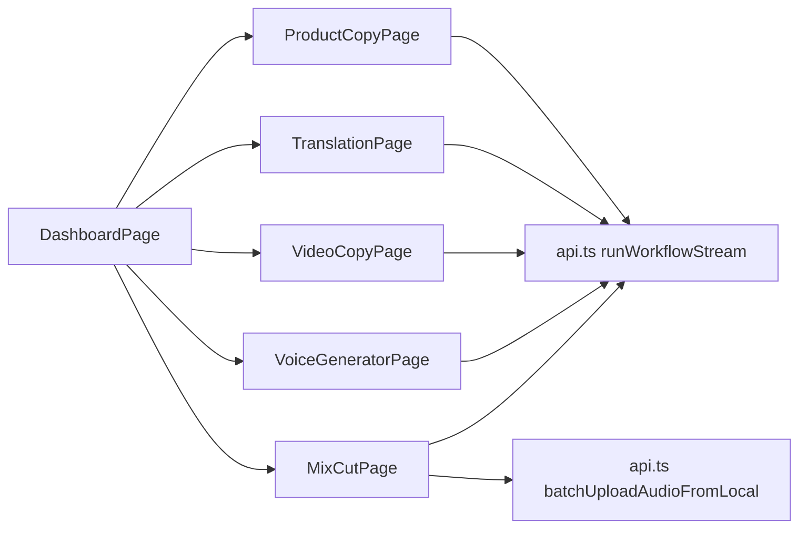

**图表来源**
- [web/src/pages/DashboardPage.tsx:19-103](file://web/src/pages/DashboardPage.tsx#L19-L103)
- [web/src/pages/ProductCopyPage.tsx:31-89](file://web/src/pages/ProductCopyPage.tsx#L31-L89)
- [web/src/pages/TranslationPage.tsx:26-85](file://web/src/pages/TranslationPage.tsx#L26-L85)
- [web/src/pages/VideoCopyPage.tsx:52-125](file://web/src/pages/VideoCopyPage.tsx#L52-L125)
- [web/src/pages/VoiceGeneratorPage.tsx:1-95](file://web/src/pages/VoiceGeneratorPage.tsx#L1-L95)
- [web/src/pages/MixCutPage.tsx:1-370](file://web/src/pages/MixCutPage.tsx#L1-L370)
- [web/src/lib/api.ts:58-115](file://web/src/lib/api.ts#L58-L115)

**章节来源**
- [web/src/pages/DashboardPage.tsx:1-108](file://web/src/pages/DashboardPage.tsx#L1-L108)
- [web/src/pages/ProductCopyPage.tsx:1-249](file://web/src/pages/ProductCopyPage.tsx#L1-L249)
- [web/src/pages/TranslationPage.tsx:1-140](file://web/src/pages/TranslationPage.tsx#L1-L140)
- [web/src/pages/VideoCopyPage.tsx:1-202](file://web/src/pages/VideoCopyPage.tsx#L1-L202)
- [web/src/pages/VoiceGeneratorPage.tsx:1-95](file://web/src/pages/VoiceGeneratorPage.tsx#L1-L95)
- [web/src/pages/MixCutPage.tsx:1-370](file://web/src/pages/MixCutPage.tsx#L1-L370)

## 依赖分析
- 启动依赖
  - Express：Web 框架
  - @coze/api：调用 Coze 工作流
  - multer/node-fetch：文件上传代理
  - @gradio/client：调用本地语音服务
  - pg：PostgreSQL 连接
  - dotenv：环境变量加载
- 前端依赖
  - React + Ant Design：UI 组件库
  - Vite：构建工具

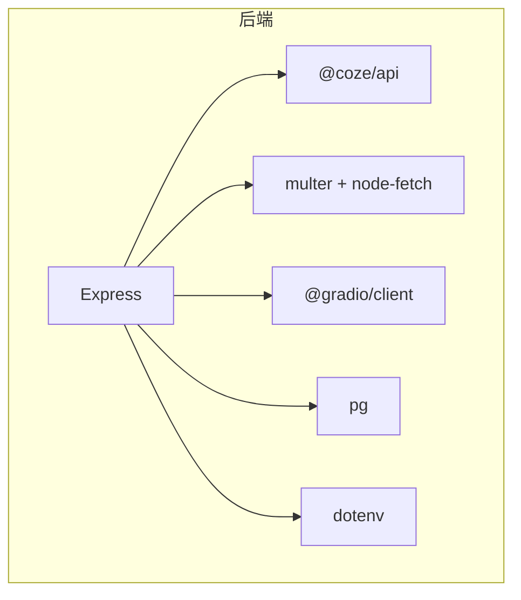

**图表来源**
- [api/src/index.ts:1-33](file://api/src/index.ts#L1-L33)
- [api/src/coze.ts:1-7](file://api/src/coze.ts#L1-L7)
- [api/src/routes/files.ts:1-8](file://api/src/routes/files.ts#L1-L8)
- [api/src/routes/voice.ts:4-8](file://api/src/routes/voice.ts#L4-L8)
- [api/src/db.ts:1-8](file://api/src/db.ts#L1-L8)
- [api/src/config.ts:1-11](file://api/src/config.ts#L1-L11)

**章节来源**
- [api/src/index.ts:1-33](file://api/src/index.ts#L1-L33)
- [api/src/config.ts:1-19](file://api/src/config.ts#L1-L19)

## 性能考虑
- SSE 流式传输：减少一次性响应体积，提升交互体验
- 数据库索引：对 runs 表的 user_id、created_at 建议建立索引以优化查询
- 文件上传：本地上传先经后端代理至 Coze，避免前端直连暴露密钥
- 语音服务：批量处理与临时文件清理，避免磁盘与内存压力
- **音频处理优化**：批量上传时使用并发控制，避免同时大量 HTTP 请求导致资源耗尽
- **缓存策略**：可在前端对常用模块元数据进行缓存，减少重复请求
- **日志优化**：音频处理模块使用结构化日志，便于性能分析和问题追踪

## 故障排查指南
- 401 未授权
  - 前端：清除本地 token，触发登出回调
  - 后端：鉴权中间件校验失败时返回 401
- 任务运行异常
  - 查看 runs 表 status 与 output，区分"部分成功（有输出）"与"完全失败"
  - SSE 错误事件：前端监听 event: error，解析 data 获取错误消息
- 文件上传失败
  - 检查后端日志与 Coze 返回体，确认 token 与文件格式
- 语音服务异常
  - 检查 VOICE_BASE_URL 是否配置
  - 使用 /api/voice/debug 接口查看调试记录，定位步骤与错误
- **音频上传失败**
  - 检查本地路径可访问性和音频格式支持
  - 查看批量上传的错误数组，定位具体失败的路径
  - 确认 Coze 文件上传接口的 Authorization 头正确设置
  - **查看后端日志中的详细调试信息，包括文件大小、上传状态等**

**章节来源**
- [web/src/lib/api.ts:25-28](file://web/src/lib/api.ts#L25-L28)
- [api/src/middleware/auth.ts](file://api/src/middleware/auth.ts)
- [api/src/routes/runs.ts:124-156](file://api/src/routes/runs.ts#L124-L156)
- [api/src/routes/files.ts:28-36](file://api/src/routes/files.ts#L28-L36)
- [api/src/routes/voice.ts:69-86](file://api/src/routes/voice.ts#L69-L86)
- [api/src/routes/voice.ts:256-273](file://api/src/routes/voice.ts#L256-L273)
- [api/src/routes/audio.ts:74-97](file://api/src/routes/audio.ts#L74-L97)

## 结论
本多模态工作流模块通过清晰的模块化设计与 SSE 流式传输，实现了从图像生成、视频文案提取、文案创作到翻译、语音合成和音频处理的完整链路。新增的音频处理模块进一步扩展了多模态能力，特别是混剪功能的集成展示了音频处理在实际业务场景中的应用价值。前后端职责明确，后端统一接入 Coze 与本地语音服务，前端提供直观的交互与结果展示。

**新增的调试功能显著提升了开发体验**：音频处理模块包含详细的日志记录机制，每个关键步骤都会输出结构化调试信息，包括文件读取状态、上传进度、错误详情等，大大提高了问题排查效率。建议在生产环境中加强鉴权、日志与监控，并针对高频路径引入缓存与异步处理以进一步提升性能。

## 附录

### 接口规范与参数说明
- GET /api/modules
  - 返回：模块列表
- GET /api/modules/:key
  - 返回：指定模块详情
- POST /api/runs/:key/run
  - 请求体：{ parameters: Record<string, unknown> }
  - 成功：SSE data chunk；结束：event: done；异常：event: error
  - 数据库：runs 表 status 与 output 字段
- POST /api/files/upload
  - 请求体：multipart/form-data，字段 file
  - 返回：{ success, data: { id, ... } }
- POST /api/voice/translate-lines
  - 请求体：{ text?: string, lines?: string[] }
  - 返回：{ success, data: { sourceLines, translatedLines, txt }, debugId, debugUrl }
- POST /api/voice/tts-from-lines
  - 请求体：{ lines: string[], mode: 'individual' | 'merged' | 'both' }
  - 返回：{ success, data: { lines, mode, results }, debugId, debugUrl }
- GET /api/voice/config
  - 返回：{ success, data: { studioUrl, apiUrl, baseUrl } }
- **POST /api/audio/upload-local**
  - 请求体：{ filePath: string }
  - 返回：{ success, data: { file_id, file_url, coze_response } }
- **POST /api/audio/batch-upload-local**
  - 请求体：{ filePaths: string[] }
  - 返回：{ success, data: { results, errors, total, success_count, error_count } }

**章节来源**
- [api/src/routes/modules.ts:6-17](file://api/src/routes/modules.ts#L6-L17)
- [api/src/routes/runs.ts:55-159](file://api/src/routes/runs.ts#L55-L159)
- [api/src/routes/files.ts:10-40](file://api/src/routes/files.ts#L10-L40)
- [api/src/routes/voice.ts:276-402](file://api/src/routes/voice.ts#L276-L402)
- [api/src/routes/voice.ts:69-86](file://api/src/routes/voice.ts#L69-L86)
- [api/src/routes/audio.ts:16-185](file://api/src/routes/audio.ts#L16-L185)

### 领域模型
- 用户（users）
  - 字段：id, username, email, password_hash, role, status, created_at
- 任务（runs）
  - 字段：id(uuid), user_id(int), module_key, workflow_id, input(jsonb), output(jsonb), status, created_at, finished_at
- **音频文件（audio_files）**
  - 字段：id(uuid), user_id(int), url(string), file_id(string), file_url(string), status(string), created_at(timestamptz)

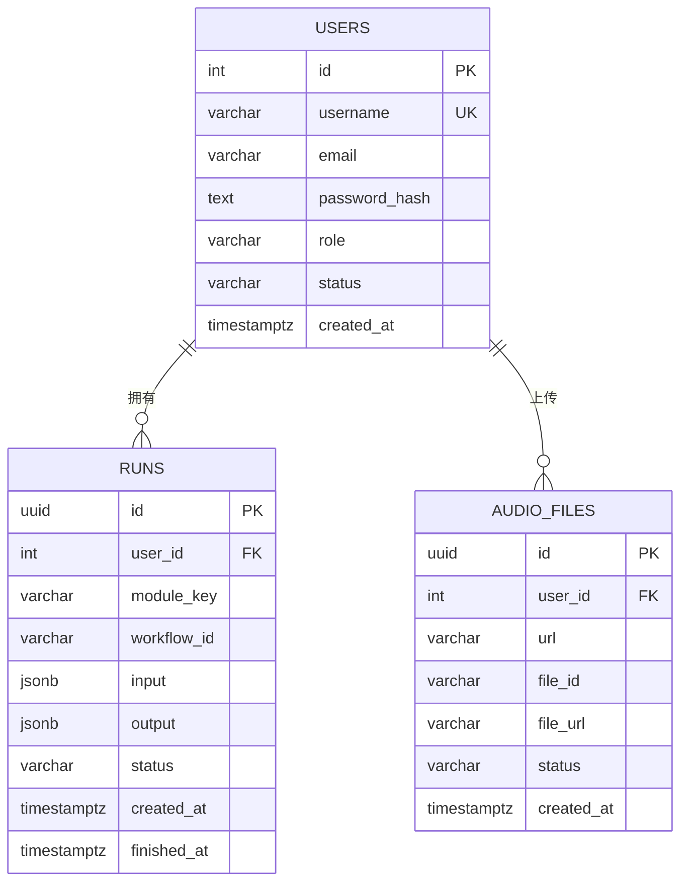

**图表来源**
- [api/src/db.ts:12-32](file://api/src/db.ts#L12-L32)

**章节来源**
- [api/src/db.ts:10-34](file://api/src/db.ts#L10-L34)

### 配置参数
- 必填项
  - COZE_API_TOKEN：Coze API Token
  - DATABASE_URL：PostgreSQL 连接串
  - JWT_SECRET：JWT 密钥
  - VOICE_BASE_URL：本地语音服务基础地址
- 可选项
  - PORT：服务端口，默认 3000

**章节来源**
- [api/src/config.ts:5-19](file://api/src/config.ts#L5-L19)

### 前端 API 函数
- **uploadAudioFromLocal(filePath: string)**：单个音频上传
- **batchUploadAudioFromLocal(filePaths: string[])**：批量音频上传
- **runWorkflowStream(moduleKey, parameters, onMessage, onDone, onError)**：工作流执行
- **getVoiceConfig()**：获取语音服务配置

**章节来源**
- [web/src/lib/api.ts:210-240](file://web/src/lib/api.ts#L210-L240)
- [web/src/lib/api.ts:58-115](file://web/src/lib/api.ts#L58-L115)
- [web/src/lib/api.ts:117-126](file://web/src/lib/api.ts#L117-L126)

### 音频处理调试功能
**新增** 音频处理模块包含完善的调试功能，提供详细的日志记录和数据格式化改进：

#### 日志记录机制
- **文件读取阶段**：记录本地路径、文件大小、读取状态
- **上传阶段**：记录上传进度、Coze 响应状态、错误详情
- **批量处理阶段**：记录每个文件的处理状态、错误原因、成功计数

#### 数据格式化改进
- **结构化日志输出**：使用 JSON 格式记录调试信息，便于解析和分析
- **进度跟踪**：显示当前处理的文件序号和总数量
- **错误分类**：区分文件不存在、上传失败、格式错误等不同类型的错误

#### 调试信息示例
```
[音频处理] Reading local file: C:/audio/example.wav
[音频处理] File size: 1048576 bytes
[音频处理] Uploading to Coze...
[音频处理] Coze upload success: { data: { id: "file_123", url: "https://..." } }
```

**章节来源**
- [api/src/routes/audio.ts:33-97](file://api/src/routes/audio.ts#L33-L97)
- [api/src/routes/audio.ts:123-185](file://api/src/routes/audio.ts#L123-L185)