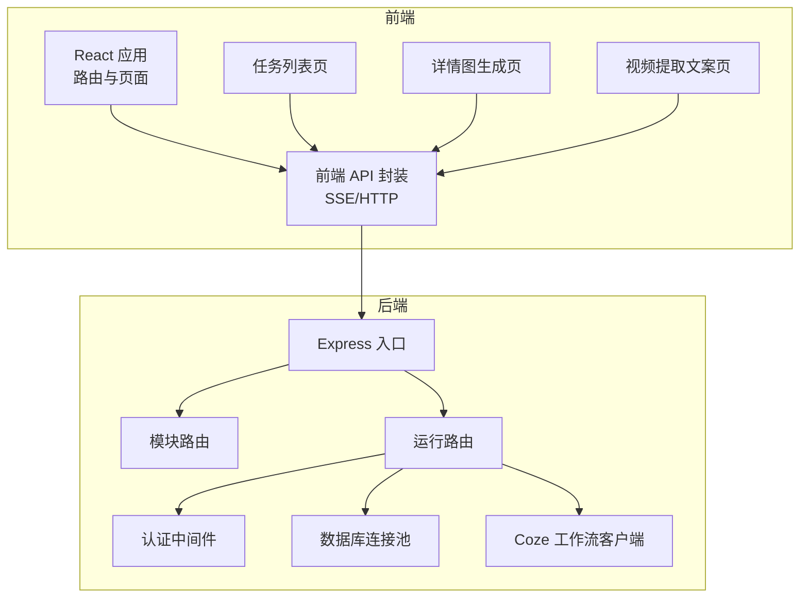
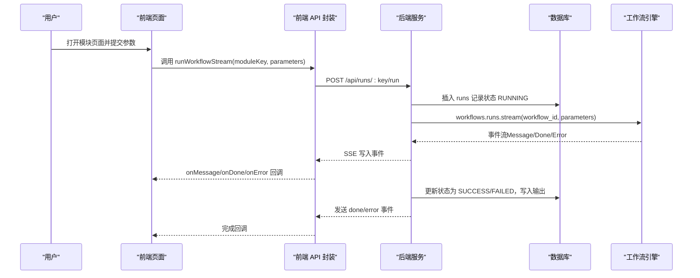
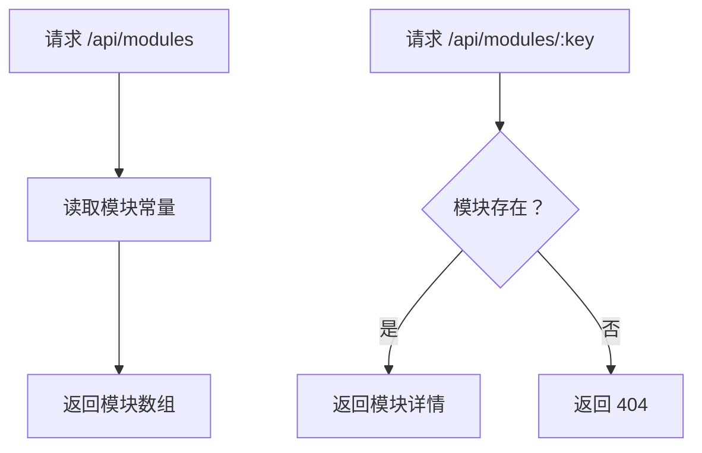
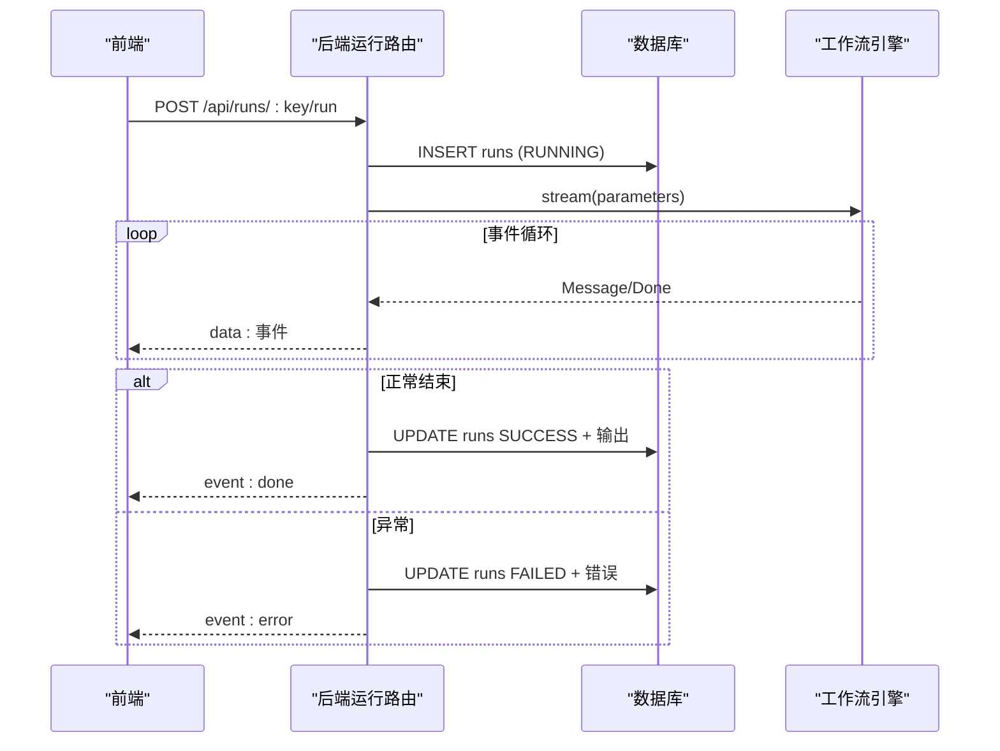
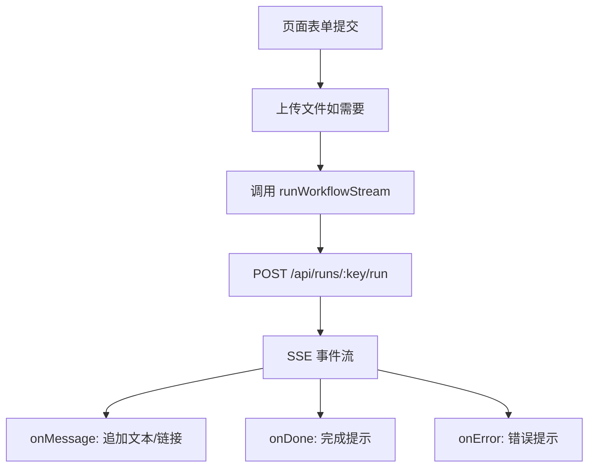
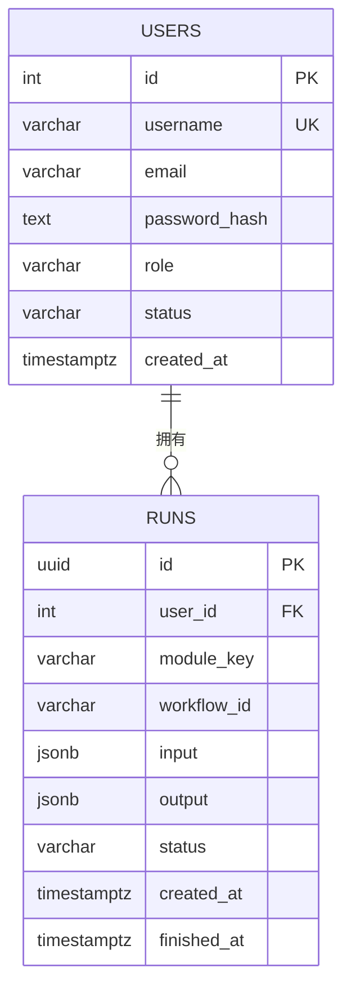
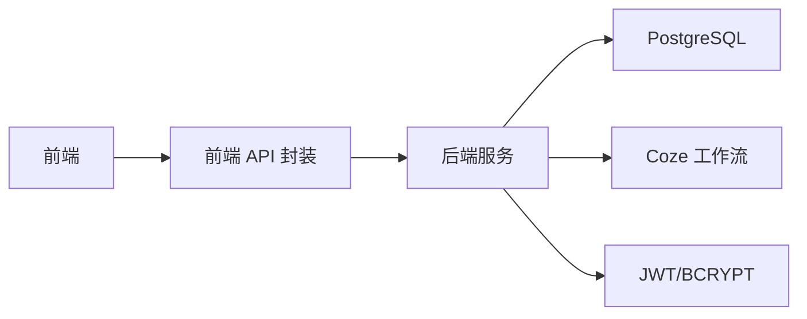

# 工作流管理

<cite>
**本文引用的文件**
- [api/src/modules.ts](file://api/src/modules.ts)
- [api/src/routes/modules.ts](file://api/src/routes/modules.ts)
- [api/src/routes/runs.ts](file://api/src/routes/runs.ts)
- [api/src/db.ts](file://api/src/db.ts)
- [api/src/coze.ts](file://api/src/coze.ts)
- [api/src/middleware/auth.ts](file://api/src/middleware/auth.ts)
- [api/src/index.ts](file://api/src/index.ts)
- [api/src/config.ts](file://api/src/config.ts)
- [api/src/utils.ts](file://api/src/utils.ts)
- [web/src/lib/api.ts](file://web/src/lib/api.ts)
- [web/src/pages/RunsPage.tsx](file://web/src/pages/RunsPage.tsx)
- [web/src/pages/DetailImagePage.tsx](file://web/src/pages/DetailImagePage.tsx)
- [web/src/pages/VideoCopyPage.tsx](file://web/src/pages/VideoCopyPage.tsx)
- [web/src/App.tsx](file://web/src/App.tsx)
</cite>

## 目录
1. [简介](#简介)
2. [项目结构](#项目结构)
3. [核心组件](#核心组件)
4. [架构总览](#架构总览)
5. [详细组件分析](#详细组件分析)
6. [依赖分析](#依赖分析)
7. [性能考虑](#性能考虑)
8. [故障排查指南](#故障排查指南)
9. [结论](#结论)
10. [附录](#附录)

## 简介
本项目提供基于工作流引擎的模块化能力，支持：
- 模块注册与查询（模块元数据、工作流ID）
- 任务运行与状态管理（SSE 流式输出、状态持久化）
- 前端工作流管理界面（任务列表、详情、调试链接解析）
- 生命周期管理（创建、运行、完成/失败）
- 安全认证（JWT 验证）
- 数据持久化（PostgreSQL）

## 项目结构
后端采用 Express + PostgreSQL，前端使用 React + Ant Design。核心路由如下：
- 模块：GET /api/modules、GET /api/modules/:key
- 运行：GET /api/runs、GET /api/runs/:id、POST /api/runs/:key/run
- 认证：中间件校验 JWT
- 数据库：初始化 users、runs 表

图表来源
- [api/src/index.ts:1-29](file://api/src/index.ts#L1-L29)
- [api/src/routes/modules.ts:1-20](file://api/src/routes/modules.ts#L1-L20)
- [api/src/routes/runs.ts:1-159](file://api/src/routes/runs.ts#L1-L159)
- [api/src/middleware/auth.ts:1-23](file://api/src/middleware/auth.ts#L1-L23)
- [api/src/db.ts:1-35](file://api/src/db.ts#L1-L35)
- [api/src/coze.ts:1-8](file://api/src/coze.ts#L1-L8)
- [web/src/lib/api.ts:1-160](file://web/src/lib/api.ts#L1-L160)

章节来源
- [api/src/index.ts:1-29](file://api/src/index.ts#L1-L29)
- [api/src/db.ts:10-35](file://api/src/db.ts#L10-L35)

## 核心组件
- 模块注册与查询
  - 模块常量定义了模块键、名称与对应的工作流ID
  - 提供模块列表与按键查询接口
- 任务运行与状态
  - 创建任务并写入 runs 表（状态 RUNNING）
  - 通过 SSE 流式返回工作流事件，最终标记 SUCCESS/FAILED
  - 任务详情按用户过滤，防止越权
- 前端界面
  - 任务列表页：分页、状态标签、定时刷新
  - 详情弹窗：输入参数、调试链接提取、输出结果
  - 各业务页面：详情图生成、视频提取文案，封装 runWorkflowStream 并处理事件

章节来源
- [api/src/modules.ts:1-29](file://api/src/modules.ts#L1-L29)
- [api/src/routes/modules.ts:6-17](file://api/src/routes/modules.ts#L6-L17)
- [api/src/routes/runs.ts:13-53](file://api/src/routes/runs.ts#L13-L53)
- [api/src/routes/runs.ts:55-157](file://api/src/routes/runs.ts#L55-L157)
- [web/src/pages/RunsPage.tsx:57-179](file://web/src/pages/RunsPage.tsx#L57-L179)
- [web/src/lib/api.ts:58-115](file://web/src/lib/api.ts#L58-L115)

## 架构总览
整体架构分为三层：前端页面层、前端 API 层、后端服务层。后端通过认证中间件保护受控路由，使用数据库持久化任务状态，调用外部工作流引擎进行实际执行。

图表来源
- [web/src/lib/api.ts:58-115](file://web/src/lib/api.ts#L58-L115)
- [api/src/routes/runs.ts:55-157](file://api/src/routes/runs.ts#L55-L157)
- [api/src/db.ts:22-32](file://api/src/db.ts#L22-L32)
- [api/src/coze.ts:4-7](file://api/src/coze.ts#L4-L7)

## 详细组件分析

### 模块注册与查询
- 模块定义
  - 模块键、名称、工作流ID三元组
  - 类型导出用于编译期约束
- 查询接口
  - GET /api/modules 返回所有模块
  - GET /api/modules/:key 返回指定模块，不存在时 404

图表来源
- [api/src/modules.ts:1-29](file://api/src/modules.ts#L1-L29)
- [api/src/routes/modules.ts:6-17](file://api/src/routes/modules.ts#L6-L17)

章节来源
- [api/src/modules.ts:1-29](file://api/src/modules.ts#L1-L29)
- [api/src/routes/modules.ts:6-17](file://api/src/routes/modules.ts#L6-L17)

### 任务运行与状态管理
- 任务创建
  - 校验模块是否存在
  - 参数必填校验
  - 生成 UUID，插入 runs 表，状态 RUNNING
- 流式执行
  - 使用 SSE 向前端推送事件
  - 事件类型：Message、Done、error
  - 成功条件：遇到 Done 或已有有效输出
- 结果落库
  - 成功：状态 SUCCESS，写入输出数组
  - 失败：状态 FAILED，写入错误信息
  - 若中途异常但已有有效输出，仍标记 SUCCESS 并附加 warning

图表来源
- [api/src/routes/runs.ts:55-157](file://api/src/routes/runs.ts#L55-L157)
- [api/src/db.ts:22-32](file://api/src/db.ts#L22-L32)
- [api/src/coze.ts:4-7](file://api/src/coze.ts#L4-L7)

章节来源
- [api/src/routes/runs.ts:55-157](file://api/src/routes/runs.ts#L55-L157)
- [api/src/db.ts:22-32](file://api/src/db.ts#L22-L32)

### 前端工作流管理界面
- 任务列表页
  - 自动刷新（每 5 秒）
  - 分页展示、状态标签、时间格式化
  - 查看按钮打开详情弹窗
  - 详情弹窗解析输出中的调试链接
- 详情图生成页
  - 两种工作流分支（有/无参考图）
  - 并发处理参考图，聚合结果
  - 解析事件中的图片链接并展示
- 视频提取文案页
  - 支持 URL 或本地上传
  - 解析事件输出中的文案内容
- API 封装
  - runWorkflowStream：发起 POST，解析 SSE，回调 onMessage/onDone/onError
  - 统一鉴权头注入

图表来源
- [web/src/pages/DetailImagePage.tsx:105-251](file://web/src/pages/DetailImagePage.tsx#L105-L251)
- [web/src/pages/VideoCopyPage.tsx:52-125](file://web/src/pages/VideoCopyPage.tsx#L52-L125)
- [web/src/lib/api.ts:58-115](file://web/src/lib/api.ts#L58-L115)

章节来源
- [web/src/pages/RunsPage.tsx:57-179](file://web/src/pages/RunsPage.tsx#L57-L179)
- [web/src/pages/DetailImagePage.tsx:105-251](file://web/src/pages/DetailImagePage.tsx#L105-L251)
- [web/src/pages/VideoCopyPage.tsx:52-125](file://web/src/pages/VideoCopyPage.tsx#L52-L125)
- [web/src/lib/api.ts:58-115](file://web/src/lib/api.ts#L58-L115)

### 认证与安全
- 中间件
  - 从 Authorization 头提取 Bearer Token
  - 校验失败返回 401
- 前端
  - 统一在请求头注入 Authorization
  - 401 时清理本地 token 并跳转登录

章节来源
- [api/src/middleware/auth.ts:8-22](file://api/src/middleware/auth.ts#L8-L22)
- [web/src/lib/api.ts:13-36](file://web/src/lib/api.ts#L13-L36)
- [web/src/App.tsx:26-39](file://web/src/App.tsx#L26-L39)

### 数据模型与持久化
- 用户表 users：用户名、邮箱、密码哈希、角色、状态、创建时间
- 任务表 runs：主键 UUID、外键 user_id、模块键、工作流ID、输入/输出 JSONB、状态、创建/完成时间

图表来源
- [api/src/db.ts:12-32](file://api/src/db.ts#L12-L32)

章节来源
- [api/src/db.ts:12-32](file://api/src/db.ts#L12-L32)

## 依赖分析
- 后端依赖
  - Express 路由、CORS、JSON 解析
  - PostgreSQL 连接池
  - JWT、bcrypt 加解密
  - Coze API 客户端
- 前端依赖
  - React 路由、Ant Design UI
  - 自定义 API 封装（含 SSE）

图表来源
- [api/src/index.ts:1-29](file://api/src/index.ts#L1-L29)
- [api/src/config.ts:13-19](file://api/src/config.ts#L13-L19)
- [api/src/utils.ts:14-20](file://api/src/utils.ts#L14-L20)
- [api/src/coze.ts:4-7](file://api/src/coze.ts#L4-L7)
- [web/src/lib/api.ts:1-160](file://web/src/lib/api.ts#L1-L160)

章节来源
- [api/src/index.ts:1-29](file://api/src/index.ts#L1-L29)
- [api/src/config.ts:13-19](file://api/src/config.ts#L13-L19)
- [api/src/utils.ts:14-20](file://api/src/utils.ts#L14-L20)

## 性能考虑
- 流式传输
  - 使用 SSE 实时返回事件，避免长轮询
  - 前端按行解析缓冲，降低内存峰值
- 并发控制
  - 详情图生成支持并发参考图任务，Promise.all 聚合结果
  - 建议根据资源限制调整并发度，避免过度占用
- 数据库
  - runs 表使用 JSONB 存储输入/输出，便于扩展但需注意字段大小
  - 建议对 user_id、module_key、status 建立索引以提升查询性能
- 前端渲染
  - 详情页对大 JSON 的预格式化可能造成卡顿，建议分页/折叠显示
  - 调试链接提取使用集合去重，避免重复渲染

[本节为通用建议，无需特定文件来源]

## 故障排查指南
- 常见错误与定位
  - 401 未登录/登录失效：检查前端是否注入 Authorization，后端 JWT 校验是否通过
  - 404 模块不存在：确认模块键拼写与后端模块常量一致
  - 400 缺少参数：确认前端传入 parameters 对象
  - 失败标记：后端捕获异常并写入 FAILED；若已产生有效输出，标记 SUCCESS 并附加 warning
- 日志与可观测性
  - 后端健康检查：GET /health
  - 前端 API 封装统一处理 401，自动登出
- 调试技巧
  - 详情页弹窗可直接查看 input/output JSON
  - 从输出中提取调试链接，快速定位问题

章节来源
- [api/src/routes/runs.ts:13-29](file://api/src/routes/runs.ts#L13-L29)
- [api/src/routes/runs.ts:55-157](file://api/src/routes/runs.ts#L55-L157)
- [web/src/lib/api.ts:25-28](file://web/src/lib/api.ts#L25-L28)
- [api/src/index.ts:15-17](file://api/src/index.ts#L15-L17)

## 结论
该工作流管理方案以模块化为中心，结合 SSE 实时反馈与数据库持久化，提供了从注册、运行到监控的完整闭环。前端通过统一 API 封装简化了事件处理，后端通过认证与数据模型保障了安全性与可维护性。建议后续在并发控制、索引优化与前端渲染性能方面持续改进。

[本节为总结，无需特定文件来源]

## 附录

### 模块配置数据结构
- 模块元数据
  - 键：模块唯一标识
  - 名称：展示名称
  - 工作流ID：对应外部工作流引擎的 workflow_id
- 参数定义
  - 由各业务页面构造，例如详情图生成的主图/参考图、文案、比例等
- 依赖关系
  - 后端依赖：JWT 校验、数据库连接、Coze 客户端
  - 前端依赖：Ant Design、React Router、自定义 API 封装
- 执行规则
  - 任务创建即 RUNNING，SSE 完成后 SUCCESS，异常则 FAILED
  - 已有有效输出的异常仍视为 SUCCESS 并附加 warning

章节来源
- [api/src/modules.ts:1-29](file://api/src/modules.ts#L1-L29)
- [web/src/pages/DetailImagePage.tsx:105-251](file://web/src/pages/DetailImagePage.tsx#L105-L251)
- [web/src/pages/VideoCopyPage.tsx:52-125](file://web/src/pages/VideoCopyPage.tsx#L52-L125)
- [api/src/routes/runs.ts:55-157](file://api/src/routes/runs.ts#L55-L157)

### 生命周期管理
- 创建：POST /api/runs/:key/run 插入 RUNNING
- 启动：SSE 推送事件流
- 暂停/恢复：当前实现未提供
- 终止：后端未暴露终止接口，可通过前端中断请求（SSE 断开），但不会回滚工作流引擎状态
- 完成：Done 事件或已有有效输出标记 SUCCESS；异常标记 FAILED

章节来源
- [api/src/routes/runs.ts:55-157](file://api/src/routes/runs.ts#L55-L157)

### 扩展与自定义开发指南
- 新增模块
  - 在模块常量中添加条目（键、名称、工作流ID）
  - 在前端页面中新增对应表单与参数映射
  - 如需独立路由，可在后端新增路由并复用 runs 流程
- 接口规范
  - 模块查询：GET /api/modules、GET /api/modules/:key
  - 任务运行：POST /api/runs/:key/run（参数为 JSON 对象）
  - 任务查询：GET /api/runs、GET /api/runs/:id（仅限当前用户）
- 注意事项
  - 参数校验与默认值在前端页面完成，后端仅做存在性检查
  - 输出解析需兼容字符串与 JSON 两种形式

章节来源
- [api/src/modules.ts:1-29](file://api/src/modules.ts#L1-L29)
- [api/src/routes/modules.ts:6-17](file://api/src/routes/modules.ts#L6-L17)
- [api/src/routes/runs.ts:55-157](file://api/src/routes/runs.ts#L55-L157)
- [web/src/pages/DetailImagePage.tsx:105-251](file://web/src/pages/DetailImagePage.tsx#L105-L251)
- [web/src/pages/VideoCopyPage.tsx:52-125](file://web/src/pages/VideoCopyPage.tsx#L52-L125)

### 调度机制、并发控制与资源分配
- 调度机制
  - 后端通过 Coze 客户端触发工作流，前端通过 SSE 接收事件
- 并发控制
  - 详情图生成页面对参考图并发执行，建议根据资源限制调整并发数
- 资源分配
  - 建议为不同模块设置独立队列或速率限制，避免相互影响

章节来源
- [web/src/pages/DetailImagePage.tsx:130-177](file://web/src/pages/DetailImagePage.tsx#L130-L177)
- [api/src/coze.ts:4-7](file://api/src/coze.ts#L4-L7)

### 监控指标、性能统计与故障诊断
- 指标建议
  - 任务成功率、平均耗时、并发度、数据库查询延迟
- 统计方法
  - 基于 runs 表 status、created_at/finished_at 计算
- 故障诊断
  - 401 登录失效：检查前端 token 注入与后端 JWT 校验
  - 404 模块不存在：核对模块键与后端常量
  - 输出为空：检查前端事件解析逻辑与工作流引擎返回

章节来源
- [api/src/routes/runs.ts:13-29](file://api/src/routes/runs.ts#L13-L29)
- [web/src/lib/api.ts:25-28](file://web/src/lib/api.ts#L25-L28)

### 优化建议与运维最佳实践
- 优化建议
  - 前端：对大 JSON 分页/折叠展示；缓存最近任务列表
  - 后端：为 user_id、module_key、status 建索引；限制请求体大小
  - 并发：根据资源情况限制并发任务数
- 运维最佳实践
  - 环境变量：确保 COZE_API_TOKEN、DATABASE_URL、JWT_SECRET、PORT 设置正确
  - 健康检查：定期调用 /health
  - 日志：记录关键事件（任务创建、完成、失败）与异常堆栈

章节来源
- [api/src/config.ts:5-11](file://api/src/config.ts#L5-L11)
- [api/src/index.ts:15-17](file://api/src/index.ts#L15-L17)
- [api/src/db.ts:12-32](file://api/src/db.ts#L12-L32)