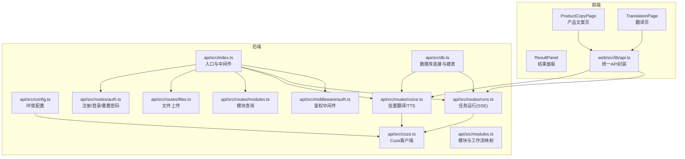
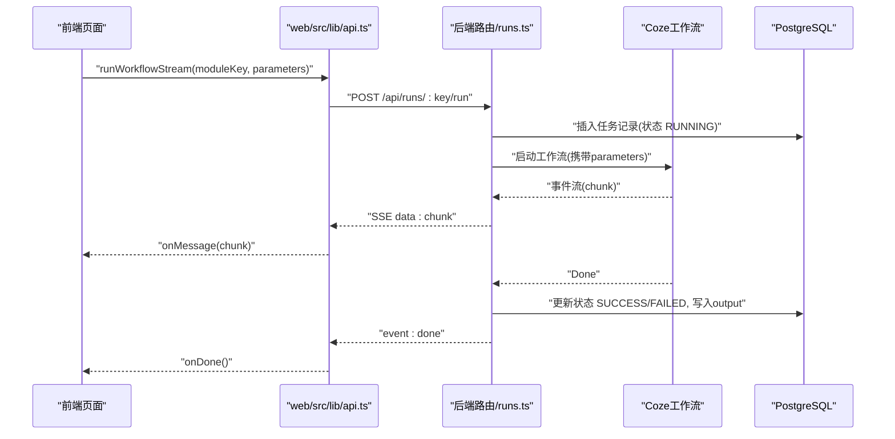
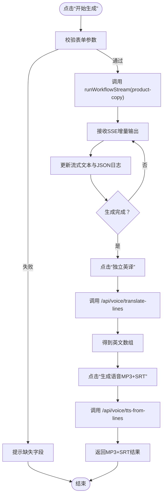
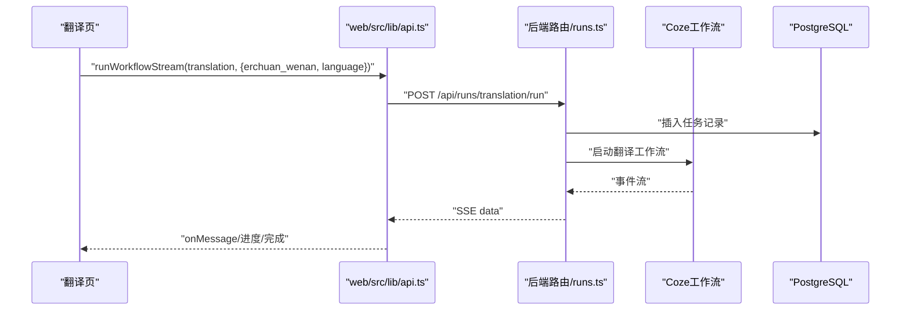
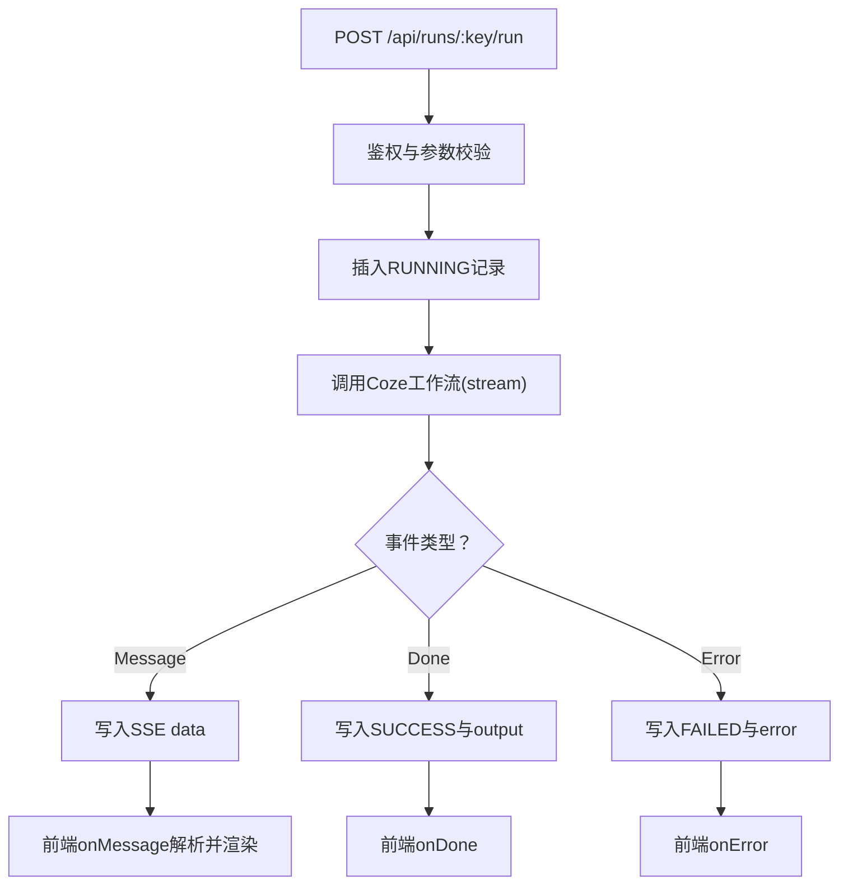
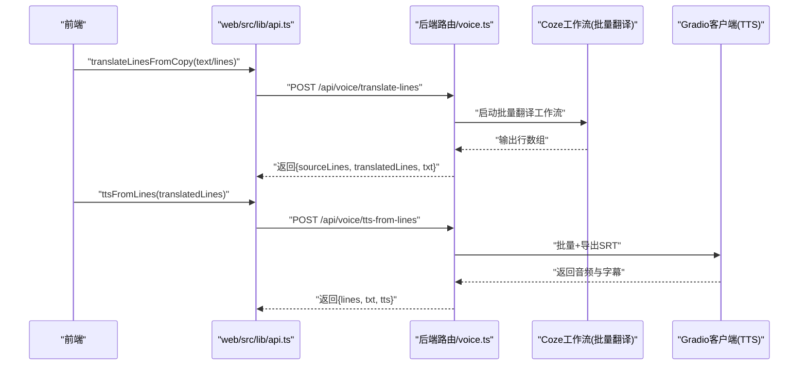
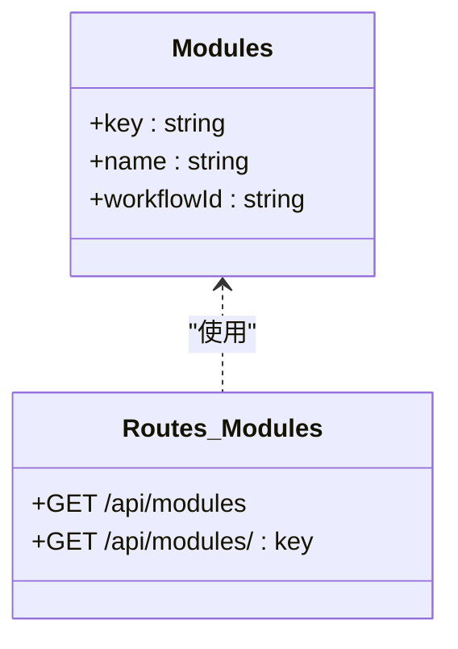
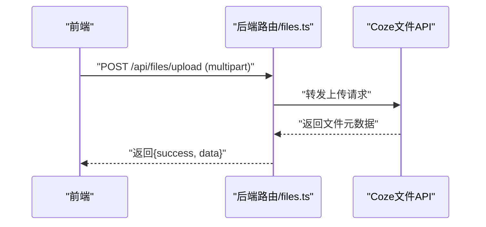
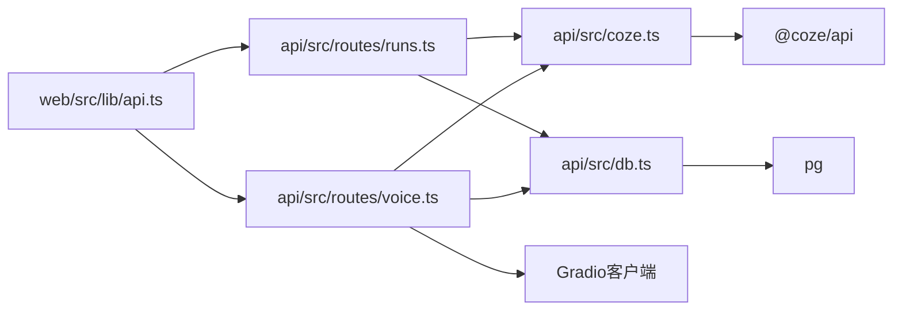

# 文案创作模块

<cite>
**本文引用的文件**
- [api/src/index.ts](file://api/src/index.ts)
- [api/src/config.ts](file://api/src/config.ts)
- [api/src/db.ts](file://api/src/db.ts)
- [api/src/coze.ts](file://api/src/coze.ts)
- [api/src/modules.ts](file://api/src/modules.ts)
- [api/src/middleware/auth.ts](file://api/src/middleware/auth.ts)
- [api/src/utils.ts](file://api/src/utils.ts)
- [api/src/routes/auth.ts](file://api/src/routes/auth.ts)
- [api/src/routes/modules.ts](file://api/src/routes/modules.ts)
- [api/src/routes/runs.ts](file://api/src/routes/runs.ts)
- [api/src/routes/files.ts](file://api/src/routes/files.ts)
- [api/src/routes/voice.ts](file://api/src/routes/voice.ts)
- [web/src/lib/api.ts](file://web/src/lib/api.ts)
- [web/src/pages/ProductCopyPage.tsx](file://web/src/pages/ProductCopyPage.tsx)
- [web/src/pages/TranslationPage.tsx](file://web/src/pages/TranslationPage.tsx)
- [web/src/components/ResultPanel.tsx](file://web/src/components/ResultPanel.tsx)
</cite>

## 目录
1. [简介](#简介)
2. [项目结构](#项目结构)
3. [核心组件](#核心组件)
4. [架构总览](#架构总览)
5. [详细组件分析](#详细组件分析)
6. [依赖关系分析](#依赖关系分析)
7. [性能考虑](#性能考虑)
8. [故障排查指南](#故障排查指南)
9. [结论](#结论)
10. [附录](#附录)

## 简介
本模块提供产品文案创作与翻译服务，覆盖从中文文案生成、模板选择、风格适配，到独立英译、批量翻译、语音合成（MP3+SRT）的完整工作流。系统通过 Coze AI 工作流引擎驱动生成式任务，并以服务器推送事件（SSE）实现实时流式输出；后端使用 PostgreSQL 存储用户与任务运行记录；前端采用 React + Ant Design 提供直观的表单与结果面板。

## 项目结构
- 后端（Node.js + Express）
  - 路由层：认证、模块查询、任务运行（SSE）、文件上传、语音翻译与TTS
  - 业务层：与 Coze API 集成，调用工作流并回写任务状态
  - 数据层：PostgreSQL 连接与初始化
  - 配置：环境变量校验与读取
- 前端（React + Ant Design）
  - 页面：产品文案生成页、翻译页、语音生成页
  - 组件：结果面板（展示流式输出、进度、复制按钮）
  - 工具：统一 API 封装（SSE、鉴权、批量翻译、TTS）

图表来源
- [api/src/index.ts:1-29](file://api/src/index.ts#L1-L29)
- [api/src/routes/runs.ts:1-159](file://api/src/routes/runs.ts#L1-L159)
- [api/src/routes/voice.ts:1-404](file://api/src/routes/voice.ts#L1-L404)
- [api/src/routes/modules.ts:1-20](file://api/src/routes/modules.ts#L1-L20)
- [api/src/routes/files.ts:1-43](file://api/src/routes/files.ts#L1-L43)
- [api/src/routes/auth.ts:1-115](file://api/src/routes/auth.ts#L1-L115)
- [api/src/db.ts:1-35](file://api/src/db.ts#L1-L35)
- [api/src/coze.ts:1-8](file://api/src/coze.ts#L1-L8)
- [api/src/config.ts:1-19](file://api/src/config.ts#L1-L19)
- [web/src/lib/api.ts:1-160](file://web/src/lib/api.ts#L1-L160)
- [web/src/pages/ProductCopyPage.tsx:1-249](file://web/src/pages/ProductCopyPage.tsx#L1-L249)
- [web/src/pages/TranslationPage.tsx:1-140](file://web/src/pages/TranslationPage.tsx#L1-L140)
- [web/src/components/ResultPanel.tsx:1-46](file://web/src/components/ResultPanel.tsx#L1-L46)

章节来源
- [api/src/index.ts:1-29](file://api/src/index.ts#L1-L29)
- [web/src/lib/api.ts:1-160](file://web/src/lib/api.ts#L1-L160)

## 核心组件
- 模块与工作流映射
  - 定义了产品文案生成、翻译、视频文案、详情图生成等模块及其对应 Coze 工作流 ID
- 任务运行（SSE）
  - 支持按模块键启动工作流，实时推送事件流，记录任务状态与输出
- 批量翻译与语音合成
  - 从文案结果中抽取行数组，调用批量翻译工作流，再将英文行数组送入语音合成管线，生成 MP3+SRT
- 前端页面与结果面板
  - 产品文案页：输入产品名、卖点、模板，实时流式展示生成结果
  - 翻译页：输入中文文案与目标语言，实时展示翻译结果
  - 结果面板：展示流式文本、进度条、复制 JSON/文本

章节来源
- [api/src/modules.ts:1-29](file://api/src/modules.ts#L1-L29)
- [api/src/routes/runs.ts:55-159](file://api/src/routes/runs.ts#L55-L159)
- [api/src/routes/voice.ts:276-402](file://api/src/routes/voice.ts#L276-L402)
- [web/src/pages/ProductCopyPage.tsx:13-249](file://web/src/pages/ProductCopyPage.tsx#L13-L249)
- [web/src/pages/TranslationPage.tsx:18-140](file://web/src/pages/TranslationPage.tsx#L18-L140)
- [web/src/components/ResultPanel.tsx:14-46](file://web/src/components/ResultPanel.tsx#L14-L46)

## 架构总览
系统采用前后端分离架构，前端通过统一 API 封装发起请求，后端路由负责鉴权、参数校验、调用 Coze 工作流并回写数据库，最终通过 SSE 将增量输出推送给前端。

图表来源
- [web/src/lib/api.ts:58-115](file://web/src/lib/api.ts#L58-L115)
- [api/src/routes/runs.ts:55-159](file://api/src/routes/runs.ts#L55-L159)
- [api/src/coze.ts:1-8](file://api/src/coze.ts#L1-L8)
- [api/src/db.ts:10-35](file://api/src/db.ts#L10-L35)

## 详细组件分析

### 产品文案生成页面（ProductCopyPage）
- 功能要点
  - 表单字段：产品名称、卖点文案、模板（知识科普/种草推荐/直播带货/强对比）
  - 流程：先生成文案，再独立英译，最后将英文数组交给 TTS 生成 MP3+SRT
  - 实时预览：通过 SSE 接收增量输出，拼接展示
  - 批量处理：将英文数组逐行提交，批量生成并导出 SRT
- 交互设计
  - 三个结果面板：生成结果、独立英译结果、语音任务结果
  - 复制文本/JSON 按钮便于二次编辑与归档
- 错误处理
  - 生成失败、英译失败、TTS 失败均弹窗提示并保留错误文本

图表来源
- [web/src/pages/ProductCopyPage.tsx:31-89](file://web/src/pages/ProductCopyPage.tsx#L31-L89)
- [web/src/pages/ProductCopyPage.tsx:91-118](file://web/src/pages/ProductCopyPage.tsx#L91-L118)
- [web/src/pages/ProductCopyPage.tsx:120-149](file://web/src/pages/ProductCopyPage.tsx#L120-L149)
- [web/src/lib/api.ts:58-115](file://web/src/lib/api.ts#L58-L115)
- [api/src/routes/voice.ts:276-341](file://api/src/routes/voice.ts#L276-L341)
- [api/src/routes/voice.ts:344-402](file://api/src/routes/voice.ts#L344-L402)

章节来源
- [web/src/pages/ProductCopyPage.tsx:13-249](file://web/src/pages/ProductCopyPage.tsx#L13-L249)
- [web/src/components/ResultPanel.tsx:14-46](file://web/src/components/ResultPanel.tsx#L14-L46)
- [web/src/lib/api.ts:58-115](file://web/src/lib/api.ts#L58-L115)

### 翻译页面（TranslationPage）
- 功能要点
  - 输入中文文案与目标语言（英语、印地语、印尼语、越南语、日语、泰语、缅甸语、马来语、韩语）
  - 通过 translation 模块工作流生成翻译结果
  - 实时展示翻译过程与最终文本
- 语言支持
  - 目标语言选项覆盖东南亚与东亚主要语种

图表来源
- [web/src/pages/TranslationPage.tsx:26-85](file://web/src/pages/TranslationPage.tsx#L26-L85)
- [web/src/lib/api.ts:58-115](file://web/src/lib/api.ts#L58-L115)
- [api/src/routes/runs.ts:55-159](file://api/src/routes/runs.ts#L55-L159)

章节来源
- [web/src/pages/TranslationPage.tsx:18-140](file://web/src/pages/TranslationPage.tsx#L18-L140)

### 任务运行与状态管理（SSE）
- 请求流程
  - 前端调用 runWorkflowStream，向 /api/runs/:key/run 发起 POST
  - 后端鉴权后，插入 runs 记录，状态 RUNNING
  - 通过 Coze 工作流启动，将事件流以 SSE 推送
- 完成与错误处理
  - Done 事件：若已有有效输出或 Done 事件，标记为 SUCCESS 并写入 output
  - Error 事件：写入 FAILED 与错误信息
- 数据持久化
  - runs 表保存用户 ID、模块键、工作流 ID、输入参数、输出、状态与时间戳

图表来源
- [api/src/routes/runs.ts:55-159](file://api/src/routes/runs.ts#L55-L159)
- [api/src/db.ts:22-32](file://api/src/db.ts#L22-L32)

章节来源
- [api/src/routes/runs.ts:55-159](file://api/src/routes/runs.ts#L55-L159)
- [api/src/db.ts:10-35](file://api/src/db.ts#L10-L35)

### 批量翻译与语音合成（/api/voice）
- 批量翻译
  - 从文案结果中抽取行数组（支持多种 JSON 形态），调用批量翻译工作流
  - 解析输出，提取英文行数组与合并后的纯文本
- 语音合成
  - 将英文文本写入临时文件，通过 Gradio 客户端调用语音合成管线
  - 支持批量处理与 SRT 导出，最终返回结果与调试信息
- 调试与可观测性
  - 记录调试记录（最大 50 条），包含输入、步骤、结果与错误
  - 提供 /api/voice/debug 与 /api/voice/debug/:id 查询

图表来源
- [web/src/lib/api.ts:128-160](file://web/src/lib/api.ts#L128-L160)
- [api/src/routes/voice.ts:276-402](file://api/src/routes/voice.ts#L276-L402)

章节来源
- [api/src/routes/voice.ts:276-402](file://api/src/routes/voice.ts#L276-L402)

### 模块与工作流映射
- 模块定义
  - 产品文案生成、翻译、视频文案、详情图生成（有/无参考图）
  - 每个模块绑定唯一 workflowId，用于调用 Coze 工作流
- 模块查询
  - GET /api/modules 获取全部模块
  - GET /api/modules/:key 获取指定模块

图表来源
- [api/src/modules.ts:1-29](file://api/src/modules.ts#L1-L29)
- [api/src/routes/modules.ts:1-20](file://api/src/routes/modules.ts#L1-L20)

章节来源
- [api/src/modules.ts:1-29](file://api/src/modules.ts#L1-L29)
- [api/src/routes/modules.ts:1-20](file://api/src/routes/modules.ts#L1-L20)

### 文件上传（详情图参考图上传）
- 功能
  - 前端上传文件至后端，后端转发至 Coze 文件上传接口
- 场景
  - 详情图生成（有参考图）工作流可结合上传的图片进行生成

图表来源
- [api/src/routes/files.ts:10-40](file://api/src/routes/files.ts#L10-L40)

章节来源
- [api/src/routes/files.ts:10-40](file://api/src/routes/files.ts#L10-L40)

## 依赖关系分析
- 外部依赖
  - @coze/api：调用 Coze 工作流与文件上传
  - @gradio/client：调用语音合成管线
  - pg：PostgreSQL 连接与迁移
  - express/cors/multer/dotenv/uuid/jsonwebtoken/bcryptjs：Web 框架、跨域、文件上传、环境变量、ID、鉴权、加密
- 内部耦合
  - routes 层依赖 middleware/auth.ts 进行鉴权
  - routes 层依赖 coze.ts 创建的 Coze 客户端
  - routes 屨依赖 db.ts 的连接池
  - web/src/lib/api.ts 作为前端统一 API 封装，依赖后端路由

图表来源
- [web/src/lib/api.ts:13-36](file://web/src/lib/api.ts#L13-L36)
- [api/src/routes/runs.ts:1-159](file://api/src/routes/runs.ts#L1-L159)
- [api/src/routes/voice.ts:1-404](file://api/src/routes/voice.ts#L1-L404)
- [api/src/coze.ts:1-8](file://api/src/coze.ts#L1-L8)
- [api/src/db.ts:1-35](file://api/src/db.ts#L1-L35)

章节来源
- [api/src/package.json:11-34](file://api/src/package.json#L11-L34)

## 性能考虑
- SSE 流式传输
  - 使用分块解码与缓冲区拼接，避免大块 JSON 导致的解析开销
- 数据库写入
  - 仅在 Done 事件后写入最终 output，减少无效写入
- 任务状态
  - 成功/失败明确区分，便于前端快速反馈与重试策略
- 语音合成
  - 通过 Gradio 客户端批量处理与导出 SRT，提升吞吐量

## 故障排查指南
- 常见错误与定位
  - 缺少参数：模块不存在、缺少 parameters、缺少 lines
  - 登录失效：401 未授权，清除本地 token 并跳转登录
  - 网络异常：Coze 工作流或 Gradio 客户端超时
  - 未提取到行数组：检查 product-copy 输出是否包含 wenan_Array_string
- 调试手段
  - 使用 /api/voice/debug 与 /api/voice/debug/:id 查看调试记录
  - 在 runs 表中查看任务状态与输出
- 前端提示
  - ResultPanel 提供复制文本/JSON，便于粘贴到调试工具进一步分析

章节来源
- [api/src/routes/runs.ts:55-159](file://api/src/routes/runs.ts#L55-L159)
- [api/src/routes/voice.ts:256-273](file://api/src/routes/voice.ts#L256-L273)
- [api/src/db.ts:22-32](file://api/src/db.ts#L22-L32)
- [web/src/components/ResultPanel.tsx:14-46](file://web/src/components/ResultPanel.tsx#L14-L46)

## 结论
该模块通过清晰的前后端职责划分与稳定的 SSE 事件流，实现了从文案生成、翻译到语音合成的全链路自动化。模块化的工作流设计与可扩展的调试体系，使得系统具备良好的可维护性与可观测性。建议在生产环境中加强输入校验与敏感内容过滤，并持续优化 Coze 工作流的稳定性与响应速度。

## 附录

### API 接口文档

- 获取模块列表
  - 方法：GET
  - 路径：/api/modules
  - 认证：否
  - 响应：包含模块数组（key、name、workflowId）
- 获取指定模块
  - 方法：GET
  - 路径：/api/modules/:key
  - 认证：否
  - 响应：模块详情或 404
- 任务运行（SSE）
  - 方法：POST
  - 路径：/api/runs/:key/run
  - 认证：是（Bearer Token）
  - 请求体：parameters（任意对象）
  - 响应：SSE 流，事件类型包括 data、done、error
  - 状态：runs 表记录 RUNNING/SUCCESS/FAILED
- 我的任务列表
  - 方法：GET
  - 路径：/api/runs
  - 认证：是
  - 响应：最近 100 条任务记录
- 我的任务详情
  - 方法：GET
  - 路径：/api/runs/:id
  - 认证：是
  - 响应：指定任务详情
- 文件上传（详情图参考图）
  - 方法：POST
  - 路径：/api/files/upload
  - 认证：是
  - 请求体：multipart/form-data，字段 file
  - 响应：Coze 文件上传结果
- 批量翻译（独立步骤）
  - 方法：POST
  - 路径：/api/voice/translate-lines
  - 认证：是
  - 请求体：text 或 lines（二选一）
  - 响应：{ sourceLines, translatedLines, txt }，并返回调试链接
- 从英文数组生成语音（MP3+SRT）
  - 方法：POST
  - 路径：/api/voice/tts-from-lines
  - 认证：是
  - 请求体：lines（字符串数组）
  - 响应：{ lines, txt, tts }，并返回调试链接
- 语音服务配置
  - 方法：GET
  - 路径：/api/voice/config
  - 认证：是
  - 响应：{ studioUrl, apiUrl, baseUrl }

章节来源
- [api/src/routes/modules.ts:1-20](file://api/src/routes/modules.ts#L1-L20)
- [api/src/routes/runs.ts:13-53](file://api/src/routes/runs.ts#L13-L53)
- [api/src/routes/runs.ts:55-159](file://api/src/routes/runs.ts#L55-L159)
- [api/src/routes/files.ts:10-40](file://api/src/routes/files.ts#L10-L40)
- [api/src/routes/voice.ts:69-86](file://api/src/routes/voice.ts#L69-L86)
- [api/src/routes/voice.ts:276-341](file://api/src/routes/voice.ts#L276-L341)
- [api/src/routes/voice.ts:344-402](file://api/src/routes/voice.ts#L344-L402)

### 文案质量控制与合规建议
- 质量控制
  - 建议在 Coze 工作流中增加“风格一致性”“目标受众适配”等参数校验
  - 对输出进行关键词匹配与重复度检测，必要时引入外部审核
- 重复检测
  - 可在后端对 runs.output 去重或基于指纹比对
- 敏感内容过滤
  - 在生成前对输入参数进行黑名单过滤，在生成后对输出进行合规扫描
- 创意指导
  - 模板选择应与品牌调性一致，卖点文案需突出差异化优势
  - 翻译时保持语义准确与文化适应，避免直译导致的歧义

### 最佳实践
- 前端
  - 使用 ResultPanel 统一展示流式输出与进度
  - 对 SSE 错误进行降级处理，保证用户体验
- 后端
  - 对 Coze 返回的事件进行严格解析与容错
  - 限制并发与资源消耗，避免单任务拖垮系统
- 集成
  - 明确模块键与工作流 ID 的映射关系，便于扩展与替换
  - 通过调试接口快速定位问题，避免线上事故扩大