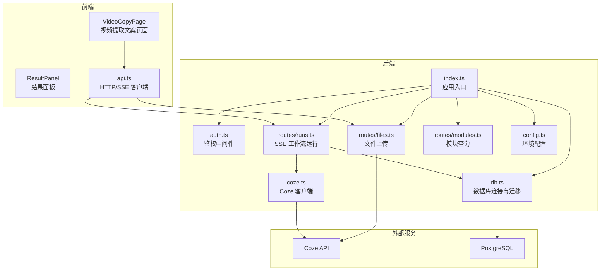
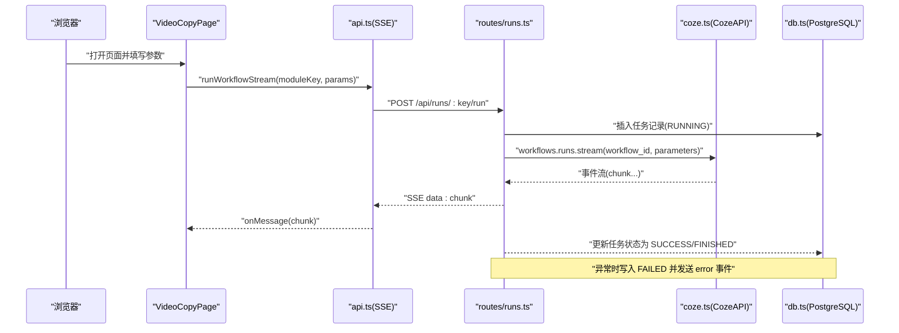
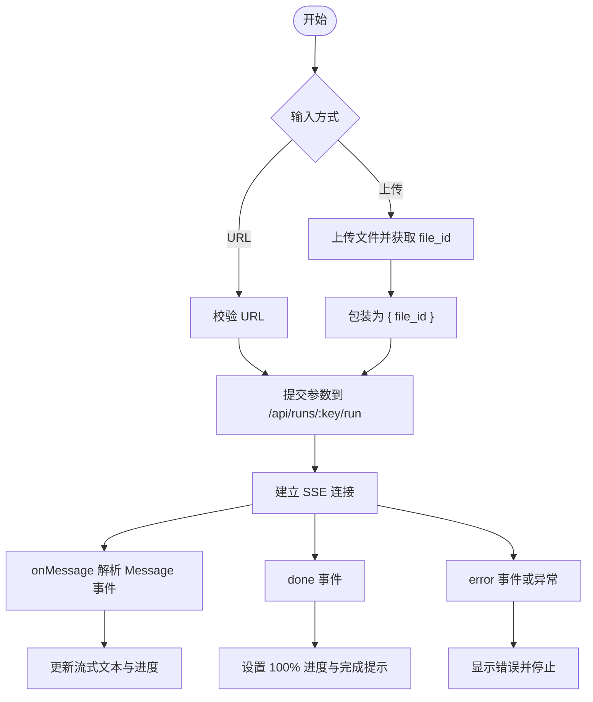
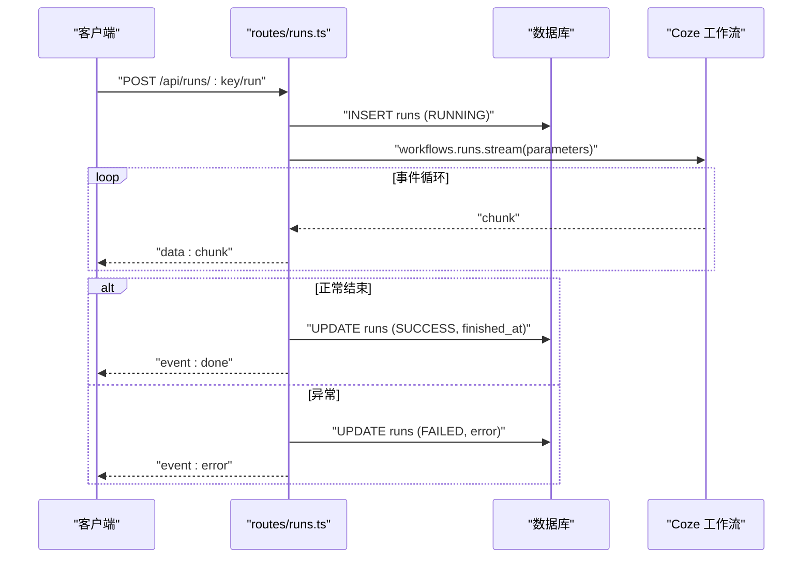
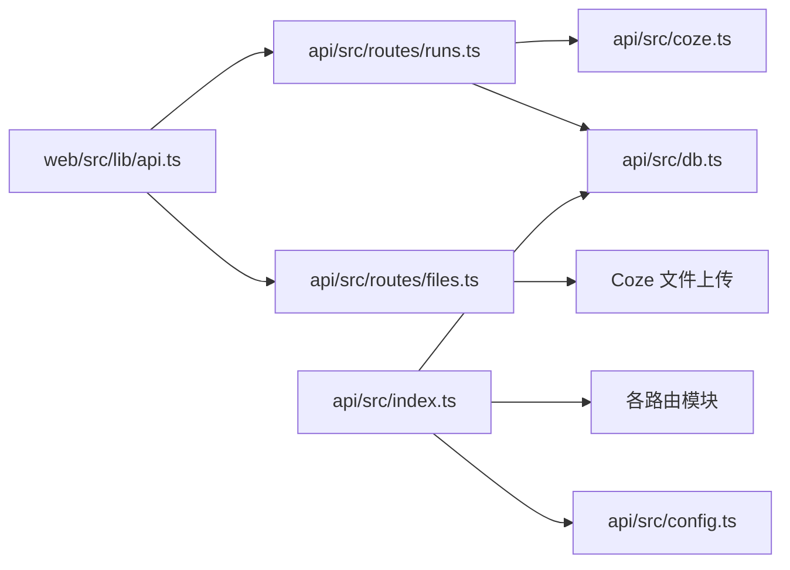
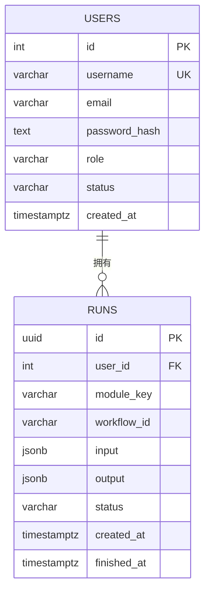

# 视频处理模块

<cite>
**本文引用的文件**
- [api/src/index.ts](file://api/src/index.ts)
- [api/src/config.ts](file://api/src/config.ts)
- [api/src/db.ts](file://api/src/db.ts)
- [api/src/middleware/auth.ts](file://api/src/middleware/auth.ts)
- [api/src/utils.ts](file://api/src/utils.ts)
- [api/src/coze.ts](file://api/src/coze.ts)
- [api/src/modules.ts](file://api/src/modules.ts)
- [api/src/routes/modules.ts](file://api/src/routes/modules.ts)
- [api/src/routes/files.ts](file://api/src/routes/files.ts)
- [api/src/routes/runs.ts](file://api/src/routes/runs.ts)
- [web/src/pages/VideoCopyPage.tsx](file://web/src/pages/VideoCopyPage.tsx)
- [web/src/components/ResultPanel.tsx](file://web/src/components/ResultPanel.tsx)
- [web/src/lib/api.ts](file://web/src/lib/api.ts)
</cite>

## 目录
1. [简介](#简介)
2. [项目结构](#项目结构)
3. [核心组件](#核心组件)
4. [架构总览](#架构总览)
5. [详细组件分析](#详细组件分析)
6. [依赖关系分析](#依赖关系分析)
7. [性能考虑](#性能考虑)
8. [故障排查指南](#故障排查指南)
9. [结论](#结论)
10. [附录](#附录)

## 简介
本文件面向“视频处理模块”的实现与使用，重点覆盖以下方面：
- 视频处理工作流：视频上传、转码、特效处理、导出等核心流程的端到端说明
- 前端页面组件架构：视频预览、参数调整、进度监控、结果展示与下载
- 配置参数：分辨率、帧率、编码格式、压缩比等参数在当前仓库中的映射与使用
- API 调用示例与响应格式：基于现有接口的调用路径与返回结构
- 异步处理机制与状态管理：SSE 流式传输、任务状态持久化与前端进度联动
- 错误处理策略：格式不支持、处理失败重试、内存不足等场景的应对
- 性能优化与资源管理：并发控制、缓存策略、资源释放与超时设置

注意：当前仓库中“视频处理”以“视频提取文案”工作流为核心示例，涉及视频 URL 输入与本地上传两种输入方式；实际视频转码与特效处理由后端对接第三方服务（如 Coze）执行。本文将结合现有代码对上述主题进行系统化说明。

## 项目结构
该工程采用前后端分离架构：
- 后端（Node.js + Express）：提供认证、文件上传、工作流运行（SSE）、任务查询等接口
- 前端（React + Ant Design）：提供视频提取文案页面、结果面板与交互逻辑
- 数据库（PostgreSQL）：存储用户信息与任务运行记录
- 第三方服务：通过 Coze API 执行工作流（含视频相关模块）

图表来源
- [api/src/index.ts:1-29](file://api/src/index.ts#L1-L29)
- [api/src/routes/runs.ts:55-159](file://api/src/routes/runs.ts#L55-L159)
- [api/src/routes/files.ts:10-43](file://api/src/routes/files.ts#L10-L43)
- [api/src/routes/modules.ts:6-20](file://api/src/routes/modules.ts#L6-L20)
- [api/src/coze.ts:1-8](file://api/src/coze.ts#L1-L8)
- [api/src/db.ts:10-35](file://api/src/db.ts#L10-L35)
- [api/src/config.ts:13-19](file://api/src/config.ts#L13-L19)
- [web/src/pages/VideoCopyPage.tsx:29-202](file://web/src/pages/VideoCopyPage.tsx#L29-L202)
- [web/src/components/ResultPanel.tsx:14-46](file://web/src/components/ResultPanel.tsx#L14-L46)
- [web/src/lib/api.ts:58-115](file://web/src/lib/api.ts#L58-L115)

章节来源
- [api/src/index.ts:1-29](file://api/src/index.ts#L1-L29)
- [api/src/config.ts:13-19](file://api/src/config.ts#L13-L19)
- [api/src/db.ts:10-35](file://api/src/db.ts#L10-L35)
- [api/src/middleware/auth.ts:8-22](file://api/src/middleware/auth.ts#L8-L22)
- [api/src/utils.ts:14-20](file://api/src/utils.ts#L14-L20)
- [api/src/coze.ts:1-8](file://api/src/coze.ts#L1-L8)
- [api/src/modules.ts:1-29](file://api/src/modules.ts#L1-L29)
- [api/src/routes/modules.ts:6-20](file://api/src/routes/modules.ts#L6-L20)
- [api/src/routes/files.ts:10-43](file://api/src/routes/files.ts#L10-L43)
- [api/src/routes/runs.ts:55-159](file://api/src/routes/runs.ts#L55-L159)
- [web/src/pages/VideoCopyPage.tsx:29-202](file://web/src/pages/VideoCopyPage.tsx#L29-L202)
- [web/src/components/ResultPanel.tsx:14-46](file://web/src/components/ResultPanel.tsx#L14-L46)
- [web/src/lib/api.ts:13-36](file://web/src/lib/api.ts#L13-L36)

## 核心组件
- 后端应用入口与路由挂载：负责启动服务、启用 CORS、解析 JSON、挂载各路由模块
- 认证中间件与工具：提供 JWT 鉴权、密码哈希与校验
- 数据库与迁移：PostgreSQL 连接池与表结构初始化（用户、任务）
- 模块注册：定义可用模块及其工作流 ID（含视频相关模块）
- 文件上传：本地上传文件经后端转发至第三方文件服务
- 工作流运行：通过 SSE 将第三方工作流事件流式返回给前端
- 前端页面与组件：视频提取文案页面、结果面板、SSE 客户端封装

章节来源
- [api/src/index.ts:1-29](file://api/src/index.ts#L1-L29)
- [api/src/middleware/auth.ts:8-22](file://api/src/middleware/auth.ts#L8-L22)
- [api/src/utils.ts:5-20](file://api/src/utils.ts#L5-L20)
- [api/src/db.ts:6-35](file://api/src/db.ts#L6-L35)
- [api/src/modules.ts:1-29](file://api/src/modules.ts#L1-L29)
- [api/src/routes/files.ts:10-43](file://api/src/routes/files.ts#L10-L43)
- [api/src/routes/runs.ts:55-159](file://api/src/routes/runs.ts#L55-L159)
- [web/src/pages/VideoCopyPage.tsx:29-202](file://web/src/pages/VideoCopyPage.tsx#L29-L202)
- [web/src/components/ResultPanel.tsx:14-46](file://web/src/components/ResultPanel.tsx#L14-L46)
- [web/src/lib/api.ts:58-115](file://web/src/lib/api.ts#L58-L115)

## 架构总览
下图展示了从浏览器到第三方服务的完整链路，以及任务状态在数据库中的持久化：

图表来源
- [web/src/pages/VideoCopyPage.tsx:93-118](file://web/src/pages/VideoCopyPage.tsx#L93-L118)
- [web/src/lib/api.ts:58-115](file://web/src/lib/api.ts#L58-L115)
- [api/src/routes/runs.ts:55-159](file://api/src/routes/runs.ts#L55-L159)
- [api/src/coze.ts:4-7](file://api/src/coze.ts#L4-L7)
- [api/src/db.ts:22-32](file://api/src/db.ts#L22-L32)

## 详细组件分析

### 前端页面：视频提取文案（VideoCopyPage）
- 功能概览
  - 支持两种输入：视频 URL 与本地上传
  - 表单包含语言选择、输入方式切换、文件上传控件
  - 使用 SSE 接收实时事件，逐步更新进度与结果
  - 结果面板展示流式输出、JSON 明细、复制按钮与进度条
- 关键交互
  - URL 模式：直接将 URL 作为 input 参数提交
  - 上传模式：先调用文件上传接口获取 file_id，再以 { file_id } 形式提交
  - SSE 回调：解析 Message 事件中的 content 字段，拼接到流式文本；done 事件表示完成
- 状态管理
  - 本地状态：streamText、jsonText、progress、errorText、loading
  - 进度推进：URL 模式 25%、上传模式 30%、SSE 过程中每条消息约 +8%，最后 100%

图表来源
- [web/src/pages/VideoCopyPage.tsx:52-125](file://web/src/pages/VideoCopyPage.tsx#L52-L125)
- [web/src/lib/api.ts:58-115](file://web/src/lib/api.ts#L58-L115)

章节来源
- [web/src/pages/VideoCopyPage.tsx:29-202](file://web/src/pages/VideoCopyPage.tsx#L29-L202)
- [web/src/components/ResultPanel.tsx:14-46](file://web/src/components/ResultPanel.tsx#L14-L46)
- [web/src/lib/api.ts:58-115](file://web/src/lib/api.ts#L58-L115)

### 前端组件：结果面板（ResultPanel）
- 展示内容：标题、复制按钮、进度条、加载提示、错误提示、流式文本区域
- 交互：支持复制文本与 JSON，进度条随任务推进更新

章节来源
- [web/src/components/ResultPanel.tsx:14-46](file://web/src/components/ResultPanel.tsx#L14-L46)

### 后端：SSE 工作流运行（routes/runs.ts）
- 路由行为
  - 校验模块是否存在，构造 runId，写入 RUNNING 状态
  - 通过 Coze 客户端发起工作流流式运行，逐条向客户端推送事件
  - 成功完成后写入 SUCCESS 与完成时间；异常时根据是否有有效输出决定 SUCCESS+warning 或 FAILED
- 事件协议
  - data: JSON 文本块
  - event: done/error（标准兼容）
- 数据持久化
  - runs 表保存 input、output、status、created_at、finished_at

图表来源
- [api/src/routes/runs.ts:55-159](file://api/src/routes/runs.ts#L55-L159)
- [api/src/db.ts:22-32](file://api/src/db.ts#L22-L32)
- [api/src/coze.ts:4-7](file://api/src/coze.ts#L4-L7)

章节来源
- [api/src/routes/runs.ts:55-159](file://api/src/routes/runs.ts#L55-L159)
- [api/src/db.ts:22-32](file://api/src/db.ts#L22-L32)

### 后端：文件上传（routes/files.ts）
- 功能：接收前端上传的文件，转发到第三方文件服务并返回文件元数据
- 注意：当前实现为通用文件上传，视频处理模块中用于本地上传场景

章节来源
- [api/src/routes/files.ts:10-43](file://api/src/routes/files.ts#L10-L43)

### 后端：模块注册与查询（modules.ts、routes/modules.ts）
- modules.ts：定义模块键、名称与对应工作流 ID
- routes/modules.ts：提供模块列表与单个模块查询接口

章节来源
- [api/src/modules.ts:1-29](file://api/src/modules.ts#L1-L29)
- [api/src/routes/modules.ts:6-20](file://api/src/routes/modules.ts#L6-L20)

### 后端：认证与工具（middleware/auth.ts、utils.ts）
- 鉴权中间件：从 Authorization 头解析 Bearer Token，校验失败返回 401
- 工具函数：JWT 签发与校验、密码哈希与校验

章节来源
- [api/src/middleware/auth.ts:8-22](file://api/src/middleware/auth.ts#L8-L22)
- [api/src/utils.ts:5-20](file://api/src/utils.ts#L5-L20)

### 后端：应用入口与配置（index.ts、config.ts、db.ts）
- 应用入口：启用 CORS、JSON 解析、挂载路由、健康检查
- 配置：读取环境变量（Coze Token、数据库 URL、JWT Secret、端口等），缺失时报错
- 数据库：连接池初始化与表结构迁移

章节来源
- [api/src/index.ts:1-29](file://api/src/index.ts#L1-L29)
- [api/src/config.ts:13-19](file://api/src/config.ts#L13-L19)
- [api/src/db.ts:6-35](file://api/src/db.ts#L6-L35)

## 依赖关系分析
- 前端依赖
  - React + Ant Design：UI 组件与表单
  - 自定义 api.ts：封装 fetch、SSE、文件上传
- 后端依赖
  - Express：Web 框架
  - UUID：生成任务 ID
  - Coze API：工作流执行
  - PostgreSQL：数据持久化
  - JWT/Bcrypt：认证与密码安全
  - Multer/FormData/fetch：文件上传代理
- 外部依赖
  - Coze API：工作流运行与文件上传

图表来源
- [web/src/lib/api.ts:58-115](file://web/src/lib/api.ts#L58-L115)
- [api/src/routes/runs.ts:55-159](file://api/src/routes/runs.ts#L55-L159)
- [api/src/routes/files.ts:10-43](file://api/src/routes/files.ts#L10-L43)
- [api/src/coze.ts:4-7](file://api/src/coze.ts#L4-L7)
- [api/src/db.ts:6-35](file://api/src/db.ts#L6-L35)
- [api/src/index.ts:19-23](file://api/src/index.ts#L19-L23)
- [api/src/config.ts:13-19](file://api/src/config.ts#L13-L19)

章节来源
- [web/src/lib/api.ts:13-36](file://web/src/lib/api.ts#L13-L36)
- [api/src/index.ts:19-23](file://api/src/index.ts#L19-L23)
- [api/src/coze.ts:4-7](file://api/src/coze.ts#L4-L7)
- [api/src/db.ts:6-35](file://api/src/db.ts#L6-L35)
- [api/src/config.ts:13-19](file://api/src/config.ts#L13-L19)

## 性能考虑
- 并发与限流
  - 建议在网关层对 /api/runs/:key/run 限制并发数，避免工作流执行导致第三方服务过载
- 资源管理
  - SSE 连接应设置合理的超时与断线重连策略，避免长时间占用连接
  - 前端流式文本累积需控制最大长度，防止内存膨胀
- 缓存与去重
  - 对相同输入参数的工作流请求进行去重与缓存，减少重复执行
- 存储与清理
  - 定期清理 runs 表的历史记录，控制数据库增长
- 网络与带宽
  - 上传大文件时建议分片上传与断点续传（当前实现为一次性上传，可按需扩展）

## 故障排查指南
- 常见错误与定位
  - 401 未登录：检查 Authorization 头与 JWT 有效性
  - 404 模块不存在：确认模块键正确且存在于 modules.ts
  - 400 缺少参数：确认 parameters 是否正确传递
  - 500 文件上传失败：检查第三方文件服务可达性与 Coze Token
  - 失败重试：SSE 中若出现 error 事件，前端应提示用户重试或检查输入
- 日志与调试
  - 后端在文件上传失败处打印错误日志，便于定位问题
  - 前端在 runWorkflowStream 中捕获异常并提示用户
- 内存与超时
  - 前端流式文本拼接需节流与上限控制
  - 后端工作流执行应设置超时，避免长时间占用连接

章节来源
- [api/src/middleware/auth.ts:8-22](file://api/src/middleware/auth.ts#L8-L22)
- [api/src/routes/runs.ts:58-65](file://api/src/routes/runs.ts#L58-L65)
- [api/src/routes/files.ts:28-36](file://api/src/routes/files.ts#L28-L36)
- [web/src/lib/api.ts:75-79](file://web/src/lib/api.ts#L75-L79)
- [web/src/pages/VideoCopyPage.tsx:113-124](file://web/src/pages/VideoCopyPage.tsx#L113-L124)

## 结论
本模块以“视频提取文案”为核心，通过前端表单与 SSE 流式事件，实现了从输入到输出的完整闭环。后端以 Coze 工作流为执行引擎，结合数据库持久化任务状态，具备良好的可扩展性。当前仓库未包含视频转码与特效处理的具体实现细节，但整体架构已为后续扩展视频处理能力提供了清晰的接入点与最佳实践。

## 附录

### API 调用示例与响应格式
- 获取模块列表
  - 方法与路径：GET /api/modules
  - 返回：success、data（模块数组）
- 获取单个模块
  - 方法与路径：GET /api/modules/:key
  - 返回：success、data（模块对象）
- 文件上传（本地上传模式）
  - 方法与路径：POST /api/files/upload
  - 请求体：multipart/form-data，字段 file
  - 返回：success、data（第三方文件服务返回的文件元数据）
- 运行工作流（SSE）
  - 方法与路径：POST /api/runs/:key/run
  - 请求体：{ parameters: Record<string, unknown> }
  - 响应：SSE 流，事件类型 data、done、error
  - done 事件携带 runId；error 事件携带错误信息
- 查询任务列表
  - 方法与路径：GET /api/runs
  - 返回：success、data（最近 100 条任务记录）
- 查询任务详情
  - 方法与路径：GET /api/runs/:id
  - 返回：success、data（任务详情）

章节来源
- [api/src/routes/modules.ts:6-17](file://api/src/routes/modules.ts#L6-L17)
- [api/src/routes/files.ts:10-43](file://api/src/routes/files.ts#L10-L43)
- [api/src/routes/runs.ts:13-53](file://api/src/routes/runs.ts#L13-L53)
- [api/src/routes/runs.ts:55-159](file://api/src/routes/runs.ts#L55-L159)

### 配置参数说明
- 必填环境变量
  - COZE_API_TOKEN：Coze API Token
  - DATABASE_URL：PostgreSQL 连接字符串
  - JWT_SECRET：JWT 密钥
  - VOICE_BASE_URL：语音相关基础地址（当前模块未直接使用）
  - PORT：服务端口，默认 3000
- 前端环境变量
  - VITE_API_BASE：后端 API 基础地址（默认 http://localhost:3000）

章节来源
- [api/src/config.ts:5-11](file://api/src/config.ts#L5-L11)
- [api/src/config.ts:13-19](file://api/src/config.ts#L13-L19)
- [web/src/lib/api.ts:1](file://web/src/lib/api.ts#L1)

### 数据模型（runs 表）

图表来源
- [api/src/db.ts:22-32](file://api/src/db.ts#L22-L32)