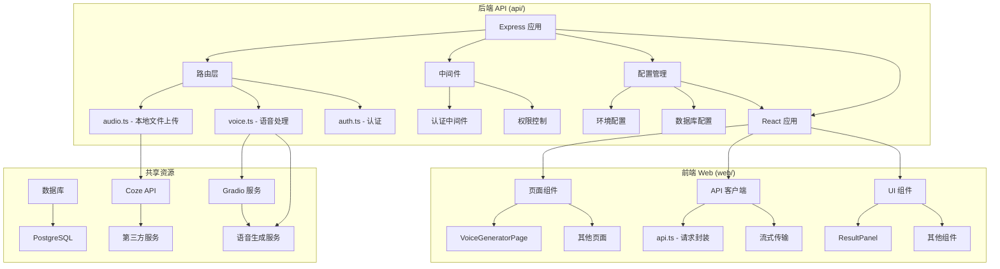
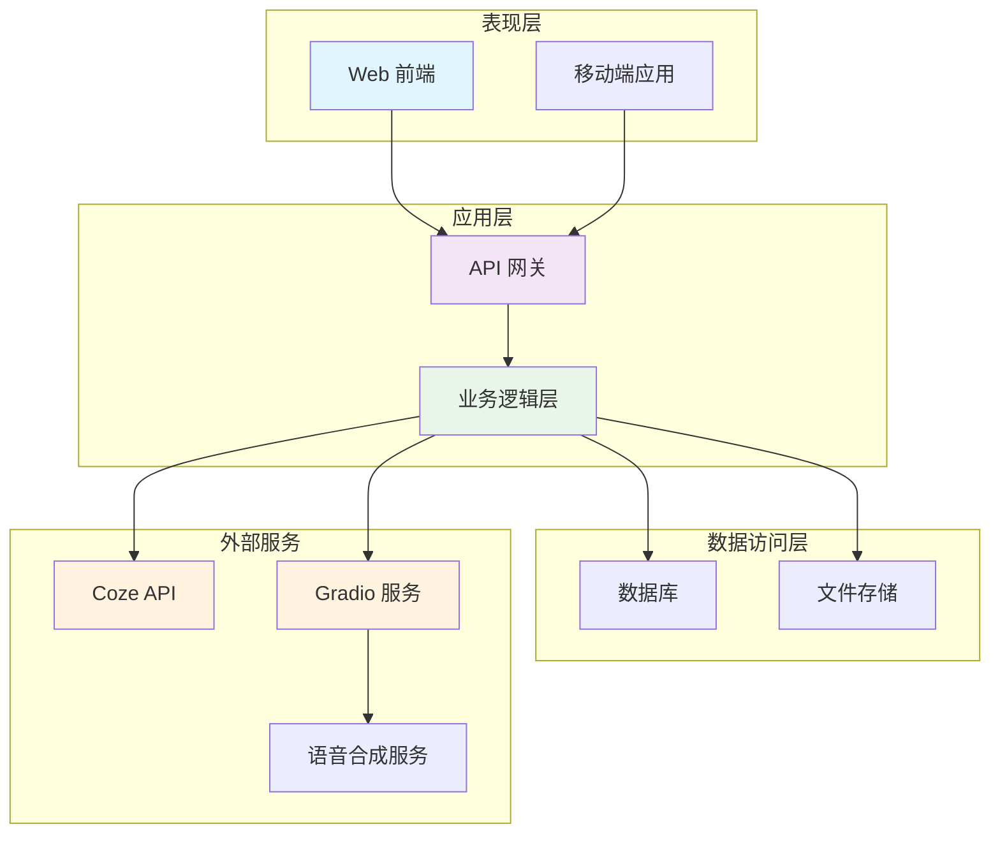
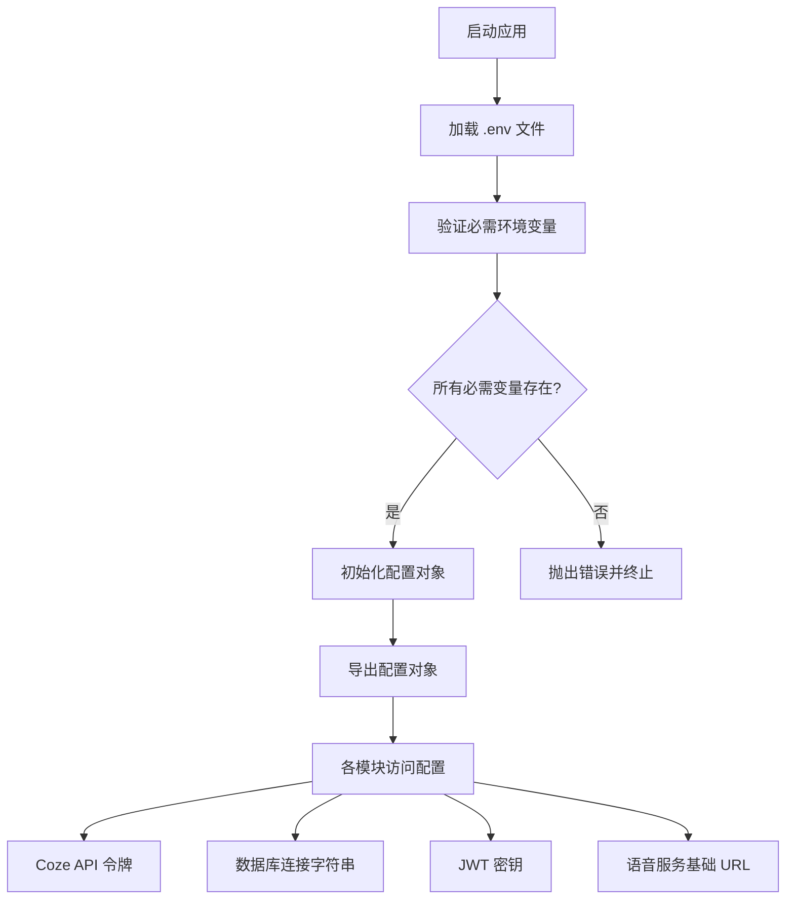
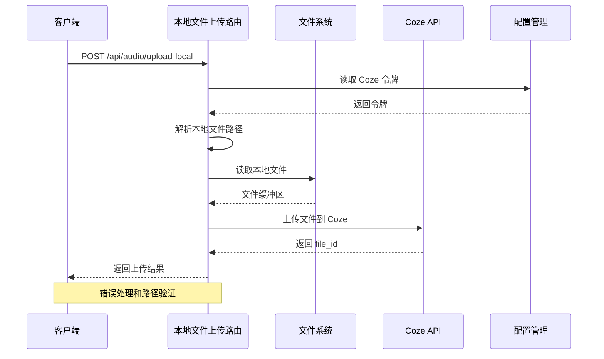
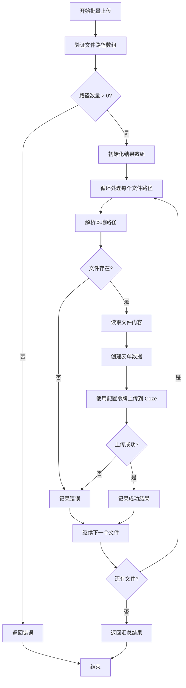
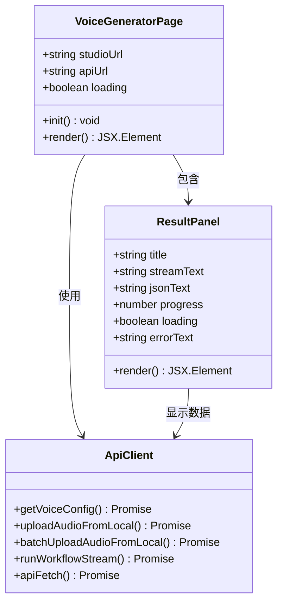
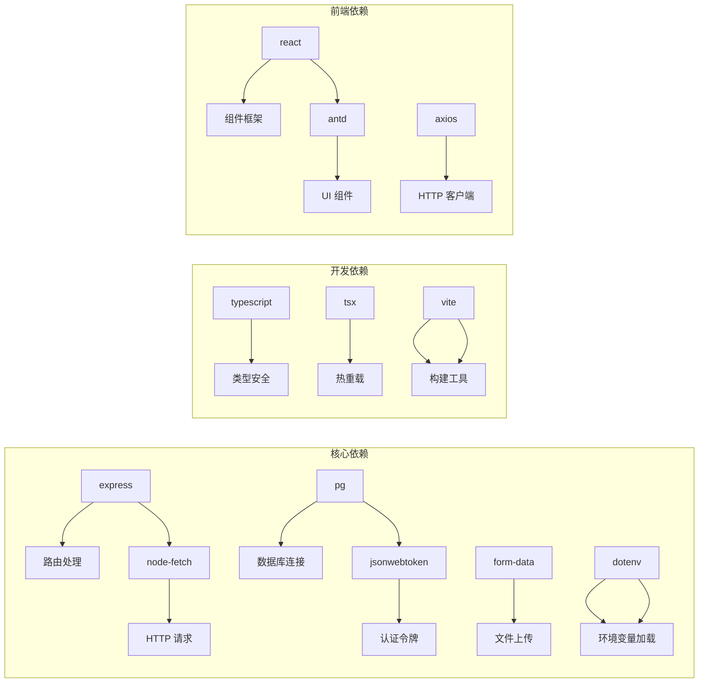
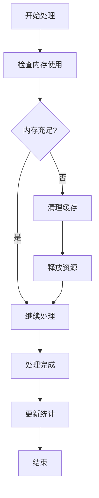

# 音频处理模块

<cite>
**本文档引用的文件**
- [audio.ts](file://api/src/routes/audio.ts)
- [voice.ts](file://api/src/routes/voice.ts)
- [auth.ts](file://api/src/middleware/auth.ts)
- [config.ts](file://api/src/config.ts)
- [db.ts](file://api/src/db.ts)
- [utils.ts](file://api/src/utils.ts)
- [api.ts](file://web/src/lib/api.ts)
- [VoiceGeneratorPage.tsx](file://web/src/pages/VoiceGeneratorPage.tsx)
- [ResultPanel.tsx](file://web/src/components/ResultPanel.tsx)
- [package.json](file://api/package.json)
- [package.json](file://web/package.json)
</cite>

## 更新摘要
**变更内容**
- 配置管理从硬编码令牌改为动态配置驱动：引入 dotenv 实现环境变量管理
- 增强安全性：敏感配置通过环境变量注入，避免硬编码
- 改善错误处理：添加配置验证和详细的错误信息
- 统一配置访问：所有模块通过 config 对象访问配置，提高一致性

## 目录
1. [简介](#简介)
2. [项目结构](#项目结构)
3. [核心组件](#核心组件)
4. [架构概览](#架构概览)
5. [详细组件分析](#详细组件分析)
6. [依赖关系分析](#依赖关系分析)
7. [性能考虑](#性能考虑)
8. [故障排除指南](#故障排除指南)
9. [结论](#结论)

## 简介

音频处理模块是一个基于 Node.js 和 React 的音频处理系统，主要提供以下核心功能：

- **本地文件上传与管理**：支持从本地文件路径直接上传音频文件到 Coze 平台
- **批量本地文件上传**：支持多个本地文件路径的批量处理
- **语音合成（TTS）**：基于 Gradio 客户端的语音生成服务
- **批量翻译与配音**：支持批量文案翻译和对应的语音合成
- **语音配置管理**：提供语音服务的配置和访问接口

该模块采用前后端分离架构，后端使用 Express.js 提供 RESTful API，前端使用 React 构建用户界面。**更新** 配置管理已从硬编码令牌改为动态配置驱动，增强了安全性并改善了错误处理。

## 项目结构

项目采用模块化组织方式，主要分为以下几个部分：

**图表来源**
- [audio.ts:1-185](file://api/src/routes/audio.ts#L1-L185)
- [voice.ts:1-440](file://api/src/routes/voice.ts#L1-L440)
- [auth.ts:1-23](file://api/src/middleware/auth.ts#L1-L23)
- [config.ts:1-19](file://api/src/config.ts#L1-L19)

**章节来源**
- [package.json:1-37](file://api/package.json#L1-L37)
- [package.json:1-26](file://web/package.json#L1-L26)

## 核心组件

### 本地文件上传组件

音频上传功能提供了两种主要的上传方式：

1. **单个本地文件上传**：直接从本地文件路径上传到 Coze 平台
2. **批量本地文件上传**：支持多个本地文件路径的批量处理

### 语音处理组件

语音处理模块包含完整的语音合成流程：

1. **配置获取**：获取语音服务的基础 URL
2. **文案提取**：从各种格式中提取需要翻译的文案
3. **批量翻译**：使用 Coze 工作流进行批量翻译
4. **语音合成**：基于 Gradio 客户端生成语音文件

### 前端交互组件

前端提供了直观的用户界面：

1. **语音生成页面**：展示语音服务的访问链接
2. **结果面板**：显示处理进度和结果
3. **API 客户端**：封装所有后端 API 调用

**章节来源**
- [audio.ts:14-95](file://api/src/routes/audio.ts#L14-L95)
- [voice.ts:66-83](file://api/src/routes/voice.ts#L66-L83)
- [api.ts:210-240](file://web/src/lib/api.ts#L210-L240)

## 架构概览

系统采用分层架构设计，确保各组件职责清晰、耦合度低：

**图表来源**
- [config.ts:13-19](file://api/src/config.ts#L13-L19)
- [auth.ts:8-22](file://api/src/middleware/auth.ts#L8-L22)

## 详细组件分析

### 动态配置管理组件

**更新** 配置管理已从硬编码令牌改为动态配置驱动，增强了安全性并改善了错误处理。

系统现在使用 dotenv 实现动态配置管理：

**图表来源**
- [config.ts:1-19](file://api/src/config.ts#L1-L19)

#### 配置验证机制

系统实现了严格的配置验证机制：

1. **必需环境变量检查**：确保所有关键配置都已设置
2. **运行时验证**：在应用启动时验证配置的有效性
3. **详细错误信息**：提供具体的缺失配置信息
4. **优雅降级**：为可选配置提供默认值

**章节来源**
- [config.ts:5-11](file://api/src/config.ts#L5-L11)

### 本地文件上传路由组件

音频上传功能实现了完整的本地文件处理流程：

**图表来源**
- [audio.ts:14-95](file://api/src/routes/audio.ts#L14-L95)

#### 核心功能特性

1. **本地路径解析**：支持从URL中提取本地文件路径参数
2. **文件存在性验证**：确保本地文件存在且可访问
3. **直接文件上传**：绕过下载步骤，直接上传本地文件
4. **Coze 集成**：使用动态配置的 Coze 令牌进行上传
5. **批量处理**：支持多文件路径的并发处理

**章节来源**
- [audio.ts:14-179](file://api/src/routes/audio.ts#L14-L179)

### 批量本地文件上传组件

批量上传功能提供了高效的大规模文件处理能力：

**图表来源**
- [audio.ts:102-179](file://api/src/routes/audio.ts#L102-L179)

#### 批量处理算法

系统实现了智能的批量处理算法，支持错误隔离和进度跟踪：

| 处理阶段 | 功能特性 | 错误处理 |
|---------|---------|---------|
| 路径解析 | 支持URL参数提取 | 路径格式验证 |
| 文件验证 | 检查文件存在性 | 文件不存在错误 |
| 内容读取 | 同步文件读取 | IO异常处理 |
| 表单构建 | MIME类型设置 | 类型兼容性检查 |
| 上传执行 | 并发请求处理 | 网络异常重试 |
| 结果汇总 | 成功/失败统计 | 完整性保证 |

**章节来源**
- [audio.ts:102-179](file://api/src/routes/audio.ts#L102-L179)

### 前端本地文件上传组件

前端组件提供了完整的本地文件上传体验：

**图表来源**
- [VoiceGeneratorPage.tsx:5-26](file://web/src/pages/VoiceGeneratorPage.tsx#L5-L26)
- [ResultPanel.tsx:16-26](file://web/src/components/ResultPanel.tsx#L16-L26)

#### 用户界面特性

1. **响应式设计**：适配不同屏幕尺寸
2. **实时状态**：显示加载状态和进度
3. **错误提示**：友好的错误信息展示
4. **快捷操作**：一键跳转到语音服务

**章节来源**
- [VoiceGeneratorPage.tsx:28-95](file://web/src/pages/VoiceGeneratorPage.tsx#L28-L95)
- [ResultPanel.tsx:33-118](file://web/src/components/ResultPanel.tsx#L33-L118)

## 依赖关系分析

系统依赖关系清晰，各模块职责明确：

**图表来源**
- [package.json:11-24](file://api/package.json#L11-L24)
- [package.json:11-17](file://web/package.json#L11-L17)

### 外部服务集成

系统集成了多个外部服务：

| 服务名称 | 用途 | 配置项 |
|---------|------|--------|
| Coze API | 文件存储和工作流执行 | COZE_API_TOKEN |
| PostgreSQL | 数据持久化 | DATABASE_URL |
| JWT | 用户认证 | JWT_SECRET |
| Gradio | 语音合成 | VOICE_BASE_URL |

**章节来源**
- [config.ts:5-19](file://api/src/config.ts#L5-L19)

## 性能考虑

### 并发处理优化

系统采用了多种并发处理策略：

1. **批量上传优化**：使用同步循环处理多个文件路径
2. **流式处理**：支持大文件的流式传输
3. **缓存机制**：减少重复计算和网络请求

### 内存管理

### 错误恢复机制

系统实现了多层次的错误恢复：

1. **网络异常处理**：自动重试机制
2. **超时控制**：合理的超时设置
3. **降级策略**：部分功能降级可用

## 故障排除指南

### 常见问题及解决方案

| 问题类型 | 症状描述 | 可能原因 | 解决方案 |
|---------|---------|---------|---------|
| 认证失败 | 401 未授权 | Token 过期或无效 | 重新登录获取新 Token |
| 配置缺失 | 应用启动失败 | 环境变量未设置 | 检查 .env 文件配置 |
| 文件路径错误 | 404 文件不存在 | 路径格式不正确或文件不存在 | 检查本地文件路径 |
| 权限不足 | 403 访问被拒绝 | 文件权限不足 | 检查文件访问权限 |
| 网络超时 | 请求超时 | 网络不稳定 | 检查网络连接，增加重试次数 |
| 文件上传失败 | 上传中断 | 文件过大或格式不支持 | 分割文件或转换格式 |
| 语音合成错误 | 无法生成音频 | 语音服务不可用 | 检查语音服务状态 |

### 调试工具

系统提供了完整的调试功能：

1. **调试记录**：保存每次处理的详细日志
2. **状态监控**：实时监控系统运行状态
3. **性能分析**：分析处理时间和资源使用

**章节来源**
- [voice.ts:263-280](file://api/src/routes/voice.ts#L263-L280)

## 结论

音频处理模块是一个功能完整、架构清晰的音频处理系统。其主要特点包括：

1. **模块化设计**：各功能模块职责明确，易于维护和扩展
2. **完整的处理流程**：从本地文件上传到语音合成的完整链路
3. **用户友好界面**：简洁直观的操作界面
4. **强大的错误处理**：完善的异常处理和恢复机制
5. **高效的本地文件处理**：优化的本地文件上传和批量处理能力
6. **动态配置管理**：从硬编码令牌改为动态配置驱动，增强了安全性

**更新** 本次更新反映了音频处理模块的重大改进：配置管理已从硬编码令牌改为动态配置驱动，使用 dotenv 实现环境变量管理，显著提升了系统的安全性、可维护性和灵活性。新的配置系统提供了更好的错误处理和验证机制，为音频处理需求提供了更可靠的解决方案。

该模块为音频处理需求提供了高效的解决方案，具有良好的可扩展性和维护性。通过合理的架构设计和实现细节，能够满足各种音频处理场景的需求。