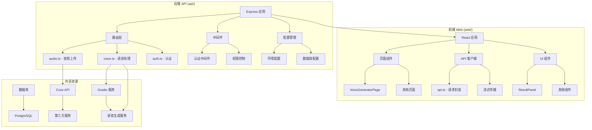
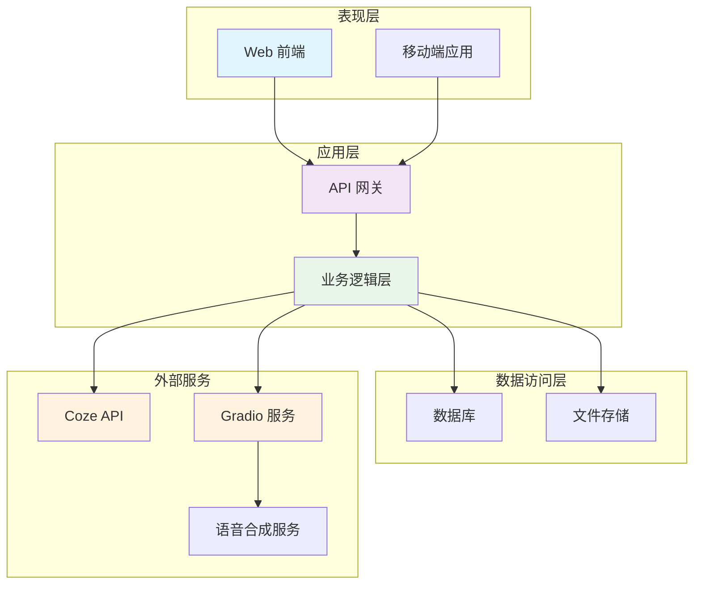
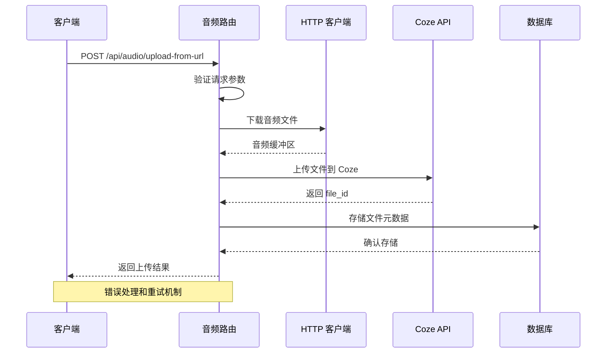
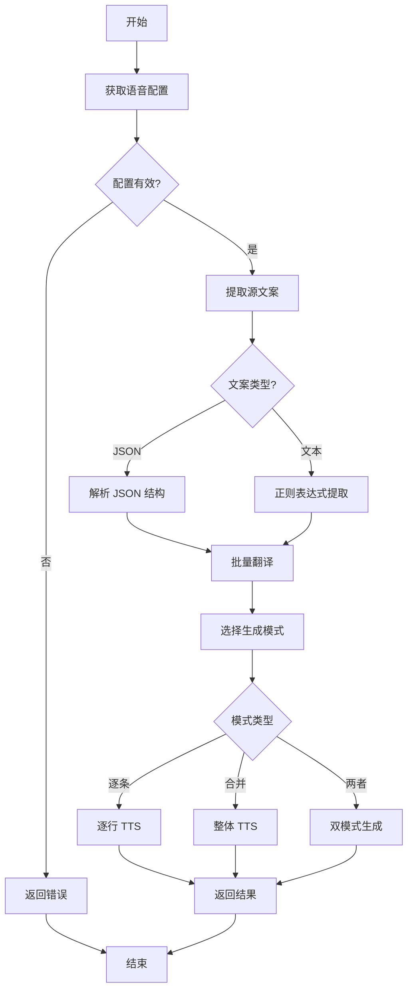
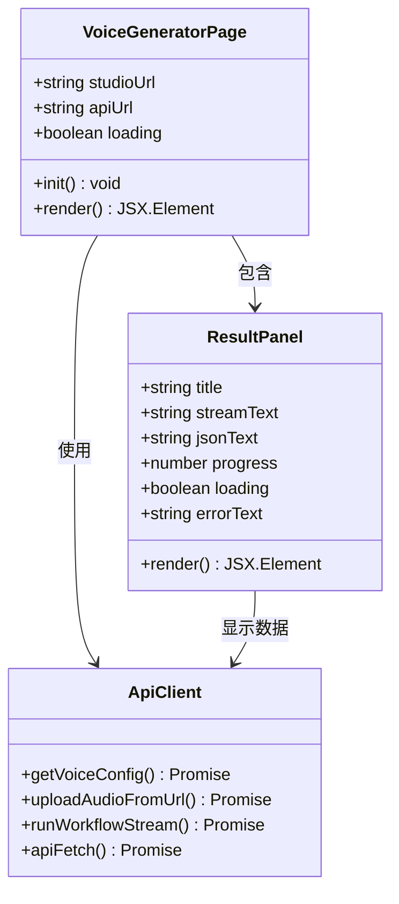
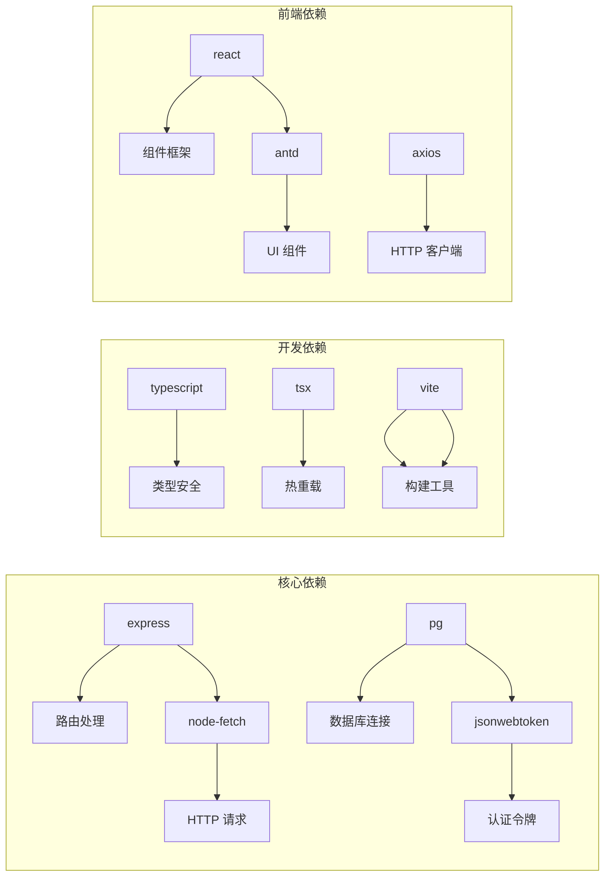
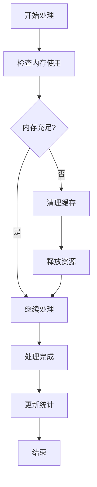

# 音频处理模块

<cite>
**本文档引用的文件**
- [audio.ts](file://api/src/routes/audio.ts)
- [voice.ts](file://api/src/routes/voice.ts)
- [auth.ts](file://api/src/middleware/auth.ts)
- [config.ts](file://api/src/config.ts)
- [db.ts](file://api/src/db.ts)
- [modules.ts](file://api/src/modules.ts)
- [api.ts](file://web/src/lib/api.ts)
- [VoiceGeneratorPage.tsx](file://web/src/pages/VoiceGeneratorPage.tsx)
- [ResultPanel.tsx](file://web/src/components/ResultPanel.tsx)
- [package.json](file://api/package.json)
- [package.json](file://web/package.json)
</cite>

## 目录
1. [简介](#简介)
2. [项目结构](#项目结构)
3. [核心组件](#核心组件)
4. [架构概览](#架构概览)
5. [详细组件分析](#详细组件分析)
6. [依赖关系分析](#依赖关系分析)
7. [性能考虑](#性能考虑)
8. [故障排除指南](#故障排除指南)
9. [结论](#结论)

## 简介

音频处理模块是一个基于 Node.js 和 React 的音频处理系统，主要提供以下核心功能：

- **音频文件上传与管理**：支持从 URL 下载音频文件并上传到 Coze 平台
- **语音合成（TTS）**：基于 Gradio 客户端的语音生成服务
- **批量翻译与配音**：支持批量文案翻译和对应的语音合成
- **语音配置管理**：提供语音服务的配置和访问接口

该模块采用前后端分离架构，后端使用 Express.js 提供 RESTful API，前端使用 React 构建用户界面。

## 项目结构

项目采用模块化组织方式，主要分为以下几个部分：

**图表来源**
- [audio.ts:1-161](file://api/src/routes/audio.ts#L1-L161)
- [voice.ts:1-440](file://api/src/routes/voice.ts#L1-L440)
- [auth.ts:1-23](file://api/src/middleware/auth.ts#L1-L23)

**章节来源**
- [package.json:1-37](file://api/package.json#L1-L37)
- [package.json:1-26](file://web/package.json#L1-L26)

## 核心组件

### 音频上传组件

音频上传功能提供了两种主要的上传方式：

1. **单个文件上传**：从 URL 下载音频文件并上传到 Coze
2. **批量上传**：支持多个 URL 的批量处理

### 语音处理组件

语音处理模块包含完整的语音合成流程：

1. **配置获取**：获取语音服务的基础 URL
2. **文案提取**：从各种格式中提取需要翻译的文案
3. **批量翻译**：使用 Coze 工作流进行批量翻译
4. **语音合成**：基于 Gradio 客户端生成语音文件

### 前端交互组件

前端提供了直观的用户界面：

1. **语音生成页面**：展示语音服务的访问链接
2. **结果面板**：显示处理进度和结果
3. **API 客户端**：封装所有后端 API 调用

**章节来源**
- [audio.ts:9-81](file://api/src/routes/audio.ts#L9-L81)
- [voice.ts:66-83](file://api/src/routes/voice.ts#L66-L83)
- [api.ts:117-126](file://web/src/lib/api.ts#L117-L126)

## 架构概览

系统采用分层架构设计，确保各组件职责清晰、耦合度低：

**图表来源**
- [config.ts:13-19](file://api/src/config.ts#L13-L19)
- [auth.ts:8-22](file://api/src/middleware/auth.ts#L8-L22)

## 详细组件分析

### 音频上传路由组件

音频上传功能实现了完整的文件处理流程：

**图表来源**
- [audio.ts:14-81](file://api/src/routes/audio.ts#L14-L81)

#### 核心功能特性

1. **URL 验证**：确保提供有效的音频文件 URL
2. **文件下载**：支持 HTTP/HTTPS 协议的文件下载
3. **Coze 集成**：自动上传到 Coze 文件存储服务
4. **错误处理**：完善的异常捕获和错误响应
5. **批量处理**：支持多 URL 的并发处理

**章节来源**
- [audio.ts:14-158](file://api/src/routes/audio.ts#L14-L158)

### 语音处理工作流组件

语音处理模块提供了完整的语音合成解决方案：

**图表来源**
- [voice.ts:283-348](file://api/src/routes/voice.ts#L283-L348)

#### 文案提取算法

系统实现了智能的文案提取算法，支持多种输入格式：

| 输入格式 | 提取方法 | 支持情况 |
|---------|---------|----------|
| JSON 对象 | 解析特定字段 | ✅ 完全支持 |
| 数组字符串 | JSON 解析 | ✅ 部分支持 |
| 纯文本 | 正则表达式匹配 | ✅ 基础支持 |
| 混合格式 | 多种策略组合 | ✅ 高级支持 |

**章节来源**
- [voice.ts:87-179](file://api/src/routes/voice.ts#L87-L179)

### 前端交互组件

前端组件提供了丰富的用户交互体验：

**图表来源**
- [VoiceGeneratorPage.tsx:5-26](file://web/src/pages/VoiceGeneratorPage.tsx#L5-L26)
- [ResultPanel.tsx:16-26](file://web/src/components/ResultPanel.tsx#L16-L26)

#### 用户界面特性

1. **响应式设计**：适配不同屏幕尺寸
2. **实时状态**：显示加载状态和进度
3. **错误提示**：友好的错误信息展示
4. **快捷操作**：一键跳转到语音服务

**章节来源**
- [VoiceGeneratorPage.tsx:28-114](file://web/src/pages/VoiceGeneratorPage.tsx#L28-L114)
- [ResultPanel.tsx:33-114](file://web/src/components/ResultPanel.tsx#L33-L114)

## 依赖关系分析

系统依赖关系清晰，各模块职责明确：

**图表来源**
- [package.json:11-24](file://api/package.json#L11-L24)
- [package.json:11-17](file://web/package.json#L11-L17)

### 外部服务集成

系统集成了多个外部服务：

| 服务名称 | 用途 | 配置项 |
|---------|------|--------|
| Coze API | 文件存储和工作流执行 | COZE_API_TOKEN |
| PostgreSQL | 数据持久化 | DATABASE_URL |
| JWT | 用户认证 | JWT_SECRET |
| Gradio | 语音合成 | VOICE_BASE_URL |

**章节来源**
- [config.ts:5-19](file://api/src/config.ts#L5-L19)

## 性能考虑

### 并发处理优化

系统采用了多种并发处理策略：

1. **批量上传优化**：使用异步循环处理多个 URL
2. **流式处理**：支持大文件的流式传输
3. **缓存机制**：减少重复计算和网络请求

### 内存管理

### 错误恢复机制

系统实现了多层次的错误恢复：

1. **网络异常处理**：自动重试机制
2. **超时控制**：合理的超时设置
3. **降级策略**：部分功能降级可用

## 故障排除指南

### 常见问题及解决方案

| 问题类型 | 症状描述 | 可能原因 | 解决方案 |
|---------|---------|---------|---------|
| 认证失败 | 401 未授权 | Token 过期或无效 | 重新登录获取新 Token |
| 网络超时 | 请求超时 | 网络不稳定 | 检查网络连接，增加重试次数 |
| 文件上传失败 | 上传中断 | 文件过大或格式不支持 | 分割文件或转换格式 |
| 语音合成错误 | 无法生成音频 | 语音服务不可用 | 检查语音服务状态 |

### 调试工具

系统提供了完整的调试功能：

1. **调试记录**：保存每次处理的详细日志
2. **状态监控**：实时监控系统运行状态
3. **性能分析**：分析处理时间和资源使用

**章节来源**
- [voice.ts:263-280](file://api/src/routes/voice.ts#L263-L280)

## 结论

音频处理模块是一个功能完整、架构清晰的音频处理系统。其主要特点包括：

1. **模块化设计**：各功能模块职责明确，易于维护和扩展
2. **完整的处理流程**：从音频上传到语音合成的完整链路
3. **用户友好界面**：简洁直观的操作界面
4. **强大的错误处理**：完善的异常处理和恢复机制

该模块为音频处理需求提供了高效的解决方案，具有良好的可扩展性和维护性。通过合理的架构设计和实现细节，能够满足各种音频处理场景的需求。