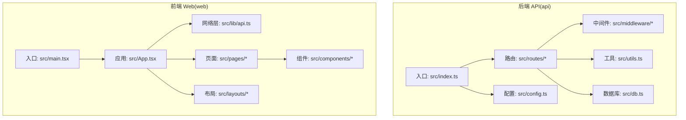
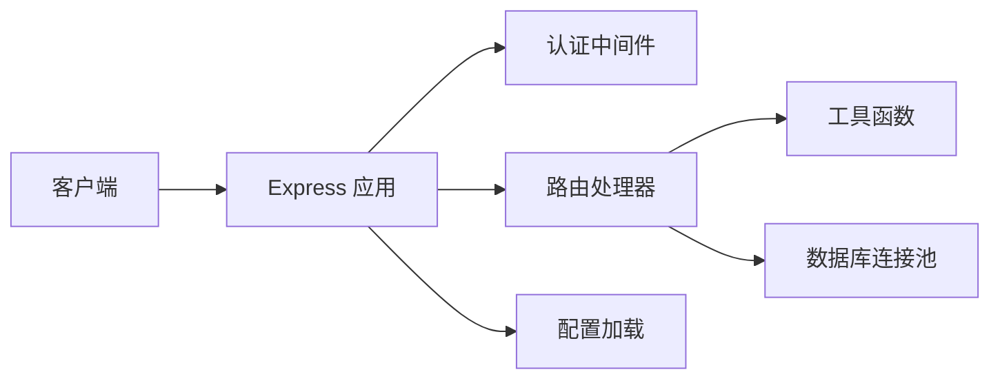
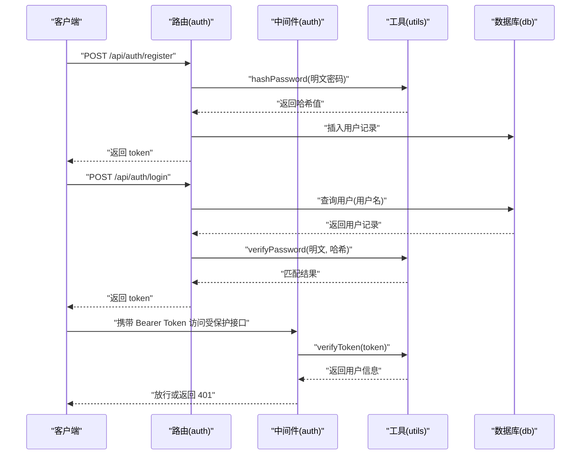
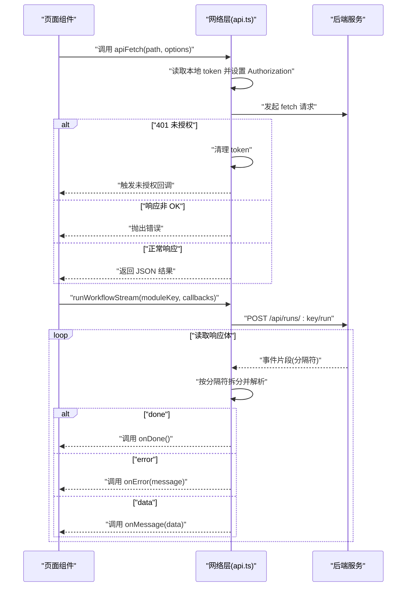
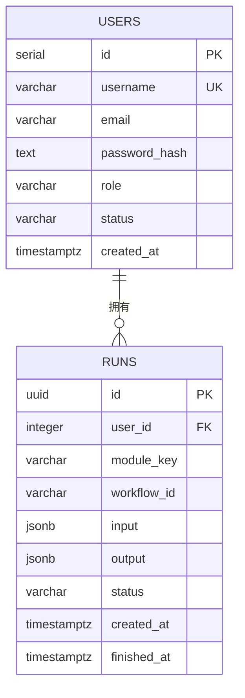
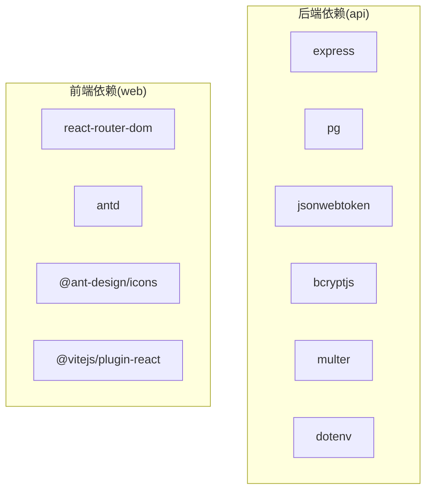

# 代码规范

<cite>
**本文引用的文件**
- [api/package.json](file://api/package.json)
- [api/tsconfig.json](file://api/tsconfig.json)
- [api/src/index.ts](file://api/src/index.ts)
- [api/src/config.ts](file://api/src/config.ts)
- [api/src/db.ts](file://api/src/db.ts)
- [api/src/utils.ts](file://api/src/utils.ts)
- [api/src/middleware/auth.ts](file://api/src/middleware/auth.ts)
- [api/src/routes/auth.ts](file://api/src/routes/auth.ts)
- [web/package.json](file://web/package.json)
- [web/tsconfig.json](file://web/tsconfig.json)
- [web/vite.config.ts](file://web/vite.config.ts)
- [web/src/main.tsx](file://web/src/main.tsx)
- [web/src/App.tsx](file://web/src/App.tsx)
- [web/src/lib/api.ts](file://web/src/lib/api.ts)
- [web/src/pages/VoiceGeneratorPage.tsx](file://web/src/pages/VoiceGeneratorPage.tsx)
- [web/src/components/ResultPanel.tsx](file://web/src/components/ResultPanel.tsx)
- [web/src/layouts/MainLayout.tsx](file://web/src/layouts/MainLayout.tsx)
- [web/src/pages/DashboardPage.tsx](file://web/src/pages/DashboardPage.tsx)
</cite>

## 目录
1. [引言](#引言)
2. [项目结构](#项目结构)
3. [核心组件](#核心组件)
4. [架构概览](#架构概览)
5. [详细组件分析](#详细组件分析)
6. [依赖分析](#依赖分析)
7. [性能考虑](#性能考虑)
8. [故障排查指南](#故障排查指南)
9. [结论](#结论)
10. [附录](#附录)

## 引言
本文件旨在为本项目建立一套统一、可执行的 TypeScript 与前端开发规范，覆盖命名约定、文件与目录组织、模块导入导出、格式化与静态分析、注释与文档、错误处理等关键主题。目标是提升团队协作效率与代码质量，降低维护成本。

## 项目结构
本仓库采用前后端分离的多包结构：
- 后端 API 服务位于 api/，基于 Express 框架，使用 TypeScript 编译与运行。
- 前端应用位于 web/，基于 Vite + React + Ant Design，TypeScript 仅用于类型检查与构建。

图表来源
- [api/src/index.ts:1-29](file://api/src/index.ts#L1-L29)
- [api/src/routes/auth.ts:1-115](file://api/src/routes/auth.ts#L1-L115)
- [api/src/middleware/auth.ts:1-23](file://api/src/middleware/auth.ts#L1-L23)
- [api/src/utils.ts:1-21](file://api/src/utils.ts#L1-L21)
- [api/src/db.ts:1-35](file://api/src/db.ts#L1-L35)
- [api/src/config.ts:1-19](file://api/src/config.ts#L1-L19)
- [web/src/main.tsx:1-17](file://web/src/main.tsx#L1-L17)
- [web/src/App.tsx:1-70](file://web/src/App.tsx#L1-L70)
- [web/src/lib/api.ts:1-160](file://web/src/lib/api.ts#L1-L160)

章节来源
- [api/src/index.ts:1-29](file://api/src/index.ts#L1-L29)
- [web/src/main.tsx:1-17](file://web/src/main.tsx#L1-L17)

## 核心组件
- 后端入口与路由挂载：后端通过入口文件集中注册路由与中间件，并在启动前确保数据库模式。
- 配置管理：后端通过环境变量校验与加载，集中暴露配置对象。
- 数据访问：使用连接池进行数据库操作，并在启动时初始化表结构。
- 认证中间件：统一从请求头解析令牌并注入用户上下文。
- 前端入口与路由：前端以路由驱动页面与布局，全局设置主题与国际化基础配置。
- 网络层封装：统一处理鉴权头、错误响应与流式事件，提供通用 API 调用与 SSE 风格的增量消息处理。

章节来源
- [api/src/index.ts:1-29](file://api/src/index.ts#L1-L29)
- [api/src/config.ts:1-19](file://api/src/config.ts#L1-L19)
- [api/src/db.ts:1-35](file://api/src/db.ts#L1-L35)
- [api/src/middleware/auth.ts:1-23](file://api/src/middleware/auth.ts#L1-L23)
- [web/src/main.tsx:1-17](file://web/src/main.tsx#L1-L17)
- [web/src/App.tsx:1-70](file://web/src/App.tsx#L1-L70)
- [web/src/lib/api.ts:1-160](file://web/src/lib/api.ts#L1-L160)

## 架构概览
后端采用分层架构：入口负责启动与路由挂载；路由层处理业务请求；中间件层负责认证；工具层提供加密与 JWT 能力；数据层负责数据库连接与初始化。

图表来源
- [api/src/index.ts:1-29](file://api/src/index.ts#L1-L29)
- [api/src/middleware/auth.ts:1-23](file://api/src/middleware/auth.ts#L1-L23)
- [api/src/routes/auth.ts:1-115](file://api/src/routes/auth.ts#L1-L115)
- [api/src/utils.ts:1-21](file://api/src/utils.ts#L1-L21)
- [api/src/db.ts:1-35](file://api/src/db.ts#L1-L35)
- [api/src/config.ts:1-19](file://api/src/config.ts#L1-L19)

## 详细组件分析

### 后端：认证与用户管理
- 路由职责清晰：注册、登录、重置密码、查询当前用户。
- 参数校验与错误码：对缺失参数、重复账号、权限不足、无效令牌等情况返回明确状态码与消息。
- 密码安全：使用 bcrypt 进行加盐哈希存储；JWT 作为会话载体，设置过期时间。
- 中间件注入：认证中间件解析 Bearer Token 并写入请求上下文，供受保护路由使用。

图表来源
- [api/src/routes/auth.ts:1-115](file://api/src/routes/auth.ts#L1-L115)
- [api/src/middleware/auth.ts:1-23](file://api/src/middleware/auth.ts#L1-L23)
- [api/src/utils.ts:1-21](file://api/src/utils.ts#L1-L21)
- [api/src/db.ts:1-35](file://api/src/db.ts#L1-L35)

章节来源
- [api/src/routes/auth.ts:1-115](file://api/src/routes/auth.ts#L1-L115)
- [api/src/middleware/auth.ts:1-23](file://api/src/middleware/auth.ts#L1-L23)
- [api/src/utils.ts:1-21](file://api/src/utils.ts#L1-L21)
- [api/src/db.ts:1-35](file://api/src/db.ts#L1-L35)

### 前端：网络层与页面交互
- 统一鉴权头：自动从本地存储读取 token 并附加到请求头。
- 错误处理：对 401 统一清理本地 token 并触发未授权回调；对非 OK 响应抛出错误。
- 流式事件：实现基于分隔符的增量消息解析，支持 done/error/data 事件。
- 页面与布局：主布局提供菜单导航与登出；仪表盘页面提供功能卡片入口；语音生成页展示外部服务地址与 iframe。

图表来源
- [web/src/lib/api.ts:1-160](file://web/src/lib/api.ts#L1-L160)
- [web/src/App.tsx:1-70](file://web/src/App.tsx#L1-L70)
- [web/src/pages/VoiceGeneratorPage.tsx:1-95](file://web/src/pages/VoiceGeneratorPage.tsx#L1-L95)

章节来源
- [web/src/lib/api.ts:1-160](file://web/src/lib/api.ts#L1-L160)
- [web/src/App.tsx:1-70](file://web/src/App.tsx#L1-L70)
- [web/src/pages/VoiceGeneratorPage.tsx:1-95](file://web/src/pages/VoiceGeneratorPage.tsx#L1-L95)

### 数据模型与初始化
- 用户表：包含唯一用户名、邮箱、密码哈希、角色与状态等字段。
- 运行记录表：UUID 主键，关联用户，记录模块键、工作流 ID、输入输出、状态与时间戳。

图表来源
- [api/src/db.ts:10-34](file://api/src/db.ts#L10-L34)

章节来源
- [api/src/db.ts:1-35](file://api/src/db.ts#L1-L35)

## 依赖分析
- 后端依赖：Express、CORS、PostgreSQL 连接池、JWT、bcrypt、Multer、dotenv 等。
- 前端依赖：React、React Router、Ant Design、@ant-design/icons、Vite 插件等。
- 类型声明：后端与前端均安装了对应 @types 包，确保类型安全。

图表来源
- [api/package.json:11-34](file://api/package.json#L11-L34)
- [web/package.json:11-24](file://web/package.json#L11-L24)

章节来源
- [api/package.json:1-36](file://api/package.json#L1-L36)
- [web/package.json:1-26](file://web/package.json#L1-L26)

## 性能考虑
- 后端
  - 使用连接池管理数据库连接，避免频繁创建销毁连接。
  - 启动阶段预建表结构，减少运行时DDL开销。
  - 控制请求体大小，避免过大负载影响内存与吞吐。
- 前端
  - 使用 React Router 的懒加载与按需渲染，减少初始包体积。
  - 对于大列表与复杂组件，合理拆分与缓存，避免不必要的重渲染。
  - 使用 Ant Design 组件时，注意只引入所需图标与样式，减小打包体积。

## 故障排查指南
- 后端
  - 环境变量缺失：启动前会校验必需变量，若缺失会直接抛错。请检查 .env 文件与部署环境变量。
  - 数据库连接失败：确认 DATABASE_URL 可达且连接池可用。
  - 认证失败：检查 Bearer Token 是否正确传递与签名是否有效。
- 前端
  - 未登录跳转：当收到 401，网络层会清理本地 token 并触发未授权回调，页面应跳转至登录页。
  - 接口异常：非 OK 响应会抛出错误，页面应捕获并提示用户。
  - 流式事件：若事件解析异常，检查服务端事件格式与分隔符一致性。

章节来源
- [api/src/config.ts:1-19](file://api/src/config.ts#L1-L19)
- [web/src/lib/api.ts:1-160](file://web/src/lib/api.ts#L1-L160)
- [web/src/App.tsx:1-70](file://web/src/App.tsx#L1-L70)

## 结论
本规范以现有代码为依据，总结了命名、组织、导入导出、格式化与静态分析、注释与文档、错误处理等方面的最佳实践。建议团队在日常开发中严格遵循，持续改进，确保代码一致性与可维护性。

## 附录

### TypeScript 编码规范与命名约定
- 文件命名
  - 路由文件：使用小驼峰与复数形式，如 routes/auth.ts、routes/runs.ts。
  - 中间件文件：使用小驼峰，如 middleware/auth.ts。
  - 工具函数：使用小驼峰，如 utils.ts。
  - 配置文件：config.ts。
  - 入口文件：index.ts 或 main.ts。
- 目录组织
  - 按功能域划分：routes、middleware、lib、pages、components、layouts。
  - 配置与工具：config.ts、utils.ts、db.ts。
- 导入导出
  - 统一使用相对路径导入，避免绝对路径导致耦合。
  - 导出默认导出与具名导出结合，保持对外接口稳定。
- 变量与函数
  - 变量使用小驼峰；常量使用大写下划线；函数使用动词短语；纯函数优先。
- 类与接口
  - 接口以 I 前缀或抽象名词形式命名；类以具体名词形式命名。
  - 属性与方法尽量使用语义化名称，避免缩写。
- 注释与文档
  - 函数/方法：简述用途、参数、返回值与异常。
  - 复杂逻辑：添加行内注释说明关键步骤。
  - 公共 API：提供调用示例与注意事项。
- 错误处理
  - 明确区分业务错误与系统错误，返回一致的错误结构。
  - 对外接口统一错误码与消息格式，便于前端处理。
- 格式化与静态分析
  - 使用 TypeScript 编译器严格模式，开启未使用变量/参数检查。
  - 前端使用 Vite + React 插件，保证 JSX 与 TSX 语法正确。
  - 后端使用 tsc 编译，配合 Express 类型声明确保路由与中间件类型安全。

章节来源
- [api/src/index.ts:1-29](file://api/src/index.ts#L1-L29)
- [api/src/routes/auth.ts:1-115](file://api/src/routes/auth.ts#L1-L115)
- [api/src/middleware/auth.ts:1-23](file://api/src/middleware/auth.ts#L1-L23)
- [api/src/utils.ts:1-21](file://api/src/utils.ts#L1-L21)
- [api/src/db.ts:1-35](file://api/src/db.ts#L1-L35)
- [api/src/config.ts:1-19](file://api/src/config.ts#L1-L19)
- [web/src/main.tsx:1-17](file://web/src/main.tsx#L1-L17)
- [web/src/App.tsx:1-70](file://web/src/App.tsx#L1-L70)
- [web/src/lib/api.ts:1-160](file://web/src/lib/api.ts#L1-L160)
- [web/vite.config.ts:1-10](file://web/vite.config.ts#L1-L10)
- [web/tsconfig.json:1-21](file://web/tsconfig.json#L1-L21)
- [api/tsconfig.json:1-14](file://api/tsconfig.json#L1-L14)