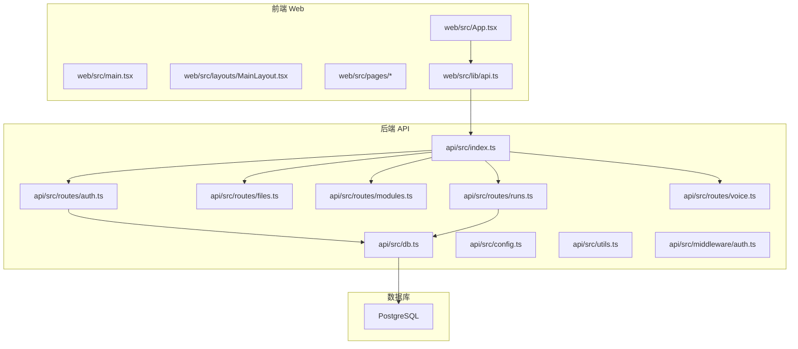
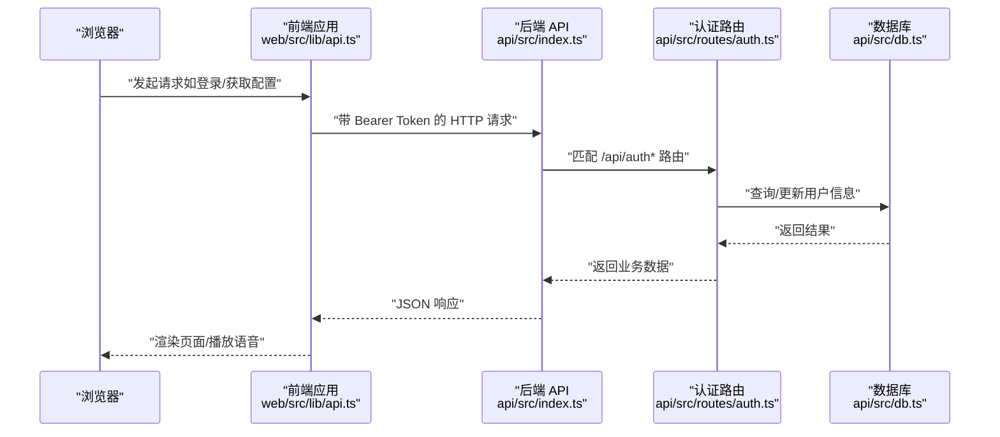
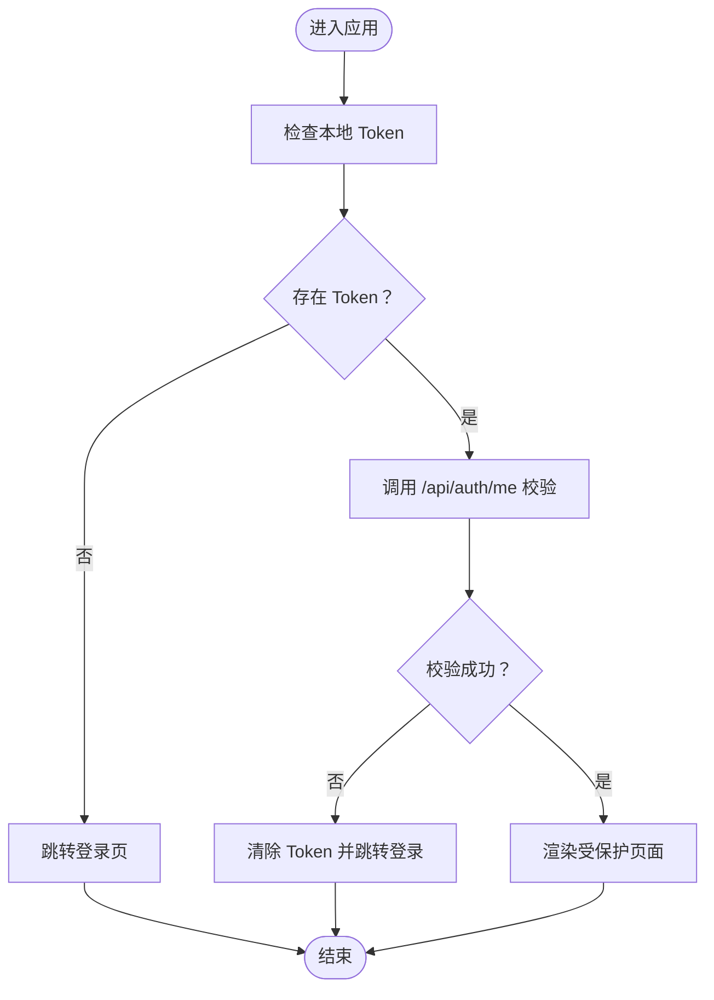
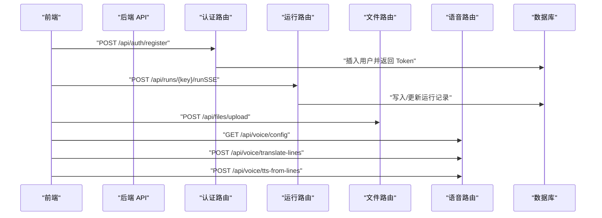
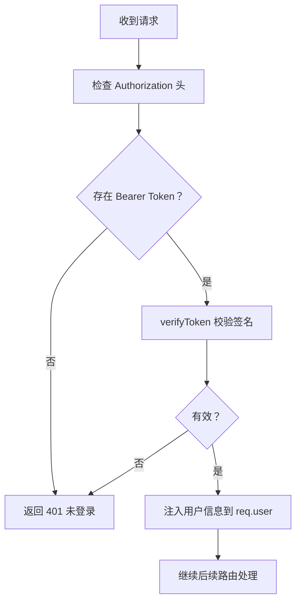
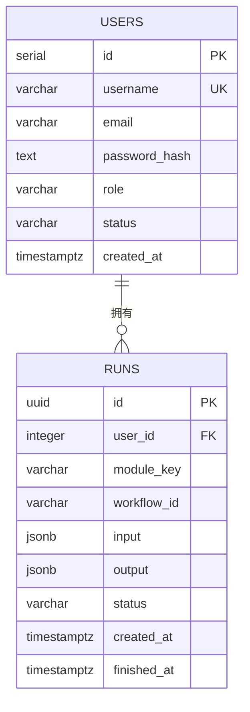
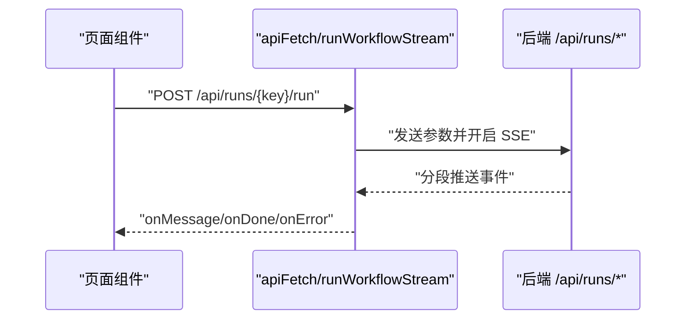
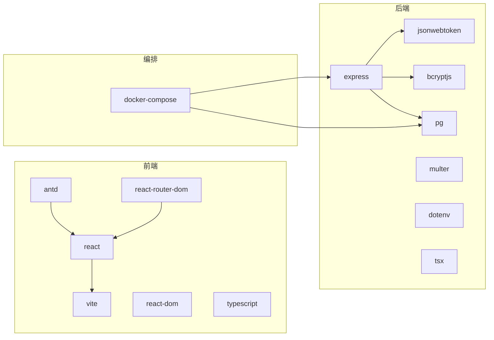

# 开发指南

<cite>
**本文引用的文件**
- [docker-compose.yml](file://docker-compose.yml)
- [quick-start.bat](file://quick-start.bat)
- [quick-lan-start.bat](file://quick-lan-start.bat)
- [quick-pull.bat](file://quick-pull.bat)
- [quick-save.bat](file://quick-save.bat)
- [api/package.json](file://api/package.json)
- [api/tsconfig.json](file://api/tsconfig.json)
- [api/src/index.ts](file://api/src/index.ts)
- [api/src/config.ts](file://api/src/config.ts)
- [api/src/db.ts](file://api/src/db.ts)
- [api/src/utils.ts](file://api/src/utils.ts)
- [api/src/middleware/auth.ts](file://api/src/middleware/auth.ts)
- [api/src/routes/auth.ts](file://api/src/routes/auth.ts)
- [api/src/routes/files.ts](file://api/src/routes/files.ts)
- [api/src/routes/modules.ts](file://api/src/routes/modules.ts)
- [api/src/routes/runs.ts](file://api/src/routes/runs.ts)
- [api/src/routes/voice.ts](file://api/src/routes/voice.ts)
- [api/src/modules.ts](file://api/src/modules.ts)
- [web/package.json](file://web/package.json)
- [web/tsconfig.json](file://web/tsconfig.json)
- [web/vite.config.ts](file://web/vite.config.ts)
- [web/src/main.tsx](file://web/src/main.tsx)
- [web/src/App.tsx](file://web/src/App.tsx)
- [web/src/lib/api.ts](file://web/src/lib/api.ts)
- [web/src/layouts/MainLayout.tsx](file://web/src/layouts/MainLayout.tsx)
- [web/src/pages/VoiceGeneratorPage.tsx](file://web/src/pages/VoiceGeneratorPage.tsx)
</cite>

## 目录
1. [简介](#简介)
2. [项目结构](#项目结构)
3. [核心组件](#核心组件)
4. [架构总览](#架构总览)
5. [详细组件分析](#详细组件分析)
6. [依赖关系分析](#依赖关系分析)
7. [性能与可维护性](#性能与可维护性)
8. [测试策略](#测试策略)
9. [调试与故障排除](#调试与故障排除)
10. [代码规范与最佳实践](#代码规范与最佳实践)
11. [扩展开发指南](#扩展开发指南)
12. [结论](#结论)
13. [附录](#附录)

## 简介
本开发指南面向新加入的开发者，帮助快速理解并参与本项目的前端与后端开发。内容涵盖项目结构、模块组织、TypeScript 与 Vite 配置、开发工具链、安全与鉴权、数据流与 API 设计、测试策略、调试与性能优化、以及扩展与维护建议。通过本指南，你可以从零开始搭建本地开发环境，完成功能迭代与问题排查。

## 项目结构
本仓库采用前后端分离的多服务架构：
- 前端 Web 应用位于 web/，基于 React + Ant Design + Vite，负责页面渲染、用户交互与 API 调用。
- 后端 API 应用于 api/，基于 Express + PostgreSQL，提供认证、文件上传、工作流执行与语音服务对接等能力。
- 使用 docker-compose.yml 编排数据库、API 与前端服务，支持一键启动与局域网部署。

图表来源
- [web/src/main.tsx:1-17](file://web/src/main.tsx#L1-L17)
- [web/src/App.tsx:1-70](file://web/src/App.tsx#L1-L70)
- [web/src/lib/api.ts:1-160](file://web/src/lib/api.ts#L1-L160)
- [api/src/index.ts:1-29](file://api/src/index.ts#L1-L29)
- [api/src/db.ts:1-35](file://api/src/db.ts#L1-L35)
- [api/src/config.ts:1-19](file://api/src/config.ts#L1-L19)
- [api/src/routes/auth.ts:1-115](file://api/src/routes/auth.ts#L1-L115)
- [api/src/routes/runs.ts](file://api/src/routes/runs.ts)

章节来源
- [docker-compose.yml:1-35](file://docker-compose.yml#L1-L35)
- [web/package.json:1-26](file://web/package.json#L1-L26)
- [api/package.json:1-36](file://api/package.json#L1-L36)

## 核心组件
- 前端入口与路由
  - 入口文件负责初始化 React、主题与路由容器，并挂载应用。
  - 应用路由定义了登录/注册与受保护页面的访问控制。
- API 入口与中间件
  - 初始化 Express、CORS、JSON 解析与健康检查端点。
  - 定义鉴权中间件与各业务路由前缀。
- 数据层
  - 使用 PostgreSQL 连接池，启动时自动创建用户与运行记录表。
- 安全与鉴权
  - JWT 密钥来自环境变量；密码使用 bcrypt 哈希；鉴权中间件校验令牌有效性。
- 前端 API 封装
  - 统一处理 Token 注入、401 处理、SSE 流式响应解析与文件上传。

章节来源
- [web/src/main.tsx:1-17](file://web/src/main.tsx#L1-L17)
- [web/src/App.tsx:1-70](file://web/src/App.tsx#L1-L70)
- [api/src/index.ts:1-29](file://api/src/index.ts#L1-L29)
- [api/src/middleware/auth.ts:1-23](file://api/src/middleware/auth.ts#L1-L23)
- [api/src/db.ts:1-35](file://api/src/db.ts#L1-L35)
- [api/src/utils.ts:1-21](file://api/src/utils.ts#L1-L21)
- [web/src/lib/api.ts:1-160](file://web/src/lib/api.ts#L1-L160)

## 架构总览
下图展示了从浏览器到 API 再到数据库的整体调用链路，以及前端对语音服务的集成方式。

图表来源
- [web/src/lib/api.ts:1-160](file://web/src/lib/api.ts#L1-L160)
- [api/src/index.ts:1-29](file://api/src/index.ts#L1-L29)
- [api/src/routes/auth.ts:1-115](file://api/src/routes/auth.ts#L1-L115)
- [api/src/db.ts:1-35](file://api/src/db.ts#L1-L35)

## 详细组件分析

### 前端应用与路由
- 路由守卫
  - 通过自定义 RequireAuth 实现登录态校验；未登录或校验失败自动跳转登录页。
  - 在应用启动时尝试调用“获取当前用户”接口进行会话验证。
- 主布局
  - 提供侧边菜单导航与顶部用户操作区；支持登出并清理本地 Token。
- 页面组件
  - 语音生成页通过调用后端接口获取语音服务地址并嵌入 iframe 展示。

图表来源
- [web/src/App.tsx:17-39](file://web/src/App.tsx#L17-L39)

章节来源
- [web/src/App.tsx:1-70](file://web/src/App.tsx#L1-L70)
- [web/src/layouts/MainLayout.tsx:1-65](file://web/src/layouts/MainLayout.tsx#L1-L65)
- [web/src/pages/VoiceGeneratorPage.tsx:1-95](file://web/src/pages/VoiceGeneratorPage.tsx#L1-L95)

### API 入口与路由组织
- 入口文件
  - 启动 CORS、JSON 解析、健康检查与各业务路由前缀。
- 认证路由
  - 支持注册、登录、重置密码（含角色权限校验）、获取当前用户。
- 文件路由
  - 提供文件上传接口，配合前端 uploadFile 使用。
- 运行路由
  - 提供工作流执行接口，前端通过 SSE 流式接收事件。
- 语音路由
  - 提供语音服务配置、按行翻译与 TTS 接口。

图表来源
- [api/src/index.ts:1-29](file://api/src/index.ts#L1-L29)
- [api/src/routes/auth.ts:1-115](file://api/src/routes/auth.ts#L1-L115)
- [api/src/routes/runs.ts](file://api/src/routes/runs.ts)
- [api/src/routes/files.ts](file://api/src/routes/files.ts)
- [api/src/routes/voice.ts](file://api/src/routes/voice.ts)

章节来源
- [api/src/index.ts:1-29](file://api/src/index.ts#L1-L29)
- [api/src/routes/auth.ts:1-115](file://api/src/routes/auth.ts#L1-L115)

### 鉴权中间件与安全
- 中间件职责
  - 从 Authorization 头解析 Bearer Token，解码并注入到请求上下文。
  - 对无效或缺失 Token 返回 401。
- 密码与 Token
  - 使用 bcrypt 哈希存储密码；使用 JWT 签发与校验，过期时间 7 天。
- 环境变量
  - 必需项包括 COZE_API_TOKEN、DATABASE_URL、JWT_SECRET、VOICE_BASE_URL；启动时强制校验。

图表来源
- [api/src/middleware/auth.ts:1-23](file://api/src/middleware/auth.ts#L1-L23)
- [api/src/utils.ts:1-21](file://api/src/utils.ts#L1-L21)
- [api/src/config.ts:1-19](file://api/src/config.ts#L1-L19)

章节来源
- [api/src/middleware/auth.ts:1-23](file://api/src/middleware/auth.ts#L1-L23)
- [api/src/utils.ts:1-21](file://api/src/utils.ts#L1-L21)
- [api/src/config.ts:1-19](file://api/src/config.ts#L1-L19)

### 数据库与模式
- 连接池
  - 通过 DATABASE_URL 建立连接池。
- 模式初始化
  - 用户表包含用户名唯一、邮箱、角色、状态与时间戳。
  - 运行记录表包含 UUID 主键、外键关联用户、模块键、工作流 ID、输入输出 JSON、状态与时间戳。

图表来源
- [api/src/db.ts:10-34](file://api/src/db.ts#L10-L34)

章节来源
- [api/src/db.ts:1-35](file://api/src/db.ts#L1-L35)

### 前端 API 封装与流式处理
- 统一拦截
  - 自动注入 Content-Type 与 Bearer Token；401 触发未授权回调并清理 Token。
- 文件上传
  - 使用 FormData，支持带 Token 的上传。
- SSE 流式处理
  - 逐段解析 event/done/error 事件，分别触发消息回调、完成回调与错误回调。

图表来源
- [web/src/lib/api.ts:58-115](file://web/src/lib/api.ts#L58-L115)

章节来源
- [web/src/lib/api.ts:1-160](file://web/src/lib/api.ts#L1-L160)

## 依赖关系分析
- 前端
  - 依赖 React、Ant Design、React Router DOM；构建使用 Vite；TypeScript 编译与类型检查。
- 后端
  - 依赖 Express、CORS、jsonwebtoken、bcryptjs、pg、multer、dotenv；开发使用 tsx 监听热更新。
- 编排
  - docker-compose 启动 PostgreSQL、API 与前端 Nginx 反向代理，暴露端口并挂载数据卷。

图表来源
- [web/package.json:11-24](file://web/package.json#L11-L24)
- [api/package.json:11-34](file://api/package.json#L11-L34)
- [docker-compose.yml:1-35](file://docker-compose.yml#L1-L35)

章节来源
- [web/package.json:1-26](file://web/package.json#L1-L26)
- [api/package.json:1-36](file://api/package.json#L1-L36)
- [docker-compose.yml:1-35](file://docker-compose.yml#L1-L35)

## 性能与可维护性
- 前端
  - 使用 Vite 快速冷启动与热更新；严格 TypeScript 编译选项减少运行时错误。
  - 通过路由懒加载与按需引入组件提升首屏性能。
- 后端
  - 使用连接池避免频繁创建连接；在鉴权与业务逻辑中尽早返回错误，减少无效计算。
  - 对大体积 JSON 与流式响应进行节流与缓冲区管理。
- 数据库
  - 为常用查询字段建立索引；避免 SELECT *，仅返回必要字段。
- 安全
  - 强制校验必需环境变量；限制 JSON 请求体大小；对敏感日志脱敏。

[本节为通用指导，无需列出章节来源]

## 测试策略
- 单元测试
  - 前端：针对纯函数与 Hook 辅助函数编写测试，使用 React Testing Library 或 Vitest。
  - 后端：针对工具函数（如哈希、签发/校验 Token）编写测试，使用 Jest 或 Vitest。
- 集成测试
  - 前端：使用 e2e 测试框架（如 Playwright/Cypress）覆盖关键流程（登录、上传、运行工作流）。
  - 后端：使用 supertest 或内置测试框架对路由进行端到端验证，结合内存数据库或测试专用数据库。
- 端到端测试
  - 使用 docker-compose 启动完整栈，模拟真实网络环境，验证从浏览器到数据库的完整链路。
- 测试数据与隔离
  - 使用独立测试数据库与测试 Token；对上传文件与临时数据进行清理。

[本节为通用指导，无需列出章节来源]

## 调试与故障排除
- 常见问题
  - 登录失败：检查 COZE_API_TOKEN、JWT_SECRET、DATABASE_URL 是否正确设置。
  - 401 未授权：确认前端是否正确保存 Token，后端是否正确校验。
  - 上传失败：检查文件大小限制与 MIME 类型，确认后端路由与中间件配置。
  - 工作流无响应：检查后端日志与数据库连接，确认流式响应是否被正确解析。
- 调试技巧
  - 前端：在浏览器 Network 面板查看请求头与响应体；在 Console 查看错误堆栈。
  - 后端：开启详细日志，定位中间件与路由处理路径；使用 curl 直连接口验证。
  - 数据库：使用 psql 连接容器内数据库，核对 users 与 runs 表结构与数据。
- 性能分析
  - 前端：使用 React DevTools Profiler 分析组件渲染；使用 Lighthouse 评估性能。
  - 后端：使用进程级监控工具（如 top/htop）与数据库慢查询日志。
- 内存泄漏检测
  - 前端：使用浏览器内存快照对比长时使用后的内存占用；注意取消订阅与清理定时器。
  - 后端：使用 heapdump 与内存分析工具，关注连接池与中间件闭包持有。

章节来源
- [api/src/config.ts:5-11](file://api/src/config.ts#L5-L11)
- [web/src/lib/api.ts:25-36](file://web/src/lib/api.ts#L25-L36)

## 代码规范与最佳实践
- 命名约定
  - 文件与目录：采用小驼峰或短横线分隔，保持一致性（如 routes、layouts、lib）。
  - 变量与函数：语义化命名，避免缩写；常量使用 SCREAMING_SNAKE_CASE。
  - 类型：为所有对外接口与响应体定义明确的 TypeScript 类型。
- 结构组织
  - 前端：按页面、组件、布局、工具库分层；公共逻辑放入 lib。
  - 后端：按中间件、路由、服务、工具分层；配置集中于 config。
- 错误处理
  - 明确区分业务错误与系统错误；统一返回结构与状态码。
- 安全
  - 不在日志中打印敏感信息；对输入进行严格校验；最小权限原则。
- 提交与版本
  - 使用语义化提交信息；遵循分支策略（如 feature/xxx、hotfix/xxx）。
  - 重要变更添加变更日志与升级指引。

[本节为通用指导，无需列出章节来源]

## 扩展开发指南
- 新增页面
  - 在 web/src/pages 下创建页面组件，注册到路由；如需登录保护，包裹 RequireAuth。
- 新增 API
  - 在 api/src/routes 下新增路由模块，编写鉴权中间件与控制器；在 api/src/index.ts 中挂载。
- 新增模块
  - 在 api/src/modules.ts 中注册模块键、名称与工作流 ID；前端路由与菜单同步更新。
- 数据库变更
  - 在 ensureSchema 中添加迁移脚本；确保幂等性与回滚策略。
- 语音服务集成
  - 通过 /api/voice/config 获取服务地址；前端以 iframe 方式展示；注意跨域与 HTTPS。

章节来源
- [api/src/modules.ts:1-29](file://api/src/modules.ts#L1-L29)
- [web/src/pages/VoiceGeneratorPage.tsx:1-95](file://web/src/pages/VoiceGeneratorPage.tsx#L1-L95)

## 结论
本指南提供了从环境搭建到日常开发、测试与运维的全流程参考。建议新同学先通过 docker-compose 快速跑通全栈，再逐步深入前后端源码与配置细节。遇到问题优先查看日志与网络面板，结合本指南的故障排除清单定位根因。

[本节为总结性内容，无需列出章节来源]

## 附录

### 开发工具链与配置要点
- TypeScript
  - 前端：严格模式、未使用变量/参数检查、禁止 switch 穿透。
  - 后端：ESNext 模块、Bundler 解析、严格类型检查。
- Vite
  - 默认端口 5173；插件启用 React；生产构建与预览命令。
- Express
  - CORS、JSON 解析、路由前缀、健康检查。
- Docker Compose
  - PostgreSQL、API、Web 服务编排；端口映射与数据卷。

章节来源
- [web/tsconfig.json:1-21](file://web/tsconfig.json#L1-L21)
- [api/tsconfig.json:1-14](file://api/tsconfig.json#L1-L14)
- [web/vite.config.ts:1-10](file://web/vite.config.ts#L1-L10)
- [api/src/index.ts:11-23](file://api/src/index.ts#L11-L23)
- [docker-compose.yml:1-35](file://docker-compose.yml#L1-L35)

### 快速启动脚本
- quick-start.bat：一键拉取镜像并启动服务。
- quick-lan-start.bat：局域网启动，便于内网联调。
- quick-pull.bat：仅拉取镜像。
- quick-save.bat：保存当前容器状态或数据。

章节来源
- [quick-start.bat](file://quick-start.bat)
- [quick-lan-start.bat](file://quick-lan-start.bat)
- [quick-pull.bat](file://quick-pull.bat)
- [quick-save.bat](file://quick-save.bat)