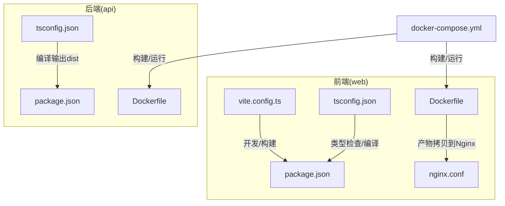
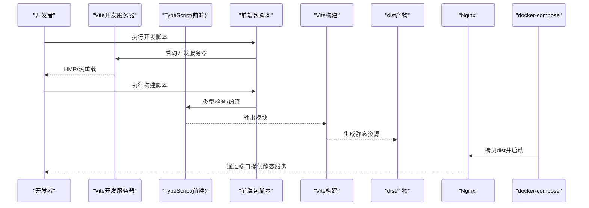
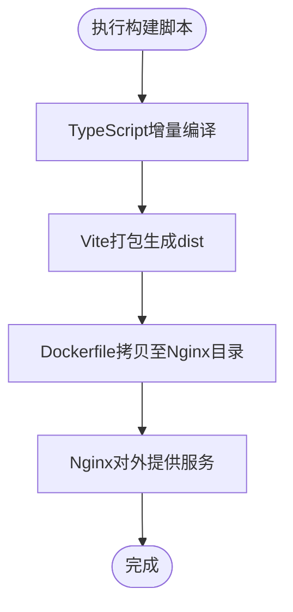
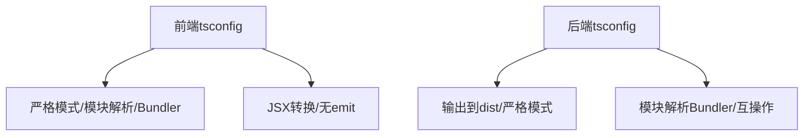
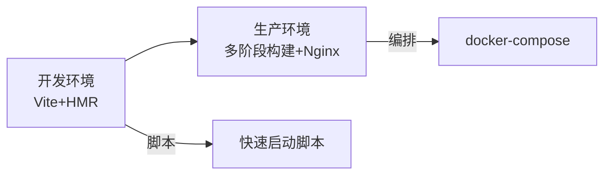
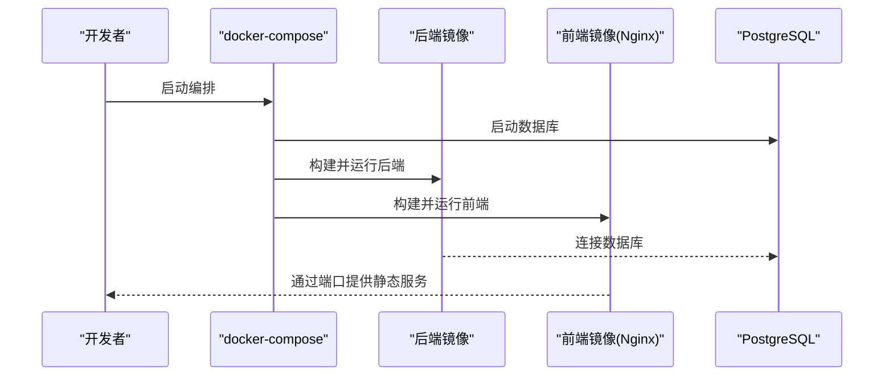
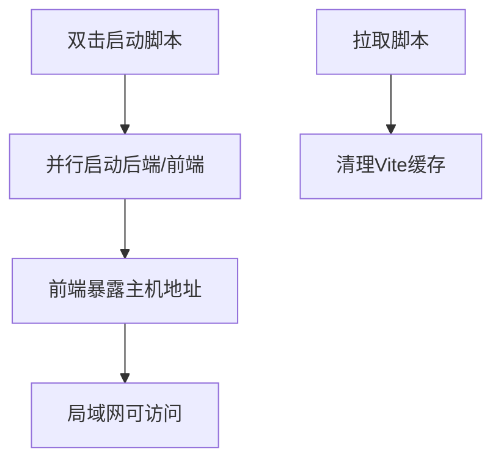
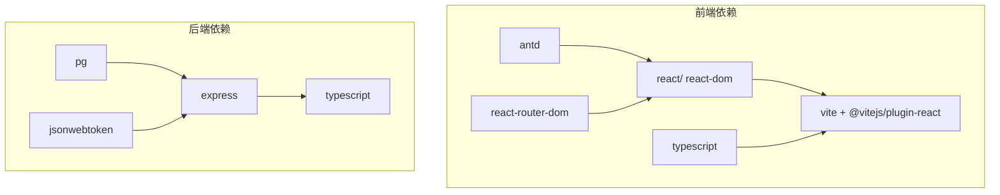

# 构建配置

<cite>
**本文引用的文件**
- [web/vite.config.ts](file://web/vite.config.ts)
- [web/tsconfig.json](file://web/tsconfig.json)
- [web/package.json](file://web/package.json)
- [web/Dockerfile](file://web/Dockerfile)
- [web/nginx.conf](file://web/nginx.conf)
- [api/tsconfig.json](file://api/tsconfig.json)
- [api/package.json](file://api/package.json)
- [api/Dockerfile](file://api/Dockerfile)
- [docker-compose.yml](file://docker-compose.yml)
- [quick-start.bat](file://quick-start.bat)
- [quick-lan-start.bat](file://quick-lan-start.bat)
- [quick-pull.bat](file://quick-pull.bat)
- [quick-save.bat](file://quick-save.bat)
- [web/src/main.tsx](file://web/src/main.tsx)
- [web/src/App.tsx](file://web/src/App.tsx)
</cite>

## 目录
1. [简介](#简介)
2. [项目结构](#项目结构)
3. [核心组件](#核心组件)
4. [架构总览](#架构总览)
5. [详细组件分析](#详细组件分析)
6. [依赖关系分析](#依赖关系分析)
7. [性能考虑](#性能考虑)
8. [故障排查指南](#故障排查指南)
9. [结论](#结论)
10. [附录](#附录)

## 简介
本文件面向前端与全栈开发者，系统性梳理该仓库的构建工具链与容器化部署方案，重点覆盖以下方面：
- Vite 开发与构建配置、TypeScript 编译选项与开发服务器设置
- 开发环境与生产环境的构建差异、优化策略与打包配置
- Docker 容器化配置、镜像构建流程与多阶段构建优化
- 本地开发配置、热重载与调试工具集成
- 环境变量管理、配置文件组织与部署脚本使用
- 性能优化技巧、缓存策略与资源压缩方法

## 项目结构
该项目采用前后端分离的多包结构，前端位于 web 目录，后端位于 api 目录；通过 docker-compose 统一编排数据库、后端服务与前端静态站点。

图表来源
- [web/vite.config.ts:1-10](file://web/vite.config.ts#L1-L10)
- [web/tsconfig.json:1-21](file://web/tsconfig.json#L1-L21)
- [web/package.json:1-26](file://web/package.json#L1-L26)
- [web/Dockerfile:1-16](file://web/Dockerfile#L1-L16)
- [web/nginx.conf:1-11](file://web/nginx.conf#L1-L11)
- [api/tsconfig.json:1-14](file://api/tsconfig.json#L1-L14)
- [api/package.json:1-36](file://api/package.json#L1-L36)
- [api/Dockerfile:1-19](file://api/Dockerfile#L1-L19)
- [docker-compose.yml:1-35](file://docker-compose.yml#L1-L35)

章节来源
- [docker-compose.yml:1-35](file://docker-compose.yml#L1-L35)
- [web/Dockerfile:1-16](file://web/Dockerfile#L1-L16)
- [api/Dockerfile:1-19](file://api/Dockerfile#L1-L19)

## 核心组件
- 前端构建与开发服务器
  - Vite 配置：启用 React 插件，设置开发服务器端口等基础能力
  - TypeScript 配置：严格模式、ESNext 模块解析、JSX 转换等
  - 包脚本：开发、构建、预览命令
- 后端构建与运行
  - TypeScript 配置：输出目录与模块解析策略
  - 包脚本：开发（监听）、构建、运行
- 容器化与编排
  - 多阶段 Dockerfile：依赖安装、构建、运行时分离
  - docker-compose：数据库、后端、前端服务编排与端口映射
  - Nginx：静态站点托管与单页应用路由回退

章节来源
- [web/vite.config.ts:1-10](file://web/vite.config.ts#L1-L10)
- [web/tsconfig.json:1-21](file://web/tsconfig.json#L1-L21)
- [web/package.json:1-26](file://web/package.json#L1-L26)
- [api/tsconfig.json:1-14](file://api/tsconfig.json#L1-L14)
- [api/package.json:1-36](file://api/package.json#L1-L36)
- [web/Dockerfile:1-16](file://web/Dockerfile#L1-L16)
- [api/Dockerfile:1-19](file://api/Dockerfile#L1-L19)
- [docker-compose.yml:1-35](file://docker-compose.yml#L1-L35)

## 架构总览
下图展示从源码到最终运行的端到端流程，包括开发与生产两种路径。

图表来源
- [web/package.json:6-10](file://web/package.json#L6-L10)
- [web/vite.config.ts:4-9](file://web/vite.config.ts#L4-L9)
- [web/Dockerfile:12-16](file://web/Dockerfile#L12-L16)
- [web/nginx.conf:1-11](file://web/nginx.conf#L1-L11)
- [docker-compose.yml:26-32](file://docker-compose.yml#L26-L32)

## 详细组件分析

### Vite 构建与开发服务器
- 插件与基础配置
  - 使用 React 插件，支持 JSX/TSX 热重载与按需编译
  - 开发服务器端口在配置中声明，便于统一管理
- 开发脚本
  - 开发模式直接启动 Vite，支持 HMR
- 构建脚本
  - 先进行类型检查/增量编译，再执行 Vite 打包
- 生产构建产物
  - 由 Vite 生成静态资源，配合 Nginx 提供服务

图表来源
- [web/package.json:6-10](file://web/package.json#L6-L10)
- [web/vite.config.ts:4-9](file://web/vite.config.ts#L4-L9)
- [web/Dockerfile:12-16](file://web/Dockerfile#L12-L16)
- [web/nginx.conf:1-11](file://web/nginx.conf#L1-L11)

章节来源
- [web/vite.config.ts:1-10](file://web/vite.config.ts#L1-L10)
- [web/package.json:6-10](file://web/package.json#L6-L10)

### TypeScript 编译选项
- 前端（web）
  - 目标与模块：ES2020、ESNext，模块解析为 Bundler
  - 严格模式：开启严格、未使用变量/参数检测、switch 不可遗漏分支
  - JSX：使用 react-jsx
  - 无 emit：仅用于类型检查与构建
- 后端（api）
  - 目标与模块：ESNext，Bundler 解析
  - 输出目录：dist
  - 严格与兼容：严格模式与跨模块互操作

图表来源
- [web/tsconfig.json:2-18](file://web/tsconfig.json#L2-L18)
- [api/tsconfig.json:2-12](file://api/tsconfig.json#L2-L12)

章节来源
- [web/tsconfig.json:1-21](file://web/tsconfig.json#L1-L21)
- [api/tsconfig.json:1-14](file://api/tsconfig.json#L1-L14)

### 开发环境与生产环境差异
- 开发环境
  - Vite 开发服务器：快速启动、HMR、按需编译
  - 本地脚本：一键启动前后端或局域网可访问的开发环境
- 生产环境
  - 多阶段构建：依赖安装、构建、运行时分离
  - Nginx 托管：静态资源分发与 SPA 路由回退
  - docker-compose 编排：数据库、后端、前端统一部署

图表来源
- [web/vite.config.ts:6-9](file://web/vite.config.ts#L6-L9)
- [web/Dockerfile:1-16](file://web/Dockerfile#L1-L16)
- [web/nginx.conf:1-11](file://web/nginx.conf#L1-L11)
- [docker-compose.yml:1-35](file://docker-compose.yml#L1-L35)
- [quick-lan-start.bat:46-46](file://quick-lan-start.bat#L46-L46)

章节来源
- [quick-start.bat:6-10](file://quick-start.bat#L6-L10)
- [quick-lan-start.bat:42-47](file://quick-lan-start.bat#L42-L47)

### Docker 容器化与多阶段构建
- 前端镜像
  - 依赖阶段：安装依赖
  - 构建阶段：复制依赖与源码，执行构建
  - 运行阶段：基于 Nginx，拷贝 dist 并加载配置
- 后端镜像
  - 依赖阶段：安装依赖
  - 构建阶段：编译 TS 到 dist
  - 运行阶段：设置生产环境变量，运行 dist/index.js
- 编排
  - 数据库：PostgreSQL（持久化卷）
  - 后端：暴露 3000，依赖数据库
  - 前端：基于 Nginx，映射 5173:80

图表来源
- [docker-compose.yml:1-35](file://docker-compose.yml#L1-L35)
- [api/Dockerfile:1-19](file://api/Dockerfile#L1-L19)
- [web/Dockerfile:1-16](file://web/Dockerfile#L1-L16)

章节来源
- [docker-compose.yml:1-35](file://docker-compose.yml#L1-L35)
- [api/Dockerfile:1-19](file://api/Dockerfile#L1-L19)
- [web/Dockerfile:1-16](file://web/Dockerfile#L1-L16)

### 本地开发配置、热重载与调试
- 快速启动
  - 单击启动：分别在新窗口启动后端与前端
  - 局域网启动：自动放行防火墙、安装依赖、启动后端与前端，并输出局域网访问地址
- 热重载
  - Vite 默认启用 HMR，无需额外配置
- 调试建议
  - 前端：浏览器控制台与 React DevTools
  - 后端：Node 调试器或日志输出
- 缓存清理
  - 提供清理 Vite 临时缓存的脚本，避免缓存导致的问题

图表来源
- [quick-start.bat:6-10](file://quick-start.bat#L6-L10)
- [quick-lan-start.bat:29-47](file://quick-lan-start.bat#L29-L47)
- [quick-pull.bat:41-42](file://quick-pull.bat#L41-L42)

章节来源
- [quick-start.bat:1-14](file://quick-start.bat#L1-L14)
- [quick-lan-start.bat:1-83](file://quick-lan-start.bat#L1-L83)
- [quick-pull.bat:1-54](file://quick-pull.bat#L1-L54)

### 环境变量管理与配置文件组织
- docker-compose 中定义环境变量
  - 数据库连接字符串、后端密钥、API Token 等
- 前端路由与认证
  - 应用入口与路由守卫，结合本地存储令牌进行鉴权
- 配置文件
  - Vite、TypeScript、Nginx、Dockerfile、docker-compose

章节来源
- [docker-compose.yml:16-20](file://docker-compose.yml#L16-L20)
- [web/src/main.tsx:10-10](file://web/src/main.tsx#L10-L10)
- [web/src/App.tsx:15-39](file://web/src/App.tsx#L15-L39)

### 部署脚本使用
- 快速保存：提交并推送至多个远程仓库
- 安全拉取：自动暂存敏感文件，拉取后恢复，清理 Vite 缓存
- 双击启动：一键启动前后端服务

章节来源
- [quick-save.bat:1-34](file://quick-save.bat#L1-L34)
- [quick-pull.bat:1-54](file://quick-pull.bat#L1-L54)
- [quick-start.bat:1-14](file://quick-start.bat#L1-L14)

## 依赖关系分析
- 前端
  - 依赖 React、Ant Design、React Router 等
  - 开发依赖 Vite、React 插件、TypeScript
- 后端
  - 依赖 Express、数据库驱动、JWT、加密等
  - 开发依赖 TypeScript、测试/开发工具
- 构建与运行
  - 前端：TypeScript 编译后交由 Vite 打包
  - 后端：TypeScript 编译为 dist，Node 运行

图表来源
- [web/package.json:11-24](file://web/package.json#L11-L24)
- [api/package.json:11-34](file://api/package.json#L11-L34)

章节来源
- [web/package.json:1-26](file://web/package.json#L1-L26)
- [api/package.json:1-36](file://api/package.json#L1-L36)

## 性能考虑
- 构建优化
  - 使用 ESNext 模块解析与 Bundler，减少不必要的 polyfill
  - 严格模式与未使用检测，降低冗余代码
- 资源优化
  - 生产构建由 Vite 生成静态资源，配合 Nginx 提供服务
  - Nginx 配置启用单页应用回退，确保路由正确
- 缓存策略
  - 建议在 Nginx 层设置静态资源缓存头
  - 前端构建产物具备内容哈希命名，利于长期缓存
- 网络与并发
  - 合理拆分依赖安装与构建阶段，提升 CI/CD 效率
  - 在 docker-compose 中按需暴露端口，避免不必要的网络开销

章节来源
- [web/tsconfig.json:2-18](file://web/tsconfig.json#L2-L18)
- [web/nginx.conf:1-11](file://web/nginx.conf#L1-L11)
- [web/Dockerfile:1-16](file://web/Dockerfile#L1-L16)

## 故障排查指南
- 端口占用与防火墙
  - 局域网启动脚本会尝试放行 Vite 与 API 端口，若失败请以管理员权限运行
- 缓存问题
  - 使用安全拉取脚本清理 Vite 临时缓存，避免旧缓存导致的异常
- 依赖安装
  - 双击启动脚本会自动安装依赖，若失败请检查网络与代理
- 路由回退
  - 确认 Nginx 配置中的单页应用回退逻辑生效

章节来源
- [quick-lan-start.bat:29-31](file://quick-lan-start.bat#L29-L31)
- [quick-pull.bat:41-42](file://quick-pull.bat#L41-L42)
- [web/nginx.conf:8-10](file://web/nginx.conf#L8-L10)

## 结论
本项目采用现代化的前端构建与容器化部署方案：Vite 提供高效的开发体验与构建能力，TypeScript 确保类型安全，docker-compose 实现多服务编排，Nginx 提供稳定的静态资源服务。通过多阶段 Dockerfile 与严格的 TypeScript 配置，兼顾了开发效率与运行时性能。建议在生产环境中进一步完善缓存头、资源压缩与监控告警，以获得更佳的用户体验与运维保障。

## 附录
- 关键文件清单
  - 前端：vite.config.ts、tsconfig.json、package.json、Dockerfile、nginx.conf
  - 后端：tsconfig.json、package.json、Dockerfile
  - 编排：docker-compose.yml
  - 启动脚本：quick-start.bat、quick-lan-start.bat、quick-pull.bat、quick-save.bat
- 推荐实践
  - 在 CI/CD 中缓存 npm 依赖，加速构建
  - 对静态资源启用 gzip/br 压缩与 CDN 加速
  - 使用 HTTPS 与安全响应头加固前端与后端