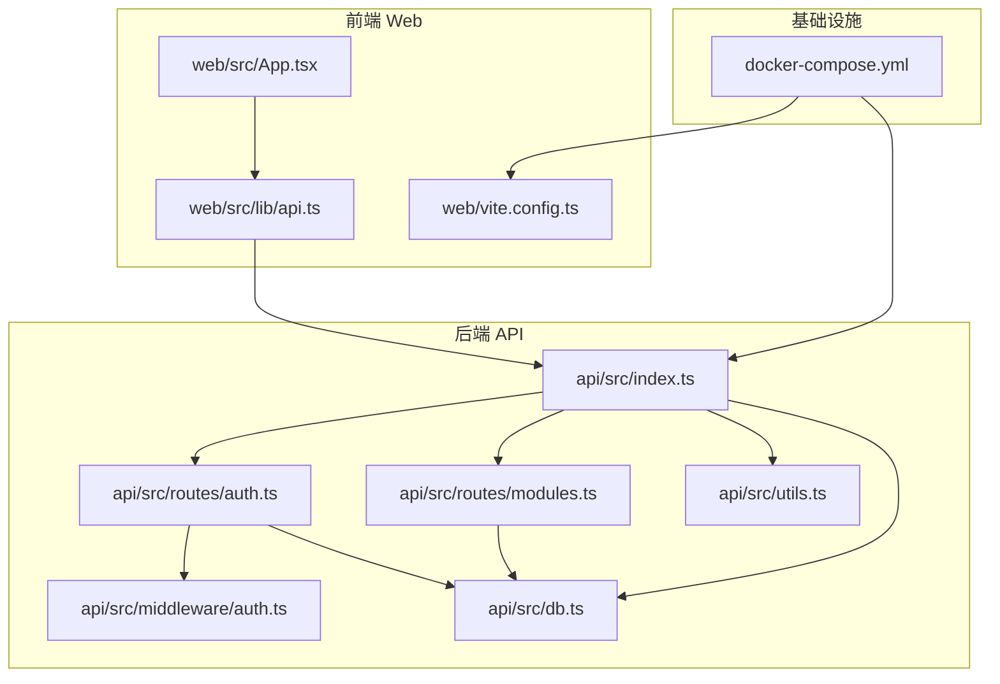
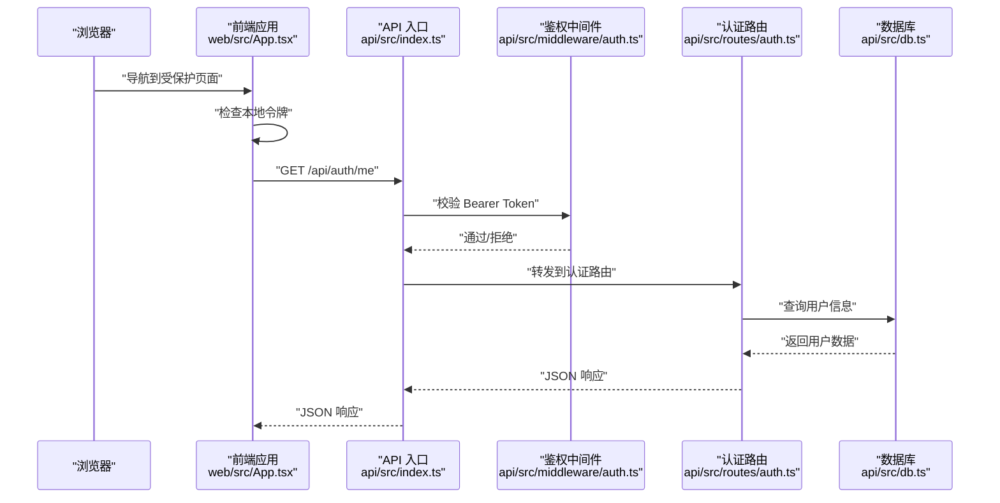
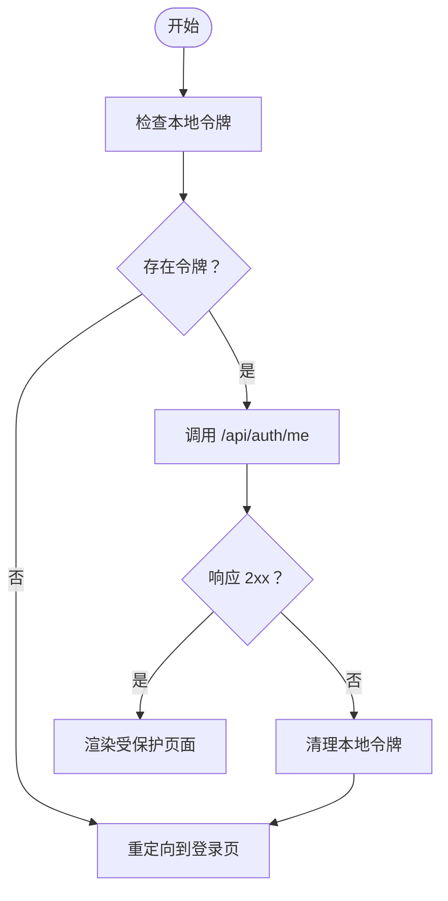
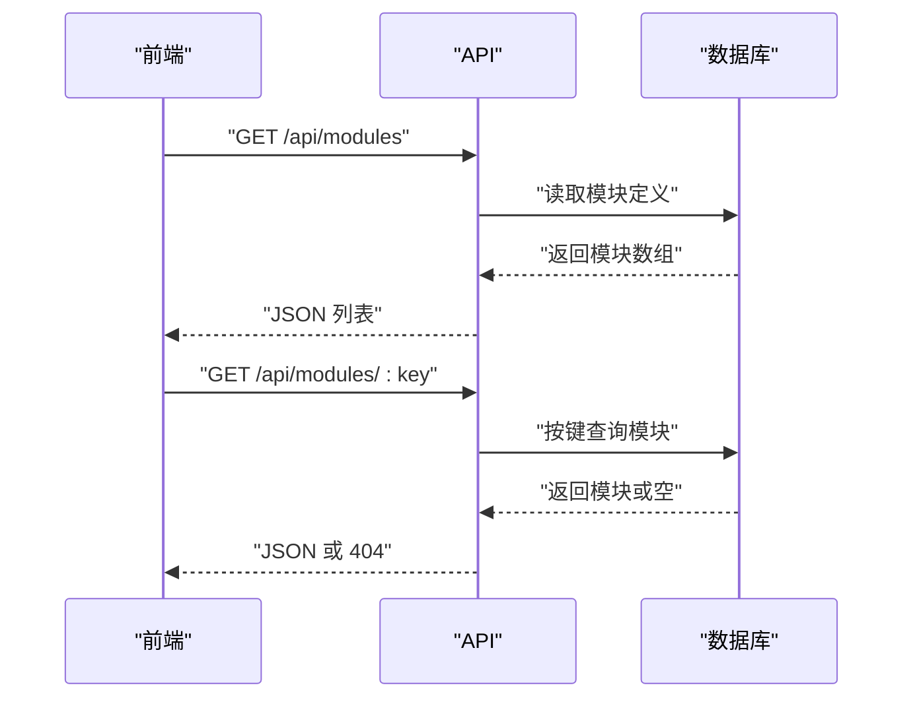
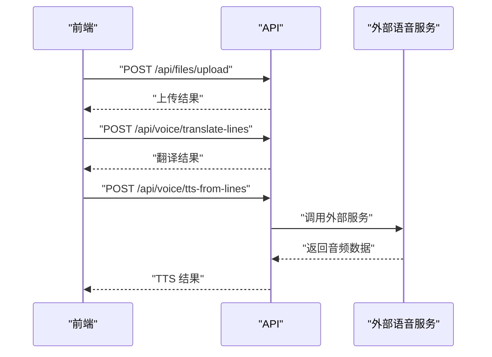
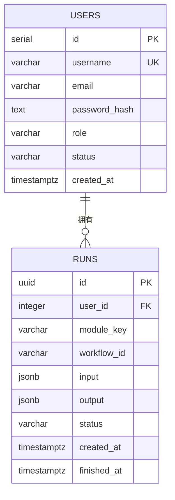
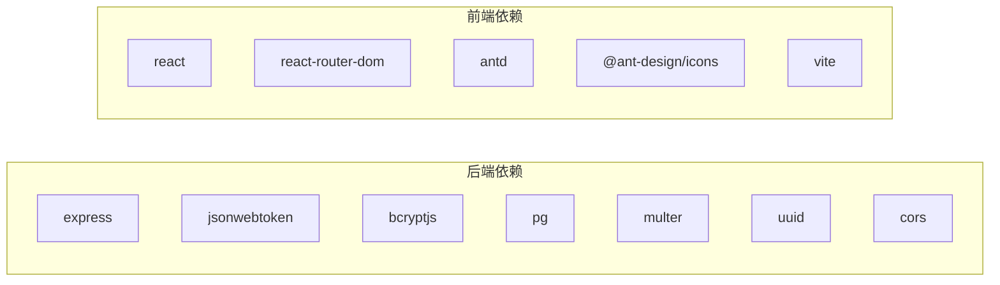

# 测试策略

<cite>
**本文引用的文件**
- [docker-compose.yml](file://docker-compose.yml)
- [api/package.json](file://api/package.json)
- [web/package.json](file://web/package.json)
- [api/src/index.ts](file://api/src/index.ts)
- [api/src/db.ts](file://api/src/db.ts)
- [api/src/utils.ts](file://api/src/utils.ts)
- [api/src/middleware/auth.ts](file://api/src/middleware/auth.ts)
- [api/src/routes/auth.ts](file://api/src/routes/auth.ts)
- [api/src/routes/modules.ts](file://api/src/routes/modules.ts)
- [web/src/App.tsx](file://web/src/App.tsx)
- [web/src/lib/api.ts](file://web/src/lib/api.ts)
- [web/vite.config.ts](file://web/vite.config.ts)
</cite>

## 目录
1. [引言](#引言)
2. [项目结构](#项目结构)
3. [核心组件](#核心组件)
4. [架构总览](#架构总览)
5. [详细组件分析](#详细组件分析)
6. [依赖分析](#依赖分析)
7. [性能考虑](#性能考虑)
8. [故障排查指南](#故障排查指南)
9. [结论](#结论)
10. [附录](#附录)

## 引言
本测试策略文档面向该仓库的后端 API 与前端 Web 应用，系统化地定义单元测试、集成测试与端到端测试的实施方法与最佳实践。内容覆盖测试框架选择建议、测试环境配置、测试数据管理、API 接口测试、前端组件测试与用户交互测试、测试用例编写规范、断言方法与模拟对象使用、测试覆盖率要求、持续集成配置与自动化测试流程，以及性能测试、安全测试与兼容性测试的实施策略。

## 项目结构
该项目采用前后端分离架构：后端基于 Express 的 Node.js API，前端基于 React + Vite。数据库使用 PostgreSQL，通过 docker-compose 提供统一的本地开发与测试环境编排。

**图示来源**
- [api/src/index.ts:1-29](file://api/src/index.ts#L1-L29)
- [api/src/routes/auth.ts:1-115](file://api/src/routes/auth.ts#L1-L115)
- [api/src/routes/modules.ts:1-20](file://api/src/routes/modules.ts#L1-L20)
- [api/src/middleware/auth.ts:1-23](file://api/src/middleware/auth.ts#L1-L23)
- [api/src/utils.ts:1-21](file://api/src/utils.ts#L1-L21)
- [api/src/db.ts:1-35](file://api/src/db.ts#L1-L35)
- [web/src/App.tsx:1-70](file://web/src/App.tsx#L1-L70)
- [web/src/lib/api.ts:1-160](file://web/src/lib/api.ts#L1-L160)
- [web/vite.config.ts:1-10](file://web/vite.config.ts#L1-L10)
- [docker-compose.yml:1-35](file://docker-compose.yml#L1-L35)

**章节来源**
- [docker-compose.yml:1-35](file://docker-compose.yml#L1-L35)
- [api/src/index.ts:1-29](file://api/src/index.ts#L1-L29)
- [web/src/App.tsx:1-70](file://web/src/App.tsx#L1-L70)

## 核心组件
- 后端 API 入口与路由
  - 路由分组：认证、模块信息、文件、运行任务、语音服务等。
  - 中间件：鉴权中间件负责校验 Bearer Token 并注入用户上下文。
  - 数据层：PostgreSQL 连接池与初始化脚本。
  - 工具：JWT 签发与校验、密码加盐与比对。
- 前端应用与 API 客户端
  - 路由守卫：基于本地存储的令牌进行登录态判断与未授权处理。
  - API 客户端：统一封装请求头、错误处理、流式事件解析、文件上传等。
  - 开发服务器：Vite 默认端口 5173。

**章节来源**
- [api/src/routes/auth.ts:1-115](file://api/src/routes/auth.ts#L1-L115)
- [api/src/routes/modules.ts:1-20](file://api/src/routes/modules.ts#L1-L20)
- [api/src/middleware/auth.ts:1-23](file://api/src/middleware/auth.ts#L1-L23)
- [api/src/db.ts:1-35](file://api/src/db.ts#L1-L35)
- [api/src/utils.ts:1-21](file://api/src/utils.ts#L1-L21)
- [web/src/App.tsx:1-70](file://web/src/App.tsx#L1-L70)
- [web/src/lib/api.ts:1-160](file://web/src/lib/api.ts#L1-L160)
- [web/vite.config.ts:1-10](file://web/vite.config.ts#L1-L10)

## 架构总览
下图展示从浏览器到后端 API 的典型调用链路，以及数据库访问路径。

**图示来源**
- [web/src/App.tsx:17-39](file://web/src/App.tsx#L17-L39)
- [web/src/lib/api.ts:13-36](file://web/src/lib/api.ts#L13-L36)
- [api/src/index.ts:1-29](file://api/src/index.ts#L1-L29)
- [api/src/middleware/auth.ts:8-22](file://api/src/middleware/auth.ts#L8-L22)
- [api/src/routes/auth.ts:100-112](file://api/src/routes/auth.ts#L100-L112)
- [api/src/db.ts:6-8](file://api/src/db.ts#L6-L8)

## 详细组件分析

### 认证与授权测试
- 单元测试要点
  - 密码加盐与比对：验证哈希算法一致性与边界输入。
  - JWT 签发与校验：覆盖签发载荷、过期时间、签名篡改场景。
  - 鉴权中间件：模拟缺失/无效/过期 Token 的请求路径。
- 集成测试要点
  - 注册：用户名重复、必填字段缺失、数据库约束。
  - 登录：用户名不存在、密码错误、正常登录。
  - 查询当前用户：未登录、用户不存在、正常返回。
  - 重置密码：权限不足、目标用户不存在、正常更新。
- 端到端测试要点
  - 前端路由守卫：未登录跳转登录页；登录后可访问受保护页面。
  - 未授权自动登出：收到 401 清理本地令牌并跳转登录。

**图示来源**
- [web/src/App.tsx:17-39](file://web/src/App.tsx#L17-L39)
- [web/src/lib/api.ts:13-36](file://web/src/lib/api.ts#L13-L36)

**章节来源**
- [api/src/utils.ts:5-20](file://api/src/utils.ts#L5-L20)
- [api/src/middleware/auth.ts:8-22](file://api/src/middleware/auth.ts#L8-L22)
- [api/src/routes/auth.ts:8-112](file://api/src/routes/auth.ts#L8-L112)
- [web/src/App.tsx:17-39](file://web/src/App.tsx#L17-L39)
- [web/src/lib/api.ts:13-36](file://web/src/lib/api.ts#L13-L36)

### 模块信息与运行任务测试
- 单元测试要点
  - 模块键值存在性与返回结构。
- 集成测试要点
  - GET /api/modules 获取全部模块列表。
  - GET /api/modules/:key 获取指定模块详情（存在/不存在）。
- 端到端测试要点
  - 前端页面加载模块列表与详情，错误提示与回退行为。

**图示来源**
- [api/src/routes/modules.ts:6-17](file://api/src/routes/modules.ts#L6-L17)
- [api/src/db.ts:10-34](file://api/src/db.ts#L10-L34)

**章节来源**
- [api/src/routes/modules.ts:1-20](file://api/src/routes/modules.ts#L1-L20)
- [api/src/db.ts:10-34](file://api/src/db.ts#L10-L34)

### 文件上传与语音服务测试
- 单元测试要点
  - 上传接口封装、表单构建与鉴权头设置。
  - 语音配置与翻译/合成接口的请求参数与响应结构。
- 集成测试要点
  - 上传文件：鉴权、文件类型/大小限制、后端接收与存储。
  - 语音配置：返回 studioUrl、apiUrl、baseUrl。
  - 行文本翻译与 TTS：输入参数校验、错误消息透传。
- 端到端测试要点
  - 前端触发上传与语音流程，观察 UI 反馈与错误提示。

**图示来源**
- [web/src/lib/api.ts:39-56](file://web/src/lib/api.ts#L39-L56)
- [web/src/lib/api.ts:128-160](file://web/src/lib/api.ts#L128-L160)

**章节来源**
- [web/src/lib/api.ts:39-56](file://web/src/lib/api.ts#L39-L56)
- [web/src/lib/api.ts:128-160](file://web/src/lib/api.ts#L128-L160)

### 数据库与模式初始化测试
- 单元测试要点
  - 连接池配置与连接字符串有效性。
- 集成测试要点
  - 初始化脚本：users 与 runs 表创建、索引与约束。
  - 运行任务表：UUID 主键、外键、JSON 字段、状态与时间戳。

**图示来源**
- [api/src/db.ts:10-34](file://api/src/db.ts#L10-L34)

**章节来源**
- [api/src/db.ts:1-35](file://api/src/db.ts#L1-L35)

## 依赖分析
- 外部依赖与版本
  - 后端：Express、jsonwebtoken、bcryptjs、pg、cors、multer、node-fetch、uuid、dotenv。
  - 前端：React、react-router-dom、antd、@ant-design/icons、vite、@vitejs/plugin-react。
- 测试相关建议
  - 后端：可选 Jest + Supertest 进行路由与业务逻辑测试；必要时使用 pg-mem 或 Testcontainers 管理测试数据库。
  - 前端：可选 Vitest + React Testing Library 进行组件测试；Playwright/Cypress 进行 E2E。

**图示来源**
- [api/package.json:11-34](file://api/package.json#L11-L34)
- [web/package.json:11-24](file://web/package.json#L11-L24)

**章节来源**
- [api/package.json:1-36](file://api/package.json#L1-L36)
- [web/package.json:1-26](file://web/package.json#L1-L26)

## 性能考虑
- API 层
  - 请求体大小限制与流式处理：注意 JSON 限制与 SSE/流式响应的内存占用。
  - 中间件开销：鉴权中间件每次请求都会执行解码与校验，建议缓存短期会话或优化签名算法。
- 数据库层
  - 连接池配置：根据并发量调整最大连接数与超时时间。
  - 查询优化：对高频查询建立合适索引，避免 N+1 查询。
- 前端层
  - 资源打包与懒加载：减少首屏体积，提升交互流畅度。
  - 请求去抖与节流：对频繁触发的 API 调用进行节流控制。

[本节为通用指导，不直接分析具体文件]

## 故障排查指南
- 常见问题定位
  - 401 未授权：检查前端是否正确设置 Authorization 头，后端 JWT Secret 是否一致。
  - 数据库连接失败：确认 docker-compose 环境变量与网络连通性。
  - 路由 404：核对路由前缀与路径拼接，确保 API 基础路径配置正确。
- 日志与监控
  - 后端：在开发阶段开启详细日志，定位鉴权与数据库异常。
  - 前端：捕获 fetch 错误并上报，结合浏览器开发者工具 Network 面板分析。

**章节来源**
- [web/src/lib/api.ts:13-36](file://web/src/lib/api.ts#L13-L36)
- [api/src/middleware/auth.ts:8-22](file://api/src/middleware/auth.ts#L8-L22)
- [docker-compose.yml:1-35](file://docker-compose.yml#L1-L35)

## 结论
本测试策略以“自底向上”的方式覆盖从数据库到 API 再到前端的关键路径，强调单元测试的原子性、集成测试的端到端闭环与端到端测试的用户视角验证。配合合理的测试环境与数据管理策略，可有效保障系统的稳定性与可维护性。

[本节为总结性内容，不直接分析具体文件]

## 附录

### 测试框架与工具建议
- 后端
  - 单元测试：Jest
  - 集成测试：Supertest
  - 测试数据库：Testcontainers 或临时 Postgres 实例
- 前端
  - 单元测试：Vitest + React Testing Library
  - 端到端测试：Playwright 或 Cypress
- 持续集成
  - 使用 GitHub Actions 或 GitLab CI，步骤包括：安装依赖、启动数据库容器、运行测试、生成覆盖率报告、发布制品。

[本节为通用指导，不直接分析具体文件]

### 测试用例编写规范
- 命名规范
  - describe 描述功能域；it 描述具体场景与期望。
- 断言方法
  - 使用明确的断言语义（存在、相等、包含、抛错）。
- 模拟对象
  - 对外部依赖（数据库、HTTP 客户端、JWT 工具）进行模拟，隔离被测单元。
- 测试数据管理
  - 使用固定种子数据或测试专用数据库快照，保证可重复性。

[本节为通用指导，不直接分析具体文件]

### 测试覆盖率要求
- 业务关键路径：语句覆盖率 ≥ 80%，分支覆盖率 ≥ 60%。
- API 路由与中间件：100% 覆盖正常与异常分支。
- 前端核心组件：交互路径覆盖率 ≥ 70%，关键逻辑 100%。

[本节为通用指导，不直接分析具体文件]

### 自动化测试流程
- 本地开发
  - 在本地启动 docker-compose，运行前端与后端服务，执行单元与集成测试。
- CI/CD
  - 步骤：拉取依赖 → 启动数据库容器 → 执行测试 → 生成覆盖率报告 → 成功后部署。

**章节来源**
- [docker-compose.yml:1-35](file://docker-compose.yml#L1-L35)