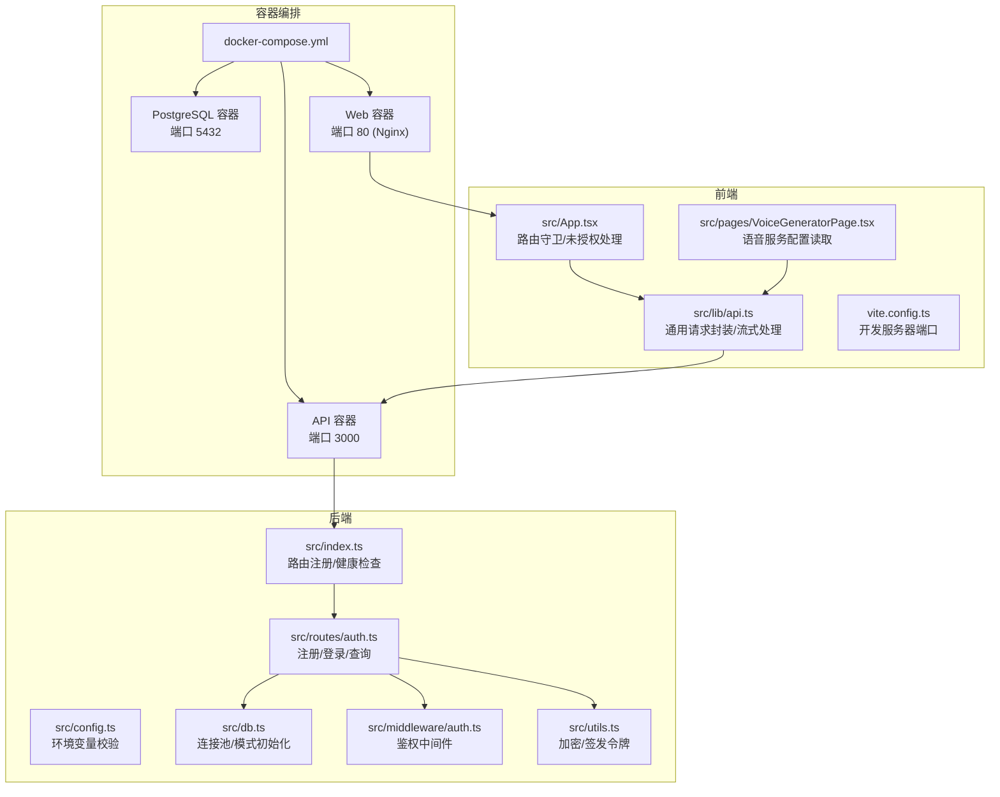
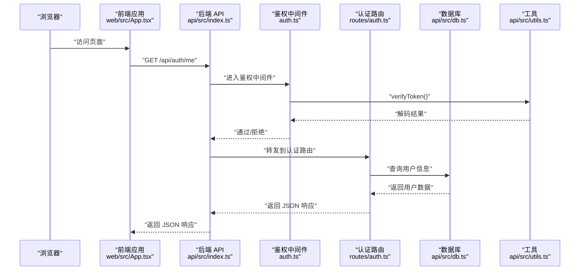
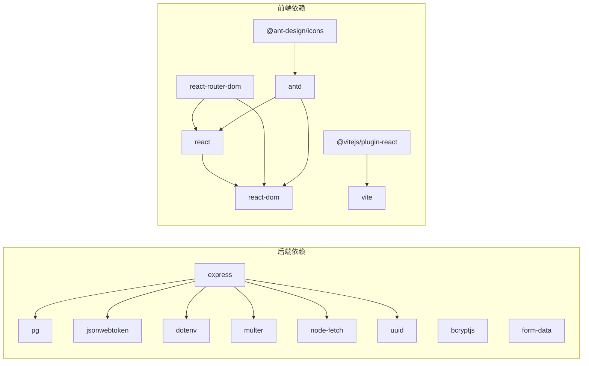
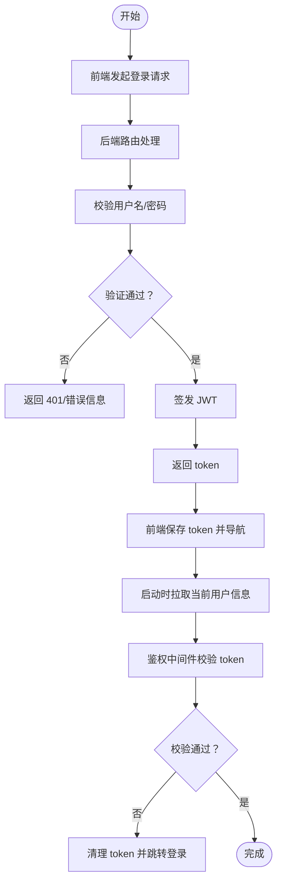

# 调试与故障排除

<cite>
**本文引用的文件**
- [docker-compose.yml](file://docker-compose.yml)
- [api/package.json](file://api/package.json)
- [web/package.json](file://web/package.json)
- [api/src/index.ts](file://api/src/index.ts)
- [api/src/config.ts](file://api/src/config.ts)
- [api/src/db.ts](file://api/src/db.ts)
- [api/src/utils.ts](file://api/src/utils.ts)
- [api/src/middleware/auth.ts](file://api/src/middleware/auth.ts)
- [api/src/routes/auth.ts](file://api/src/routes/auth.ts)
- [web/src/App.tsx](file://web/src/App.tsx)
- [web/src/lib/api.ts](file://web/src/lib/api.ts)
- [web/src/pages/VoiceGeneratorPage.tsx](file://web/src/pages/VoiceGeneratorPage.tsx)
- [web/vite.config.ts](file://web/vite.config.ts)
- [quick-start.bat](file://quick-start.bat)
- [quick-lan-start.bat](file://quick-lan-start.bat)
</cite>

## 目录
1. [简介](#简介)
2. [项目结构](#项目结构)
3. [核心组件](#核心组件)
4. [架构总览](#架构总览)
5. [详细组件分析](#详细组件分析)
6. [依赖关系分析](#依赖关系分析)
7. [性能考虑](#性能考虑)
8. [故障排除指南](#故障排除指南)
9. [结论](#结论)
10. [附录](#附录)

## 简介
本指南面向开发与运维人员，聚焦于该代码库在开发与生产环境中常见的问题定位与解决方法。内容覆盖编译与启动错误、运行时异常、网络请求失败、数据库连接问题、API 调用异常、前端组件渲染错误、性能分析与内存泄漏检测、并发问题排查、开发环境依赖冲突与版本兼容性问题，以及生产环境监控与应急响应流程。文档同时提供可视化图示与可操作的排查步骤，帮助快速恢复系统稳定。

## 项目结构
该项目采用前后端分离架构：
- 后端 API 使用 Express + TypeScript，通过 Docker Compose 编排 PostgreSQL 数据库、后端服务与前端服务。
- 前端使用 Vite + React，通过代理与后端交互；路由守卫与认证状态管理集中在前端应用中。

图表来源
- [docker-compose.yml:1-35](file://docker-compose.yml#L1-L35)
- [api/src/index.ts:1-29](file://api/src/index.ts#L1-L29)
- [api/src/config.ts:1-19](file://api/src/config.ts#L1-L19)
- [api/src/db.ts:1-35](file://api/src/db.ts#L1-L35)
- [api/src/middleware/auth.ts:1-23](file://api/src/middleware/auth.ts#L1-L23)
- [api/src/routes/auth.ts:1-115](file://api/src/routes/auth.ts#L1-L115)
- [api/src/utils.ts:1-21](file://api/src/utils.ts#L1-L21)
- [web/src/App.tsx:1-70](file://web/src/App.tsx#L1-L70)
- [web/src/lib/api.ts:1-160](file://web/src/lib/api.ts#L1-L160)
- [web/src/pages/VoiceGeneratorPage.tsx:1-95](file://web/src/pages/VoiceGeneratorPage.tsx#L1-L95)
- [web/vite.config.ts:1-10](file://web/vite.config.ts#L1-L10)

章节来源
- [docker-compose.yml:1-35](file://docker-compose.yml#L1-L35)
- [api/src/index.ts:1-29](file://api/src/index.ts#L1-L29)
- [web/src/App.tsx:1-70](file://web/src/App.tsx#L1-L70)

## 核心组件
- 后端入口与路由：负责注册路由、启用 CORS、JSON 解析、健康检查与启动监听。
- 配置模块：加载 .env 并校验必需环境变量，提供端口、数据库连接串、密钥等配置。
- 数据库模块：基于连接池初始化表结构（用户、运行记录），确保 schema 存在。
- 鉴权中间件：从 Authorization 头解析 Bearer Token，验证失败返回 401。
- 认证路由：注册、登录、重置密码、查询当前用户信息。
- 加密与令牌：bcrypt 密码哈希与 jsonwebtoken 签发/校验。
- 前端应用：路由守卫、未授权回调、本地存储令牌、统一请求封装。
- 请求库：通用 fetch 封装、文件上传、SSE 流式处理、语音相关 API。
- 开发脚本：一键启动后端与前端、局域网可访问的启动脚本。

章节来源
- [api/src/index.ts:1-29](file://api/src/index.ts#L1-L29)
- [api/src/config.ts:1-19](file://api/src/config.ts#L1-L19)
- [api/src/db.ts:1-35](file://api/src/db.ts#L1-L35)
- [api/src/middleware/auth.ts:1-23](file://api/src/middleware/auth.ts#L1-L23)
- [api/src/routes/auth.ts:1-115](file://api/src/routes/auth.ts#L1-L115)
- [api/src/utils.ts:1-21](file://api/src/utils.ts#L1-L21)
- [web/src/App.tsx:1-70](file://web/src/App.tsx#L1-L70)
- [web/src/lib/api.ts:1-160](file://web/src/lib/api.ts#L1-L160)

## 架构总览
下图展示从浏览器到后端 API 的典型调用链路，以及数据库与外部服务的交互点。

图表来源
- [api/src/index.ts:1-29](file://api/src/index.ts#L1-L29)
- [api/src/middleware/auth.ts:1-23](file://api/src/middleware/auth.ts#L1-L23)
- [api/src/routes/auth.ts:1-115](file://api/src/routes/auth.ts#L1-L115)
- [api/src/db.ts:1-35](file://api/src/db.ts#L1-L35)
- [api/src/utils.ts:1-21](file://api/src/utils.ts#L1-L21)
- [web/src/App.tsx:1-70](file://web/src/App.tsx#L1-L70)

## 详细组件分析

### 后端入口与路由
- 功能要点：启用 CORS、JSON 解析、健康检查、注册各模块路由。
- 常见问题：端口占用、CORS 配置不当导致跨域失败、路由挂载顺序影响中间件执行。
- 排查建议：确认端口映射与宿主机冲突；检查请求头 Content-Type；核对路由前缀一致性。

章节来源
- [api/src/index.ts:1-29](file://api/src/index.ts#L1-L29)

### 配置模块
- 功能要点：加载 .env，校验 COZE_API_TOKEN、DATABASE_URL、JWT_SECRET、VOICE_BASE_URL 是否存在。
- 常见问题：缺少必要环境变量导致启动即抛错；DATABASE_URL 格式不正确。
- 排查建议：在容器内检查环境变量注入；核对连接串格式与数据库可达性。

章节来源
- [api/src/config.ts:1-19](file://api/src/config.ts#L1-L19)

### 数据库模块
- 功能要点：基于连接池创建用户与运行记录表；启动时确保 schema 存在。
- 常见问题：数据库不可达、权限不足、连接池耗尽。
- 排查建议：检查数据库容器日志；确认连接串与凭据；查看连接池参数与最大连接数。

章节来源
- [api/src/db.ts:1-35](file://api/src/db.ts#L1-L35)

### 鉴权中间件
- 功能要点：从 Authorization 头提取 Bearer Token，使用 jwt 秘钥验证；失败返回 401。
- 常见问题：前端未携带或携带错误 Token；JWT 秘钥不一致；Token 过期。
- 排查建议：确认前端是否正确写入本地存储；核对 JWT_SECRET；检查 token 过期时间。

章节来源
- [api/src/middleware/auth.ts:1-23](file://api/src/middleware/auth.ts#L1-L23)
- [api/src/utils.ts:1-21](file://api/src/utils.ts#L1-L21)

### 认证路由
- 功能要点：注册、登录、重置密码、查询当前用户；使用 bcrypt 哈希与数据库交互。
- 常见问题：用户名重复、密码错误、权限不足、用户不存在。
- 排查建议：检查数据库中用户是否存在；确认密码哈希算法与盐值；核对角色与权限逻辑。

章节来源
- [api/src/routes/auth.ts:1-115](file://api/src/routes/auth.ts#L1-L115)

### 前端应用与路由守卫
- 功能要点：路由守卫 RequireAuth；未授权回调清理本地 token 并跳转登录；启动时拉取当前用户信息。
- 常见问题：刷新后未登录态丢失、未授权跳转循环、路由层级错误。
- 排查建议：确认本地存储键名一致；检查路由嵌套与元素包裹；验证鉴权回调触发时机。

章节来源
- [web/src/App.tsx:1-70](file://web/src/App.tsx#L1-L70)

### 请求库与流式处理
- 功能要点：统一设置 Content-Type 与 Authorization；401 自动清理 token 并触发未授权回调；SSE 流式事件解析；上传文件支持。
- 常见问题：CORS 未允许 Authorization；SSE 事件分片解析异常；上传文件大小限制。
- 排查建议：确认后端 CORS 配置；检查 SSE 事件格式与分隔符；调整后端 JSON 解析大小限制。

章节来源
- [web/src/lib/api.ts:1-160](file://web/src/lib/api.ts#L1-L160)

### 语音服务页面
- 功能要点：加载语音服务配置（studioUrl、apiUrl），渲染 iframe。
- 常见问题：配置接口返回异常、iframe 地址为空、跨域限制。
- 排查建议：检查后端语音配置接口可用性；确认目标站点允许被 iframe 嵌入；核对网络连通性。

章节来源
- [web/src/pages/VoiceGeneratorPage.tsx:1-95](file://web/src/pages/VoiceGeneratorPage.tsx#L1-L95)

## 依赖关系分析
- 后端依赖：Express、CORS、jsonwebtoken、bcryptjs、pg、dotenv、node-fetch、multer、uuid 等。
- 前端依赖：React、ReactDOM、Ant Design、react-router-dom、@vitejs/plugin-react、typescript、vite 等。
- 编排依赖：Docker Compose 服务间依赖（db → api → web），端口映射与环境变量注入。

图表来源
- [api/package.json:11-34](file://api/package.json#L11-L34)
- [web/package.json:11-24](file://web/package.json#L11-L24)

章节来源
- [api/package.json:1-36](file://api/package.json#L1-L36)
- [web/package.json:1-26](file://web/package.json#L1-L26)

## 性能考虑
- 数据库连接池：合理设置最大连接数与空闲超时，避免连接池耗尽导致请求排队。
- 请求体大小：后端 JSON 解析默认大小限制，上传大文件需调整或使用分片上传。
- 前端渲染：避免不必要的重渲染，使用 React.memo、useMemo、useCallback。
- 日志与指标：在关键路径埋点，结合容器日志与 APM 工具进行性能分析。
- 内存泄漏检测：定期检查长生命周期对象引用，前端关注事件监听器与定时器清理。
- 并发问题：后端注意数据库事务与锁竞争；前端注意异步任务取消与竞态条件。

## 故障排除指南

### 一、编译与启动错误
- 症状：TypeScript 编译失败、依赖安装报错、端口占用。
- 排查步骤：
  - 确认 Node.js 与包管理器版本满足项目要求。
  - 清理 node_modules 与缓存后重新安装依赖。
  - 检查端口占用并修改映射或释放端口。
  - 使用一键启动脚本快速复现问题。
- 参考文件：
  - [api/package.json:6-10](file://api/package.json#L6-L10)
  - [web/package.json:6-10](file://web/package.json#L6-L10)
  - [quick-start.bat:1-14](file://quick-start.bat#L1-L14)
  - [quick-lan-start.bat:42-47](file://quick-lan-start.bat#L42-L47)

章节来源
- [api/package.json:6-10](file://api/package.json#L6-L10)
- [web/package.json:6-10](file://web/package.json#L6-L10)
- [quick-start.bat:1-14](file://quick-start.bat#L1-L14)
- [quick-lan-start.bat:42-47](file://quick-lan-start.bat#L42-L47)

### 二、运行时异常
- 症状：进程崩溃、未捕获异常、中间件未生效。
- 排查步骤：
  - 检查后端启动日志与健康检查接口。
  - 核对鉴权中间件是否正确挂载到目标路由。
  - 在开发模式下启用调试器定位异常堆栈。
- 参考文件：
  - [api/src/index.ts:15-17](file://api/src/index.ts#L15-L17)
  - [api/src/middleware/auth.ts:8-22](file://api/src/middleware/auth.ts#L8-L22)

章节来源
- [api/src/index.ts:15-17](file://api/src/index.ts#L15-L17)
- [api/src/middleware/auth.ts:8-22](file://api/src/middleware/auth.ts#L8-L22)

### 三、网络请求失败
- 症状：跨域失败、401 未授权、SSE 无法接收消息、上传失败。
- 排查步骤：
  - 前端检查 VITE_API_BASE 是否指向正确的后端地址。
  - 后端确认 CORS 配置与路由前缀一致。
  - 检查 Authorization 头是否正确传递与携带。
  - 对比后端 JSON 解析大小限制与前端请求体大小。
  - 验证 SSE 事件格式与分隔符。
- 参考文件：
  - [web/src/lib/api.ts:1-36](file://web/src/lib/api.ts#L1-L36)
  - [web/src/lib/api.ts:58-115](file://web/src/lib/api.ts#L58-L115)
  - [api/src/index.ts:12-13](file://api/src/index.ts#L12-L13)

章节来源
- [web/src/lib/api.ts:1-36](file://web/src/lib/api.ts#L1-L36)
- [web/src/lib/api.ts:58-115](file://web/src/lib/api.ts#L58-L115)
- [api/src/index.ts:12-13](file://api/src/index.ts#L12-L13)

### 四、数据库连接问题
- 症状：启动时报数据库连接失败、查询超时、权限错误。
- 排查步骤：
  - 检查数据库容器日志与端口映射。
  - 核对 DATABASE_URL 格式与凭据。
  - 确认 schema 初始化是否成功。
  - 检查连接池参数与最大连接数。
- 参考文件：
  - [docker-compose.yml:2-11](file://docker-compose.yml#L2-L11)
  - [api/src/config.ts:14-16](file://api/src/config.ts#L14-L16)
  - [api/src/db.ts:6-8](file://api/src/db.ts#L6-L8)
  - [api/src/db.ts:10-34](file://api/src/db.ts#L10-L34)

章节来源
- [docker-compose.yml:2-11](file://docker-compose.yml#L2-L11)
- [api/src/config.ts:14-16](file://api/src/config.ts#L14-L16)
- [api/src/db.ts:6-8](file://api/src/db.ts#L6-L8)
- [api/src/db.ts:10-34](file://api/src/db.ts#L10-L34)

### 五、API 调用异常
- 症状：鉴权失败、用户不存在、权限不足、查询不到当前用户。
- 排查步骤：
  - 确认前端是否正确写入/清除 token。
  - 核对 JWT_SECRET 与签发方一致。
  - 检查用户是否存在与状态正常。
  - 验证路由权限与角色判断逻辑。
- 参考文件：
  - [web/src/App.tsx:17-39](file://web/src/App.tsx#L17-L39)
  - [web/src/lib/api.ts:9-11](file://web/src/lib/api.ts#L9-L11)
  - [api/src/middleware/auth.ts:14-21](file://api/src/middleware/auth.ts#L14-L21)
  - [api/src/routes/auth.ts:100-112](file://api/src/routes/auth.ts#L100-L112)

章节来源
- [web/src/App.tsx:17-39](file://web/src/App.tsx#L17-L39)
- [web/src/lib/api.ts:9-11](file://web/src/lib/api.ts#L9-L11)
- [api/src/middleware/auth.ts:14-21](file://api/src/middleware/auth.ts#L14-L21)
- [api/src/routes/auth.ts:100-112](file://api/src/routes/auth.ts#L100-L112)

### 六、前端组件渲染错误
- 症状：页面空白、路由不匹配、iframe 无法加载。
- 排查步骤：
  - 检查路由嵌套与 RequireAuth 包裹关系。
  - 确认本地存储键名与读取逻辑一致。
  - 核对语音服务配置接口返回与 iframe 地址。
- 参考文件：
  - [web/src/App.tsx:41-66](file://web/src/App.tsx#L41-L66)
  - [web/src/pages/VoiceGeneratorPage.tsx:10-25](file://web/src/pages/VoiceGeneratorPage.tsx#L10-L25)

章节来源
- [web/src/App.tsx:41-66](file://web/src/App.tsx#L41-L66)
- [web/src/pages/VoiceGeneratorPage.tsx:10-25](file://web/src/pages/VoiceGeneratorPage.tsx#L10-L25)

### 七、性能分析与内存泄漏检测
- 建议措施：
  - 后端：开启慢查询日志、连接池监控、CPU/内存采样。
  - 前端：使用 React DevTools Profiler、Performance 面板、内存快照。
  - 网络：抓包分析请求耗时与重试行为。
- 参考文件：
  - [web/vite.config.ts:6-8](file://web/vite.config.ts#L6-L8)

章节来源
- [web/vite.config.ts:6-8](file://web/vite.config.ts#L6-L8)

### 八、并发问题排查
- 建议措施：
  - 后端：检查数据库事务边界、锁等待、重试策略。
  - 前端：避免重复提交、取消未完成的请求、处理竞态。
- 参考文件：
  - [api/src/db.ts:6-8](file://api/src/db.ts#L6-L8)
  - [web/src/lib/api.ts:13-36](file://web/src/lib/api.ts#L13-L36)

章节来源
- [api/src/db.ts:6-8](file://api/src/db.ts#L6-L8)
- [web/src/lib/api.ts:13-36](file://web/src/lib/api.ts#L13-L36)

### 九、开发环境问题与依赖冲突
- 症状：安装失败、版本不兼容、构建产物异常。
- 排查步骤：
  - 清理 node_modules、package-lock.json、缓存后重装。
  - 锁定 Node 与包管理器版本，避免差异。
  - 使用官方脚本快速复现并对比环境差异。
- 参考文件：
  - [quick-start.bat:6-10](file://quick-start.bat#L6-L10)
  - [quick-lan-start.bat:36-41](file://quick-lan-start.bat#L36-L41)

章节来源
- [quick-start.bat:6-10](file://quick-start.bat#L6-L10)
- [quick-lan-start.bat:36-41](file://quick-lan-start.bat#L36-L41)

### 十、生产环境监控与应急响应
- 建议流程：
  - 健康检查：定期探测 /health，失败告警。
  - 日志聚合：收集容器 stdout/stderr，按服务与时间轴检索。
  - 限流与熔断：对上游依赖（如语音服务）实施降级策略。
  - 快速回滚：变更发布前准备灰度与回滚方案。
- 参考文件：
  - [api/src/index.ts:15-17](file://api/src/index.ts#L15-L17)
  - [docker-compose.yml:1-35](file://docker-compose.yml#L1-L35)

章节来源
- [api/src/index.ts:15-17](file://api/src/index.ts#L15-L17)
- [docker-compose.yml:1-35](file://docker-compose.yml#L1-L35)

## 结论
本指南提供了从开发到生产的全链路故障排除方法。通过明确的组件职责、清晰的调用序列与依赖关系图示，配合可操作的排查步骤与参考文件定位，能够显著缩短问题定位时间并提升系统稳定性。建议在团队内形成标准化的监控与应急流程，并持续优化日志与指标体系。

## 附录

### A. 常见错误与对应文件定位
- 缺少环境变量：检查配置模块与容器环境注入。
  - [api/src/config.ts:7-11](file://api/src/config.ts#L7-L11)
  - [docker-compose.yml:16-20](file://docker-compose.yml#L16-L20)
- 数据库不可达：检查容器日志与连接串。
  - [docker-compose.yml:2-11](file://docker-compose.yml#L2-L11)
  - [api/src/db.ts:6-8](file://api/src/db.ts#L6-L8)
- 鉴权失败：检查 Authorization 头与 JWT 秘钥。
  - [web/src/lib/api.ts:17-18](file://web/src/lib/api.ts#L17-L18)
  - [api/src/middleware/auth.ts:14-21](file://api/src/middleware/auth.ts#L14-L21)
- 跨域失败：确认 CORS 与路由前缀。
  - [api/src/index.ts:12-13](file://api/src/index.ts#L12-L13)
- SSE 无法接收：检查事件格式与分隔符。
  - [web/src/lib/api.ts:85-114](file://web/src/lib/api.ts#L85-L114)

### B. 关键流程图：登录与鉴权

图表来源
- [api/src/routes/auth.ts:36-63](file://api/src/routes/auth.ts#L36-L63)
- [api/src/utils.ts:14-20](file://api/src/utils.ts#L14-L20)
- [web/src/App.tsx:26-39](file://web/src/App.tsx#L26-L39)
- [web/src/lib/api.ts:9-11](file://web/src/lib/api.ts#L9-L11)