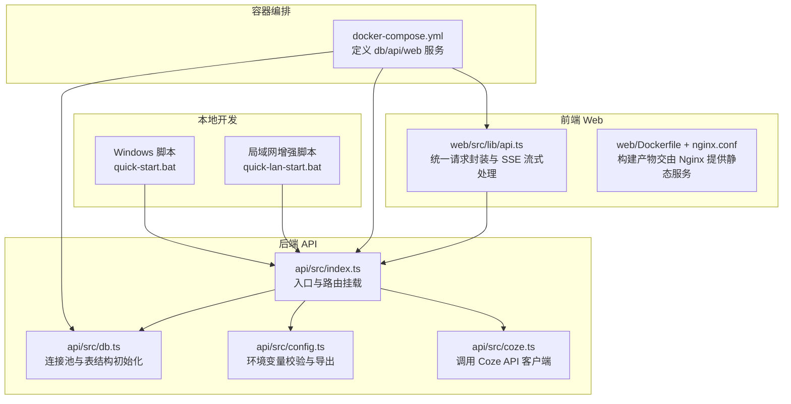
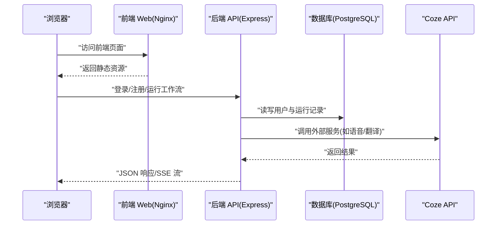
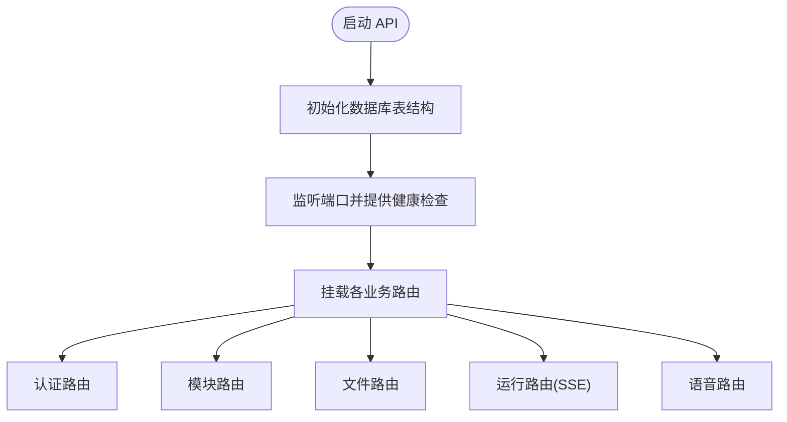
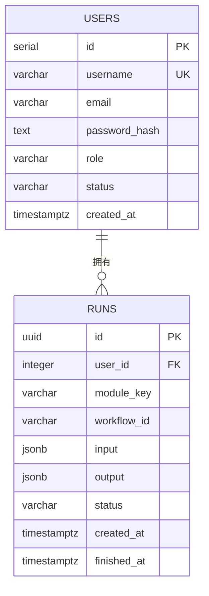
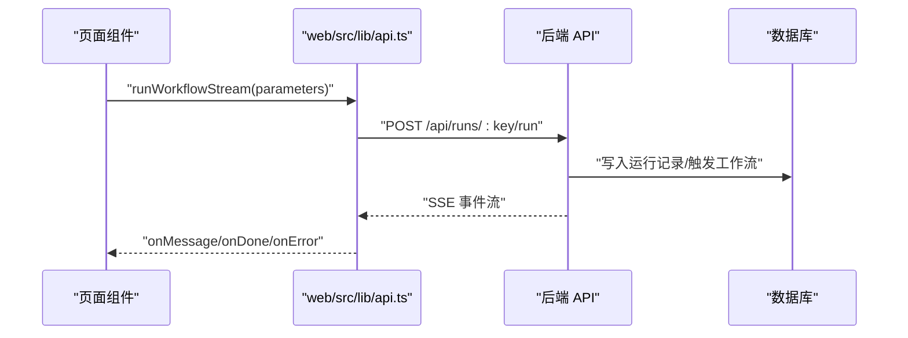

# 快速开始

<cite>
**本文引用的文件**
- [docker-compose.yml](file://docker-compose.yml)
- [quick-start.bat](file://quick-start.bat)
- [quick-lan-start.bat](file://quick-lan-start.bat)
- [quick-pull.bat](file://quick-pull.bat)
- [quick-save.bat](file://quick-save.bat)
- [api/package.json](file://api/package.json)
- [web/package.json](file://web/package.json)
- [api/src/config.ts](file://api/src/config.ts)
- [api/src/db.ts](file://api/src/db.ts)
- [api/src/index.ts](file://api/src/index.ts)
- [api/Dockerfile](file://api/Dockerfile)
- [web/Dockerfile](file://web/Dockerfile)
- [web/nginx.conf](file://web/nginx.conf)
- [api/src/routes/auth.ts](file://api/src/routes/auth.ts)
- [api/src/routes/modules.ts](file://api/src/routes/modules.ts)
- [api/src/coze.ts](file://api/src/coze.ts)
- [web/src/lib/api.ts](file://web/src/lib/api.ts)
</cite>

## 目录
1. [简介](#简介)
2. [项目结构](#项目结构)
3. [核心组件](#核心组件)
4. [架构总览](#架构总览)
5. [详细组件解析](#详细组件解析)
6. [依赖关系分析](#依赖关系分析)
7. [性能与并发建议](#性能与并发建议)
8. [故障排除指南](#故障排除指南)
9. [结论](#结论)
10. [附录](#附录)

## 简介
本指南面向首次接触 Coze Workflow 的开发者，帮助你在 Windows 与 Linux/macOS 上快速完成本地开发环境搭建、Docker 容器化部署、数据库初始化与 API 配置，并通过一键脚本与容器编排实现零门槛启动。你将获得平台化的操作步骤、启动脚本说明、常见问题排查以及验证方法，确保在最短时间内运行项目并体验核心功能。

## 项目结构
项目采用前后端分离架构，包含：
- 后端 API（Express + PostgreSQL）
- 前端 Web（React + Vite + Nginx）
- Docker 化服务编排（PostgreSQL、API、Web）

图表来源
- [docker-compose.yml:1-35](file://docker-compose.yml#L1-L35)
- [api/src/index.ts:1-29](file://api/src/index.ts#L1-L29)
- [api/src/db.ts:1-35](file://api/src/db.ts#L1-L35)
- [api/src/config.ts:1-19](file://api/src/config.ts#L1-L19)
- [api/src/coze.ts:1-8](file://api/src/coze.ts#L1-L8)
- [web/src/lib/api.ts:1-160](file://web/src/lib/api.ts#L1-L160)
- [web/Dockerfile:1-16](file://web/Dockerfile#L1-L16)
- [web/nginx.conf:1-11](file://web/nginx.conf#L1-L11)

章节来源
- [docker-compose.yml:1-35](file://docker-compose.yml#L1-L35)
- [api/src/index.ts:1-29](file://api/src/index.ts#L1-L29)
- [api/src/db.ts:1-35](file://api/src/db.ts#L1-L35)
- [api/src/config.ts:1-19](file://api/src/config.ts#L1-L19)
- [api/src/coze.ts:1-8](file://api/src/coze.ts#L1-L8)
- [web/src/lib/api.ts:1-160](file://web/src/lib/api.ts#L1-L160)
- [web/Dockerfile:1-16](file://web/Dockerfile#L1-L16)
- [web/nginx.conf:1-11](file://web/nginx.conf#L1-L11)

## 核心组件
- 后端 API 服务
  - 使用 Express 提供 REST 接口，内置健康检查、认证、模块查询、文件上传、工作流运行与语音相关接口。
  - 通过环境变量控制端口、Coze Token、JWT Secret、数据库连接与语音服务基础地址。
  - 启动时自动初始化数据库表结构（用户与运行记录）。
- 数据库
  - 默认使用 PostgreSQL，容器内持久化数据存储于卷中。
- 前端 Web
  - React 应用，通过统一 API 封装进行认证、工作流运行、语音配置与文件上传。
  - 构建后由 Nginx 提供静态服务，支持单页应用路由回退。
- Docker 化
  - 通过 docker-compose 编排 db、api、web 三类服务，暴露必要端口并设置依赖顺序。

章节来源
- [api/src/index.ts:1-29](file://api/src/index.ts#L1-L29)
- [api/src/db.ts:10-35](file://api/src/db.ts#L10-L35)
- [api/src/config.ts:5-19](file://api/src/config.ts#L5-L19)
- [web/src/lib/api.ts:1-160](file://web/src/lib/api.ts#L1-L160)
- [docker-compose.yml:1-35](file://docker-compose.yml#L1-L35)

## 架构总览
下图展示从浏览器到后端 API、数据库与外部 Coze 服务的整体交互路径。

图表来源
- [web/src/lib/api.ts:13-36](file://web/src/lib/api.ts#L13-L36)
- [api/src/index.ts:19-23](file://api/src/index.ts#L19-L23)
- [api/src/db.ts:6-8](file://api/src/db.ts#L6-L8)
- [api/src/coze.ts:4-7](file://api/src/coze.ts#L4-L7)

## 详细组件解析

### 后端 API 入口与路由
- 入口文件负责：
  - 初始化 CORS 与 JSON 解析中间件
  - 暴露健康检查端点
  - 挂载认证、模块、文件、运行、语音等路由
  - 启动数据库模式初始化后再监听端口
- 路由要点：
  - 认证：注册、登录、重置密码、查询当前用户
  - 模块：列出可用模块与按键查询
  - 文件：上传接口
  - 运行：按模块键触发工作流运行（支持流式事件）
  - 语音：语音配置、文本分段翻译、TTS

图表来源
- [api/src/index.ts:11-29](file://api/src/index.ts#L11-L29)
- [api/src/routes/auth.ts:8-63](file://api/src/routes/auth.ts#L8-L63)
- [api/src/routes/modules.ts:6-17](file://api/src/routes/modules.ts#L6-L17)
- [web/src/lib/api.ts:58-115](file://web/src/lib/api.ts#L58-L115)

章节来源
- [api/src/index.ts:1-29](file://api/src/index.ts#L1-L29)
- [api/src/routes/auth.ts:1-115](file://api/src/routes/auth.ts#L1-L115)
- [api/src/routes/modules.ts:1-20](file://api/src/routes/modules.ts#L1-L20)
- [web/src/lib/api.ts:58-115](file://web/src/lib/api.ts#L58-L115)

### 数据库初始化与连接
- 连接池通过环境变量中的数据库 URL 进行连接
- 启动时自动创建用户表与运行记录表（含外键关联）
- 表结构包含用户信息与运行记录，支持 JSONB 存储输入输出

图表来源
- [api/src/db.ts:11-32](file://api/src/db.ts#L11-L32)

章节来源
- [api/src/db.ts:1-35](file://api/src/db.ts#L1-L35)

### 环境变量与配置加载
- 启动前会校验以下必需环境变量是否存在，缺失则直接抛错退出
  - COZE_API_TOKEN
  - DATABASE_URL
  - JWT_SECRET
  - VOICE_BASE_URL
- 可选端口默认值来自环境变量，否则使用 3000

章节来源
- [api/src/config.ts:5-19](file://api/src/config.ts#L5-L19)

### 前端 API 封装与流式处理
- 统一请求封装：
  - 自动注入 Bearer Token
  - 401 时清理本地 Token 并触发登出回调
  - 错误响应抛出异常
- 文件上传：
  - 使用 FormData 上传文件
- 流式运行：
  - 基于 Fetch Streams 逐条解析事件，支持 done/error/data 事件类型

图表来源
- [web/src/lib/api.ts:58-115](file://web/src/lib/api.ts#L58-L115)
- [api/src/index.ts:25-29](file://api/src/index.ts#L25-L29)

章节来源
- [web/src/lib/api.ts:1-160](file://web/src/lib/api.ts#L1-L160)

### Docker 化与容器编排
- 后端镜像
  - 分阶段构建：依赖安装 -> TypeScript 编译 -> 运行时镜像
  - 暴露 3000 端口，生产环境运行
- 前端镜像
  - 分阶段构建：依赖安装 -> 构建 -> Nginx 提供静态服务
  - 暴露 80 端口，Nginx 常驻进程
- 编排文件
  - db：PostgreSQL 16，持久化卷，映射 5432
  - api：基于 api 目录构建，依赖 db，映射 3000
  - web：基于 web 目录构建，依赖 api，映射 5173

章节来源
- [api/Dockerfile:1-19](file://api/Dockerfile#L1-L19)
- [web/Dockerfile:1-16](file://web/Dockerfile#L1-L16)
- [web/nginx.conf:1-11](file://web/nginx.conf#L1-L11)
- [docker-compose.yml:1-35](file://docker-compose.yml#L1-L35)

## 依赖关系分析
- 后端依赖
  - @coze/api：调用外部 Coze 服务
  - express/cors/jsonwebtoken/bcryptjs/pg：Web 服务、鉴权、加密、数据库
  - multer/form-data/node-fetch/uuid：文件上传、HTTP 请求、唯一标识
- 前端依赖
  - react/react-dom/antd/react-router-dom/@ant-design/icons：界面与路由
  - 开发工具：vite/typescript/@vitejs/plugin-react

章节来源
- [api/package.json:11-34](file://api/package.json#L11-L34)
- [web/package.json:11-24](file://web/package.json#L11-L24)

## 性能与并发建议
- 后端
  - 合理设置数据库连接池大小与超时时间
  - 对大文件上传与流式处理注意内存占用与背压
- 前端
  - 在线预览与构建优化，避免不必要的重渲染
- 容器
  - 生产环境建议限制 CPU/内存配额，开启健康检查与重启策略

[本节为通用建议，无需特定文件引用]

## 故障排除指南

- 启动后端 API 报错“缺少环境变量”
  - 确认已设置 COZE_API_TOKEN、DATABASE_URL、JWT_SECRET、VOICE_BASE_URL
  - 本地开发建议在根目录创建 .env 文件并由 dotenv 加载
  - 参考：[api/src/config.ts:5-11](file://api/src/config.ts#L5-L11)
- 健康检查 500 或无法连接数据库
  - 确认 PostgreSQL 已启动且端口 5432 可用
  - 检查 DATABASE_URL 是否正确指向 db 服务与数据库名
  - 参考：[docker-compose.yml:2-11](file://docker-compose.yml#L2-L11)、[api/src/db.ts:6-8](file://api/src/db.ts#L6-L8)
- 登录/注册失败或 401
  - 检查 JWT_SECRET 是否一致
  - 确认前端已正确保存 Token 并在请求头中携带
  - 参考：[api/src/routes/auth.ts:36-63](file://api/src/routes/auth.ts#L36-L63)、[web/src/lib/api.ts:9-18](file://web/src/lib/api.ts#L9-L18)
- 工作流运行无响应或报错
  - 确认模块键有效且后端已注册对应模块
  - 检查流式事件是否被正确解析
  - 参考：[api/src/routes/modules.ts:6-17](file://api/src/routes/modules.ts#L6-L17)、[web/src/lib/api.ts:58-115](file://web/src/lib/api.ts#L58-L115)
- 前端无法访问
  - 本地开发：确认 Vite 监听端口 5173 可用
  - 容器部署：确认 web 映射端口 5173 与宿主机端口映射
  - 参考：[docker-compose.yml:26-32](file://docker-compose.yml#L26-L32)
- 局域网无法访问
  - 使用增强脚本自动放行防火墙并监听 0.0.0.0
  - 参考：[quick-lan-start.bat:45-46](file://quick-lan-start.bat#L45-L46)
- Git 更新导致冲突
  - 使用安全拉取脚本暂存本地敏感文件，再恢复
  - 参考：[quick-pull.bat:23-38](file://quick-pull.bat#L23-L38)

章节来源
- [api/src/config.ts:5-11](file://api/src/config.ts#L5-L11)
- [api/src/db.ts:6-8](file://api/src/db.ts#L6-L8)
- [api/src/routes/auth.ts:36-63](file://api/src/routes/auth.ts#L36-L63)
- [web/src/lib/api.ts:9-18](file://web/src/lib/api.ts#L9-L18)
- [api/src/routes/modules.ts:6-17](file://api/src/routes/modules.ts#L6-L17)
- [docker-compose.yml:26-32](file://docker-compose.yml#L26-L32)
- [quick-lan-start.bat:45-46](file://quick-lan-start.bat#L45-L46)
- [quick-pull.bat:23-38](file://quick-pull.bat#L23-L38)

## 结论
通过本指南，你可以：
- 在 Windows 与 Linux/macOS 上完成本地开发与容器化部署
- 正确配置环境变量与数据库初始化
- 使用一键脚本快速启动并验证核心功能
- 在遇到问题时快速定位与解决

[本节为总结性内容，无需特定文件引用]

## 附录

### 平台化安装与启动步骤

- Windows
  - 本地开发
    - 打开终端，分别进入 api 与 web 目录，安装依赖并启动开发服务器
    - 参考：[api/package.json:6-9](file://api/package.json#L6-L9)、[web/package.json:6-9](file://web/package.json#L6-L9)
  - 一键启动（双窗口）
    - 使用批处理脚本同时启动后端与前端
    - 参考：[quick-start.bat:6-10](file://quick-start.bat#L6-L10)
  - 局域网共享
    - 使用增强脚本自动放行防火墙、安装依赖、监听 0.0.0.0 并输出访问地址
    - 参考：[quick-lan-start.bat:29-46](file://quick-lan-start.bat#L29-L46)
  - 安全拉取与推送
    - 拉取远端更新前暂存本地敏感文件，完成后恢复
    - 参考：[quick-pull.bat:23-38](file://quick-pull.bat#L23-L38)
    - 推送至多个远程仓库
    - 参考：[quick-save.bat:19-25](file://quick-save.bat#L19-L25)

- Linux/macOS
  - 本地开发
    - 在 api 与 web 目录分别执行安装与启动命令
    - 参考：[api/package.json:6-9](file://api/package.json#L6-L9)、[web/package.json:6-9](file://web/package.json#L6-L9)
  - 容器化部署
    - 使用 docker-compose 启动服务，等待 db 初始化后 api 与 web 依次就绪
    - 参考：[docker-compose.yml:1-35](file://docker-compose.yml#L1-L35)

- 验证步骤
  - 健康检查：访问后端健康端点
    - 参考：[api/src/index.ts:15-17](file://api/src/index.ts#L15-L17)
  - 登录/注册：使用认证接口完成用户管理
    - 参考：[api/src/routes/auth.ts:8-63](file://api/src/routes/auth.ts#L8-L63)
  - 工作流运行：调用运行接口并观察流式事件
    - 参考：[web/src/lib/api.ts:58-115](file://web/src/lib/api.ts#L58-L115)
  - 语音配置：获取语音服务配置
    - 参考：[web/src/lib/api.ts:117-126](file://web/src/lib/api.ts#L117-L126)

章节来源
- [quick-start.bat:6-10](file://quick-start.bat#L6-L10)
- [quick-lan-start.bat:29-46](file://quick-lan-start.bat#L29-L46)
- [quick-pull.bat:23-38](file://quick-pull.bat#L23-L38)
- [quick-save.bat:19-25](file://quick-save.bat#L19-L25)
- [api/package.json:6-9](file://api/package.json#L6-L9)
- [web/package.json:6-9](file://web/package.json#L6-L9)
- [docker-compose.yml:1-35](file://docker-compose.yml#L1-L35)
- [api/src/index.ts:15-17](file://api/src/index.ts#L15-L17)
- [api/src/routes/auth.ts:8-63](file://api/src/routes/auth.ts#L8-L63)
- [web/src/lib/api.ts:58-115](file://web/src/lib/api.ts#L58-L115)