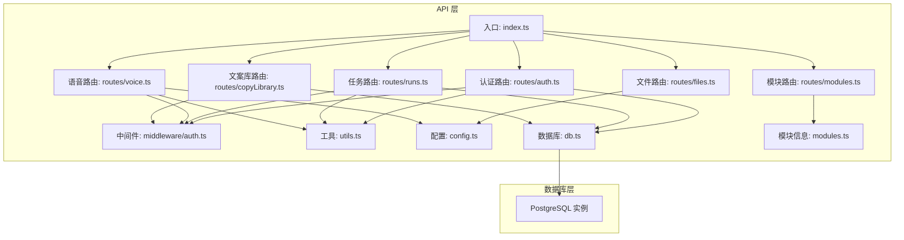
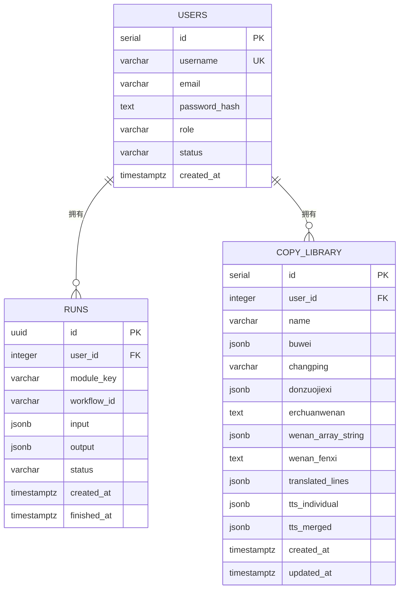
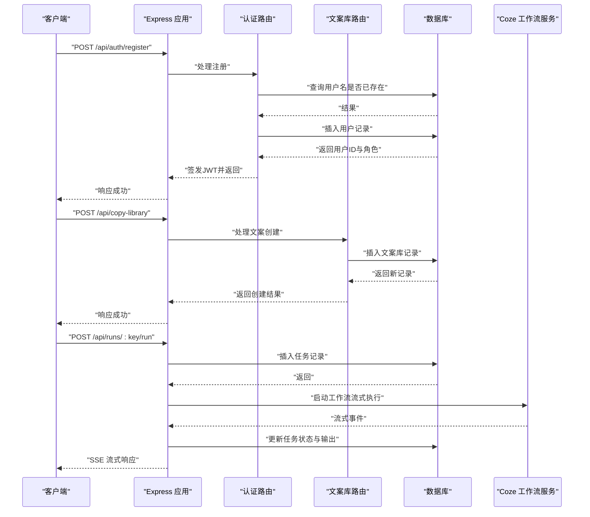

# 数据库设计

<cite>
**本文引用的文件**
- [api/src/db.ts](file://api/src/db.ts)
- [api/src/index.ts](file://api/src/index.ts)
- [api/src/config.ts](file://api/src/config.ts)
- [api/src/middleware/auth.ts](file://api/src/middleware/auth.ts)
- [api/src/utils.ts](file://api/src/utils.ts)
- [api/src/routes/auth.ts](file://api/src/routes/auth.ts)
- [api/src/routes/runs.ts](file://api/src/routes/runs.ts)
- [api/src/routes/modules.ts](file://api/src/routes/modules.ts)
- [api/src/routes/files.ts](file://api/src/routes/files.ts)
- [api/src/routes/voice.ts](file://api/src/routes/voice.ts)
- [api/src/routes/copyLibrary.ts](file://api/src/routes/copyLibrary.ts)
- [api/src/modules.ts](file://api/src/modules.ts)
- [web/src/lib/api.ts](file://web/src/lib/api.ts)
- [web/src/pages/CopyLibraryPage.tsx](file://web/src/pages/CopyLibraryPage.tsx)
- [docker-compose.yml](file://docker-compose.yml)
</cite>

## 更新摘要
**所做更改**
- 新增copy_library表结构定义和数据模型
- 添加文案库功能的完整API接口文档
- 更新数据库架构图以包含新的实体关系
- 扩展数据访问模式和缓存策略章节
- 更新示例数据和查询优化建议

## 目录
1. [简介](#简介)
2. [项目结构](#项目结构)
3. [核心组件](#核心组件)
4. [架构总览](#架构总览)
5. [详细组件分析](#详细组件分析)
6. [依赖分析](#依赖分析)
7. [性能考虑](#性能考虑)
8. [故障排查指南](#故障排查指南)
9. [结论](#结论)
10. [附录](#附录)

## 简介
本文件为该代码库的数据库设计与数据模型文档，聚焦于 PostgreSQL 模式与表结构、实体关系、字段定义与数据类型、主键/外键关系、索引设计与约束、数据访问模式、缓存策略、性能考量、数据生命周期与归档、迁移与版本管理、安全与隐私、访问控制以及查询优化与维护建议。本文所有内容均基于仓库中实际实现与配置文件进行归纳总结。

## 项目结构
后端使用 Express 提供 REST API，并通过 Postgres 连接池进行数据库交互；数据库初始化在应用启动时执行，确保表结构存在。Docker Compose 将数据库服务、API 服务与 Web 前端串联起来。

**图表来源**
- [api/src/index.ts:1-31](file://api/src/index.ts#L1-L31)
- [api/src/db.ts:1-52](file://api/src/db.ts#L1-L52)
- [docker-compose.yml:1-35](file://docker-compose.yml#L1-L35)

**章节来源**
- [api/src/index.ts:1-31](file://api/src/index.ts#L1-L31)
- [docker-compose.yml:1-35](file://docker-compose.yml#L1-L35)

## 核心组件
- 数据库连接与模式初始化：通过连接池建立连接，启动时执行 ensureSchema 创建用户、任务和文案库表。
- 路由与业务：认证、任务管理、模块信息、文件上传、语音处理、文案库管理等。
- 中间件与工具：鉴权中间件、JWT 与密码哈希工具。
- 配置：环境变量校验与读取，数据库 URL、JWT 秘钥、语音服务基础地址等。

**章节来源**
- [api/src/db.ts:1-52](file://api/src/db.ts#L1-L52)
- [api/src/routes/auth.ts:1-115](file://api/src/routes/auth.ts#L1-L115)
- [api/src/routes/runs.ts:1-159](file://api/src/routes/runs.ts#L1-L159)
- [api/src/routes/modules.ts:1-20](file://api/src/routes/modules.ts#L1-L20)
- [api/src/routes/files.ts:1-43](file://api/src/routes/files.ts#L1-L43)
- [api/src/routes/voice.ts:1-404](file://api/src/routes/voice.ts#L1-L404)
- [api/src/routes/copyLibrary.ts:1-170](file://api/src/routes/copyLibrary.ts#L1-L170)
- [api/src/middleware/auth.ts:1-23](file://api/src/middleware/auth.ts#L1-L23)
- [api/src/utils.ts:1-21](file://api/src/utils.ts#L1-L21)
- [api/src/config.ts:1-19](file://api/src/config.ts#L1-L19)

## 架构总览
下图展示数据库模式与关键实体之间的关系，以及典型请求流程如何与数据库交互。

**图表来源**
- [api/src/db.ts:12-49](file://api/src/db.ts#L12-L49)

## 详细组件分析

### 用户表（users）
- 主键：自增整数 id
- 唯一约束：username
- 字段与类型：
  - id: serial（主键）
  - username: varchar(64)（唯一、非空）
  - email: varchar(128)
  - password_hash: text（非空）
  - role: varchar(16)（默认 USER）
  - status: varchar(16)（默认 ACTIVE）
  - created_at: timestamptz（默认当前时间）
- 约束与默认值：非空、默认值、唯一性
- 索引建议：username 已具备唯一索引；如按 email 查询频繁，可考虑在 email 上建立二级索引
- 数据验证规则：注册时校验用户名必填且唯一；登录时校验用户名存在且密码匹配
- 访问控制：角色 role 支持 ADMIN 权限判断（用于密码重置等操作）

**章节来源**
- [api/src/db.ts:12-20](file://api/src/db.ts#L12-L20)
- [api/src/routes/auth.ts:8-34](file://api/src/routes/auth.ts#L8-L34)
- [api/src/routes/auth.ts:36-63](file://api/src/routes/auth.ts#L36-L63)
- [api/src/routes/auth.ts:65-98](file://api/src/routes/auth.ts#L65-L98)
- [api/src/middleware/auth.ts:1-23](file://api/src/middleware/auth.ts#L1-L23)
- [api/src/utils.ts:1-21](file://api/src/utils.ts#L1-L21)

### 任务表（runs）
- 主键：UUID id
- 外键：user_id 引用 users.id
- 字段与类型：
  - id: uuid（主键）
  - user_id: integer（外键）
  - module_key: varchar(64)（非空）
  - workflow_id: varchar(64)（非空）
  - input: jsonb（非空）
  - output: jsonb
  - status: varchar(16)（非空）
  - created_at: timestamptz（默认当前时间）
  - finished_at: timestamptz
- 约束与默认值：非空、默认值
- 索引建议：按 user_id + created_at 建立复合索引以支持"我的任务列表"分页查询；对 status 建立二级索引以支持状态筛选
- 数据验证规则：任务创建时校验模块存在、参数必填；任务详情仅允许当前用户访问
- 数据访问模式：分页查询最近 100 条记录；SSE 流式更新任务状态与输出

**章节来源**
- [api/src/db.ts:22-32](file://api/src/db.ts#L22-L32)
- [api/src/routes/runs.ts:13-29](file://api/src/routes/runs.ts#L13-L29)
- [api/src/routes/runs.ts:34-53](file://api/src/routes/runs.ts#L34-L53)
- [api/src/routes/runs.ts:55-157](file://api/src/routes/runs.ts#L55-L157)
- [api/src/modules.ts:1-29](file://api/src/modules.ts#L1-L29)

### 文案库表（copy_library）
- 主键：自增整数 id
- 外键：user_id 引用 users.id
- 字段与类型：
  - id: serial（主键）
  - user_id: integer（外键）
  - name: varchar(256)（非空）
  - buwei: jsonb（部位信息数组）
  - changping: varchar(256)（产品名称）
  - donzuojiexi: jsonb（动作解析数组）
  - erchuanwenan: text（二次文案）
  - wenan_array_string: jsonb（文案数组字符串）
  - wenan_fenxi: text（文案分析）
  - translated_lines: jsonb（翻译结果数组）
  - tts_individual: jsonb（逐句语音数组）
  - tts_merged: jsonb（合并语音对象）
  - created_at: timestamptz（默认当前时间）
  - updated_at: timestamptz（默认当前时间）
- 约束与默认值：非空、默认值
- 索引建议：按 user_id + updated_at 建立复合索引以支持"我的文案库"分页查询；对 name 建立索引以支持名称搜索
- 数据验证规则：创建时校验用户存在、名称必填；更新时校验用户权限；删除时校验用户权限
- 数据访问模式：支持 CRUD 操作，按用户隔离数据；用于混剪功能的数据源

**章节来源**
- [api/src/db.ts:34-49](file://api/src/db.ts#L34-L49)
- [api/src/routes/copyLibrary.ts:8-23](file://api/src/routes/copyLibrary.ts#L8-L23)
- [api/src/routes/copyLibrary.ts:25-42](file://api/src/routes/copyLibrary.ts#L25-L42)
- [api/src/routes/copyLibrary.ts:44-88](file://api/src/routes/copyLibrary.ts#L44-L88)
- [api/src/routes/copyLibrary.ts:90-148](file://api/src/routes/copyLibrary.ts#L90-L148)
- [api/src/routes/copyLibrary.ts:150-167](file://api/src/routes/copyLibrary.ts#L150-L167)
- [web/src/lib/api.ts:165-208](file://web/src/lib/api.ts#L165-L208)
- [web/src/pages/CopyLibraryPage.tsx:1-181](file://web/src/pages/CopyLibraryPage.tsx#L1-L181)

### 模块信息（modules）
- 作用：提供可用模块的键、名称与工作流 ID 映射
- 使用场景：任务创建时校验模块键是否存在，并将对应 workflow_id 写入 runs 表
- 数据访问模式：GET /api/modules 与 GET /api/modules/:key

**章节来源**
- [api/src/routes/modules.ts:1-20](file://api/src/routes/modules.ts#L1-L20)
- [api/src/modules.ts:1-29](file://api/src/modules.ts#L1-L29)

### 文件上传（files）
- 作用：接收客户端上传的文件，转发至第三方文件服务（Coze 文件上传接口）
- 数据访问模式：POST /api/files/upload
- 注意：文件元数据与上传凭证不存储在本地数据库，仅转发调用第三方 API

**章节来源**
- [api/src/routes/files.ts:1-43](file://api/src/routes/files.ts#L1-L43)
- [api/src/config.ts:1-19](file://api/src/config.ts#L1-L19)

### 语音处理（voice）
- 作用：提供翻译与 TTS 的相关接口，内部使用 Gradio 客户端与外部语音服务交互
- 数据访问模式：GET /api/voice/config、POST /api/voice/translate-lines、POST /api/voice/tts-from-lines
- 重要逻辑：批量翻译工作流、从翻译结果构建文本、调用 TTS 生成音频与字幕
- 调试能力：内存级调试记录（Map），支持查看与清理

**章节来源**
- [api/src/routes/voice.ts:1-404](file://api/src/routes/voice.ts#L1-L404)
- [api/src/config.ts:1-19](file://api/src/config.ts#L1-L19)

### 认证与鉴权
- 登录/注册：使用 bcrypt 哈希密码，JWT 签发令牌；鉴权中间件从 Authorization 头解析并校验令牌
- 密码重置：支持管理员重置他人密码，普通用户仅能重置自身
- 数据访问模式：受保护路由需携带 Bearer 令牌

**章节来源**
- [api/src/routes/auth.ts:1-115](file://api/src/routes/auth.ts#L1-L115)
- [api/src/middleware/auth.ts:1-23](file://api/src/middleware/auth.ts#L1-L23)
- [api/src/utils.ts:1-21](file://api/src/utils.ts#L1-L21)

## 依赖分析
- 应用启动顺序：index.ts -> ensureSchema() -> 启动 HTTP 服务
- 数据库依赖：db.ts 通过连接池访问 PostgreSQL；ensureSchema 在首次启动时创建表
- 外部依赖：Coze 工作流服务（通过 cozeClient）、Gradio 客户端（语音服务）、Multer（文件上传）
- 环境依赖：DATABASE_URL、COZE_API_TOKEN、JWT_SECRET、VOICE_BASE_URL

**图表来源**
- [api/src/index.ts:27-31](file://api/src/index.ts#L27-L31)
- [api/src/db.ts:10-51](file://api/src/db.ts#L10-L51)
- [api/src/routes/auth.ts:8-34](file://api/src/routes/auth.ts#L8-L34)
- [api/src/routes/copyLibrary.ts:44-88](file://api/src/routes/copyLibrary.ts#L44-L88)
- [api/src/routes/runs.ts:55-157](file://api/src/routes/runs.ts#L55-L157)

**章节来源**
- [api/src/index.ts:1-31](file://api/src/index.ts#L1-L31)
- [api/src/db.ts:1-52](file://api/src/db.ts#L1-L52)
- [api/src/routes/auth.ts:1-115](file://api/src/routes/auth.ts#L1-L115)
- [api/src/routes/copyLibrary.ts:1-170](file://api/src/routes/copyLibrary.ts#L1-L170)
- [api/src/routes/runs.ts:1-159](file://api/src/routes/runs.ts#L1-L159)

## 性能考虑
- 连接池与并发：使用 pg.Pool 管理连接，避免每次请求新建连接
- 查询优化：
  - 对 runs.user_id + created_at 建立复合索引，优化"我的任务列表"分页
  - 对 runs.status 建立索引，加速状态筛选
  - 对 users.username 建立索引（唯一索引已存在）
  - 对 copy_library.user_id + updated_at 建立复合索引，优化"我的文案库"分页
  - 对 copy_library.name 建立索引，加速名称搜索
- IO 与流式处理：任务执行采用 SSE 流式推送，减少一次性大响应
- 缓存策略：
  - 语音模块提供内存级调试记录缓存（Map），容量上限控制，适合开发调试
  - 可选：对只读查询结果引入 Redis 缓存（如模块列表、用户基本信息、文案库列表）
- 数据类型选择：jsonb 适合灵活的输入/输出结构；注意合理限制单条记录大小（已通过请求体大小限制）
- 分页与限制：任务列表限制 100 条，避免过大数据集；文案库列表可按需限制分页大小

**章节来源**
- [api/src/db.ts:12-49](file://api/src/db.ts#L12-L49)
- [api/src/routes/runs.ts:13-29](file://api/src/routes/runs.ts#L13-L29)
- [api/src/index.ts:13](file://api/src/index.ts#L13)
- [api/src/routes/voice.ts:29-51](file://api/src/routes/voice.ts#L29-L51)

## 故障排查指南
- 数据库连接失败：检查 DATABASE_URL 是否正确；确认容器网络与端口映射
- 认证失败：核对 JWT_SECRET；确认 Authorization 头格式为 Bearer Token
- 任务执行异常：关注 runs.status 与 output 字段；SSE 错误事件会返回错误信息
- 文案库操作异常：检查 copy_library.user_id 与用户权限；确认 JSONB 字段格式正确
- 文件上传失败：检查 COZE_API_TOKEN 与第三方服务状态
- 语音服务不可用：检查 VOICE_BASE_URL 配置与目标服务可达性

**章节来源**
- [api/src/config.ts:1-19](file://api/src/config.ts#L1-L19)
- [api/src/routes/auth.ts:1-115](file://api/src/routes/auth.ts#L1-L115)
- [api/src/routes/runs.ts:124-156](file://api/src/routes/runs.ts#L124-L156)
- [api/src/routes/copyLibrary.ts:8-23](file://api/src/routes/copyLibrary.ts#L8-L23)
- [api/src/routes/files.ts:19-40](file://api/src/routes/files.ts#L19-L40)
- [api/src/routes/voice.ts:69-86](file://api/src/routes/voice.ts#L69-L86)

## 结论
该数据库设计围绕用户、任务和文案库三大核心实体展开，采用 UUID 作为任务主键，配合 JSONB 存储灵活的输入输出，满足工作流场景的多样性需求。新增的文案库表支持复杂的文案管理功能，包括部位、产品、动作解析、翻译和语音等多种数据类型的存储。通过连接池、索引与流式处理提升性能与用户体验。建议后续补充审计日志、归档策略与备份方案，并在生产环境引入连接池监控与慢查询分析。

## 附录

### 数据模型图（ER）

**图表来源**
- [api/src/db.ts:12-49](file://api/src/db.ts#L12-L49)

### 示例数据
- 用户示例
  - id: 1
  - username: "alice"
  - email: "alice@example.com"
  - password_hash: "<bcrypt哈希>"
  - role: "USER"
  - status: "ACTIVE"
  - created_at: 当前时间
- 任务示例
  - id: "550e8400-e29b-41d4-a716-446655440000"
  - user_id: 1
  - module_key: "product-copy"
  - workflow_id: "7543166210068185138"
  - input: {"prompt": "...", "style": "..."}
  - output: [{"event": "Message", "data": {"content": "..."}}...]
  - status: "SUCCESS"
  - created_at: 当前时间
  - finished_at: 完成时间
- 文案库示例
  - id: 1
  - user_id: 1
  - name: "水杨酸精华文案"
  - buwei: ["面部", "颈部"]
  - changping: "水杨酸精华"
  - donzuojiexi: ["涂抹", "按摩"]
  - erchuanwenan: "深层清洁，温和去角质"
  - wenan_array_string: ["产品介绍", "使用方法", "注意事项"]
  - wenan_fenxi: "针对油性肌肤，强调清洁效果"
  - translated_lines: ["Product introduction", "Usage instructions", "Precautions"]
  - tts_individual: []
  - tts_merged: {}
  - created_at: 当前时间
  - updated_at: 当前时间

**章节来源**
- [api/src/db.ts:12-49](file://api/src/db.ts#L12-L49)
- [api/src/modules.ts:1-29](file://api/src/modules.ts#L1-L29)
- [api/src/routes/runs.ts:55-157](file://api/src/routes/runs.ts#L55-L157)
- [web/src/lib/api.ts:165-208](file://web/src/lib/api.ts#L165-L208)

### 数据访问模式与缓存策略
- 访问模式
  - 用户：注册/登录/个人信息/密码重置
  - 任务：列表/详情/创建（SSE 流式）
  - 模块：枚举/查询
  - 文件：上传（转发第三方）
  - 语音：配置/翻译/生成
  - 文案库：列表/详情/创建/更新/删除（按用户隔离）
- 缓存策略
  - 开发调试：内存 Map 存储调试记录
  - 生产建议：只读数据（模块列表、用户基本信息、文案库列表）引入 Redis 缓存
  - 文案库数据：支持按用户缓存，注意数据一致性

**章节来源**
- [api/src/routes/auth.ts:1-115](file://api/src/routes/auth.ts#L1-L115)
- [api/src/routes/runs.ts:1-159](file://api/src/routes/runs.ts#L1-L159)
- [api/src/routes/modules.ts:1-20](file://api/src/routes/modules.ts#L1-L20)
- [api/src/routes/files.ts:1-43](file://api/src/routes/files.ts#L1-L43)
- [api/src/routes/voice.ts:1-404](file://api/src/routes/voice.ts#L1-L404)
- [api/src/routes/copyLibrary.ts:1-170](file://api/src/routes/copyLibrary.ts#L1-L170)
- [api/src/routes/voice.ts:29-51](file://api/src/routes/voice.ts#L29-L51)

### 性能优化建议
- 索引
  - runs(user_id, created_at) 复合索引
  - runs(status) 二级索引
  - copy_library(user_id, updated_at) 复合索引
  - copy_library(name) 二级索引
- 查询
  - 限制分页数量（已限制 100 条）
  - 控制 JSONB 字段大小（请求体限制）
  - 文案库列表可按需限制分页大小
- 连接池
  - 合理设置最大连接数与超时
- 流式处理
  - 使用 SSE 推送增量结果，降低内存占用

**章节来源**
- [api/src/db.ts:12-49](file://api/src/db.ts#L12-L49)
- [api/src/index.ts:13](file://api/src/index.ts#L13)
- [api/src/routes/runs.ts:13-29](file://api/src/routes/runs.ts#L13-L29)

### 数据生命周期、保留策略与归档
- 当前实现
  - 未见显式的自动清理/归档逻辑
- 建议
  - 任务记录保留周期：如 30/90 天后归档至冷存储
  - 文案库记录保留周期：根据使用频率可设置较长保留期
  - 归档字段：增加 archived_at、archive_status
  - 清理策略：定期扫描 finished_at 超过阈值的任务记录并迁移

**章节来源**
- [api/src/db.ts:22-49](file://api/src/db.ts#L22-L49)

### 数据迁移路径与版本管理
- 初始化脚本
  - ensureSchema 在启动时创建表；如需扩展，建议迁移到独立 SQL 脚本并记录版本号
- 版本管理
  - 使用迁移工具（如 migrate）管理 schema 变更
  - 每次变更记录 up/down 脚本与版本号
- 回滚策略
  - 保持幂等性，确保 down 脚本能安全回退

**章节来源**
- [api/src/db.ts:10-51](file://api/src/db.ts#L10-L51)

### 数据安全、隐私与访问控制
- 安全措施
  - 密码使用 bcrypt 哈希存储
  - JWT 令牌签名与有效期控制
  - 中间件鉴权强制校验
  - 文案库按用户隔离，防止数据泄露
- 隐私与最小化
  - 仅存储必要的用户标识与认证信息
  - 任务输出为工作流结果，不存储敏感文件
  - 文案库数据按用户隔离存储
- 访问控制
  - 任务详情仅允许当前用户访问
  - 管理员可重置他人密码
  - 文案库 CRUD 操作均需用户身份验证

**章节来源**
- [api/src/utils.ts:1-21](file://api/src/utils.ts#L1-L21)
- [api/src/middleware/auth.ts:1-23](file://api/src/middleware/auth.ts#L1-L23)
- [api/src/routes/auth.ts:65-98](file://api/src/routes/auth.ts#L65-L98)
- [api/src/routes/runs.ts:34-53](file://api/src/routes/runs.ts#L34-L53)
- [api/src/routes/copyLibrary.ts:8-23](file://api/src/routes/copyLibrary.ts#L8-L23)

### 维护指南
- 监控
  - 连接池使用率、慢查询、错误率
  - 文案库操作统计与异常监控
- 备份
  - 定期导出数据库快照
- 日志
  - 记录任务状态变更、鉴权失败、第三方调用异常
  - 记录文案库 CRUD 操作日志
- 升级
  - 先在测试环境验证迁移脚本，再灰度发布

**章节来源**
- [docker-compose.yml:1-35](file://docker-compose.yml#L1-L35)