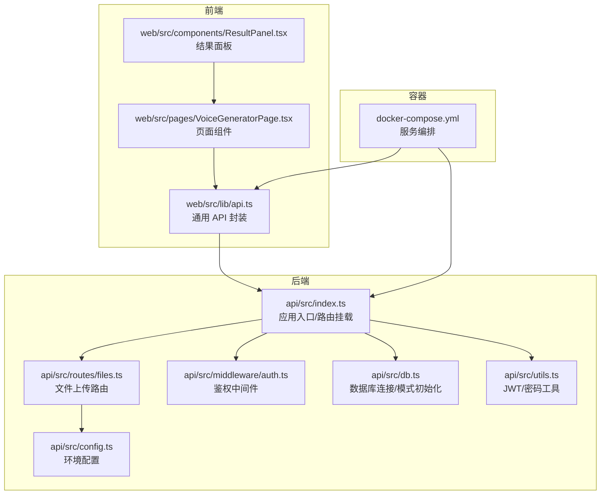
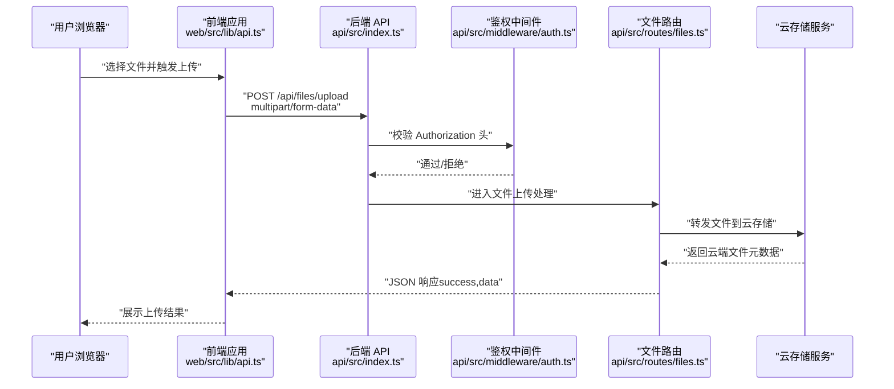
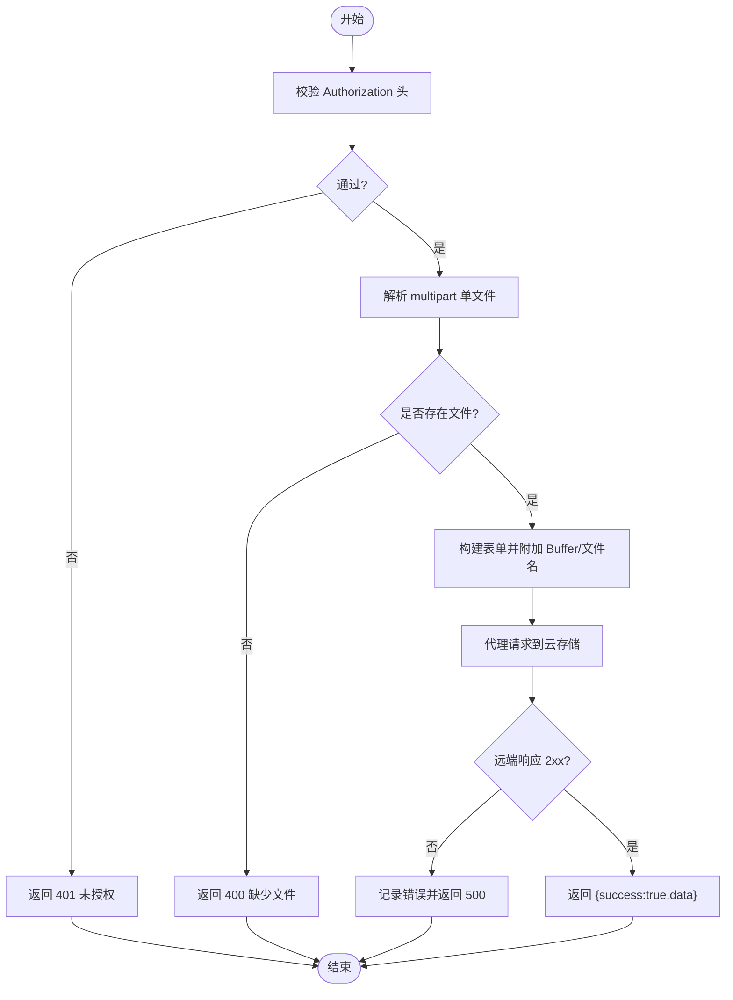
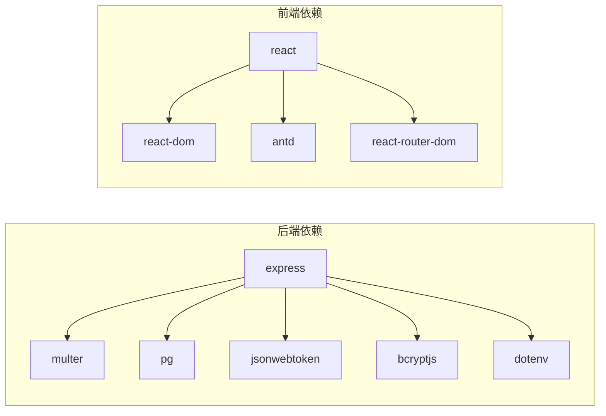

# 文件管理系统

<cite>
**本文引用的文件**
- [api/src/routes/files.ts](file://api/src/routes/files.ts)
- [api/src/middleware/auth.ts](file://api/src/middleware/auth.ts)
- [api/src/config.ts](file://api/src/config.ts)
- [api/src/db.ts](file://api/src/db.ts)
- [api/src/utils.ts](file://api/src/utils.ts)
- [api/src/index.ts](file://api/src/index.ts)
- [web/src/lib/api.ts](file://web/src/lib/api.ts)
- [web/src/pages/VoiceGeneratorPage.tsx](file://web/src/pages/VoiceGeneratorPage.tsx)
- [web/src/components/ResultPanel.tsx](file://web/src/components/ResultPanel.tsx)
- [docker-compose.yml](file://docker-compose.yml)
- [api/package.json](file://api/package.json)
- [web/package.json](file://web/package.json)
</cite>

## 目录
1. [简介](#简介)
2. [项目结构](#项目结构)
3. [核心组件](#核心组件)
4. [架构总览](#架构总览)
5. [详细组件分析](#详细组件分析)
6. [依赖关系分析](#依赖关系分析)
7. [性能考虑](#性能考虑)
8. [故障排查指南](#故障排查指南)
9. [结论](#结论)
10. [附录](#附录)

## 简介
本文件管理系统围绕“文件上传—云端存储—访问控制”的完整生命周期展开，提供从后端 API 到前端组件的端到端实现说明。系统通过 Express 提供 REST 接口，使用 PostgreSQL 存储用户与运行记录，采用 JWT 进行身份校验，前端基于 React + Ant Design 构建交互界面。文件上传流程以表单形式提交至后端，后端将文件转发至第三方云存储服务（示例对接 Coze），并返回云端文件元数据；前端负责展示上传状态与结果。

## 项目结构
- 后端 API（Node.js + Express）
  - 路由：认证、模块、文件、运行、语音等
  - 中间件：鉴权
  - 数据库：PostgreSQL 连接与初始化
  - 配置：环境变量校验与导出
  - 工具：JWT、密码加盐与校验
- 前端 Web（React + Vite）
  - 通用 API 封装与拦截器
  - 页面与组件：语音生成页、结果面板等
- 容器编排
  - docker-compose 管理数据库、API、Web 三服务

图表来源
- [api/src/index.ts:1-29](file://api/src/index.ts#L1-L29)
- [api/src/routes/files.ts:1-43](file://api/src/routes/files.ts#L1-L43)
- [api/src/middleware/auth.ts:1-23](file://api/src/middleware/auth.ts#L1-L23)
- [api/src/config.ts:1-19](file://api/src/config.ts#L1-L19)
- [api/src/db.ts:1-35](file://api/src/db.ts#L1-L35)
- [api/src/utils.ts:1-21](file://api/src/utils.ts#L1-L21)
- [web/src/lib/api.ts:1-160](file://web/src/lib/api.ts#L1-L160)
- [docker-compose.yml:1-35](file://docker-compose.yml#L1-L35)

章节来源
- [api/src/index.ts:1-29](file://api/src/index.ts#L1-L29)
- [docker-compose.yml:1-35](file://docker-compose.yml#L1-L35)

## 核心组件
- 文件上传路由
  - 接收 multipart/form-data，解析单文件，构造表单并转发至云存储服务，返回云端文件元数据。
- 鉴权中间件
  - 从 Authorization 头解析 Bearer Token，校验 JWT 并注入用户信息。
- 配置与数据库
  - 环境变量校验，PostgreSQL 连接池与基础表结构初始化。
- 前端 API 封装
  - 统一设置 Content-Type 与 Authorization，处理 401 清理令牌，封装上传函数。
- 容器化部署
  - Postgres、API、Web 服务编排，暴露必要端口。

章节来源
- [api/src/routes/files.ts:10-40](file://api/src/routes/files.ts#L10-L40)
- [api/src/middleware/auth.ts:8-22](file://api/src/middleware/auth.ts#L8-L22)
- [api/src/config.ts:5-19](file://api/src/config.ts#L5-L19)
- [api/src/db.ts:6-34](file://api/src/db.ts#L6-L34)
- [web/src/lib/api.ts:13-56](file://web/src/lib/api.ts#L13-L56)
- [docker-compose.yml:13-32](file://docker-compose.yml#L13-L32)

## 架构总览
系统采用前后端分离架构：前端通过封装的 fetch 发起请求，后端路由接收请求并进行鉴权与业务处理，文件上传路由再将文件转发至云存储服务。数据库用于持久化用户与运行记录，JWT 保障会话安全。

图表来源
- [web/src/lib/api.ts:39-56](file://web/src/lib/api.ts#L39-L56)
- [api/src/index.ts:19-23](file://api/src/index.ts#L19-L23)
- [api/src/middleware/auth.ts:8-22](file://api/src/middleware/auth.ts#L8-L22)
- [api/src/routes/files.ts:10-40](file://api/src/routes/files.ts#L10-L40)

## 详细组件分析

### 文件上传流程
- 前端上传
  - 使用 FormData 附加文件，携带可选的 Bearer Token。
  - 若响应非 2xx，抛出错误以便上层处理。
- 后端接收
  - 使用 multer 解析单文件，若缺失文件则返回错误。
  - 将 Buffer 与原始文件名拼接到表单，添加必要的头部。
  - 代理请求至云存储服务，若远端非 2xx，记录错误并回传。
  - 成功时返回 { success: true, data }，其中 data 来自云存储返回体。
- 安全与限制
  - 未在后端显式设置文件大小限制，但前端 fetch 未见显式限制；建议在后端增加 multer 的 limits 配置以避免过大文件导致内存压力。
  - 未做文件类型白名单校验，建议增加 MIME 类型与扩展名校验。

图表来源
- [api/src/middleware/auth.ts:8-22](file://api/src/middleware/auth.ts#L8-L22)
- [api/src/routes/files.ts:10-40](file://api/src/routes/files.ts#L10-L40)

章节来源
- [web/src/lib/api.ts:39-56](file://web/src/lib/api.ts#L39-L56)
- [api/src/routes/files.ts:10-40](file://api/src/routes/files.ts#L10-L40)

### 云端存储集成（以 Coze 为例）
- 集成方式
  - 后端将收到的文件 Buffer 与原文件名作为表单字段发送至指定云存储接口。
  - 使用 Authorization 头传递服务端配置的令牌。
- 返回结构
  - 成功时返回 { success: true, data }，其中 data 为云存储返回的文件元数据对象。
- 注意事项
  - 未在后端对云存储返回体进行二次校验，建议对关键字段（如文件 ID、URL、校验码）进行断言与落库。
  - 未实现断点续传与分片上传，大文件场景需评估网络稳定性与超时策略。

章节来源
- [api/src/routes/files.ts:16-39](file://api/src/routes/files.ts#L16-L39)
- [api/src/config.ts:13-18](file://api/src/config.ts#L13-L18)

### 安全存储策略
- 认证与授权
  - 所有受保护路由均需 Bearer Token，后端通过 JWT 校验并注入用户上下文。
  - 建议在文件上传路由也加入 authRequired，避免匿名上传。
- 令牌管理
  - 前端本地存储 token，统一在请求头附加；401 时清理并触发登出回调。
- 密码与会话
  - 用户注册/登录使用 bcrypt 哈希与 JWT 签发，会话有效期可按需调整。
- 建议增强
  - 对上传文件进行病毒扫描与敏感内容检测。
  - 引入 CDN 与 HTTPS，确保传输安全。
  - 对云存储返回的文件 URL 设置过期时间与访问控制。

章节来源
- [api/src/middleware/auth.ts:8-22](file://api/src/middleware/auth.ts#L8-L22)
- [web/src/lib/api.ts:9-36](file://web/src/lib/api.ts#L9-L36)
- [api/src/utils.ts:5-20](file://api/src/utils.ts#L5-L20)

### 文件处理生命周期
- 上传阶段
  - 前端选择文件 → 构造 FormData → 发送请求 → 后端解析并转发至云存储。
- 存储阶段
  - 云存储返回元数据 → 后端返回给前端 → 可选落库记录（当前未见落地逻辑）。
- 访问控制阶段
  - 通过 JWT 控制访问，建议为云存储资源设置签名 URL 与过期时间。
- 生命周期建议
  - 引入文件元数据表，记录文件名、云端 ID、创建时间、归属用户等。
  - 提供删除接口与软删除策略，配合归档与清理任务。

章节来源
- [api/src/routes/files.ts:10-40](file://api/src/routes/files.ts#L10-L40)
- [api/src/middleware/auth.ts:8-22](file://api/src/middleware/auth.ts#L8-L22)

### API 接口规范（文件上传）
- 路径
  - POST /api/files/upload
- 请求头
  - Content-Type: multipart/form-data
  - Authorization: Bearer <token>（可选，视路由是否需要鉴权而定）
- 请求体
  - 字段 file: 二进制文件（Buffer）
- 成功响应
  - { success: true, data: object }，其中 data 为云存储返回的文件元数据对象
- 错误响应
  - 400: 缺少文件
  - 401: 未登录/登录失效
  - 500: 云存储上传失败（包含状态码与详情）

章节来源
- [api/src/routes/files.ts:10-40](file://api/src/routes/files.ts#L10-L40)
- [web/src/lib/api.ts:39-56](file://web/src/lib/api.ts#L39-L56)

### 前端文件上传组件实现细节与用户体验
- 组件职责
  - 选择文件 → 触发上传函数 → 展示进度/状态 → 处理错误与成功回调。
- 上传函数
  - 使用 FormData 附加文件，自动设置 Content-Type 为 multipart/form-data。
  - 自动附加 Authorization 头（若存在 token）。
  - 非 2xx 抛出错误，便于上层统一提示。
- 用户体验
  - 建议在上传前进行文件大小与类型校验，提升反馈速度。
  - 在 ResultPanel 中展示进度条与错误弹窗，提供复制文本/JSON 按钮。

章节来源
- [web/src/lib/api.ts:39-56](file://web/src/lib/api.ts#L39-L56)
- [web/src/components/ResultPanel.tsx:14-43](file://web/src/components/ResultPanel.tsx#L14-L43)

### 配置选项与环境变量
- 必填项
  - COZE_API_TOKEN：云存储服务访问令牌
  - DATABASE_URL：PostgreSQL 连接串
  - JWT_SECRET：JWT 签发与校验密钥
  - VOICE_BASE_URL：语音服务基础地址（用于语音相关功能）
- 默认值
  - PORT：默认 3000
- 建议
  - 在生产环境使用只读数据库账号与最小权限原则。
  - 将敏感配置放入密钥管理服务，避免硬编码。

章节来源
- [api/src/config.ts:5-19](file://api/src/config.ts#L5-L19)
- [docker-compose.yml:16-20](file://docker-compose.yml#L16-L20)

### 错误处理机制
- 后端
  - 缺少文件：400
  - 鉴权失败：401
  - 云存储非 2xx：记录状态码与响应体，返回 500
- 前端
  - 401：清理本地 token，触发登出回调
  - 非 2xx：抛出错误，交由调用方处理

章节来源
- [api/src/routes/files.ts:12-36](file://api/src/routes/files.ts#L12-L36)
- [web/src/lib/api.ts:25-36](file://web/src/lib/api.ts#L25-L36)

## 依赖关系分析
- 后端依赖
  - express：HTTP 服务与路由
  - multer：multipart 表单解析
  - pg：PostgreSQL 连接池
  - jsonwebtoken/bcryptjs：JWT 与密码哈希
  - dotenv：环境变量加载
- 前端依赖
  - react/react-dom：UI 框架
  - antd：UI 组件库
  - react-router-dom：路由

图表来源
- [api/package.json:11-34](file://api/package.json#L11-L34)
- [web/package.json:11-25](file://web/package.json#L11-L25)

章节来源
- [api/package.json:11-34](file://api/package.json#L11-L34)
- [web/package.json:11-25](file://web/package.json#L11-L25)

## 性能考虑
- 上传性能
  - 建议在后端增加 multer 的 fileSize 与 files 数量限制，避免 OOM。
  - 对大文件建议引入断点续传或分片上传，结合进度条提升体验。
- 网络与并发
  - 云存储请求建议设置合理超时与重试策略，避免阻塞主进程。
  - 合理配置反向代理（如 Nginx）的缓冲区与超时参数。
- 数据库
  - 初始化表结构仅在启动时执行一次，避免重复 IO。
  - 对高频查询建立索引（如用户表的 username/email）。
- 前端
  - 上传前进行本地校验（大小、类型），减少无效请求。
  - 使用节流/防抖处理频繁操作。

## 故障排查指南
- 400 缺少文件
  - 检查前端是否正确构造 FormData，确认字段名为 file。
- 401 未登录/登录失效
  - 检查 Authorization 头是否携带 Bearer Token，确认 JWT 是否过期。
- 500 云存储上传失败
  - 查看后端日志中的状态码与响应体，确认 COZE_API_TOKEN 与云存储地址配置正确。
- 数据库连接失败
  - 检查 DATABASE_URL 与容器网络连通性，确认 Postgres 已启动。
- 前端无法显示结果
  - 检查 VITE_API_BASE 是否指向正确的 API 地址，确认跨域已允许。

章节来源
- [api/src/routes/files.ts:12-36](file://api/src/routes/files.ts#L12-L36)
- [api/src/middleware/auth.ts:9-21](file://api/src/middleware/auth.ts#L9-L21)
- [api/src/config.ts:7-11](file://api/src/config.ts#L7-L11)
- [docker-compose.yml:16-20](file://docker-compose.yml#L16-L20)

## 结论
本文件管理系统提供了从上传到云端存储与访问控制的基础能力。建议在现有基础上补充：后端文件大小与类型校验、鉴权中间件覆盖文件路由、云存储返回体的二次校验与落库、CDN 与签名 URL、以及断点续传等高级特性，以进一步提升安全性与可用性。

## 附录
- 部署与运行
  - 使用 docker-compose 启动数据库、API、Web 服务，映射必要端口。
- 开发与构建
  - 后端使用 TypeScript + Express，前端使用 Vite + React，分别提供 dev/build 脚本。

章节来源
- [docker-compose.yml:1-35](file://docker-compose.yml#L1-L35)
- [api/package.json:6-9](file://api/package.json#L6-L9)
- [web/package.json:6-9](file://web/package.json#L6-L9)