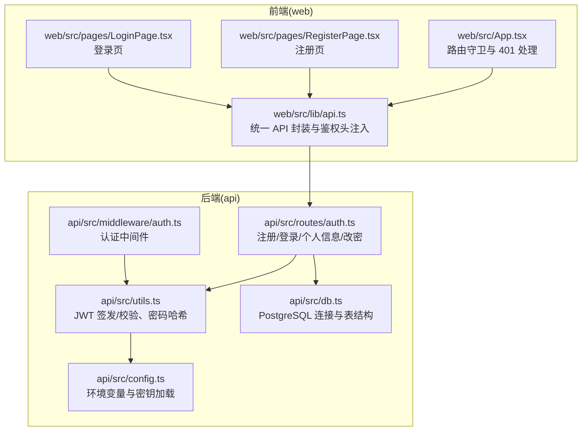
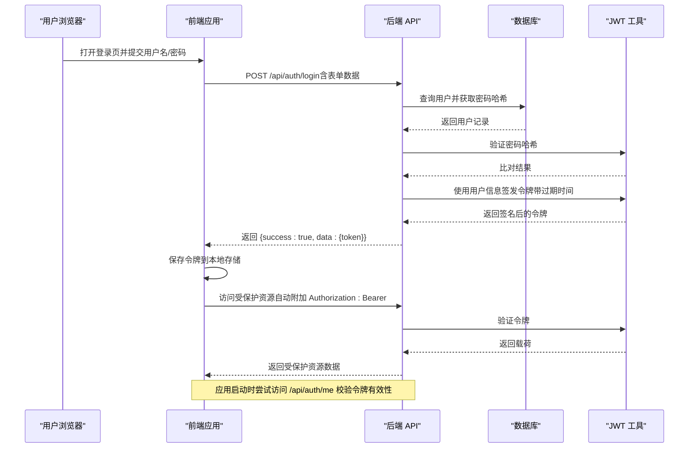
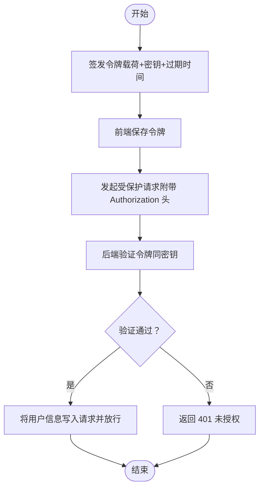
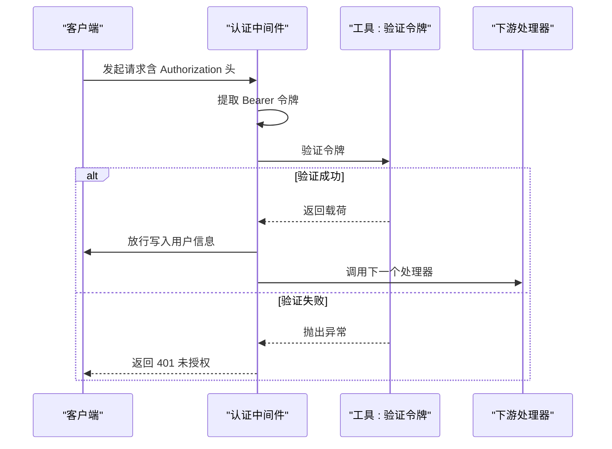
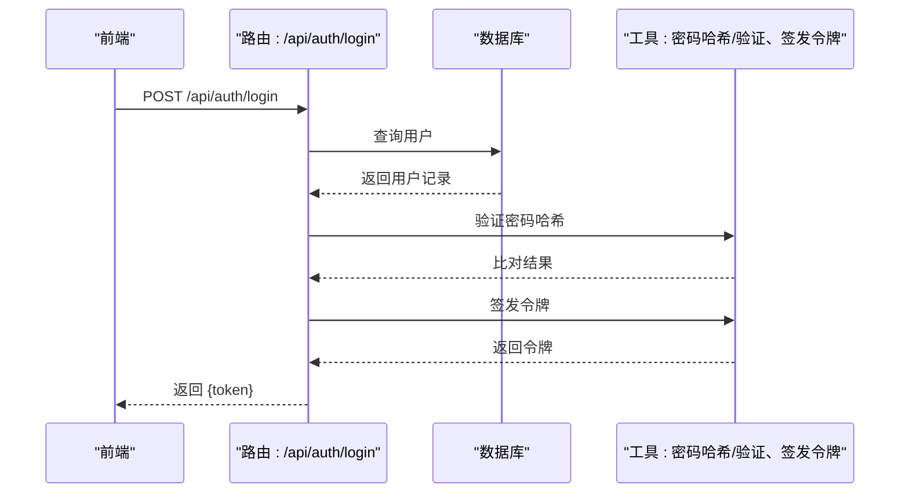
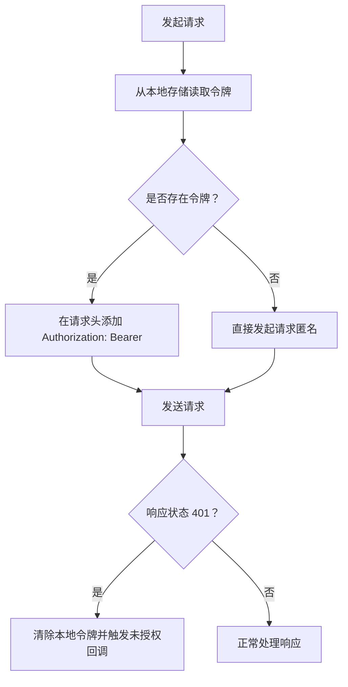
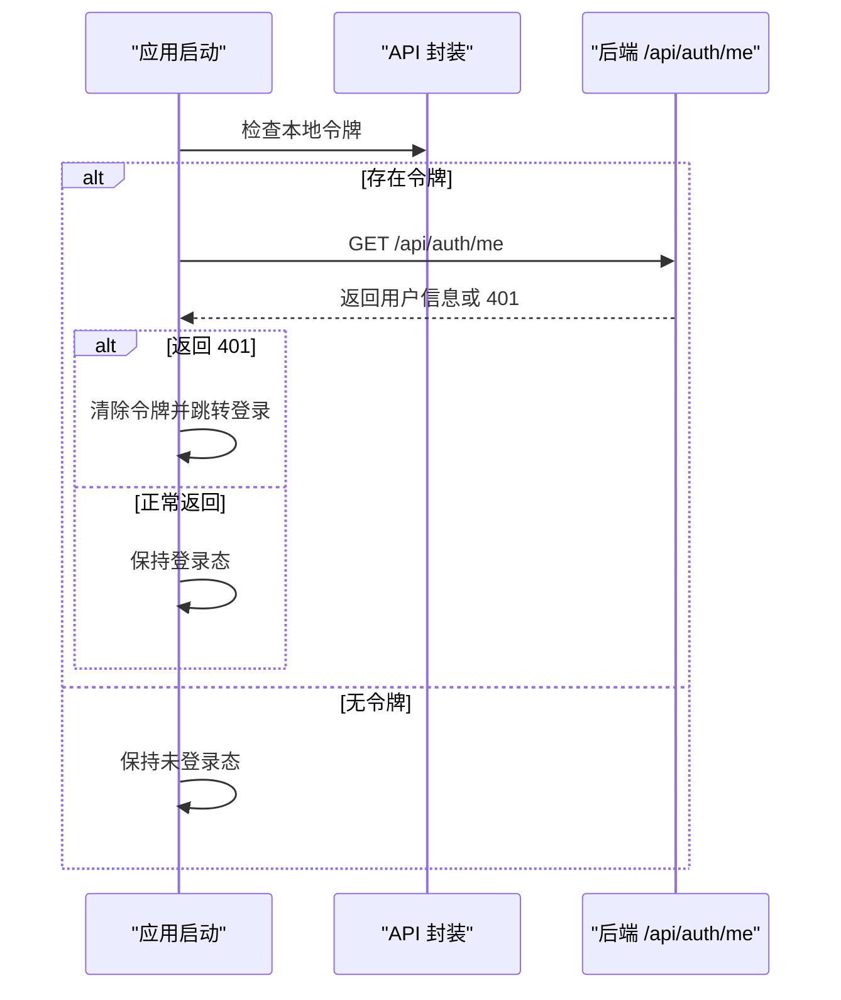
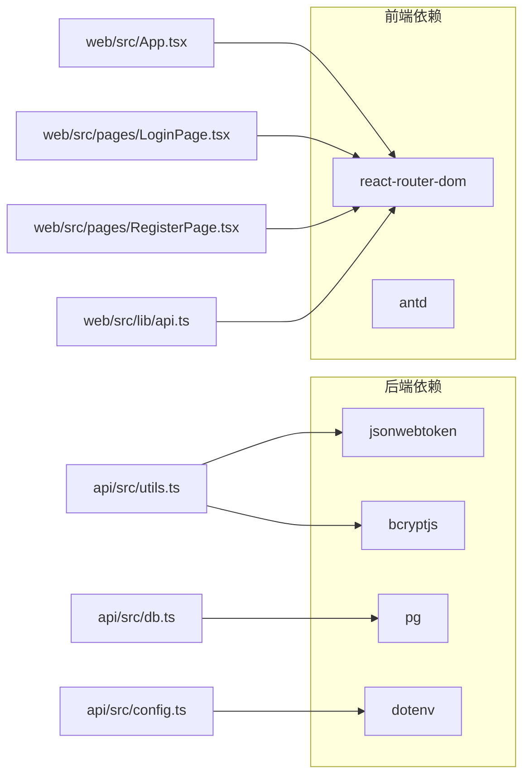

# JWT 认证机制

<cite>
**本文引用的文件**
- [api/src/middleware/auth.ts](file://api/src/middleware/auth.ts)
- [api/src/routes/auth.ts](file://api/src/routes/auth.ts)
- [api/src/utils.ts](file://api/src/utils.ts)
- [api/src/config.ts](file://api/src/config.ts)
- [api/src/db.ts](file://api/src/db.ts)
- [api/package.json](file://api/package.json)
- [web/src/lib/api.ts](file://web/src/lib/api.ts)
- [web/src/pages/LoginPage.tsx](file://web/src/pages/LoginPage.tsx)
- [web/src/pages/RegisterPage.tsx](file://web/src/pages/RegisterPage.tsx)
- [web/src/App.tsx](file://web/src/App.tsx)
- [web/package.json](file://web/package.json)
</cite>

## 目录
1. [简介](#简介)
2. [项目结构](#项目结构)
3. [核心组件](#核心组件)
4. [架构总览](#架构总览)
5. [详细组件分析](#详细组件分析)
6. [依赖关系分析](#依赖关系分析)
7. [性能考量](#性能考量)
8. [故障排查指南](#故障排查指南)
9. [结论](#结论)
10. [附录](#附录)

## 简介
本文件系统性阐述本项目的 JWT（JSON Web Token）认证机制，覆盖以下方面：
- JWT 工作原理、结构组成、签名算法与过期时间管理
- 认证中间件的实现、请求拦截与权限验证流程
- 前后端交互中的令牌生成、携带、解析与验证
- 令牌存储策略、刷新机制与安全最佳实践
- 与用户会话管理及状态保持的关系
- 常见问题处理：令牌过期、跨域认证与安全漏洞防护
- 面向初学者的入门说明与面向开发者的深入实现细节

## 项目结构
本项目采用前后端分离架构：
- 后端基于 Node.js + Express，使用 TypeScript 开发，JWT 与密码哈希在后端完成
- 前端基于 Vite + React，通过统一的 API 封装层自动注入 Authorization 头
- 数据库存储用户信息与运行任务等业务数据

图表来源
- [web/src/lib/api.ts:13-36](file://web/src/lib/api.ts#L13-L36)
- [web/src/pages/LoginPage.tsx:22-38](file://web/src/pages/LoginPage.tsx#L22-L38)
- [web/src/pages/RegisterPage.tsx:25-44](file://web/src/pages/RegisterPage.tsx#L25-L44)
- [web/src/App.tsx:17-39](file://web/src/App.tsx#L17-L39)
- [api/src/config.ts:13-19](file://api/src/config.ts#L13-L19)
- [api/src/utils.ts:14-20](file://api/src/utils.ts#L14-L20)
- [api/src/middleware/auth.ts:8-22](file://api/src/middleware/auth.ts#L8-L22)
- [api/src/routes/auth.ts:8-63](file://api/src/routes/auth.ts#L8-L63)
- [api/src/db.ts:6-8](file://api/src/db.ts#L6-L8)

章节来源
- [api/src/config.ts:1-19](file://api/src/config.ts#L1-L19)
- [api/src/utils.ts:1-21](file://api/src/utils.ts#L1-L21)
- [api/src/middleware/auth.ts:1-23](file://api/src/middleware/auth.ts#L1-L23)
- [api/src/routes/auth.ts:1-115](file://api/src/routes/auth.ts#L1-L115)
- [api/src/db.ts:1-35](file://api/src/db.ts#L1-L35)
- [web/src/lib/api.ts:1-160](file://web/src/lib/api.ts#L1-L160)
- [web/src/pages/LoginPage.tsx:1-136](file://web/src/pages/LoginPage.tsx#L1-L136)
- [web/src/pages/RegisterPage.tsx:1-87](file://web/src/pages/RegisterPage.tsx#L1-L87)
- [web/src/App.tsx:1-70](file://web/src/App.tsx#L1-L70)

## 核心组件
- 环境与密钥配置
  - 从环境变量加载 JWT 密钥、数据库连接串等必要配置，并进行必需项校验
- JWT 工具
  - 使用对称签名算法签发令牌并设置过期时间；使用相同密钥验证令牌
  - 使用 bcrypt 对密码进行加盐哈希与比对
- 认证中间件
  - 从请求头提取 Bearer 令牌，调用验证函数，失败返回 401
  - 成功则将用户信息写入请求对象，放行后续路由
- 路由层
  - 注册：校验必填字段，查询用户是否存在，哈希密码后入库，签发令牌返回
  - 登录：按用户名查询用户，比对密码，成功后签发令牌返回
  - 个人信息：要求已认证，查询当前用户信息返回
  - 修改密码：要求已认证，支持管理员对他人改密的权限控制
- 前端 API 封装
  - 自动从本地存储读取令牌并在每个请求头中添加 Authorization: Bearer
  - 收到 401 时清理本地令牌并触发未授权回调（如跳转登录）
- 前端路由守卫
  - 应用启动时检查本地令牌，若存在则尝试访问“我的信息”接口进行有效性校验
  - 若校验失败则清空令牌并跳转登录页

章节来源
- [api/src/config.ts:5-11](file://api/src/config.ts#L5-L11)
- [api/src/utils.ts:5-20](file://api/src/utils.ts#L5-L20)
- [api/src/middleware/auth.ts:8-22](file://api/src/middleware/auth.ts#L8-L22)
- [api/src/routes/auth.ts:8-112](file://api/src/routes/auth.ts#L8-L112)
- [web/src/lib/api.ts:9-36](file://web/src/lib/api.ts#L9-L36)
- [web/src/App.tsx:17-39](file://web/src/App.tsx#L17-L39)

## 架构总览
下图展示了从用户登录到后端认证、再到前端路由守卫的整体流程。

图表来源
- [web/src/pages/LoginPage.tsx:22-38](file://web/src/pages/LoginPage.tsx#L22-L38)
- [api/src/routes/auth.ts:36-62](file://api/src/routes/auth.ts#L36-L62)
- [api/src/utils.ts:14-20](file://api/src/utils.ts#L14-L20)
- [web/src/lib/api.ts:13-36](file://web/src/lib/api.ts#L13-L36)
- [web/src/App.tsx:26-39](file://web/src/App.tsx#L26-L39)

## 详细组件分析

### JWT 结构与签名算法
- 结构组成
  - 头部（Header）：描述算法与类型
  - 载荷（Payload）：包含用户标识与角色等声明
  - 签名（Signature）：使用对称密钥对头部与载荷进行签名
- 签名算法
  - 使用对称加密算法（如 HS256），密钥来自后端环境变量
- 过期时间管理
  - 签发时设置过期时间（例如 7 天），到期后验证失败

章节来源
- [api/src/utils.ts:14-20](file://api/src/utils.ts#L14-L20)
- [api/src/config.ts:16-16](file://api/src/config.ts#L16-L16)

### 令牌生成与验证流程
- 生成流程
  - 用户注册/登录成功后，后端根据用户 ID 与角色构造载荷
  - 使用密钥与过期时间签发令牌并返回给前端
- 验证流程
  - 前端每次请求在请求头中附加 Authorization: Bearer <token>
  - 中间件从请求头提取令牌并使用同一密钥进行验证
  - 验证通过后将用户信息写入请求对象，继续处理后续逻辑

图表来源
- [api/src/utils.ts:14-20](file://api/src/utils.ts#L14-L20)
- [web/src/lib/api.ts:17-18](file://web/src/lib/api.ts#L17-L18)
- [api/src/middleware/auth.ts:14-21](file://api/src/middleware/auth.ts#L14-L21)

章节来源
- [api/src/utils.ts:14-20](file://api/src/utils.ts#L14-L20)
- [web/src/lib/api.ts:13-36](file://web/src/lib/api.ts#L13-L36)
- [api/src/middleware/auth.ts:8-22](file://api/src/middleware/auth.ts#L8-L22)

### 认证中间件实现与权限验证
- 请求拦截
  - 从 Authorization 头提取 Bearer 令牌
  - 若缺失直接返回 401
- 权限验证
  - 使用密钥验证令牌有效性
  - 成功则将用户信息写入请求对象，继续执行下一个中间件/路由处理器
  - 失败返回 401 并提示“登录失效”

图表来源
- [api/src/middleware/auth.ts:8-22](file://api/src/middleware/auth.ts#L8-L22)
- [api/src/utils.ts:18-20](file://api/src/utils.ts#L18-L20)

章节来源
- [api/src/middleware/auth.ts:8-22](file://api/src/middleware/auth.ts#L8-L22)
- [api/src/utils.ts:18-20](file://api/src/utils.ts#L18-L20)

### 路由层：注册、登录、个人信息与改密
- 注册
  - 校验必填字段，查询用户名是否已存在，存在则返回冲突
  - 使用哈希算法对密码进行加盐哈希，插入用户记录
  - 使用用户 ID 与角色签发令牌并返回
- 登录
  - 按用户名查询用户，不存在或密码不匹配返回 401
  - 成功后签发令牌并返回
- 个人信息
  - 要求已认证，查询当前用户并返回
- 修改密码
  - 要求已认证，支持管理员对他人改密的权限控制

图表来源
- [api/src/routes/auth.ts:36-62](file://api/src/routes/auth.ts#L36-L62)
- [api/src/utils.ts:5-12](file://api/src/utils.ts#L5-L12)
- [api/src/utils.ts:14-16](file://api/src/utils.ts#L14-L16)

章节来源
- [api/src/routes/auth.ts:8-112](file://api/src/routes/auth.ts#L8-L112)
- [api/src/utils.ts:5-20](file://api/src/utils.ts#L5-L20)

### 前端令牌存储与请求拦截
- 令牌存储策略
  - 使用本地存储保存令牌，避免内存中长期持有敏感数据
- 请求拦截
  - 统一的 API 封装在每次请求前自动添加 Authorization: Bearer 头
- 401 处理
  - 当收到 401 时清除本地令牌并触发未授权回调（如跳转登录）

图表来源
- [web/src/lib/api.ts:9-36](file://web/src/lib/api.ts#L9-L36)

章节来源
- [web/src/lib/api.ts:9-36](file://web/src/lib/api.ts#L9-L36)

### 路由守卫与会话状态保持
- 应用启动时检查本地令牌
- 若存在令牌，尝试访问“我的信息”接口进行有效性校验
- 校验失败则清空令牌并跳转登录页
- 该模式实现了“无感登录”与“会话状态保持”的前端体验

图表来源
- [web/src/App.tsx:26-39](file://web/src/App.tsx#L26-L39)

章节来源
- [web/src/App.tsx:17-39](file://web/src/App.tsx#L17-L39)

### 与用户会话管理的关系
- 本项目采用无状态令牌模型：后端不维护会话状态，所有用户上下文通过令牌载荷传递
- 前端负责持久化令牌并自动附加到请求头，后端通过中间件验证令牌有效性
- 该设计简化了横向扩展与多实例部署，但需要妥善管理令牌生命周期与安全

章节来源
- [api/src/middleware/auth.ts:8-22](file://api/src/middleware/auth.ts#L8-L22)
- [web/src/lib/api.ts:13-36](file://web/src/lib/api.ts#L13-L36)

## 依赖关系分析
- 后端依赖
  - jsonwebtoken：JWT 签发与验证
  - bcryptjs：密码加盐哈希与比对
  - pg：PostgreSQL 连接池
  - dotenv：环境变量加载
- 前端依赖
  - react-router-dom：路由与导航
  - antd：UI 组件库

图表来源
- [api/package.json:11-23](file://api/package.json#L11-L23)
- [web/package.json:11-17](file://web/package.json#L11-L17)
- [api/src/utils.ts:1-3](file://api/src/utils.ts#L1-L3)
- [api/src/db.ts:1-8](file://api/src/db.ts#L1-L8)
- [api/src/config.ts:1-3](file://api/src/config.ts#L1-L3)
- [web/src/App.tsx:1-15](file://web/src/App.tsx#L1-L15)
- [web/src/pages/LoginPage.tsx:1-4](file://web/src/pages/LoginPage.tsx#L1-L4)
- [web/src/pages/RegisterPage.tsx:1-3](file://web/src/pages/RegisterPage.tsx#L1-L3)
- [web/src/lib/api.ts:1-1](file://web/src/lib/api.ts#L1-L1)

章节来源
- [api/package.json:11-23](file://api/package.json#L11-L23)
- [web/package.json:11-17](file://web/package.json#L11-L17)

## 性能考量
- 令牌大小与负载
  - 载荷应尽量精简，避免携带大字段，以减少请求体积与解析开销
- 密钥长度与算法
  - 使用足够强度的对称密钥，避免弱口令泄露导致的安全风险
- 过期时间
  - 合理设置过期时间，在用户体验与安全性之间取得平衡
- 哈希成本
  - 密码哈希的迭代次数应适中，兼顾安全与性能
- 网络与缓存
  - 前端可对非敏感数据进行本地缓存，减少重复请求

## 故障排查指南
- 401 未登录/登录失效
  - 检查请求头是否正确附加 Authorization: Bearer
  - 检查令牌是否过期或被篡改
  - 检查后端密钥是否与前端一致
- 账号或密码错误
  - 确认用户名存在且密码哈希匹配
- 账号已存在
  - 注册时用户名冲突，需更换用户名
- 无权限重置他人密码
  - 非管理员用户不可重置他人密码
- 跨域认证
  - 若前端与后端域名不同，需在后端配置允许的来源与凭证
- 安全漏洞防护
  - 严格限制令牌过期时间
  - 不在令牌中存放敏感信息
  - 使用 HTTPS 传输，避免明文泄露
  - 定期轮换密钥，防止泄露扩大

章节来源
- [api/src/middleware/auth.ts:10-21](file://api/src/middleware/auth.ts#L10-L21)
- [api/src/routes/auth.ts:15-24](file://api/src/routes/auth.ts#L15-L24)
- [api/src/routes/auth.ts:51-59](file://api/src/routes/auth.ts#L51-L59)
- [api/src/routes/auth.ts:89-91](file://api/src/routes/auth.ts#L89-L91)
- [web/src/lib/api.ts:25-28](file://web/src/lib/api.ts#L25-L28)

## 结论
本项目采用标准的 JWT 无状态认证方案，结合前端路由守卫与统一 API 封装，实现了简洁可靠的用户认证与会话保持。通过严格的令牌验证与权限控制，以及合理的过期时间与安全策略，能够在保证安全性的同时提供良好的用户体验。建议在生产环境中进一步完善令牌刷新、黑名单与审计日志等能力，以应对更复杂的业务场景。

## 附录
- 令牌存储策略
  - 建议使用本地存储保存令牌，避免内存中长期持有
  - 在高风险场景可考虑 HttpOnly Cookie（需配合后端实现）
- 刷新机制
  - 可引入短期访问令牌与长期刷新令牌的双令牌模型
  - 刷新令牌用于换取新的访问令牌，降低泄露影响面
- 安全最佳实践
  - 使用强密钥并定期轮换
  - 限制令牌过期时间，启用滑动过期或主动续期
  - 严格校验来源与凭证，防范 CSRF 与 XSS
  - 对敏感操作增加二次确认与 MFA