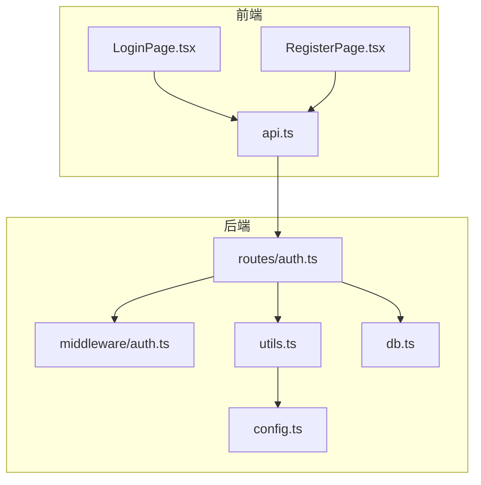
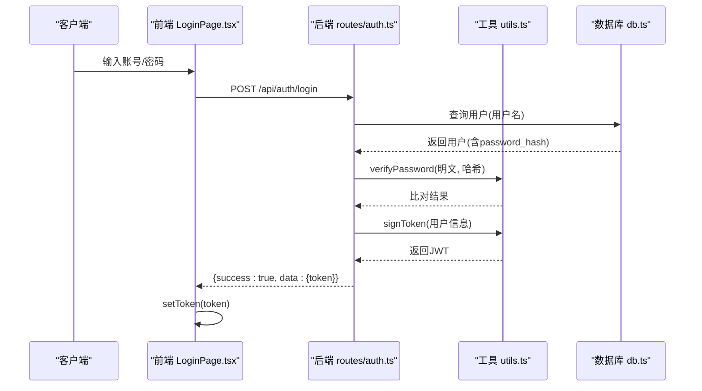
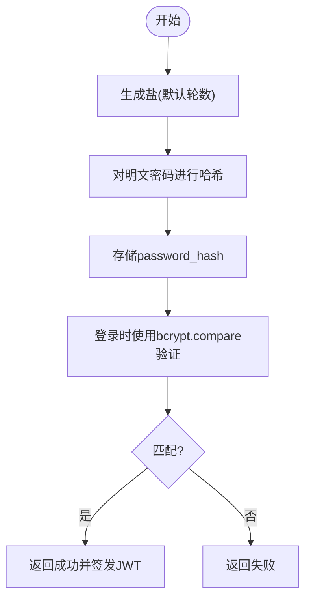
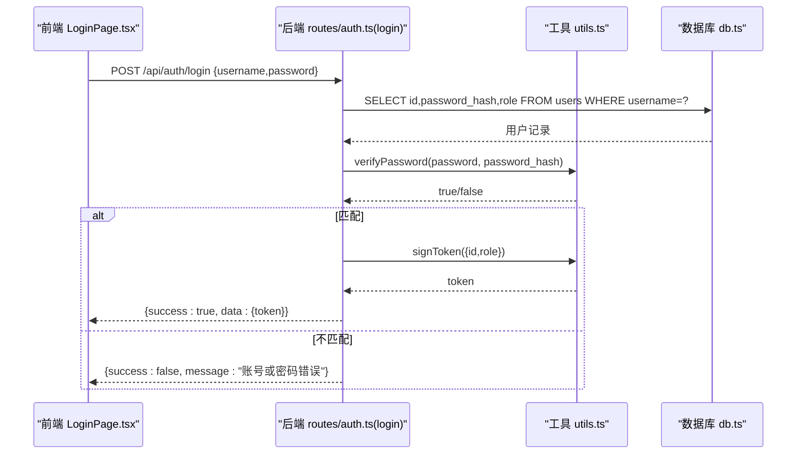
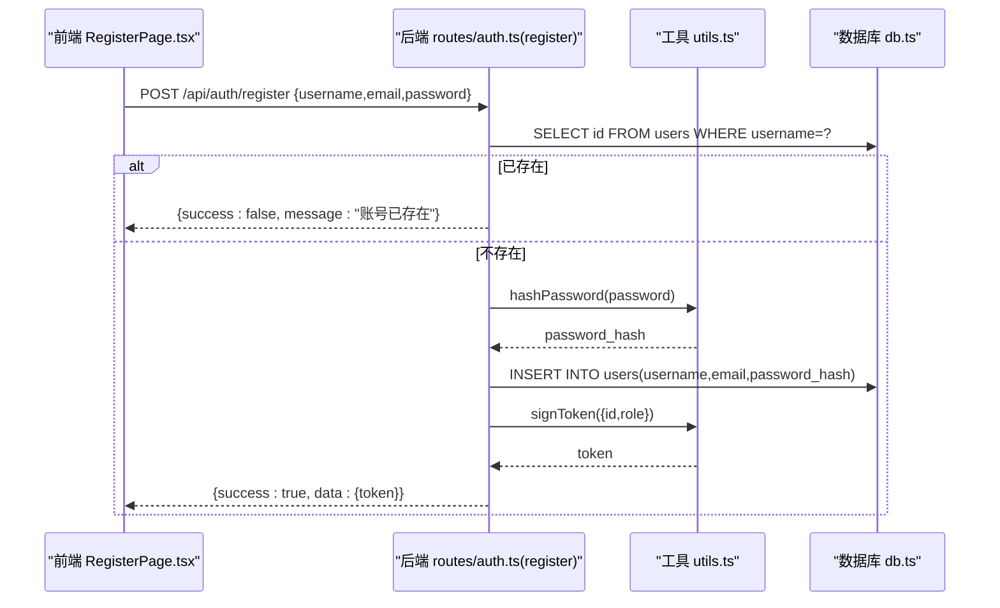
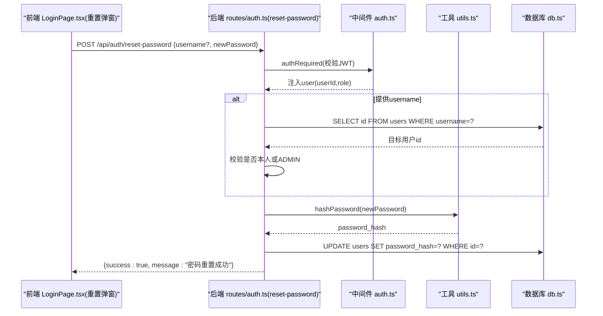
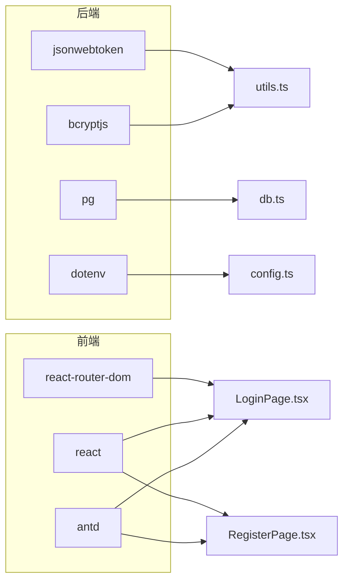

# 密码管理

<cite>
**本文引用的文件列表**
- [api/src/middleware/auth.ts](file://api/src/middleware/auth.ts)
- [api/src/routes/auth.ts](file://api/src/routes/auth.ts)
- [api/src/utils.ts](file://api/src/utils.ts)
- [api/src/db.ts](file://api/src/db.ts)
- [api/src/config.ts](file://api/src/config.ts)
- [web/src/lib/api.ts](file://web/src/lib/api.ts)
- [web/src/pages/LoginPage.tsx](file://web/src/pages/LoginPage.tsx)
- [web/src/pages/RegisterPage.tsx](file://web/src/pages/RegisterPage.tsx)
- [api/package.json](file://api/package.json)
- [web/package.json](file://web/package.json)
</cite>

## 目录
1. [简介](#简介)
2. [项目结构](#项目结构)
3. [核心组件](#核心组件)
4. [架构总览](#架构总览)
5. [详细组件分析](#详细组件分析)
6. [依赖关系分析](#依赖关系分析)
7. [性能与安全考量](#性能与安全考量)
8. [故障排查指南](#故障排查指南)
9. [结论](#结论)
10. [附录：安全策略与最佳实践](#附录安全策略与最佳实践)

## 简介
本文件围绕密码管理功能进行系统化技术文档整理，重点覆盖以下方面：
- 密码加密机制与 bcrypt 配置
- 哈希生成、验证与安全存储策略
- 密码重置流程（权限校验、目标用户检查、安全更新）
- 前端密码输入的安全处理与体验优化
- 安全审计与常见问题（密码泄露、暴力破解等）的应对建议

## 项目结构
后端采用 Express + PostgreSQL + JWT 的认证体系；前端使用 React + Ant Design 提供表单与交互。密码相关逻辑集中在后端路由与工具函数中，前端负责输入校验与令牌传递。

图表来源
- [api/src/routes/auth.ts:1-115](file://api/src/routes/auth.ts#L1-L115)
- [api/src/middleware/auth.ts:1-23](file://api/src/middleware/auth.ts#L1-L23)
- [api/src/utils.ts:1-21](file://api/src/utils.ts#L1-L21)
- [api/src/db.ts:1-35](file://api/src/db.ts#L1-L35)
- [api/src/config.ts:1-19](file://api/src/config.ts#L1-L19)
- [web/src/lib/api.ts:1-160](file://web/src/lib/api.ts#L1-L160)
- [web/src/pages/LoginPage.tsx:1-136](file://web/src/pages/LoginPage.tsx#L1-L136)
- [web/src/pages/RegisterPage.tsx:1-87](file://web/src/pages/RegisterPage.tsx#L1-L87)

章节来源
- [api/src/routes/auth.ts:1-115](file://api/src/routes/auth.ts#L1-L115)
- [api/src/middleware/auth.ts:1-23](file://api/src/middleware/auth.ts#L1-L23)
- [api/src/utils.ts:1-21](file://api/src/utils.ts#L1-L21)
- [api/src/db.ts:1-35](file://api/src/db.ts#L1-L35)
- [api/src/config.ts:1-19](file://api/src/config.ts#L1-L19)
- [web/src/lib/api.ts:1-160](file://web/src/lib/api.ts#L1-L160)
- [web/src/pages/LoginPage.tsx:1-136](file://web/src/pages/LoginPage.tsx#L1-L136)
- [web/src/pages/RegisterPage.tsx:1-87](file://web/src/pages/RegisterPage.tsx#L1-L87)

## 核心组件
- 认证中间件：解析 Authorization 头，校验 JWT 并注入用户信息到请求上下文
- 路由层：提供注册、登录、密码重置、查询当前用户等接口
- 工具层：封装 bcrypt 哈希与 JWT 签发/校验
- 数据层：PostgreSQL 用户表，包含用户名、邮箱、密码哈希、角色、状态等字段
- 前端：登录页、注册页与通用 API 封装，负责令牌持久化与 401 自动清理

章节来源
- [api/src/middleware/auth.ts:8-22](file://api/src/middleware/auth.ts#L8-L22)
- [api/src/routes/auth.ts:8-34](file://api/src/routes/auth.ts#L8-L34)
- [api/src/routes/auth.ts:36-63](file://api/src/routes/auth.ts#L36-L63)
- [api/src/routes/auth.ts:65-98](file://api/src/routes/auth.ts#L65-L98)
- [api/src/utils.ts:5-12](file://api/src/utils.ts#L5-L12)
- [api/src/db.ts:12-20](file://api/src/db.ts#L12-L20)
- [web/src/lib/api.ts:9-36](file://web/src/lib/api.ts#L9-L36)

## 架构总览
后端通过 bcrypt 对明文密码进行加盐哈希，仅存储哈希值；登录时使用 bcrypt.compare 进行验证；成功后签发 JWT 并返回给前端；前端在后续请求中携带 Bearer Token。密码重置支持自重置与管理员重置，具备权限校验与目标用户存在性检查。

图表来源
- [api/src/routes/auth.ts:36-63](file://api/src/routes/auth.ts#L36-L63)
- [api/src/utils.ts:10-16](file://api/src/utils.ts#L10-L16)
- [api/src/db.ts:12-20](file://api/src/db.ts#L12-L20)
- [web/src/pages/LoginPage.tsx:22-38](file://web/src/pages/LoginPage.tsx#L22-L38)
- [web/src/lib/api.ts:13-36](file://web/src/lib/api.ts#L13-L36)

## 详细组件分析

### 密码加密与验证实现
- bcrypt 选择与配置
  - 使用 bcryptjs 作为哈希库，盐生成使用默认轮数（在 bcryptjs 中通常对应较高安全性）
  - 在工具函数中封装了哈希生成与比对方法，便于复用
- 存储策略
  - 数据库 users 表仅保存 password_hash 字段，不存储明文密码
  - 用户名唯一约束，避免重复

图表来源
- [api/src/utils.ts:5-12](file://api/src/utils.ts#L5-L12)
- [api/src/db.ts:16](file://api/src/db.ts#L16)

章节来源
- [api/src/utils.ts:5-12](file://api/src/utils.ts#L5-L12)
- [api/src/db.ts:12-20](file://api/src/db.ts#L12-L20)

### 登录流程
- 参数校验：用户名与密码必填
- 查询用户：按用户名查询，若不存在返回 401
- 验证密码：使用 verifyPassword 比对哈希
- 成功后签发 JWT 并返回 token

图表来源
- [api/src/routes/auth.ts:36-63](file://api/src/routes/auth.ts#L36-L63)
- [api/src/utils.ts:10-16](file://api/src/utils.ts#L10-L16)
- [web/src/pages/LoginPage.tsx:22-38](file://web/src/pages/LoginPage.tsx#L22-L38)

章节来源
- [api/src/routes/auth.ts:36-63](file://api/src/routes/auth.ts#L36-L63)
- [web/src/pages/LoginPage.tsx:22-38](file://web/src/pages/LoginPage.tsx#L22-L38)

### 注册流程
- 参数校验：用户名与密码必填
- 去重检查：用户名唯一
- 密码哈希：使用 hashPassword 生成哈希
- 插入用户并返回 token

图表来源
- [api/src/routes/auth.ts:8-34](file://api/src/routes/auth.ts#L8-L34)
- [api/src/utils.ts:5-8](file://api/src/utils.ts#L5-L8)
- [web/src/pages/RegisterPage.tsx:14-44](file://web/src/pages/RegisterPage.tsx#L14-L44)

章节来源
- [api/src/routes/auth.ts:8-34](file://api/src/routes/auth.ts#L8-L34)
- [web/src/pages/RegisterPage.tsx:14-44](file://web/src/pages/RegisterPage.tsx#L14-L44)

### 密码重置流程
- 权限要求：需登录（authRequired），且请求体可选包含目标用户名
- 目标用户检查：若提供用户名则查询是否存在；若非本人且请求者非 ADMIN，则拒绝
- 安全更新：对新密码进行哈希后写回数据库

图表来源
- [api/src/routes/auth.ts:65-98](file://api/src/routes/auth.ts#L65-L98)
- [api/src/middleware/auth.ts:8-22](file://api/src/middleware/auth.ts#L8-L22)
- [api/src/utils.ts:5-8](file://api/src/utils.ts#L5-L8)
- [web/src/pages/LoginPage.tsx:40-66](file://web/src/pages/LoginPage.tsx#L40-L66)

章节来源
- [api/src/routes/auth.ts:65-98](file://api/src/routes/auth.ts#L65-L98)
- [api/src/middleware/auth.ts:8-22](file://api/src/middleware/auth.ts#L8-L22)
- [web/src/pages/LoginPage.tsx:40-66](file://web/src/pages/LoginPage.tsx#L40-L66)

### 前端安全处理与用户体验
- 输入安全
  - 使用 Ant Design 的 Input.Password，避免明文显示
  - 注册页对“确认密码”进行前端一致性校验
  - 登录页重置密码弹窗对“新密码/确认新密码”进行一致性校验
- 令牌管理
  - 通过 api.ts 的 setToken/getToken/clearToken 管理本地存储
  - 自动在请求头添加 Authorization: Bearer token
  - 401 时自动清理 token 并触发未授权回调
- 体验优化
  - 表单项必填提示与占位符
  - 成功/失败消息提示
  - “忘记密码？”入口引导

章节来源
- [web/src/pages/LoginPage.tsx:17-136](file://web/src/pages/LoginPage.tsx#L17-L136)
- [web/src/pages/RegisterPage.tsx:11-87](file://web/src/pages/RegisterPage.tsx#L11-L87)
- [web/src/lib/api.ts:9-36](file://web/src/lib/api.ts#L9-L36)

## 依赖关系分析
- 后端依赖
  - bcryptjs：密码哈希与比对
  - jsonwebtoken：JWT 签发与校验
  - pg：PostgreSQL 连接池
  - dotenv：环境变量加载
- 前端依赖
  - antd：表单与交互组件
  - react/react-router-dom：页面与导航

图表来源
- [api/src/utils.ts:1-3](file://api/src/utils.ts#L1-L3)
- [api/src/db.ts:1-8](file://api/src/db.ts#L1-L8)
- [api/src/config.ts:1-11](file://api/src/config.ts#L1-L11)
- [web/src/pages/LoginPage.tsx:1-5](file://web/src/pages/LoginPage.tsx#L1-L5)
- [web/src/pages/RegisterPage.tsx:1-4](file://web/src/pages/RegisterPage.tsx#L1-L4)

章节来源
- [api/package.json:11-22](file://api/package.json#L11-L22)
- [web/package.json:11-16](file://web/package.json#L11-L16)

## 性能与安全考量
- bcrypt 轮数与性能
  - 当前实现使用 bcryptjs 默认盐生成，未显式设置轮数；在大多数场景下已足够安全
  - 若需进一步提升抗暴力破解能力，可在工具函数中显式设置更高轮数（例如 12-15），但会增加 CPU 开销与延迟
- JWT 生命周期
  - 当前 token 过期时间为 7 天；可根据业务需求调整
- 数据库索引与查询
  - users 表对 username 建有唯一索引，登录与注册查询效率高
- 前端安全
  - 使用 HTTPS 传输，避免明文密码在网络中暴露
  - 本地 token 存储于 localStorage，建议结合 HttpOnly Cookie 或更安全的存储方案以降低 XSS 风险
- 速率限制与防护
  - 建议在网关或应用层增加登录尝试频率限制，防止暴力破解
  - 可引入验证码或二次验证机制

[本节为通用建议，不直接分析具体文件]

## 故障排查指南
- 登录失败
  - 现象：返回“账号或密码错误”
  - 排查：确认用户名是否存在、密码是否与哈希匹配
  - 关联路径：[api/src/routes/auth.ts:51-59](file://api/src/routes/auth.ts#L51-L59)
- 注册失败
  - 现象：返回“账号已存在”
  - 排查：检查用户名是否唯一
  - 关联路径：[api/src/routes/auth.ts:22-24](file://api/src/routes/auth.ts#L22-L24)
- 密码重置失败
  - 现象：无权限或用户不存在
  - 排查：确认请求者身份与目标用户是否存在；管理员可重置他人密码
  - 关联路径：[api/src/routes/auth.ts:82-92](file://api/src/routes/auth.ts#L82-L92)
- 401 未登录
  - 现象：前端收到 401，自动清除 token
  - 排查：确认 token 是否过期或被篡改
  - 关联路径：[web/src/lib/api.ts:25-28](file://web/src/lib/api.ts#L25-L28)

章节来源
- [api/src/routes/auth.ts:51-59](file://api/src/routes/auth.ts#L51-L59)
- [api/src/routes/auth.ts:22-24](file://api/src/routes/auth.ts#L22-L24)
- [api/src/routes/auth.ts:82-92](file://api/src/routes/auth.ts#L82-L92)
- [web/src/lib/api.ts:25-28](file://web/src/lib/api.ts#L25-L28)

## 结论
该密码管理方案基于 bcrypt 哈希与 JWT 令牌，实现了安全的注册、登录与密码重置流程。前端通过表单与 API 封装提供了良好的用户体验。建议在生产环境中结合速率限制、HTTPS、更严格的密码策略与安全存储方案，持续提升整体安全性。

[本节为总结性内容，不直接分析具体文件]

## 附录：安全策略与最佳实践
- 密码策略
  - 最小长度：建议至少 8-12 位
  - 复杂度：建议包含大小写字母、数字与特殊字符
  - 历史密码检查：建议禁止使用最近 N 次使用的密码
- 安全审计
  - 记录登录/重置事件与失败次数
  - 定期轮换 JWT 密钥
- 风险缓解
  - 暴力破解：速率限制、账户锁定阈值、验证码
  - 密码泄露：强制定期更换、多因素认证（MFA）、密码哈希升级策略
  - 审计与合规：遵循行业标准（如 OWASP Top 10）

[本节为通用建议，不直接分析具体文件]