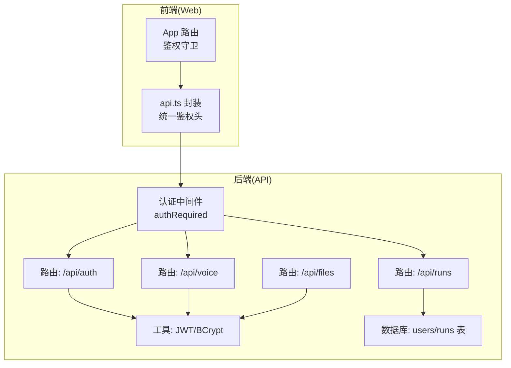
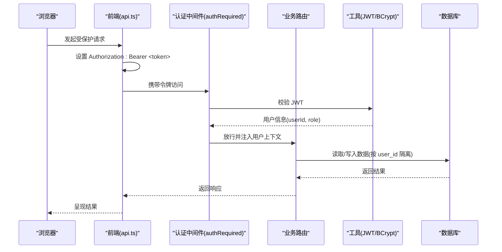
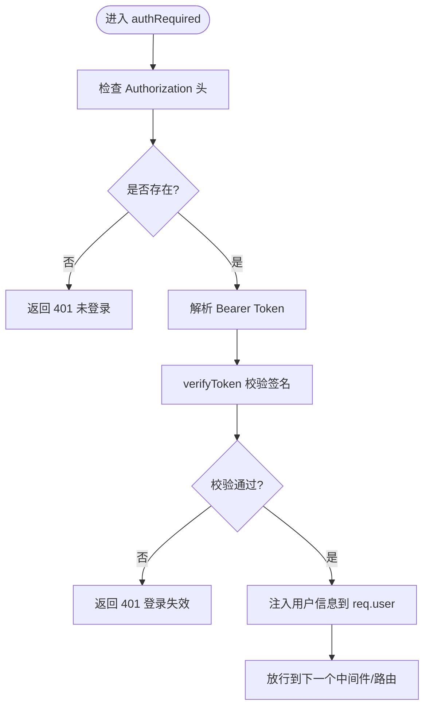
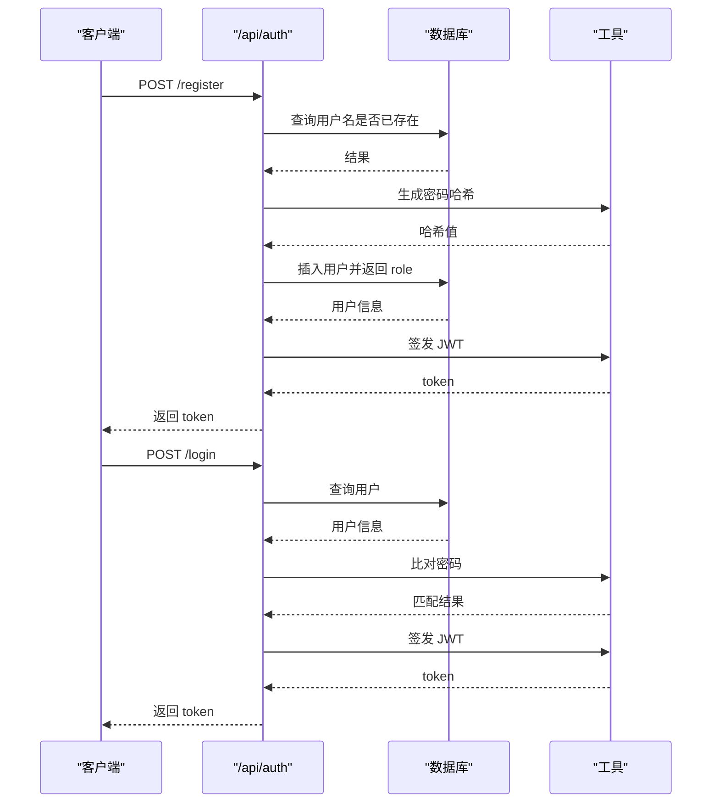
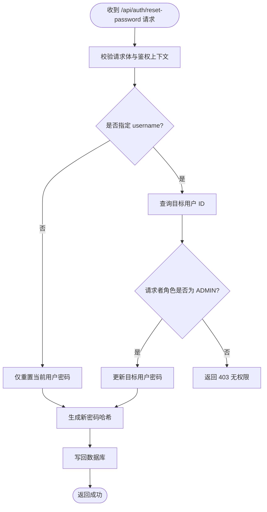
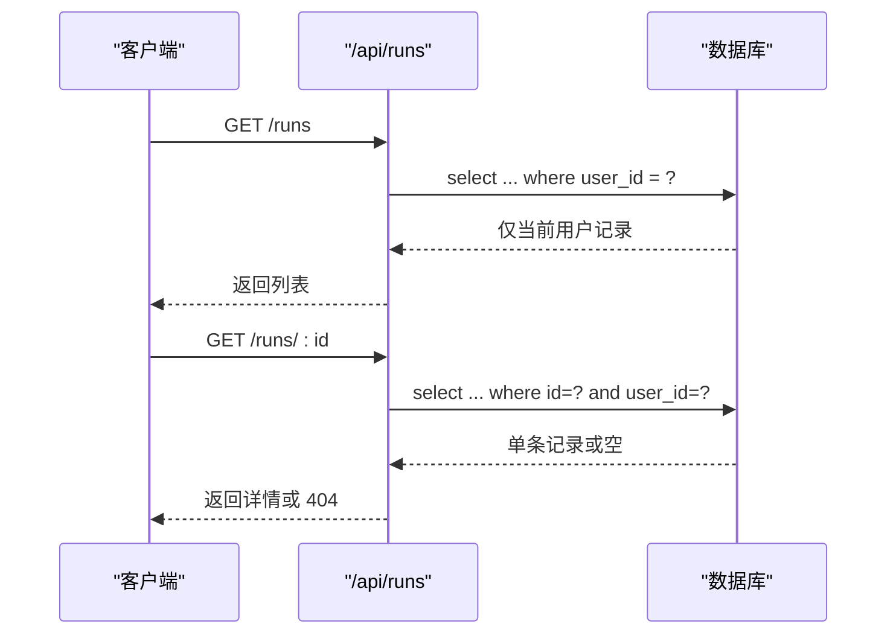
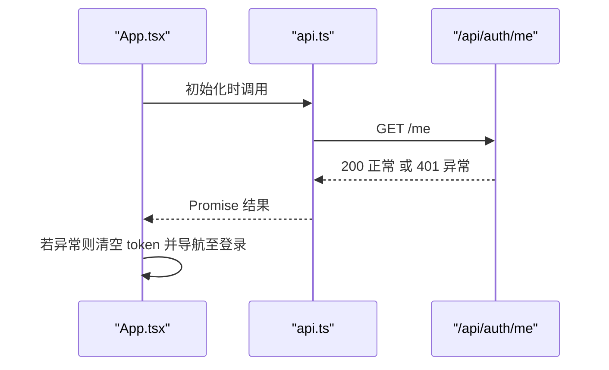
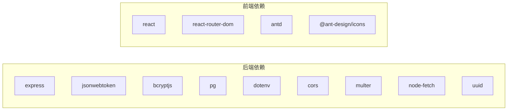

# 权限控制

<cite>
**本文引用的文件**
- [api/src/middleware/auth.ts](file://api/src/middleware/auth.ts)
- [api/src/routes/auth.ts](file://api/src/routes/auth.ts)
- [api/src/routes/runs.ts](file://api/src/routes/runs.ts)
- [api/src/routes/voice.ts](file://api/src/routes/voice.ts)
- [api/src/routes/files.ts](file://api/src/routes/files.ts)
- [api/src/utils.ts](file://api/src/utils.ts)
- [api/src/db.ts](file://api/src/db.ts)
- [api/src/config.ts](file://api/src/config.ts)
- [api/src/index.ts](file://api/src/index.ts)
- [web/src/lib/api.ts](file://web/src/lib/api.ts)
- [web/src/App.tsx](file://web/src/App.tsx)
- [web/src/main.tsx](file://web/src/main.tsx)
- [api/package.json](file://api/package.json)
- [web/package.json](file://web/package.json)
- [docker-compose.yml](file://docker-compose.yml)
</cite>

## 目录
1. [简介](#简介)
2. [项目结构](#项目结构)
3. [核心组件](#核心组件)
4. [架构总览](#架构总览)
5. [详细组件分析](#详细组件分析)
6. [依赖分析](#依赖分析)
7. [性能考量](#性能考量)
8. [故障排查指南](#故障排查指南)
9. [结论](#结论)
10. [附录](#附录)

## 简介
本文件系统性梳理该权限控制体系，重点覆盖以下方面：
- 基于角色的访问控制（RBAC）实现现状与扩展建议
- 用户角色定义、权限分配与访问验证机制
- 管理员权限的特殊处理与跨用户操作限制
- 认证中间件的权限检查逻辑与必需权限验证
- 权限缓存策略、权限更新机制与安全边界检查
- 前端权限控制的实现方式与用户体验考虑
- 常见权限问题的成因与解决方案（越权、绕过、冲突）

## 项目结构
后端采用 Express + PostgreSQL 架构，前端使用 Vite + React + Ant Design。权限控制贯穿认证中间件、路由层与数据库层。

图表来源
- [api/src/index.ts:19-23](file://api/src/index.ts#L19-L23)
- [api/src/middleware/auth.ts:8-22](file://api/src/middleware/auth.ts#L8-L22)
- [api/src/routes/auth.ts:3-63](file://api/src/routes/auth.ts#L3-L63)
- [api/src/routes/runs.ts:13-53](file://api/src/routes/runs.ts#L13-L53)
- [api/src/routes/voice.ts:69-86](file://api/src/routes/voice.ts#L69-L86)
- [api/src/routes/files.ts:10-40](file://api/src/routes/files.ts#L10-L40)
- [api/src/utils.ts:14-20](file://api/src/utils.ts#L14-L20)
- [api/src/db.ts:10-34](file://api/src/db.ts#L10-L34)

章节来源
- [api/src/index.ts:19-23](file://api/src/index.ts#L19-L23)
- [api/src/middleware/auth.ts:8-22](file://api/src/middleware/auth.ts#L8-L22)
- [api/src/routes/auth.ts:3-63](file://api/src/routes/auth.ts#L3-L63)
- [api/src/routes/runs.ts:13-53](file://api/src/routes/runs.ts#L13-L53)
- [api/src/routes/voice.ts:69-86](file://api/src/routes/voice.ts#L69-L86)
- [api/src/routes/files.ts:10-40](file://api/src/routes/files.ts#L10-L40)
- [api/src/utils.ts:14-20](file://api/src/utils.ts#L14-L20)
- [api/src/db.ts:10-34](file://api/src/db.ts#L10-L34)

## 核心组件
- 认证中间件：负责校验 Bearer Token 并注入用户信息到请求上下文
- 路由层：在需要鉴权的接口上应用中间件；对跨用户操作进行角色判定
- 数据库层：users 表含 role 字段，runs 表按 user_id 进行数据隔离
- 工具层：JWT 签发/校验、密码哈希/比对
- 前端：统一设置 Authorization 头，401 自动登出并跳转登录页

章节来源
- [api/src/middleware/auth.ts:8-22](file://api/src/middleware/auth.ts#L8-L22)
- [api/src/routes/auth.ts:65-98](file://api/src/routes/auth.ts#L65-L98)
- [api/src/routes/runs.ts:13-53](file://api/src/routes/runs.ts#L13-L53)
- [api/src/db.ts:12-20](file://api/src/db.ts#L12-L20)
- [api/src/utils.ts:14-20](file://api/src/utils.ts#L14-L20)
- [web/src/lib/api.ts:13-36](file://web/src/lib/api.ts#L13-L36)
- [web/src/App.tsx:17-39](file://web/src/App.tsx#L17-L39)

## 架构总览
下图展示了从浏览器到后端 API 的典型调用链路，以及权限控制的关键节点。

图表来源
- [web/src/lib/api.ts:13-36](file://web/src/lib/api.ts#L13-L36)
- [api/src/middleware/auth.ts:8-22](file://api/src/middleware/auth.ts#L8-L22)
- [api/src/utils.ts:14-20](file://api/src/utils.ts#L14-L20)
- [api/src/routes/runs.ts:13-53](file://api/src/routes/runs.ts#L13-L53)
- [api/src/db.ts:12-20](file://api/src/db.ts#L12-L20)

## 详细组件分析

### 认证中间件与用户上下文
- 中间件从 Authorization 头解析 Bearer Token，校验通过后将用户标识注入到请求对象
- 任何需要鉴权的路由均需通过该中间件
- 未携带或无效令牌时返回 401

图表来源
- [api/src/middleware/auth.ts:8-22](file://api/src/middleware/auth.ts#L8-L22)
- [api/src/utils.ts:18-20](file://api/src/utils.ts#L18-L20)

章节来源
- [api/src/middleware/auth.ts:8-22](file://api/src/middleware/auth.ts#L8-L22)
- [api/src/utils.ts:18-20](file://api/src/utils.ts#L18-L20)

### 用户注册与登录流程
- 注册：校验必填字段，检查用户名唯一性，生成密码哈希，插入用户并签发 JWT
- 登录：查询用户，比对密码哈希，签发 JWT
- 两者均返回 token，前端存储并在后续请求中携带

图表来源
- [api/src/routes/auth.ts:8-34](file://api/src/routes/auth.ts#L8-L34)
- [api/src/routes/auth.ts:36-63](file://api/src/routes/auth.ts#L36-L63)
- [api/src/utils.ts:5-12](file://api/src/utils.ts#L5-L12)
- [api/src/utils.ts:14-20](file://api/src/utils.ts#L14-L20)

章节来源
- [api/src/routes/auth.ts:8-34](file://api/src/routes/auth.ts#L8-L34)
- [api/src/routes/auth.ts:36-63](file://api/src/routes/auth.ts#L36-L63)
- [api/src/utils.ts:5-12](file://api/src/utils.ts#L5-L12)
- [api/src/utils.ts:14-20](file://api/src/utils.ts#L14-L20)

### 管理员权限与跨用户操作限制
- 当前实现：在“重置他人密码”场景中，仅当请求者角色为 ADMIN 时才允许对其他用户执行操作
- 实践建议：引入更细粒度的权限矩阵（如“用户管理”、“系统配置”等），以角色映射到具体权限集合，避免硬编码的角色判断

图表来源
- [api/src/routes/auth.ts:65-98](file://api/src/routes/auth.ts#L65-L98)

章节来源
- [api/src/routes/auth.ts:65-98](file://api/src/routes/auth.ts#L65-L98)

### 数据访问隔离与用户自服务
- 任务列表与详情：仅返回当前登录用户的 runs 记录，防止越权查看
- 任务执行：插入 runs 时绑定 user_id，保证数据归属

图表来源
- [api/src/routes/runs.ts:13-53](file://api/src/routes/runs.ts#L13-L53)
- [api/src/db.ts:22-32](file://api/src/db.ts#L22-L32)

章节来源
- [api/src/routes/runs.ts:13-53](file://api/src/routes/runs.ts#L13-L53)
- [api/src/db.ts:22-32](file://api/src/db.ts#L22-L32)

### 前端权限控制与用户体验
- 路由级守卫：未持有 token 时强制跳转登录
- 登录态校验：应用启动时主动调用 /api/auth/me 校验有效性，异常则清空 token 并跳转登录
- 统一鉴权头：所有受保护请求自动附加 Authorization: Bearer <token>
- 401 自动登出：apiFetch 在 401 时清理本地 token 并触发登出回调

图表来源
- [web/src/App.tsx:26-39](file://web/src/App.tsx#L26-L39)
- [web/src/lib/api.ts:13-36](file://web/src/lib/api.ts#L13-L36)

章节来源
- [web/src/App.tsx:17-39](file://web/src/App.tsx#L17-L39)
- [web/src/lib/api.ts:13-36](file://web/src/lib/api.ts#L13-L36)

### 权限缓存策略与更新机制（建议）
- 缓存策略：可将用户角色与权限集合缓存于内存或 Redis，结合 TTL 与失效策略
- 更新机制：用户角色变更或权限矩阵调整时，触发缓存失效与重建
- 安全边界：缓存仅用于加速，最终决策仍应以数据库/服务端校验为准

（本节为概念性建议，不对应具体源码）

### RBAC 实现现状与扩展建议
- 现状：users 表含 role 字段，部分路由通过角色判断实现管理员能力
- 建议：引入权限表与角色-权限关联表，形成标准 RBAC 模型，便于审计与扩展

（本节为概念性建议，不对应具体源码）

## 依赖分析
- 后端依赖：Express、jsonwebtoken、bcryptjs、pg、dotenv、cors、multer、node-fetch、uuid
- 前端依赖：react、react-router-dom、antd、@ant-design/icons

图表来源
- [api/package.json:11-22](file://api/package.json#L11-L22)
- [web/package.json:11-16](file://web/package.json#L11-L16)

章节来源
- [api/package.json:11-22](file://api/package.json#L11-L22)
- [web/package.json:11-16](file://web/package.json#L11-L16)

## 性能考量
- JWT 校验成本低，主要瓶颈在数据库查询与外部服务调用
- 对频繁访问的用户信息可做短期缓存，但需注意角色变更的及时性
- 流式任务（SSE）在后端已做断线重连与状态持久化，前端需合理处理连接中断

（本节为通用建议，不对应具体源码）

## 故障排查指南
- 401 未登录/登录失效
  - 检查前端是否正确设置 Authorization 头
  - 检查 JWT 是否过期或被篡改
  - 检查后端 JWT 密钥配置
- 403 无权限
  - 确认请求者角色是否具备所需权限
  - 检查跨用户操作是否满足管理员条件
- 越权访问
  - 确认业务路由是否绑定 authRequired
  - 确认数据库查询是否严格限定 user_id
- 权限绕过
  - 确保所有受保护接口均经过认证中间件
  - 前端不要缓存敏感操作的可用性状态

章节来源
- [api/src/middleware/auth.ts:8-22](file://api/src/middleware/auth.ts#L8-L22)
- [api/src/routes/auth.ts:65-98](file://api/src/routes/auth.ts#L65-L98)
- [api/src/routes/runs.ts:13-53](file://api/src/routes/runs.ts#L13-L53)

## 结论
当前系统已具备基础的基于角色的访问控制能力：通过 JWT 令牌与认证中间件实现统一鉴权，利用数据库 user_id 实现数据层面的访问隔离，并在特定场景（重置他人密码）中引入管理员角色判断。为进一步提升安全性与可维护性，建议引入标准 RBAC 模型、完善权限缓存与更新机制，并在前端增加更细粒度的功能级权限控制与可视化反馈。

## 附录
- 环境变量与部署
  - 必需环境变量：COZE_API_TOKEN、DATABASE_URL、JWT_SECRET、VOICE_BASE_URL
  - 使用 docker-compose 同时启动数据库、API 与前端服务

章节来源
- [api/src/config.ts:5-11](file://api/src/config.ts#L5-L11)
- [docker-compose.yml:16-20](file://docker-compose.yml#L16-L20)
- [docker-compose.yml:26-32](file://docker-compose.yml#L26-L32)