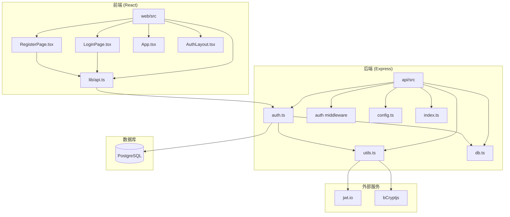
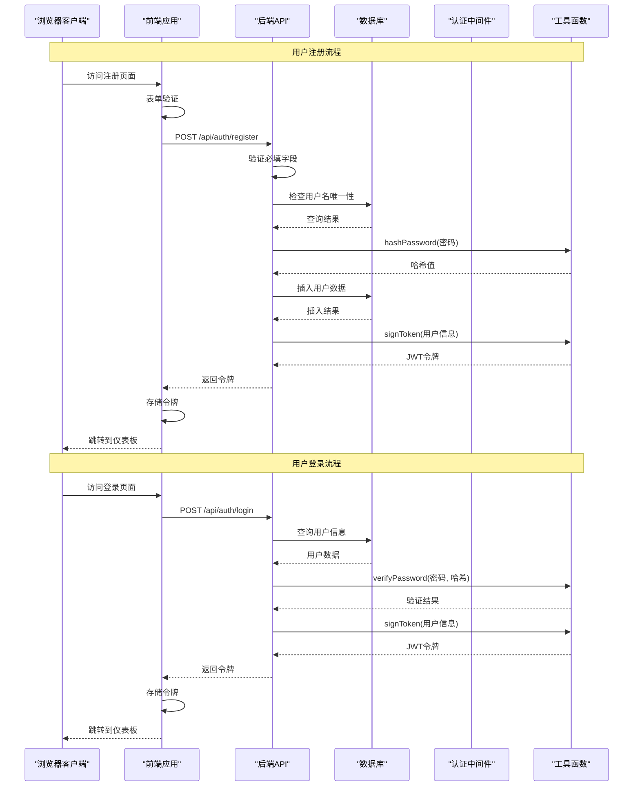
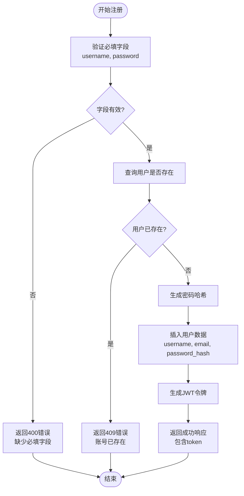
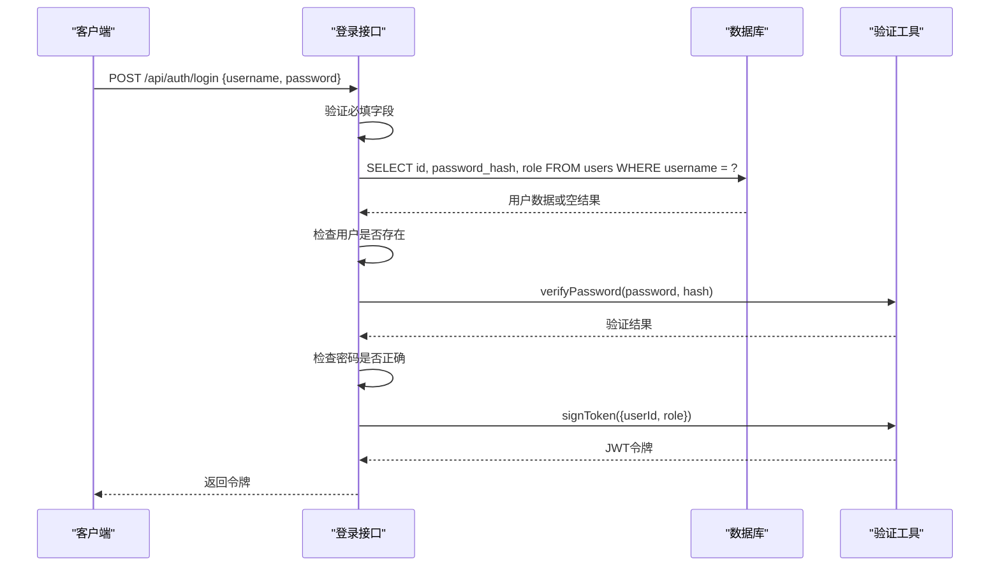
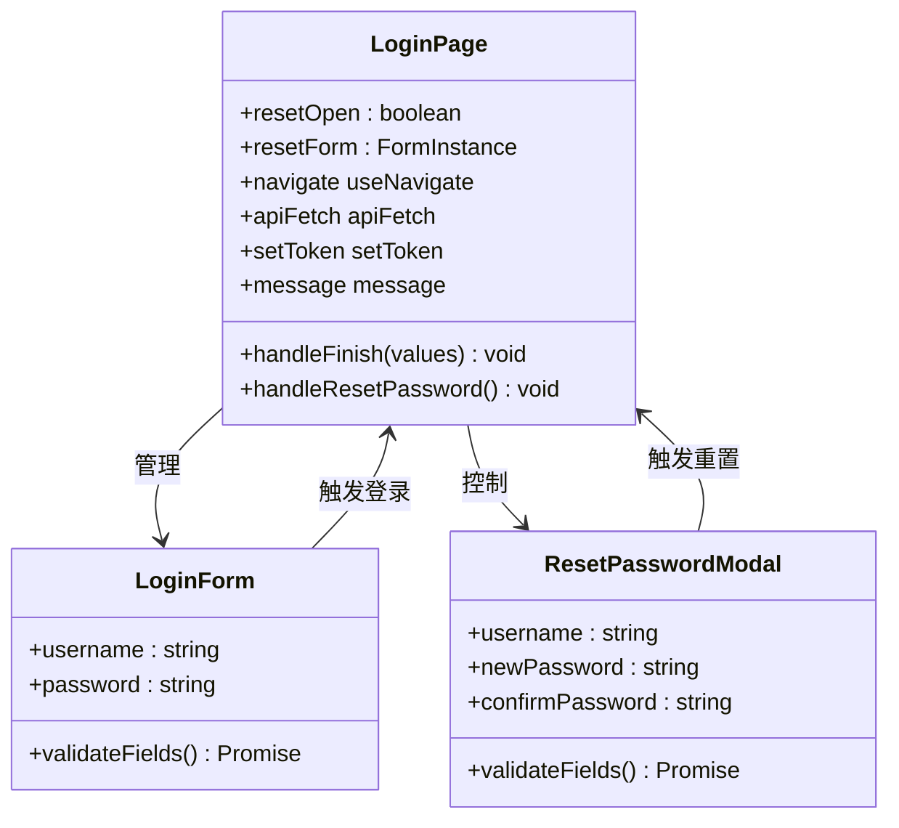
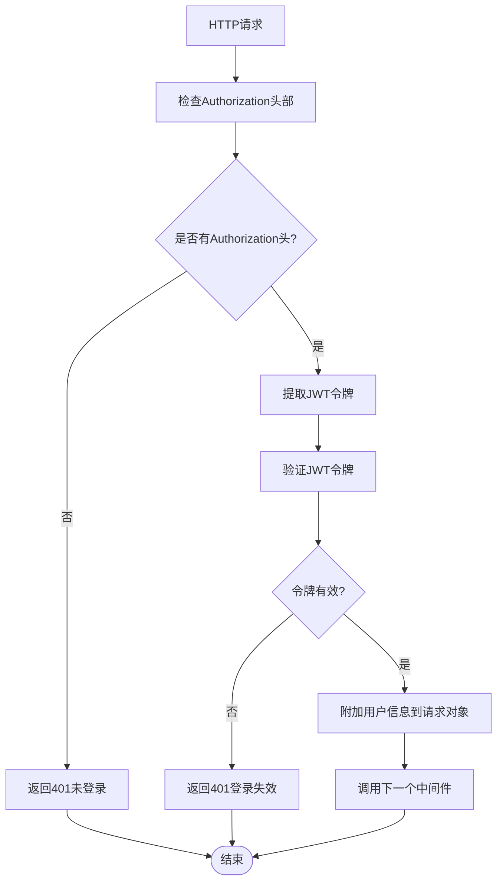
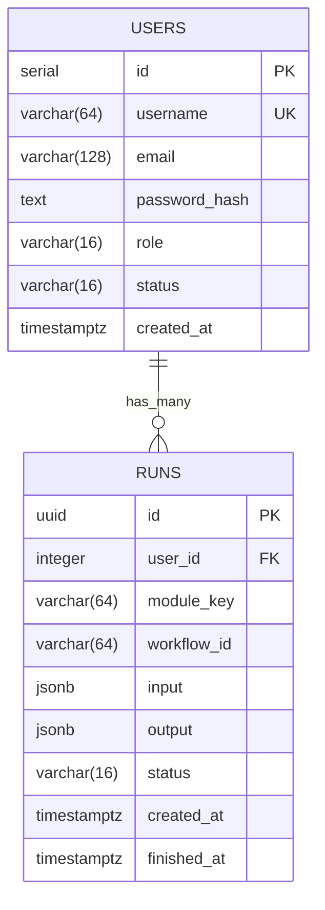
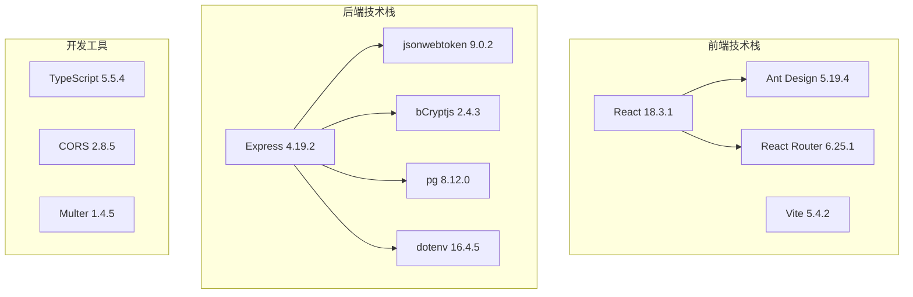

# 用户注册与登录

<cite>
**本文档引用的文件**
- [api/src/routes/auth.ts](file://api/src/routes/auth.ts)
- [api/src/middleware/auth.ts](file://api/src/middleware/auth.ts)
- [api/src/utils.ts](file://api/src/utils.ts)
- [api/src/db.ts](file://api/src/db.ts)
- [api/src/config.ts](file://api/src/config.ts)
- [api/src/index.ts](file://api/src/index.ts)
- [web/src/pages/LoginPage.tsx](file://web/src/pages/LoginPage.tsx)
- [web/src/pages/RegisterPage.tsx](file://web/src/pages/RegisterPage.tsx)
- [web/src/lib/api.ts](file://web/src/lib/api.ts)
- [web/src/App.tsx](file://web/src/App.tsx)
- [web/src/layouts/AuthLayout.tsx](file://web/src/layouts/AuthLayout.tsx)
- [web/package.json](file://web/package.json)
- [api/package.json](file://api/package.json)
</cite>

## 目录
1. [简介](#简介)
2. [项目结构](#项目结构)
3. [核心组件](#核心组件)
4. [架构概览](#架构概览)
5. [详细组件分析](#详细组件分析)
6. [依赖关系分析](#依赖关系分析)
7. [性能考虑](#性能考虑)
8. [故障排除指南](#故障排除指南)
9. [结论](#结论)

## 简介

本项目是一个基于 React 前端和 Express 后端的用户认证系统，提供了完整的用户注册与登录功能。系统采用 JWT（JSON Web Token）进行身份验证，使用 bcryptjs 进行密码哈希处理，并通过 PostgreSQL 数据库存储用户信息。

该系统实现了以下核心功能：
- 用户注册：用户名验证、邮箱检查、密码加密和数据库存储
- 用户登录：凭据验证、密码哈希比对和令牌发放
- 安全机制：JWT 令牌管理、密码哈希加密、中间件认证保护
- 前端集成：React 组件、表单验证、错误处理和状态管理

## 项目结构

整个项目采用前后端分离架构，主要分为两个部分：



**图表来源**
- [web/src/pages/LoginPage.tsx:1-136](file://web/src/pages/LoginPage.tsx#L1-L136)
- [web/src/pages/RegisterPage.tsx:1-87](file://web/src/pages/RegisterPage.tsx#L1-L87)
- [api/src/routes/auth.ts:1-115](file://api/src/routes/auth.ts#L1-L115)
- [api/src/db.ts:1-35](file://api/src/db.ts#L1-L35)

**章节来源**
- [web/src/pages/LoginPage.tsx:1-136](file://web/src/pages/LoginPage.tsx#L1-L136)
- [web/src/pages/RegisterPage.tsx:1-87](file://web/src/pages/RegisterPage.tsx#L1-L87)
- [api/src/routes/auth.ts:1-115](file://api/src/routes/auth.ts#L1-L115)

## 核心组件

### 后端认证路由组件

后端认证功能由专门的路由模块实现，包含三个主要接口：

1. **用户注册接口** (`/api/auth/register`)
   - 验证必填字段
   - 检查用户名唯一性
   - 密码哈希处理
   - 数据库存储
   - JWT 令牌生成

2. **用户登录接口** (`/api/auth/login`)
   - 凭据验证
   - 密码哈希比对
   - JWT 令牌发放

3. **用户信息查询接口** (`/api/auth/me`)
   - JWT 令牌验证
   - 用户信息获取

### 前端认证组件

前端提供了两个主要页面组件：

1. **登录页面** (`LoginPage.tsx`)
   - 表单验证
   - 登录请求处理
   - 错误消息显示
   - 密码重置功能

2. **注册页面** (`RegisterPage.tsx`)
   - 用户名、邮箱、密码验证
   - 密码确认检查
   - 注册请求处理

### 认证中间件

系统使用自定义认证中间件保护需要授权的路由：

- 检查 Authorization 头部
- 验证 JWT 令牌有效性
- 提取用户信息到请求对象

**章节来源**
- [api/src/routes/auth.ts:1-115](file://api/src/routes/auth.ts#L1-L115)
- [api/src/middleware/auth.ts:1-23](file://api/src/middleware/auth.ts#L1-L23)
- [web/src/pages/LoginPage.tsx:1-136](file://web/src/pages/LoginPage.tsx#L1-L136)
- [web/src/pages/RegisterPage.tsx:1-87](file://web/src/pages/RegisterPage.tsx#L1-L87)

## 架构概览

系统采用分层架构设计，确保关注点分离和可维护性：



**图表来源**
- [api/src/routes/auth.ts:8-34](file://api/src/routes/auth.ts#L8-L34)
- [api/src/routes/auth.ts:36-63](file://api/src/routes/auth.ts#L36-L63)
- [api/src/utils.ts:5-20](file://api/src/utils.ts#L5-L20)
- [web/src/pages/LoginPage.tsx:22-38](file://web/src/pages/LoginPage.tsx#L22-L38)
- [web/src/pages/RegisterPage.tsx:14-44](file://web/src/pages/RegisterPage.tsx#L14-L44)

**章节来源**
- [api/src/routes/auth.ts:1-115](file://api/src/routes/auth.ts#L1-L115)
- [api/src/utils.ts:1-21](file://api/src/utils.ts#L1-L21)
- [api/src/middleware/auth.ts:1-23](file://api/src/middleware/auth.ts#L1-L23)

## 详细组件分析

### 用户注册流程

#### 后端实现分析

注册流程的核心逻辑在 `/api/auth/register` 路由中实现：



**图表来源**
- [api/src/routes/auth.ts:8-34](file://api/src/routes/auth.ts#L8-L34)
- [api/src/utils.ts:5-8](file://api/src/utils.ts#L5-L8)

#### 前端实现分析

前端注册页面提供了完整的用户交互体验：

```mermaid
classDiagram
class RegisterPage {
+handleFinish(values) void
+navigate useNavigate
+apiFetch apiFetch
+setToken setToken
+message message
}
class FormValidation {
+username : string
+email : string
+password : string
+confirmPassword : string
+validateFields() boolean
}
class ApiResponse {
+success : boolean
+data : {token : string}
+message : string
}
RegisterPage --> FormValidation : 使用
RegisterPage --> ApiResponse : 处理
FormValidation --> RegisterPage : 返回验证结果
ApiResponse --> RegisterPage : 返回API响应
```

**图表来源**
- [web/src/pages/RegisterPage.tsx:1-87](file://web/src/pages/RegisterPage.tsx#L1-L87)

**章节来源**
- [api/src/routes/auth.ts:8-34](file://api/src/routes/auth.ts#L8-L34)
- [web/src/pages/RegisterPage.tsx:14-44](file://web/src/pages/RegisterPage.tsx#L14-L44)

### 用户登录流程

#### 后端实现分析

登录流程的核心逻辑在 `/api/auth/login` 路由中实现：



**图表来源**
- [api/src/routes/auth.ts:36-63](file://api/src/routes/auth.ts#L36-L63)
- [api/src/utils.ts:10-20](file://api/src/utils.ts#L10-L20)

#### 前端实现分析

登录页面提供了完整的登录体验：



**图表来源**
- [web/src/pages/LoginPage.tsx:1-136](file://web/src/pages/LoginPage.tsx#L1-L136)

**章节来源**
- [api/src/routes/auth.ts:36-63](file://api/src/routes/auth.ts#L36-L63)
- [web/src/pages/LoginPage.tsx:22-66](file://web/src/pages/LoginPage.tsx#L22-L66)

### 认证中间件

系统使用自定义中间件保护需要授权的路由：



**图表来源**
- [api/src/middleware/auth.ts:8-22](file://api/src/middleware/auth.ts#L8-L22)

**章节来源**
- [api/src/middleware/auth.ts:1-23](file://api/src/middleware/auth.ts#L1-L23)

### 数据库设计

系统使用 PostgreSQL 作为数据存储，核心用户表结构如下：



**图表来源**
- [api/src/db.ts:11-34](file://api/src/db.ts#L11-L34)

**章节来源**
- [api/src/db.ts:1-35](file://api/src/db.ts#L1-L35)

## 依赖关系分析

### 技术栈依赖

系统采用现代化的技术栈构建：



**图表来源**
- [web/package.json:11-24](file://web/package.json#L11-L24)
- [api/package.json:11-34](file://api/package.json#L11-L34)

### 环境配置

系统使用环境变量进行配置管理：

| 环境变量 | 类型 | 必需 | 描述 |
|---------|------|------|------|
| COZE_API_TOKEN | String | 是 | Coze API 访问令牌 |
| DATABASE_URL | String | 是 | PostgreSQL 数据库连接字符串 |
| JWT_SECRET | String | 是 | JWT 令牌签名密钥 |
| VOICE_BASE_URL | String | 是 | 语音服务基础URL |
| PORT | Number | 否 | 服务器端口号，默认3000 |

**章节来源**
- [api/src/config.ts:1-19](file://api/src/config.ts#L1-L19)
- [api/src/index.ts:1-29](file://api/src/index.ts#L1-L29)

## 性能考虑

### 密码哈希性能

系统使用 bcryptjs 进行密码哈希处理，配置了适当的成本因子以平衡安全性与性能：

- **盐生成成本**：10（默认值）
- **哈希计算时间**：约 100-200ms
- **内存使用**：相对较低

### JWT 令牌优化

- **过期时间**：7天
- **令牌大小**：较小，包含用户ID和角色信息
- **验证开销**：轻量级，仅需解码和验证签名

### 数据库查询优化

- **用户名索引**：唯一索引，支持快速查找
- **查询缓存**：PostgreSQL 自动缓存常用查询
- **连接池**：使用连接池管理数据库连接

## 故障排除指南

### 常见问题及解决方案

#### 1. 注册失败 - 账号已存在

**症状**：注册时返回 "账号已存在" 错误

**原因**：
- 用户名已被其他用户使用
- 数据库唯一约束冲突

**解决方案**：
- 提示用户选择其他用户名
- 在前端添加实时用户名检查

#### 2. 登录失败 - 凭据错误

**症状**：登录时返回 "账号或密码错误"

**原因**：
- 用户名不存在
- 密码不匹配
- 令牌过期

**解决方案**：
- 检查用户名和密码输入
- 清除本地存储的令牌
- 实施密码重置功能

#### 3. 401 未授权错误

**症状**：访问受保护路由时返回 401 错误

**原因**：
- 缺少 Authorization 头部
- 令牌无效或已过期
- 令牌格式不正确

**解决方案**：
- 确保在请求头中包含有效的 Bearer 令牌
- 实现自动重新登录机制
- 添加令牌刷新功能

#### 4. 前端路由跳转问题

**症状**：登录后无法正确跳转到目标页面

**原因**：
- 令牌存储问题
- 路由守卫逻辑错误
- 异步操作顺序问题

**解决方案**：
- 检查令牌存储和读取逻辑
- 确保路由守卫正确执行
- 实现错误边界处理

### 调试技巧

#### 后端调试

1. **启用详细日志**：
   ```bash
   DEBUG=express:* npm run dev
   ```

2. **检查数据库连接**：
   ```sql
   -- 测试数据库连接
   SELECT version();
   ```

3. **验证 JWT 令牌**：
   ```javascript
   // 使用 jwt.io 验证令牌
   // 检查令牌头部和载荷
   ```

#### 前端调试

1. **检查网络请求**：
   - 打开浏览器开发者工具
   - 查看 Network 标签页
   - 检查请求头和响应体

2. **验证令牌存储**：
   ```javascript
   // 检查本地存储中的令牌
   console.log(localStorage.getItem('token'));
   ```

3. **调试路由守卫**：
   ```javascript
   // 检查令牌状态
   const token = getToken();
   console.log('Token:', token);
   ```

**章节来源**
- [api/src/routes/auth.ts:15-24](file://api/src/routes/auth.ts#L15-L24)
- [api/src/routes/auth.ts:51-59](file://api/src/routes/auth.ts#L51-L59)
- [web/src/App.tsx:17-39](file://web/src/App.tsx#L17-L39)
- [web/src/lib/api.ts:25-28](file://web/src/lib/api.ts#L25-L28)

## 结论

本用户注册与登录系统提供了完整的企业级认证解决方案，具有以下特点：

### 安全性优势
- **密码保护**：使用 bcryptjs 进行不可逆密码哈希
- **令牌管理**：JWT 令牌提供无状态认证
- **中间件保护**：统一的认证中间件保护所有敏感路由
- **输入验证**：前后端双重验证确保数据完整性

### 开发效率
- **模块化设计**：清晰的前后端分离架构
- **类型安全**：TypeScript 提供编译时类型检查
- **组件复用**：可复用的认证组件和工具函数
- **错误处理**：完善的错误处理和用户反馈机制

### 可扩展性
- **数据库设计**：合理的表结构支持业务扩展
- **API 设计**：RESTful API 支持未来功能扩展
- **配置管理**：环境变量配置支持多环境部署
- **中间件架构**：易于添加新的认证策略和安全检查

### 用户体验
- **直观界面**：简洁明了的表单设计
- **即时反馈**：实时的表单验证和错误提示
- **流畅导航**：智能的路由管理和状态保持
- **错误恢复**：完善的错误处理和恢复机制

该系统为企业级应用提供了坚实的基础，可以根据具体需求进一步扩展功能，如添加验证码、双因素认证、用户角色管理等高级特性。