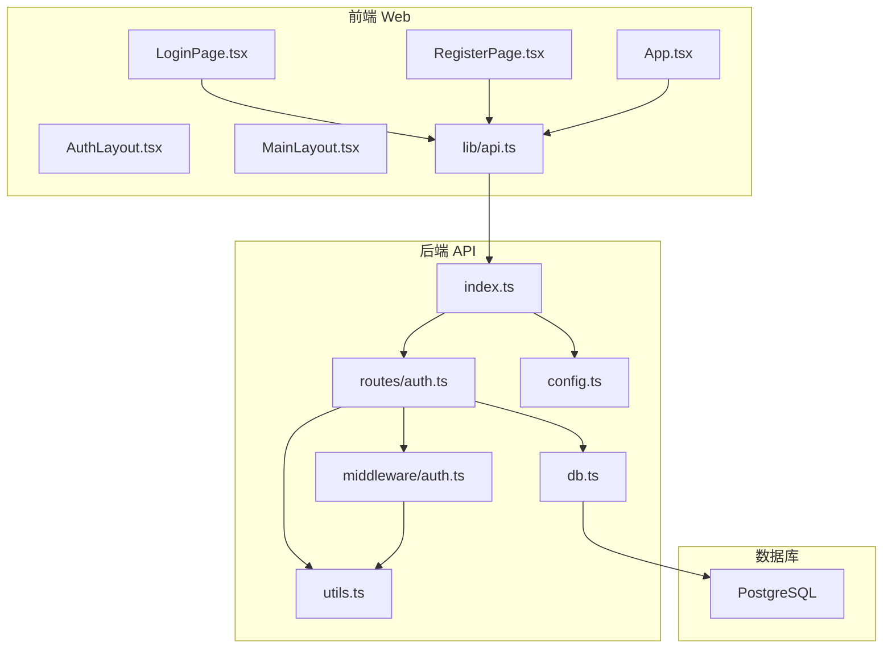
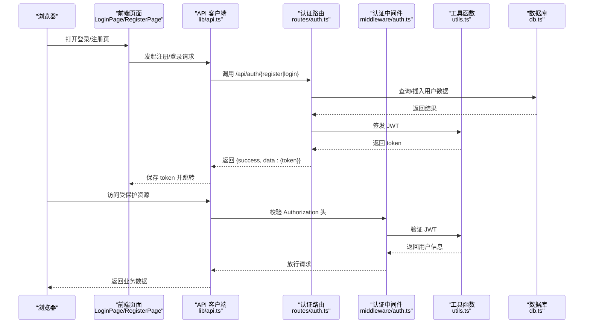
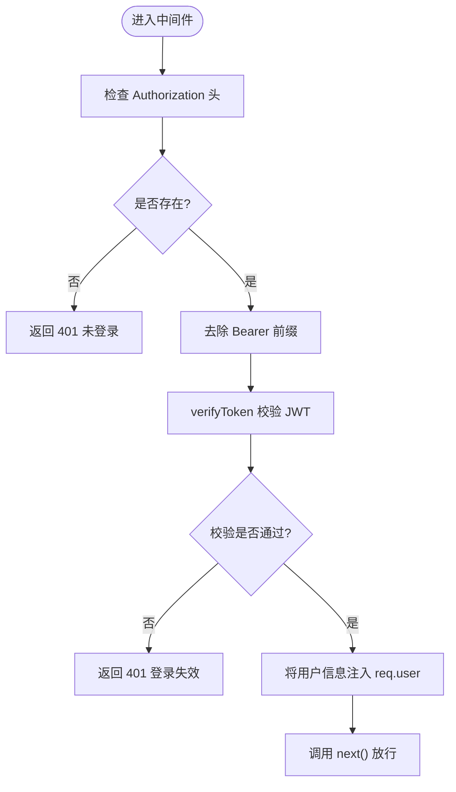
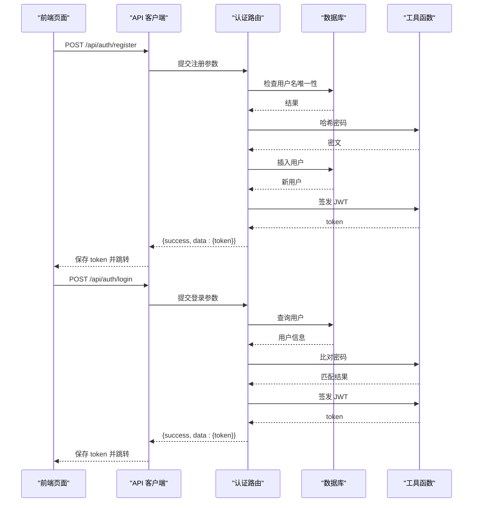
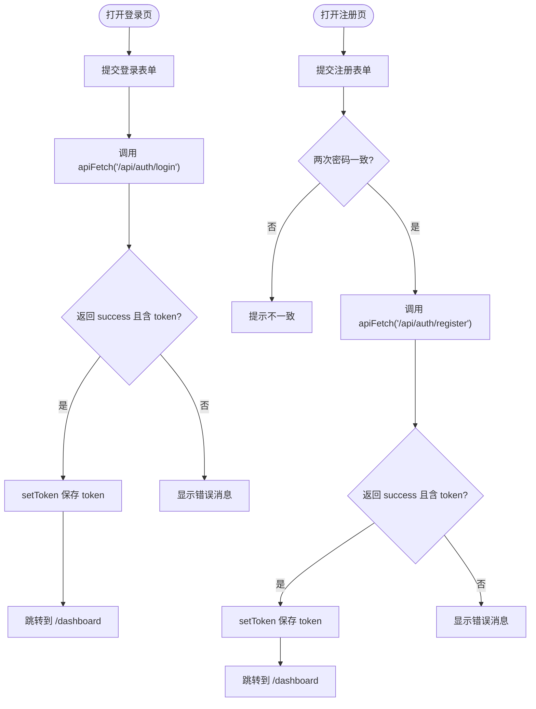
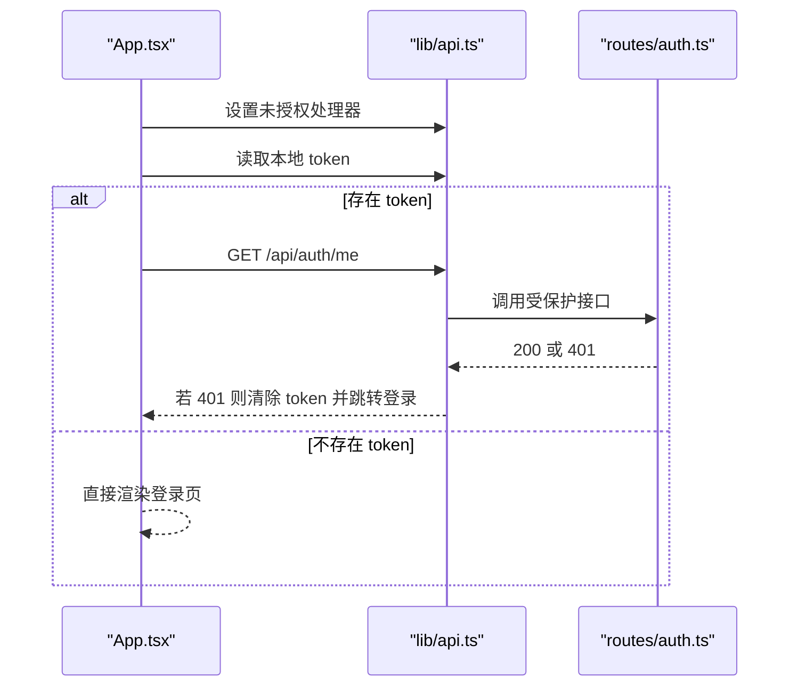
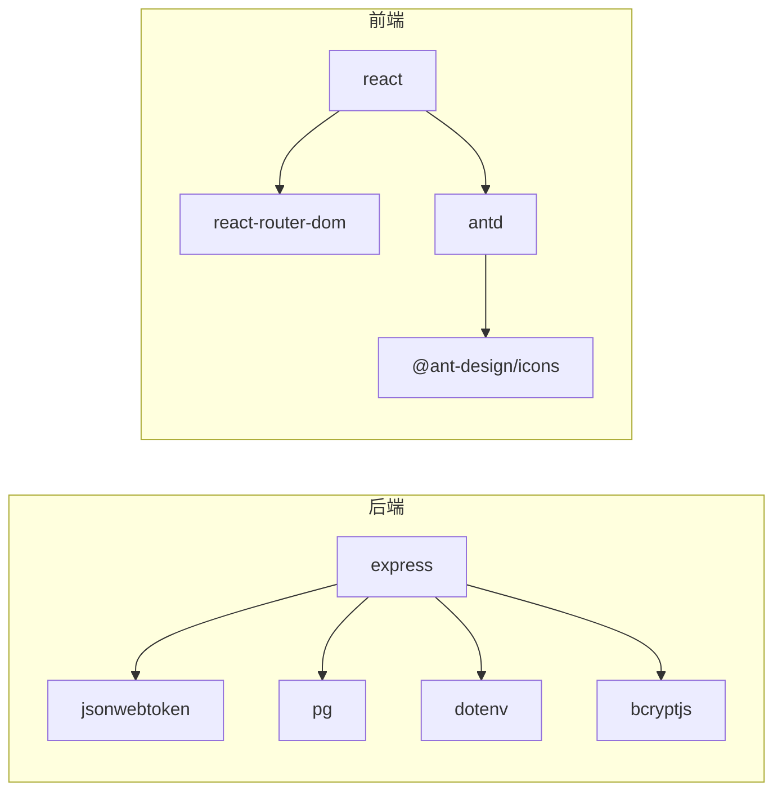
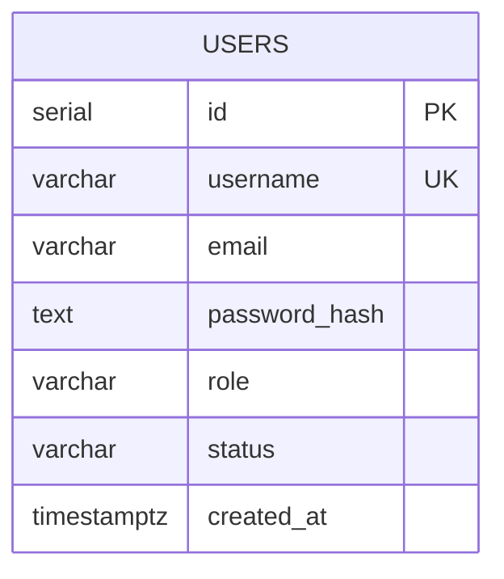
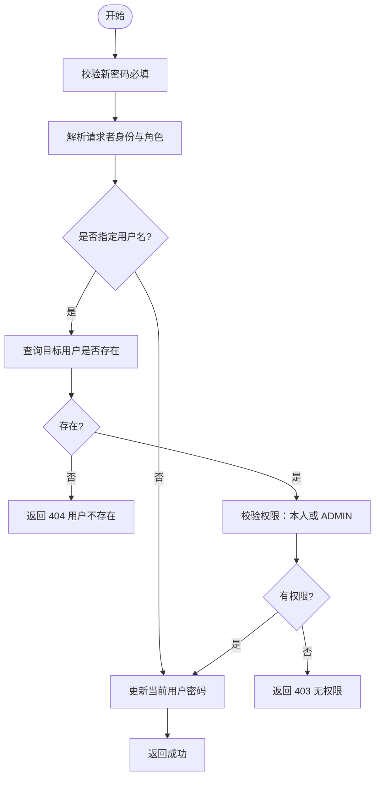

# 用户认证系统

<cite>
**本文引用的文件**
- [api/src/middleware/auth.ts](file://api/src/middleware/auth.ts)
- [api/src/routes/auth.ts](file://api/src/routes/auth.ts)
- [api/src/utils.ts](file://api/src/utils.ts)
- [api/src/config.ts](file://api/src/config.ts)
- [api/src/db.ts](file://api/src/db.ts)
- [api/src/index.ts](file://api/src/index.ts)
- [web/src/pages/LoginPage.tsx](file://web/src/pages/LoginPage.tsx)
- [web/src/pages/RegisterPage.tsx](file://web/src/pages/RegisterPage.tsx)
- [web/src/lib/api.ts](file://web/src/lib/api.ts)
- [web/src/App.tsx](file://web/src/App.tsx)
- [web/src/layouts/AuthLayout.tsx](file://web/src/layouts/AuthLayout.tsx)
- [web/src/layouts/MainLayout.tsx](file://web/src/layouts/MainLayout.tsx)
- [api/package.json](file://api/package.json)
- [web/package.json](file://web/package.json)
- [docker-compose.yml](file://docker-compose.yml)
</cite>

## 目录
1. [简介](#简介)
2. [项目结构](#项目结构)
3. [核心组件](#核心组件)
4. [架构总览](#架构总览)
5. [详细组件分析](#详细组件分析)
6. [依赖关系分析](#依赖关系分析)
7. [性能与安全考量](#性能与安全考量)
8. [故障排查指南](#故障排查指南)
9. [结论](#结论)
10. [附录](#附录)

## 简介
本文件为用户认证系统的完整技术文档，覆盖 JWT 认证机制、实现细节与安全考虑；详述用户注册、登录、密码重置与权限管理流程；记录认证中间件、令牌生成与验证机制；包含前端登录页与注册页的实现细节与用户体验设计；提供可操作的配置项、参数说明与集成模式；并给出常见问题与解决方案。

## 项目结构
该系统采用前后端分离架构：前端 Web 应用基于 React + Ant Design，通过统一的 API 客户端封装请求与鉴权；后端 API 基于 Express，使用 PostgreSQL 存储用户信息，采用 JSON Web Token 进行状态无感认证。

图表来源
- [api/src/index.ts:1-29](file://api/src/index.ts#L1-L29)
- [api/src/routes/auth.ts:1-115](file://api/src/routes/auth.ts#L1-L115)
- [api/src/middleware/auth.ts:1-23](file://api/src/middleware/auth.ts#L1-L23)
- [api/src/utils.ts:1-21](file://api/src/utils.ts#L1-L21)
- [api/src/db.ts:1-35](file://api/src/db.ts#L1-L35)
- [web/src/lib/api.ts:1-160](file://web/src/lib/api.ts#L1-L160)
- [web/src/pages/LoginPage.tsx:1-136](file://web/src/pages/LoginPage.tsx#L1-L136)
- [web/src/pages/RegisterPage.tsx:1-87](file://web/src/pages/RegisterPage.tsx#L1-L87)

章节来源
- [api/src/index.ts:1-29](file://api/src/index.ts#L1-L29)
- [web/src/App.tsx:1-70](file://web/src/App.tsx#L1-L70)

## 核心组件
- 后端认证路由：处理注册、登录、密码重置、查询当前用户等接口。
- 认证中间件：校验请求头中的 Bearer 令牌，解析用户身份。
- 工具函数：密码哈希与比对、JWT 签发与校验。
- 配置模块：读取环境变量并进行必需项校验。
- 数据库初始化：自动建表 users、runs。
- 前端 API 客户端：统一封装 fetch 请求、携带 Authorization 头、处理 401。
- 前端页面：登录页、注册页、布局组件与路由守卫。

章节来源
- [api/src/routes/auth.ts:1-115](file://api/src/routes/auth.ts#L1-L115)
- [api/src/middleware/auth.ts:1-23](file://api/src/middleware/auth.ts#L1-L23)
- [api/src/utils.ts:1-21](file://api/src/utils.ts#L1-L21)
- [api/src/config.ts:1-19](file://api/src/config.ts#L1-L19)
- [api/src/db.ts:1-35](file://api/src/db.ts#L1-L35)
- [web/src/lib/api.ts:1-160](file://web/src/lib/api.ts#L1-L160)
- [web/src/pages/LoginPage.tsx:1-136](file://web/src/pages/LoginPage.tsx#L1-L136)
- [web/src/pages/RegisterPage.tsx:1-87](file://web/src/pages/RegisterPage.tsx#L1-L87)

## 架构总览
下图展示从浏览器到后端 API 的典型认证流程，包括注册、登录与密码重置。

图表来源
- [web/src/pages/LoginPage.tsx:1-136](file://web/src/pages/LoginPage.tsx#L1-L136)
- [web/src/pages/RegisterPage.tsx:1-87](file://web/src/pages/RegisterPage.tsx#L1-L87)
- [web/src/lib/api.ts:1-160](file://web/src/lib/api.ts#L1-L160)
- [api/src/routes/auth.ts:1-115](file://api/src/routes/auth.ts#L1-L115)
- [api/src/middleware/auth.ts:1-23](file://api/src/middleware/auth.ts#L1-L23)
- [api/src/utils.ts:1-21](file://api/src/utils.ts#L1-L21)
- [api/src/db.ts:1-35](file://api/src/db.ts#L1-L35)

## 详细组件分析

### 认证中间件
- 功能：从 Authorization 头中提取 Bearer 令牌，调用工具函数验证 JWT，将用户信息注入请求对象，放行后续路由。
- 错误处理：未携带头返回 401“未登录”；令牌无效返回 401“登录失效”。

图表来源
- [api/src/middleware/auth.ts:8-22](file://api/src/middleware/auth.ts#L8-L22)
- [api/src/utils.ts:18-20](file://api/src/utils.ts#L18-L20)

章节来源
- [api/src/middleware/auth.ts:1-23](file://api/src/middleware/auth.ts#L1-L23)

### 认证路由（注册/登录/密码重置/查询当前用户）
- 注册
  - 参数：用户名、邮箱、密码
  - 流程：校验必填 → 检查用户名重复 → 哈希密码 → 插入用户 → 签发 JWT → 返回 token
  - 异常：缺少字段返回 400；用户名冲突返回 409
- 登录
  - 参数：用户名、密码
  - 流程：查询用户 → 比对密码 → 签发 JWT → 返回 token
  - 异常：缺少字段返回 400；凭据错误返回 401
- 密码重置（需登录）
  - 参数：用户名（可选）、新密码
  - 权限：若提供用户名且非本人，则需要 ADMIN 角色
  - 流程：校验新密码 → 解析请求者身份 → 可能的目标用户校验 → 更新密码哈希
  - 异常：缺少新密码返回 400；目标用户不存在返回 404；无权限返回 403
- 查询当前用户
  - 参数：无
  - 流程：从中间件注入的用户 ID 查询用户 → 返回用户信息

图表来源
- [api/src/routes/auth.ts:8-34](file://api/src/routes/auth.ts#L8-L34)
- [api/src/routes/auth.ts:36-63](file://api/src/routes/auth.ts#L36-L63)
- [api/src/utils.ts:5-12](file://api/src/utils.ts#L5-L12)
- [api/src/utils.ts:14-20](file://api/src/utils.ts#L14-L20)
- [api/src/db.ts:10-34](file://api/src/db.ts#L10-L34)

章节来源
- [api/src/routes/auth.ts:1-115](file://api/src/routes/auth.ts#L1-L115)

### 前端登录页与注册页
- 登录页
  - 表单字段：用户名、密码；支持“忘记密码”弹窗重置密码
  - 交互：提交后调用 API 客户端发起登录请求；成功则保存 token 并跳转至仪表盘
  - 错误提示：使用消息组件反馈失败原因
- 注册页
  - 表单字段：用户名、邮箱、密码、确认密码
  - 交互：两次密码不一致时阻止提交；成功则保存 token 并跳转
- 布局组件
  - 认证布局：用于登录/注册页的卡片容器与标题
  - 主布局：侧边菜单、顶部导航与登出按钮

图表来源
- [web/src/pages/LoginPage.tsx:22-38](file://web/src/pages/LoginPage.tsx#L22-L38)
- [web/src/pages/LoginPage.tsx:40-66](file://web/src/pages/LoginPage.tsx#L40-L66)
- [web/src/pages/RegisterPage.tsx:14-44](file://web/src/pages/RegisterPage.tsx#L14-L44)
- [web/src/lib/api.ts:9-36](file://web/src/lib/api.ts#L9-L36)
- [web/src/layouts/AuthLayout.tsx:1-21](file://web/src/layouts/AuthLayout.tsx#L1-L21)
- [web/src/layouts/MainLayout.tsx:1-65](file://web/src/layouts/MainLayout.tsx#L1-L65)

章节来源
- [web/src/pages/LoginPage.tsx:1-136](file://web/src/pages/LoginPage.tsx#L1-L136)
- [web/src/pages/RegisterPage.tsx:1-87](file://web/src/pages/RegisterPage.tsx#L1-L87)
- [web/src/lib/api.ts:1-160](file://web/src/lib/api.ts#L1-L160)
- [web/src/layouts/AuthLayout.tsx:1-21](file://web/src/layouts/AuthLayout.tsx#L1-L21)
- [web/src/layouts/MainLayout.tsx:1-65](file://web/src/layouts/MainLayout.tsx#L1-L65)

### 路由守卫与全局 401 处理
- 路由守卫：在应用启动时设置未授权处理器；若本地存在 token，访问“查询当前用户”接口以验证有效性；失败则清空 token 并跳转登录
- 全局 401 处理：API 客户端在请求返回 401 时清除本地 token 并触发未授权回调

图表来源
- [web/src/App.tsx:17-39](file://web/src/App.tsx#L17-L39)
- [web/src/lib/api.ts:5-36](file://web/src/lib/api.ts#L5-L36)
- [api/src/routes/auth.ts:100-112](file://api/src/routes/auth.ts#L100-L112)

章节来源
- [web/src/App.tsx:1-70](file://web/src/App.tsx#L1-L70)
- [web/src/lib/api.ts:1-160](file://web/src/lib/api.ts#L1-L160)

## 依赖关系分析
- 后端依赖
  - express：Web 框架
  - jsonwebtoken：JWT 签发与校验
  - bcryptjs：密码哈希与比对
  - pg：PostgreSQL 连接池
  - dotenv：环境变量加载
- 前端依赖
  - react、react-router-dom：路由与页面
  - antd：UI 组件库
  - @ant-design/icons：图标

图表来源
- [api/package.json:11-34](file://api/package.json#L11-L34)
- [web/package.json:11-25](file://web/package.json#L11-L25)

章节来源
- [api/package.json:1-36](file://api/package.json#L1-L36)
- [web/package.json:1-26](file://web/package.json#L1-L26)

## 性能与安全考量
- 性能
  - 密码哈希使用固定盐轮数，平衡安全性与性能
  - JWT 有效期设置为 7 天，建议根据业务场景调整
  - 数据库连接使用连接池，减少连接开销
- 安全
  - 必填环境变量校验，防止缺失导致运行时异常
  - 使用 HTTPS 传输（建议在生产环境启用），避免令牌被窃听
  - 密码仅存储哈希值，不落明文
  - 中间件严格校验 Authorization 头与 JWT 有效性
  - 密码重置具备角色校验，防止越权操作
- 最佳实践
  - 建议引入刷新令牌机制，降低长期持有访问令牌的风险
  - 对高频接口增加速率限制
  - 使用强随机 JWT 密钥并定期轮换

[本节为通用指导，无需列出章节来源]

## 故障排查指南
- “缺少必填字段”
  - 现象：注册/登录/重置密码返回 400
  - 排查：确认请求体包含用户名、密码等必要字段
- “账号已存在”
  - 现象：注册返回 409
  - 排查：更换用户名或执行重置密码
- “账号或密码错误”
  - 现象：登录返回 401
  - 排查：确认用户名与密码正确；检查数据库中用户是否存在
- “登录失效”
  - 现象：访问受保护资源返回 401
  - 排查：前端会自动清除本地 token 并跳转登录；检查网络请求是否携带正确的 Authorization 头
- “无权限重置他人密码”
  - 现象：非管理员尝试重置他人密码返回 403
  - 排查：仅管理员可跨用户重置；或确保操作者为目标用户本人
- “用户不存在”
  - 现象：重置密码时目标用户不存在返回 404
  - 排查：确认用户名拼写正确
- “未登录”
  - 现象：中间件返回 401
  - 排查：确认前端已保存 token 并在请求头中携带 Bearer 令牌

章节来源
- [api/src/routes/auth.ts:15-24](file://api/src/routes/auth.ts#L15-L24)
- [api/src/routes/auth.ts:42-59](file://api/src/routes/auth.ts#L42-L59)
- [api/src/routes/auth.ts:71-92](file://api/src/routes/auth.ts#L71-L92)
- [api/src/middleware/auth.ts:10-21](file://api/src/middleware/auth.ts#L10-L21)
- [web/src/lib/api.ts:25-28](file://web/src/lib/api.ts#L25-L28)

## 结论
本认证系统以 JWT 为核心，结合后端中间件与前端路由守卫，实现了完整的用户生命周期管理与权限控制。通过统一的 API 客户端封装，简化了请求与鉴权逻辑；数据库层保证了用户数据的完整性与一致性。建议在生产环境中进一步强化安全策略与可观测性，持续优化用户体验与系统稳定性。

[本节为总结性内容，无需列出章节来源]

## 附录

### 环境变量与配置
- 必填项
  - COZE_API_TOKEN：第三方服务令牌
  - DATABASE_URL：PostgreSQL 连接字符串
  - JWT_SECRET：JWT 签发密钥
  - VOICE_BASE_URL：语音相关基础地址
- 其他
  - PORT：API 服务监听端口，默认 3000

章节来源
- [api/src/config.ts:5-19](file://api/src/config.ts#L5-L19)
- [docker-compose.yml:16-20](file://docker-compose.yml#L16-L20)

### 数据模型（users 表）

图表来源
- [api/src/db.ts:12-20](file://api/src/db.ts#L12-L20)

### 关键流程图：密码重置（含越权校验）

图表来源
- [api/src/routes/auth.ts:65-98](file://api/src/routes/auth.ts#L65-L98)