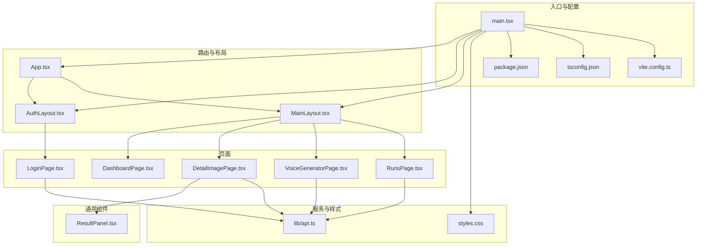
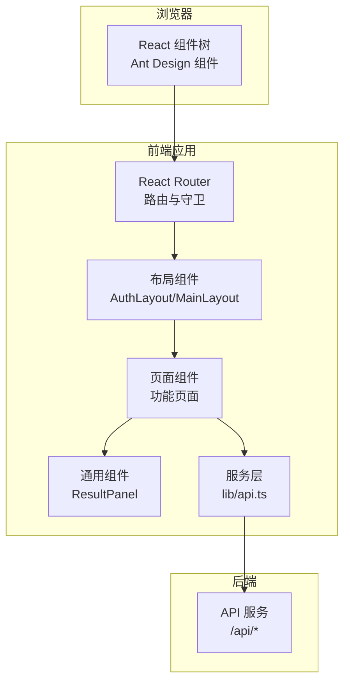
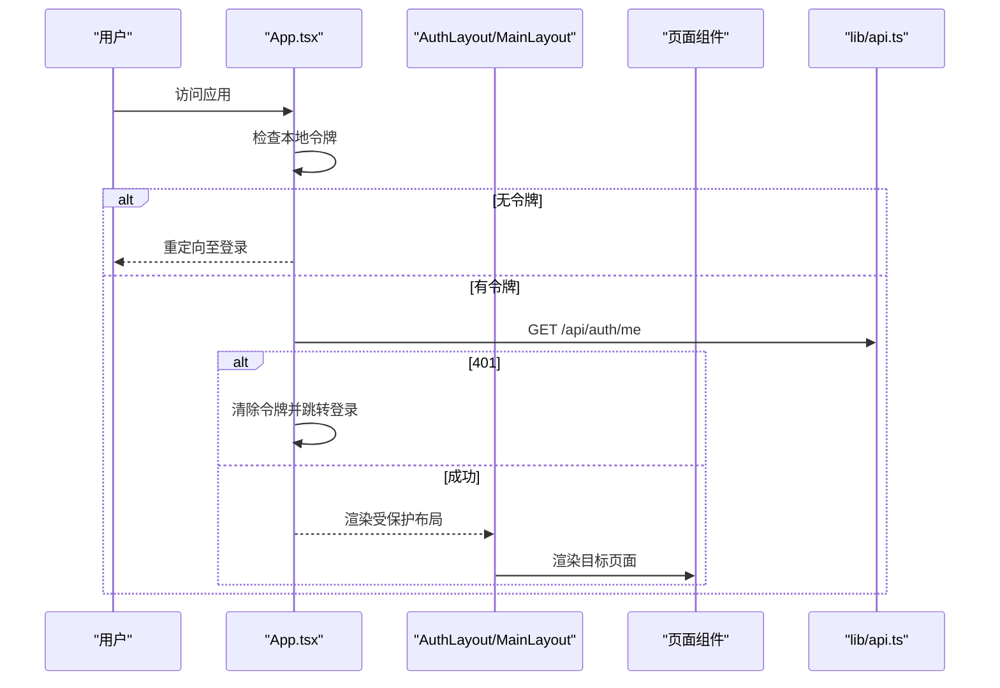
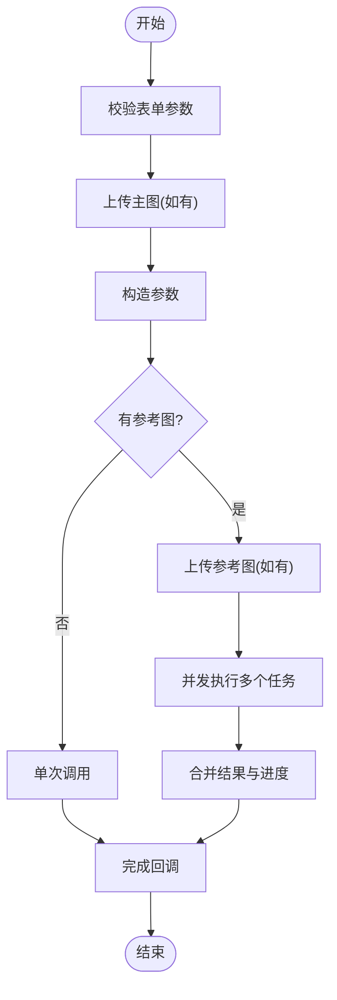
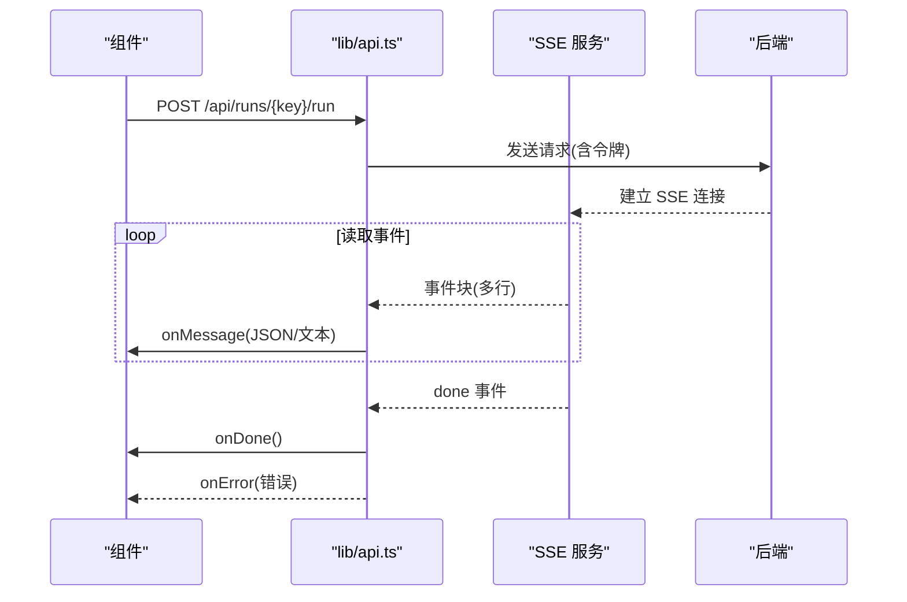
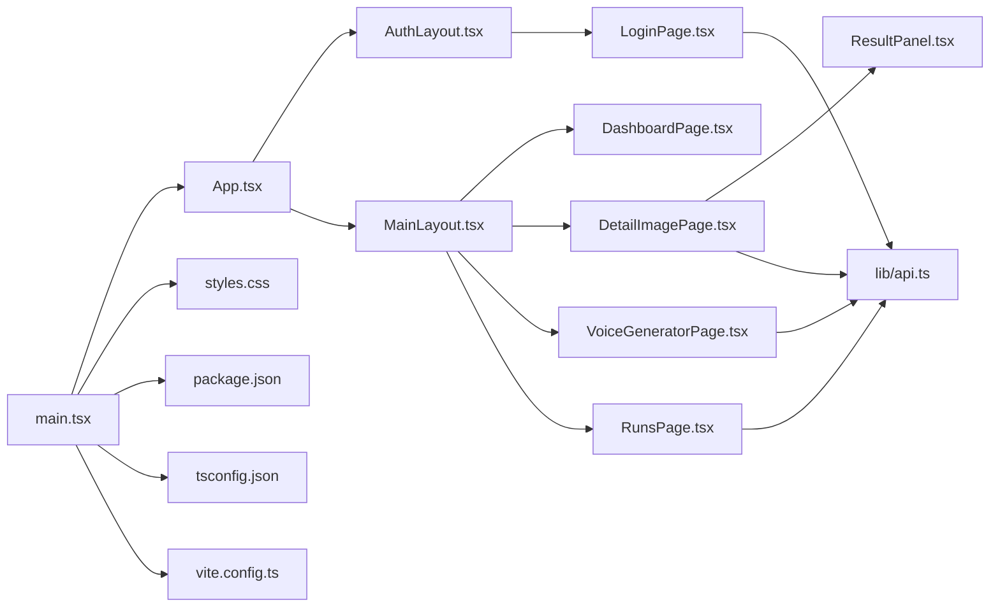

# 前端架构

<cite>
**本文引用的文件**
- [main.tsx](file://web/src/main.tsx)
- [App.tsx](file://web/src/App.tsx)
- [AuthLayout.tsx](file://web/src/layouts/AuthLayout.tsx)
- [MainLayout.tsx](file://web/src/layouts/MainLayout.tsx)
- [LoginPage.tsx](file://web/src/pages/LoginPage.tsx)
- [DashboardPage.tsx](file://web/src/pages/DashboardPage.tsx)
- [DetailImagePage.tsx](file://web/src/pages/DetailImagePage.tsx)
- [VoiceGeneratorPage.tsx](file://web/src/pages/VoiceGeneratorPage.tsx)
- [RunsPage.tsx](file://web/src/pages/RunsPage.tsx)
- [ResultPanel.tsx](file://web/src/components/ResultPanel.tsx)
- [api.ts](file://web/src/lib/api.ts)
- [styles.css](file://web/src/styles.css)
- [vite.config.ts](file://web/vite.config.ts)
- [package.json](file://web/package.json)
- [tsconfig.json](file://web/tsconfig.json)
- [docker-compose.yml](file://docker-compose.yml)
</cite>

## 目录
1. [简介](#简介)
2. [项目结构](#项目结构)
3. [核心组件](#核心组件)
4. [架构总览](#架构总览)
5. [详细组件分析](#详细组件分析)
6. [依赖关系分析](#依赖关系分析)
7. [性能考虑](#性能考虑)
8. [故障排查指南](#故障排查指南)
9. [结论](#结论)
10. [附录](#附录)

## 简介
本文件面向 Coze Workflow 的前端应用，系统性阐述基于 React + TypeScript 的前端架构设计，涵盖组件层次结构、路由设计、状态管理模式、Ant Design 使用策略与主题配置、Vite 构建工具配置与优化策略、前后端 API 交互模式与错误处理、加载状态管理、组件通信模式、代码分割策略与性能优化方案。文档同时提供多类可视化图示，帮助不同技术背景的读者快速理解系统。

## 项目结构
前端采用以页面为中心的组织方式，结合布局组件与通用组件，形成清晰的分层结构：
- 入口与全局配置：main.tsx 负责应用挂载、路由容器与主题配置；App.tsx 定义路由与鉴权守卫。
- 布局层：AuthLayout.tsx 与 MainLayout.tsx 提供认证页与主内容区的统一布局。
- 页面层：各功能页面（如 DashboardPage、DetailImagePage、VoiceGeneratorPage、RunsPage 等）封装业务逻辑与 UI。
- 通用组件：ResultPanel.tsx 提供可复用的结果面板。
- 服务层：lib/api.ts 封装 API 请求、认证令牌管理与 SSE 流式处理。
- 样式与构建：styles.css 提供基础样式与布局；vite.config.ts 配置开发与构建行为；package.json 与 tsconfig.json 管理依赖与编译选项。

图表来源
- [main.tsx:1-17](file://web/src/main.tsx#L1-L17)
- [App.tsx:1-70](file://web/src/App.tsx#L1-L70)
- [AuthLayout.tsx:1-21](file://web/src/layouts/AuthLayout.tsx#L1-L21)
- [MainLayout.tsx:1-65](file://web/src/layouts/MainLayout.tsx#L1-L65)
- [DashboardPage.tsx:1-108](file://web/src/pages/DashboardPage.tsx#L1-L108)
- [DetailImagePage.tsx:1-346](file://web/src/pages/DetailImagePage.tsx#L1-L346)
- [VoiceGeneratorPage.tsx:1-95](file://web/src/pages/VoiceGeneratorPage.tsx#L1-L95)
- [RunsPage.tsx:1-179](file://web/src/pages/RunsPage.tsx#L1-L179)
- [ResultPanel.tsx:1-46](file://web/src/components/ResultPanel.tsx#L1-L46)
- [api.ts:1-160](file://web/src/lib/api.ts#L1-L160)
- [styles.css:1-83](file://web/src/styles.css#L1-L83)
- [vite.config.ts:1-10](file://web/vite.config.ts#L1-L10)
- [package.json:1-26](file://web/package.json#L1-L26)
- [tsconfig.json:1-21](file://web/tsconfig.json#L1-L21)

章节来源
- [main.tsx:1-17](file://web/src/main.tsx#L1-L17)
- [App.tsx:1-70](file://web/src/App.tsx#L1-L70)
- [package.json:1-26](file://web/package.json#L1-L26)
- [tsconfig.json:1-21](file://web/tsconfig.json#L1-L21)

## 核心组件
- 应用入口与主题配置：在入口文件中通过 ConfigProvider 注入 Ant Design 主题令牌，设置全局主色调，确保 UI 风格一致性。
- 路由与鉴权：App.tsx 中定义受保护路由与匿名路由，RequireAuth 守卫检查本地令牌并在过期时跳转登录。
- 布局组件：AuthLayout.tsx 用于登录/注册等认证页；MainLayout.tsx 提供侧边菜单、头部用户信息与内容区域 Outlet。
- 页面组件：各功能页面封装自身状态、表单校验、API 调用与结果展示。
- 通用组件：ResultPanel.tsx 提供标题、复制按钮、进度条、加载提示与错误提示等通用能力。
- 服务层：lib/api.ts 统一封装请求头注入、401 处理、令牌存储、文件上传、SSE 流式事件解析与常用业务接口。

章节来源
- [main.tsx:8-16](file://web/src/main.tsx#L8-L16)
- [App.tsx:17-68](file://web/src/App.tsx#L17-L68)
- [AuthLayout.tsx:1-21](file://web/src/layouts/AuthLayout.tsx#L1-L21)
- [MainLayout.tsx:1-65](file://web/src/layouts/MainLayout.tsx#L1-L65)
- [ResultPanel.tsx:1-46](file://web/src/components/ResultPanel.tsx#L1-L46)
- [api.ts:1-160](file://web/src/lib/api.ts#L1-L160)

## 架构总览
前端采用“入口配置 → 路由与布局 → 页面与通用组件 → 服务层”的分层架构。Ant Design 作为 UI 基础库，提供丰富的组件与统一的设计体系；React Router 实现页面级路由与权限控制；Vite 提供开发与构建支持；TypeScript 提升类型安全与可维护性。

图表来源
- [main.tsx:1-17](file://web/src/main.tsx#L1-L17)
- [App.tsx:1-70](file://web/src/App.tsx#L1-L70)
- [AuthLayout.tsx:1-21](file://web/src/layouts/AuthLayout.tsx#L1-L21)
- [MainLayout.tsx:1-65](file://web/src/layouts/MainLayout.tsx#L1-L65)
- [DetailImagePage.tsx:1-346](file://web/src/pages/DetailImagePage.tsx#L1-L346)
- [ResultPanel.tsx:1-46](file://web/src/components/ResultPanel.tsx#L1-L46)
- [api.ts:1-160](file://web/src/lib/api.ts#L1-L160)

## 详细组件分析

### 路由与鉴权流程
- 登录页与注册页在 AuthLayout 下开放访问；其余页面在 RequireAuth 包裹下，要求存在本地令牌。
- 应用启动时注册 401 处理器，清除本地令牌并跳转登录；同时尝试拉取当前用户信息进行会话校验。

图表来源
- [App.tsx:17-68](file://web/src/App.tsx#L17-L68)
- [api.ts:13-36](file://web/src/lib/api.ts#L13-L36)

章节来源
- [App.tsx:17-68](file://web/src/App.tsx#L17-L68)

### 详情图生成页面（DetailImagePage）
- 表单与状态：使用 Ant Design 表单与 Upload 组件收集参数；内部维护流式文本、JSON、图片链接、进度与错误状态。
- 文件上传：支持本地上传与 URL 两种输入，上传后转换为 workflow 参数。
- 并发与串行：有参考图分支支持并发多次调用，最终汇总结果；无参考图分支单次调用。
- 结果展示：通过 ResultPanel 展示流式输出、JSON、进度与错误信息，并提供复制能力。

图表来源
- [DetailImagePage.tsx:105-251](file://web/src/pages/DetailImagePage.tsx#L105-L251)
- [ResultPanel.tsx:1-46](file://web/src/components/ResultPanel.tsx#L1-L46)
- [api.ts:38-56](file://web/src/lib/api.ts#L38-L56)

章节来源
- [DetailImagePage.tsx:1-346](file://web/src/pages/DetailImagePage.tsx#L1-L346)
- [ResultPanel.tsx:1-46](file://web/src/components/ResultPanel.tsx#L1-L46)
- [api.ts:38-56](file://web/src/lib/api.ts#L38-L56)

### 语音生成页面（VoiceGeneratorPage）
- 初始化：首次加载从后端获取语音服务配置（studioUrl、apiUrl），并以 iframe 嵌入语音生成器。
- 加载与错误：使用卡片的 loading 状态与消息提示反馈加载与异常。

章节来源
- [VoiceGeneratorPage.tsx:1-95](file://web/src/pages/VoiceGeneratorPage.tsx#L1-L95)
- [api.ts:117-126](file://web/src/lib/api.ts#L117-L126)

### 任务列表页面（RunsPage）
- 数据模型：定义 RunItem 类型，包含任务 ID、模块键、状态、时间戳等字段。
- 自动刷新：组件挂载后定时轮询任务列表，保持界面实时更新。
- 结果解析：递归提取输出中的 URL，便于调试与定位问题。
- 详情弹窗：点击“查看”打开 Modal 展示输入、调试链接与输出。

章节来源
- [RunsPage.tsx:1-179](file://web/src/pages/RunsPage.tsx#L1-L179)

### 登录页面（LoginPage）
- 表单校验：使用 Ant Design Form 对用户名与密码进行必填校验。
- 登录流程：提交凭据后写入令牌，跳转首页；支持忘记密码弹窗并发起重置请求。
- 错误处理：统一使用消息提示反馈成功与失败信息。

章节来源
- [LoginPage.tsx:1-136](file://web/src/pages/LoginPage.tsx#L1-L136)
- [api.ts:13-36](file://web/src/lib/api.ts#L13-L36)

### 通用结果面板（ResultPanel）
- 能力：标题、复制文本/JSON、进度条、加载提示、错误提示与流式输出区域。
- 设计：简洁的容器与等宽字体输出，适合日志与调试场景。

章节来源
- [ResultPanel.tsx:1-46](file://web/src/components/ResultPanel.tsx#L1-L46)

### API 服务层（lib/api.ts）
- 令牌管理：提供 setToken/getToken/clearToken 与 Unauthorized 回调注册。
- 通用请求：apiFetch 自动注入 Content-Type 与 Bearer 令牌，处理 401 与非 OK 响应。
- 文件上传：uploadFile 支持 multipart/form-data 上传。
- 流式处理：runWorkflowStream 解析 SSE 事件，按行切分并分发消息、错误与完成事件。
- 业务接口：语音配置、翻译与 TTS 接口封装。

图表来源
- [api.ts:58-115](file://web/src/lib/api.ts#L58-L115)

章节来源
- [api.ts:1-160](file://web/src/lib/api.ts#L1-L160)

## 依赖关系分析
- 组件耦合：页面组件依赖通用组件与服务层；布局组件被路由包裹，承担导航与用户信息展示职责。
- 外部依赖：Ant Design 提供 UI 组件与图标；React Router 提供路由能力；Vite 提供开发与构建；TypeScript 提供类型保障。
- 运行时环境：Docker Compose 启动数据库、API 服务与前端服务，前端通过反向代理暴露 5173 端口。

图表来源
- [main.tsx:1-17](file://web/src/main.tsx#L1-L17)
- [App.tsx:1-70](file://web/src/App.tsx#L1-L70)
- [AuthLayout.tsx:1-21](file://web/src/layouts/AuthLayout.tsx#L1-L21)
- [MainLayout.tsx:1-65](file://web/src/layouts/MainLayout.tsx#L1-L65)
- [DashboardPage.tsx:1-108](file://web/src/pages/DashboardPage.tsx#L1-L108)
- [DetailImagePage.tsx:1-346](file://web/src/pages/DetailImagePage.tsx#L1-L346)
- [VoiceGeneratorPage.tsx:1-95](file://web/src/pages/VoiceGeneratorPage.tsx#L1-L95)
- [RunsPage.tsx:1-179](file://web/src/pages/RunsPage.tsx#L1-L179)
- [LoginPage.tsx:1-136](file://web/src/pages/LoginPage.tsx#L1-L136)
- [ResultPanel.tsx:1-46](file://web/src/components/ResultPanel.tsx#L1-L46)
- [api.ts:1-160](file://web/src/lib/api.ts#L1-L160)
- [styles.css:1-83](file://web/src/styles.css#L1-L83)
- [package.json:1-26](file://web/package.json#L1-L26)
- [tsconfig.json:1-21](file://web/tsconfig.json#L1-L21)
- [vite.config.ts:1-10](file://web/vite.config.ts#L1-L10)

章节来源
- [package.json:1-26](file://web/package.json#L1-L26)
- [docker-compose.yml:1-35](file://docker-compose.yml#L1-L35)

## 性能考虑
- 代码分割与懒加载：建议对大型页面组件采用动态导入（React.lazy + Suspense）实现按需加载，减少首屏体积。
- 图片与资源：详情图页面支持 URL 与上传两种输入，优先使用 URL 可减少上传与网络传输成本；上传前进行文件大小与格式校验。
- SSE 流式渲染：runWorkflowStream 逐行解析事件，避免一次性渲染大量数据；建议在 ResultPanel 中限制最大显示长度并提供滚动查看。
- 缓存策略：登录后令牌持久化于本地存储；可考虑引入轻量缓存减少重复请求（如语音配置）。
- 构建优化：Vite 默认启用按需编译与热更新；生产构建可通过 Rollup 插件链路进一步压缩与拆分代码。
- 依赖精简：移除未使用依赖，保持最小化安装，缩短安装与打包时间。

## 故障排查指南
- 登录失败：检查用户名/密码是否正确；查看消息提示与后端返回的错误信息；确认 API 基础地址与跨域配置。
- 401 未授权：确认本地令牌是否存在；观察应用启动时的会话校验是否触发自动跳转登录。
- 详情图生成异常：检查主图与参考图参数是否齐全；查看 ResultPanel 中的错误提示；确认后端工作流可用性。
- 任务列表不刷新：确认轮询定时器是否正常运行；检查后端 /api/runs 接口响应与网络连通性。
- 语音生成页面空白：确认语音服务配置已成功获取；检查 iframe 源地址与网络可达性。

章节来源
- [LoginPage.tsx:22-38](file://web/src/pages/LoginPage.tsx#L22-L38)
- [api.ts:25-36](file://web/src/lib/api.ts#L25-L36)
- [DetailImagePage.tsx:245-250](file://web/src/pages/DetailImagePage.tsx#L245-L250)
- [RunsPage.tsx:69-83](file://web/src/pages/RunsPage.tsx#L69-L83)
- [VoiceGeneratorPage.tsx:10-25](file://web/src/pages/VoiceGeneratorPage.tsx#L10-L25)

## 结论
该前端架构以 React + TypeScript 为基础，结合 Ant Design 与 Vite，实现了清晰的分层与职责分离。路由与鉴权守卫保证了安全性；服务层统一封装 API 与流式处理；页面组件围绕业务需求组织状态与交互。通过合理的性能优化与故障排查策略，可在保证开发效率的同时提升用户体验与稳定性。

## 附录

### Ant Design 使用策略与主题配置
- 使用 ConfigProvider 在入口注入主题令牌，统一主色调与其他设计变量。
- 布局组件使用 Layout/Sider/Header/Content 组合，配合 Menu 与图标实现导航。
- 表单与上传组件广泛用于参数收集与文件处理，结合消息提示与模态框提升交互体验。

章节来源
- [main.tsx:10-10](file://web/src/main.tsx#L10-L10)
- [MainLayout.tsx:1-65](file://web/src/layouts/MainLayout.tsx#L1-L65)
- [DetailImagePage.tsx:1-346](file://web/src/pages/DetailImagePage.tsx#L1-L346)

### Vite 构建工具配置与优化
- 基础配置：启用 @vitejs/plugin-react，开发服务器端口 5173。
- 生产构建：先执行 tsc 编译，再执行 vite build 产出静态资源。
- 优化建议：开启压缩、Tree Shaking 与模块联邦（按需），合理拆分第三方依赖与业务代码。

章节来源
- [vite.config.ts:1-10](file://web/vite.config.ts#L1-L10)
- [package.json:6-10](file://web/package.json#L6-L10)

### 前后端 API 交互模式与错误处理
- 交互模式：统一通过 apiFetch 发起请求，自动注入令牌与 JSON 头；SSE 通过 runWorkflowStream 解析事件流。
- 错误处理：401 清除令牌并触发未授权处理器；非 OK 响应抛出错误，由调用方捕获并提示。
- 加载状态：页面组件通过 useState 控制 loading、progress、errorText 等状态，配合 Ant Design 组件展示。

章节来源
- [api.ts:13-36](file://web/src/lib/api.ts#L13-L36)
- [DetailImagePage.tsx:105-251](file://web/src/pages/DetailImagePage.tsx#L105-L251)
- [RunsPage.tsx:57-83](file://web/src/pages/RunsPage.tsx#L57-L83)

### 组件通信模式
- 父子通信：页面组件通过 props 向 ResultPanel 传递标题、文本、JSON、进度与错误信息；ResultPanel 提供复制回调。
- 事件回调：SSE 通过 onMessage/onDone/onError 回调驱动页面状态更新。
- 导航与布局：MainLayout 通过 Outlet 渲染子页面；侧边菜单与头部信息通过路由与导航钩子联动。

章节来源
- [ResultPanel.tsx:1-46](file://web/src/components/ResultPanel.tsx#L1-L46)
- [DetailImagePage.tsx:330-340](file://web/src/pages/DetailImagePage.tsx#L330-L340)
- [MainLayout.tsx:57-59](file://web/src/layouts/MainLayout.tsx#L57-L59)