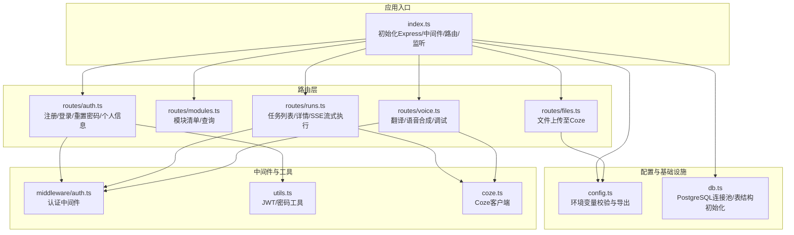
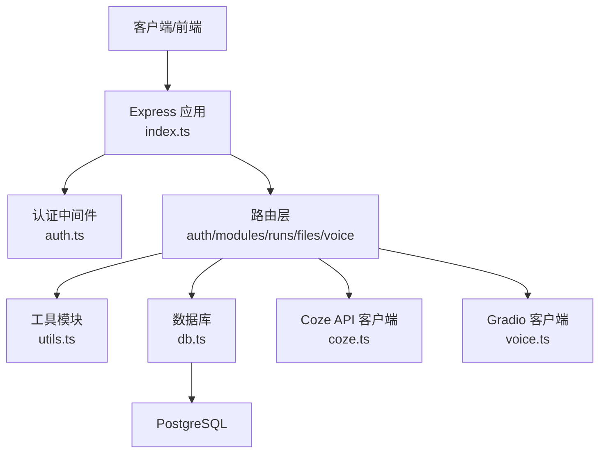
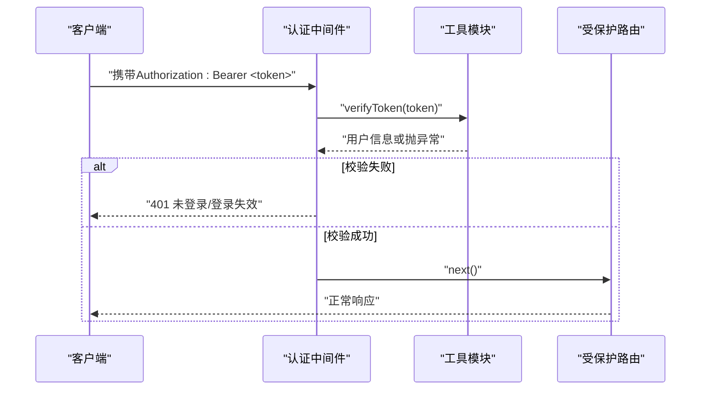
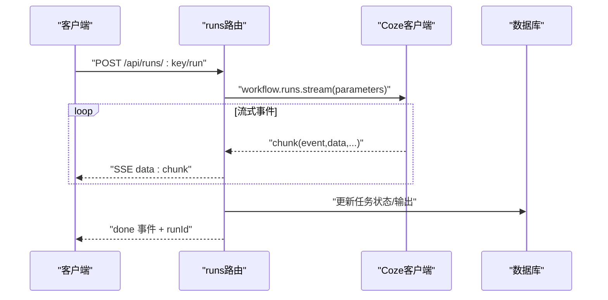
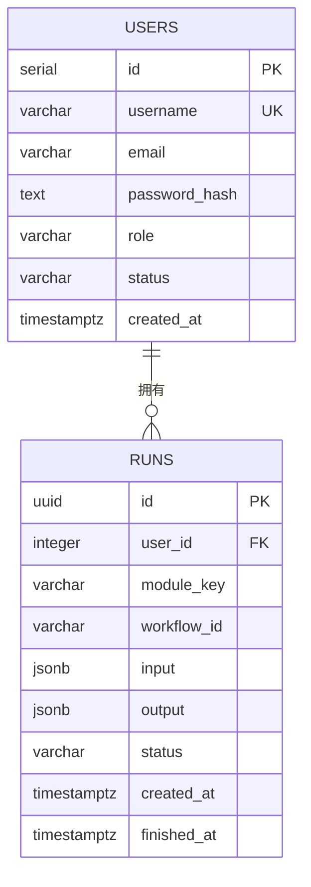
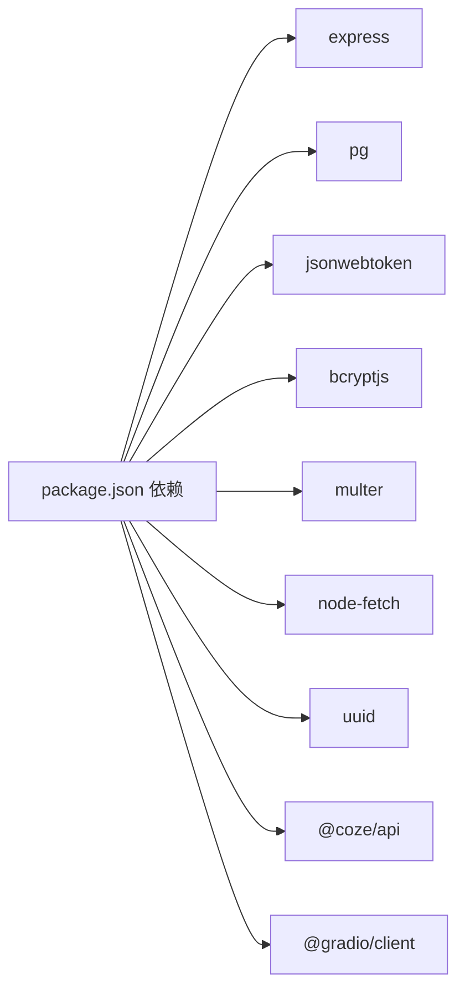

# 后端架构

<cite>
**本文引用的文件**
- [api/src/index.ts](file://api/src/index.ts)
- [api/src/config.ts](file://api/src/config.ts)
- [api/src/db.ts](file://api/src/db.ts)
- [api/src/middleware/auth.ts](file://api/src/middleware/auth.ts)
- [api/src/utils.ts](file://api/src/utils.ts)
- [api/src/coze.ts](file://api/src/coze.ts)
- [api/src/modules.ts](file://api/src/modules.ts)
- [api/src/routes/auth.ts](file://api/src/routes/auth.ts)
- [api/src/routes/modules.ts](file://api/src/routes/modules.ts)
- [api/src/routes/runs.ts](file://api/src/routes/runs.ts)
- [api/src/routes/files.ts](file://api/src/routes/files.ts)
- [api/src/routes/voice.ts](file://api/src/routes/voice.ts)
- [api/package.json](file://api/package.json)
- [docker-compose.yml](file://docker-compose.yml)
</cite>

## 目录
1. [简介](#简介)
2. [项目结构](#项目结构)
3. [核心组件](#核心组件)
4. [架构总览](#架构总览)
5. [详细组件分析](#详细组件分析)
6. [依赖关系分析](#依赖关系分析)
7. [性能考虑](#性能考虑)
8. [故障排查指南](#故障排查指南)
9. [结论](#结论)
10. [附录](#附录)

## 简介
本文件为 Coze Workflow 后端的架构文档，围绕基于 Express.js 的 RESTful API 设计展开，系统性说明路由分层、中间件模式、控制器职责、认证与 JWT 策略、与 Coze AI 服务的集成方式、错误处理与统一响应格式、API 版本化建议、速率限制与安全防护、以及性能监控与日志记录策略。文档同时给出关键流程的时序与类图，帮助开发者快速理解与扩展系统。

## 项目结构
后端采用“入口应用 + 配置 + 数据库 + 中间件 + 工具 + 路由 + 外部服务客户端”的分层组织：
- 应用入口负责初始化 Express、全局中间件、健康检查、路由挂载与启动监听
- 配置模块加载环境变量并进行必要校验
- 数据库模块使用连接池确保并发安全
- 中间件提供认证能力
- 工具模块封装密码哈希、JWT 签发与校验
- 路由模块按业务域划分：认证、模块清单、任务执行、文件上传、语音合成
- 外部服务客户端封装 Coze API 客户端与 Gradio 客户端

图表来源
- [api/src/index.ts:1-29](file://api/src/index.ts#L1-L29)
- [api/src/config.ts:1-19](file://api/src/config.ts#L1-L19)
- [api/src/db.ts:1-35](file://api/src/db.ts#L1-L35)
- [api/src/middleware/auth.ts:1-23](file://api/src/middleware/auth.ts#L1-L23)
- [api/src/utils.ts:1-21](file://api/src/utils.ts#L1-L21)
- [api/src/coze.ts:1-8](file://api/src/coze.ts#L1-L8)
- [api/src/routes/auth.ts:1-115](file://api/src/routes/auth.ts#L1-L115)
- [api/src/routes/modules.ts:1-20](file://api/src/routes/modules.ts#L1-L20)
- [api/src/routes/runs.ts:1-159](file://api/src/routes/runs.ts#L1-L159)
- [api/src/routes/files.ts:1-43](file://api/src/routes/files.ts#L1-L43)
- [api/src/routes/voice.ts:1-404](file://api/src/routes/voice.ts#L1-L404)

章节来源
- [api/src/index.ts:1-29](file://api/src/index.ts#L1-L29)
- [docker-compose.yml:1-35](file://docker-compose.yml#L1-L35)

## 核心组件
- 应用入口与路由挂载：在入口文件中初始化 Express、启用 CORS 与 JSON 解析、注册健康检查端点、挂载各业务路由前缀
- 配置与环境变量：集中读取并校验关键环境变量，如 Coze Token、数据库连接串、JWT Secret、语音服务基础地址等
- 数据库与表结构：通过连接池访问 PostgreSQL；启动时自动创建用户与任务表
- 认证中间件：从 Authorization 头解析 Bearer Token，调用工具模块校验 JWT，将用户信息注入请求对象
- 工具模块：提供密码加盐哈希、JWT 签发与校验
- 外部服务客户端：封装 Coze API 客户端与 Gradio 客户端，用于工作流执行与语音合成
- 路由层：按领域拆分，覆盖认证、模块、任务、文件、语音等

章节来源
- [api/src/index.ts:1-29](file://api/src/index.ts#L1-L29)
- [api/src/config.ts:1-19](file://api/src/config.ts#L1-L19)
- [api/src/db.ts:1-35](file://api/src/db.ts#L1-L35)
- [api/src/middleware/auth.ts:1-23](file://api/src/middleware/auth.ts#L1-L23)
- [api/src/utils.ts:1-21](file://api/src/utils.ts#L1-L21)
- [api/src/coze.ts:1-8](file://api/src/coze.ts#L1-L8)

## 架构总览
下图展示系统与外部服务的交互关系，以及数据在各层之间的流转。

图表来源
- [api/src/index.ts:1-29](file://api/src/index.ts#L1-L29)
- [api/src/middleware/auth.ts:1-23](file://api/src/middleware/auth.ts#L1-L23)
- [api/src/routes/auth.ts:1-115](file://api/src/routes/auth.ts#L1-L115)
- [api/src/routes/modules.ts:1-20](file://api/src/routes/modules.ts#L1-L20)
- [api/src/routes/runs.ts:1-159](file://api/src/routes/runs.ts#L1-L159)
- [api/src/routes/files.ts:1-43](file://api/src/routes/files.ts#L1-L43)
- [api/src/routes/voice.ts:1-404](file://api/src/routes/voice.ts#L1-L404)
- [api/src/utils.ts:1-21](file://api/src/utils.ts#L1-L21)
- [api/src/db.ts:1-35](file://api/src/db.ts#L1-L35)
- [api/src/coze.ts:1-8](file://api/src/coze.ts#L1-L8)

## 详细组件分析

### 认证中间件与 JWT 策略
- 请求头解析：从 Authorization 头提取 Bearer Token
- 校验失败：返回 401 并提示未登录或登录失效
- 成功校验：将用户信息注入请求对象，进入后续路由处理
- JWT 签发：使用固定密钥与 7 天过期时间签发令牌
- 密码处理：注册/登录时使用 bcrypt 进行加盐哈希与比对

图表来源
- [api/src/middleware/auth.ts:1-23](file://api/src/middleware/auth.ts#L1-L23)
- [api/src/utils.ts:14-20](file://api/src/utils.ts#L14-L20)

章节来源
- [api/src/middleware/auth.ts:1-23](file://api/src/middleware/auth.ts#L1-L23)
- [api/src/utils.ts:1-21](file://api/src/utils.ts#L1-L21)

### 路由与控制器设计
- 路由分层：按业务域拆分，每个路由文件独立导出路由器，入口统一挂载
- 控制器职责：在路由内完成参数校验、调用数据库与外部服务、组装统一响应
- 统一响应格式：所有接口返回包含 success 字段与 data/message 字段的对象
- 错误处理：显式判断状态码并返回对应错误信息

章节来源
- [api/src/routes/auth.ts:1-115](file://api/src/routes/auth.ts#L1-L115)
- [api/src/routes/modules.ts:1-20](file://api/src/routes/modules.ts#L1-L20)
- [api/src/routes/runs.ts:1-159](file://api/src/routes/runs.ts#L1-L159)
- [api/src/routes/files.ts:1-43](file://api/src/routes/files.ts#L1-L43)
- [api/src/routes/voice.ts:1-404](file://api/src/routes/voice.ts#L1-L404)

### 与 Coze AI 服务的集成
- Coze 客户端：封装 @coze/api，使用配置中的 Token 与基础地址
- 工作流执行：在任务路由中通过流式接口接收事件，支持 Done 事件与 Message 内容识别
- 文件上传：将本地上传的文件通过 form-data 发送到 Coze 文件上传接口
- 语音合成：通过 Gradio 客户端连接外部语音服务，执行一系列预测步骤生成音频

图表来源
- [api/src/routes/runs.ts:84-123](file://api/src/routes/runs.ts#L84-L123)
- [api/src/coze.ts:1-8](file://api/src/coze.ts#L1-L8)
- [api/src/db.ts:10-34](file://api/src/db.ts#L10-L34)

章节来源
- [api/src/coze.ts:1-8](file://api/src/coze.ts#L1-L8)
- [api/src/routes/runs.ts:1-159](file://api/src/routes/runs.ts#L1-L159)
- [api/src/routes/files.ts:1-43](file://api/src/routes/files.ts#L1-L43)
- [api/src/routes/voice.ts:1-404](file://api/src/routes/voice.ts#L1-L404)

### 模块与工作流管理
- 模块定义：集中维护可用模块及其对应的 Coze 工作流 ID
- 模块查询：支持列出全部模块与按 key 查询单个模块
- 任务执行：根据模块 key 获取工作流 ID，发起流式执行并将结果持久化

章节来源
- [api/src/modules.ts:1-29](file://api/src/modules.ts#L1-L29)
- [api/src/routes/modules.ts:1-20](file://api/src/routes/modules.ts#L1-L20)
- [api/src/routes/runs.ts:55-65](file://api/src/routes/runs.ts#L55-L65)

### 数据模型与持久化
- 用户表：存储用户名、邮箱、密码哈希、角色、状态与时间戳
- 任务表：存储任务 ID、所属用户、模块 key、工作流 ID、输入输出、状态与时间戳
- 初始化：应用启动时自动创建表结构

图表来源
- [api/src/db.ts:11-34](file://api/src/db.ts#L11-L34)

章节来源
- [api/src/db.ts:1-35](file://api/src/db.ts#L1-L35)

### 错误处理与统一响应
- 统一响应格式：success 字段标识成功与否；data 字段承载业务数据；message 字段承载错误信息
- 显式状态码：根据业务场景返回 400/401/403/404/409/500 等
- 流式任务错误策略：若已产生有效输出或 Done 事件，则标记为 SUCCESS 并附加 warning，否则标记 FAILED

章节来源
- [api/src/routes/auth.ts:15-33](file://api/src/routes/auth.ts#L15-L33)
- [api/src/routes/runs.ts:124-156](file://api/src/routes/runs.ts#L124-L156)
- [api/src/routes/voice.ts:326-341](file://api/src/routes/voice.ts#L326-L341)

### API 版本管理、速率限制与安全防护
- 版本管理建议：当前路由前缀为 /api/{domain}，可在此基础上引入版本号前缀（如 /api/v1/{domain}），以保证向后兼容
- 速率限制：当前未实现内置限流；建议在路由层或网关层引入限流策略（如基于 IP 或用户维度）
- 安全防护：已启用 CORS 与 JSON 解析；建议补充：
  - 输入参数校验（schema 校验）
  - 请求体大小限制
  - HTTPS 强制
  - CSRF 防护（如适用）
  - 日志审计与敏感信息脱敏

章节来源
- [api/src/index.ts:12-13](file://api/src/index.ts#L12-L13)
- [api/src/routes/auth.ts:15-17](file://api/src/routes/auth.ts#L15-L17)

## 依赖关系分析
- 运行时依赖：Express、CORS、PostgreSQL 驱动、JWT、Bcrypt、Multer、Node-fetch、UUID、Coze SDK、Gradio 客户端
- 开发依赖：TypeScript、类型声明与热重载工具
- 依赖耦合：路由层依赖中间件、工具模块与数据库；任务路由进一步依赖 Coze 客户端；语音路由依赖 Gradio 客户端

图表来源
- [api/package.json:11-23](file://api/package.json#L11-L23)

章节来源
- [api/package.json:1-36](file://api/package.json#L1-L36)

## 性能考虑
- 数据库连接：使用连接池提升并发性能，避免频繁创建连接
- 流式处理：任务执行采用 SSE 流式推送，减少一次性响应体积
- 缓存策略：可引入 Redis 缓存热点数据（如模块元数据、用户会话）
- 压缩与限流：启用 Gzip 压缩；在网关层实施速率限制
- 监控指标：埋点记录请求耗时、错误率、队列长度、外部服务延迟
- 日志策略：区分访问日志与业务日志；对敏感字段脱敏；按级别输出

## 故障排查指南
- 认证失败：检查 Authorization 头格式与 Token 是否过期；确认 JWT Secret 一致
- 数据库连接：核对 DATABASE_URL；确认容器网络与端口映射
- 外部服务异常：检查 COZE_API_TOKEN 与 Coze 基础地址；查看流式事件是否包含 Done 或有效内容
- 语音合成：确认 VOICE_BASE_URL 配置；Gradio 客户端连通性与临时文件权限

章节来源
- [api/src/middleware/auth.ts:8-22](file://api/src/middleware/auth.ts#L8-L22)
- [api/src/config.ts:5-11](file://api/src/config.ts#L5-L11)
- [api/src/routes/runs.ts:124-156](file://api/src/routes/runs.ts#L124-L156)
- [api/src/routes/voice.ts:63-86](file://api/src/routes/voice.ts#L63-L86)

## 结论
该后端以 Express 为基础，采用清晰的分层与路由拆分，结合 JWT 认证、数据库持久化与 Coze/Gradio 外部服务集成，形成了可扩展的工作流执行平台。建议在现有基础上引入版本化、限流与更完善的输入校验，持续完善监控与日志体系，以满足生产级稳定性与可观测性要求。

## 附录
- 启动与部署：使用 docker-compose 启动数据库、API 与前端服务，注意环境变量配置
- 健康检查：根路径 /health 返回健康状态
- 开发脚本：提供开发热重载与构建命令

章节来源
- [docker-compose.yml:1-35](file://docker-compose.yml#L1-L35)
- [api/src/index.ts:15-17](file://api/src/index.ts#L15-L17)
- [api/package.json:6-10](file://api/package.json#L6-L10)