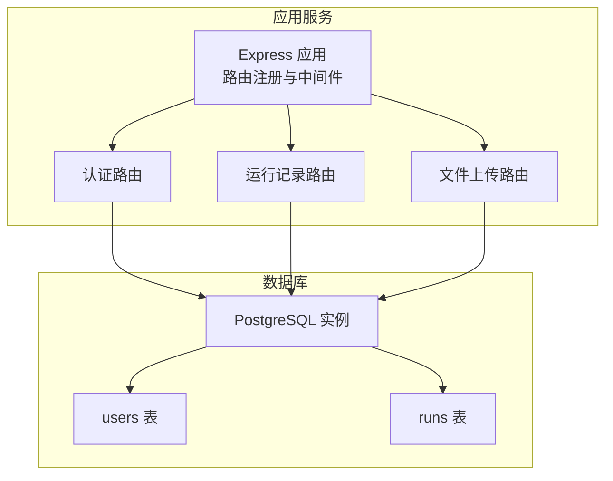
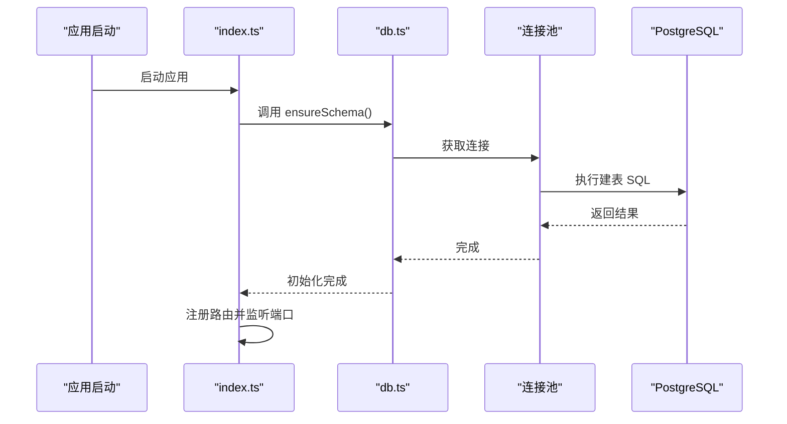
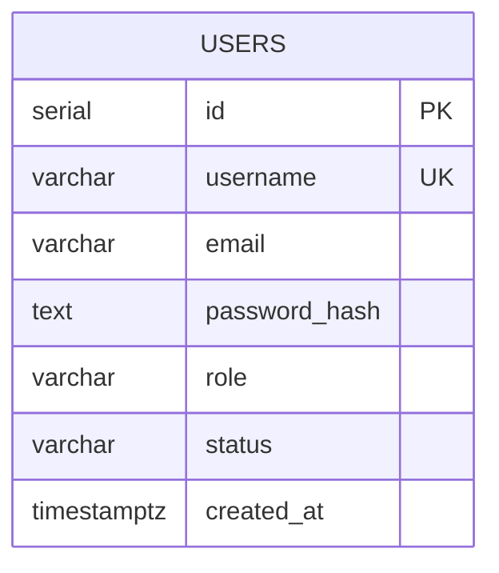
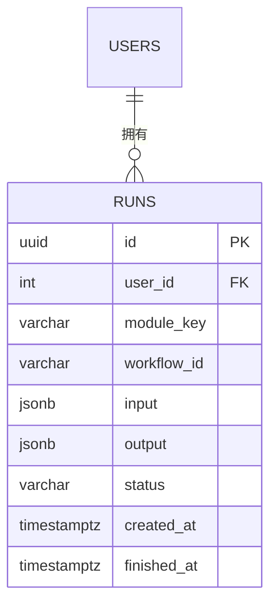
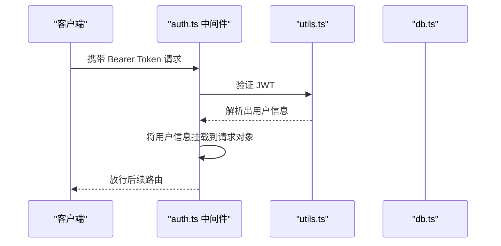
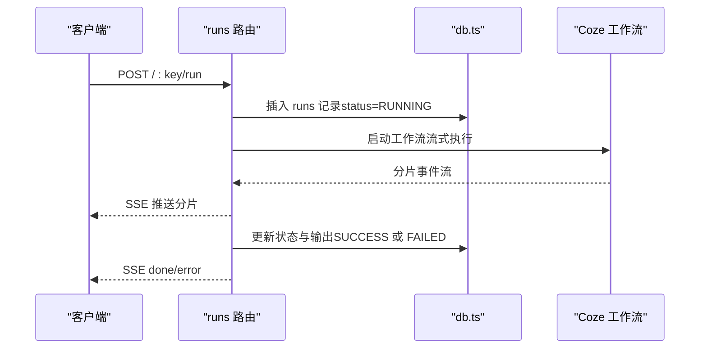
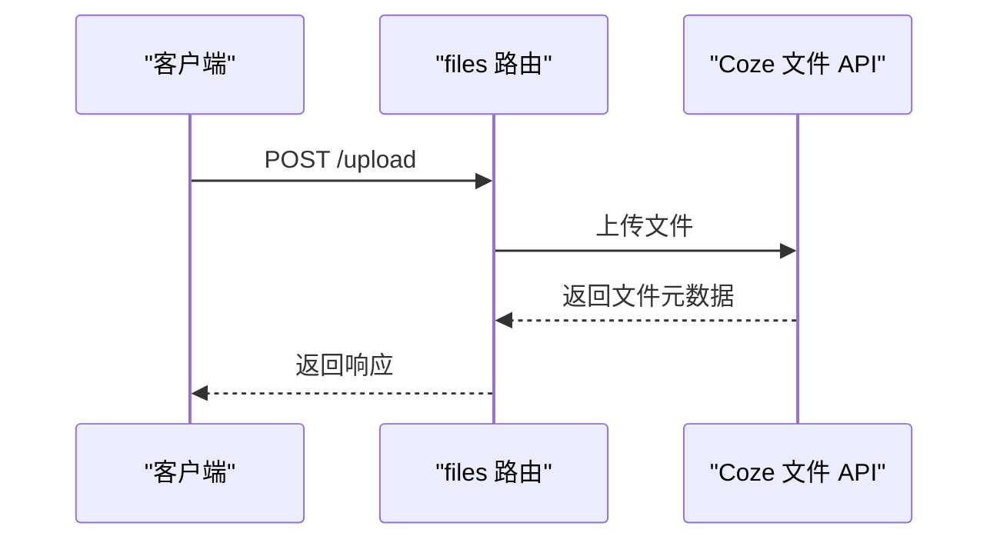
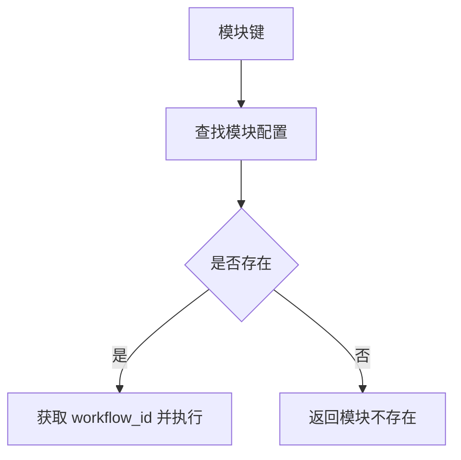
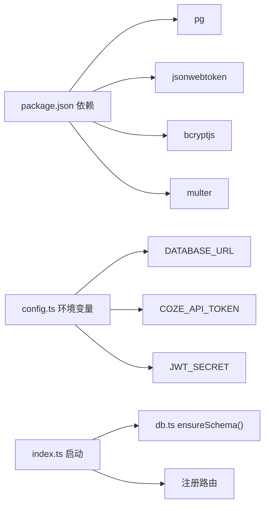
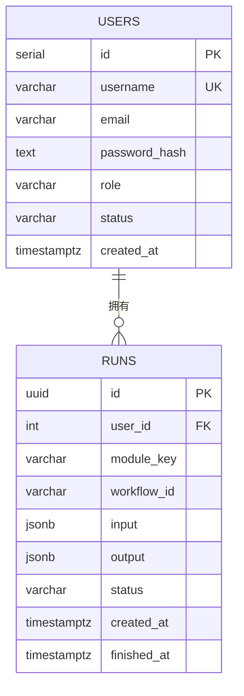

# 数据库设计

<cite>
**本文引用的文件**
- [api/src/db.ts](file://api/src/db.ts)
- [api/src/config.ts](file://api/src/config.ts)
- [api/src/index.ts](file://api/src/index.ts)
- [api/src/routes/auth.ts](file://api/src/routes/auth.ts)
- [api/src/routes/runs.ts](file://api/src/routes/runs.ts)
- [api/src/routes/files.ts](file://api/src/routes/files.ts)
- [api/src/middleware/auth.ts](file://api/src/middleware/auth.ts)
- [api/src/utils.ts](file://api/src/utils.ts)
- [api/src/modules.ts](file://api/src/modules.ts)
- [docker-compose.yml](file://docker-compose.yml)
- [api/package.json](file://api/package.json)
</cite>

## 目录
1. [简介](#简介)
2. [项目结构](#项目结构)
3. [核心组件](#核心组件)
4. [架构总览](#架构总览)
5. [详细组件分析](#详细组件分析)
6. [依赖分析](#依赖分析)
7. [性能考虑](#性能考虑)
8. [故障排查指南](#故障排查指南)
9. [结论](#结论)
10. [附录](#附录)

## 简介
本文件为 Coze Workflow 的数据库设计文档，聚焦于 PostgreSQL 数据库的表结构设计、字段定义与关系映射，解释用户表、运行记录表等核心数据模型的设计理念，并给出主键/外键约束、索引策略、查询优化方案、数据访问层设计模式与 ORM 使用策略、数据迁移管理、备份策略与性能监控方案，以及数据安全与隐私保护措施。本文所有技术结论均基于仓库中实际存在的源码文件进行归纳总结。

## 项目结构
后端采用 Express 应用，通过环境变量连接 PostgreSQL；数据库初始化在应用启动时执行，确保表结构存在。核心数据模型包括用户表与运行记录表，分别对应认证与工作流执行记录两大领域。

图表来源
- [api/src/index.ts:19-23](file://api/src/index.ts#L19-L23)
- [api/src/db.ts:10-34](file://api/src/db.ts#L10-L34)

章节来源
- [api/src/index.ts:19-29](file://api/src/index.ts#L19-L29)
- [api/src/db.ts:10-34](file://api/src/db.ts#L10-L34)
- [docker-compose.yml:1-35](file://docker-compose.yml#L1-L35)

## 核心组件
- 用户表 users：存储用户凭证、角色与状态，支持唯一用户名约束与默认值。
- 运行记录表 runs：存储工作流执行记录，包含输入/输出 JSONB、状态与时间戳，关联用户表。

章节来源
- [api/src/db.ts:12-32](file://api/src/db.ts#L12-L32)

## 架构总览
下图展示应用与数据库之间的交互路径，以及启动时的模式初始化流程。

图表来源
- [api/src/index.ts:25-29](file://api/src/index.ts#L25-L29)
- [api/src/db.ts:10-34](file://api/src/db.ts#L10-L34)

## 详细组件分析

### 用户表 users 设计
- 主键：自增整数 id
- 唯一约束：username
- 字段要点：
  - username：长度限制与唯一性保证用户标识唯一
  - email：可空，用于扩展信息
  - password_hash：存储密码哈希，避免明文保存
  - role：默认普通用户，可用于鉴权控制
  - status：默认激活状态，便于账户生命周期管理
  - created_at：默认当前时间，便于审计与排序

图表来源
- [api/src/db.ts:12-20](file://api/src/db.ts#L12-L20)

章节来源
- [api/src/db.ts:12-20](file://api/src/db.ts#L12-L20)

### 运行记录表 runs 设计
- 主键：UUID id
- 外键：user_id 引用 users.id
- 字段要点：
  - module_key：模块键，用于标识执行的工作流模块
  - workflow_id：对应具体工作流 ID
  - input/output：JSONB 存储请求参数与执行结果，便于灵活扩展
  - status：运行状态（如 RUNNING/SUCCESS/FAILED）
  - created_at/finished_at：时间戳，支持按时间排序与统计

图表来源
- [api/src/db.ts:22-32](file://api/src/db.ts#L22-L32)

章节来源
- [api/src/db.ts:22-32](file://api/src/db.ts#L22-L32)

### 认证与会话中间件
- 中间件从 Authorization 头解析 Bearer Token，验证后注入用户上下文到请求对象，供受保护路由使用。
- 密码处理采用 bcrypt 哈希，令牌签发使用 JWT，密钥来自环境变量。

图表来源
- [api/src/middleware/auth.ts:8-22](file://api/src/middleware/auth.ts#L8-L22)
- [api/src/utils.ts:14-20](file://api/src/utils.ts#L14-L20)

章节来源
- [api/src/middleware/auth.ts:8-22](file://api/src/middleware/auth.ts#L8-L22)
- [api/src/utils.ts:5-20](file://api/src/utils.ts#L5-L20)

### 运行记录路由与工作流集成
- GET /api/runs：返回当前用户最近 100 条运行记录，按创建时间倒序
- GET /api/runs/:id：返回指定运行记录（仅限当前用户）
- POST /api/runs/:key/run：创建运行记录并调用 Coze 工作流，使用 Server-Sent Events 流式推送执行片段，最终更新状态与输出

图表来源
- [api/src/routes/runs.ts:55-157](file://api/src/routes/runs.ts#L55-L157)
- [api/src/db.ts:22-32](file://api/src/db.ts#L22-L32)

章节来源
- [api/src/routes/runs.ts:13-53](file://api/src/routes/runs.ts#L13-L53)
- [api/src/routes/runs.ts:55-157](file://api/src/routes/runs.ts#L55-L157)

### 文件上传路由
- 通过 multer 接收文件，转发至 Coze 文件上传接口，返回文件元数据
- 当前实现未将文件元数据持久化至数据库，但可作为未来扩展点

图表来源
- [api/src/routes/files.ts:10-40](file://api/src/routes/files.ts#L10-L40)

章节来源
- [api/src/routes/files.ts:10-40](file://api/src/routes/files.ts#L10-L40)

### 模块配置与工作流映射
- 模块键与工作流 ID 的静态映射，用于路由层校验与执行

图表来源
- [api/src/modules.ts:1-29](file://api/src/modules.ts#L1-L29)

章节来源
- [api/src/modules.ts:1-29](file://api/src/modules.ts#L1-L29)

## 依赖分析
- 数据库驱动：使用 pg 的连接池进行连接管理
- 环境变量：DATABASE_URL、COZE_API_TOKEN、JWT_SECRET 等
- 启动流程：应用启动时先执行 ensureSchema，再注册路由并监听端口

图表来源
- [api/package.json:11-22](file://api/package.json#L11-L22)
- [api/src/config.ts:13-19](file://api/src/config.ts#L13-L19)
- [api/src/index.ts:25-29](file://api/src/index.ts#L25-L29)
- [api/src/db.ts:6-8](file://api/src/db.ts#L6-L8)

章节来源
- [api/package.json:11-22](file://api/package.json#L11-L22)
- [api/src/config.ts:13-19](file://api/src/config.ts#L13-L19)
- [api/src/index.ts:25-29](file://api/src/index.ts#L25-L29)
- [api/src/db.ts:6-8](file://api/src/db.ts#L6-L8)

## 性能考虑
- 查询优化
  - 在 runs.user_id 上建立索引以加速“我的任务”查询
  - 对 runs.created_at 建立索引以支持按时间排序与分页
  - 对 users.username 建立唯一索引（唯一约束已隐含）
- JSONB 使用
  - input/output 使用 JSONB 存储，便于灵活扩展；若需高频检索特定字段，建议在 JSONB 上创建 GIN 索引
- 连接池
  - 使用 pg.Pool 统一管理连接，建议根据并发量调整最大连接数与超时参数
- 缓存策略
  - 对热点查询结果（如最近运行记录）可引入应用层缓存减少数据库压力
- 监控指标
  - 建议采集慢查询日志、连接池利用率、表扫描率等指标

[本节为通用性能建议，不直接分析具体文件]

## 故障排查指南
- 登录/注册失败
  - 检查环境变量是否正确设置（DATABASE_URL、JWT_SECRET、COZE_API_TOKEN）
  - 确认 users 表已创建且无重复用户名
- 运行记录查询为空
  - 确认当前用户上下文是否正确注入（Authorization 头）
  - 检查 runs.user_id 是否与当前用户匹配
- 工作流执行异常
  - 查看 runs 表 status 与 output 字段，确认是否标记为 FAILED
  - 若出现部分输出，系统会以 SUCCESS 结束并附加警告信息
- 文件上传失败
  - 检查 Coze 文件上传接口返回状态与错误信息

章节来源
- [api/src/config.ts:7-11](file://api/src/config.ts#L7-L11)
- [api/src/middleware/auth.ts:8-22](file://api/src/middleware/auth.ts#L8-L22)
- [api/src/routes/runs.ts:124-156](file://api/src/routes/runs.ts#L124-L156)
- [api/src/routes/files.ts:28-36](file://api/src/routes/files.ts#L28-L36)

## 结论
本设计以最小必要字段支撑认证与工作流执行两大核心场景，采用 UUID 主键与 JSONB 存储提升灵活性，结合连接池与中间件实现安全可控的访问控制。建议后续在运行记录查询频繁的场景增加索引与缓存，并完善数据迁移与备份策略以保障生产可用性。

[本节为总结性内容，不直接分析具体文件]

## 附录

### 数据模型与关系图

图表来源
- [api/src/db.ts:12-32](file://api/src/db.ts#L12-L32)

### 索引建议清单
- users.username：唯一索引（已由唯一约束保证）
- runs.user_id：普通索引
- runs.created_at：普通索引
- runs.module_key：如按模块筛选频繁，可考虑索引
- runs.status：如按状态筛选频繁，可考虑索引

[本小节为通用建议，不直接分析具体文件]

### 数据迁移管理
- 版本化迁移脚本：为每次结构变更编写 up/down 脚本，记录版本号与变更说明
- 回滚策略：保留备份快照，确保 down 脚本能安全回退
- 自动化执行：在部署流程中自动执行迁移脚本，失败则中断发布

[本小节为通用建议，不直接分析具体文件]

### 备份策略
- 定期全量备份与增量备份相结合
- 备份数据加密存储，访问权限最小化
- 定期恢复演练，验证备份有效性

[本小节为通用建议，不直接分析具体文件]

### 性能监控方案
- 指标采集：连接池利用率、慢查询、表扫描率、JSONB 查询命中率
- 告警阈值：针对慢查询与高等待事件设置阈值告警
- 优化闭环：基于监控数据持续优化索引与查询计划

[本小节为通用建议，不直接分析具体文件]

### 数据安全与隐私保护
- 最小权限原则：数据库用户仅授予必要权限
- 传输加密：通过 SSL/TLS 连接数据库
- 敏感字段保护：密码使用强哈希，令牌密钥妥善保管
- 日志脱敏：避免在日志中输出敏感字段
- 访问审计：记录关键操作与异常登录行为

[本小节为通用建议，不直接分析具体文件]