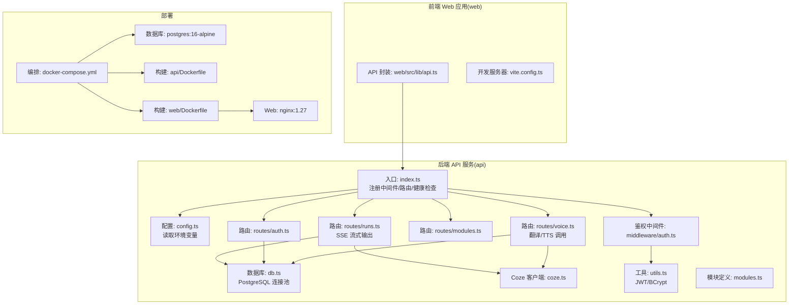
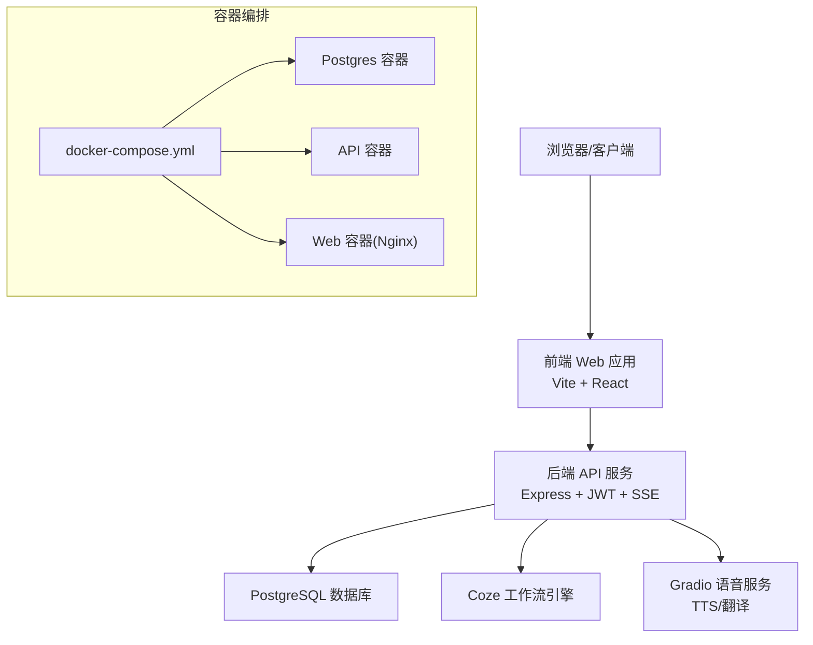
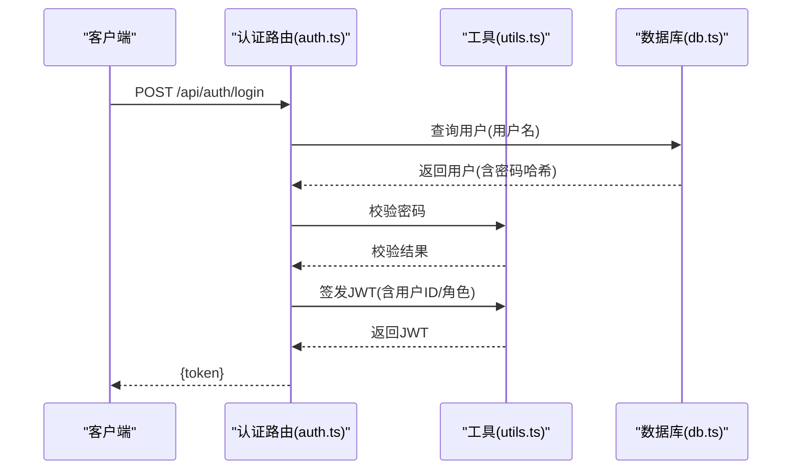
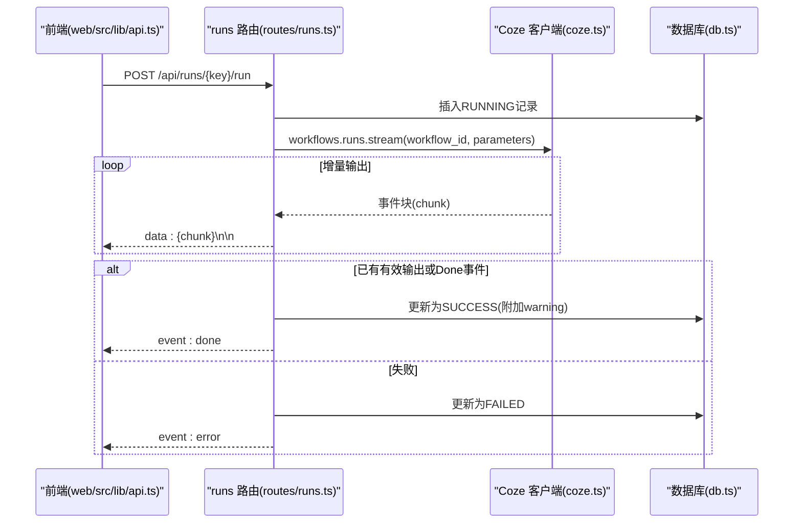
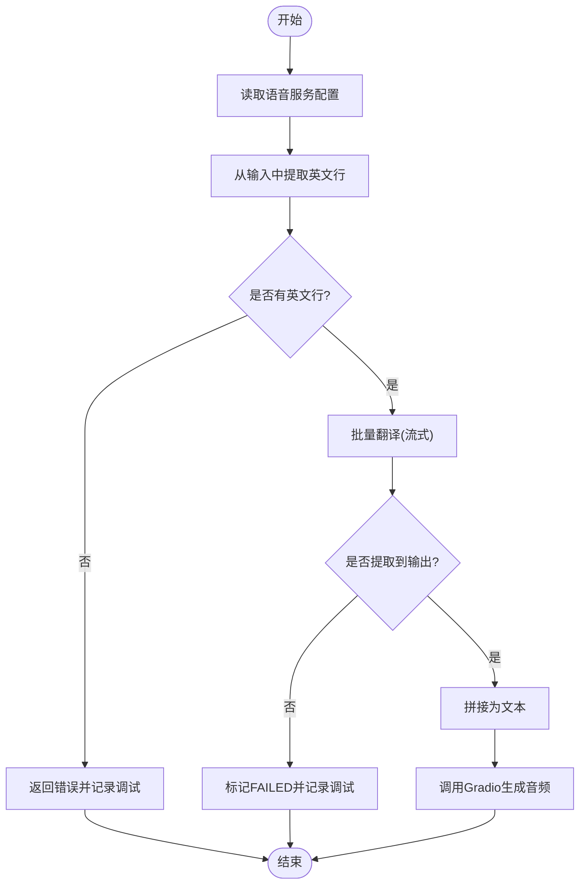
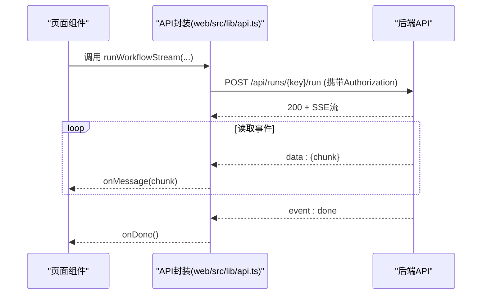
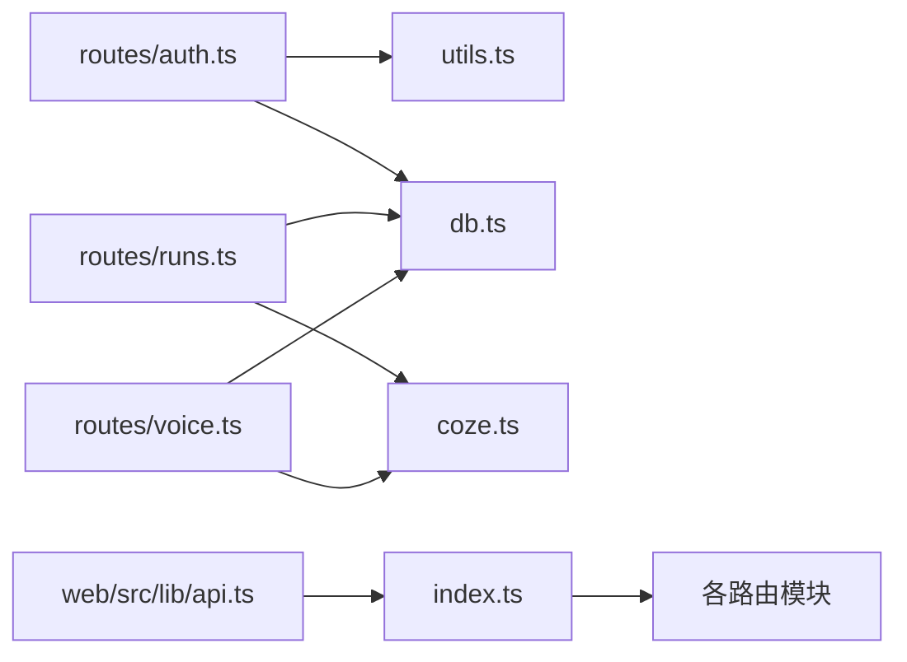
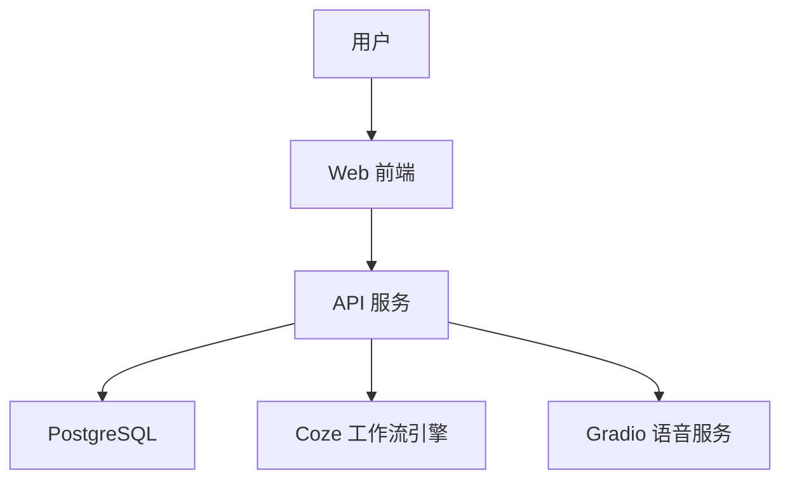
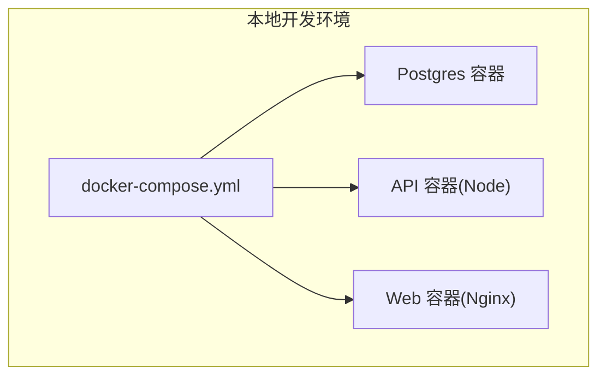
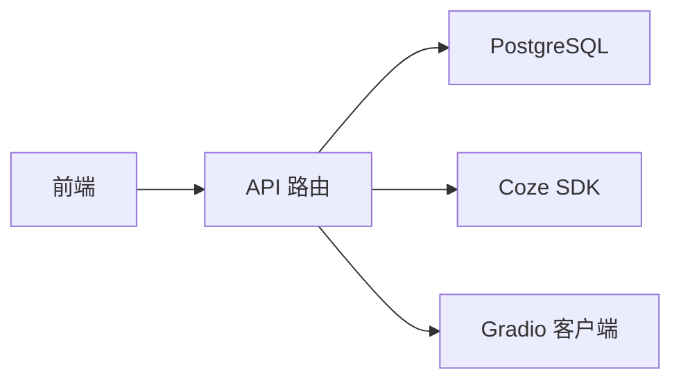

# 整体架构设计

<cite>
**本文引用的文件**
- [api/src/index.ts](file://api/src/index.ts)
- [api/src/config.ts](file://api/src/config.ts)
- [api/src/db.ts](file://api/src/db.ts)
- [api/src/coze.ts](file://api/src/coze.ts)
- [api/src/middleware/auth.ts](file://api/src/middleware/auth.ts)
- [api/src/utils.ts](file://api/src/utils.ts)
- [api/src/modules.ts](file://api/src/modules.ts)
- [api/src/routes/auth.ts](file://api/src/routes/auth.ts)
- [api/src/routes/modules.ts](file://api/src/routes/modules.ts)
- [api/src/routes/runs.ts](file://api/src/routes/runs.ts)
- [api/src/routes/voice.ts](file://api/src/routes/voice.ts)
- [api/Dockerfile](file://api/Dockerfile)
- [web/src/lib/api.ts](file://web/src/lib/api.ts)
- [web/vite.config.ts](file://web/vite.config.ts)
- [web/Dockerfile](file://web/Dockerfile)
- [docker-compose.yml](file://docker-compose.yml)
</cite>

## 目录
1. [引言](#引言)
2. [项目结构](#项目结构)
3. [核心组件](#核心组件)
4. [架构总览](#架构总览)
5. [详细组件分析](#详细组件分析)
6. [依赖分析](#依赖分析)
7. [性能考虑](#性能考虑)
8. [故障排查指南](#故障排查指南)
9. [结论](#结论)
10. [附录](#附录)

## 引言
本文件为 Coze Workflow 的整体架构设计文档，面向开发者与运维人员，系统性阐述系统的高层架构模式、前后端分离设计、微服务理念与容器化部署策略；明确系统边界、组件职责与交互关系；解释技术选型与架构决策的权衡；并提供系统上下文图、部署拓扑图与数据流图。同时覆盖可扩展性、性能与安全设计，并给出系统演进路线图与未来扩展方向。

## 项目结构
该仓库采用“前后端分离 + 容器化”的单仓多服务组织方式：
- 后端 API 服务位于 api/，基于 Express 搭建 REST/SSE 接口，负责认证、任务编排、数据库访问与调用外部 Coze 工作流引擎。
- 前端 Web 应用于 web/，基于 Vite + React 构建，通过统一的 API 封装与后端交互。
- 部署通过 docker-compose 编排 PostgreSQL、API 与 Nginx 反向代理的 Web 镜像，形成可一键启动的本地开发环境。

**图表来源**
- [api/src/index.ts:1-29](file://api/src/index.ts#L1-L29)
- [api/src/config.ts:1-19](file://api/src/config.ts#L1-L19)
- [api/src/db.ts:1-35](file://api/src/db.ts#L1-L35)
- [api/src/coze.ts:1-8](file://api/src/coze.ts#L1-L8)
- [api/src/middleware/auth.ts:1-23](file://api/src/middleware/auth.ts#L1-L23)
- [api/src/utils.ts:1-21](file://api/src/utils.ts#L1-L21)
- [api/src/modules.ts:1-29](file://api/src/modules.ts#L1-L29)
- [api/src/routes/auth.ts:1-115](file://api/src/routes/auth.ts#L1-L115)
- [api/src/routes/modules.ts:1-20](file://api/src/routes/modules.ts#L1-L20)
- [api/src/routes/runs.ts:1-159](file://api/src/routes/runs.ts#L1-L159)
- [api/src/routes/voice.ts:1-404](file://api/src/routes/voice.ts#L1-L404)
- [web/src/lib/api.ts:1-160](file://web/src/lib/api.ts#L1-L160)
- [web/vite.config.ts:1-10](file://web/vite.config.ts#L1-L10)
- [api/Dockerfile:1-19](file://api/Dockerfile#L1-L19)
- [web/Dockerfile:1-16](file://web/Dockerfile#L1-L16)
- [docker-compose.yml:1-35](file://docker-compose.yml#L1-L35)

**章节来源**
- [api/src/index.ts:1-29](file://api/src/index.ts#L1-L29)
- [docker-compose.yml:1-35](file://docker-compose.yml#L1-L35)

## 核心组件
- 应用入口与路由注册
  - Express 应用在入口文件中启用 CORS、JSON 解析与健康检查端点，并按前缀挂载各业务路由。
- 配置管理
  - 通过环境变量加载数据库连接、Coze Token、JWT Secret、语音服务基础地址等关键配置。
- 数据层
  - 使用 PostgreSQL 连接池，初始化用户表与运行记录表，支持任务状态持久化。
- 认证与授权
  - 基于 JWT 的 Bearer Token 中间件，提供注册、登录、重置密码、个人信息查询等接口。
- 工作流执行
  - 以模块化的方式定义可用工作流，通过 SSE 将外部 Coze 工作流的增量输出实时推送给前端。
- 语音与翻译
  - 提供批量翻译与 TTS 生成能力，内部维护调试记录，便于定位问题。
- 前端 API 封装
  - 统一处理鉴权头、错误码与 SSE 事件分发，封装文件上传、语音配置、翻译与 TTS 调用。

**章节来源**
- [api/src/index.ts:1-29](file://api/src/index.ts#L1-L29)
- [api/src/config.ts:1-19](file://api/src/config.ts#L1-L19)
- [api/src/db.ts:1-35](file://api/src/db.ts#L1-L35)
- [api/src/middleware/auth.ts:1-23](file://api/src/middleware/auth.ts#L1-L23)
- [api/src/utils.ts:1-21](file://api/src/utils.ts#L1-L21)
- [api/src/modules.ts:1-29](file://api/src/modules.ts#L1-L29)
- [api/src/routes/auth.ts:1-115](file://api/src/routes/auth.ts#L1-L115)
- [api/src/routes/runs.ts:1-159](file://api/src/routes/runs.ts#L1-L159)
- [api/src/routes/voice.ts:1-404](file://api/src/routes/voice.ts#L1-L404)
- [web/src/lib/api.ts:1-160](file://web/src/lib/api.ts#L1-L160)

## 架构总览
系统采用“前后端分离 + 微服务理念 + 容器化部署”的架构模式：
- 前后端分离：前端通过统一 API 封装与后端交互，降低耦合度，提升开发效率。
- 微服务理念：后端以路由模块划分领域边界（认证、模块清单、任务执行、语音翻译），每个模块职责单一，便于独立演进。
- 容器化部署：使用 docker-compose 编排数据库、API 与 Web，实现一键拉起与环境一致性。

**图表来源**
- [api/src/index.ts:1-29](file://api/src/index.ts#L1-L29)
- [api/src/coze.ts:1-8](file://api/src/coze.ts#L1-L8)
- [api/src/db.ts:1-35](file://api/src/db.ts#L1-L35)
- [api/src/routes/voice.ts:1-404](file://api/src/routes/voice.ts#L1-L404)
- [web/src/lib/api.ts:1-160](file://web/src/lib/api.ts#L1-L160)
- [docker-compose.yml:1-35](file://docker-compose.yml#L1-L35)

## 详细组件分析

### 认证与授权组件
- 职责
  - 用户注册、登录、密码校验与更新；个人资料查询；JWT 签发与校验。
- 关键流程
  - 登录/注册：校验必填项，查询用户，比对密码哈希，签发 JWT。
  - 重置密码：支持管理员重置他人密码，普通用户仅能重置自身。
  - 中间件：从 Authorization 头解析 Bearer Token，校验并注入用户信息。
- 安全要点
  - 密码使用 bcrypt 哈希存储；JWT 使用强密钥签名；敏感操作需鉴权。

**图表来源**
- [api/src/routes/auth.ts:36-63](file://api/src/routes/auth.ts#L36-L63)
- [api/src/utils.ts:10-20](file://api/src/utils.ts#L10-L20)
- [api/src/db.ts:11-20](file://api/src/db.ts#L11-L20)

**章节来源**
- [api/src/routes/auth.ts:1-115](file://api/src/routes/auth.ts#L1-L115)
- [api/src/middleware/auth.ts:1-23](file://api/src/middleware/auth.ts#L1-L23)
- [api/src/utils.ts:1-21](file://api/src/utils.ts#L1-L21)
- [api/src/db.ts:1-35](file://api/src/db.ts#L1-L35)

### 工作流执行与任务管理
- 职责
  - 列举用户任务、查询任务详情；触发指定模块的工作流执行；通过 SSE 实时推送增量输出。
- 关键流程
  - 任务创建：写入 runs 表，状态 RUNNING；调用 Coze 工作流流式执行。
  - 输出处理：逐块解析事件，判断是否有有效输出或 Done 事件；最终持久化状态与输出。
  - 错误处理：若已产生有效输出或 Done 事件，标记为 SUCCESS 并附加警告；否则标记 FAILED。
- 性能与可靠性
  - 使用 SSE 降低轮询开销；数据库事务保证状态一致性；异常分支确保最终落库。

**图表来源**
- [api/src/routes/runs.ts:55-157](file://api/src/routes/runs.ts#L55-L157)
- [api/src/coze.ts:1-8](file://api/src/coze.ts#L1-L8)
- [api/src/db.ts:11-32](file://api/src/db.ts#L11-L32)
- [web/src/lib/api.ts:58-115](file://web/src/lib/api.ts#L58-L115)

**章节来源**
- [api/src/routes/runs.ts:1-159](file://api/src/routes/runs.ts#L1-L159)
- [api/src/modules.ts:1-29](file://api/src/modules.ts#L1-L29)
- [api/src/coze.ts:1-8](file://api/src/coze.ts#L1-L8)
- [api/src/db.ts:1-35](file://api/src/db.ts#L1-L35)
- [web/src/lib/api.ts:1-160](file://web/src/lib/api.ts#L1-L160)

### 语音与翻译组件
- 职责
  - 提供语音服务基础地址配置；从产品文案输出中提取英文行；批量翻译；将英文行转为语音并导出 SRT。
- 关键流程
  - 配置读取：从配置与环境变量中获取语音服务基础地址。
  - 文案提取：从复杂 JSON/字符串中提取英文行数组。
  - 批量翻译：调用 Coze 工作流，流式收集输出，提取最终英文行数组。
  - TTS 生成：连接 Gradio 服务，按步骤执行预测，生成音频并清理临时文件。
  - 调试记录：在内存中维护有限条调试记录，便于问题回溯。
- 可靠性
  - 对异常进行分类处理，区分“无输出但有 Done”与“完全失败”，分别记录为 SUCCESS+warning 与 FAILED。

**图表来源**
- [api/src/routes/voice.ts:69-341](file://api/src/routes/voice.ts#L69-L341)
- [api/src/coze.ts:1-8](file://api/src/coze.ts#L1-L8)

**章节来源**
- [api/src/routes/voice.ts:1-404](file://api/src/routes/voice.ts#L1-L404)
- [api/src/config.ts:1-19](file://api/src/config.ts#L1-L19)

### 前端 API 封装与交互
- 职责
  - 统一设置/读取/清除 JWT；封装 fetch 请求；处理 401 自动登出；封装文件上传、语音配置、翻译与 TTS 调用；解析 SSE 事件。
- 关键流程
  - 请求拦截：自动附加 Authorization 头；处理 401 清除本地 token 并回调登出逻辑。
  - SSE：读取响应体流，按行解析事件与数据，分别回调 onMessage/onDone/onError。
  - 文件上传：FormData 方式上传，支持带 Token。

**图表来源**
- [web/src/lib/api.ts:58-115](file://web/src/lib/api.ts#L58-L115)
- [api/src/routes/runs.ts:74-123](file://api/src/routes/runs.ts#L74-L123)

**章节来源**
- [web/src/lib/api.ts:1-160](file://web/src/lib/api.ts#L1-L160)

## 依赖分析
- 组件内聚与耦合
  - 路由层与业务逻辑解耦：路由仅负责参数校验与调度，核心逻辑在模块与工具层。
  - 中间件与工具层高复用：鉴权中间件与 JWT/BCrypt 工具被多路由共享。
- 外部依赖
  - Coze 工作流引擎：通过官方 SDK 调用，支持流式输出。
  - PostgreSQL：作为主数据存储，提供 ACID 事务与索引支持。
  - Gradio：用于语音合成与导出 SRT。
- 部署依赖
  - docker-compose 统一编排数据库、API 与 Web；Nginx 提供静态资源与反向代理。

**图表来源**
- [api/src/routes/auth.ts:1-115](file://api/src/routes/auth.ts#L1-L115)
- [api/src/utils.ts:1-21](file://api/src/utils.ts#L1-L21)
- [api/src/db.ts:1-35](file://api/src/db.ts#L1-L35)
- [api/src/routes/runs.ts:1-159](file://api/src/routes/runs.ts#L1-L159)
- [api/src/routes/voice.ts:1-404](file://api/src/routes/voice.ts#L1-L404)
- [api/src/coze.ts:1-8](file://api/src/coze.ts#L1-L8)
- [api/src/index.ts:1-29](file://api/src/index.ts#L1-L29)
- [web/src/lib/api.ts:1-160](file://web/src/lib/api.ts#L1-L160)

**章节来源**
- [api/src/index.ts:1-29](file://api/src/index.ts#L1-L29)
- [docker-compose.yml:1-35](file://docker-compose.yml#L1-L35)

## 性能考虑
- I/O 密集与流式处理
  - 工作流执行采用 SSE 流式输出，避免一次性大响应，降低前端渲染压力与网络阻塞。
- 数据库优化
  - users 与 runs 表具备主键与必要字段，建议在高频查询列上建立索引（如 user_id、created_at）。
- 缓存与并发
  - 建议引入 Redis 缓存热点数据（如用户会话、模块元数据）；对长耗时任务采用队列异步化。
- 前端体验
  - 前端 API 封装已内置 SSE 解析与错误回调，建议在 UI 层增加节流与防抖，减少频繁重试。
- 容器与资源
  - docker-compose 中数据库与 API 分离，建议生产环境独立扩容 API 与数据库节点，限制单容器资源上限。

[本节为通用性能指导，无需特定文件引用]

## 故障排查指南
- 常见错误与定位
  - 未登录/登录失效：检查 Authorization 头与 JWT 是否正确传递与签发。
  - 数据库连接失败：核对 DATABASE_URL 与容器网络连通性。
  - Coze 工作流调用失败：检查 COZE_API_TOKEN 与工作流 ID；关注 runs 路由的错误事件与落库状态。
  - 语音服务不可用：确认 VOICE_BASE_URL 配置；检查 Gradio 服务可达性。
- 调试手段
  - runs 路由支持流式事件查看；voice 路由提供调试记录列表与详情接口，便于回放步骤。
  - 前端 401 自动登出：检查本地 token 存储与过期时间。

**章节来源**
- [api/src/routes/auth.ts:100-112](file://api/src/routes/auth.ts#L100-L112)
- [api/src/routes/runs.ts:124-156](file://api/src/routes/runs.ts#L124-L156)
- [api/src/routes/voice.ts:256-273](file://api/src/routes/voice.ts#L256-L273)
- [web/src/lib/api.ts:25-28](file://web/src/lib/api.ts#L25-L28)

## 结论
本架构以“前后端分离 + 微服务理念 + 容器化部署”为核心，结合 SSE 流式输出与模块化路由，实现了可扩展、可观测且易维护的系统。通过 JWT 认证、数据库约束与异常分支处理，保障了安全性与可靠性。建议后续引入缓存、异步队列与可观测性平台，进一步提升性能与稳定性。

[本节为总结性内容，无需特定文件引用]

## 附录

### 系统上下文图

[此图为概念性上下文图，无需图表来源]

### 部署拓扑图

**图表来源**
- [docker-compose.yml:1-35](file://docker-compose.yml#L1-L35)

### 数据流图

[此图为概念性数据流图，无需图表来源]

### 技术选型与权衡
- Node.js + Express
  - 快速迭代、生态丰富；适合中小型后端服务；生产环境建议配合 PM2/容器化与限流。
- PostgreSQL
  - 成熟的关系型数据库，ACID 与扩展性良好；建议开启备份与只读副本。
- JWT
  - 无状态认证，便于横向扩展；需妥善保管密钥与设置合理过期时间。
- SSE
  - 低延迟增量推送，适合工作流输出场景；注意客户端断线重连与缓冲区管理。
- Nginx
  - 静态资源与反向代理，性能稳定；建议启用 gzip 与缓存策略。
- Docker Compose
  - 一键编排，便于本地开发与测试；生产建议迁移到 Kubernetes。

[本节为通用技术说明，无需特定文件引用]

### 可扩展性设计
- 模块化路由：新增工作流只需在模块定义与路由中注册，保持接口一致。
- 中间件扩展：统一鉴权、日志、限流等中间件可按需增强。
- 数据层：按业务维度拆分表或引入读写分离；对热点数据加缓存。
- 异步化：将长耗时任务放入消息队列，API 仅负责编排与通知。

[本节为通用扩展指导，无需特定文件引用]

### 安全架构
- 认证与授权
  - Bearer Token + JWT；中间件强制鉴权；管理员权限控制密码重置范围。
- 数据保护
  - 密码使用 bcrypt 哈希；敏感配置通过环境变量注入；禁止明文日志。
- 网络与传输
  - 生产环境启用 HTTPS；限制 API 端口暴露；前后端同源策略与 CORS 配置。
- 审计与监控
  - 记录关键操作与异常；接入日志与告警平台。

**章节来源**
- [api/src/middleware/auth.ts:1-23](file://api/src/middleware/auth.ts#L1-L23)
- [api/src/utils.ts:1-21](file://api/src/utils.ts#L1-L21)
- [api/src/config.ts:1-19](file://api/src/config.ts#L1-L19)

### 演进路线图与未来扩展方向
- 短期
  - 引入 Redis 缓存与限流中间件；完善数据库索引与慢查询分析。
- 中期
  - 引入消息队列与 Worker，异步执行工作流；增加可观测性（日志/指标/追踪）。
- 长期
  - 迁移至 Kubernetes，实现弹性伸缩与蓝绿发布；引入 API 网关与服务网格；完善 CI/CD 与自动化测试。

[本节为演进规划，无需特定文件引用]