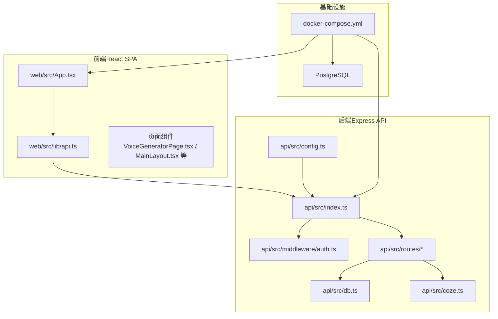
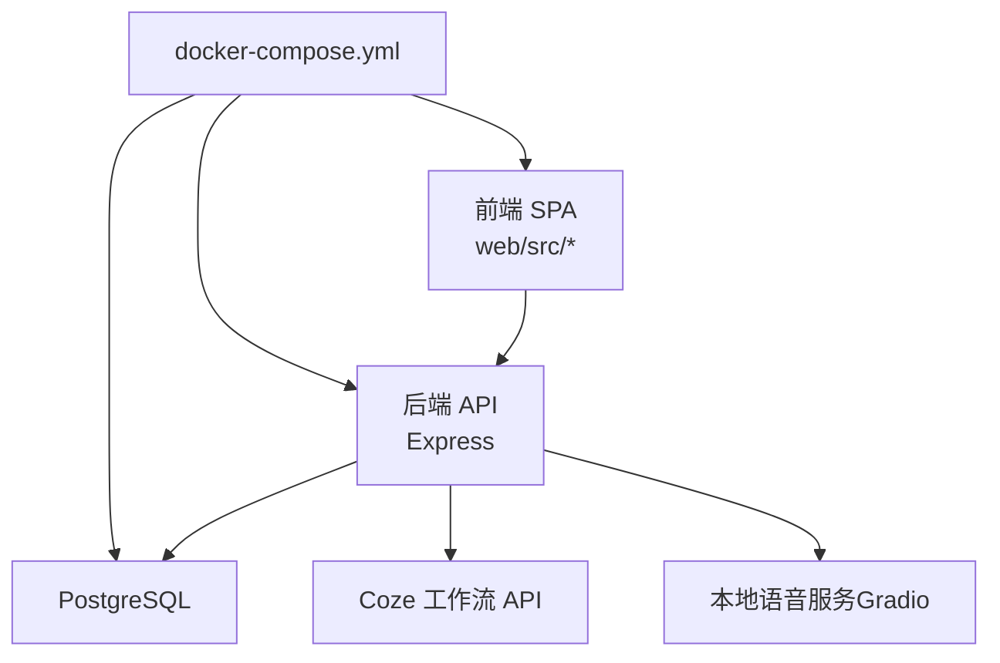
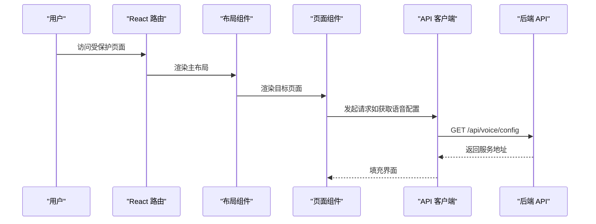
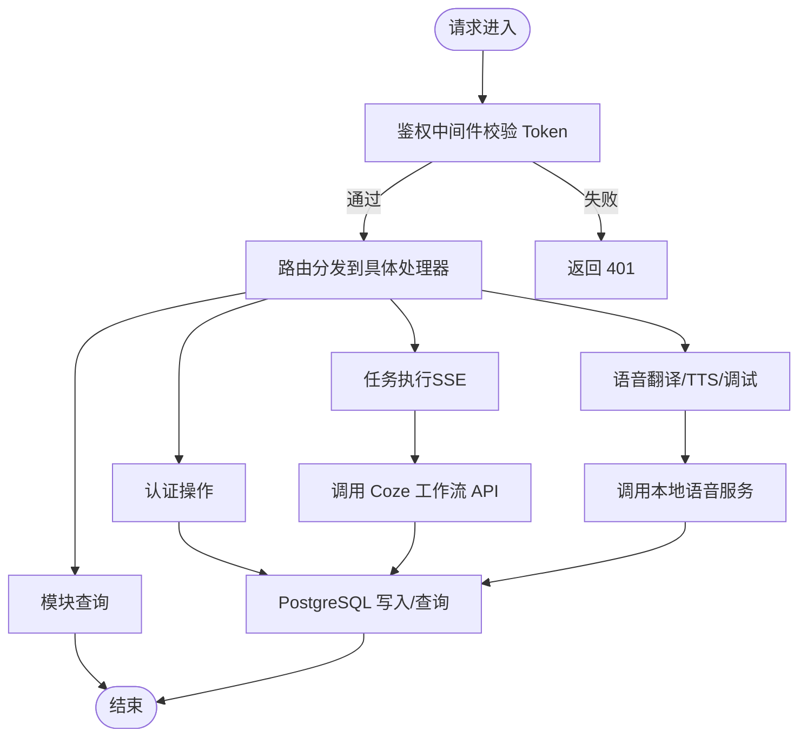
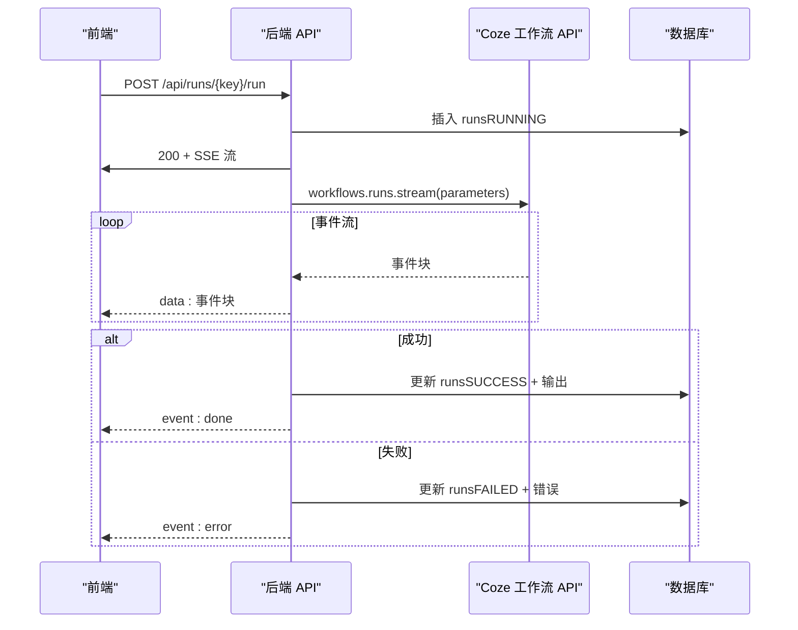
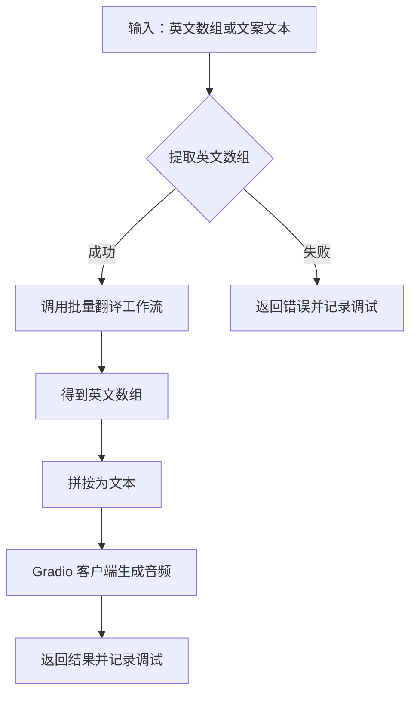
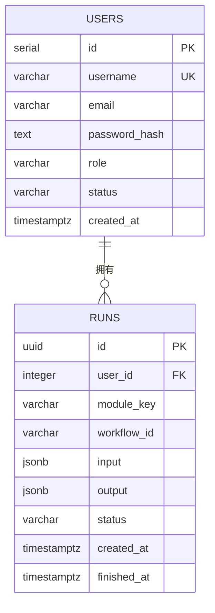
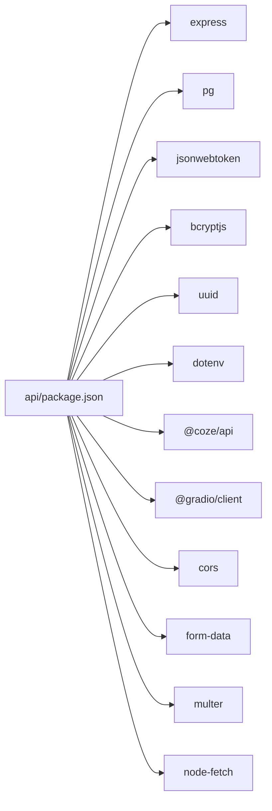
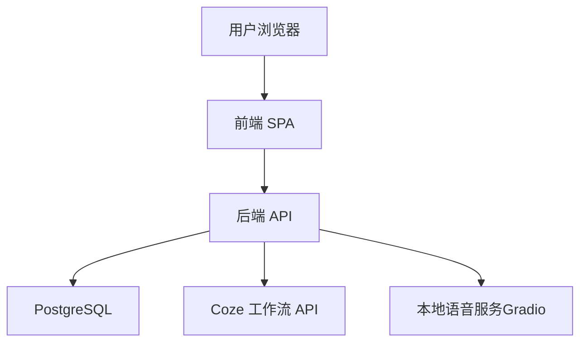
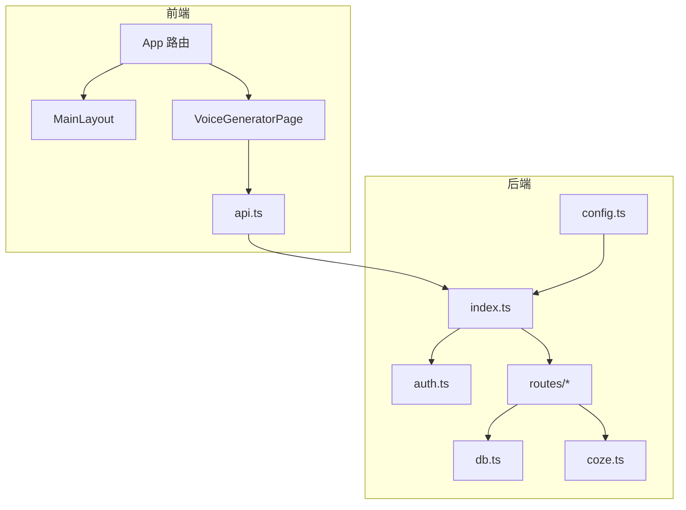

# 系统架构

<cite>
**本文引用的文件**
- [api/src/index.ts](file://api/src/index.ts)
- [api/src/config.ts](file://api/src/config.ts)
- [api/src/coze.ts](file://api/src/coze.ts)
- [api/src/db.ts](file://api/src/db.ts)
- [api/src/middleware/auth.ts](file://api/src/middleware/auth.ts)
- [api/src/routes/auth.ts](file://api/src/routes/auth.ts)
- [api/src/routes/modules.ts](file://api/src/routes/modules.ts)
- [api/src/routes/runs.ts](file://api/src/routes/runs.ts)
- [api/src/routes/voice.ts](file://api/src/routes/voice.ts)
- [api/package.json](file://api/package.json)
- [docker-compose.yml](file://docker-compose.yml)
- [web/src/App.tsx](file://web/src/App.tsx)
- [web/src/lib/api.ts](file://web/src/lib/api.ts)
- [web/src/pages/VoiceGeneratorPage.tsx](file://web/src/pages/VoiceGeneratorPage.tsx)
- [web/src/layouts/MainLayout.tsx](file://web/src/layouts/MainLayout.tsx)
</cite>

## 目录
1. [引言](#引言)
2. [项目结构](#项目结构)
3. [核心组件](#核心组件)
4. [架构总览](#架构总览)
5. [详细组件分析](#详细组件分析)
6. [依赖关系分析](#依赖关系分析)
7. [性能考量](#性能考量)
8. [故障排查指南](#故障排查指南)
9. [结论](#结论)
10. [附录](#附录)

## 引言
本文件为 Coze Workflow 的系统架构文档，面向工程与非技术读者，系统性阐述高层设计、架构模式与系统边界。项目采用前后端分离架构：前端为基于 React 的单页应用（SPA），后端为基于 Express 的 REST API 服务；数据库层采用 PostgreSQL；外部服务包括 Coze 平台与本地语音合成服务（通过 Gradio 客户端对接）。文档覆盖组件交互、数据流向、集成模式、技术决策与权衡、基础设施与部署拓扑、安全与监控、灾难恢复等横切关注点，并给出系统上下文图与组件分解图。

## 项目结构
- 前端（React SPA）
  - 路由与布局：主布局、认证布局、页面组件（仪表盘、任务列表、模块页面、语音生成页等）
  - API 客户端：封装统一的请求、鉴权头注入、SSE 流式处理、文件上传
- 后端（Express API）
  - 入口与中间件：CORS、JSON 解析、健康检查、路由挂载
  - 鉴权中间件：基于 JWT 的授权校验
  - 路由模块：认证、模块信息、任务执行（SSE）、语音相关（翻译、TTS、调试）
  - 数据访问：PostgreSQL 连接池与初始化脚本
  - 外部集成：Coze API SDK、Gradio 客户端
- 基础设施编排
  - docker-compose：定义数据库、API、Web 三服务及其依赖与端口映射

图表来源
- [api/src/index.ts:1-29](file://api/src/index.ts#L1-L29)
- [api/src/db.ts:1-35](file://api/src/db.ts#L1-L35)
- [api/src/coze.ts:1-8](file://api/src/coze.ts#L1-L8)
- [api/src/config.ts:1-19](file://api/src/config.ts#L1-L19)
- [api/src/middleware/auth.ts:1-23](file://api/src/middleware/auth.ts#L1-L23)
- [api/src/routes/auth.ts:1-115](file://api/src/routes/auth.ts#L1-L115)
- [api/src/routes/modules.ts:1-20](file://api/src/routes/modules.ts#L1-L20)
- [api/src/routes/runs.ts:1-159](file://api/src/routes/runs.ts#L1-L159)
- [api/src/routes/voice.ts:1-404](file://api/src/routes/voice.ts#L1-L404)
- [web/src/App.tsx:1-70](file://web/src/App.tsx#L1-L70)
- [web/src/lib/api.ts:1-160](file://web/src/lib/api.ts#L1-L160)
- [web/src/pages/VoiceGeneratorPage.tsx:1-95](file://web/src/pages/VoiceGeneratorPage.tsx#L1-L95)
- [docker-compose.yml:1-35](file://docker-compose.yml#L1-L35)

章节来源
- [api/src/index.ts:1-29](file://api/src/index.ts#L1-L29)
- [docker-compose.yml:1-35](file://docker-compose.yml#L1-L35)

## 核心组件
- 前端应用（React SPA）
  - 路由与守卫：基于 token 的受保护路由、未授权自动跳转登录
  - API 客户端：统一 fetch 封装、SSE 流式处理、文件上传、鉴权头注入
  - 页面组件：模块化页面（详情图、视频文案、产品文案、翻译、语音生成）
- 后端 API（Express）
  - 中间件：CORS、JSON 解析、健康检查、JWT 鉴权
  - 路由：认证注册/登录/重置密码/当前用户；模块信息查询；任务执行（SSE）；语音翻译/TTS/调试
  - 数据层：PostgreSQL 连接池与初始化表结构
  - 外部集成：Coze 工作流 API、Gradio 语音服务
- 数据库（PostgreSQL）
  - 用户表与任务表，支持 JSONB 存储输入输出，UUID 主键
- 基础设施
  - docker-compose 编排：数据库、API、Web 服务，端口映射与依赖顺序

章节来源
- [web/src/App.tsx:1-70](file://web/src/App.tsx#L1-L70)
- [web/src/lib/api.ts:1-160](file://web/src/lib/api.ts#L1-L160)
- [api/src/index.ts:1-29](file://api/src/index.ts#L1-L29)
- [api/src/middleware/auth.ts:1-23](file://api/src/middleware/auth.ts#L1-L23)
- [api/src/routes/auth.ts:1-115](file://api/src/routes/auth.ts#L1-L115)
- [api/src/routes/runs.ts:1-159](file://api/src/routes/runs.ts#L1-L159)
- [api/src/routes/voice.ts:1-404](file://api/src/routes/voice.ts#L1-L404)
- [api/src/db.ts:1-35](file://api/src/db.ts#L1-L35)
- [docker-compose.yml:1-35](file://docker-compose.yml#L1-L35)

## 架构总览
系统采用“前端 SPA + 后端 API + 数据库 + 外部服务”的分层架构。前端通过 REST 与 SSE 与后端交互；后端负责业务编排、鉴权、数据持久化与外部服务调用；数据库承载用户与任务状态；外部服务包括 Coze 工作流平台与本地语音合成服务。

图表来源
- [api/src/index.ts:1-29](file://api/src/index.ts#L1-L29)
- [api/src/coze.ts:1-8](file://api/src/coze.ts#L1-L8)
- [api/src/db.ts:1-35](file://api/src/db.ts#L1-L35)
- [api/src/routes/voice.ts:1-404](file://api/src/routes/voice.ts#L1-L404)
- [docker-compose.yml:1-35](file://docker-compose.yml#L1-L35)

## 详细组件分析

### 前端组件分析（React SPA）
- 路由与布局
  - 主布局包含侧边菜单与内容区，提供统一导航与登出能力
  - 受保护路由在进入前检查 token，缺失则跳转登录
- API 客户端
  - 统一设置 Content-Type 与 Authorization 头
  - SSE 流式处理：按双换行符拆分事件，区分 done/error/data
  - 文件上传：FormData 上传至 /api/files/upload
- 页面组件
  - 语音生成页：拉取语音服务配置（Studio/API 地址），并在 iframe 中嵌入

图表来源
- [web/src/App.tsx:17-66](file://web/src/App.tsx#L17-L66)
- [web/src/layouts/MainLayout.tsx:17-62](file://web/src/layouts/MainLayout.tsx#L17-L62)
- [web/src/pages/VoiceGeneratorPage.tsx:10-25](file://web/src/pages/VoiceGeneratorPage.tsx#L10-L25)
- [web/src/lib/api.ts:117-126](file://web/src/lib/api.ts#L117-L126)

章节来源
- [web/src/App.tsx:1-70](file://web/src/App.tsx#L1-L70)
- [web/src/lib/api.ts:1-160](file://web/src/lib/api.ts#L1-L160)
- [web/src/pages/VoiceGeneratorPage.tsx:1-95](file://web/src/pages/VoiceGeneratorPage.tsx#L1-L95)
- [web/src/layouts/MainLayout.tsx:1-65](file://web/src/layouts/MainLayout.tsx#L1-L65)

### 后端组件分析（Express API）

#### 鉴权与路由
- 鉴权中间件
  - 从 Authorization 头解析 Bearer Token，验证失败返回 401
- 路由模块
  - 认证：注册、登录、重置密码、当前用户
  - 模块：列出模块与查询指定模块信息
  - 任务：查询任务列表/详情；启动任务并以 SSE 推送事件
  - 语音：翻译、TTS、调试记录、配置

图表来源
- [api/src/middleware/auth.ts:8-22](file://api/src/middleware/auth.ts#L8-L22)
- [api/src/routes/auth.ts:1-115](file://api/src/routes/auth.ts#L1-L115)
- [api/src/routes/modules.ts:1-20](file://api/src/routes/modules.ts#L1-L20)
- [api/src/routes/runs.ts:55-157](file://api/src/routes/runs.ts#L55-L157)
- [api/src/routes/voice.ts:165-207](file://api/src/routes/voice.ts#L165-L207)

章节来源
- [api/src/middleware/auth.ts:1-23](file://api/src/middleware/auth.ts#L1-L23)
- [api/src/routes/auth.ts:1-115](file://api/src/routes/auth.ts#L1-L115)
- [api/src/routes/modules.ts:1-20](file://api/src/routes/modules.ts#L1-L20)
- [api/src/routes/runs.ts:1-159](file://api/src/routes/runs.ts#L1-L159)
- [api/src/routes/voice.ts:1-404](file://api/src/routes/voice.ts#L1-L404)

#### 任务执行（SSE）流程
- 前端发起 POST /api/runs/:key/run，后端插入 runs 表并开启 SSE
- 后端调用 Coze 工作流 API，逐条推送事件
- 任务完成后更新状态与输出；异常时根据是否有有效输出决定最终状态

图表来源
- [api/src/routes/runs.ts:55-157](file://api/src/routes/runs.ts#L55-L157)
- [api/src/coze.ts:4-7](file://api/src/coze.ts#L4-L7)
- [api/src/db.ts:6-8](file://api/src/db.ts#L6-L8)

章节来源
- [api/src/routes/runs.ts:1-159](file://api/src/routes/runs.ts#L1-L159)
- [api/src/coze.ts:1-8](file://api/src/coze.ts#L1-L8)
- [api/src/db.ts:1-35](file://api/src/db.ts#L1-L35)

#### 语音翻译与 TTS 流程
- 翻译：从产品文案输出中提取英文数组，调用批量翻译工作流，解析输出数组
- TTS：将英文文本写入临时文件，通过 Gradio 客户端依次调用多个组件生成音频
- 调试：记录输入、步骤与结果，支持查询与清理

图表来源
- [api/src/routes/voice.ts:276-341](file://api/src/routes/voice.ts#L276-L341)
- [api/src/routes/voice.ts:344-402](file://api/src/routes/voice.ts#L344-L402)
- [api/src/routes/voice.ts:165-207](file://api/src/routes/voice.ts#L165-L207)

章节来源
- [api/src/routes/voice.ts:1-404](file://api/src/routes/voice.ts#L1-L404)

### 数据模型与持久化
- 用户表：用户名唯一、角色与状态、时间戳
- 任务表：UUID 主键、外键关联用户、模块键、工作流 ID、输入输出 JSONB、状态与时间戳

图表来源
- [api/src/db.ts:12-32](file://api/src/db.ts#L12-L32)

章节来源
- [api/src/db.ts:1-35](file://api/src/db.ts#L1-L35)

## 依赖关系分析
- 技术栈与版本
  - 后端：Express、TypeScript、PostgreSQL、Coze SDK、Gradio 客户端、JWT、Bcrypt、UUID、Multer、dotenv
  - 前端：React、Ant Design、Vite
- 外部依赖
  - Coze 工作流 API：用于执行工作流与流式事件
  - 本地语音服务：通过 Gradio 客户端连接，生成音频与导出字幕
- 配置与环境变量
  - 必需变量：COZE_API_TOKEN、DATABASE_URL、JWT_SECRET、VOICE_BASE_URL
  - 默认端口：API 3000，Web 80（容器内），数据库 5432

图表来源
- [api/package.json:11-34](file://api/package.json#L11-L34)

章节来源
- [api/package.json:1-36](file://api/package.json#L1-L36)
- [api/src/config.ts:5-11](file://api/src/config.ts#L5-L11)

## 性能考量
- 请求体大小限制：后端对 JSON 请求体设置上限，避免内存压力
- 流式传输：任务执行采用 SSE，前端按事件增量渲染，降低一次性数据负载
- 数据库连接池：使用连接池减少连接开销，初始化时确保表存在
- 任务状态与输出：以 JSONB 存储，便于扩展但需注意索引策略与查询优化
- 外部服务超时与重试：建议在调用 Coze 与 Gradio 时增加超时与指数退避策略（当前实现未显式包含）

章节来源
- [api/src/index.ts:13](file://api/src/index.ts#L13)
- [api/src/db.ts:6-8](file://api/src/db.ts#L6-L8)
- [api/src/routes/runs.ts:84-112](file://api/src/routes/runs.ts#L84-L112)

## 故障排查指南
- 未登录/登录失效
  - 前端：收到 401 自动清除 token 并跳转登录
  - 后端：鉴权中间件校验失败返回 401
- 任务执行异常
  - 若已有有效输出或 Done 事件，标记为成功并附加警告；否则标记失败并返回错误
- 语音服务配置
  - 未配置 VOICE_BASE_URL 时返回 500；前端语音页读取配置后展示 Studio/API 地址
- 数据库初始化
  - 启动时自动创建用户与任务表；确认 DATABASE_URL 正确且数据库可达

章节来源
- [web/src/lib/api.ts:25-28](file://web/src/lib/api.ts#L25-L28)
- [api/src/middleware/auth.ts:8-22](file://api/src/middleware/auth.ts#L8-L22)
- [api/src/routes/runs.ts:124-156](file://api/src/routes/runs.ts#L124-L156)
- [api/src/routes/voice.ts:69-86](file://api/src/routes/voice.ts#L69-L86)
- [api/src/db.ts:10-34](file://api/src/db.ts#L10-L34)

## 结论
该系统以清晰的前后端分层与模块化路由组织业务逻辑，通过 SSE 实现任务执行的实时反馈，结合 PostgreSQL 与外部服务实现完整的端到端工作流。部署上通过 docker-compose 实现快速编排，具备良好的可扩展性与可维护性。后续可在鉴权超时、外部服务重试、数据库索引与监控告警等方面进一步完善。

## 附录

### 系统上下文图

图表来源
- [api/src/index.ts:1-29](file://api/src/index.ts#L1-L29)
- [api/src/coze.ts:1-8](file://api/src/coze.ts#L1-L8)
- [api/src/db.ts:1-35](file://api/src/db.ts#L1-L35)
- [api/src/routes/voice.ts:1-404](file://api/src/routes/voice.ts#L1-L404)

### 组件分解图

图表来源
- [web/src/App.tsx:1-70](file://web/src/App.tsx#L1-L70)
- [web/src/pages/VoiceGeneratorPage.tsx:1-95](file://web/src/pages/VoiceGeneratorPage.tsx#L1-L95)
- [web/src/lib/api.ts:1-160](file://web/src/lib/api.ts#L1-L160)
- [api/src/index.ts:1-29](file://api/src/index.ts#L1-L29)
- [api/src/middleware/auth.ts:1-23](file://api/src/middleware/auth.ts#L1-L23)
- [api/src/routes/auth.ts:1-115](file://api/src/routes/auth.ts#L1-L115)
- [api/src/routes/runs.ts:1-159](file://api/src/routes/runs.ts#L1-L159)
- [api/src/routes/voice.ts:1-404](file://api/src/routes/voice.ts#L1-L404)
- [api/src/db.ts:1-35](file://api/src/db.ts#L1-L35)
- [api/src/config.ts:1-19](file://api/src/config.ts#L1-L19)
- [api/src/coze.ts:1-8](file://api/src/coze.ts#L1-L8)

### 部署拓扑与基础设施
- docker-compose 定义三服务：db（PostgreSQL）、api（Express）、web（静态资源/Nginx）
- 端口映射：db 5432，api 3000，web 5173:80
- 依赖顺序：api 依赖 db，web 依赖 api

章节来源
- [docker-compose.yml:1-35](file://docker-compose.yml#L1-L35)

### 安全性、监控与灾难恢复
- 安全性
  - JWT 鉴权：后端中间件校验，前端自动处理 401
  - CORS：启用跨域支持
  - 环境变量：必需变量在启动时校验，避免明文硬编码
- 监控与可观测性
  - 健康检查：/health
  - 日志：语音调试记录输出到控制台
- 灾难恢复
  - 数据库持久化：卷 pgdata
  - 建议：定期备份数据库、镜像版本化、滚动升级

章节来源
- [api/src/index.ts:15-17](file://api/src/index.ts#L15-L17)
- [api/src/config.ts:5-11](file://api/src/config.ts#L5-L11)
- [docker-compose.yml:8-9](file://docker-compose.yml#L8-L9)