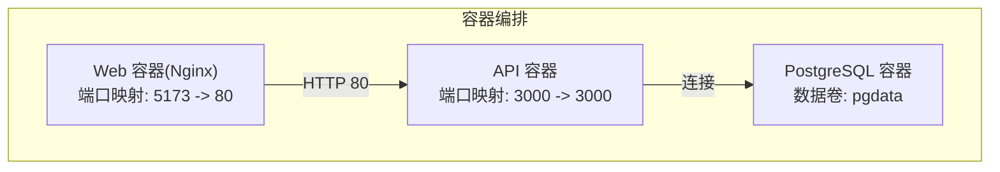
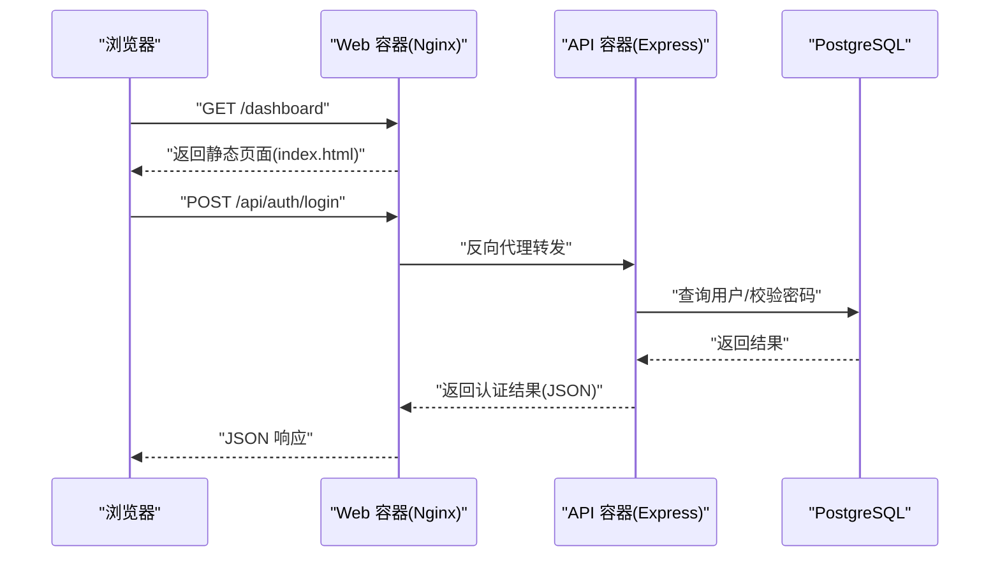
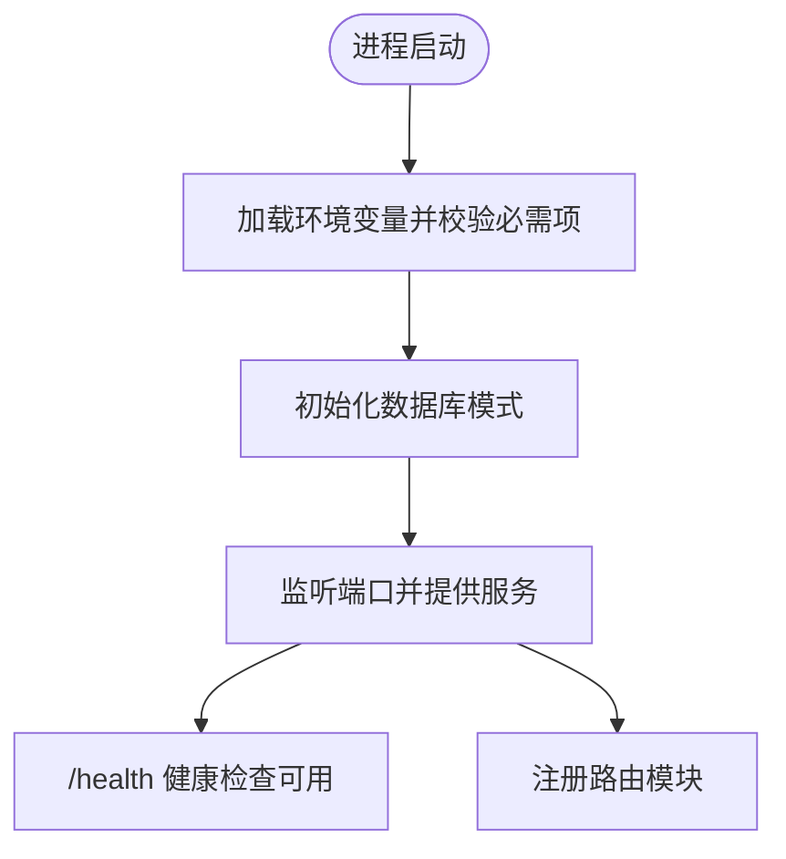
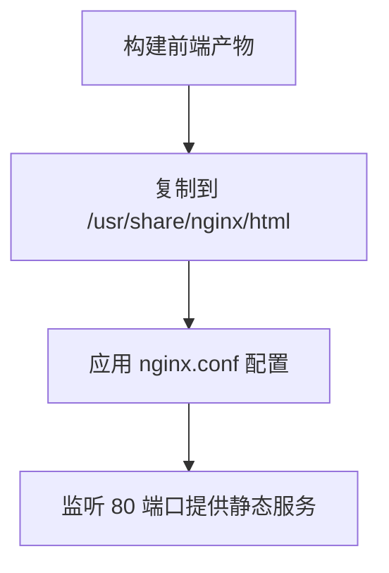

# 部署架构

<cite>
**本文引用的文件**
- [docker-compose.yml](file://docker-compose.yml)
- [api/Dockerfile](file://api/Dockerfile)
- [web/Dockerfile](file://web/Dockerfile)
- [web/nginx.conf](file://web/nginx.conf)
- [api/src/config.ts](file://api/src/config.ts)
- [api/src/index.ts](file://api/src/index.ts)
- [api/src/db.ts](file://api/src/db.ts)
- [api/src/routes/auth.ts](file://api/src/routes/auth.ts)
- [api/package.json](file://api/package.json)
- [web/package.json](file://web/package.json)
- [quick-start.bat](file://quick-start.bat)
- [quick-lan-start.bat](file://quick-lan-start.bat)
</cite>

## 目录
1. [简介](#简介)
2. [项目结构](#项目结构)
3. [核心组件](#核心组件)
4. [架构总览](#架构总览)
5. [详细组件分析](#详细组件分析)
6. [依赖关系分析](#依赖关系分析)
7. [性能考虑](#性能考虑)
8. [故障排除指南](#故障排除指南)
9. [结论](#结论)
10. [附录](#附录)

## 简介
本文件面向 Coze Workflow 的生产级容器化部署，围绕基于 Docker 的多容器编排、网络与服务发现、Nginx 反向代理与负载均衡、环境变量与配置管理、CI/CD 自动化与回滚策略、监控告警与日志聚合、性能调优以及生产最佳实践进行系统性说明。文档同时结合仓库中的 compose 编排、前后端镜像构建与 Nginx 配置，给出可落地的实施建议与可视化图示。

## 项目结构
该工程采用前后端分离的容器化架构：
- 数据库服务：PostgreSQL（持久化卷）
- 后端 API 服务：基于 Node.js 的 Express 应用，负责业务逻辑与数据库交互
- 前端 Web 服务：基于 Nginx 提供静态资源服务，承载 React 单页应用

图表来源
- [docker-compose.yml:1-35](file://docker-compose.yml#L1-L35)
- [api/Dockerfile:12-19](file://api/Dockerfile#L12-L19)
- [web/Dockerfile:12-16](file://web/Dockerfile#L12-L16)

章节来源
- [docker-compose.yml:1-35](file://docker-compose.yml#L1-L35)
- [api/Dockerfile:1-19](file://api/Dockerfile#L1-L19)
- [web/Dockerfile:1-16](file://web/Dockerfile#L1-L16)

## 核心组件
- PostgreSQL 数据库
  - 使用官方镜像，挂载数据卷以持久化
  - 默认暴露 5432 端口
- API 服务
  - Node.js/Express 应用，监听 3000 端口
  - 通过环境变量读取数据库连接、鉴权密钥等配置
  - 提供健康检查端点
- Web 服务
  - Nginx 提供静态资源服务，构建产物拷贝至 /usr/share/nginx/html
  - 通过 nginx.conf 配置根路径与单页应用路由回退

章节来源
- [docker-compose.yml:2-11](file://docker-compose.yml#L2-L11)
- [docker-compose.yml:13-24](file://docker-compose.yml#L13-L24)
- [docker-compose.yml:26-32](file://docker-compose.yml#L26-L32)
- [api/src/index.ts:15-17](file://api/src/index.ts#L15-L17)
- [web/nginx.conf:1-11](file://web/nginx.conf#L1-L11)

## 架构总览
下图展示容器间依赖与通信路径，以及前端到后端的请求流：

图表来源
- [docker-compose.yml:13-24](file://docker-compose.yml#L13-L24)
- [web/Dockerfile:12-16](file://web/Dockerfile#L12-L16)
- [web/nginx.conf:8-10](file://web/nginx.conf#L8-L10)
- [api/src/index.ts:19-23](file://api/src/index.ts#L19-L23)
- [api/src/routes/auth.ts:36-63](file://api/src/routes/auth.ts#L36-L63)
- [api/src/db.ts:6-8](file://api/src/db.ts#L6-L8)

## 详细组件分析

### 数据库服务（PostgreSQL）
- 镜像版本与初始化参数在 compose 中定义
- 数据卷用于持久化，避免容器重建导致数据丢失
- 端口映射便于本地开发调试，生产环境建议限制外网访问

章节来源
- [docker-compose.yml:2-11](file://docker-compose.yml#L2-L11)

### API 服务（Node.js/Express）
- 多阶段构建：依赖安装、构建、运行时三层镜像
- 环境变量驱动配置加载，启动前进行必需变量校验
- 提供统一的健康检查端点，便于编排层探活
- 路由模块化组织，包含认证、模块、文件、运行记录、语音等接口

图表来源
- [api/src/config.ts:5-11](file://api/src/config.ts#L5-L11)
- [api/src/index.ts:25-29](file://api/src/index.ts#L25-L29)
- [api/src/db.ts:10-34](file://api/src/db.ts#L10-L34)

章节来源
- [api/Dockerfile:1-19](file://api/Dockerfile#L1-L19)
- [api/src/config.ts:1-19](file://api/src/config.ts#L1-L19)
- [api/src/index.ts:1-29](file://api/src/index.ts#L1-L29)
- [api/src/db.ts:1-35](file://api/src/db.ts#L1-L35)
- [api/src/routes/auth.ts:1-115](file://api/src/routes/auth.ts#L1-L115)

### Web 服务（Nginx 静态站点）
- 基于 Nginx 镜像，将构建产物复制到默认站点目录
- 通过 nginx.conf 配置根目录与单页应用回退规则
- 端口映射将容器内 80 暴露到宿主机 5173

图表来源
- [web/Dockerfile:12-16](file://web/Dockerfile#L12-L16)
- [web/nginx.conf:1-11](file://web/nginx.conf#L1-L11)

章节来源
- [web/Dockerfile:1-16](file://web/Dockerfile#L1-L16)
- [web/nginx.conf:1-11](file://web/nginx.conf#L1-L11)

### Nginx 反向代理与负载均衡
- 当前 compose 仅运行单实例 Web，未启用多实例负载均衡
- 如需扩展，可在上游接入反向代理（如 Nginx、HAProxy、Traefik）实现多实例轮询或基于权重的分发
- 建议将 Web 作为后端服务池，API 亦可按需横向扩展

[本节为概念性说明，不直接对应具体源码文件，故不附加图表来源]

### 环境变量管理、配置分离与敏感信息保护
- API 侧通过环境变量集中注入配置，启动时校验必需项
- 建议使用外部密钥管理（如 KMS、Vault）或编排平台的密文存储，在部署时注入
- 对于本地开发，可通过 .env 文件管理，但严禁提交到版本库；脚本中已有对敏感文件的暂存处理思路

章节来源
- [api/src/config.ts:5-11](file://api/src/config.ts#L5-L11)
- [docker-compose.yml:16-20](file://docker-compose.yml#L16-L20)
- [quick-lan-start.bat:36-46](file://quick-lan-start.bat#L36-L46)

### CI/CD 流程、自动化部署与回滚策略
- 构建阶段：分别对 api/web 执行多阶段构建，产出镜像
- 部署阶段：使用 compose 或编排平台进行滚动更新
- 回滚策略：利用编排平台的版本控制与回滚能力，必要时切换镜像标签
- 安全加固：构建与推送阶段使用只读凭证，镜像扫描与漏洞检测

[本节为通用流程说明，不直接对应具体源码文件，故不附加章节来源]

## 依赖关系分析
- 服务耦合
  - API 依赖数据库；Web 依赖 API 提供的数据接口
  - compose 中通过 depends_on 控制启动顺序
- 网络与端口
  - 数据库：5432
  - API：3000（容器内），映射到宿主机 3000
  - Web：80（容器内），映射到宿主机 5173

图表来源
- [docker-compose.yml:13-32](file://docker-compose.yml#L13-L32)

章节来源
- [docker-compose.yml:1-35](file://docker-compose.yml#L1-L35)

## 性能考虑
- 数据库
  - 使用连接池，合理设置最大连接数与超时
  - 生产环境开启只读副本与主从备份
- API
  - 合理设置并发与请求体大小限制
  - 引入缓存中间件（如 Redis）降低数据库压力
- Web
  - 启用 Gzip/Br 压缩与静态资源缓存
  - 使用 CDN 加速静态资源分发
- 容器与编排
  - 设置资源限制与健康检查探针
  - 使用滚动更新与蓝绿发布减少停机时间

[本节提供通用指导，不直接对应具体源码文件，故不附加章节来源]

## 故障排除指南
- 启动失败
  - 检查必需环境变量是否完整注入
  - 查看 API 启动日志，确认数据库连接字符串正确
- 数据库异常
  - 确认数据卷挂载路径与权限
  - 检查数据库端口占用与防火墙策略
- 健康检查
  - 访问 /health 端点验证 API 可用性
- 开发联调
  - 使用提供的快速启动脚本，确保端口放行与局域网可达

章节来源
- [api/src/config.ts:5-11](file://api/src/config.ts#L5-L11)
- [api/src/index.ts:15-17](file://api/src/index.ts#L15-L17)
- [quick-lan-start.bat:29-46](file://quick-lan-start.bat#L29-L46)

## 结论
本部署架构以 Docker Compose 实现最小可行的三容器编排，具备清晰的服务边界与启动顺序。生产环境中建议引入反向代理与多实例扩展、强化密钥与配置管理、完善 CI/CD 与监控告警体系，并持续进行性能优化与安全加固。

## 附录

### 端口与服务映射清单
- PostgreSQL：5432（容器内）→ 5432（宿主机）
- API：3000（容器内）→ 3000（宿主机）
- Web：80（容器内）→ 5173（宿主机）

章节来源
- [docker-compose.yml:10-11](file://docker-compose.yml#L10-L11)
- [docker-compose.yml:23-24](file://docker-compose.yml#L23-L24)
- [docker-compose.yml:31-32](file://docker-compose.yml#L31-L32)

### 快速启动与开发联调
- 本地开发双端启动脚本，便于前后端联调
- 局域网快速启动脚本支持自动识别 IP 并开放防火墙端口

章节来源
- [quick-start.bat:1-14](file://quick-start.bat#L1-L14)
- [quick-lan-start.bat:1-83](file://quick-lan-start.bat#L1-L83)