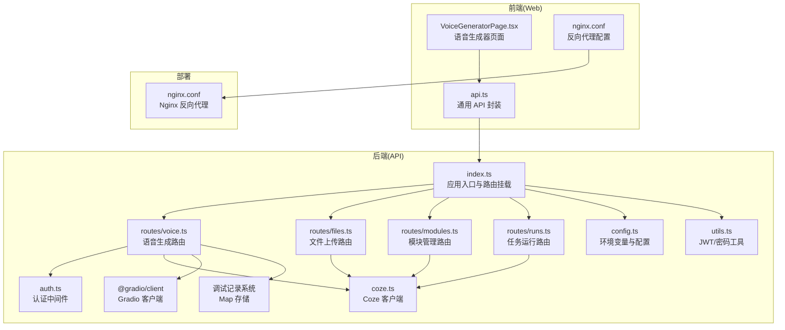
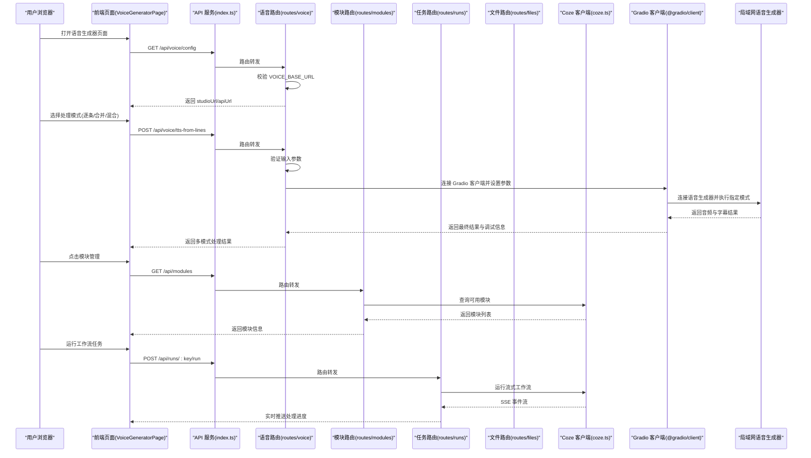
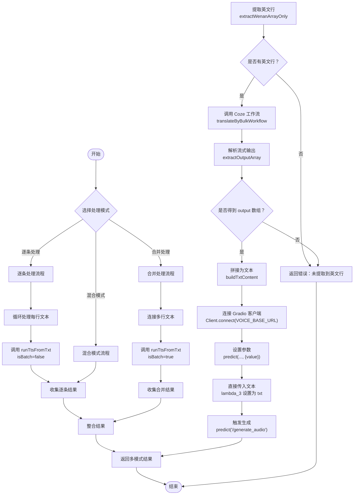

# 语音生成系统

<cite>
**本文引用的文件**
- [api/src/index.ts](file://api/src/index.ts)
- [api/src/config.ts](file://api/src/config.ts)
- [api/src/coze.ts](file://api/src/coze.ts)
- [api/src/middleware/auth.ts](file://api/src/middleware/auth.ts)
- [api/src/routes/voice.ts](file://api/src/routes/voice.ts)
- [api/src/utils.ts](file://api/src/utils.ts)
- [api/src/db.ts](file://api/src/db.ts)
- [api/src/routes/files.ts](file://api/src/routes/files.ts)
- [api/src/routes/modules.ts](file://api/src/routes/modules.ts)
- [api/src/routes/runs.ts](file://api/src/routes/runs.ts)
- [api/src/modules.ts](file://api/src/modules.ts)
- [api/package.json](file://api/package.json)
- [web/src/pages/VoiceGeneratorPage.tsx](file://web/src/pages/VoiceGeneratorPage.tsx)
- [web/src/lib/api.ts](file://web/src/lib/api.ts)
- [web/nginx.conf](file://web/nginx.conf)
- [web/package.json](file://web/package.json)
- [.gitignore](file://.gitignore)
</cite>

## 更新摘要
**变更内容**
- 系统架构全面升级：从单一批处理模式转变为多模式支持，包括逐条处理、合并处理和混合模式
- 新增 @gradio/client 集成：提供更强大的语音生成功能和参数控制能力
- 扩展路由体系：新增模块管理、任务运行和文件上传等路由模块
- 增强 TTS 生成能力：支持多种处理模式，满足不同应用场景需求
- 完善调试系统：提供详细的步骤跟踪和错误诊断功能
- 优化前端交互：增强语音生成器页面的功能和用户体验
- **新增多模式处理能力**：系统现在支持逐条处理、合并处理和混合模式的改进实现
- **增强调试基础设施**：完整的调试记录存储与管理功能，支持步骤跟踪和错误诊断
- **性能优化**：改进的参数设置和处理流程，提升处理效率和质量

## 目录
1. [简介](#简介)
2. [项目结构](#项目结构)
3. [核心组件](#核心组件)
4. [架构总览](#架构总览)
5. [详细组件分析](#详细组件分析)
6. [依赖关系分析](#依赖关系分析)
7. [性能考虑](#性能考虑)
8. [故障排除指南](#故障排除指南)
9. [结论](#结论)
10. [附录](#附录)

## 简介
本系统是一个基于局域网的智能语音生成平台，提供以下核心能力：
- **多模式语音生成**：支持逐条处理、合并处理和混合模式，满足不同应用场景需求
- **局域网语音服务集成**：通过统一的语音生成器界面，所有客户端共享同一台语音服务器的算力资源，降低本地硬件门槛
- **智能 TTS 流程**：支持从文案结果中提取英文行、批量翻译、多模式 TTS 生成（含 MP3 和 SRT 输出），并提供完整的调试与监控
- **增强调试系统**：内置详细的调试记录存储、步骤日志与可视化列表，便于定位问题与优化流程
- **与 Coze AI 集成**：通过 Coze API 工作流执行批量翻译，再由 Gradio 客户端连接本地语音生成器完成 TTS
- **模块化架构**：支持模块管理和任务运行，提供灵活的扩展能力
- **文件上传服务**：集成 Coze 文件服务，支持多文件上传和管理

该文档面向初学者与开发者，既提供易懂的概念说明，也给出足够的技术细节与实践建议。

## 项目结构
系统采用现代化的前后端分离架构，包含多个专业化的路由模块：
- **后端（API 服务）**：基于 Express，提供认证中间件、路由模块（含语音、文件、模块、任务等路由）、环境变量配置与数据库初始化
- **前端（Web 应用）**：基于 React + Ant Design，提供受保护路由、语音生成器页面与通用 API 封装
- **部署**：使用 Nginx 提供静态服务和反向代理



**图表来源**
- [api/src/index.ts:1-31](file://api/src/index.ts#L1-L31)
- [api/src/routes/voice.ts:1-440](file://api/src/routes/voice.ts#L1-L440)
- [api/src/routes/files.ts:1-43](file://api/src/routes/files.ts#L1-L43)
- [api/src/routes/modules.ts:1-20](file://api/src/routes/modules.ts#L1-L20)
- [api/src/routes/runs.ts:1-159](file://api/src/routes/runs.ts#L1-L159)
- [api/src/middleware/auth.ts:1-23](file://api/src/middleware/auth.ts#L1-L23)
- [api/src/coze.ts:1-8](file://api/src/coze.ts#L1-L8)
- [api/src/config.ts:1-19](file://api/src/config.ts#L1-L19)
- [api/src/utils.ts:1-21](file://api/src/utils.ts#L1-L21)
- [web/src/pages/VoiceGeneratorPage.tsx:1-95](file://web/src/pages/VoiceGeneratorPage.tsx#L1-L95)
- [web/src/lib/api.ts:1-208](file://web/src/lib/api.ts#L1-L208)
- [web/nginx.conf:1-11](file://web/nginx.conf#L1-L11)
- [.gitignore:37-41](file://.gitignore#L37-L41)

**章节来源**
- [api/src/index.ts:1-31](file://api/src/index.ts#L1-L31)
- [web/nginx.conf:1-11](file://web/nginx.conf#L1-L11)

## 核心组件
- **API 应用入口与路由挂载**：负责启动服务、启用 CORS 与 JSON 解析、挂载认证与各业务路由
- **语音路由模块**：提供语音配置查询、批量翻译、多模式 TTS 生成、调试记录管理等接口，现已集成 Gradio 客户端
- **文件上传路由模块**：提供专门的文件上传接口，支持多文件上传和 Coze 文件服务集成
- **模块管理路由模块**：提供模块查询和管理功能，支持工作流模块的统一管理
- **任务运行路由模块**：提供流式工作流运行接口，支持 SSE 事件推送和任务状态管理
- **认证中间件**：校验 Bearer Token，确保受保护接口的安全访问
- **Coze 客户端**：封装 Coze API，用于工作流运行与流式输出解析
- **配置模块**：加载 .env 并校验必要环境变量，提供统一配置对象
- **调试记录系统**：完整的调试记录存储与管理功能，支持步骤跟踪和错误诊断
- **前端语音生成器页面**：展示语音服务地址与 API 文档，加载语音生成器 iframe
- **前端 API 封装**：统一处理鉴权头、错误响应与 SSE 流式事件

**章节来源**
- [api/src/index.ts:1-31](file://api/src/index.ts#L1-L31)
- [api/src/routes/voice.ts:1-440](file://api/src/routes/voice.ts#L1-L440)
- [api/src/routes/files.ts:1-43](file://api/src/routes/files.ts#L1-L43)
- [api/src/routes/modules.ts:1-20](file://api/src/routes/modules.ts#L1-L20)
- [api/src/routes/runs.ts:1-159](file://api/src/routes/runs.ts#L1-L159)
- [api/src/middleware/auth.ts:1-23](file://api/src/middleware/auth.ts#L1-L23)
- [api/src/coze.ts:1-8](file://api/src/coze.ts#L1-L8)
- [api/src/config.ts:1-19](file://api/src/config.ts#L1-L19)
- [web/src/pages/VoiceGeneratorPage.tsx:1-95](file://web/src/pages/VoiceGeneratorPage.tsx#L1-L95)
- [web/src/lib/api.ts:1-208](file://web/src/lib/api.ts#L1-L208)

## 架构总览
系统采用"前端受控 + 后端代理 + 局域网语音服务"的现代化模式：
- 前端通过受保护路由访问语音生成器页面，页面加载时请求后端获取语音服务地址与 API 文档地址
- 后端提供多路由模块，内部通过 Coze 工作流进行批量翻译，再通过 Gradio 客户端连接局域网语音生成器执行多模式 TTS
- 调试记录在后端内存中维护，支持按 ID 查询与列表查看，便于问题定位
- Nginx 反向代理确保前端静态资源正确提供服务
- 模块化架构支持灵活的功能扩展和维护



**图表来源**
- [api/src/index.ts:1-31](file://api/src/index.ts#L1-L31)
- [api/src/routes/voice.ts:350-438](file://api/src/routes/voice.ts#L350-L438)
- [api/src/routes/modules.ts:1-20](file://api/src/routes/modules.ts#L1-L20)
- [api/src/routes/runs.ts:55-159](file://api/src/routes/runs.ts#L55-L159)
- [api/src/coze.ts:1-8](file://api/src/coze.ts#L1-L8)
- [web/src/pages/VoiceGeneratorPage.tsx:10-25](file://web/src/pages/VoiceGeneratorPage.tsx#L10-L25)

## 详细组件分析

### 语音路由模块（routes/voice.ts）
**更新**：系统架构全面升级，新增多模式支持和增强的 TTS 功能：

职责与流程：
- **语音配置查询**：返回语音生成器 Studio 地址与 API 文档地址，若未配置则返回错误
- **文案提取与批量翻译**：从文案结果中提取英文行，调用 Coze 工作流执行批量翻译，解析流式输出，提取最终数组
- **多模式 TTS 生成**：支持逐条处理、合并处理和混合模式，通过 Gradio 客户端连接局域网语音生成器，设置参数并触发生成，返回音频与字幕结果
- **调试记录**：以内存 Map 存储调试记录，限制最大数量；支持按 ID 查询与列表查看

**新增功能**：
- **多模式处理支持**：新增 `/tts-from-lines` 接口，支持三种处理模式
- **逐条处理模式**：逐行生成语音，适合精确控制和调试
- **合并处理模式**：将多行文本合并为一段进行生成，提高效率
- **混合模式**：同时提供两种模式的结果
- **增强的参数控制**：通过 Gradio 客户端提供更精细的参数设置
- **详细的步骤跟踪**：每个处理步骤都有详细的调试记录

关键算法与数据结构：
- **多模式处理算法**：根据 mode 参数选择不同的处理策略
- **逐条处理流程**：循环处理每行文本，独立生成语音
- **合并处理流程**：将多行文本连接后一次性生成
- **混合模式协调**：同时执行两种模式并整合结果
- **文本提取算法**：支持从 JSON 对象、字符串数组、字符串中提取英文行，具备容错与回退逻辑
- **流式解析**：遍历 Coze 工作流的流式片段，优先从 data.content 或 data.data 中提取 output 数组
- **参数配置**：通过多次 predict 调用设置语音生成器参数，包括增强开关、采样率、步数等



**图表来源**
- [api/src/routes/voice.ts:87-128](file://api/src/routes/voice.ts#L87-L128)
- [api/src/routes/voice.ts:162-204](file://api/src/routes/voice.ts#L162-L204)
- [api/src/routes/voice.ts:208-242](file://api/src/routes/voice.ts#L208-L242)
- [api/src/routes/voice.ts:350-438](file://api/src/routes/voice.ts#L350-L438)

**章节来源**
- [api/src/routes/voice.ts:1-440](file://api/src/routes/voice.ts#L1-L440)

### 文件上传路由模块（routes/files.ts）
**新增**：专门的文件上传路由模块，提供以下功能：

- **多文件上传支持**：使用 multer 中间件处理单文件上传，支持任意文件类型
- **Coze 文件服务集成**：将上传的文件转发到 Coze 文件服务，支持文件 ID 回传
- **表单数据处理**：使用 FormData 对象构建上传请求，确保标准合规性
- **错误处理**：完善的错误处理机制，包括文件缺失、上传失败等情况

关键算法与数据结构：
- **文件上传流程**：接收前端上传的文件，构建 FormData，转发到 Coze 文件服务
- **Coze 集成**：使用 Coze API Token 进行身份验证，支持文件上传到 Coze 服务
- **响应处理**：标准化响应格式，包含成功状态和文件数据

**章节来源**
- [api/src/routes/files.ts:1-43](file://api/src/routes/files.ts#L1-L43)

### 模块管理路由模块（routes/modules.ts）
**新增**：模块管理路由模块，提供以下功能：

- **模块查询**：返回所有可用模块的信息
- **模块详情**：根据模块键返回特定模块的详细信息
- **模块验证**：检查模块是否存在，不存在时返回 404 错误

关键算法与数据结构：
- **模块枚举**：遍历 modules 对象，返回所有模块的基本信息
- **模块查找**：根据键值在 modules 对象中查找对应模块
- **错误处理**：模块不存在时返回标准错误格式

**章节来源**
- [api/src/routes/modules.ts:1-20](file://api/src/routes/modules.ts#L1-L20)

### 任务运行路由模块（routes/runs.ts）
**新增**：任务运行路由模块，提供以下功能：

- **任务列表查询**：返回当前用户最近的 100 个任务
- **任务详情查询**：返回指定任务的详细信息
- **流式工作流运行**：支持 SSE 事件推送，实时反馈处理进度
- **任务状态管理**：跟踪任务执行状态，支持成功和失败标记

关键算法与数据结构：
- **任务查询**：基于用户 ID 查询任务历史，按时间倒序排列
- **流式处理**：使用 SSE 协议推送流式事件，支持 Done 和 Error 事件
- **状态跟踪**：维护任务状态，支持部分成功的情况
- **数据库操作**：使用 PostgreSQL 存储任务执行记录

**章节来源**
- [api/src/routes/runs.ts:1-159](file://api/src/routes/runs.ts#L1-L159)

### 认证中间件（middleware/auth.ts）
- 从 Authorization 头中提取 Bearer Token
- 使用 JWT 秘钥验证令牌有效性，注入用户信息到请求对象，放行后续路由
- 未携带或无效令牌时返回 401

**章节来源**
- [api/src/middleware/auth.ts:1-23](file://api/src/middleware/auth.ts#L1-L23)
- [api/src/utils.ts:14-20](file://api/src/utils.ts#L14-L20)

### Coze 客户端（coze.ts）
- 初始化 Coze API 客户端，使用配置中的 token 与基础 URL
- 供语音路由模块调用工作流运行与流式输出解析

**章节来源**
- [api/src/coze.ts:1-8](file://api/src/coze.ts#L1-L8)

### 配置模块（config.ts）
- 加载 .env 并校验必需环境变量：COZE_API_TOKEN、DATABASE_URL、JWT_SECRET、VOICE_BASE_URL
- 暴露统一配置对象，供其他模块使用

**章节来源**
- [api/src/config.ts:1-19](file://api/src/config.ts#L1-L19)

### 调试记录系统
**更新**：完整的调试记录存储与管理系统，包含以下功能：

- **DebugRecord 类型定义**：包含 id、createdAt、input、steps、result、error 等字段
- **内存存储**：使用 Map 存储调试记录，限制最大数量为 50 条
- **步骤跟踪**：每个操作都会记录到 steps 数组中，包含 step 名称、payload 内容和时间戳
- **错误处理**：捕获异常并将错误信息存储到 error 字段中
- **日志输出**：使用 console.log 输出调试信息，便于开发和生产环境监控

**章节来源**
- [api/src/routes/voice.ts:9-28](file://api/src/routes/voice.ts#L9-L28)
- [api/src/routes/voice.ts:32-58](file://api/src/routes/voice.ts#L32-L58)
- [api/src/routes/voice.ts:263-280](file://api/src/routes/voice.ts#L263-L280)

### 前端语音生成器页面（web/src/pages/VoiceGeneratorPage.tsx）
- 初始化时请求后端获取语音服务地址与 API 文档地址
- 渲染服务地址与 API 文档链接，并在受保护路由下加载语音生成器 iframe
- 提供新标签页打开与 API 页面打开的按钮

**章节来源**
- [web/src/pages/VoiceGeneratorPage.tsx:1-95](file://web/src/pages/VoiceGeneratorPage.tsx#L1-L95)

### 前端 API 封装（web/src/lib/api.ts）
- 统一处理鉴权头（Bearer Token）与错误响应
- 提供语音配置、翻译与多模式 TTS 接口的封装
- 支持 SSE 流式事件解析（用于其他模块运行流）
- **更新**：文件上传接口：提供 uploadFile 函数，使用原生 JavaScript File 对象进行文件上传

**章节来源**
- [web/src/lib/api.ts:1-208](file://web/src/lib/api.ts#L1-L208)

## 依赖关系分析
- **后端依赖**：
  - @coze/api：调用 Coze 工作流
  - @gradio/client：连接局域网语音生成器
  - express/cors：HTTP 服务与跨域支持
  - dotenv：加载环境变量
  - jsonwebtoken/bcryptjs：JWT 与密码处理
  - multer：文件上传处理
  - form-data：表单数据处理
  - node-fetch：HTTP 请求处理
  - pg：PostgreSQL 客户端（用于数据库）
- **前端依赖**：
  - antd/react/react-router-dom：UI 与路由
  - 开发工具：vite/typescript 等

```mermaid
graph LR
subgraph "后端依赖(api/package.json)"
COZE["@coze/api"]
EXP["express/cors"]
DOT["dotenv"]
JWT["jsonwebtoken"]
BC["bcryptjs"]
GRADIO["@gradio/client"]
MUL["multer"]
FD["form-data"]
NF["node-fetch"]
PG["pg"]
UUID["uuid"]
DEBUG["调试记录系统"]
FILES["文件上传路由"]
MODULES["模块管理路由"]
RUNS["任务运行路由"]
END
subgraph "前端依赖(web/package.json)"
ANT["antd"]
RRD["react-router-dom"]
VITE["vite/typescript"]
NGINX["nginx.conf"]
END
COZE --> VOICE["routes/voice.ts"]
EXP --> IDX["index.ts"]
DOT --> CFG["config.ts"]
JWT --> AUTH["auth.ts"]
BC --> UTIL["utils.ts"]
GRADIO --> VOICE
MUL --> FILES
FD --> FILES
NF --> FILES
PG --> IDX
UUID --> RUNS
ANT --> WG["VoiceGeneratorPage.tsx"]
RRD --> APP["App.tsx"]
VITE --> WG
NGINX --> DC["nginx.conf"]
DEBUG --> VOICE
FILES --> COZE
MODULES --> COZE
RUNS --> COZE
```

**图表来源**
- [api/package.json:11-37](file://api/package.json#L11-L37)
- [web/package.json:11-26](file://web/package.json#L11-L26)

**章节来源**
- [api/package.json:11-37](file://api/package.json#L11-L37)
- [web/package.json:11-26](file://web/package.json#L11-L26)

## 性能考虑
- **多模式处理优化**：根据场景选择合适的处理模式，逐条模式适合精确控制，合并模式适合大批量处理
- **Gradio 客户端连接**：通过多次 predict 调用调整参数，建议在稳定后固化参数，减少不必要的重复调用
- **文本预处理**：确保输入英文行无多余空行与空白字符，避免生成器重复处理无效内容
- **流式翻译**：Coze 工作流采用流式输出，注意及时消费与解析，避免内存堆积
- **调试记录**：内存 Map 仅保存最近 50 条调试记录，避免长期运行导致内存膨胀
- **文件上传优化**：使用原生 JavaScript File 对象进行文件上传，提升了文件处理的可靠性和标准合规性
- **数据库连接池**：使用 PostgreSQL 连接池管理数据库连接，提高并发处理能力
- **SSE 事件流**：使用流式传输减少内存占用，支持实时进度反馈
- **网络与带宽**：局域网语音服务需保证网络稳定性与带宽，避免生成过程中断
- **前端 iframe**：首次加载可能较慢，建议在页面初始化时预取配置，提升用户体验

## 故障排除指南
常见问题与排查步骤：
- **未配置语音服务地址**
  - 现象：请求 /api/voice/config 返回 500，提示未配置 VOICE_BASE_URL
  - 处理：检查后端环境变量或配置文件，确保 VOICE_BASE_URL 正确设置
- **未登录或 Token 失效**
  - 现象：受保护接口返回 401
  - 处理：前端会在 401 时清理 Token 并跳转登录页；确认登录状态与 Token 是否过期
- **文案未提取到英文行**
  - 现象：翻译接口返回错误，提示未提取到 wenan_Array_string
  - 处理：检查文案结果格式，确保包含英文行数组或可识别的字段
- **Coze 工作流未返回 output 数组**
  - 现象：批量翻译流程抛出异常
  - 处理：检查工作流配置与输入参数，确认输出结构符合预期
- **Gradio 客户端连接失败**
  - 现象：TTS 步骤报连接错误
  - 处理：确认局域网语音生成器地址可达，检查防火墙与端口配置，验证 Gradio 客户端版本兼容性
- **文件上传失败**
  - 现象：/api/files/upload 接口返回 400 或 500 错误
  - 处理：确认前端使用原生 JavaScript File 对象进行上传，检查文件大小限制，验证 Coze API Token 权限
- **模块不存在**
  - 现象：/api/modules/:key 返回 404 错误
  - 处理：检查模块键值是否正确，确认模块已在 modules.ts 中定义
- **任务运行失败**
  - 现象：/api/runs/:key/run 接口返回错误
  - 处理：检查工作流 ID 配置，确认 Coze API Token 权限，查看数据库连接状态
- **多模式处理异常**
  - 现象：/api/voice/tts-from-lines 接口返回 500 错误
  - 处理：检查 mode 参数（individual/merged/both），确认输入文本格式，查看调试记录中的 error 字段
- **调试记录缺失**
  - 现象：无法通过 /api/voice/debug/:id 查到记录
  - 处理：确认调试记录未被清理（超过 50 条会删除最早记录）
- **数据库连接问题**
  - 现象：任务运行或模块查询失败
  - 处理：检查 DATABASE_URL 配置，确认 PostgreSQL 服务正常运行

**章节来源**
- [api/src/routes/voice.ts:66-83](file://api/src/routes/voice.ts#L66-L83)
- [api/src/routes/voice.ts:350-438](file://api/src/routes/voice.ts#L350-L438)
- [api/src/routes/files.ts:10-40](file://api/src/routes/files.ts#L10-L40)
- [api/src/routes/modules.ts:13-16](file://api/src/routes/modules.ts#L13-L16)
- [api/src/routes/runs.ts:58-65](file://api/src/routes/runs.ts#L58-L65)
- [api/src/routes/voice.ts:263-280](file://api/src/routes/voice.ts#L263-L280)

## 结论
本系统通过现代化的"前端受控 + 后端代理 + 局域网语音服务"架构，实现了统一的多模式语音生成能力与良好的可运维性。其核心优势在于：
- **多模式支持**：支持逐条、合并和混合三种处理模式，满足不同应用场景需求
- **易扩展**：新增模块可通过现有路由与中间件快速接入
- **可观测性强**：完善的调试记录与步骤日志，便于问题定位
- **安全可控**：统一认证与受保护路由，保障接口安全
- **低门槛**：前端无需本地算力即可使用语音生成器
- **模块化架构**：支持模块管理和任务运行，提供灵活的扩展能力
- **文件服务集成**：与 Coze 文件服务无缝集成，支持多文件上传管理
- **性能优化**：改进的参数设置和处理流程，提升处理效率和质量

## 附录

### API 调用示例（路径与用途）
- **获取语音服务配置**
  - 方法：GET
  - 路径：/api/voice/config
  - 用途：获取语音生成器 Studio 地址与 API 文档地址
  - 权限：已登录
- **批量翻译（从文案结果提取英文行并翻译）**
  - 方法：POST
  - 路径：/api/voice/translate-lines
  - 请求体：包含 text 字段（或 lines 数组）
  - 返回：sourceLines、translatedLines、txt 以及调试信息
  - 权限：已登录
- **多模式 TTS（从英文数组生成音频与字幕）**
  - 方法：POST
  - 路径：/api/voice/tts-from-lines
  - 请求体：包含 lines 数组和 mode 参数（individual/merged/both）
  - 返回：lines、mode、results（包含 individual 和/或 merged 结果）以及调试信息
  - 权限：已登录
- **文件上传（上传文件到 Coze 服务）**
  - 方法：POST
  - 路径：/api/files/upload
  - 请求体：multipart/form-data，包含 file 字段
  - 返回：文件上传结果和文件 ID
  - 权限：已登录
- **模块查询**
  - 方法：GET
  - 路径：/api/modules/
  - 返回：所有可用模块的列表
  - 权限：已登录
- **模块详情**
  - 方法：GET
  - 路径：/api/modules/:key
  - 返回：指定模块的详细信息
  - 权限：已登录
- **运行工作流任务**
  - 方法：POST
  - 路径：/api/runs/:key/run
  - 返回：SSE 事件流，实时推送处理进度
  - 权限：已登录
- **任务列表**
  - 方法：GET
  - 路径：/api/runs/
  - 返回：当前用户最近的 100 个任务
  - 权限：已登录
- **任务详情**
  - 方法：GET
  - 路径：/api/runs/:id
  - 返回：指定任务的详细信息
  - 权限：已登录
- **调试记录查询**
  - 列表：GET /api/voice/debug
  - 单条：GET /api/voice/debug/:id

**章节来源**
- [api/src/routes/voice.ts:66-83](file://api/src/routes/voice.ts#L66-L83)
- [api/src/routes/voice.ts:282-348](file://api/src/routes/voice.ts#L282-L348)
- [api/src/routes/voice.ts:350-438](file://api/src/routes/voice.ts#L350-L438)
- [api/src/routes/files.ts:10-40](file://api/src/routes/files.ts#L10-L40)
- [api/src/routes/modules.ts:6-17](file://api/src/routes/modules.ts#L6-L17)
- [api/src/routes/runs.ts:13-53](file://api/src/routes/runs.ts#L13-L53)
- [api/src/routes/voice.ts:263-280](file://api/src/routes/voice.ts#L263-L280)

### 参数配置清单
- **必需环境变量（后端）**
  - COZE_API_TOKEN：Coze API 访问令牌
  - DATABASE_URL：数据库连接串
  - JWT_SECRET：JWT 签名密钥
  - VOICE_BASE_URL：局域网语音生成器基础地址
  - PORT：服务监听端口（默认 3000）
- **前端环境变量**
  - VITE_API_BASE：API 基础地址（可为空，使用相对路径）

**章节来源**
- [api/src/config.ts:5-19](file://api/src/config.ts#L5-L19)
- [web/src/lib/api.ts:1](file://web/src/lib/api.ts#L1)

### 集成与部署要点
- **前端开发**：使用 Vite，默认端口 5173；生产构建后由 Nginx 提供静态服务（参考项目中的 nginx.conf）
- **后端开发**：使用 TypeScript 与 TSX，开发模式下热更新
- **Gradio 客户端配置**：确保局域网语音生成器支持 Gradio 协议，验证客户端版本兼容性
- **调试记录管理**：系统自动管理最多 50 条调试记录，超出数量会自动清理最早的记录
- **文件上传配置**：前端使用原生 JavaScript File 对象进行文件上传，后端使用 multer 中间件处理上传请求
- **数据库连接**：使用 PostgreSQL 作为主数据库，支持连接池管理
- **模块化扩展**：新的功能模块只需在 modules.ts 中注册，即可通过 /api/modules 路由访问

**章节来源**
- [web/vite.config.ts:1-10](file://web/vite.config.ts#L1-L10)
- [web/nginx.conf:1-11](file://web/nginx.conf#L1-L11)

### 多模式 TTS 功能使用指南
- **逐条处理模式**：
  1. 准备英文行数组
  2. 调用 `/api/voice/tts-from-lines` 接口，设置 mode 为 'individual'
  3. 获取每行单独的音频文件结果
  4. 适合精确控制和调试场景
- **合并处理模式**：
  1. 准备英文行数组
  2. 调用 `/api/voice/tts-from-lines` 接口，设置 mode 为 'merged'
  3. 获取合并后的音频文件结果
  4. 适合大批量处理和节省时间场景
- **混合模式**：
  1. 准备英文行数组
  2. 调用 `/api/voice/tts-from-lines` 接口，设置 mode 为 'both'
  3. 获取同时包含逐条和合并结果的数据
  4. 适合需要对比效果的场景
- **批量翻译流程**：
  1. 访问产品文案生成页面
  2. 点击"开始生成"生成文案
  3. 点击"独立英译"进行批量翻译
  4. 选择合适的 TTS 模式进行语音生成
- **文件上传流程**：
  1. 准备文件对象
  2. 调用 `/api/files/upload` 接口
  3. 获取文件上传结果和文件 ID
- **调试与监控**：
  1. 查看 `/api/voice/debug` 获取调试记录列表
  2. 通过 `/api/voice/debug/:id` 查看具体调试详情
  3. 分析调试记录中的步骤日志和错误信息
  4. 查看步骤跟踪信息，了解每个操作的具体参数和结果
  5. 监控多模式处理过程和 TTS 生成过程

**章节来源**
- [api/src/routes/voice.ts:263-280](file://api/src/routes/voice.ts#L263-L280)
- [api/src/routes/voice.ts:282-348](file://api/src/routes/voice.ts#L282-L348)
- [api/src/routes/voice.ts:350-438](file://api/src/routes/voice.ts#L350-L438)
- [api/src/routes/files.ts:10-40](file://api/src/routes/files.ts#L10-L40)

### 调试记录详解
**更新**：完整的调试记录系统使用指南：

- **调试记录结构**：
  - id：唯一标识符
  - createdAt：创建时间
  - input：输入数据，包含 lines、textPreview、extractedLines、mode 等
  - steps：步骤数组，包含每个操作的详细信息
  - result：最终结果
  - error：错误信息

- **步骤跟踪内容**：
  - bulk_translate_input：批量翻译输入参数
  - bulk_translate_raw_chunks：原始流式输出片段
  - bulk_translate_output：最终输出数组
  - tts_input_txt：TTS 输入文本
  - tts_lambda 系列：各种参数设置步骤
  - tts_generate_audio：生成结果
  - tts_mode：当前处理模式（individual/merged/both）
  - tts_source_lines：源文本行

- **调试记录管理**：
  - 最大保存 50 条记录
  - 自动清理最早的记录
  - 支持按 ID 查询和列表查看

**章节来源**
- [api/src/routes/voice.ts:9-28](file://api/src/routes/voice.ts#L9-L28)
- [api/src/routes/voice.ts:32-58](file://api/src/routes/voice.ts#L32-L58)
- [api/src/routes/voice.ts:263-280](file://api/src/routes/voice.ts#L263-L280)

### 文件上传机制详解
**更新**：改进的文件上传机制：

- **系统变更**：
  - 新增专门的文件上传路由模块
  - 使用原生 JavaScript File 对象进行文件上传
  - 集成了 Coze 文件服务，支持文件 ID 回传

- **功能特性**：
  - 多文件上传支持：使用 multer 中间件处理单文件上传
  - 标准合规性：使用 FormData 对象构建上传请求
  - Coze 集成：自动转发到 Coze 文件服务
  - 错误处理：完善的错误处理机制

- **影响说明**：
  - 提升了文件处理的可靠性和标准合规性
  - 支持更多文件类型和大小限制
  - 增强了系统的可扩展性
  - 保持了相同的 TTS 功能和输出质量

- **配置变更**：
  - 新增文件上传路由配置
  - 需要 COZE_API_TOKEN 环境变量
  - 系统依赖 Coze 文件服务进行文件存储

**章节来源**
- [api/src/routes/files.ts:1-43](file://api/src/routes/files.ts#L1-L43)
- [api/src/index.ts:6-8](file://api/src/index.ts#L6-L8)
- [api/src/config.ts:14](file://api/src/config.ts#L14)

### 模块化架构使用指南
**新增**：模块化架构的使用指南：

- **模块注册**：
  - 在 modules.ts 中定义模块信息，包括 workflowId 和描述
  - 模块键值应具有唯一性
  - 支持不同类型的模块（如翻译、生成、处理等）

- **模块管理**：
  - 使用 `/api/modules/` 获取所有模块列表
  - 使用 `/api/modules/:key` 获取特定模块详情
  - 模块信息包含工作流 ID 和基本描述

- **任务运行**：
  - 使用 `/api/runs/:key/run` 运行指定模块的工作流
  - 支持 SSE 事件流，实时获取处理进度
  - 任务状态包括 RUNNING、SUCCESS、FAILED
  - 支持部分成功的情况（有有效输出但出现错误）

- **数据库集成**：
  - 使用 runs 表存储任务执行记录
  - 包含用户 ID、模块键、工作流 ID、输入输出、状态等字段
  - 支持任务历史查询和管理

**章节来源**
- [api/src/routes/modules.ts:1-20](file://api/src/routes/modules.ts#L1-L20)
- [api/src/routes/runs.ts:1-159](file://api/src/routes/runs.ts#L1-L159)
- [api/src/modules.ts:1-40](file://api/src/modules.ts#L1-L40)

### 多模式处理算法详解
**新增**：详细的多模式处理算法实现：

- **逐条处理模式（individual）**：
  - 逐行处理英文文本
  - 每行独立调用 runTtsFromTxt
  - 适合精确控制和调试
  - 返回格式：{ line, index, tts } 或 { line, index, error }

- **合并处理模式（merged）**：
  - 将所有英文行用空格连接
  - 一次性调用 runTtsFromTxt
  - 适合大批量处理
  - 返回格式：{ txt, tts } 或 { txt, error }

- **混合模式（both）**：
  - 同时执行两种模式
  - 返回包含 individual 和 merged 结果的对象
  - 适合对比效果和质量评估

- **参数设置优化**：
  - 关闭批量处理模式（避免文件上传问题）
  - 不导出 SRT（单条模式不支持）
  - 启用音频增强功能
  - 设置采样率和步数参数

- **错误处理机制**：
  - 每行处理都有独立的错误捕获
  - 混合模式中个别行失败不影响整体结果
  - 调试记录包含详细的错误信息和时间戳

**章节来源**
- [api/src/routes/voice.ts:350-438](file://api/src/routes/voice.ts#L350-L438)
- [api/src/routes/voice.ts:227-261](file://api/src/routes/voice.ts#L227-L261)