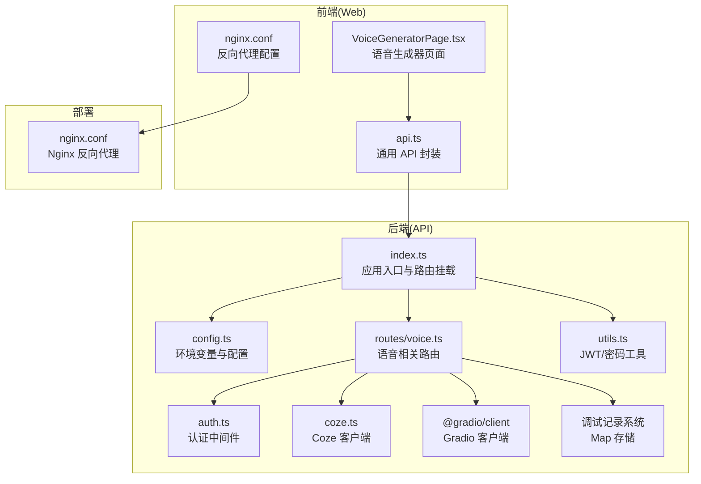
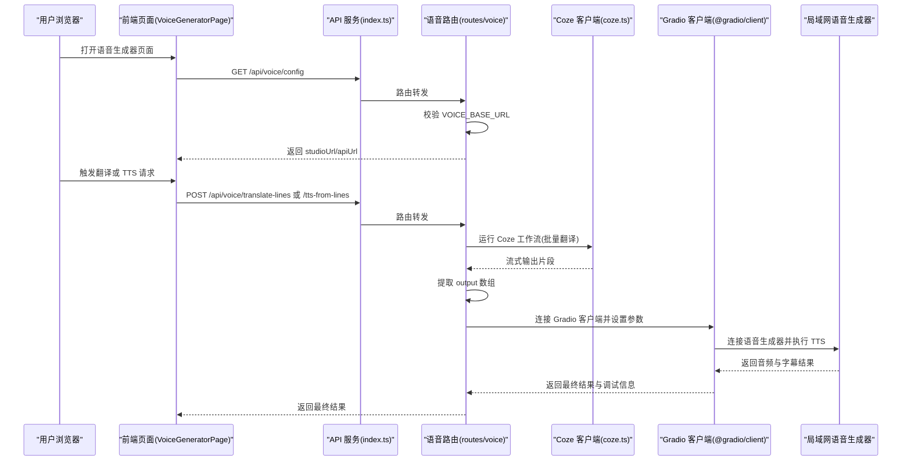
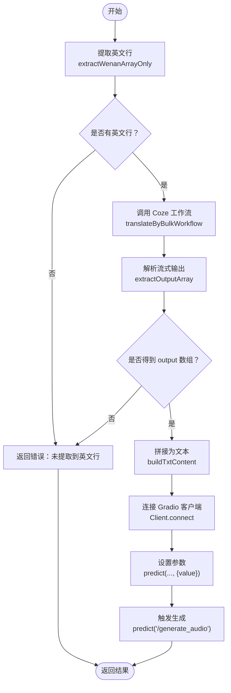

# 语音生成系统

<cite>
**本文引用的文件**
- [api/src/index.ts](file://api/src/index.ts)
- [api/src/config.ts](file://api/src/config.ts)
- [api/src/coze.ts](file://api/src/coze.ts)
- [api/src/middleware/auth.ts](file://api/src/middleware/auth.ts)
- [api/src/routes/voice.ts](file://api/src/routes/voice.ts)
- [api/src/utils.ts](file://api/src/utils.ts)
- [api/package.json](file://api/package.json)
- [web/src/pages/VoiceGeneratorPage.tsx](file://web/src/pages/VoiceGeneratorPage.tsx)
- [web/src/lib/api.ts](file://web/src/lib/api.ts)
- [web/nginx.conf](file://web/nginx.conf)
- [web/package.json](file://web/package.json)
</cite>

## 更新摘要
**变更内容**
- TTS 处理流程简化：移除文件处理步骤，直接通过 Gradio 客户端传递文本进行 TTS 生成
- 调试功能增强：新增完整的调试记录系统，支持步骤跟踪和错误诊断
- Gradio 客户端集成：新增 @gradio/client 依赖，提供更稳定的语音生成能力
- 参数配置优化：简化了 TTS 参数设置流程，移除了不必要的文件上传步骤

## 目录
1. [简介](#简介)
2. [项目结构](#项目结构)
3. [核心组件](#核心组件)
4. [架构总览](#架构总览)
5. [详细组件分析](#详细组件分析)
6. [依赖关系分析](#依赖关系分析)
7. [性能考虑](#性能考虑)
8. [故障排除指南](#故障排除指南)
9. [结论](#结论)
10. [附录](#附录)

## 简介
本系统是一个基于局域网的语音生成平台，提供以下能力：
- 局域网语音服务集成：通过统一的语音生成器界面，所有客户端共享同一台语音服务器的算力资源，降低本地硬件门槛。
- TTS 生成流程：支持从文案结果中提取英文行、批量翻译、构建文本并调用 Gradio 客户端连接语音生成器进行 TTS（含 MP3 和 SRT 输出），并提供完整的调试与监控。
- 调试与监控：内置调试记录存储、步骤日志与可视化列表，便于定位问题与优化流程。
- 与 Coze AI 的集成：通过 Coze API 工作流执行批量翻译，再由 Gradio 客户端连接本地语音生成器完成 TTS。
- 前端界面：提供语音生成器页面，展示服务地址与 API 文档链接，并在受保护路由下加载语音生成器 iframe。
- **新增**：简化的 TTS 处理流程，移除文件处理步骤，直接通过文本参数进行语音生成。

该文档面向初学者与开发者，既提供易懂的概念说明，也给出足够的技术细节与实践建议。

## 项目结构
系统采用前后端分离架构：
- 后端（API 服务）：基于 Express，提供认证中间件、路由模块（含语音相关路由）、环境变量配置与数据库初始化。
- 前端（Web 应用）：基于 React + Ant Design，提供受保护路由、语音生成器页面与通用 API 封装。
- 部署：使用 Nginx 提供静态服务和反向代理。



**图表来源**
- [api/src/index.ts:1-29](file://api/src/index.ts#L1-L29)
- [api/src/routes/voice.ts:1-391](file://api/src/routes/voice.ts#L1-L391)
- [api/src/middleware/auth.ts:1-23](file://api/src/middleware/auth.ts#L1-L23)
- [api/src/coze.ts:1-8](file://api/src/coze.ts#L1-L8)
- [api/src/config.ts:1-19](file://api/src/config.ts#L1-L19)
- [api/src/utils.ts:1-21](file://api/src/utils.ts#L1-L21)
- [web/src/pages/VoiceGeneratorPage.tsx:1-95](file://web/src/pages/VoiceGeneratorPage.tsx#L1-L95)
- [web/src/lib/api.ts:1-160](file://web/src/lib/api.ts#L1-L160)
- [web/nginx.conf:1-11](file://web/nginx.conf#L1-L11)

**章节来源**
- [api/src/index.ts:1-29](file://api/src/index.ts#L1-L29)
- [web/nginx.conf:1-11](file://web/nginx.conf#L1-L11)

## 核心组件
- API 应用入口与路由挂载：负责启动服务、启用 CORS 与 JSON 解析、挂载认证与各业务路由。
- 语音路由模块：提供语音配置查询、批量翻译、TTS 生成、调试记录管理等接口，现已集成 Gradio 客户端。
- 认证中间件：校验 Bearer Token，确保受保护接口的安全访问。
- Coze 客户端：封装 Coze API，用于工作流运行与流式输出解析。
- 配置模块：加载 .env 并校验必要环境变量，提供统一配置对象。
- 调试记录系统：新增的完整调试记录存储与管理功能，支持步骤跟踪和错误诊断。
- 前端语音生成器页面：展示语音服务地址与 API 文档，加载语音生成器 iframe。
- 前端 API 封装：统一处理鉴权头、错误响应与 SSE 流式事件。
- **新增**：Gradio 客户端集成：通过 @gradio/client 连接局域网语音生成器，实现 TTS 功能。

**章节来源**
- [api/src/index.ts:1-29](file://api/src/index.ts#L1-L29)
- [api/src/routes/voice.ts:1-391](file://api/src/routes/voice.ts#L1-L391)
- [api/src/middleware/auth.ts:1-23](file://api/src/middleware/auth.ts#L1-L23)
- [api/src/coze.ts:1-8](file://api/src/coze.ts#L1-L8)
- [api/src/config.ts:1-19](file://api/src/config.ts#L1-L19)
- [web/src/pages/VoiceGeneratorPage.tsx:1-95](file://web/src/pages/VoiceGeneratorPage.tsx#L1-L95)
- [web/src/lib/api.ts:1-160](file://web/src/lib/api.ts#L1-L160)

## 架构总览
系统采用"前端受控 + 后端代理 + 局域网语音服务"的模式：
- 前端通过受保护路由访问语音生成器页面，页面加载时请求后端获取语音服务地址与 API 文档地址。
- 后端提供语音相关接口，内部通过 Coze 工作流进行批量翻译，再通过 Gradio 客户端连接局域网语音生成器执行 TTS。
- 调试记录在后端内存中维护，支持按 ID 查询与列表查看，便于问题定位。
- Nginx 反向代理确保前端静态资源正确提供服务。



**图表来源**
- [api/src/index.ts:1-29](file://api/src/index.ts#L1-L29)
- [api/src/routes/voice.ts:165-207](file://api/src/routes/voice.ts#L165-L207)
- [api/src/routes/voice.ts:211-254](file://api/src/routes/voice.ts#L211-L254)
- [api/src/coze.ts:1-8](file://api/src/coze.ts#L1-L8)
- [web/src/pages/VoiceGeneratorPage.tsx:10-25](file://web/src/pages/VoiceGeneratorPage.tsx#L10-L25)

## 详细组件分析

### 语音路由模块（routes/voice.ts）
职责与流程：
- 语音配置查询：返回语音生成器 Studio 地址与 API 文档地址，若未配置则返回错误。
- 文案提取与批量翻译：从文案结果中提取英文行，调用 Coze 工作流执行批量翻译，解析流式输出，提取最终数组。
- TTS 生成：将英文行拼接为文本，通过 Gradio 客户端连接局域网语音生成器，依次设置参数并触发生成，返回音频与字幕结果。
- 调试记录：以内存 Map 存储调试记录，限制最大数量；支持按 ID 查询与列表查看。

**更新**：TTS 处理流程已简化，移除了文件处理步骤，直接通过文本参数进行语音生成。

**新增功能**：
- **Gradio 客户端集成**：`@gradio/client` 用于连接局域网语音生成器，替代原有的直接 API 调用。
- **批量翻译接口**：`/api/voice/translate-lines` 支持从文案结果中提取英文行并进行批量翻译。
- **直接 TTS 接口**：`/api/voice/tts-from-lines` 支持直接从英文数组生成语音（MP3+SRT）。
- **调试记录管理**：提供 `/api/voice/debug` 和 `/api/voice/debug/:id` 接口用于调试记录查询。
- **调试记录系统**：新增完整的调试记录存储与管理功能，支持步骤跟踪和错误诊断。

关键算法与数据结构：
- 文本提取算法：支持从 JSON 对象、字符串数组、字符串中提取英文行，具备容错与回退逻辑。
- 流式解析：遍历 Coze 工作流的流式片段，优先从 data.content 或 data.data 中提取 output 数组。
- 参数配置：通过多次 predict 调用设置语音生成器参数，包括增强开关、采样率、步数等。
- **新增**：DebugRecord 类型定义，包含调试记录的完整结构和步骤跟踪功能。



**图表来源**
- [api/src/routes/voice.ts:90-163](file://api/src/routes/voice.ts#L90-L163)
- [api/src/routes/voice.ts:165-207](file://api/src/routes/voice.ts#L165-L207)
- [api/src/routes/voice.ts:209-254](file://api/src/routes/voice.ts#L209-L254)

**章节来源**
- [api/src/routes/voice.ts:1-391](file://api/src/routes/voice.ts#L1-L391)

### 认证中间件（middleware/auth.ts）
- 从 Authorization 头中提取 Bearer Token。
- 使用 JWT 秘钥验证令牌有效性，注入用户信息到请求对象，放行后续路由。
- 未携带或无效令牌时返回 401。

**章节来源**
- [api/src/middleware/auth.ts:1-23](file://api/src/middleware/auth.ts#L1-L23)
- [api/src/utils.ts:14-20](file://api/src/utils.ts#L14-L20)

### Coze 客户端（coze.ts）
- 初始化 Coze API 客户端，使用配置中的 token 与基础 URL。
- 供语音路由模块调用工作流运行与流式输出解析。

**章节来源**
- [api/src/coze.ts:1-8](file://api/src/coze.ts#L1-L8)

### 配置模块（config.ts）
- 加载 .env 并校验必需环境变量：COZE_API_TOKEN、DATABASE_URL、JWT_SECRET、VOICE_BASE_URL。
- 暴露统一配置对象，供其他模块使用。

**章节来源**
- [api/src/config.ts:1-19](file://api/src/config.ts#L1-L19)

### 调试记录系统
**新增**：完整的调试记录存储与管理系统，包含以下功能：

- **DebugRecord 类型定义**：包含 id、createdAt、input、steps、result、error 等字段。
- **内存存储**：使用 Map 存储调试记录，限制最大数量为 50 条。
- **步骤跟踪**：每个操作都会记录到 steps 数组中，包含 step 名称、payload 内容和时间戳。
- **错误处理**：捕获异常并将错误信息存储到 error 字段中。
- **日志输出**：使用 console.log 输出调试信息，便于开发和生产环境监控。

**章节来源**
- [api/src/routes/voice.ts:9-28](file://api/src/routes/voice.ts#L9-L28)
- [api/src/routes/voice.ts:32-58](file://api/src/routes/voice.ts#L32-L58)
- [api/src/routes/voice.ts:243-260](file://api/src/routes/voice.ts#L243-L260)

### 前端语音生成器页面（web/src/pages/VoiceGeneratorPage.tsx）
- 初始化时请求后端获取语音服务地址与 API 文档地址。
- 渲染服务地址与 API 文档链接，并在受保护路由下加载语音生成器 iframe。
- 提供新标签页打开与 API 页面打开的按钮。

**章节来源**
- [web/src/pages/VoiceGeneratorPage.tsx:1-95](file://web/src/pages/VoiceGeneratorPage.tsx#L1-L95)

### 前端 API 封装（web/src/lib/api.ts）
- 统一处理鉴权头（Bearer Token）与错误响应。
- 提供语音配置、翻译与 TTS 接口的封装。
- 支持 SSE 流式事件解析（用于其他模块运行流）。

**章节来源**
- [web/src/lib/api.ts:1-160](file://web/src/lib/api.ts#L1-L160)

## 依赖关系分析
- 后端依赖：
  - @coze/api：调用 Coze 工作流。
  - express/cors：HTTP 服务与跨域支持。
  - dotenv：加载环境变量。
  - jsonwebtoken/bcryptjs：JWT 与密码处理。
  - **新增**：@gradio/client：连接局域网语音生成器。
  - pg：PostgreSQL 客户端（用于数据库）。
- 前端依赖：
  - antd/react/react-router-dom：UI 与路由。
  - 开发工具：vite/typescript 等。

```mermaid
graph LR
subgraph "后端依赖(api/package.json)"
COZE["@coze/api"]
EXP["express/cors"]
DOT["dotenv"]
JWT["jsonwebtoken"]
BC["bcryptjs"]
GRADIO["@gradio/client"]
PG["pg"]
DEBUG["调试记录系统"]
END
subgraph "前端依赖(web/package.json)"
ANT["antd"]
RRD["react-router-dom"]
VITE["vite/typescript"]
NGINX["nginx.conf"]
END
COZE --> VOICE["routes/voice.ts"]
EXP --> IDX["index.ts"]
DOT --> CFG["config.ts"]
JWT --> AUTH["auth.ts"]
BC --> UTIL["utils.ts"]
GRADIO --> VOICE
PG --> IDX
ANT --> WG["VoiceGeneratorPage.tsx"]
RRD --> APP["App.tsx"]
VITE --> WG
NGINX --> DC["nginx.conf"]
DEBUG --> VOICE
```

**图表来源**
- [api/package.json:11-37](file://api/package.json#L11-L37)
- [web/package.json:11-26](file://web/package.json#L11-L26)

**章节来源**
- [api/package.json:11-37](file://api/package.json#L11-L37)
- [web/package.json:11-26](file://web/package.json#L11-L26)

## 性能考虑
- 语音生成器连接与参数设置：通过多次 predict 调用调整参数，建议在稳定后固化参数，减少不必要的重复调用。
- 文本预处理：确保输入英文行无多余空行与空白字符，避免生成器重复处理无效内容。
- 流式翻译：Coze 工作流采用流式输出，注意及时消费与解析，避免内存堆积。
- 调试记录：内存 Map 仅保存最近 50 条调试记录，避免长期运行导致内存膨胀。
- 网络与带宽：局域网语音服务需保证网络稳定性与带宽，避免生成过程中断。
- 前端 iframe：首次加载可能较慢，建议在页面初始化时预取配置，提升用户体验。
- **新增**：Gradio 客户端性能：通过 @gradio/client 连接语音生成器，支持更高效的参数设置和音频生成。
- **新增**：简化的 TTS 流程：移除文件处理步骤，直接通过文本参数进行生成，提高效率并减少错误。

## 故障排除指南
常见问题与排查步骤：
- 未配置语音服务地址
  - 现象：请求 /api/voice/config 返回 500，提示未配置 VOICE_BASE_URL。
  - 处理：检查后端环境变量或配置文件，确保 VOICE_BASE_URL 正确设置。
- 未登录或 Token 失效
  - 现象：受保护接口返回 401。
  - 处理：前端会在 401 时清理 Token 并跳转登录页；确认登录状态与 Token 是否过期。
- 文案未提取到英文行
  - 现象：翻译接口返回错误，提示未提取到 wenan_Array_string。
  - 处理：检查文案结果格式，确保包含英文行数组或可识别的字段。
- Coze 工作流未返回 output 数组
  - 现象：批量翻译流程抛出异常。
  - 处理：检查工作流配置与输入参数，确认输出结构符合预期。
- **新增**：Gradio 客户端连接失败
  - 现象：TTS 步骤报连接错误。
  - 处理：确认局域网语音生成器地址可达，检查防火墙与端口配置，验证 Gradio 客户端版本兼容性。
- 调试记录缺失
  - 现象：无法通过 /api/voice/debug/:id 查到记录。
  - 处理：确认调试记录未被清理（超过 50 条会删除最早记录）。
- **新增**：API 基础地址配置错误
  - 现象：前端请求指向错误的主机地址。
  - 处理：检查 VITE_API_BASE 环境变量配置，确保使用正确的服务器地址。
- **新增**：TTS 生成失败
  - 现象：/api/voice/tts-from-lines 接口返回 500 错误。
  - 处理：检查调试记录中的 error 字段，确认语音生成器参数设置是否正确，验证文本内容格式。

**章节来源**
- [api/src/routes/voice.ts:69-86](file://api/src/routes/voice.ts#L69-L86)
- [api/src/routes/voice.ts:297-310](file://api/src/routes/voice.ts#L297-L310)
- [api/src/routes/voice.ts:202-204](file://api/src/routes/voice.ts#L202-L204)
- [api/src/routes/voice.ts:213](file://api/src/routes/voice.ts#L213)
- [api/src/routes/voice.ts:256-262](file://api/src/routes/voice.ts#L256-L262)

## 结论
本系统通过"前端受控 + 后端代理 + 局域网语音服务"的架构，实现了统一的语音生成能力与良好的可运维性。其核心优势在于：
- 易于扩展：新增模块可通过现有路由与中间件快速接入。
- 可观测性强：完善的调试记录与步骤日志，便于问题定位。
- 安全可控：统一认证与受保护路由，保障接口安全。
- 低门槛：前端无需本地算力即可使用语音生成器。
- **新增**：简化的 TTS 处理流程，移除文件处理步骤，直接通过文本参数进行生成，提高效率并减少错误。
- **新增**：增强的调试功能，提供完整的步骤跟踪和错误诊断能力。

## 附录

### API 调用示例（路径与用途）
- 获取语音服务配置
  - 方法：GET
  - 路径：/api/voice/config
  - 用途：获取语音生成器 Studio 地址与 API 文档地址
  - 权限：已登录
- 批量翻译（从文案结果提取英文行并翻译）
  - 方法：POST
  - 路径：/api/voice/translate-lines
  - 请求体：包含 text 字段（或 lines 数组）
  - 返回：sourceLines、translatedLines、txt 以及调试信息
  - 权限：已登录
- 直接 TTS（从英文数组生成音频与字幕）
  - 方法：POST
  - 路径：/api/voice/tts-from-lines
  - 请求体：包含 lines 数组
  - 返回：lines、txt、tts 以及调试信息
  - 权限：已登录
- 调试记录查询
  - 列表：GET /api/voice/debug
  - 单条：GET /api/voice/debug/:id

**章节来源**
- [api/src/routes/voice.ts:69-86](file://api/src/routes/voice.ts#L69-L86)
- [api/src/routes/voice.ts:276-341](file://api/src/routes/voice.ts#L276-L341)
- [api/src/routes/voice.ts:343-402](file://api/src/routes/voice.ts#L343-L402)
- [api/src/routes/voice.ts:256-273](file://api/src/routes/voice.ts#L256-L273)

### 参数配置清单
- 必需环境变量（后端）
  - COZE_API_TOKEN：Coze API 访问令牌
  - DATABASE_URL：数据库连接串
  - JWT_SECRET：JWT 签名密钥
  - VOICE_BASE_URL：局域网语音生成器基础地址
  - PORT：服务监听端口（默认 3000）
- **新增**：前端环境变量
  - VITE_API_BASE：API 基础地址（可为空，使用相对路径）

**章节来源**
- [api/src/config.ts:5-19](file://api/src/config.ts#L5-L19)
- [web/src/lib/api.ts:1](file://web/src/lib/api.ts#L1)

### 集成与部署要点
- 前端开发：使用 Vite，默认端口 5173；生产构建后由 Nginx 提供静态服务（参考项目中的 nginx.conf）。
- 后端开发：使用 TypeScript 与 TSX，开发模式下热更新。
- **新增**：Gradio 客户端配置：确保局域网语音生成器支持 Gradio 协议，验证客户端版本兼容性。
- **新增**：调试记录管理：系统自动管理最多 50 条调试记录，超出数量会自动清理最早的记录。

**章节来源**
- [web/vite.config.ts:1-10](file://web/vite.config.ts#L1-L10)
- [web/nginx.conf:1-11](file://web/nginx.conf#L1-L11)

### TTS 功能使用指南
- **批量翻译流程**：
  1. 访问产品文案生成页面
  2. 点击"开始生成"生成文案
  3. 点击"独立英译"进行批量翻译
  4. 点击"生成语音"完成 TTS 生成
- **直接 TTS 流程**：
  1. 准备英文行数组
  2. 调用 `/api/voice/tts-from-lines` 接口
  3. 获取 MP3 和 SRT 文件结果
- **调试与监控**：
  1. 查看 `/api/voice/debug` 获取调试记录列表
  2. 通过 `/api/voice/debug/:id` 查看具体调试详情
  3. 分析调试记录中的步骤日志和错误信息
  4. **新增**：查看步骤跟踪信息，了解每个操作的具体参数和结果

**章节来源**
- [api/src/routes/voice.ts:256-273](file://api/src/routes/voice.ts#L256-L273)
- [api/src/routes/voice.ts:276-341](file://api/src/routes/voice.ts#L276-L341)
- [api/src/routes/voice.ts:343-402](file://api/src/routes/voice.ts#L343-L402)

### 调试记录详解
**新增**：完整的调试记录系统使用指南：

- **调试记录结构**：
  - id：唯一标识符
  - createdAt：创建时间
  - input：输入数据，包含 lines、textPreview、extractedLines
  - steps：步骤数组，包含每个操作的详细信息
  - result：最终结果
  - error：错误信息

- **步骤跟踪内容**：
  - bulk_translate_input：批量翻译输入参数
  - bulk_translate_raw_chunks：原始流式输出片段
  - bulk_translate_output：最终输出数组
  - tts_input_txt：TTS 输入文本
  - tts_lambda 系列：各种参数设置步骤
  - tts_generate_audio：生成结果

- **调试记录管理**：
  - 最大保存 50 条记录
  - 自动清理最早的记录
  - 支持按 ID 查询和列表查看

**章节来源**
- [api/src/routes/voice.ts:9-28](file://api/src/routes/voice.ts#L9-L28)
- [api/src/routes/voice.ts:32-58](file://api/src/routes/voice.ts#L32-L58)
- [api/src/routes/voice.ts:243-260](file://api/src/routes/voice.ts#L243-L260)